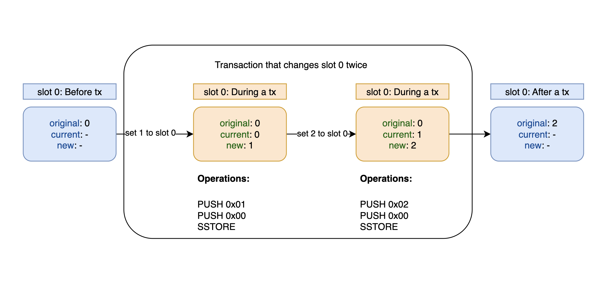
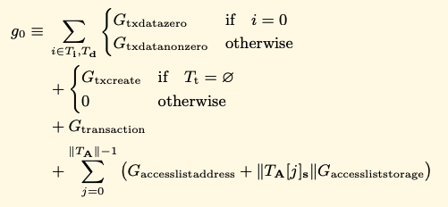
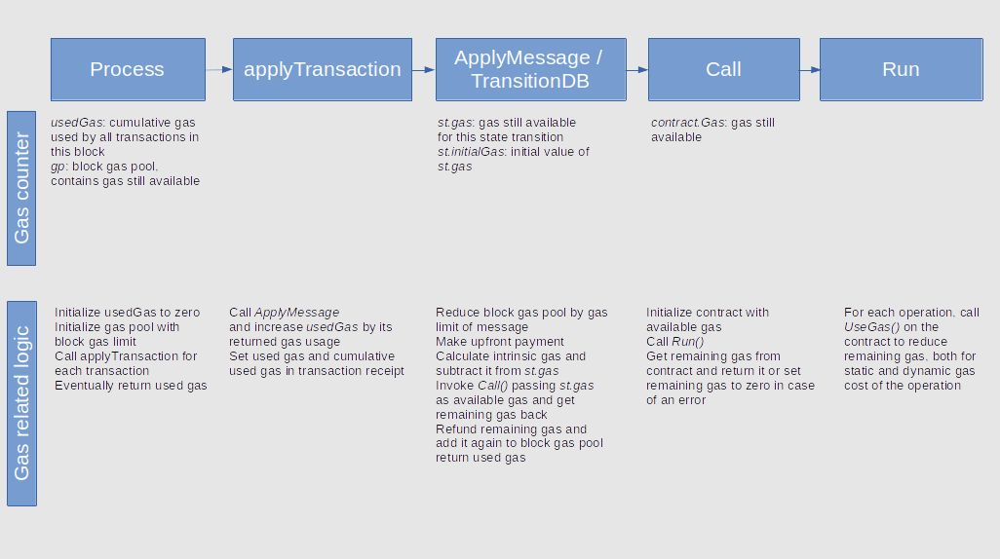

# Gas used part 2: Storage gas calculation

**Author:** [Roman Yarlykov](https://github.com/rlkvrv) 🧐

After exploring the general mechanics of gas calculation for transactions in the first part of the article, in this part of our deep dive into the world of Ethereum, we will focus on operations with storage (`storage`). We will review the history of changes related to gas calculation in Ethereum to see the principles on which the community based its decisions on changes in the "rules of the game" and how, based on this history, to correctly perform gas calculations today.

## Dynamic Gas Calculation for the SSTORE Operation

There are complex rules associated with `SSTORE`, which can be challenging to understand and remember at first. The main idea of these rules is to make the first write to a slot (or changing a value from 0 to non-zero) more expensive in terms of gas, compared to subsequent rewrites, as the slot is already initialized in the database. Moreover, it is important to incentivize the cleaning of the blockchain from unnecessary data. Therefore, if a value in a slot is set back to 0, a gas refund is provided.

### Original Mechanism of Calculation

In the early days of Ethereum, the gas calculation for `SSTORE` was as follows:

-   20,000 gas for setting a slot value from 0 to non-zero;
-   5,000 gas for any other changes to the slot value;
-   A refund of 10,000 gas for setting a slot value from non-zero to 0. Refunds occurred at the end of the transaction.

### EIP-1087: Gas Accounting for SSTORE Operations

These simple rules, laid down from the beginning, led to a number of edge cases, described in the "motivation" section of [EIP-1087](https://eips.ethereum.org/EIPS/eip-1087), where gas consumption was irrational and unfair:

-   A contract with an empty storage, setting a slot first to 1, then back to 0, consumes `20,000 + 5,000 - 10,000 = 15,000` gas, even though such a sequence of operations does not require disk writing. This can be used, for example, in reentrancy protection mechanisms.
-   A contract that increases the value of slot 0 five times consumes `20,000 + 5 * 5,000 = 45,000` gas, while such a sequence of operations requires as much disk activity as one write, costing 20,000 gas.
-   Transferring funds from account A to B, then from B to C, assuming all accounts have non-zero initial and final balances, costs `5,000 * 4 = 20,000` gas.

#### Dirty Map

As a solution, it was proposed to use a **"dirty map"**, which records all accesses to storage during the current transaction.

> Dirty map is a key-value data structure recording all modified storage slots in all contracts during the transaction.

For repeated rewrites, it was proposed to set the cost at 200 units of gas, along with a counter for gas refunds.

The extreme cases described above, after the implementation of EIP-1087, looked like this:

-   If a contract with empty storage sets slot 0 to 1 and then back to 0, it will be charged `20,000 + 200 - 19,800 = 400` gas, less compared to 15,000.
-   A contract with empty storage, which increases slot 0 five times, will be charged `20,000 + 5 * 200 = 21,000` gas, less compared to 45,000.
-   Transferring the balance from account A to B, followed by a transfer from B to C, with all non-zero initial and final balances, will cost `5,000 * 3 + 200 = 15,200` gas, less compared to 20,000.

All conditions are listed in the [test cases](https://eips.ethereum.org/EIPS/eip-1087#test-cases) of EIP-1087, totaling 12.

### EIP-1283: Gas Accounting for SSTORE without Dirty Map

The implementation of the "dirty map" concept proved to be complex, leading to the development of [EIP-1283](https://eips.ethereum.org/EIPS/eip-1283), based on EIP-1087. EIP-1283 proposes a new system for determining the cost of gas for storage operations. The values set in `storage` are classified as follows:

-   **Original value of the storage slot:** The value of the slot if a rollback occurs within the current transaction.
-   **Current value of the storage slot:** The value of the slot before executing the SSTORE operation.
-   **New value of the storage slot:** The value of the slot after executing the SSTORE operation.

Let's take a small snippet of code that takes the value of the `ChangeNumberTwice` smart contract from slot 0 and changes it twice during the execution of a transaction calling the `set()` function:

```js
contract ChangeNumberTwice {
    uint256 public amount; // It equals 0 before the transaction.
    function set() external {
        amount = 1; // до SSTORE: original = 0; current = 0; new = 1;
        amount = 2; // до SSTORE: original = 0; current = 1; new = 2;
    }
}

```

Here's how it looks in a diagram:



In addition, instead of a "dirty map," three states of storage are introduced:

-   **No-op (No operation):** The operation doesn't require changes if the `current` value == `new` value.
-   **Fresh:** The slot has not been changed or has been returned to its `original` value. Applied when the `current` value != `new` value, but matches the `original`.
-   **Dirty:** The slot has already been changed. Applied when the `current` value is different from both `new` and `original` values.

Unlike EIP-1087, this approach is easier to implement and can handle even more [edge cases](https://eips.ethereum.org/EIPS/eip-1283#test-cases) (17 in total).

If we go back to the geth client code, we'll see that for the `dynamicGas` of the `SSTORE` opcode, the function `gasSStore` is set.


```go
SSTORE: {
    execute:    opSstore,
    dynamicGas: gasSStore,
    minStack:   minStack(2, 0),
    maxStack:   maxStack(2, 0),
},
```

In the code of the [gasSStore](https://github.com/ethereum/go-ethereum/blob/ae4ea047e35bb35828231f1b93f2f65a964abdc9/core/vm/gas_table.go#L98) function, the following comments are encountered:


```go
// Deprecated gas accounting mechanism, only considers the current state.
// Rules of the deprecated mode should be applied if we are in Petersburg
// (when EIP-1283 was cancelled) OR if Constantinople is not active.
if evm.chainRules.IsPetersburg || !evm.chainRules.IsConstantinople {
    // ...
    // Gas calculation logic for the St. Petersburg hard fork and all others
// except the Constantinople hard fork.
}
```

Which raises several questions regarding the Petersburg and Constantinople hard forks, as well as EIP-1283. Let's clarify:

1. **Petersburg Hard Fork:** Although it's not officially mentioned in the [history](https://ethereum.org/en/history) of Ethereum hard forks, Petersburg is essentially part of the Constantinople hard fork. It was introduced to reverse EIP-1283 due to a discovered vulnerability.
2. **EIP-1283 and Constantinople:** EIP-1283 was included in the initial plan for the Constantinople hard fork, but its implementation was cancelled due to a discovered vulnerability to reentrancy attacks.
3. **Constantinople's Interaction with EIP-1283:** Despite EIP-1283 being cancelled, its code remained in some test versions and clients until the official release of Constantinople.
4. **Cancellation of EIP-1283:** EIP-1283 was cancelled due to the discovery of a vulnerability that allowed for reentrancy attacks. This led to the need for changes and the creation of the Petersburg hard fork along with Constantinople to address this issue.

As a result, the outdated mechanism for gas accounting described at the beginning of the article continued to operate in the Ethereum mainnet, instead of the implementation proposed in EIP-1283.

### EIP-2200: Structured Definitions for Gas Accounting

So, we are back to where we started, moving to the next hard fork - [Istanbul](https://ethereum.org/en/history#istanbul), which introduces two gas-related proposals: [EIP-2200](https://eips.ethereum.org/EIPS/eip-2200) and [EIP-1884](https://eips.ethereum.org/EIPS/eip-1884) (technically three, but EIP-1108 is related to cryptography).

The main changes are as follows:

-   **EIP-2200:** Builds on EIP-1283 and [EIP-1706](https://eips.ethereum.org/EIPS/eip-1706), the latter of which fixes the vulnerability in EIP-1283. Now, if the remaining gas (`gasleft`) in a transaction is less than or equal to the Ether transfer stipend (2300 gas), the transaction is cancelled with an `out of gas` error.
-   **Explicit Gas Variables:** Introduction of variables such as `SSTORE_SET_GAS` in EIP-2200 for explicit accounting of changes in gas costs.
-   **Cost of Dirty Storage Access:** In EIP-2200, the cost of accessing "dirty storage" is set in the variable `SLOAD_GAS` and is 800 gas units.
-   **Increase in `SLOAD` Cost:** In EIP-1884, the cost of the `SLOAD` operation increased from 200 to 800 gas units.
-   **Structural Changes in EIP-2200:** Modifications in the implementation of EIP-1283 are made, improving the structure and correcting the identified shortcomings.

#### EIPs in geth

The [eips.go](https://github.com/ethereum/go-ethereum/blob/master/core/vm/eips.go) file in the geth client includes all changes related to EIPs, including EIP-2200, implemented after the Istanbul hard fork. Here is the function responsible for the changes:

```go
    func enable2200(jt *JumpTable) {
        jt[SLOAD].constantGas = params.SloadGasEIP2200
        jt[SSTORE].dynamicGas = gasSStoreEIP2200
    }
```

These lines of code reflect the following:

- **Change in the cost of `SLOAD`:** The constant gas value for `SLOAD` has been changed to 800 units, which corresponds to the new parameters defined in EIP-2200. The variables related to gas can be found in [protocol_params.go](https://github.com/ethereum/go-ethereum/blob/master/params/protocol_params.go#L108).

- **Change in the gas calculation function for `SSTORE`:** A new function `gasSStoreEIP2200` has been introduced, replacing the outdated `gasSStore` function. This new function takes into account the changes introduced by EIP-2200 and provides a more accurate calculation of gas costs for `SSTORE` operations. The code for this function is available in [gas_table.go](https://github.com/ethereum/go-ethereum/blob/7596db5f485e29dbbb66add8fcad6e25368bf96b/core/vm/gas_table.go#L183).

#### Test Cases

EIP-2200 provides a [table](https://arc.net/l/quote/kskrsgme) with test cases. I will demonstrate the gas calculation using two cases with and without refunds:

| Code                   | Used Gas | Refund | Original | Current | New |
| ---------------------- | -------- | ------ | -------- | ------- | --- |
| 0x60006000556000600055 | 1612     | 0      | 0        | 0       | 0   |
| 0x60006000556000600055 | 5812     | 15000  | 1        | 0       | 0   |

It's important to understand a couple of points:

1. The code is written to set values for `current` and `new`, as `original` represents the value before the transaction is executed (assuming it's already stored in the slot beforehand).
2. These specific test cases use the same code but different values; there is no error here.

##### Test Case 1

| Code                   | Used Gas | Refund | Original | 1st | 2nd |
| ---------------------- | -------- | ------ | -------- | --- | --- |
| 0x60006000556000600055 | 1612     | 0      | 0        | 0   | 0   |

Let's break down the code into opcodes and record how much gas each opcode consumes. Then we'll calculate how much gas was used and how much was accumulated in the **refund** counter.

| Operation  | Values                             | Gas  | Condition                      |
| ---------- | ---------------------------------- | ---- | ------------------------------ |
| PUSH1 0x00 | -                                  | 3    | -                              |
| PUSH1 0x00 | -                                  | 3    | -                              |
| SSTORE     | original = 0; current = 0; new = 0 | 800  | **current** == **new** (No-op) |
| PUSH1 0x00 | -                                  | 3    | -                              |
| PUSH1 0x00 | -                                  | 3    | -                              |
| SSTORE     | original = 0; current = 0; new = 0 | 800  | **current** == **new** (No-op) |
| **Total**  | 3 + 3 + 800 + 3 + 3 + 800          | 1612 | -                              |
| **Refund** | -                                  | 0    | -                              |

In this situation, the rule applied in both `sstore` operations is:

- If the current value equals the new value (this is a no-op), `SLOAD_GAS` is deducted.

The constant `SLOAD_GAS` is 800.

##### Test Case 2

| Code                   | Used Gas | Refund | Original | Current | New |
| ---------------------- | -------- | ------ | -------- | ------- | --- |
| 0x60006000556000600055 | 5812     | 15000  | 1        | 0       | 0   |

The transaction flow is as follows:

| Code        | Description                        | Gas   | Comment                                                              |
| ----------- | ---------------------------------- | ----- | -------------------------------------------------------------------- |
| PUSH1 0x00  | -                                  | 3     | -                                                                    |
| PUSH1 0x00  | -                                  | 3     | -                                                                    |
| SSTORE      | original = 1; current = 1; new = 0 | 5000  | **current** != **new**, **original** != **current** (Dirty, refund 15000) |
| PUSH1 0x00  | -                                  | 3     | -                                                                    |
| PUSH1 0x00  | -                                  | 3     | -                                                                    |
| SSTORE      | original = 1; current = 0; new = 0 | 800   | **current** == **new** (No-op)                                      |
| **Total**   | 3 + 3 + 5000 + 3 + 3 + 800         | 5812  | -                                                                    |
| **Refund**  | -                                  | 15000 | -                                                                    |

In the first `sstore`, the following rules are applied:


-   **If current value does not equal new value**
    -   **If original value equals current value (this storage slot has not been changed by the current execution context)**
        -   If original value is 0, SSTORE_SET_GAS is deducted.
        -   **Otherwise, SSTORE_RESET_GAS gas is deducted. If new value is 0, add SSTORE_CLEARS_SCHEDULE gas to refund counter.**

The variable SSTORE_RESET_GAS = 5000, SSTORE_CLEARS_SCHEDULE = 15000.

These two examples illustrate the overall logic. Try performing a similar calculation for other test cases to enhance your understanding, as knowledge of the EIP-2200 conditions will still be useful.

## Warm and Cold Access

After the Istanbul hard fork, the [Berlin](https://ethereum.org/en/history#berlin) hard fork made significant changes related to gas in Ethereum. One of the key proposals was [EIP-2929: Gas cost increases for state access opcodes](https://eips.ethereum.org/EIPS/eip-2929). These changes affected the calculation of the dynamic gas for `SSTORE`.

EIP-2929 introduced three new constants that introduce the concepts of "warm" and "cold" access, applied not only to storage operations but also to other opcodes that interact with the blockchain state, such as `SLOAD`, the `*CALL` family, `BALANCE`, the `EXT*` family, and `SELFDESTRUCT`.

| Constant                 | Value |
| ------------------------ | ----- |
| COLD_SLOAD_COST          | 2100  |
| COLD_ACCOUNT_ACCESS_COST | 2600  |
| WARM_STORAGE_READ_COST   | 100   |

> Cold access refers to the first access to a specific slot in an account's storage within a transaction (loading data).
> Warm access means that the same slot has already been accessed within the same transaction (the slot is warmed).

This innovation is necessary to optimize network operation and distribute resources more efficiently.

The values of old parameters have also changed:

| Parameter        | Old value | New value                     |
| ---------------- | --------- | ----------------------------- |
| SLOAD            | 800       | 2100                          |
| SLOAD_GAS        | 800       | 100 (=WARM_STORAGE_READ_COST) |
| SSTORE_RESET_GAS | 5000      | 2900 (5000 - COLD_SLOAD_COST) |

_Important!_ EIP-2929 does not negate the concepts of "Fresh" and "Dirty" storage, as well as the gradation of values for original/current/new from EIP-2200 (in the context of storage access). In addition to all of this, there are first and subsequent accesses (cold and warm) to slots.

_Important!_ These access distinctions apply to other opcodes as well, not just to `SLOAD` and `SSTORE`. This is a key point in understanding this EIP.

If we take the first test case from EIP-2200, the changes are as follows:

Before:
| Code                   | Used Gas | Refund | Original | 1st | 2nd | 3rd |
| ---------------------- | -------- | ------ | -------- | --- | --- | --- |
| 0x600060055600600055    | 1612     | 0      | 0        | 0   | 0   | 0   |


```
    PUSH1 + PUSH1 + SSTORE + PUSH1 + PUSH1 + SSTORE
    3 + 3 + 800 + 3 + 3 + 800 = 1612
```

After:
| Code | Used Gas | Refund | Original | 1st | 2nd | 3rd |
| -------------------- | -------- | ------ | -------- | --- | --- | --- |
| 0x600060055600600055 | 2312 | 0 | 0 | 0 | 0 | 0 |

```
    PUSH1 + PUSH1 + SSTORE + PUSH1 + PUSH1 + SSTORE
    3 + 3 + (2100 + 100) + 3 + 3 + 100 = 2300
```

So, previously, each subsequent write to the same slot (in the case where **current** == **original**) would cost 800 gas units. After EIP-2929, the very first access within a single transaction will be more expensive (2200), but all subsequent accesses will be significantly cheaper (100).

Additionally, the logic regarding gas refunds has changed due to the modification of `SSTORE_RESET_GAS`.

### Access Lists

The second key change introduced by the Berlin hard fork is [EIP-2930: Optional access lists](https://eips.ethereum.org/EIPS/eip-2930), which introduces so-called access lists. This proposal is designed to mitigate the effects introduced by EIP-2929 and offers a new transaction type (type 1) with the inclusion of an access list. It also introduces new constants:

| Constant                     | Value |
| ---------------------------- | ----- |
| ACCESS_LIST_STORAGE_KEY_COST | 1900  |
| ACCESS_LIST_ADDRESS_COST     | 2400  |

Access lists in these type 1 transactions allow specifying in advance which addresses and storage keys will be accessed during the transaction. This reduces the gas cost for "cold" accesses if they are pre-specified in the access list, thus mitigating the impact of increased gas costs for "cold" reads introduced in EIP-2929.

The idea is as follows. The transaction initiator can make this transaction slightly cheaper if two conditions are met:

- The transaction initiator calls smart contract A, which in turn calls smart contracts B, C, and so on. In this case, `ACCESS_LIST_ADDRESS_COST` is applied to the smart contracts called from A - i.e., smart contract B, C, and so on.
- The initiator knows the addresses of the smart contracts called by contract A and the memory slots these smart contracts access.

When these conditions are met, the cost of the first (cold) access to `CALL` and `SLOAD` opcodes for smart contract B is reduced:

| Constant                     | Smart Contract | CALL | SLOAD |
| ---------------------------- | -------------- | ---- | ----- |
| ACCESS_LIST_STORAGE_KEY_COST | A              | 2600 | 2400  |
| ACCESS_LIST_ADDRESS_COST     | B              | 2100 | 1900  |

#### Implementation of Access Lists in the geth client

To implement EIP-2929 with "warm" and "cold" storage access in the [StateDB interface](https://github.com/ethereum/go-ethereum/blob/f55a10b64d511b27beb02ff4978a6ed66d604cd8/core/vm/interface.go#L66), two fields were added: `AddressInAccessList` and `SlotInAccessList`. When a variable is first read (i.e., "cold" access), it is registered in `SlotInAccessList`. Subsequent accesses to this variable (i.e., "warm" accesses) consume less gas.

For a detailed examination, you can refer to the [enable2929](https://github.com/ethereum/go-ethereum/blob/18e154eaa24d5f7a8b3c48983ad591e6c10963ca/core/vm/eips.go#L120) function, particularly the gas calculation function for the `SLOAD` opcode - `gasSLoadEIP2929`:

```go
func enable2929(jt *JumpTable) {
    jt[SSTORE].dynamicGas = gasSStoreEIP2929

    jt[SLOAD].constantGas = 0
    jt[SLOAD].dynamicGas = gasSLoadEIP2929

    // ...
}
```

The function [gasSLoadEIP2929](https://github.com/ethereum/go-ethereum/blob/f55a10b64d511b27beb02ff4978a6ed66d604cd8/core/vm/operations_acl.go#L103) looks like this:

```go
// For SLOAD, if the pair (address, storage_key) (where address is the contract address
// whose storage is being read) is not yet in accessed_storage_keys,
// 2100 gas is charged, and the pair is added to accessed_storage_keys.
// If the pair is already in accessed_storage_keys, 100 gas is charged.
func gasSLoadEIP2929(evm *EVM, contract *Contract, stack *Stack, mem *Memory, memorySize uint64) (uint64, error) {
    loc := stack.peek()
    slot := common.Hash(loc.Bytes32())
    // Check if the slot is in the access list
    if _, slotPresent := evm.StateDB.SlotInAccessList(contract.Address(), slot); !slotPresent {
        // If the caller cannot afford the cost, the change will be reverted
        // If they can afford it, we can skip rechecking the same later in the execution

		evm.StateDB.AddSlotToAccessList(contract.Address(), slot)
		return params.ColdSloadCostEIP2929, nil
	}
	return params.WarmStorageReadCostEIP2929, nil
}
```

**Important!** The access list is formed before the transaction is executed and is directly added to the transaction data.

You can read more about access lists in [this](https://www.rareskills.io/post/eip-2930-optional-access-list-ethereum) article.

### Gas Refund for Storage Clearing

Let's consider the gas refund mechanism for storage clearing in Ethereum, where the slot's value is reverted to the original as defined in EIP-1283. This practice, which has evolved with each hard fork, started with a reimbursement of 10,000 gas for clearing a slot. The rules were modified in EIP-1283 and further extended in EIP-2200:

1. When replacing a non-zero original value with zero, the refund is `SSTORE_CLEARS_SCHEDULE` (15,000 gas).
2. If the `original` value was zero, `current` is non-zero, and `new` is zero, the refund is `SSTORE_SET_GAS` - `SLOAD_GAS` (19,900 gas).
3. When replacing a non-zero `original` value with another non-zero value and then back to `original`, the refund is `SSTORE_RESET_GAS` - `SLOAD_GAS` (4,900 gas).

For more details on handling such cases, refer to the [test examples](https://arc.net/l/quote/bfzggnpq) for EIP-2200.

#### EIP-3529: Changes in the Gas Refund Mechanism

EIP-2929 did not introduce changes to the gas refund mechanism, but such changes were introduced in the [London](https://ethereum.org/en/history#london) hard fork with [EIP-3529](https://eips.ethereum.org/EIPS/eip-3529). This EIP revisited the gas refund rules for `SSTORE` and `SELFDESTRUCT`. Previously, these refunds were intended to incentivize developers for "state hygiene," i.e., cleaning up unnecessary storage slots and smart contracts. However, in practice, this led to several issues:

1. **GasToken Issue**: GasToken allowed users to save gas during periods of low fees and use it during periods of high prices, but it also increased the network's state size (as it used storage slots as gas banks) and inefficiently loaded the network. Thus, the refund rules allowed gas manipulation, affecting the entire blockchain's operation.

    > GasToken - a smart contract on the Ethereum network that allows users to buy and sell gas directly, providing a long-term gas "banking" solution that can help protect users from rising gas prices.

2. **Increased Block Size Variability**: Theoretically, the maximum gas consumption in a block could be almost double the set gas limit due to refunds. This increased the block size fluctuations and allowed high gas consumption to be sustained for a longer period, contradicting the goals of [EIP-1559](https://eips.ethereum.org/EIPS/eip-1559).

EIP-3529 proposed reducing the gas refunds for operations to increase gas economics' predictability and stability. The key changes were:

1. Removing gas refund for `SELFDESTRUCT`.
2. Replacing `SSTORE_CLEARS_SCHEDULE` (as defined in EIP-2200) with `SSTORE_RESET_GAS` + `ACCESS_LIST_STORAGE_KEY_COST` (4,800 gas as per EIP-2929 + EIP-2930).
3. Reducing the maximum gas refunded after a transaction to `gas_used` // `MAX_REFUND_QUOTIENT`.
    - Note: Previously, the maximum gas refunded was determined as `gas_used` // 2. In the EIP, the constant 2 is given the name `MAX_REFUND_QUOTIENT`, and its value is changed to 5.

##### EIP-3529 Changes in the geth Client

Let's track the changes from EIP-3529 in the geth code. To do this, we go to the [eips.go](https://github.com/ethereum/go-ethereum/blob/master/core/vm/eips.go) file, and find the [enable3529](https://github.com/ethereum/go-ethereum/blob/566754c74a74c8175ec2f1ee5cc10a8caced6015/core/vm/eips.go#L160C8-L160C8) function:


```go
// `enable3529` activates "EIP-3529: Gas Refund Reduction":
// - Removes refunds for selfdestruct
// - Reduces refunds for SSTORE
// - Reduces the maximum refunds to 20% of the gas
func enable3529(jt *JumpTable) {
    jt[SSTORE].dynamicGas = gasSStoreEIP3529
    jt[SELFDESTRUCT].dynamicGas = gasSelfdestructEIP3529
}
```

The calculation function for `dynamicGas` has once again been changed; now it is `gasSStoreEIP3529`:

```go
// `gasSStoreEIP3529` implements the gas cost for SSTORE as per EIP-3529
// Replaces SSTORE_CLEARS_SCHEDULE with SSTORE_RESET_GAS +
ACCESS_LIST_STORAGE_KEY_COST (4,800)
gasSStoreEIP3529 = makeGasSStoreFunc(params.SstoreClearsScheduleRefundEIP3529)
```

If you look at what makes up `SstoreClearsScheduleRefundEIP3529`, you can see the entire history of refund changes in the comments:

```go
// In EIP-2200: SstoreResetGas was 5000.
// In EIP-2929: SstoreResetGas was changed to '5000 - COLD_SLOAD_COST'.
// In EIP-3529: SSTORE_CLEARS_SCHEDULE is defined as SSTORE_RESET_GAS + ACCESS_LIST_STORAGE_KEY_COST
// Now it equals: 5000 - 2100 + 1900 = 4800
SstoreClearsScheduleRefundEIP3529 uint64 = SstoreResetGasEIP2200 - ColdSloadCostEIP2929 + TxAccessListStorageKeyGas
```

In the constants file, there is also the previous value:

```go
SstoreClearsScheduleRefundEIP2200 uint64 = 15000
```

##### EIP-3529 Gas Calculation Changes Test Cases

[EIP-3529 test cases](https://eips.ethereum.org/EIPS/eip-3529#test-cases) demonstrate changes in gas refunds before and after its activation. They are presented in two tables, where it's noticeable that the refunds, previously at 15,000 gas units, are now reduced to 4,800 units.

**Important!** These tests were conducted assuming that the storage is already "warmed up."

On the evm.codes website, there is a gas calculator for the [SSTORE opcode](https://arc.net/l/quote/yxdehesj), allowing you to specify three values (original, current, new) and the storage type (warm or cold) to calculate gas consumption and refund. Detailed rules for gas calculation based on conditions are also available there.

This information reflects the current state of gas refunds at the time of writing this article when Ethereum is in the [Shanghai](https://ethereum.org/en/history#shanghai) hard fork.

It's worth noting that in the future, rules for dynamic gas calculation may change. However, now you know where to find these changes and how to interpret them to understand the current cost. In Ethereum, similar to laws in the real world, rules may become outdated, change, or undergo minor adjustments, although the mechanisms of these changes differ from traditional legislative processes.

## Intrinsic Gas

We have already discussed the calculation and deduction of gas when executing smart contract logic. Still, there is also a concept of intrinsic gas, charged before executing this logic. It's essential to consider that some transactions may not involve calling a smart contract.

To understand the components of intrinsic gas, refer to Section 6 of the Ethereum Yellow Paper. The calculation of intrinsic gas is represented by the formula g<sub>0</sub>:



For the values of G in the formula, you can refer to "Appendix G. Fee Schedule" on page 27 of the Yellow Paper. The intrinsic gas formula is relatively straightforward, and we will examine it step by step:

1. **Calculation of gas for `calldata`:** In the transaction, it is based on the sum of G<sub>txdatazero</sub> and G<sub>txdatanonzero</sub>. For each non-zero byte in `calldata`, G<sub>txdatanonzero</sub> (16 gas units) is charged, and for each zero byte, G<sub>txdatazero</sub> (4 gas units) is charged. Let's consider an example of calling the `store(uint256 num)` function with the parameter num = 1:

```
    0x6057361d0000000000000000000000000000000000000000000000000000000000000001
```

# First 4 bytes are a non-zero function signature, costing 4 * 16 = 64 gas.
# Then follows 31 zero bytes, which is equal to 31 * 4 = 124 gas.
# A non-zero byte representing 'num = 1' takes 1 * 16 = 16 gas.
# In total, the cost is 64 + 124 + 16 = 204 gas units.

2. **Creating a smart contract**: If the transaction involves creating a smart contract (the `to` field is set to the zero address), an additional G<sub>txcreate</sub> of 32,000 gas units is added to the internal gas.

3. **Base gas for a transaction**: The minimum amount of gas required for any transaction is G<sub>transaction</sub> — 21,000 gas units. This base value applies, for example, to simple ether transfers where there are no additional operations requiring increased gas.

4. **Cost of access list**: According to [EIP-2930](https://eips.ethereum.org/EIPS/eip-2930), the internal gas also takes into account G<sub>accesslistaddress</sub> (2,400 gas units) and G<sub>accessliststorage</sub> (1,900 gas units). These values are added for each address and slot specified in the access list if the transaction includes a prepayment for "warming up."

Therefore, as you can see, the calculation of internal gas in Ethereum is relatively straightforward. For a more detailed understanding, it is recommended to study the [IntrinsicGas](https://github.com/ethereum/go-ethereum/blob/c66ca8bf7a8c63ae54e44f4566e206cd1a4fa204/core/state_transition.go#L69) function, which can be found in the [state_transition.go](https://github.com/ethereum/go-ethereum/blob/master/core/state_transition.go) file in the go-ethereum repository.

## Overall Gas Calculation Process

Let's gather all the information together for a complete understanding of the gas calculation process in Ethereum. It all starts with the block where the total gas used by all transactions (`gasUsed`) is tracked. Each individual transaction in the block goes through processing by the [applyTransaction](https://github.com/ethereum/go-ethereum/blob/566754c74a74c8175ec2f1ee5cc10a8caced6015/core/state_processor.go#L107) function, during which the following happens:

1. **Initialization of gas counters**: The first counter (`st.gas`) represents the available gas amount for the transaction and is initialized with its gas limit (`gasLimit`). The second counter tracks the actual gas used.

2. **Upfront payment**: An upfront payment is deducted from the sender's balance, equal to the product of the gas price (`gasPrice`) and gas limit (`gasLimit`).

3. **Reducing block gas limit**: The total block gas limit is reduced by the transaction's gas limit.

4. **Calculation of internal gas**: The internal gas of the transaction is calculated, including the base cost and the cost per byte of `calldata`.

5. **Execution of the transaction**: The `Call()` function triggers the execution of the transaction, including the logic of the smart contract through `Run()` if necessary.

6. **Gas update and return**: The remaining gas counter (`st.gas`) is updated based on data from `Call()`. Any unused gas multiplied by the gas price is returned to the sender in ETH. The remaining gas is also returned to the overall block gas pool.

The diagram provided illustrates the gas processing process at both the individual transaction level and the block level within the protocol. More details on this can be found [here](https://arc.net/l/quote/wdbuajzw).



Thus, the gas cost calculation process for a transaction includes two main components:

1. **Base gas cost**: It accounts for the internal gas of the transaction, including the cost of data (`calldata`) and basic operational expenses.
2. **Cost of executing a smart contract**: These are additional gas expenses related to the logic and operations of the smart contract.

It is important to ensure that the sender's balance contains enough funds to cover the maximum possible gas expenses. It is also critical to make sure that the gas limit set for the transaction does not exceed the overall block gas limit to ensure successful processing within the block.

## Conclusion

Congratulations! It has been a long and challenging journey, but now there's less magic involved in gas calculation. You can find a brief [cheat sheet](https://www.evm.codes/about) on key points here.

## Links

-   [Article: EIP-2930 - Ethereum access list](https://www.rareskills.io/post/eip-2930-optional-access-list-ethereum)
-   [Doc: Ethereum Yellow Paper](https://ethereum.github.io/yellowpaper/paper.pdf)
-   [Code: Go-Ethereum](https://github.com/ethereum/go-ethereum)

