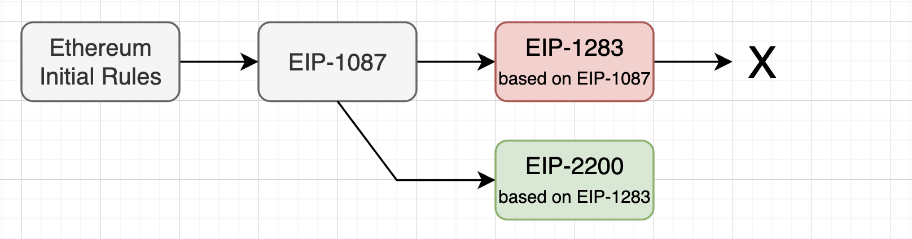
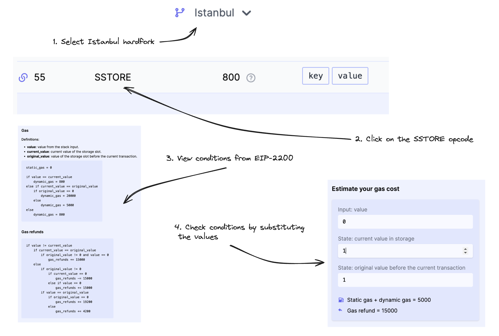
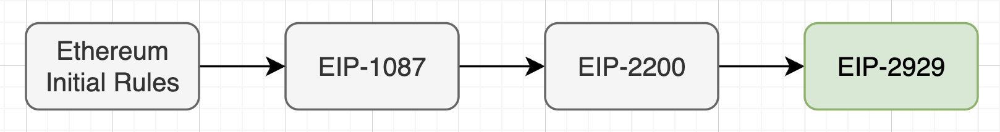
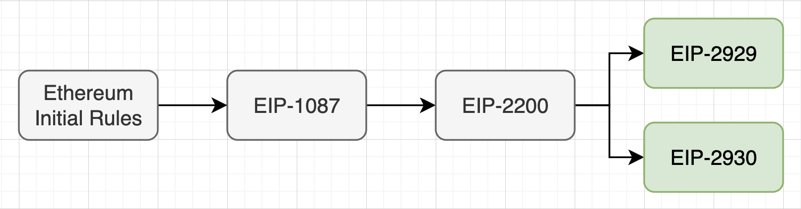
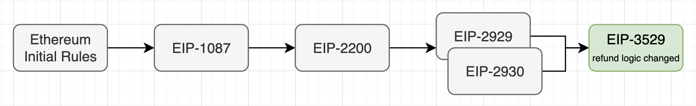

# Gas used part 2: Storage gas calculation

**Author:** [Roman Yarlykov](https://github.com/rlkvrv) 🧐

After exploring the general mechanics of gas calculation during transaction execution in the first part of the article, in this part of our deep dive into the Ethereum world, we will focus on storage operations (`storage`). We'll walk through the history of EIPs related to gas calculations in Ethereum to understand the principles the community used to make decisions about changing the "rules of the game" and how, today, we can use this history to accurately calculate gas.

## Dynamic Gas Calculation for the SSTORE Operation  

The rules related to the `SSTORE` opcode are complex, and understanding or memorizing them on the first try can be challenging.

The core idea behind these rules is to make the initial write to a storage slot (changing the value from `0` to a non-zero value) more expensive in terms of gas compared to subsequent overwrites, as the slot is already initialized in the database.

> A **slot** is a fixed-size cell in a smart contract's storage capable of holding 32 bytes of data.

Additionally, it is important to incentivize clearing unnecessary data from the blockchain. Therefore, if the slot value is reset to `0`, a gas refund is provided for such an operation.

### Initial Calculation Mechanism  

In the early days of Ethereum, gas calculation for the `SSTORE` opcode was straightforward:

- **20,000 gas** for setting a slot value from `0` to a non-zero value;  
- **5,000 gas** for any other changes to the slot value;  
- A **10,000 gas refund** for setting the slot value from a non-zero value back to `0`. Refunds occurred at the end of the transaction.

### EIP-1087: Gas Accounting for SSTORE Operations  

These simple rules, established initially, led to some edge cases where gas usage was inefficient and unfair. As a result, [EIP-1087](https://eips.ethereum.org/EIPS/eip-1087) was introduced, which built on the basic rules but aimed to address the emerging issues.


Problems arising from the basic rules are reflected in the following examples:  

- A contract with an empty storage that first sets a slot value to `1` and then back to `0` spends `20,000 + 5,000 - 10,000 = 15,000` gas, even though this sequence of operations does not require a disk write. This can be used, for example, in mechanisms to protect against reentrancy attacks.  
- A contract that increments a slot value from `0` five times spends `20,000 + 5 * 5,000 = 45,000` gas, even though this sequence of operations requires as much disk activity as a single write costing `20,000` gas.  
- Transferring funds from account A to B, and then from B to C, assuming all accounts have non-zero initial and final balances, costs `5,000 * 4 = 20,000` gas.  

#### Dirty Map  

As a solution, **EIP-1087** proposed using a **"dirty map"** to track all storage interactions during the current transaction.  

> A **dirty map** is a key-value data structure that records all modified storage slots across all contracts during a transaction.  

For repeated overwrites, the cost was set to **200 gas**, and a gas refund counter was introduced.  

The edge cases described above, after the implementation of EIP-1087, would look like this:

- If a contract with empty storage sets slot `0` to `1` and then back to `0`, it will incur a cost of `20,000 + 200 - 19,800 = 400` gas, which is significantly less compared to 15,000.  
- A contract with empty storage that increments slot `0` five times will be charged `20,000 + 5 * 200 = 21,000` gas, which is much lower than 45,000.  
- Transferring a balance from account A to account B, followed by a transfer from B to C, with all non-zero initial and final balances, will cost `5,000 * 3 + 200 = 15,200` gas, which is less compared to 20,000.  

All conditions are outlined in the [test cases] (https://eips.ethereum.org/EIPS/eip-1087#test-cases) EIP-1087, there are a total of 12.

### EIP-1283: Gas Accounting for SSTORE Without Dirty Map  

The implementation of the "dirty map" concept proved to be complex, which led to the development of [EIP-1283] (https://eips.ethereum.org/EIPS/eip-1283), based on the previous EIP-1087.


In **EIP-1283**, a new system for determining the gas cost of storage operations is proposed. Values set in `storage` are classified as follows:

- **Original value of the storage slot (original value):** The value of the storage slot if a rollback occurs within the current transaction.  
- **Current value of the storage slot (current value):** The value of the slot before executing the `SSTORE` operation.  
- **New value of the storage slot (new value):** The value of the slot after executing the `SSTORE` operation.  

Let’s take a small code snippet from a smart contract, `ChangeNumberTwice`, that retrieves a value from slot `0` and changes it twice during a transaction when the `set()` function is called:

```js
contract ChangeNumberTwice {
    uint256 public amount; // before the transaction, it equals 0

    function set() external {
        amount = 1; // до SSTORE: original = 0; current = 0; new = 1;
        amount = 2; // до SSTORE: original = 0; current = 1; new = 2;
    }
}

```

This is how it will look in the diagram:


In addition, instead of the "dirty map," three storage states are introduced:

- **No-op (Inactive):** The operation requires no changes if the `current` value == `new`.  
- **Fresh:** The slot has not been modified or has been reverted to the `original` value. This applies when the `current` value != `new` but matches the `original`.  
- **Dirty:** The slot has already been modified. This applies when the `current` value differs from both `new` and `original`.  

Unlike EIP-1087, this approach is easier to implement and can handle even more [edge cases] (https://eips.ethereum.org/EIPS/eip-1283#test-cases) (17).

#### gasSStore in Geth Code  

If we look at the Geth client code, we can see that the `dynamicGas` function for the `SSTORE` opcode is set to [gasSStore](https://github.com/ethereum/go-ethereum/blob/ae4ea047e35bb35828231f1b93f2f65a964abdc9/core/vm/gas_table.go#L98).

```go
SSTORE: {
    execute:    opSstore,
    dynamicGas: gasSStore,
    minStack:   minStack(2, 0),
    maxStack:   maxStack(2, 0),
},
```

In the code of the `gasSStore` function, the following comments are present:

```go
// The outdated gas accounting mechanism considers only the current state
// The rules of the outdated mode must apply if we are in Petersburg
// (when EIP-1283 was reverted) OR if Constantinople is not active
if evm.chainRules.IsPetersburg || !evm.chainRules.IsConstantinople {
    // ...
    // Gas calculation logic for the St. Petersburg hard fork and all others
    // except for the Constantinople hard fork
}
```

This raises several questions about the Petersburg and Constantinople hard forks, as well as EIP-1283. Let’s break it down:

1. **EIP-1283 and Constantinople:** EIP-1283 was initially included in the Constantinople hard fork plan, but its implementation was canceled due to a discovered vulnerability to a "reentrancy" attack.  
2. **Constantinople with EIP-1283:** Although EIP-1283 was canceled, its code remained in some clients until the official Constantinople release. Moreover, the hard fork had already been deployed in the test network.  
3. **EIP-1283 Reversal:** Canceling EIP-1283 required the St. Petersburg hard fork, which was deployed on the mainnet in the same block as Constantinople to resolve the issue. In [history] (https://ethereum.org/en/history) The Ethereum St. Petersburg hard fork is not often mentioned in history because it was effectively part of Constantinople.

As a result, the outdated gas accounting mechanism described at the beginning of this article continued to operate on the Ethereum mainnet, instead of the implementation proposed in EIP-1283.

### EIP-2200: Structured Definitions for Gas Accounting

So we ended up back at the starting point. Let’s move on to the next hard fork - [Istanbul](https://ethereum.org/en/history#istanbul),which introduces 2 gas proposals: [EIP-2200](https://eips.ethereum.org/EIPS/eip-2200) and [EIP-1884](https://eips.ethereum.org/EIPS/eip-1884) (actually, there are 3, but EIP-1108 is related to cryptography).



The main changes are as follows:

-   **EIP-2200:** It is based on EIP-1283 and [EIP-1706](https://eips.ethereum.org/EIPS/eip-1706), The latter fixes a vulnerability in EIP-1283. Now, if the remaining gas (`gasleft`) in a transaction is less than or equal to the stipend for an Ether transfer (2300 gas), the transaction is reverted with an `out of gas` error.
-   **Constants instead of magic numbers:** Variables like `SSTORE_SET_GAS` are introduced in EIP-2200 to make it easier to work with different gas cost values in the future.
-   **Increase in `SLOAD` cost:** In EIP-1884, the cost of the `SLOAD` operation has been increased from 200 to 800 gas units.
-   **Cost of dirty storage:** In EIP-2200, the cost of accessing "dirty storage" is set in the variable `SLOAD_GAS`.
-   **Structural changes in EIP-2200:** Changes have been made to the implementation of EIP-1283, improving its structure and addressing identified shortcomings.

#### EIPs in geth

Let's once again make a small digression towards the code. In the file [eips.go](https://github.com/ethereum/go-ethereum/blob/master/core/vm/eips.go) the geth client contains all the changes related to EIPs, including EIP-2200, introduced after the Istanbul hard fork. Here is the function responsible for the changes:

```go
    func enable2200(jt *JumpTable) {
        jt[SLOAD].constantGas = params.SloadGasEIP2200
        jt[SSTORE].dynamicGas = gasSStoreEIP2200
    }
```

These lines of code reflect the following:

-   **Change in `SLOAD` cost:** The constant gas value for `SLOAD` was changed to 800 units, which corresponds to the new parameters defined in EIP-2200. The gas-related variables themselves can be found in
[protocol_params.go](https://github.com/ethereum/go-ethereum/blob/master/params/protocol_params.go#L108).
-   **Change in the dynamic gas calculation function for `SSTORE`:** A new function `gasSStoreEIP2200` has been introduced, replacing the outdated `gasSStore` function. This new function takes into account the changes introduced by EIP-2200 and provides a more accurate gas cost calculation for `SSTORE` operations. The code for this function is available in [gas_table.go](https://github.com/ethereum/go-ethereum/blob/7596db5f485e29dbbb66add8fcad6e25368bf96b/core/vm/gas_table.go#L183).

#### Test Cases

EIP-2200 provides a [table](https://arc.net/l/quote/kskrsgme) with test cases. I'll show how the calculation is performed using two examples: with a refund and without.

| Code                   | Used Gas | Refund | Original | Current | New |
| ---------------------- | -------- | ------ | -------- | ------- | --- |
| 0x60006000556000600055 | 1612     | 0      | 0        | 0       | 0   |
| 0x60006000556000600055 | 5812     | 15000  | 1        | 0       | 0   |

It is important to understand a couple of points:

1. The bytecode is written to set the values of `current` and `new`, as `original` is the value before the transaction execution (we assume it has already been written to the slot by a previous transaction).
2. Therefore, the test cases use the same bytecode, with the main difference being the value of `original`.

##### Test Case 1

| Code                   | Used Gas | Refund | Original | 1st | 2nd |
| ---------------------- | -------- | ------ | -------- | --- | --- |
| 0x60006000556000600055 | 1612     | 0      | 0        | 0   | 0   |

Let's break the code into opcodes and record how much gas each opcode consumes, then calculate how much gas was used and how much accumulated in the **refund** counter.

| Operation  | Values                             | Gas  | Condition                      |
| ---------- | ---------------------------------- | ---- | ------------------------------ |
| PUSH1 0x00 | -                                  | 3    | -                              |
| PUSH1 0x00 | -                                  | 3    | -                              |
| SSTORE     | original = 0; current = 0; new = 0 | 800  | **current** == **new** (No-op) |
| PUSH1 0x00 | -                                  | 3    | -                              |
| PUSH1 0x00 | -                                  | 3    | -                              |
| SSTORE     | original = 0; current = 0; new = 0 | 800  | **current** == **new** (No-op) |
| **Итог**   | 3 + 3 + 800 + 3 + 3 + 800          | 1612 | -                              |
| **Refund** | -                                  | 0    | -                              |

In this situation, the EIP-2200 rule was applied in both `sstore` cases:

-   If current value equals new value (this is a no-op), `SLOAD_GAS` is deducted.

The constant SLOAD_GAS = 800.

##### Test Case 2

| Code                   | Used Gas | Refund | Original | Current | New |
| ---------------------- | -------- | ------ | -------- | ------- | --- |
| 0x60006000556000600055 | 5812     | 15000  | 1        | 0       | 0   |

This one is more complex. Remember, the value of `current` is what is in the slot before the `SSTORE` call. The transaction flow is as follows:

| Code       | Description                        | Gas   | Comments                                                                  |
| ---------- | ---------------------------------- | ----- | ------------------------------------------------------------------------- |
| PUSH1 0x00 | -                                  | 3     | -                                                                         |
| PUSH1 0x00 | -                                  | 3     | -                                                                         |
| SSTORE     | original = 1; current = 1; new = 0 | 5000  | **current** != **new**, **original** == **current** (Fresh, refund 15000) |
| PUSH1 0x00 | -                                  | 3     | -                                                                         |
| PUSH1 0x00 | -                                  | 3     | -                                                                         |
| SSTORE     | original = 1; current = 0; new = 0 | 800   | **current** == **new** (No-op)                                            |
| **Итог**   | 3 + 3 + 5000 + 3 + 3 + 800         | 5812  | -                                                                         |
| **Refund** | -                                  | 15000 | -                                                                         |

In the first `sstore`, the following EIP-2200 rules are applied:

-   **If current value does not equal new value**
    -   **If original value equals current value (this storage slot has not been changed by the current execution context)**
        -   If original value is 0, SSTORE_SET_GAS is deducted.
        -   **Otherwise, SSTORE_RESET_GAS gas is deducted. If new value is 0, add SSTORE_CLEARS_SCHEDULE gas to refund counter.**

The variable SSTORE_RESET_GAS = 5000, SSTORE_CLEARS_SCHEDULE = 15000.

These two examples illustrate the general logic. Try performing similar calculations for other test cases to improve your understanding, as knowledge of the EIP-2200 conditions will come in handy later.

The website will also help you understand [evm.codes](https://www.evm.codes) (tab Opcodes). You need to select the hard fork (in this case, Istanbul) and look at the description of `SSTORE`.



## Warm and Cold Access

After Istanbul, the hard fork [Berlin](https://ethereum.org/en/history#berlin) once again introduced significant changes to Ethereum related to gas. One of the key proposals is [EIP-2929: Gas cost increases for state access opcodes](https://eips.ethereum.org/EIPS/eip-2929). These changes affected the calculation of the dynamic part of gas for `SSTORE`.



EIP-2929 introduces three new constants that add the concepts of "warm" and "cold" access, applied not only to storage operations but also to other opcodes interacting with blockchain state, such as `SLOAD`, the `*CALL` family, `BALANCE`, the `EXT*` family, and `SELFDESTRUCT`.

| Constant                 | Value |
| ------------------------ | ----- |
| COLD_SLOAD_COST          | 2100  |
| COLD_ACCOUNT_ACCESS_COST | 2600  |
| WARM_STORAGE_READ_COST   | 100   |

> Cold access - occurs when a specific slot in an account's `storage` is accessed for the first time within a transaction (data loading is performed).  
> Warm access - occurs when the slot has already been accessed within the same transaction (the slot is warmed up).

This innovation is necessary to optimize network performance and distribute resources more efficiently.

Additionally, the values of old parameters have been changed:

| Parameter        | Old value | New value                     |
| ---------------- | --------- | ----------------------------- |
| SLOAD            | 800       | 2100                          |
| SLOAD_GAS        | 800       | 100 (=WARM_STORAGE_READ_COST) |
| SSTORE_RESET_GAS | 5000      | 2900 (5000 - COLD_SLOAD_COST) |

_Important!_ EIP-2929 does not eliminate the concepts of "Fresh" and "Dirty" storage, nor the classification of values as original/current/new from EIP-2200 (in the context of storage access). On top of all this, the first and subsequent accesses (cold and warm) to slots are now added.

_Important!_ These accesses also apply to other opcodes, not just `SLOAD` and `SSTORE`. This is a key point in understanding this EIP.

If we take the first test case from EIP-2200, the changes are as follows:

Было:
| Code                 | Used Gas | Refund | Original | 1st | 2nd | 3rd |
| -------------------- | -------- | ------ | -------- | --- | --- | --- |
| 0x600060055600600055 | 1612     | 0      | 0        | 0   | 0   | 0   |

```
    PUSH1 + PUSH1 + SSTORE + PUSH1 + PUSH1 + SSTORE
    3 + 3 + 800 + 3 + 3 + 800 = 1612
```

Стало:
| Code                 | Used Gas | Refund | Original | 1st | 2nd | 3rd |
| -------------------- | -------- | ------ | -------- | --- | --- | --- |
| 0x600060055600600055 | 2312     | 0      | 0        | 0   | 0   | 0   |

```
    PUSH1 + PUSH1 + SSTORE + PUSH1 + PUSH1 + SSTORE
    3 + 3 + (2100 + 100) + 3 + 3 + 100 = 2300
```

That is, previously, each subsequent write to the same slot (in the case where **current** == **original**) would cost 800 gas units. After EIP-2929, the very first access within a single transaction will be more expensive (2200), but all subsequent accesses will be significantly cheaper (100).

The logic for gas refunds has also changed due to the modification of `SSTORE_RESET_GAS`.

### Access Lists

The second key change introduced by the Berlin hard fork is [EIP-2930: Optional access lists](https://eips.ethereum.org/EIPS/eip-2930), the introduction of so-called access lists.



This proposal was developed to mitigate the consequences introduced by EIP-2929 and introduces a new type of transaction (type 1) with the inclusion of an access list (I’ve already talked about transaction types [here]
(https://github.com/fullstack-development/blockchain-wiki/blob/main/ethereum-virtual-machine/gas/gas-price/README.md#%D1%82%D0%B8%D0%BF%D1%8B-%D1%82%D1%80%D0%B0%D0%BD%D0%B7%D0%B0%D0%BA%D1%86%D0%B8%D0%B9-%D0%B2-ethereum)). New constants are also introduced:

| Constant                     | Value |
| ---------------------------- | ----- |
| ACCESS_LIST_STORAGE_KEY_COST | 1900  |
| ACCESS_LIST_ADDRESS_COST     | 2400  |

Access lists in these transactions (type 1) allow specifying in advance which addresses and storage keys will be accessed during the transaction. This reduces the gas cost for "cold" accesses if they are pre-specified in the access list, thereby mitigating the impact of the increased gas cost for "cold" reads introduced in EIP-2929.

The idea is this. The transaction initiator can make it slightly cheaper if two conditions are met:

- The transaction initiator calls smart contract A, which, in turn, calls smart contracts B, C, and so on. In this case, `ACCESS_LIST_ADDRESS_COST` is applied to the smart contracts called by A — i.e., smart contracts B, C, etc.
- The initiator knows exactly the addresses of the smart contracts called by contract A and the memory slots those smart contracts will access.

When these conditions are met, the cost of the first (cold) access to the `CALL` and `SLOAD` opcodes for smart contract B is reduced:

| Constant                     | Смарт-контракт | CALL | SLOAD |
| ---------------------------- | -------------- | ---- | ----- |
| ACCESS_LIST_STORAGE_KEY_COST | А              | 2600 | 2400  |
| ACCESS_LIST_ADDRESS_COST     | Б              | 2100 | 1900  |

#### Implementation of Access Lists in the geth Client

To implement EIP-2929 with "warm" and "cold" access to storage in the [StateDB interface](https://github.com/ethereum/go-ethereum/blob/f55a10b64d511b27beb02ff4978a6ed66d604cd8/core/vm/interface.go#L66) two fields are added: `AddressInAccessList` and `SlotInAccessList`. During the first read of a variable (i.e., "cold" access), it is registered in `SlotInAccessList`. The second and subsequent accesses to this variable (i.e., "warm" accesses) consume less gas.

For a detailed study, you can refer to the function [enable2929](https://github.com/ethereum/go-ethereum/blob/18e154eaa24d5f7a8b3c48983ad591e6c10963ca/core/vm/eips.go#L120), specifically, to the function for calculating dynamic gas for the `SLOAD` opcode - `gasSLoadEIP2929`:

```go
func enable2929(jt *JumpTable) {
    jt[SSTORE].dynamicGas = gasSStoreEIP2929

    jt[SLOAD].constantGas = 0
    jt[SLOAD].dynamicGas = gasSLoadEIP2929

    // ...
}
```

The function itself [gasSLoadEIP2929](https://github.com/ethereum/go-ethereum/blob/f55a10b64d511b27beb02ff4978a6ed66d604cd8/core/vm/operations_acl.go#L103) looks like this:

```go
// For SLOAD, if the pair (address, storage_key, where address is the contract address,
// whose storage is being read) is not yet in `accessed_storage_keys`,
// 2100 gas is charged, and the pair is added to `accessed_storage_keys`.
// If the pair is already in `accessed_storage_keys`, 100 gas is charged.
func gasSLoadEIP2929(evm *EVM, contract *Contract, stack *Stack, mem *Memory, memorySize uint64) (uint64, error) {
	loc := stack.peek()
	slot := common.Hash(loc.Bytes32())
	// Checking the presence of the slot in the access list
	if _, slotPresent := evm.StateDB.SlotInAccessList(contract.Address(), slot); !slotPresent {
		// If the caller cannot afford the cost, the change will be reverted.
		// If they can afford it, we can skip rechecking the same later during execution.
		evm.StateDB.AddSlotToAccessList(contract.Address(), slot)
		return params.ColdSloadCostEIP2929, nil
	}
	return params.WarmStorageReadCostEIP2929, nil
}
```

_Important!_ The access list is formed before the transaction execution and is added directly to the transaction data.

You can read more about access lists in [this](https://www.rareskills.io/post/eip-2930-optional-access-list-ethereum) article.

### Gas Refund for Storage Clearing (refund)

Let's examine the mechanism for gas refunds when clearing storage in Ethereum, where a slot's value is returned to its original state, as defined in EIP-1283. The refund logic has changed with each hard fork. It all started with a refund of 10,000 gas units for clearing a slot, then the rules were updated in EIP-1283 and further refined in EIP-2200:

1. When replacing a non-zero original value (`original`) with zero, the refund is `SSTORE_CLEARS_SCHEDULE` (15,000 gas).
2. If the value `original` was zero, `current` is non-zero, and `new` is zero, the refund is `SSTORE_SET_GAS` - `SLOAD_GAS` (19,900 gas).
3. When replacing a non-zero `original` value with another non-zero value, and then back to `original`, the refund is `SSTORE_RESET_GAS` - `SLOAD_GAS` (4,900 gas).

You can study the handling of such cases in more detail in the [test examples](https://arc.net/l/quote/bfzggnpq) EIP-2200.

#### EIP-3529: Changes to the Gas Refund Mechanism

EIP-2929 did not introduce changes to the gas refund mechanism, but such changes appeared in the hard fork [London](https://ethereum.org/en/history#london) with [EIP-3529](https://eips.ethereum.org/EIPS/eip-3529). This EIP revises the gas refund rules for `SSTORE` and `SELFDESTRUCT`.



Previously, these refunds were intended to encourage developers to maintain "good state hygiene," meaning clearing unnecessary storage slots and smart contracts. However, in practice, this led to several problems:

1. **The GasToken Problem**: GasToken allows users to save gas during periods of low fees and use it during periods of high prices, but this also increases the network's state size (because it uses storage slots as gas reservoirs) and inefficiently loads the network. Thus, the refund rules enabled gas manipulation, affecting the entire blockchain's operation.

    > GasToken - a smart contract on the Ethereum network that allows users to buy and sell gas directly, providing long-term "gas banking," which can help protect users from rising gas prices.

2. **Increased Block Size Variability**: Theoretically, the maximum gas consumed in a block could be almost twice the set gas limit due to refunds. This increases fluctuations in block sizes and allows for high gas consumption over longer periods, which runs counter to the goals [EIP-1559](https://eips.ethereum.org/EIPS/eip-1559).

EIP-3529 proposed reducing refunds for operations to improve the predictability and stability of gas economics. The key changes are:

1. Remove gas refunds for `SELFDESTRUCT`.
2. Replace `SSTORE_CLEARS_SCHEDULE` (as defined in EIP-2200) with `SSTORE_RESET_GAS` + `ACCESS_LIST_STORAGE_KEY_COST` (4,800 gas as per EIP-2929 + EIP-2930).
3. Reduce the maximum amount of gas refunded after a transaction to `gas_used` // `MAX_REFUND_QUOTIENT`.
    - Note: Previously, the maximum amount of refundable gas was defined as `gas_used` // 2. In this EIP, the constant 2 is named `MAX_REFUND_QUOTIENT`, and its value is changed to 5.

##### EIP-3529 Changes in the geth Client

Let's track the EIP-3529 changes in the geth code. To do this, go to the file [eips.go](https://github.com/ethereum/go-ethereum/blob/master/core/vm/eips.go), find the function [enable3529](https://github.com/ethereum/go-ethereum/blob/566754c74a74c8175ec2f1ee5cc10a8caced6015/core/vm/eips.go#L160C8-L160C8):

```go
// enable3529 activate "EIP-3529: Reduction of Refunds":
// - Removes refunds for `selfdestruct`
// - Reduces refunds for `SSTORE`
// - Reduces maximum refunds to 20% of the gas used
func enable3529(jt *JumpTable) {
    jt[SSTORE].dynamicGas = gasSStoreEIP3529
    jt[SELFDESTRUCT].dynamicGas = gasSelfdestructEIP3529
}
```

The calculation function for `dynamicGas` has been modified once again, and it is now `gasSStoreEIP3529`:

```go
// `gasSStoreEIP3529` implements the gas cost for `SSTORE` in accordance with EIP-3529
// Replaces `SSTORE_CLEARS_SCHEDULE` with `SSTORE_RESET_GAS` + `ACCESS_LIST_STORAGE_KEY_COST` (4,800)  
`gasSStoreEIP3529 = makeGasSStoreFunc(params.SstoreClearsScheduleRefundEIP3529)`
```

If you look at what makes up `SstoreClearsScheduleRefundEIP3529`, you can see the entire history of refund changes in the comments:

```go
// В EIP-2200: SstoreResetGas был 5000.
// В EIP-2929: SstoreResetGas был изменен на '5000 - COLD_SLOAD_COST'.
// В EIP-3529: SSTORE_CLEARS_SCHEDULE определяется как SSTORE_RESET_GAS + ACCESS_LIST_STORAGE_KEY_COST
// Which now equals: 5000 - 2100 + 1900 = 4800
SstoreClearsScheduleRefundEIP3529 uint64 = SstoreResetGasEIP2200 - ColdSloadCostEIP2929 + TxAccessListStorageKeyGas
```
In the constants file, the previous value is also present:

```go
SstoreClearsScheduleRefundEIP2200 uint64 = 15000
```

##### Test Cases for EIP-3529 (Gas Calculation Changes)

[Test Cases](https://eips.ethereum.org/EIPS/eip-3529#test-cases) EIP-3529 demonstrates the changes in gas refunds before and after its activation. They are presented in two tables, showing that refunds, which previously amounted to 15,000 gas units, are now reduced to 4,800 units.

_Important!_ These tests are conducted under the assumption that the storage is already "warmed up."

You can also refer to the website again [evm.codes](https://www.evm.codes), which features a gas calculator for the opcode [SSTORE](https://arc.net/l/quote/yxdehesj), allowing you to specify three values (original, current, new) and the type of storage (warm or cold) to calculate gas consumption and refunds. There is also a detailed description of the calculation rules depending on the conditions. As before, it is important to specify the hard fork before referring to the opcode description.

It is worth noting that in the future, the rules for dynamic gas calculation may change. However, now you know where to look for these changes and how to interpret them to understand the current costs. In Ethereum, much like the legal laws of the real world, rules can become outdated, change, or undergo minor adjustments, although the mechanisms for these changes differ from traditional legislative processes.

## Intrinsic gas

We have already reviewed the calculation and deduction of gas during the execution of smart contract logic, but there is also the concept of intrinsic gas, which is consumed before this logic is executed. It is important to note that in some transactions, a smart contract call may not be present.

To understand the components of intrinsic gas, you should refer to section 6 of the Ethereum Yellow Paper. The calculation of intrinsic gas is presented by the formula g<sub>0</sub>:


For the values of G mentioned in the formula, refer to "Appendix G. Fee Schedule" on page 27 of the Ethereum Yellow Paper. The formula for intrinsic gas is quite simple, and we will break it down step by step:

1. **Gas Calculation for `calldata`:** In a transaction, this is based on the sum of G<sub>txdatazero</sub> and G<sub>txdatanonzero</sub>. For each non-zero byte of `calldata`, G<sub>txdatanonzero</sub> (16 gas units) is charged, and for each zero byte, G<sub>txdatazero</sub> (4 gas units) is charged. Let's consider an example of calling the function `store(uint256 num)` with the parameter num = 1:

```
    0x6057361d0000000000000000000000000000000000000000000000000000000000000001
```

-   The first 4 bytes are the non-zero function signature, which costs 4 \* 16 = 64 gas units.
-   Then follows 31 zero bytes, which equals 31 \* 4 = 124 gas units.
-   A non-zero byte representing `num = 1` costs 1 \* 16 = 16 gas units.
-   Thus, the total cost is 64 + 124 + 16 = 204 gas units.

2. **Smart Contract Creation**: If the transaction involves creating a smart contract (the `to` field is equal to the zero address), G<sub>txcreate</sub>, equal to 32,000 gas units, is added to the intrinsic gas.

3. **Base Gas for a Transaction**: The minimum amount of gas required for any transaction is G<sub>transaction</sub> — 21,000 gas units. This base value applies, for example, to simple Ether transfers where there are no additional operations requiring more gas.

4. **Access List Cost**: According to [EIP-2930](https://eips.ethereum.org/EIPS/eip-2930), Intrinsic gas also accounts for G<sub>accesslistaddress</sub> (2,400 gas units) and G<sub>accessliststorage</sub> (1,900 gas units). These values are added for each address and storage slot specified in the access list if the transaction includes prepayment for "warming up."

Thus, as you can see, the calculation of intrinsic gas in Ethereum is relatively straightforward. For a more detailed understanding, it is recommended to study the function [IntrinsicGas](https://github.com/ethereum/go-ethereum/blob/c66ca8bf7a8c63ae54e44f4566e206cd1a4fa204/core/state_transition.go#L69), located in the file [state_transition.go](https://github.com/ethereum/go-ethereum/blob/master/core/state_transition.go) in the go-ethereum repository.

## General Gas Calculation Process in Ethereum

Let's gather all the information together for a complete understanding of the gas calculation process in Ethereum. It all starts with a block that tracks the total amount of gas used by all transactions (`gasUsed`). Each individual transaction in the block is processed through the function [applyTransaction](https://github.com/ethereum/go-ethereum/blob/566754c74a74c8175ec2f1ee5cc10a8caced6015/core/state_processor.go#L107), during which the following occurs:

1. **Initialization of Gas Counters**: The first counter (`st.gas`) shows the available gas for the transaction and is initialized with its gas limit (`gasLimit`). The second counter tracks the gas actually used.

2. **Upfront Payment**: An upfront payment is deducted from the sender's balance, equal to the product of the gas price (`gasPrice`) and the gas limit (`gasLimit`).

3. **Block Gas Limit Reduction**: The block's total gas limit is reduced by the gas limit of the transaction.

4. **Intrinsic Gas Calculation**: The intrinsic gas of the transaction is calculated, including the base cost and the cost for each byte of `calldata`.

5. **Transaction Execution**: The `Call()` function initiates the transaction execution, and if necessary, the smart contract logic through `Run()`.

6. **Gas Update and Refund**: The remaining gas counter (`st.gas`) is updated based on the data from `Call()`. Unused gas, multiplied by the gas price, is refunded to the sender in ETH. The remaining gas is also returned to the block's total gas pool.

The diagram below clearly illustrates the gas handling process at the protocol level for both individual transactions and the entire block. You can read more about this [here](https://arc.net/l/quote/wdbuajzw).


Thus, the process of calculating the gas cost for a transaction includes two main components:

1. **Base Gas Cost**: This accounts for the intrinsic gas of the transaction, including the cost of data (`calldata`) and basic operational expenses.
2. **Smart Contract Execution Cost**: These are additional gas expenses related to the logic and operations of the smart contract.

It is important to ensure that the sender's balance contains enough funds to cover the maximum possible gas expenses. It is also critical to verify that the gas limit set for the transaction does not exceed the block's total gas limit, so the transaction can be successfully processed within the block.

## Conclusion

Congratulations! This was a long and challenging journey, but now there’s less mystery in gas calculations. Here’s a quick [cheat sheet] (https://www.evm.codes/about) on the key points.

## Links

-   [Article: EIP-2930 - Ethereum access list](https://www.rareskills.io/post/eip-2930-optional-access-list-ethereum)
-   [Doc: Ethereum Yellow Paper](https://ethereum.github.io/yellowpaper/paper.pdf)
-   [Code: Go-Ethereum](https://github.com/ethereum/go-ethereum)
