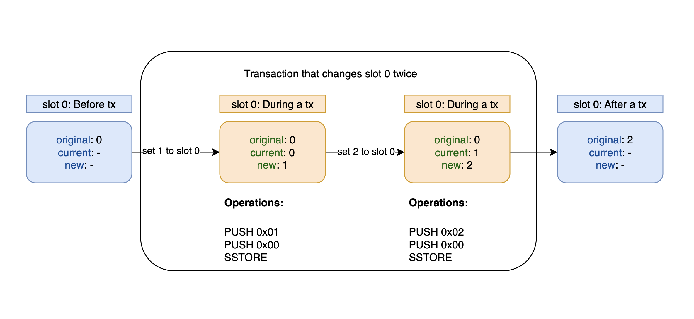
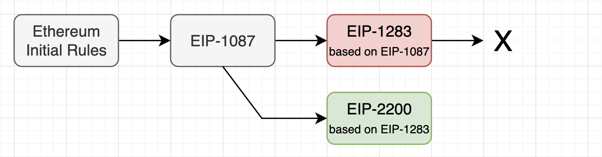
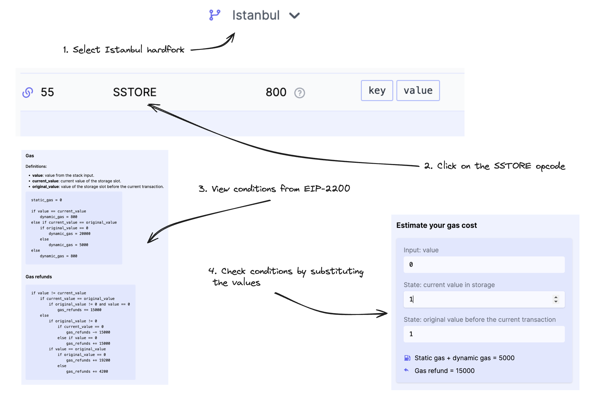
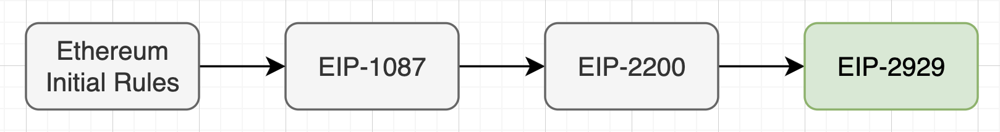
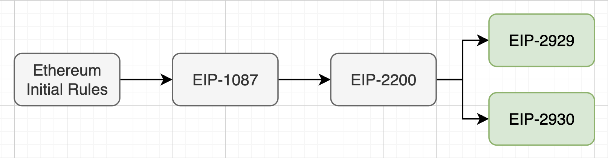
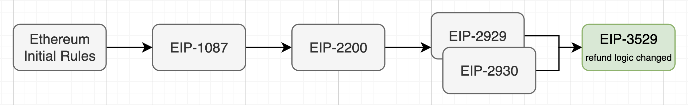
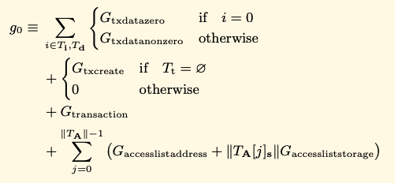
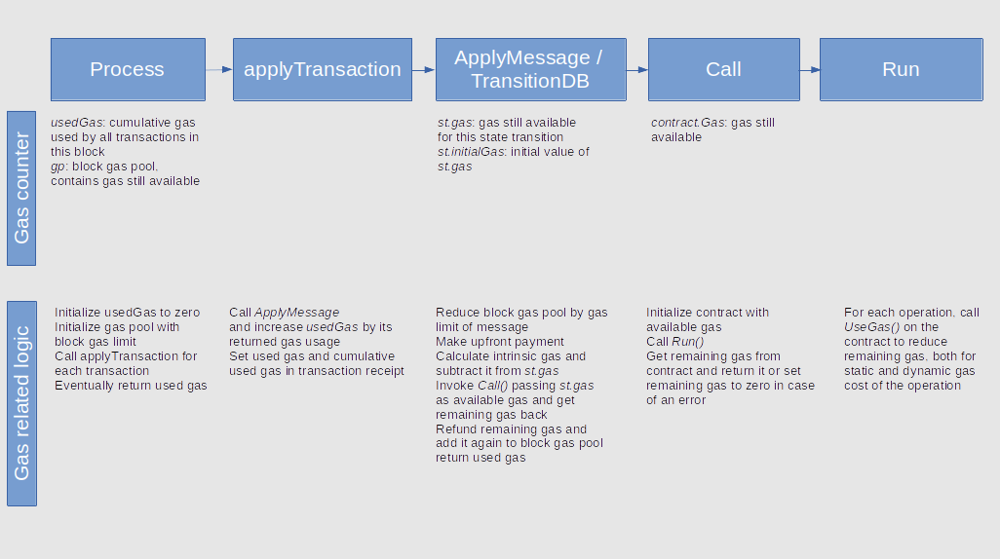

# Gas used part 2: Storage gas calculation

**Author:** [Roman Yarlykov](https://github.com/rlkvrv) 🧐

After exploring the general mechanics of gas calculation during transaction execution in the first part of the article, in this part of our deep dive into the Ethereum world, we will focus on storage operations (`storage`). We'll walk through the history of EIPs related to gas calculations in Ethereum to understand the principles the community used to make decisions about changing the "rules of the game" and how, today, we can use this history to accurately calculate gas.

## Dynamic Gas Calculation for the SSTORE Operation  

The rules related to the `SSTORE` opcode are complex, and understanding or memorizing them on the first try can be challenging.

The core idea behind these rules is to make the initial write to a storage slot (changing the value from `0` to a non-zero value) more expensive in terms of gas compared to subsequent overwrites, as the slot is already initialized in the database.

> A **slot** is a fixed-size cell in a smart contract's storage capable of holding 32 bytes of data.

Additionally, it is important to incentivize clearing unnecessary data from the blockchain. Therefore, if the slot value is reset to `0`, a gas refund is provided for such an operation.

### Initial Calculation Mechanism  

In the early days of Ethereum, gas calculation for the `SSTORE` opcode was straightforward:

- **20,000 gas** for setting a slot value from `0` to a non-zero value;  
- **5,000 gas** for any other changes to the slot value;  
- A **10,000 gas refund** for setting the slot value from a non-zero value back to `0`. Refunds occurred at the end of the transaction.

### EIP-1087: Gas Accounting for SSTORE Operations  

These simple rules, established initially, led to some edge cases where gas usage was inefficient and unfair. As a result, [EIP-1087](https://eips.ethereum.org/EIPS/eip-1087) was introduced, which built on the basic rules but aimed to address the emerging issues.


Problems arising from the basic rules are reflected in the following examples:  

- A contract with an empty storage that first sets a slot value to `1` and then back to `0` spends `20,000 + 5,000 - 10,000 = 15,000` gas, even though this sequence of operations does not require a disk write. This can be used, for example, in mechanisms to protect against reentrancy attacks.  
- A contract that increments a slot value from `0` five times spends `20,000 + 5 * 5,000 = 45,000` gas, even though this sequence of operations requires as much disk activity as a single write costing `20,000` gas.  
- Transferring funds from account A to B, and then from B to C, assuming all accounts have non-zero initial and final balances, costs `5,000 * 4 = 20,000` gas.  

#### Dirty Map  

As a solution, **EIP-1087** proposed using a **"dirty map"** to track all storage interactions during the current transaction.  

> A **dirty map** is a key-value data structure that records all modified storage slots across all contracts during a transaction.  

For repeated overwrites, the cost was set to **200 gas**, and a gas refund counter was introduced.  

The edge cases described above, after the implementation of EIP-1087, would look like this:

- If a contract with empty storage sets slot `0` to `1` and then back to `0`, it will incur a cost of `20,000 + 200 - 19,800 = 400` gas, which is significantly less compared to 15,000.  
- A contract with empty storage that increments slot `0` five times will be charged `20,000 + 5 * 200 = 21,000` gas, which is much lower than 45,000.  
- Transferring a balance from account A to account B, followed by a transfer from B to C, with all non-zero initial and final balances, will cost `5,000 * 3 + 200 = 15,200` gas, which is less compared to 20,000.  

All conditions are outlined in the [test cases] (https://eips.ethereum.org/EIPS/eip-1087#test-cases) EIP-1087, there are a total of 12.

### EIP-1283: Gas Accounting for SSTORE Without Dirty Map  

The implementation of the "dirty map" concept proved to be complex, which led to the development of [EIP-1283] (https://eips.ethereum.org/EIPS/eip-1283), based on the previous EIP-1087.


In **EIP-1283**, a new system for determining the gas cost of storage operations is proposed. Values set in `storage` are classified as follows:

- **Original value of the storage slot (original value):** The value of the storage slot if a rollback occurs within the current transaction.  
- **Current value of the storage slot (current value):** The value of the slot before executing the `SSTORE` operation.  
- **New value of the storage slot (new value):** The value of the slot after executing the `SSTORE` operation.  

Let’s take a small code snippet from a smart contract, `ChangeNumberTwice`, that retrieves a value from slot `0` and changes it twice during a transaction when the `set()` function is called:

```js
contract ChangeNumberTwice {
    uint256 public amount; // before the transaction, it equals 0

    function set() external {
        amount = 1; // до SSTORE: original = 0; current = 0; new = 1;
        amount = 2; // до SSTORE: original = 0; current = 1; new = 2;
    }
}

```

This is how it will look in the diagram:



In addition, instead of the "dirty map," three storage states are introduced:

- **No-op (Inactive):** The operation requires no changes if the `current` value == `new`.  
- **Fresh:** The slot has not been modified or has been reverted to the `original` value. This applies when the `current` value != `new` but matches the `original`.  
- **Dirty:** The slot has already been modified. This applies when the `current` value differs from both `new` and `original`.  

Unlike EIP-1087, this approach is easier to implement and can handle even more [edge cases] (https://eips.ethereum.org/EIPS/eip-1283#test-cases) (17).

#### gasSStore in Geth Code  

If we look at the Geth client code, we can see that the `dynamicGas` function for the `SSTORE` opcode is set to [gasSStore](https://github.com/ethereum/go-ethereum/blob/ae4ea047e35bb35828231f1b93f2f65a964abdc9/core/vm/gas_table.go#L98).

```go
SSTORE: {
    execute:    opSstore,
    dynamicGas: gasSStore,
    minStack:   minStack(2, 0),
    maxStack:   maxStack(2, 0),
},
```

In the code of the `gasSStore` function, the following comments are present:

```go
// The outdated gas accounting mechanism considers only the current state
// The rules of the outdated mode must apply if we are in Petersburg
// (when EIP-1283 was reverted) OR if Constantinople is not active
if evm.chainRules.IsPetersburg || !evm.chainRules.IsConstantinople {
    // ...
    // Gas calculation logic for the St. Petersburg hard fork and all others
    // except for the Constantinople hard fork
}
```

This raises several questions about the Petersburg and Constantinople hard forks, as well as EIP-1283. Let’s break it down:

1. **EIP-1283 and Constantinople:** EIP-1283 was initially included in the Constantinople hard fork plan, but its implementation was canceled due to a discovered vulnerability to a "reentrancy" attack.  
2. **Constantinople with EIP-1283:** Although EIP-1283 was canceled, its code remained in some clients until the official Constantinople release. Moreover, the hard fork had already been deployed in the test network.  
3. **EIP-1283 Reversal:** Canceling EIP-1283 required the St. Petersburg hard fork, which was deployed on the mainnet in the same block as Constantinople to resolve the issue. In [history] (https://ethereum.org/en/history) The Ethereum St. Petersburg hard fork is not often mentioned in history because it was effectively part of Constantinople.

As a result, the outdated gas accounting mechanism described at the beginning of this article continued to operate on the Ethereum mainnet, instead of the implementation proposed in EIP-1283.

### EIP-2200: Structured Definitions for Gas Accounting

So we ended up back at the starting point. Let’s move on to the next hard fork - [Istanbul](https://ethereum.org/en/history#istanbul),which introduces 2 gas proposals: [EIP-2200](https://eips.ethereum.org/EIPS/eip-2200) and [EIP-1884](https://eips.ethereum.org/EIPS/eip-1884) (actually, there are 3, but EIP-1108 is related to cryptography).



Основные изменения следующие:

-   **EIP-2200:** Берет за основу EIP-1283 и [EIP-1706](https://eips.ethereum.org/EIPS/eip-1706), последний исправляет уязвимость EIP-1283. Теперь, если оставшийся газ (`gasleft`) в транзакции меньше или равен стипендии за перевод эфира (2300 газа), транзакция отменяется с ошибкой `out of gas`.
-   **Константы вместо магических чисел:** Вводятся переменные, такие как `SSTORE_SET_GAS` в EIP-2200, чтобы в дальнейшем было легче оперировать различными значениями стоимости газа.
-   **Увеличение стоимости `SLOAD`:** В EIP-1884 стоимость операции `SLOAD` увеличена с 200 до 800 единиц газа.
-   **Стоимость грязного хранилища:** В EIP-2200 стоимость обращения к "грязному хранилищу" установлена в переменной `SLOAD_GAS`.
-   **Структурные изменения в EIP-2200:** Внесены изменения в реализацию EIP-1283, улучшающие структуру и исправляющие обнаруженные недостатки.

#### EIPs in geth

Снова сделаем небольшое отступление в сторону кода. В файле [eips.go](https://github.com/ethereum/go-ethereum/blob/master/core/vm/eips.go) клиента geth представлены все изменения, связанные с EIPs, включая EIP-2200, внедренный после хард-форка Istanbul. Вот функция отвечающая за изменения:

```go
    func enable2200(jt *JumpTable) {
        jt[SLOAD].constantGas = params.SloadGasEIP2200
        jt[SSTORE].dynamicGas = gasSStoreEIP2200
    }
```

Эти строки кода отражают следующее:

-   **Изменение стоимости `SLOAD`:** Константное значение газа для `SLOAD` было изменено на 800 единиц, что соответствует новым параметрам, определенным в EIP-2200. Сами переменные, связанные с газом, можно найти в [protocol_params.go](https://github.com/ethereum/go-ethereum/blob/master/params/protocol_params.go#L108).
-   **Изменение функции расчета динамического газа для `SSTORE`:** Введена новая функция `gasSStoreEIP2200`, которая заменяет устаревшую функцию `gasSStore`. Эта новая функция учитывает изменения, внесенные EIP-2200, и обеспечивает более точный расчет стоимости газа для операций `SSTORE`. Код этой функции доступен в [gas_table.go](https://github.com/ethereum/go-ethereum/blob/7596db5f485e29dbbb66add8fcad6e25368bf96b/core/vm/gas_table.go#L183).

#### Тест-кейсы

EIP-2200 предоставляет [таблицу](https://arc.net/l/quote/kskrsgme) с тест-кейсами. Покажу как производится расчет на примере двух случаев с refund и без:

| Code                   | Used Gas | Refund | Original | Current | New |
| ---------------------- | -------- | ------ | -------- | ------- | --- |
| 0x60006000556000600055 | 1612     | 0      | 0        | 0       | 0   |
| 0x60006000556000600055 | 5812     | 15000  | 1        | 0       | 0   |

Важно понимать пару моментов:

1. Байт-код написан для установки значений `current` и `new`, т.к. `original` это значение до выполнения транзакции (подразумеваем, что оно уже записано в слот предыдущей транзакцией).
2. Поэтому тестовые кейсы используют одинаковый байт-код, главное отличие в значении `original`.

##### Тест-кейс 1

| Code                   | Used Gas | Refund | Original | 1st | 2nd |
| ---------------------- | -------- | ------ | -------- | --- | --- |
| 0x60006000556000600055 | 1612     | 0      | 0        | 0   | 0   |

Разложим код на опкоды и запишем сколько газа потребляет каждый опкод, затем посчитаем сколько газа было использовано и сколько накопилось в счетчике **refund**.

| Операция   | Значения                           | Газ  | Условие                        |
| ---------- | ---------------------------------- | ---- | ------------------------------ |
| PUSH1 0x00 | -                                  | 3    | -                              |
| PUSH1 0x00 | -                                  | 3    | -                              |
| SSTORE     | original = 0; current = 0; new = 0 | 800  | **current** == **new** (No-op) |
| PUSH1 0x00 | -                                  | 3    | -                              |
| PUSH1 0x00 | -                                  | 3    | -                              |
| SSTORE     | original = 0; current = 0; new = 0 | 800  | **current** == **new** (No-op) |
| **Итог**   | 3 + 3 + 800 + 3 + 3 + 800          | 1612 | -                              |
| **Refund** | -                                  | 0    | -                              |

В данной ситуации в обоих `sstore` сработало правило EIP-2200:

-   If current value equals new value (this is a no-op), `SLOAD_GAS` is deducted.

Константа SLOAD_GAS = 800.

##### Тест-кейс 2

| Code                   | Used Gas | Refund | Original | Current | New |
| ---------------------- | -------- | ------ | -------- | ------- | --- |
| 0x60006000556000600055 | 5812     | 15000  | 1        | 0       | 0   |

Здесь сложнее, помним, что значение `current` - это то, что лежит в слоте до вызова `SSTORE`. Флоу транзакции следующий:

| Код        | Описание                           | Газ   | Комментарий                                                               |
| ---------- | ---------------------------------- | ----- | ------------------------------------------------------------------------- |
| PUSH1 0x00 | -                                  | 3     | -                                                                         |
| PUSH1 0x00 | -                                  | 3     | -                                                                         |
| SSTORE     | original = 1; current = 1; new = 0 | 5000  | **current** != **new**, **original** == **current** (Fresh, refund 15000) |
| PUSH1 0x00 | -                                  | 3     | -                                                                         |
| PUSH1 0x00 | -                                  | 3     | -                                                                         |
| SSTORE     | original = 1; current = 0; new = 0 | 800   | **current** == **new** (No-op)                                            |
| **Итог**   | 3 + 3 + 5000 + 3 + 3 + 800         | 5812  | -                                                                         |
| **Refund** | -                                  | 15000 | -                                                                         |

В первом `sstore` применяются следующие правила EIP-2200:

-   **If current value does not equal new value**
    -   **If original value equals current value (this storage slot has not been changed by the current execution context)**
        -   If original value is 0, SSTORE_SET_GAS is deducted.
        -   **Otherwise, SSTORE_RESET_GAS gas is deducted. If new value is 0, add SSTORE_CLEARS_SCHEDULE gas to refund counter.**

Переменная SSTORE_RESET_GAS = 5000, SSTORE_CLEARS_SCHEDULE = 15000.

Эти два примера показывают общую логику, попробуйте проделать подобный расчет для других тест-кейсов, чтобы улучшить свое понимание, потому что знание условий EIP-2200 еще пригодится.

Разобраться также поможет сайт [evm.codes](https://www.evm.codes) (вкладка Opcodes). Нужно выбрать хард-форк (конкретно в этом случае Istanbul) и посмотреть описание `SSTORE`.



## Теплый и холодный доступ

После Istanbul, хард-форк [Berlin](https://ethereum.org/en/history#berlin) снова внес в Ethereum важные изменения, связанные с газом. Одно из ключевых предложений — [EIP-2929: Gas cost increases for state access opcodes](https://eips.ethereum.org/EIPS/eip-2929). Эти изменения повлияли на расчет динамической части газа для `SSTORE`.



В EIP-2929 введены три новые константы, которые добавляют понятия "теплого" и "холодного" доступа, применяемые не только к операциям с хранилищем, но и к другим опкодам, работающим с состоянием блокчейна, таким как `SLOAD`, семейство `*CALL`, `BALANCE`, семейство `EXT*` и `SELFDESTRUCT`.

| Constant                 | Value |
| ------------------------ | ----- |
| COLD_SLOAD_COST          | 2100  |
| COLD_ACCOUNT_ACCESS_COST | 2600  |
| WARM_STORAGE_READ_COST   | 100   |

> Холодный доступ - если в рамках транзакции к конкретному слоту в `storage` аккаунта обращаются впервые (выполняют загрузку данных).
> Теплый доступ - в рамках одной транзакции к этому слоту уже обращались (слот прогрет).

Нововведение необходимо для оптимизации работы сети и более эффективного распределения ресурсов.

Также изменились значения старых параметров:

| Parameter        | Old value | New value                     |
| ---------------- | --------- | ----------------------------- |
| SLOAD            | 800       | 2100                          |
| SLOAD_GAS        | 800       | 100 (=WARM_STORAGE_READ_COST) |
| SSTORE_RESET_GAS | 5000      | 2900 (5000 - COLD_SLOAD_COST) |

_Важно!_ EIP-2929 не отменяет понятия "Fresh" и "Dirty" хранилища, а также градацию значений на original/current/new из EIP-2200 (в контексте обращения к хранилищу). Ко всему этому еще добавляется первый и последующий доступы (холодный и теплый) к слотам.

_Важно!_ Доступы распространяется и на другие опкоды, не только на работу с `SLOAD` и `SSTORE`. Это ключевой момент в понимании данного EIP.

Если взять первый тестовый кейс из EIP-2200, тогда изменения следующие:

Было:
| Code                 | Used Gas | Refund | Original | 1st | 2nd | 3rd |
| -------------------- | -------- | ------ | -------- | --- | --- | --- |
| 0x600060055600600055 | 1612     | 0      | 0        | 0   | 0   | 0   |

```
    PUSH1 + PUSH1 + SSTORE + PUSH1 + PUSH1 + SSTORE
    3 + 3 + 800 + 3 + 3 + 800 = 1612
```

Стало:
| Code                 | Used Gas | Refund | Original | 1st | 2nd | 3rd |
| -------------------- | -------- | ------ | -------- | --- | --- | --- |
| 0x600060055600600055 | 2312     | 0      | 0        | 0   | 0   | 0   |

```
    PUSH1 + PUSH1 + SSTORE + PUSH1 + PUSH1 + SSTORE
    3 + 3 + (2100 + 100) + 3 + 3 + 100 = 2300
```

То есть, раньше каждая последующая запись в один и тот же слот (в случае когда **current** == **original**) стоило бы 800 ед. газа. После EIP-2929, самое первое обращение в рамках одной транзакции будет дороже (2200), но все последующие будут сильно дешевле (100).

Также поменялась логика и с возвратом газа в связи с изменением `SSTORE_RESET_GAS`.

### Списки доступа

Второе ключевое изменение, внесенное хард-форком Berlin, заключается в [EIP-2930: Optional access lists](https://eips.ethereum.org/EIPS/eip-2930), который вводит так называемые списки доступа.



Это предложение разработано для смягчения последствий, введенных EIP-2929, и для этого предлагает новый тип транзакций (тип 1) с включением списка доступа (про типы транзакций я уже рассказывал [тут](https://github.com/fullstack-development/blockchain-wiki/blob/main/ethereum-virtual-machine/gas/gas-price/README.md#%D1%82%D0%B8%D0%BF%D1%8B-%D1%82%D1%80%D0%B0%D0%BD%D0%B7%D0%B0%D0%BA%D1%86%D0%B8%D0%B9-%D0%B2-ethereum)). Также вводятся новые константы:

| Constant                     | Value |
| ---------------------------- | ----- |
| ACCESS_LIST_STORAGE_KEY_COST | 1900  |
| ACCESS_LIST_ADDRESS_COST     | 2400  |

Списки доступа в этих транзакциях (тип 1) позволяют заранее указывать, к каким адресам и ключам хранения будет осуществляться доступ в ходе транзакции. Это уменьшает стоимость газа для "холодных" доступов, если они заранее указаны в списке доступа, таким образом смягчая воздействие увеличенной стоимости газа для "холодных" чтений, введенной в EIP-2929.

Смысл такой. Инициатор транзакции может сделать ее немного дешевле в случае, если выполняются два условия:

-   Инициатор транзакции вызывает смарт-контракт А, который в свою очередь вызывает смарт-контракты Б, В и так далее. В таком случае `ACCESS_LIST_ADDRESS_COST` применяется для смарт-контрактов вызываемых из А - т.е смарт-контракт Б, В и т.д
-   Инициатор точно знает адреса смарт-контрактов, вызываемых контрактом А, и слоты памяти, к которым эти смарт-контракты обращаются.

При выполнении этих условий, стоимость первого (холодного) доступа к опкодам `CALL` и `SLOAD` для смарт-контракта Б снижается:

| Constant                     | Смарт-контракт | CALL | SLOAD |
| ---------------------------- | -------------- | ---- | ----- |
| ACCESS_LIST_STORAGE_KEY_COST | А              | 2600 | 2400  |
| ACCESS_LIST_ADDRESS_COST     | Б              | 2100 | 1900  |

#### Реализация списков доступа в клиенте geth

Для реализации EIP-2929 с "теплым" и "холодным" доступом к хранилищу в [интерфейсе StateDB](https://github.com/ethereum/go-ethereum/blob/f55a10b64d511b27beb02ff4978a6ed66d604cd8/core/vm/interface.go#L66) добавляют два поля: `AddressInAccessList` и `SlotInAccessList`. При первом считывании переменной (т.е. "холодном" доступе), она регистрируется в `SlotInAccessList`. Второе и последующие обращения к этой переменной (т.е. "теплые" доступы) потребляют меньше газа.

Для подробного изучения, можно обратиться к функции [enable2929](https://github.com/ethereum/go-ethereum/blob/18e154eaa24d5f7a8b3c48983ad591e6c10963ca/core/vm/eips.go#L120), в частности, к функции расчета динамического газа для опкода `SLOAD` - `gasSLoadEIP2929`:

```go
func enable2929(jt *JumpTable) {
    jt[SSTORE].dynamicGas = gasSStoreEIP2929

    jt[SLOAD].constantGas = 0
    jt[SLOAD].dynamicGas = gasSLoadEIP2929

    // ...
}
```

Сама функция [gasSLoadEIP2929](https://github.com/ethereum/go-ethereum/blob/f55a10b64d511b27beb02ff4978a6ed66d604cd8/core/vm/operations_acl.go#L103) выглядит так:

```go
// Для SLOAD, если пара (адрес, ключ_хранения, где адрес - это адрес контракта,
// чье хранилище считывается) еще не находится в accessed_storage_keys,
// взимается 2100 газа и пара добавляется в accessed_storage_keys.
// Если пара уже находится в accessed_storage_keys, взимается 100 газа.
func gasSLoadEIP2929(evm *EVM, contract *Contract, stack *Stack, mem *Memory, memorySize uint64) (uint64, error) {
	loc := stack.peek()
	slot := common.Hash(loc.Bytes32())
	// Проверяем наличие слота в списке доступа
	if _, slotPresent := evm.StateDB.SlotInAccessList(contract.Address(), slot); !slotPresent {
		// Если вызывающий не может позволить себе стоимость, изменение будет отменено
		// Если он может позволить, мы можем пропустить повторную проверку того же самого позже, в процессе выполнения
		evm.StateDB.AddSlotToAccessList(contract.Address(), slot)
		return params.ColdSloadCostEIP2929, nil
	}
	return params.WarmStorageReadCostEIP2929, nil
}
```

_Важно!_ Список доступа формируется до выполнения транзакции и добавляется непосредственно в данные транзакции.

Подробнее про списки доступа можно почитать в [этой](https://www.rareskills.io/post/eip-2930-optional-access-list-ethereum) статье.

### Возврат газа при очистке хранилища (refund)

Рассмотрим механизм возврата газа при очистке storage в Ethereum, когда значение слота возвращается к исходному, как это определено в EIP-1283. Логика refund менялась с каждым хард-форком. Все началась с возмещения 10,000 единиц газа за очистку слота, далее правила изменились в EIP-1283 и были дополнены в EIP-2200:

1. При замене ненулевого исходного значения (original) на ноль, возврат составляет `SSTORE_CLEARS_SCHEDULE` (15,000 газа).
2. Если значение `original` было нулевым, `current` - ненулевым, и `new` - нулевым, возврат равен `SSTORE_SET_GAS` - `SLOAD_GAS` (19,900 газа).
3. При замене ненулевого `original` значения на другое ненулевое, а затем обратно на `original`, возврат составляет `SSTORE_RESET_GAS` - `SLOAD_GAS` (4,900 газа).

Подробнее обработку таких случаев изучить в [тестовых примерах](https://arc.net/l/quote/bfzggnpq) EIP-2200.

#### EIP-3529: Изменения в механизме возврата газа

EIP-2929 не вносил изменений в механизм возврата газа, но таковые появились в хард-форке [London](https://ethereum.org/en/history#london) с [EIP-3529](https://eips.ethereum.org/EIPS/eip-3529). Этот EIP пересматривает правила возврата газа за `SSTORE` и `SELFDESTRUCT`.



Ранее, эти возмещения предназначались для стимулирования разработчиков к "хорошей гигиене состояний", то есть к очистке ненужных слотов хранилища и смарт-контрактов. Однако, на практике это привело к нескольким проблемам:

1. **Проблема GasToken**: GasToken позволяет экономить газ в периоды низких комиссий и использовать его в периоды высоких цен, но это также приводит к увеличению размера состояния сети (потому что он использует слоты хранилища, как накопители газа) и неэффективно загружает сеть. Таким образом, правила возврата давали возможность манипулировать газом, влияя на работу всего блокчейна.

    > GasToken - смарт-контракт в сети Ethereum, который позволяет пользователям покупать и продавать газ напрямую, обеспечивая долгосрочный "банкинг" газа, который может помочь защитить пользователей от роста цен на газ.

2. **Увеличение вариативности размера блока**: Теоретически, максимальное количество газа, потребляемое в блоке, может быть почти вдвое больше установленного лимита газа из-за возмещений. Это увеличивает колебания размера блоков и позволяет поддерживать высокое потребление газа на более длительный период, что противоречит целям [EIP-1559](https://eips.ethereum.org/EIPS/eip-1559).

EIP-3529 внес предложения по уменьшению возмещений за операции, чтобы повысить предсказуемость и стабильность экономики газа. Основные изменения:

1. Удалить возмещение газа за `SELFDESTRUCT`.
2. Заменить `SSTORE_CLEARS_SCHEDULE` (как определено в EIP-2200) на `SSTORE_RESET_GAS` + `ACCESS_LIST_STORAGE_KEY_COST` (4,800 газа по состоянию на EIP-2929 + EIP-2930).
3. Уменьшить максимальное количество газа, возмещаемого после транзакции, до `gas_used` // `MAX_REFUND_QUOTIENT`.
    - Примечание: Ранее максимальное количество возмещаемого газа определялось как `gas_used` // 2. В EIP константе 2 присваивается название `MAX_REFUND_QUOTIENT`, значение изменяется на 5.

##### Изменения EIP-3529 в клиенте geth

Проследим изменения EIP-3529 в коде geth. Для этого переходим в файл [eips.go](https://github.com/ethereum/go-ethereum/blob/master/core/vm/eips.go), находим функцию [enable3529](https://github.com/ethereum/go-ethereum/blob/566754c74a74c8175ec2f1ee5cc10a8caced6015/core/vm/eips.go#L160C8-L160C8):

```go
// enable3529 активирует "EIP-3529: Сокращение возмещений":
// - Удаляет возмещения за selfdestruct
// - Уменьшает возмещения за SSTORE
// - Уменьшает максимальные возмещения до 20% от газа
func enable3529(jt *JumpTable) {
    jt[SSTORE].dynamicGas = gasSStoreEIP3529
    jt[SELFDESTRUCT].dynamicGas = gasSelfdestructEIP3529
}
```

Функция расчета для `dynamicGas` в очередной раз изменена, теперь это `gasSStoreEIP3529`:

```go
// gasSStoreEIP3529 реализует стоимость газа для SSTORE в соответствии с EIP-3529
// Заменяет SSTORE_CLEARS_SCHEDULE на SSTORE_RESET_GAS + ACCESS_LIST_STORAGE_KEY_COST (4,800)
gasSStoreEIP3529 = makeGasSStoreFunc(params.SstoreClearsScheduleRefundEIP3529)
```

Если посмотреть из чего складывается `SstoreClearsScheduleRefundEIP3529`, в комментариях можно увидеть всю историю изменений возвратов:

```go
// В EIP-2200: SstoreResetGas был 5000.
// В EIP-2929: SstoreResetGas был изменен на '5000 - COLD_SLOAD_COST'.
// В EIP-3529: SSTORE_CLEARS_SCHEDULE определяется как SSTORE_RESET_GAS + ACCESS_LIST_STORAGE_KEY_COST
// Что теперь ровняется: 5000 - 2100 + 1900 = 4800
SstoreClearsScheduleRefundEIP3529 uint64 = SstoreResetGasEIP2200 - ColdSloadCostEIP2929 + TxAccessListStorageKeyGas
```

В файле с константами также есть предыдущее значение:

```go
SstoreClearsScheduleRefundEIP2200 uint64 = 15000
```

##### Тестовые случаи EIP-3529 (изменения расчета газа)

[Тестовые случаи](https://eips.ethereum.org/EIPS/eip-3529#test-cases) EIP-3529 демонстрируют изменения в возвратах газа до и после его активации. Они представлены в виде двух таблиц, где заметно, что возвраты, ранее составлявшие 15,000 единиц газа, теперь сокращены до 4,800 единиц.

_Важно!_ Эти тесты проведены с предположением, что хранилище уже "прогрето".

Также можно снова обратиться к сайту [evm.codes](https://www.evm.codes), где представлен калькулятор газа для опкода [SSTORE](https://arc.net/l/quote/yxdehesj), позволяющий указать три значения (original, current, new) и тип хранилища (warm или cold), чтобы рассчитать потребление и возврат газа. Там же доступно подробное описание правил расчета в зависимости от условий. Как и в прошлый раз важно указать хардфорк, перед тем как обращаться к описанию опкода.

Стоит отметить, что в будущем правила для динамического расчета газа могут измениться. Однако теперь вы знаете, где искать эти изменения и как интерпретировать их, чтобы понять актуальную стоимость. В Ethereum, подобно юридическим законам реального мира, правила могут устаревать, меняться или претерпевать небольшие корректировки, хотя механизмы этих изменений отличаются от традиционных законодательных процессов.

## Внутренний газ (intrinsic gas)

Мы уже рассмотрели расчет и списание газа при выполнении логики смарт-контракта, но существует также понятие внутреннего газа (intrinsic gas), потребляемого перед выполнением этой логики. Важно учитывать, что в некоторых транзакциях вызов смарт-контракта может отсутствовать.

Для понимания составляющих внутреннего газа, следует обратиться к разделу 6 Yellow paper Ethereum. Расчет внутреннего газа представлен формулой g<sub>0</sub>:



Для значений G, указанных в формуле, можно обратиться к "Appendix G. Fee Schedule" на 27 странице Yellow paper. Формула внутреннего газа довольно проста, и мы рассмотрим ее детально пошагово:

1. **Расчет газа за `calldata`:** В транзакции он основывается на сумме G<sub>txdatazero</sub> и G<sub>txdatanonzero</sub>. За каждый ненулевой байт `calldata` взимается G<sub>txdatanonzero</sub> (16 ед. газа), а за каждый нулевой байт — G<sub>txdatazero</sub> (4 ед. газа). Рассмотрим пример вызова функции `store(uint256 num)` с параметром num = 1:

```
    0x6057361d0000000000000000000000000000000000000000000000000000000000000001
```

-   Первые 4 байта — это ненулевая сигнатура функции, что обходится в 4 \* 16 = 64 единицы газа.
-   Затем следует 31 нулевой байт, что равно 31 \* 4 = 124 единицам газа.
-   Ненулевой байт, представляющий `num = 1`, взимает 1 \* 16 = 16 единиц газа.
-   Итого, общая стоимость составляет 64 + 124 + 16 = 204 единицы газа.

2. **Создание смарт-контракта**: Если транзакция включает создание смарт-контракта (поле `to` равно нулевому адресу), к внутреннему газу добавляется G<sub>txcreate</sub>, равный 32,000 единиц газа.

3. **Базовый газ за транзакцию**: Минимальное количество газа, требуемое для любой транзакции, составляет G<sub>transaction</sub> — 21,000 единиц газа. Это базовое значение применяется, например, к простым переводам эфира, где нет дополнительных операций, требующих увеличения газа.

4. **Стоимость доступа к списку**: Согласно [EIP-2930](https://eips.ethereum.org/EIPS/eip-2930), внутренний газ также учитывает G<sub>accesslistaddress</sub> (2,400 единиц газа) и G<sub>accessliststorage</sub> (1,900 единиц газа). Эти значения добавляются за каждый адрес и слот, указанные в списке доступа, если транзакция включает предоплату за "прогрев".

Таким образом, как можно видеть, расчет внутреннего газа в Ethereum относительно прост. Для более детального понимания, рекомендуется изучить функцию [IntrinsicGas](https://github.com/ethereum/go-ethereum/blob/c66ca8bf7a8c63ae54e44f4566e206cd1a4fa204/core/state_transition.go#L69), находящуюся в файле [state_transition.go](https://github.com/ethereum/go-ethereum/blob/master/core/state_transition.go) в репозитории go-ethereum.

## Общий процесс расчета газа в Ethereum

Давайте соберем всю информацию вместе для полного понимания процесса расчета газа в Ethereum. Все начинается с блока, в котором отслеживается суммарное количество использованного газа по всем транзакциям (`gasUsed`). Каждая индивидуальная транзакция в блоке проходит через обработку функцией [applyTransaction](https://github.com/ethereum/go-ethereum/blob/566754c74a74c8175ec2f1ee5cc10a8caced6015/core/state_processor.go#L107), в ходе которой происходит следующее:

1. **Инициализация счетчиков газа**: Первый счетчик (`st.gas`) отображает доступное количество газа для транзакции и инициализируется ее лимитом газа (`gasLimit`). Второй счетчик следит за фактически использованным газом.

2. **Авансовый платеж**: С баланса отправителя списывается авансовый платеж, равный произведению цены газа (`gasPrice`) на лимит газа (`gasLimit`).

3. **Уменьшение лимита газа блока**: Общий лимит газа блока уменьшается на величину лимита газа транзакции.
4. **Расчет внутреннего газа**: Вычисляется внутренний газ транзакции, включая базовую стоимость и стоимость за каждый байт `calldata`.
5. **Выполнение транзакции**: Функция `Call()` запускает выполнение транзакции, а при необходимости - и логику смарт-контракта через `Run()`.
6. **Обновление и возврат газа**: Счетчик оставшегося газа (`st.gas`) обновляется на основе данных от `Call()`. Неиспользованный газ, умноженный на цену газа, возвращается отправителю в ETH. Остаток газа также возвращается в общий пул газа блока.

На приведенной схеме наглядно показан процесс обработки газа на уровне протокола как для отдельных транзакций, так и для всего блока. Более подробно об этом можно прочитать [здесь](https://arc.net/l/quote/wdbuajzw).



Таким образом процесс расчета стоимости газа за транзакцию включает в себя две основные составляющие:

1. **Базовая стоимость газа**: Она учитывает внутренний газ транзакции (intrinsic gas), включающий стоимость данных (`calldata`) и базовые операционные расходы.
2. **Стоимость выполнения смарт-контракта**: Это дополнительные расходы газа, связанные с логикой и операциями смарт-контракта.

Важно гарантировать, что баланс отправителя содержит достаточно средств для покрытия максимально возможных расходов газа. Также критично убедиться, что лимит газа, установленный для транзакции, не превышает общий лимит газа блока, чтобы транзакция могла быть успешно обработана в рамках блока.

## Заключение

Поздравляю! Это было долгий и сложный путь, но теперь в расчете газа стало меньше магии. Вот тут есть краткая [шпаргалка](https://www.evm.codes/about) по основным моментам.

## Links

-   [Article: EIP-2930 - Ethereum access list](https://www.rareskills.io/post/eip-2930-optional-access-list-ethereum)
-   [Doc: Ethereum Yellow Paper](https://ethereum.github.io/yellowpaper/paper.pdf)
-   [Code: Go-Ethereum](https://github.com/ethereum/go-ethereum)
