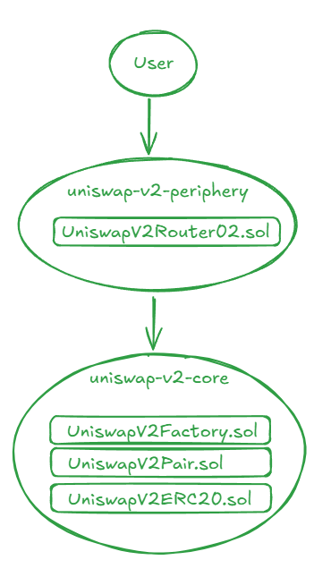
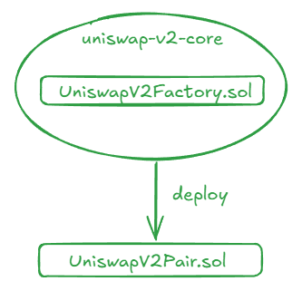
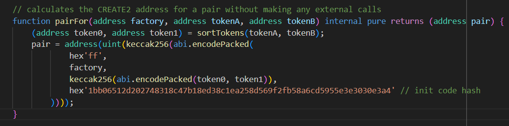
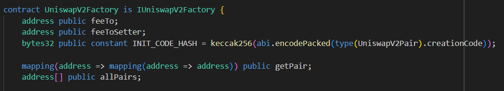
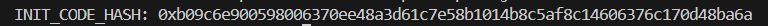
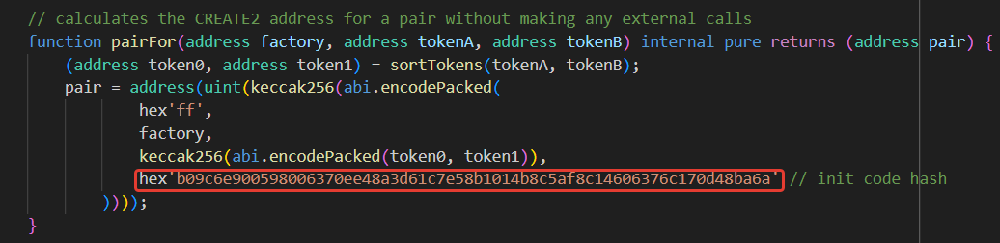

# Uniswap-v2 smart contracts fork

**Author:** [Alexey Kutsenko](https://github.com/bimkon144) 👨‍💻

In this guide, we will show how we quickly and easily forked Uniswap V2.

## Basic Knowledge

There are two main repositories:

- [uniswap-v2-core](https://github.com/Uniswap/v2-core).
- [uniswap-v2-periphery](https://github.com/Uniswap/v2-periphery).

### uniswap-v2-core

The uniswap-v2-core repository contains the key smart contracts: `UniswapV2ERC20.sol`, `UniswapV2Factory.sol`, and `UniswapV2Pair.sol`, which implement the core functionality of the Uniswap V2 protocol. These smart contracts enable decentralized token exchange.

You need to deploy:

- `UniswapV2Factory.sol`. Responsible for creating and managing exchange pairs (liquidity pools). The factory smart contract also tracks all existing pairs and their addresses. When a new token pair is created, the factory deploys a new `UniswapV2Pair.sol` smart contract, which represents the liquidity pool for this pair.
The `UniswapV2Factory.sol` smart contract, in turn, imports `UniswapV2Pair.sol`, which inherits from `UniswapV2ERC20.sol`.

### uniswap-v2-periphery

The `uniswap-v2-periphery` repository contains auxiliary smart contracts: `UniswapV2Migrator.sol`, `UniswapV2Router01.sol`, `UniswapV2Router02.sol`, and libraries: `SafeMath.sol`, `UniswapV2Library.sol`, `UniswapV2LiquidityMathLibrary.sol`, and `UniswapV2OracleLibrary.sol`. These interact with the core smart contracts from `uniswap-v2-core`. These smart contracts simplify interaction with the protocol for users and developers.

You need to deploy:

- `UniswapV2Router02.sol`. Provides a high-level interface for interacting with Uniswap pairs and pools. The main functionality includes functions for token swaps, adding liquidity, and removing liquidity. It includes the necessary libraries for protocol operation.

Thus, a user's interaction with the `UniswapV2Router02.sol` smart contract can be represented as a diagram:




And the creation of a new pair smart contract looks like this:




To solve our task, three main steps are required: preparing the codebase, configuring the smart contracts, and deploying the smart contracts.

## Preparing the Codebase

_Make sure that [Foundry](https://book.getfoundry.sh/getting-started/installation) it is installed, you can check with `forge --version`._

At this stage, we initialize our project and clone the Uniswap V2 smart contract repositories.

1) Initialize the project: `forge init UNISWAP-V2-FORK-SC && cd ./UNISWAP-V2-FORK-SC`
2) Add the v2-core and v2-periphery smart contracts: `git submodule add https://github.com/Uniswap/v2-core.git contracts/v2-core` and `git submodule add https://github.com/Uniswap/v2-periphery.git contracts/v2-periphery`
3) Add the `uniswap-lib` library, which is used in `v2-periphery` smart contracts: `git submodule add https://github.com/Uniswap/uniswap-lib lib/uniswap-lib` and the Foundry library required for scripts/tests`git submodule add https://github.com/foundry-rs/forge-std  lib/forge-std`
4) Update the source path in our `foundry.toml` file:

  ```toml
  //foundry.toml
  [profile.default]
  src = "contracts"
  out = "out"
  libs = ["lib"]
  optimizer = true
  optimizer_runs = 999999
  ```

5) Add the file to the root directory:

```text
//remappings.txt
@uniswap/lib/=lib/uniswap-lib/
@uniswap/v2-core/=contracts/v2-core/
@uniswap/v2-periphery/=contracts/v2-periphery/
forge-std/=lib/forge-std/src/
```

## Configuring Smart Contracts

Uniswap uses the `pairFor` method from the library smart contract for the operation of the `UniswapV2Router02` smart contract [UniswapV2Library.sol](https://github.com/Uniswap/v2-periphery/blob/master/contracts/libraries/UniswapV2Library.sol).


Using this method, the pair smart contract address is calculated based on:

- `hex'ff'`
- the address of the smart contract `Factory.sol`
- the addresses of the ERC-20 tokens in the pool
- `init code hash`.

Thus, Uniswap does not make any external calls to retrieve the pair address.

### What is `init code hash` and where can we find it?

The `init code hash` is the keccak256 hash of the bytecode responsible for deploying the `UniswapV2Pair.sol` smart contract.

There are several ways to obtain it:

a) By adding code to the smart contract:

Add the following line to the `Factory.sol` smart contract bytes32 public constant INIT_CODE_HASH = keccak256(abi.encodePacked(type(UniswapV2Pair).creationCode));`

After deploying the `Factory.sol` smart contract, we could retrieve the `init code hash` via the `INIT_CODE_HASH` method.

b) Via a JavaScript script:

```solidity
const { ethers } = require('ethers');
const fs = require('fs');
const path = require('path');

const jsonFilePath = path.resolve(__dirname, '../out/UniswapV2Pair.sol/UniswapV2Pair.json');

async function computeInitCodeHash() {
  try {
    // Reading the ABI JSON file.
    const contractJson = JSON.parse(fs.readFileSync(jsonFilePath, 'utf8'));

    // Check for the presence of bytecode in the ABI JSON file
    if (!contractJson.bytecode.object) {
      throw new Error('Bytecode not found in the ABI JSON file');
    }

    // Calculate `INIT_CODE_HASH` using the smart contract bytecode.
    const computedInitCodeHash = ethers.keccak256(contractJson.bytecode.object);

    console.log('INIT_CODE_HASH:', computedInitCodeHash);
    return computedInitCodeHash;
  } catch (error) {
    console.error('Error while calculating `INIT_CODE_HASH`:', error);
  }
}

computeInitCodeHash();
```

To avoid adding code to the smart contract and modifying the original Uniswap smart contracts, we will calculate the hash using JavaScript.

As you may notice, the calculation uses the `ethers` library, which can be installed with `npm install --save ethers`

Next, to get the smart contract bytecode, we need to run `forge build`

Finally, execute the calculation script `node ./script/compute.js`

The result will be displayed as follows:


The obtained hash must be inserted into the Uniswap library file `UniswapV2Library.sol` without the `0x` prefix


## Deploying Smart Contracts

Now, we proceed to the actual deployment of the smart contracts.

1) Deploy the `Factory` smart contract. Its main functionality is the creation of token pairs.

```bash
forge create src/v2-core/UniswapV2Factory.sol:UniswapV2Factory --rpc-url https://polygonzkevm-mainnet.g.alchemy.com/v2/demo --private-key putYourPrivatekeyHere --constructor-args "putFeeToSetterAddressHere" --verify  --etherscan-api-key ACCESS_KEY
```

`https://polygonzkevm-mainnet.g.alchemy.com/v2/demo` - The RPC network where the deployment will take place.

`putYourPrivatekeyHere` - The private key to be used for the deployment.

`putFeeToSetterAddressHere` - The address that will be able to set the protocol fee.

`ACCESS_KEY` - API key for smart contract verification. You can get it [here](https://zkevm.polygonscan.com/). To do this, you need to register and create an API key.

_During deployment, an error may occur if the blockchain does not support EIP-1559. In this case, you need to add the `--legacy` flag._

__If you are a Windows user, you might encounter the error: "Failed to create wallet from private key. Private key is invalid hex: Odd number of digits." To resolve this issue, you need to remove the `\r` symbol from the private key. You can do this by running the command `PRIVATE_KEY=$(echo $PRIVATE_KEY | tr -d '\r')`_

2) The `UniswapV2Router02` smart contract. It is responsible for adding and removing liquidity in pools and token swaps

```bash
forge create src/v2-periphery/UniswapV2Router02.sol:UniswapV2Router02 --rpc-url https://polygonzkevm-mainnet.g.alchemy.com/v2/demo --private-key putYourPrivatekeyHere --constructor-args "factoryAddressPutHere" "WETHAddressPutHere" --verify  --etherscan-api-key ACCESS_KEY
```

`https://polygonzkevm-mainnet.g.alchemy.com/v2/demo` - The RPC network where the deployment will take place.

`putYourPrivatekeyHere` - The private key to be used for the deployment.

`factoryAddressPutHere` - The address of the `Factory` smart contract.

`WETHAddressPutHere` - Wrapped Ether (WETH) address.

`ACCESS_KEY` - API key for smart contract verification.

For the testnet, we deployed the original code of the [WETH](https://etherscan.io/token/0xc02aaa39b223fe8d0a0e5c4f27ead9083c756cc2#code) smart contract.

3) Smart contract [multicall](https://github.com/mds1/multicall/blob/main/src/Multicall.sol).

The smart contract is designed for:

- Aggregating read results from multiple smart contracts into a single JSON-RPC request.
- Executing multiple state-changing blockchain calls within a single transaction.

You can read more details [here](https://github.com/mds1/multicall).

Although this smart contract is not part of the group of smart contracts required for its operation, it is still necessary for integrating the frontend.

At the time of writing this guide, this smart contract is already [deployed](https://zkevm.polygonscan.com/address/0xca11bde05977b3631167028862be2a173976ca11) on the Polygon zkEVM testnet. You can view the full list of networks where the smart contract has already been deployed [here](https://www.multicall3.com/deployments).

## Conclusion

Forking and deploying Uniswap V2 smart contracts may seem like a challenging task, but with the right tools and approach, it becomes much more accessible. In this guide, we covered the steps required to clone the source code, configure and deploy the smart contracts, and calculate the init code hash without modifying the original contracts.

Using libraries and tools such as Foundry and ethers.js significantly simplifies the process of developing and deploying smart contracts, allowing developers to focus on key aspects of integration and customization.

This guide demonstrates that with an understanding of basic concepts and accessible tools, developers can effectively fork and adapt popular protocols for their needs. These skills pave the way for creating new projects and products based on proven solutions like Uniswap V2.

## Links:

- [Overview of Uniswap V2 Operation](https://docs.uniswap.org/contracts/V2/concepts/protocol-overview/how-uniswap-works)
- [Uniswap V2 Book](https://www.rareskills.io/uniswap-v2-book)
- [Uniswap V2 Smart Contracts](https://docs.uniswap.org/contracts/v2/overview)
- [Foundry Documentation](https://book.getfoundry.sh/getting-started/installation)
- [Github - Uniswap V2 Core](https://github.com/Uniswap/v2-core)
- [Github - Uniswap V2 Periphery](https://github.com/Uniswap/v2-periphery)
- [Github - Uniswap Lib](https://github.com/Uniswap/uniswap-lib)
- [Multicall smart contract](https://github.com/mds1/multicall/blob/main/src/Multicall.sol)
- [API keys for Polygon zkEVM](https://zkevm.polygonscan.com/)
- [Multicall smart contract address in Polygon zkEVM](https://zkevm.polygonscan.com/address/0xca11bde05977b3631167028862be2a173976ca11)
