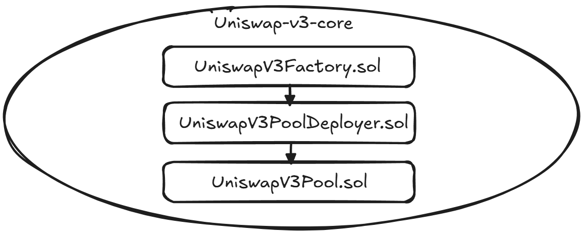

# Uniswap-v3 smart contracts fork

**Author:** [Aleksey Kutsenko](https://github.com/bimkon144) 👨‍💻

In this guide, we’ll show how to quickly and easily fork Uniswap V3.

## Basic Knowledge

There are two main repositories:

- [uniswap-v3-core](https://github.com/Uniswap/v3-core).
- [uniswap-v3-periphery](https://github.com/Uniswap/v3-periphery).

### uniswap-v3-core

The `uniswap-v3-core` repository contains the key smart contracts: `UniswapV3Factory.sol`, `UniswapV3Pool.sol`, and `UniswapV3PoolDeployer.sol`, which implement the core functionality of the Uniswap V3 protocol. These smart contracts implement the concentrated liquidity mechanism for token swaps.

The deployment scheme of a new pool looks like this:


`UniswapV3Factory.sol` is responsible for creating and managing swap pools with different fee parameters. The factory smart contract tracks all existing pools and their addresses. When a new token pool is created, the factory deploys a new `UniswapV3Pool.sol` smart contract through the helper contract `UniswapV3PoolDeployer.sol`.

### uniswap-v3-periphery

The `uniswap-v3-periphery` repository contains auxiliary smart contracts: `NonfungiblePositionManager.sol`, `NonfungibleTokenPositionDescriptor.sol`, `SwapRouter.sol`, and libraries like `PoolAddress.sol`, `LiquidityAmounts.sol`, and others. They interact with the core smart contracts from `uniswap-v3-core`. These smart contracts simplify interaction with the protocol for users and developers.

The following needs to be deployed:

- `SwapRouter.sol`. Provides an interface for swapping tokens through Uniswap V3 pools.
- `NonfungiblePositionManager.sol`. Manages liquidity positions represented as NFT tokens.
- `NonfungibleTokenPositionDescriptor.sol`. Provides metadata for position NFT tokens.
- `QuoterV2.sol`. Allows fetching preliminary swap quote information.
- `UniswapInterfaceMulticall.sol`. Enables aggregation of multiple calls into a single transaction.

_Important!_ The `Multicall2.sol` contract also needs to be deployed. It is not part of the `uniswap-v3-periphery` repository. It is located in a separate [repository](https://github.com/makerdao/multicall/blob/master/src/Multicall2.sol). It enables executing multiple read-only calls in a single request.

To complete our task, we’ll need several steps – preparing the codebase, configuring the smart contracts, and deploying the smart contracts.

## Preparing the Codebase

_Make sure that [Node.js](https://nodejs.org/en/download/) and [npm](https://www.npmjs.com/get-npm) are installed. You can check this with `node --version` and `npm --version`._

A bit later, we’ll also be using Hardhat and its deployment plugin – Hardhat Ignition.

At this stage, we’ll initialize our project and set it up to work with Uniswap V3.

1) Let’s create a new project and initialize it:
   ```bash
   mkdir UNISWAP-V3-FORK-SC && cd ./UNISWAP-V3-FORK-SC
   ```

2) Initialize the Hardhat project:
   ```bash
   # Project Initialization
   npx hardhat init
   ```

   Select "Create a TypeScript project".
   Agree to all the prompts.

3) Install the necessary dependencies:
   ```bash
   # Installing Hardhat Plugins
   npm install --save-dev @nomicfoundation/hardhat-ignition-ethers @nomicfoundation/hardhat-verify dotenv

   # Installing Uniswap Libraries and Dependencies
   npm install @uniswap/lib @uniswap/v2-core @uniswap/v3-core @uniswap/v3-periphery base64-sol
   ```

4) Create the folder structure and copy the Uniswap contracts:

  _We’re copying this way because there are errors in the audit folder that prevent the contracts from compiling._

  _So feel free to copy the code in any way that works best for you, even manually._
   ```bash
   # Creating the Directory Structure
   mkdir -p src/v3-core src/v3-periphery

   # Cloning Uniswap V3 Repositories into Temporary Directories
   git clone https://github.com/Uniswap/v3-core.git temp-v3-core
   git clone https://github.com/Uniswap/v3-periphery.git temp-v3-periphery

   # Copying Contracts from Temporary Directories into Our Structure
   cp -r temp-v3-core/contracts/* src/v3-core/
   cp -r temp-v3-periphery/contracts/* src/v3-periphery/

   # Deleting Temporary Directories
   rm -rf temp-v3-core temp-v3-periphery

   # Creating the Multicall2 Contract
   curl -o src/Multicall2.sol https://raw.githubusercontent.com/makerdao/multicall/master/src/Multicall2.sol

   # Creating the WETH Contract for Testnet. For Mainnet, you’ll need to specify this address in the .env file.

   curl -o src/WETH9.sol https://raw.githubusercontent.com/gnosis/canonical-weth/master/contracts/WETH9.sol
   ```

5) Let’s configure the file `hardhat.config.ts`:
   ```typescript
   import { HardhatUserConfig } from "hardhat/config";
   import "@nomicfoundation/hardhat-toolbox";
   import "@nomicfoundation/hardhat-ignition-ethers";
   import "@nomicfoundation/hardhat-verify";
   import 'dotenv/config';

   const PRIVATE_KEY= process.env.PRIVATE_KEY as string;

   const AMOY_RPC_URL = process.env.AMOY_RPC_URL;

   const POLYGON_API_KEY = process.env.POLYGON_API_KEY || '';

   const config: HardhatUserConfig = {
     solidity: {
       compilers: [
         {
           version: "0.7.6",
           settings: {
             optimizer: {
               enabled: true,
               runs: 200,
               details: {
                 yul: true
               }
             },
             viaIR : false,
           },
         },
         {
           version: "0.4.22"
         }
       ]
     },
     paths: {
       sources: "./src"
     },
     networks: {
       amoy: {
         url: AMOY_RPC_URL,
         accounts: [PRIVATE_KEY],
       }
     },
     etherscan: {
       apiKey: {
         amoy: POLYGON_API_KEY
       },
       customChains: [{
         network: "amoy",
         chainId: 80002,
         urls: {
           apiURL: "https://api-amoy.polygonscan.com/api",
           browserURL: "https://amoy.polygonscan.com"
         }
       }]
     }
   };

   export default config;
   ```

6) Create the .env file – `cp .env.example .env` – and fill in the fields:

   ```
   PRIVATE_KEY="deployer_private_key"

   AMOY_RPC_URL="RPC_URL"

   POLYGON_API_KEY="API_KEY"
   WETH_ADDRESS=""
   ```

`WETH_ADDRESS` – don’t specify the WETH token address for testnet, since our next script will deploy it.

For mainnet, you’ll need to add the required network to `hardhat.config.ts` and `.env`, and also specify the `WETH_ADDRESS` for that network.

7) Create Ignition modules for deployment

To do this, in the `ignition/modules/` folder, create a module that will handle deploying the contracts in the required sequence:

```typescript
//UniswapV3.ts file

import { buildModule } from "@nomicfoundation/hardhat-ignition/modules";
import 'dotenv/config';

export default buildModule('UniswapV3', (m) => {
  // Get the WETH address from the environment variable or deploy a new one if it's not specified
  const wethAddress = process.env.WETH_ADDRESS;
  const weth = wethAddress
    ? m.contractAt("WETH9", wethAddress)
    : m.contract("WETH9");

  // Deploy the factory
  const uniswapV3Factory = m.contract("UniswapV3Factory");

  // Deploy the swap router
  const swapRouter = m.contract("SwapRouter", [uniswapV3Factory, weth], {
    after: [weth, uniswapV3Factory],
  });

  // Deploy the library for the NFT descriptor
  const NFTDescriptor = m.library("NFTDescriptor");
  const nativeCurrencyLabelBytes = '0x46554e4e594d4f4e455900000000000000000000000000000000000000000000'; // cast format-bytes32-string "FUNNYMONEY"
  // These bytes represent the name of the network's native currency in bytes32 format.
  // "FUNNYMONEY" is a test name that should be replaced with the real currency name of your network (for example, "ETH" for Ethereum).

  // Deploy the descriptor for NFT positions
  const nonfungibleTokenPositionDescriptor = m.contract("NonfungibleTokenPositionDescriptor", [weth, nativeCurrencyLabelBytes], {
    after: [weth],
    libraries: {
      NFTDescriptor: NFTDescriptor,
    }
  });

  // Deploy the NFT position manager
  const nonfungibleTokenPositionManager = m.contract("NonfungiblePositionManager", [uniswapV3Factory, weth, nonfungibleTokenPositionDescriptor], {
    after: [uniswapV3Factory, weth, nonfungibleTokenPositionDescriptor]
  });

  // Deploy QuoterV2 for fetching quoted prices
  const quoterV2 = m.contract("QuoterV2", [uniswapV3Factory, weth], {
    after: [uniswapV3Factory, weth],
  })

  // Deploy the interface for multicalls
  const uniswapInterfaceMulticall = m.contract("UniswapInterfaceMulticall");

  // Deploy the standard Multicall2
  const multicall2 = m.contract("Multicall2");

  return {
    weth,
    uniswapV3Factory,
    swapRouter,
    nonfungibleTokenPositionDescriptor,
    nonfungibleTokenPositionManager,
    quoterV2,
    uniswapInterfaceMulticall,
    multicall2
  };
});
```

## Configuring Smart Contracts

For Uniswap V3 to work correctly, you need to calculate the bytecode hash of the `UniswapV3Pool` smart contract and replace it in the `PoolAddress.sol` library.

1) Create a script to calculate the hash:

    ```javascript
    // computeInitCodeHash.js файл

    const { ethers } = require('ethers');
    const fs = require('fs');
    const path = require('path');

    const jsonFilePath = path.resolve(__dirname, './artifacts/src/v3-core/UniswapV3Pool.sol/UniswapV3Pool.json');

    // Asynchronous function to read the ABI JSON file and compute the INIT_CODE_HASH
    async function computeInitCodeHash() {
      try {
        // Reading the ABI JSON file
        const contractJson = JSON.parse(fs.readFileSync(jsonFilePath, 'utf8'));

        // Checking for the presence of bytecode in the ABI JSON file
        if (!contractJson.bytecode) {
          throw new Error('Bytecode not found in the ABI JSON file.');
        }

        // Calculating INIT_CODE_HASH using the contract's bytecode
        const computedInitCodeHash = ethers.keccak256(contractJson.bytecode);

        // Outputting the result
        console.log('INIT_CODE_HASH:', computedInitCodeHash);
        return computedInitCodeHash;
      } catch (error) {
        console.error('Error while calculating INIT_CODE_HASH:`, error);
      }
    }

    // Function call
    computeInitCodeHash();
    ```

2) Compile the smart contracts:
   ```bash
   npx hardhat compile
   ```

3) Create the .env file and fill it with your own data:
   ```
   PRIVATE_KEY="your_private_key"
   AMOY_RPC_URL="amouy_RPC_URL"
   POLYGON_API_KEY="your_api_key_polygonscan"
   WETH_ADDRESS="Address_If_Mainnet"
   ```

4) Run the script to calculate the hash:
   ```bash
   node computeInitCodeHash.js
   ```

5) The obtained hash must be replaced in the file src/v3-periphery/libraries/PoolAddress.sol:
   ```solidity
   bytes32 internal constant POOL_INIT_CODE_HASH = GeneratedHash;
   ```

## Deploying Smart Contracts

Now we’re ready to deploy the smart contracts.

1) Compile the smart contracts:
   ```bash
   npx hardhat compile
   ```

3) Deploy the main Uniswap V3 smart contracts:
   ```bash
   npx hardhat ignition deploy ignition/modules/UniswapV3.ts --network amoy --deployment-id amoy --verify
   ```

After the deployment is complete, the smart contract addresses will be available in the `/ignition/deployments/[network_name]/deployed_addresses.json` directory.

_Important!_ The Ignition plugin sometimes glitches, so if you encounter a nonce issue, just keep running it until all contracts are deployed. The smart plugin will check which contracts are not deployed or not verified and will handle everything.

## Conclusion

Forking and deploying Uniswap V3 smart contracts may seem like a complex task, but with the right tools and approach, it becomes much more accessible. In this guide, we used Hardhat Ignition – a modern tool that significantly simplifies the process of deploying interconnected smart contracts.

Hardhat Ignition offers the following advantages:
- The ability to define the entire chain of dependencies between contracts in a single module
- Automated deployment of a complex contract system with a single command
- Built-in deployment state checking and the ability to resume after failures
- Integration with contract verification systems like Etherscan

An important aspect of working with Uniswap V3 is correctly calculating the `POOL_INIT_CODE_HASH`, which is required for proper computation of the addresses of created pools without modifying the original smart contracts. We covered how to do this using a JavaScript script.

If you're interested, we’ve prepared a [ready-to-use](https://github.com/fullstack-development/Uniswap-v3-Fork-SC/tree/main) repository for deployment.

## Links:

- [Official Uniswap V3 Documentation](https://docs.uniswap.org/contracts/v3/overview)
- [Uniswap V3 Book](https://uniswapv3book.com/)
- [Github - Uniswap V3 Core](https://github.com/Uniswap/v3-core)
- [Github - Uniswap V3 Periphery](https://github.com/Uniswap/v3-periphery)
- [Hardhat](https://hardhat.org/)
- [Hardhat Ignition](https://hardhat.org/ignition/docs/getting-started)
- [OpenZeppelin Contracts](https://github.com/OpenZeppelin/openzeppelin-contracts)
- [Multicall2 Smart Contract](https://github.com/makerdao/multicall)
- [Polygon Amoy API Keys](https://amoy.polygonscan.com/)
