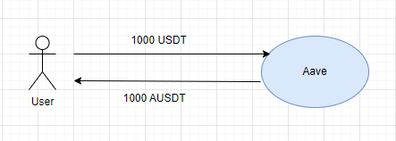
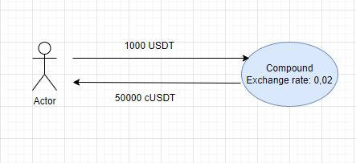

# The Aave DeFi Protocol

**Author:** [Pavel Naydanov](https://github.com/PavelNaydanov) 🕵️‍♂️

"The secret of success is constancy to purpose." - Benjamin Disraeli (1804-1881), Prime Minister of the United Kingdom in 1868 and 1874-80, writer.

It's time for an adventure with **Aave**! In this article, we will learn:
- What the AAVE lending protocol is.
- What tokens are available in Aave and how the protocol uses them.
- How interest rates work.
- How liquidation works in Aave.

**Important!** From now on, I will be talking about the **second version** of Aave!

## Aave Overview

_Brace yourself!_ **Aave** is one of the most popular decentralized lending protocols. It allows users to lend or borrow assets. Aave boasts one of the largest market sizes and credit pools among all lending protocols. Aave has long captured the hearts of cryptocurrency and blockchain technology enthusiasts.

This protocol simplifies the lending process and interest rate calculation for deposited or borrowed assets, offering a choice of interest rate types. Besides regular loans, Aave offers the possibility of obtaining a flash loan, which is called a **flash loan**. Such a flash loan does not require collateral.

Aave was created by Finnish programmer Stani Kulechov. On May 1, 2017, Kulechov founded ETHLend, and by November 2017, his company launched the first version of the lending platform called ETHLend.io. Later, the protocol faced its first problem - a lack of liquidity. As a result, it underwent a rebranding into **Aave**. In Finnish, **Aave** means "ghost."👻 The project's team explains this name by their ongoing intrigue of users with new crypto technologies while wishing to keep the service infrastructure open and transparent. On January 8, 2020, the first version of the Aave protocol was launched on the Ethereum mainnet.

About six months later, in October 2020, the Aave company released the eponymous native token of the platform, called **AAVE**. The primary purpose of the token is to organize a decentralized autonomous organization or DAO. Token holders have the opportunity to participate in voting. Voting concerns changes to the existing protocol or the implementation of new features. This means that the protocol delegates some of its governance to users who hold AAVE tokens. Before a protocol change is released, it must receive support from more than 50% of the votes. This achieves full decentralization in decision-making and further protocol development.

**How does lending work in Aave?** A user deposits collateral into the contract, and they can instantly borrow a certain amount of assets. Later, they will need to pay interest for using the borrowed funds.

For such a user, liquidity is required. They must be able to borrow funds at any time. In exchange, they must provide an adequate amount of collateral. Therefore, the available funds for borrowing must already be in the protocol. To attract such funds, the protocol offers an annual reward to users willing to provide their assets to the protocol. These assets will be offered by the protocol for borrowing.

Users of the Aave protocol can be divided into two categories:
- Borrowers
- Lenders

The lending mechanism and the division of users into two categories in the Aave protocol are very similar to the Compound protocol. However, there are some differences.

**Lenders.** This category of users deposits their assets to earn rewards based on the interest rate. In exchange, users receive aTokens on a 1:1 basis. AToken is analogous to cToken in the Compound protocol. By burning aTokens, users can get back their liquidity along with the accrued rewards.

**Borrowers.** This category of users provides collateral to the protocol. The collateral is locked as security or insurance for the protocol. In exchange, borrowers get the ability to borrow a certain amount of another asset. This amount will always be less than the collateral, as the value of the collateral must exceed the value of the borrowed asset. This allows Aave to avoid depleting its reserves when issuing loans. Users who wish to repay their debt must return the borrowed asset and pay interest. Until the debt is fully repaid, the collateral will remain locked in the protocol. Borrowers receive a DebtToken along with the loan, which contains information about their debt obligations.

The diagram below demonstrates how the lending protocol works. Lenders deposit tokens and receive aTokens. Borrowers deposit collateral and receive tokens.

Lenders are the ones who provide liquidity to the protocol, which is subsequently used for lending. Lenders can be considered full-fledged liquidity providers for the credit protocol.

## ATokens and DebtTokens

What is an aToken? It's a special interest-bearing token issued to users when they deposit funds into the protocol. The "A" in the name stands for Aave. So, when a user deposits the USDT token into the protocol, they receive the AUSDT token in return.

aTokens are issued at a 1:1 ratio relative to the deposited amount of tokens. This is where Aave differs from Compound, where users receive cTokens based on the current exchange rate (current [Exchange Rate](https://docs.compound.finance/v2/ctokens/#exchange-rate)).

> **Aave:** If we deposit 1000 USDT, we receive 1000 AUSDT.

> **Compound:** Exchange rate 0.02. If we deposit 1000 USDT, we receive 1000 / 0.02 = 50,000 cUSDT.

Users who hold aTokens receive a share of the total earnings from loans. Borrowers who use these funds in loans pay interest based on the protocol's interest rate. The holder of aTokens earns a reward proportional to their share of the assets relative to all the funds deposited in the protocol.

aTokens have all the standard ERC20 methods implemented: `balanceOf()`, `transfer()`, `transferFrom()`, `approve()`, `totalSupply()`, and more.

> `balanceOf()` returns the primary balance plus the accrued reward.

In the Compound protocol, interest on loans is calculated per block. The interest accrual logic is implemented within the cToken contract through the `accrueInterest()` method.

In contrast to Compound, the Aave protocol goes further by implementing a separate token for borrowers that stores information about their debt. This debt token is called a **debtToken**. Essentially, it's like an interest-bearing token, similar to aToken, but it stores information about the borrower's debt. This token is minted and burned when the `borrow()` and `repay()` methods are called. Below is an illustration of the movement of aTokens and debtTokens for those who are simply depositing tokens for interest and for those who are taking out loans.

It's worth noting that to take out a loan, you first need to deposit tokens as collateral into the protocol, essentially becoming a supplier and receiving aTokens. After that, based on your collateral, you can become a borrower, take out tokens as a loan, and receive debtTokens.

There are two types of debtTokens:
1. Stable debt token
2. Variable debt token

These two types are designed to implement different interest accrual methods for loans. We'll discuss this further shortly.

Despite these tokens being implemented using the ERC20 standard, they cannot be transferred using standard `transfer()` and `allowance()` functions.

> `balanceOf()` will always return the accumulated debt of the user.

> `totalSupply()` will always return the total debt accrued for all users in the protocol for a specific type (stable or variable) of debtToken.

## Liquidations

The liquidation process in Aave occurs when the **collateral value of an asset** no longer covers the **value of borrowed funds**. In this regard, Aave is no different from Compound. Such a situation can occur when the collateral decreases in value, or conversely, the borrowed funds increase in value. The liquidation process depends on the ratio of the collateral value to the borrowed funds' value. However, Aave introduces the concept of a **health factor** to differentiate itself.

In Compound, users rely on a special indicator that shows the percentage of collateral utilization. When this indicator reaches 100%, liquidation becomes available. This indicates that the collateral no longer provides insurance for the protocol because the loan is effectively worth more or nearly as much as the locked collateral. It is unacceptable for the protocol for a loan to become more valuable than the collateral, as this could deplete the protocol's funds and disrupt the balance.

In Compound, the `closeFactorMantissa()` parameter is responsible for the ability to liquidate a position, describing the maximum possible amount for loan repayment, ranging from 0 to 100%. Liquidators receive a reward for this.

In Aave, as mentioned earlier, the concept of a **health factor** is introduced, serving as the primary metric for liquidation. In other words, the health factor indicates the safety of collateral concerning the borrowed asset and its base value. The higher this value, the safer the collateral. When the health factor falls below 1, liquidation becomes possible.

During liquidation, up to 50% of the borrower's debt can be repaid. This is determined by a constant in the [LendingPoolCollateralManager contract](https://github.com/aave/protocol-v2/blob/master/contracts/protocol/lendingpool/LendingPoolCollateralManager.sol#L39C29-L39C61). This cost, along with a liquidation fee, is deducted from the liquidated collateral. After liquidation, the borrower's debt is repaid in full.

> Example!
> 1. Bob deposits 10 ETH and borrows 6 ETH in USDT.
> 2. If Bob's health factor falls below 1, a liquidator has the opportunity to liquidate Bob's loan.
> 3. The liquidator can repay up to 50% of the loan amount, which would be equal to the amount of USDT worth 3 ETH.
> 4. In return, the liquidator is entitled to claim a reward equal to 5% of the liquidated amount.
> 5. The liquidator requests 3 + 0.15 ETH to repay the USDT worth 3 ETH.

How is the health factor calculated? The health factor is calculated according to the formula: the user's total collateral (in ETH) is multiplied by the current liquidation threshold and divided by the user's total borrows (in ETH).

>HF = ∑collateral in ETH * Liquidation threshold / total borrows in ETH

In this context, the liquidation threshold (LT) is the percentage at which the loan is considered undercollateralized. For example, a liquidation threshold of 90% means that if the value of the borrowed funds exceeds 90% of the collateral's value, the loan is considered undercollateralized and may be subject to liquidation.

The health factor can be likened to the concept of maintenance margin in margin trading, as it represents the total amount of assets that must remain in the user's wallet to keep an order to buy or sell open. This indicator helps avoid a **margin call**.

Both the health factor and maintenance margin serve as safety indicators for borrowed funds. Both parameters signal a need to review the loan position. In the case of Aave, it signals the need for liquidation. In the case of margin trading, it signals a **margin call**.

Can I become a liquidator myself? Yes, the liquidation mechanism is open to anyone, but there is substantial competition in this field.

To initiate liquidation, you need to call the `liquidationCall()` function on the [LendingPool contract](https://github.com/aave/protocol-v2/blob/master/contracts/protocol/lendingpool/LendingPool.sol#L425). However, automated bots or even entire liquidation systems are typically created for this purpose.

For a liquidator's work to be profitable, you need to consider the cost of gas. Keep in mind that initiating the liquidation process requires calling a method on the contract and paying gas fees. If the gas price is too high, liquidation may not be profitable. You can review the profitability of liquidation in the [official documentation](https://docs.aave.com/developers/v/2.0/guides/liquidations#calculating-profitability-vs-gas-cost).

## Advanced Features

### Collateral Swap

Users have the ability to swap their collateral from one token to another, such as from ETH to USDT, if they anticipate a decrease in the price of Ether.

For the user, this appears as a single transaction. We assume that the user has already deposited 10 ETH as collateral. Afterward, they initiate a token swap for their collateral. Essentially, they receive their 10 ETH back, but they must return an equivalent amount in a different token by the end of the transaction. In the screenshot below, the user returns 15,000 USDT at an exchange rate of 1 ETH = 1,500 USDT. The cost is determined using a price oracle for security.

This feature is useful when you want to exchange your collateral for a different asset or an asset with a higher interest rate that can provide you with greater rewards. With this swap, there's no need to exit the protocol and repay your loan. Therefore, such a swap is convenient and cost-effective, as the user doesn't need to perform additional transactions, saving on gas fees.

> For example, if the price of your collateral starts falling, you can simply exchange it for a stablecoin. This way, you can avoid worrying about price fluctuations and the potential risk of losing your collateral, as stablecoins are less volatile.

## Native Credit Delegation

Since users receive **debtTokens**, which essentially represent debt obligations, they can delegate their credit. In Aave, this is referred to as "Native Credit Delegation."

This option allows liquidity providers to invest funds in the protocol. They can then delegate the right to borrow to another user. Instead of borrowing funds themselves, they allow someone else, a "friend" or another user, to borrow on their behalf without providing collateral.

To grant the ability to borrow to another user, a liquidity provider must call the `approveDelegation()` method. This function takes two arguments:
- **delegatee**: An address argument representing the address to whom the liquidity provider delegates the borrowing capability.
- **amount**: The amount the delegatee can borrow.

Based on these two arguments, a liquidity provider can distribute their lending capacity among multiple users for different amounts. Native Credit Delegation, therefore, offers significant flexibility.

## Flexible Rates

The interest rate in Aave is implemented flexibly, hence the name "flexible rates." As mentioned earlier, there are two types of debtTokens. This is necessary to implement two different interest rate models. Users can choose either of the two interest rate categories when borrowing:

- Fixed interest rate.
- Variable interest rate.

A **fixed interest rate** is a rate that does not change over time. It reflects the average interest rate charged in the market for a specific asset. However, it's worth noting that a fixed interest rate is not entirely fixed. It's more accurate to say that it is less susceptible to market fluctuations and changes less frequently.

On the other hand, a **variable interest rate** operates differently. It is a rate that constantly changes based on supply and demand dynamics in the market. It is determined by an algorithm that tracks the funds in user pools. The higher the loan amount for an asset, the higher the demand, and consequently, the variable interest rate.

Users who borrow funds can switch between fixed and variable rates, and there are no restrictions imposed by Aave on this. Users typically choose their interest rate based on their own goals and preferences. If you want to earn returns immediately, a variable interest rate might be more suitable, as it can help you profit from price differences. If you need a long-term loan and want to know exactly how much interest you'll accrue, a fixed interest rate might be preferable.

To manage the interest rate when borrowing in the `borrow()` function of the LendingPool contract, there's an `interestRateMode` argument, which is of type uint256. Users can pass either 1 for a fixed interest rate or 2 for a variable rate.
> Fixed - 1.
> Variable - 2.

The default parameter can be changed through the DAO of the Aave protocol via community voting.

To switch the interest rate after borrowing, a user needs to call the `swapBorrowRateMode()` function on the LendingPool contract. This function takes two arguments: `asset` (the address of the borrowed asset) and `rateMode` (the interest rate category). It accepts 1 for a fixed interest rate and 2 for a variable rate.

The mathematical component of interest rate calculation in Aave, like in Compound, revolves around the concept of **utilization rate**. This rate signifies the availability of funds for borrowing. The interest rate is calculated based on this rate:
- When there are few assets available for borrowing, the borrowing interest rate is high.
- When there are many assets available for borrowing, the borrowing interest rate is low.

This encourages users to borrow or, more importantly, to repay their debt obligations.

In Aave, the equivalent of **kink** in Compound is the concept of optimal utilization rate. When this rate is reached, the borrowing interest rate increases sharply along the curve. This prevents the depletion of all 100% of available assets for borrowing. In other words, once the utilization rate exceeds the optimal utilization rate, the borrowing interest rate is calculated differently.

- When U <= U_optimal, the borrowing interest rate slowly increases as available funds decrease.
- When U > U_optimal, the borrowing interest rate sharply increases to 50%.

For more details, along with all the mathematical formulas, you can refer to the [official Aave documentation](https://docs.aave.com/risk/liquidity-risk/borrow-interest-rate).

## Example

You can find a "very" simple interaction example with the Aave protocol [here](./contracts/src/AaveLendingAdapter.sol).

This contract involves simple calls to the **LendingPool.sol** contract of the Aave protocol for providing/withdrawing liquidity, borrowing/repaying debt, and liquidation.

**Important!** Be attentive, if you want to compile the project and run tests, you need to set an environment variable. Please refer to the [readme](./contracts/readme.md) for details.

## Conclusion

As of today, Aave continues to expand its ecosystem in the DeFi space. In July 2020, the Aave community approved a proposal to launch its own stablecoin called GHO. Nearly 100% of AAVE token holders supported this proposal to create GHO with overcollateralization and a peg to the US dollar.

The issuance of this stablecoin aims to make borrowing within the Aave protocol even more competitive. Additionally, it is expected to generate income for the entire Aave community. You can read more about this in the excellent article by André Beganski, ["Aave DAO Approves Creating GHO Stablecoin"](https://decrypt.co/106325/aave-dao-approves-creating-gho-stablecoin).

The GHO stablecoin will operate according to a model inspired by MakerDao's DAI. The native interest rate for the stablecoin will be determined by the Aave DAO.

Aave is an excellent decentralized lending protocol designed for experienced users. It offers several innovative competitive advantages. Aave provides a wider selection of tokens compared to Compound and offers unique features like **flexible rates**, **collateral swap**, and **native credit delegation**.

This protocol extends beyond the Ethereum network thanks to its proprietary solution called Portal. This allows for instant token swaps between different networks.

However, despite its advantages, Aave can be quite challenging for newcomers and is considered a tool for professional users. This complexity is due in part to another remarkable feature of Aave that requires technical knowledge in smart contract development: **flash loans**. This topic is worth exploring in a separate article, which we will delve into [here](./flash-loans/README.md).
