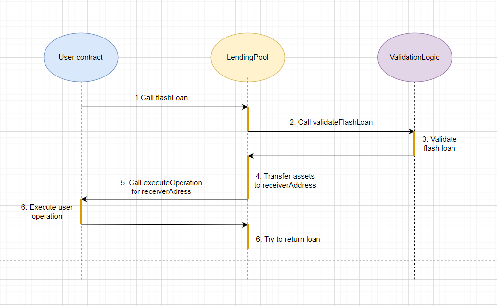

# Flash Loans and Their Practical Applications

**Author:** [Pavel Naydanov](https://github.com/PavelNaydanov) 🕵️‍♂️

_Alert!_ **Flash loans** are a type of lending that doesn't require collateral to secure the loan. In other words, it's a quick loan. The primary condition for such a loan is that the borrower must repay the debt within a single transaction. This means that the borrower borrows assets and must return the debt by the end of the transaction. Failure to do so will result in the protocol canceling the transaction.

_Off the top!_ A blockchain transaction is atomic, meaning it either executes fully or not at all. If the borrowed amount isn't returned by the end of the transaction, the entire transaction is canceled.

Somewhere between borrowing and repaying the debt, the borrower must perform necessary operations with the borrowed assets. They can use the loaned funds at their discretion.

**Flash loans** are currently popular in several modern decentralized lending protocols. They possess the following unique characteristics:
- **Smart Contract**: Flash loans use a smart contract, which monitors compliance with lending conditions.
- **No Collateral**: Instead of collateral, the borrower must return the funds within a single transaction.
- **Speed**: Since borrowing and repayment occur within a single transaction, the operation speed is very high.
- **Zero Risk**: If the loan isn't repaid by the end of the transaction, the transaction is canceled. The borrower doesn't lose funds because they didn't provide collateral.

## History of Flash Loans

The concept of **flash loans** was first mentioned by the Marble protocol in 2018. Marble referred to itself as a "smart contract bank" on the Ethereum network. The project positioned itself as a decentralized open-source lending protocol. Its innovation was the ability for a smart contract to execute any arbitrary code after a loan. The crucial condition was returning the funds to the smart contract within a single transaction. You can read more about it in Max Wolff's article, ["Introducing Marble"](https://medium.com/marbleorg/introducing-marble-a-smart-contract-bank-c9c438a12890).

The real game-changer came when Aave launched its liquidity pool-based lending protocol in January 2020. A new era began for **flash loans** because Aave enabled third-party developers to build DeFi applications based on flash loans. Moreover, the size of a flash loan could reach millions of dollars, with a fee of just 0.09% of the borrowed amount.

Developers quickly realized the immense potential of **flash loans**, shortly after Aave's release. However, flash loans became widely sought after a few months later, thanks to the increasing number of DeFi users and rising fees on the Ethereum network. Ordinary operations with DeFi protocols had become too expensive. Using **flash loan**-based strategies significantly reduced gas costs and introduced new profit-making opportunities.

## How Flash Loans Work

Currently, we know that two main entities are involved in lending protocols:
- Lender
- Borrower

To interact with the lender using the flash loan instrument, the borrower needs to develop a **smart contract**. This smart contract must perform three actions:
1. **Borrow funds from the lender**: In this case, the lender is lending protocols that provide flash loan functionality, like Aave.
2. **Any other operations**: For example, buying or selling assets on an exchange.
3. **Repay borrowed funds to the lender** with interest for using the loan.

All of this occurs within a single transaction, as shown in the diagram below.


According to the diagram, the working principle is as follows:
1. The user takes out a flash loan from the **Lending Protocol**, which provides assets for free use.
2. The user performs any actions with the borrowed funds, such as buying on one exchange and selling on another.
3. The user repays the loan, returning the borrowed funds and paying interest.
4. The **Lending Protocol** checks its balance. If the user hasn't returned enough funds, the credit protocol immediately cancels the transaction.

## What Can You Use Flash Loans For?

**Flash loans** have a wide range of applications. They are used to increase trading volumes and for liquidating positions. Below are some of the most popular use cases.

### Arbitrage Trading

_Alert!_ **Arbitrage** is a profit-making strategy that takes advantage of different prices for the same asset on one or multiple exchanges.

Arbitrage can be schematically represented as follows.


**Flash loans** allow the use of borrowed funds for arbitrage with zero risk. There's no risk because the lending protocol will automatically cancel the transaction if there aren't enough funds to repay the debt. So, if the borrower makes a loss due to inter-exchange operations, miscalculates gas costs, or experiences price slippage, they won't risk their own funds or the lending protocol's funds. However, if the borrower calculates their profit correctly in arbitrage, a flash loan can significantly increase their profit.

Besides the risk factor, **flash loans** offer high execution speed, which is beneficial for arbitrage trading. Executing a single transaction instead of two separate ones (one for buying and one for selling) is more cost-effective. This protects against price slippage and allows you to take advantage of an arbitrage window (the moment when arbitrage trading is profitable).

Another significant advantage is the ability to leverage additional assets from lending protocols. There's no need to possess initial capital; you can always take out a collateral-free **flash loan**.

For example, an algorithm might look like this:


> 1. Take out a flash loan on an asset from the lending protocol.
> 2. Use the borrowed funds to buy an asset on an exchange where it's cheaper.
> 3. Sell the asset on an exchange where it's more expensive.
> 4. Repay the debt + interest to the lending protocol and keep the profit.

Arbitrage trading is one of the most popular applications of **flash loans**. Additionally, this type of arbitrage helps maintain the inter-exchange price of any asset. If the price falls on one exchange, there will always be an arbitrageur who, through their actions, balances the price. In this case, **flash loans** help arbitrageurs align the market.

### Self-Liquidating Loans

Traditional loans require collateral to be locked up. If the value of the collateral falls relative to the borrowed amount and no longer secures the loan, a **liquidator** can partially or fully liquidate the loan.

**Flash loans** are the only tool that can facilitate self-liquidation without penalties. I'm not talking about partial repayment of the debt or increasing the collateral amount. While these methods can help avoid liquidation, we're currently focusing on flash loans.

How does it work? A borrower can save their loan as follows:


> 1. Take out a flash loan.
> 2. Repay the debt with the loaned funds, thus releasing the collateral.
> 3. Use a portion of the collateral to repay the flash loan, including associated fees.

By using flash loans, users can avoid penalties for loan liquidation.

### Collateral Swapping

Usually, collateral replacement for a loan may only be necessary if the price of the collateral asset drops. When the collateral's value decreases, the loan inevitably approaches liquidation. In such cases, you can avoid liquidation by replacing the collateral with a less volatile asset.


Replacing collateral without using **flash loans** requires closing the loan entirely, which happens in multiple stages, resulting in higher transaction fees.

### Loan Refinancing

Interest rates on loans in different lending protocols are constantly changing due to market conditions and liquidity. **Flash loans** have become a convenient tool for moving a loan from one protocol to another with lower interest rates. Additionally, there's always an option to change the collateral.

The loan refinancing process looks like this:


> 1. Take out a flash loan.
> 2. Repay the debt with the loaned funds, thus releasing the collateral.
> 3. Deposit collateral into another protocol with lower interest rates.
> 4. Take out a loan in the new protocol.
> 5. Use a portion of the loan to repay the flash loan, including associated fees.

## Flash Loans in Uniswap

It's worth noting that the Uniswap exchange introduced its own version of **flash loans** called **"flash swaps"**. This feature was launched in the second version of the protocol in May 2021.

In reality, with the second version of the protocol, all swaps on Uniswap are considered **flash swaps**. The protocol can cancel any swap transaction if it determines that it didn't receive enough tokens in return. Furthermore, any call to the `swap()` method on Uniswap takes a `data` parameter of type `bytes`. This parameter is responsible for executing user operations when receiving funds.

> function swap(uint amount0Out, uint amount1Out, address to, bytes calldata data);

If **data.length** is 0, it means that the contract first receives the token for swapping and then gives out tokens in return.

If **data.length** is greater than 0, the contract first sends tokens and then calls what's encoded in the data. If the contract doesn't receive its share of the token at the end of the transaction, the transaction is canceled.


## Flash Loans in Aave V2

In the second version of the protocol, to use a flash loan, you need to call the `flashLoan()` method on the [LendingPool](https://github.com/aave/protocol-v2/blob/master/contracts/protocol/lendingpool/LendingPool.sol#L483) contract.

It's important to note that flash loans in the Aave protocol are intended for developers. This is because their implementation requires knowledge of smart contract development and an understanding of blockchain technology's fundamental principles.


```solidity
function flashLoan(
    address receiverAddress,
    address[] calldata assets,
    uint256[] calldata amounts,
    uint256[] modes,
    address onBehalfOf,
    bytes calldata params,
    uint16 referralCode
)
```

The `flashLoan` function accepts the following arguments:

1. **receiverAddress:** The address of the contract that will receive assets from the protocol. This contract must implement the `IFlashLoanReceiver` interface and will perform additional user operations with the borrowed assets.

2. **assets:** An array of reserve addresses for the loan. These are the addresses of tokens participating in the flash loan.

3. **amounts:** An array of numbers indicating the amount of assets to be borrowed.

4. **modes:** An array of numbers representing the debt management mode for each type of asset. This applies if the loan is not repaid before the end of the transaction and can take the following values:
    - 0: The debt must be repaid, or the transaction will revert.
    - 1: A regular loan with a stable interest rate will be taken.
    - 2: A regular loan with a variable interest rate will be taken.

5. **onBehalfOf:** This is the address that must have enough collateral to secure a regular loan. It is used when the mode parameter is set to 1 or 2.

6. **params:** Parameters encoded in bytes that will be used by the `receiverAddress` contract.

7. **referralCode:** The Aave referral program code.


How does the `flashLoan` function work under the hood? The answer to this question is illustrated by the diagram below, which shows what happens after calling the `flashLoan()` function.


According to the diagram:
1. To utilize a flash loan, it's necessary to implement a **User contract**. This contract should implement the [IFlashLoanReceiver](https://github.com/aave/protocol-v2/blob/master/contracts/flashloan/interfaces/IFlashLoanReceiver.sol) interface and call the `flashLoan()` function on the [LendingPool](https://github.com/aave/protocol-v2/blob/master/contracts/flashloan/interfaces/IFlashLoanReceiver.sol) contract. Inside this function, the complete list of arguments, as outlined in the documentation mentioned above, must be provided.
2. Inside the **LendingPool** contract, the validity of the provided arguments will be checked initially. It's essential that the length of the **assets** array matches the length of the **amounts** array. This validation is handled in a separate contract known as [ValidationLogic](https://github.com/aave/protocol-v2/blob/master/contracts/protocol/libraries/logic/ValidationLogic.sol).
3. After the validation, **LendingPool** will transfer the requested funds to the user contract's address.
4. Following the fund transfer, **LendingPool** will invoke the `executeOperation()` method on the user's contract.
5. The user's contract will execute any operations defined within the `executeOperation()` method. For instance, this could involve arbitrage trading or token buying and selling.
6. After executing `executeOperation()`, **LendingPool** will attempt to return the borrowed funds along with the loan interest.

The return of funds can occur in several ways, at the discretion of the borrower. This is controlled by the **modes** argument, which is an array of integers. Each integer value indicates the debt repayment mode for the respective asset. The entire process of returning borrowed funds to the protocol is illustrated in the diagram below.


To decode this diagram:
- If the **mode** for a specific asset is set to 0, the protocol will attempt to return the funds at the end of the transaction. It will calculate the total amount (loan + interest) required for repayment and attempt a `transferFrom()` to the **LendingPool** contract's address. Before this, it will update the token reserve information on the contract. If there are insufficient funds for the transfer, the transaction will be reverted.
- If the **mode** for a particular asset is set to 1 or 2, it means the user has chosen to cover the flash loan differently, by converting it into a regular loan. The protocol will automatically verify the presence of the required collateral at the address specified in the **onBehalfOf** parameter and execute the loan operation to repay the debt from the flash loan.

## Example

I have prepared a complete contract [Liquidator](./contracts/src/Liquidator.sol) to demonstrate how to work with `flashLoan()`. This contract allows you to liquidate a borrower's position using a flash loan within a single transaction. The rewards from the liquidation process will be sent to the user's wallet.

**Important!** Please be attentive; if you want to compile the project and run tests, you need to set an environment variable. See [readme](./contracts/readme.md).

## Flash Loan Applications

**What can a user who doesn't know how to write smart contracts do?** Currently, there are numerous applications that have built web interfaces for working with flash loans. All of these interfaces are based on decentralized lending protocols.

### CollateralSwap

This [web service](https://docs.collateralswap.com/) has an extremely user-friendly interface. The only limitation is that it currently only works with the MakerDAO protocol.

The service accomplishes two tasks:
1. Rapid collateral swapping without the need for loan repayment.
2. Self-liquidation of loans without penalties.

In both cases, CollateralSwap charges fees for using the service.

### DeFi Saver

This is a full-fledged [decentralized application](https://defisaver.com/) that allows you to create your own asset and loan management strategies using flash loans. The application supports MakerDao, Aave, Compound, dYdX, and other protocols. DeFi Saver is best known for its leveraged debt management tool, allowing users to manage it, increase, or repay it all in a single transaction.

The application offers a wide range of functionalities:
- Supports multiple wallets: MetaMask, Ledger, Trezor, Argent, TrustWallet.
- Yield farming: Depositing assets for annual interest.
- Exchange: Swapping one token for another.
- Smart Savings: A tool that enables quick asset transfers between protocols.
- Smart Wallet: A wallet for smart contracts without restrictions on complex transactions.
- DeFi Recipe Creator: A tool for creating complex sequences of transactions involving multiple actions. For example, a user can create a strategy like "Borrow 5000 USDT from Aave v2, exchange USDT for UNI on Uniswap."
- DeFi Saver Automation: An automated loan management system with collateral.

### Furucombo

This [application](https://furucombo.app/) allows users to easily create their own DeFi strategies using a simple interface. These strategies are called **"combos"**. Inside a **"combo,"** you can build various strategies by dragging and dropping different actions. Each transaction within a **"combo"** is represented as a cube. Users can customize the parameters of the cubes and their order. The service then combines all the cubes into a single transaction and executes it. Flash loans from Aave serve as the foundation for most of the templated **"combos"** available in this application.

It's an excellent tool for people who want to perform actions across different protocols using flash loans.

## What Risks Do Flash Loans Carry?

Flash loans may seem completely risk-free. If something goes wrong, the flash loan won't execute, and the transaction will be canceled. After all, no collateral is required for the loan, and there is no risk to one's own assets.

So, **what is the danger?** The danger lies in the fact that flash loans can be turned into "weapons." There are two main reasons why flash loans are attractive to malicious actors:

1. Many attacks require a substantial initial capital. For example, price oracle manipulations.
2. Flash loans are risk-free, meaning they minimize the risk for malicious actors. Attackers don't have to risk their own capital to carry out malicious actions.

Therefore, **flash loans** are extremely dangerous for decentralized applications. Let's look at a few examples of successful attacks that have shaken the community.

1. Applications that use DAOs as a voting mechanism for making governance decisions can be vulnerable. An attacker can take out a flash loan and use it to participate in voting. A notable example of such an attack is the **DeFi Beanstalk** protocol, which was attacked in April 2022. The attacker used flash loans to vote for their own proposal to withdraw assets. The damage amounted to approximately $77 million.

2. Flash loans can be used to manipulate prices on DEXs. Such an attack occurred in February 2020 involving the **dYdX** trading platform. The attacker borrowed millions of ETH, exchanged them for BTC on one platform, opened a short position against BTC on another platform, sold BTC to crash its price, closed the short position with profit, and then repaid the loan, pocketing a profit of $360,000.

3. One of the most infamous flash loan attacks involved the **bZx** protocol. The attacker borrowed funds from the protocol and immediately swapped them for a stablecoin (sUSD). Since the stablecoin is governed by a smart contract, the attacker manipulated its price by placing a large buy order for sUSD, driving its price up to $2, doubling its pegged value. The attacker then took a larger loan in more expensive sUSD, repaid their loans, and walked away with the profit.

4. The **CREAM Finance** application suffered multiple attacks in 2021, with one of the largest hacks totaling $130 million. Attackers stole CREAM liquidity tokens worth millions of dollars over an undisclosed period. Like most hacks, the attacker used multiple **flash loan** contracts and manipulated price oracles.

5. In May 2021, an attacker exploited the **PancakeBunny** platform, making off with around $3 million. They started by taking out a massive BNB loan on **PancakeSwap**, then engaged in several BUNNY/BNB and USDT/BNB trading manipulations. They bought and sold tokens, accumulating a large number of BUNNY tokens, which they promptly dumped, repaid their debt, and vanished with the profit. These events led to a shocking drop in PancakeBunny's price from $146 to $6.17.

Of course, decentralized application developers are trying to combat flash attacks. Security experts study various protocol hacks. All of this has led to two solutions that should help better withstand attacks.

- Decentralized price oracles: Since most attacks revolve around asset price manipulation, addressing this is crucial. For example, attacks involving price manipulation would be more challenging if the protocol relied not on a single DEX but on a decentralized oracle that aggregates prices from multiple DEXs or independent sources.
- Security platform adoption: This includes smart contract audits and the use of proven solutions when implementing contracts from the OpenZeppelin library. The role of this library is to protect smart contracts and applications as a whole.

## Conclusion

**Flash loans** are an excellent addition to the DeFi ecosystem. Despite being frequently used for malicious purposes at present, they hold enormous potential in the creation of decentralized applications.

**Flash loans** represent an advanced technique for borrowing assets without the need for collateral. Typically, these loans are used for arbitrage trading, which helps balance the asset prices across various decentralized exchanges. Less frequently, they are used for collateral swaps or loan liquidations without penalties. **Flash loans** are unique to blockchain technology and, at the same time, pose one of the most significant threats that developers should be aware of. Nevertheless, they remain a powerful tool used to stabilize the economy within DeFi.
