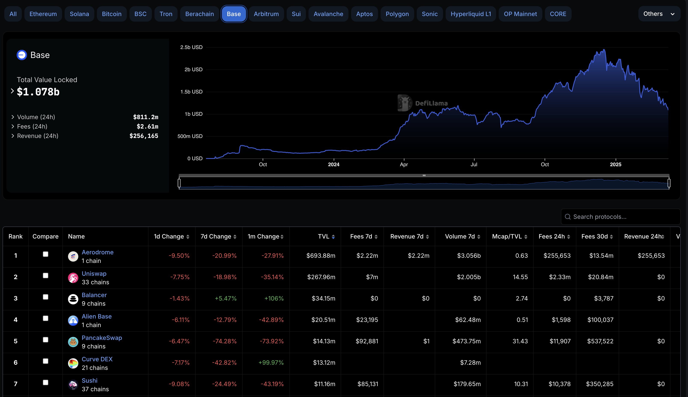
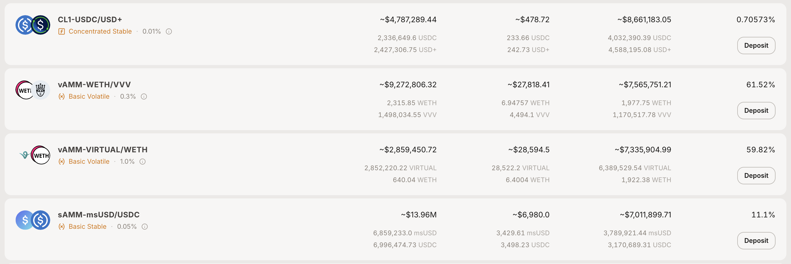
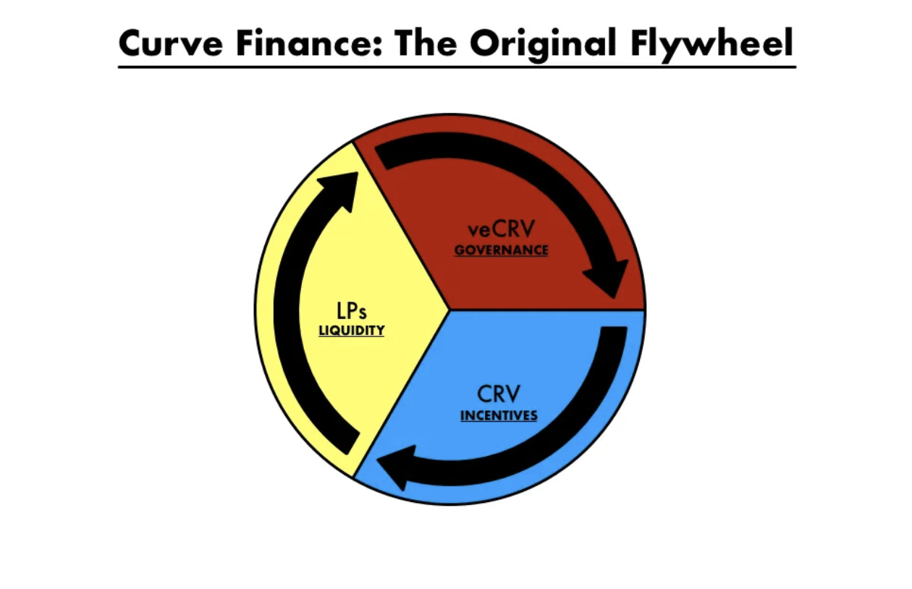
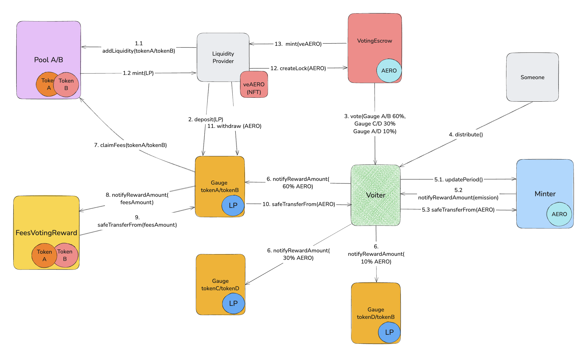

# Aerodrome

**Author:** [Roman Yarlykov](https://github.com/rlkvrv) 🧐

[Aerodrome](https://www.aerodrome.finance/) is a decentralized exchange (DEX) on the Base network built on an AMM model. The project team has attempted to combine proven mechanics from three well-known DeFi protocols: Uniswap, Curve, and Convex, thereby positioning Aerodrome as a MetaDEX.

In addition, Aerodrome is a fork of the [Velodrome v2](https://velodrome.finance/) protocol (deployed on Optimism), developed by the same team but launched with new tokens and an updated tokenomics model. Previously, the tokens VELO and veVELO were used, but now they've been replaced by AERO and veAERO. At the same time, veVELO token holders received 40% of the AERO token supply (200 million tokens). Therefore, almost everything related to the Aerodrome protocol also applies to Velodrome v2.

At the time of writing, Aerodrome is the "liquidity hub" on the Base network and significantly outpaces its competitors such as Uniswap, PancakeSwap, Curve, and others.

  
*Screenshot from DeFi Lama, "Dexs TVL Rankings" section, "Base" tab*

The protocol was initially launched in partnership with Coinbase right after the Base mainnet went live. So it’s no surprise that competing with it under such conditions turned out to be significantly more difficult.

The Base network was launched on August 9, 2023, and the Aerodrome protocol followed on August 28, 2023. But unlike other popular DEXs, Aerodrome is deployed exclusively on the Base network.

## Foundation – Uniswap v2

Despite launching in mid-2023 (by that time, Uniswap v3 with concentrated liquidity had already been around for two years), the foundation was based on Uniswap v2, adapted for modern conditions.

Only a year later, in March 2024, Slipstream was launched on top of Aerodrome to enable concentrated liquidity, bringing in Uniswap v3-like functionality. 
This may have been due to Uniswap's license or simply part of the strategy. Either way, many DEXs followed a similar path, including PancakeSwap, SushiSwap, Camelot, and others. Nevertheless, Uniswap v2-style pools are still active, which means they remain relevant to this day.

### StableSwap

The Uniswap v2-based foundation allows the creation of so-called "volatile" pools — pools where the price can fluctuate significantly, which is not ideal for stablecoins (tokens pegged to a fixed price). This is one of the biggest drawbacks of Uniswap v2. That's why the first major change you’ll notice in Aerodrome/Velodrome v2 is the added ability to create pools with stable pairs.

This functionality is called the `StableSwap` invariant, borrowed from the Curve protocol. We’ve previously written about Curve and `StableSwap`. 
In short — instead of using the constant product formula `x * y >= k`, a hybrid formula `x3y + y3x >= k` is used. It combines two invariants at once: constant product and constant sum. When the pool is stable — meaning it's very close to the target price — the constant sum invariant is in effect. But if the pool becomes unstable, the constant product invariant kicks in.

Stable pools are created with a "stable" flag from the start, which affects all subsequent price and fee calculations. If this flag isn’t set, then it’s a regular volatile pool that uses the classic AMM formula — `x * y >= k`. This way, the protocol allows for the creation of both "stable" pools and traditional "volatile" ones.

You can tell the pools apart by their names: a volatile pool will have the prefix "vAMM-", and the full name will look like "vAMM-{token0}/{token1}". Stable pools, on the other hand, use the prefix "sAMM-".

  
*Source: https://aerodrome.finance/liquidity*

The "CL" prefix stands for "concentrated liquidity" and refers to Slipstream pools, so V2 pools are easy to filter by the "AMM" prefix.

### Fees

The handling of trading fees has changed significantly compared to Uniswap v2:

1. Fees can vary within a range from a minimum value (but it must be greater than 0) up to 3%.
2. Unlike Uniswap v2, fees are sent to a separate smart contract called [PoolFees](https://github.com/aerodrome-finance/contracts/blob/main/contracts/PoolFees.sol).
3. Because of point two, the fee handling logic has been changed.

By default, the fee for stable pairs is set at 0.05%, and for volatile pairs — 0.3%. Fees are set by a special role called `feeManager` in the [PoolFactory](https://github.com/aerodrome-finance/contracts/blob/main/contracts/factories/PoolFactory.sol) contract. Just a reminder — in Uniswap v2, the fee is fixed at 0.3%.

In Uniswap v2, the logic worked like this:

1. You, as a liquidity provider, deposit your funds into the pool and become the owner of a share of that pool.
2. When a swap happens, a fee is charged and stays in the pool, increasing the value of your share.
3. When you withdraw liquidity, you exchange your share for liquidity + fees.

In Aerodrome, the model has changed: the logic for accumulating and claiming fees is separated from the main liquidity. Now, all fees are collected in a separate smart contract, and a separate transaction is required to claim them. However, the share calculation remains proportional.

So, if you deposit `$1000` and earn `$100` in fees, you can withdraw just the fees by calling the function [Pool::claimFees](https://github.com/aerodrome-finance/contracts/blob/a5fae2e87e490d6b10f133e28cc11bcc58c5346a/contracts/Pool.sol#L143), while leaving your liquidity untouched. If you withdraw the liquidity, you’ll only get the `$1000`, and claiming the fees will still require an additional transaction.

The advantage of this approach is that liquidity is separated from fees, which is essential for liquidity incentive mechanisms (we’ll talk about them later). Also, you can always check on-chain how much the pool has "earned" and how much each liquidity provider has earned, without needing indexers or a frontend.

The downside is the added logic, which requires more gas and runs more frequently compared to Uniswap v2. We’ll take a closer look at this later.

#### Calculation Mechanism

To understand the difference, let’s quickly recall how fees were calculated and claimed in the [UniswapV2Pair](https://github.com/Uniswap/v2-core/blob/master/contracts/UniswapV2Pair.sol) contract:

1. The [swap](https://github.com/Uniswap/v2-core/blob/ee547b17853e71ed4e0101ccfd52e70d5acded58/contracts/UniswapV2Pair.sol#L180-L181) function accounts for the fee:  
    ```solidity
    uint balance0Adjusted = balance0.mul(1000).sub(amount0In.mul(3));
    uint balance1Adjusted = balance1.mul(1000).sub(amount1In.mul(3));
    ```
2. In the [burn](https://github.com/Uniswap/v2-core/blob/ee547b17853e71ed4e0101ccfd52e70d5acded58/contracts/UniswapV2Pair.sol#L134) function, you can get your liquidity back in exchange for LP tokens, including the accrued fees.

Just like that.

Now let’s break down how this is implemented in Aerodrome. 

1. In the [swap](https://github.com/aerodrome-finance/contracts/blob/a5fae2e87e490d6b10f133e28cc11bcc58c5346a/contracts/Pool.sol#L377-L378) function, the `IPoolFactory::getFee` method is called to calculate fees. It returns the current fee percentage for a specific token.
2. For each token (`token0` and `token1`), the functions `_update0` and `_update1` are called, with the calculated fee passed as an argument:  
    ```solidity
    if (amount0In > 0) _update0((amount0In * IPoolFactory(factory).getFee(address(this), stable)) / 10000); // accrue fees for token0 and move them out of pool
    if (amount1In > 0) _update1((amount1In * IPoolFactory(factory).getFee(address(this), stable)) / 10000); // accrue fees for token1 and move them out of pool
    ```
3. In the `_update0` and `_update1` functions, the fee is immediately sent to the `PoolFees` smart contract:  
    ```solidity
    // update0 function
    IERC20(token0).safeTransfer(poolFees, amount);
    // update1 function
    IERC20(token1).safeTransfer(poolFees, amount);
    ```
4. A `ratio` is calculated — the proportion of the current fee amount to the total supply of LP tokens. Here, `amount` is the number of tokens taken as a fee. Multiplying by `1e18` scales the value to match the `decimals` of LP tokens:  
    ```solidity
    // update0 function
    uint256 _ratio = (amount * 1e18) / totalSupply(); // 1e18 adjustment is removed during claim
    // update1 function
    uint256 _ratio = (amount * 1e18) / totalSupply();
    ```
5. The total fee counters — `index0` and `index1` — are incremented by the current `ratio` value:  
    ```solidity
    // update0 function
    if (_ratio > 0) {
        index0 += _ratio;
    }
    // update1 function
    if (_ratio > 0) {
        index1 += _ratio;
    }
    ```
6. To ensure everything works correctly, the [_updateFor](https://github.com/aerodrome-finance/contracts/blob/a5fae2e87e490d6b10f133e28cc11bcc58c5346a/contracts/Pool.sol#L186C14-L186C24) function is used. It’s called before claiming tokens or in `_beforeTokenTransfer` during any LP token operations. This function calculates how many fees you’re entitled to since the last update:
     - Your current LP token balance is determined (`_supplied`);
     - The last recorded counter values for your address are retrieved (`_supplyIndex0`, `_supplyIndex1`), along with the global `index0` and `index1`;
     - The difference (`delta`) is calculated as `index - supplyIndex`;
     - Based on this difference and your current LP token balance, the amount that can be credited to you is calculated:  
    ```solidity
    if (_delta0 > 0) {
        uint256 _share = (_supplied * _delta0) / 1e18; // add accrued difference for each supplied token
        claimable0[recipient] += _share;
    }
    if (_delta1 > 0) {
        uint256 _share = (_supplied * _delta1) / 1e18;
        claimable1[recipient] += _share;
    }
    ```
7. When a liquidity provider wants to withdraw their fees, they call the [claimFees](https://github.com/aerodrome-finance/contracts/blob/a5fae2e87e490d6b10f133e28cc11bcc58c5346a/contracts/Pool.sol#L143) function. It makes an external call to the `PoolFees` smart contract to pay out the fees, and then resets the `claimable0` and `claimable1` values to zero.  

The logic has become more complex, but it’s worth noting that the protocol is deployed on the L2 Base network, where gas fees are lower than on Ethereum. Also, this architecture makes sense from a business logic perspective.  

I’ve described this mechanism in detail with code examples because a similar approach is used in various parts of the protocol where share recalculations occur. You’ll come across it more than once while exploring the codebase.

## What Was Taken from Curve

The secret to Curve’s success (besides its ability to work with stable pairs) is its well-designed incentive model for protocol participants, liquidity stimulation, and maintaining the protocol token’s price at reasonable levels through staking.  

This was achieved through several key mechanisms:

1. **Earning from fees** – users receive a share of the fees for providing liquidity.  
2. **Farming** – rewards in the CRV token for supplying LP tokens (received in exchange for liquidity).  
3. **Voting and governance** – staking CRV in exchange for veCRV, which grants the right to vote on reward distribution across pools and also earn a share of the protocol’s revenue.  

This is how the "liquidity flywheel" is launched and sustained:  
- ➡️ More liquidity attracts more traders;  
- ➡️ More traders make more trades, increasing fee revenue;  
- ➡️ High yields motivate voters to support popular pools;  
- ➡️ This boosts CRV rewards and fee income, attracting even more liquidity;  
- ➡️ More liquidity attracts more traders...  

  
*Source: The Flywheel: An exploration into the Curve Ecosystem*  

Article: [The Flywheel](https://kmets.substack.com/p/the-flywheel-an-exploration-into)

### A More Detailed Breakdown of the Curve Model

To understand how Aerodrome differs from Curve, let’s take a closer look at Curve’s incentive system.  

#### Providing Liquidity

It all starts with adding liquidity to a pool, for which the user receives LP tokens. Swap fees are accrued in LP tokens and essentially stay in the pool, gradually increasing the liquidity provider’s share. If nothing else is done, earnings will come only from fees.
  
#### Farming

Curve’s governance token — CRV — is issued gradually, and the majority of it is distributed through rewards. This makes farming within the protocol possible.  

> *Note:* CRV emission is planned for ~300 years.

A user can deposit their LP tokens into a *Liquidity Gauge* (a special smart contract for each pool) and receive rewards in CRV. The amount of CRV allocated to a pool depends on how many votes its Liquidity Gauge receives. But who’s voting?  

#### Staking and Governance

CRV tokens (earned or bought on a DEX) can be staked in exchange for veCRV (*Vote-Escrowed CRV*). These tokens are non-transferable but allow you to vote each epoch (7 days) for the *Liquidity Gauge* of specific pools. 

Pools that receive more votes get a larger share of the weekly CRV emission, as well as **a portion of the protocol’s fee revenue**.

> *Note:* In addition to the fees that stay in the pools for LP providers, Curve charges an extra *admin fee*, which goes to the DAO treasury. A portion of these funds is distributed among veCRV holders who voted for the pools.  

**The voting weight of veCRV depends on the lock duration**:  
- The maximum lock period is 4 years, the minimum is 1 week.  
- The longer the lock, the higher the weight.  
- The weight decays over time, but the lock can be extended.

### Aerodrome Incentives

The "liquidity flywheel" model was almost entirely copied from Curve, but modified to address its shortcomings — just like what was done with the Uniswap v2-style pool.  

The core idea remains the same:  
1. **Earning from trading fees** for providing liquidity.  
2. **Farming** the AERO token by supplying LP tokens.  
3. **Governance** through the vote-escrow token veAERO, similar to veCRV.  

But there are important differences:  
- A different method for distributing trading fees.  
- Modified tokenomics and AERO emission rate.  
- The veAERO token behaves like an NFT (ERC-721) and has additional features compared to veCRV.  
- Improved governance and protocol development mechanisms.  

#### Providing Liquidity

LP providers receive **100% of the trading fees**, which already sets it apart from Curve’s model. If a provider does nothing beyond supplying liquidity, they can simply claim the accumulated fees in a separate transaction — anytime they want. 

#### Farming

Not using farming as an LP provider is a real waste. However, there’s an important catch: as soon as you deposit LP tokens into a *Liquidity Gauge*, **you lose the right to trading fees** and can only earn from AERO rewards. The amount of rewards depends on how much weight your `Gauge` receives during the weekly vote.  

What’s the trick? You *can* still earn trading fees — but only if you stake AERO and get veAERO. Then, you can vote for specific pools to boost their share of AERO emissions. On top of that, trading fees are distributed among veAERO holders in proportion to their voting weight. So, Aerodrome claims that 100% of trading fees go to LP providers — but only depending on how active they are in governance.  

#### Staking and Governance

The veAERO token is similar to veCRV but comes with significantly more features. You can read more about it in the [specification](https://github.com/aerodrome-finance/contracts/blob/main/SPECIFICATION.md) and the [voting documentation](https://github.com/aerodrome-finance/contracts/blob/main/VOTINGESCROW.md).  

In short, veAERO is a "Frankenstein token." Although it behaves like an ERC-721, it’s not actually one. It’s not even a token — it’s a smart contract called [VotingEscrow](https://github.com/aerodrome-finance/contracts/blob/main/contracts/VotingEscrow.sol), which includes a bunch of features: 
- `tokenId` support for identifying positions.  
- `balanceOf` for AERO, which determines voting weight.  
- Governance token functions, including delegation and a voting system similar to OpenZeppelin governance.  
- Ability to **split** and **merge** `tokenId`s.  
- Full logic for AERO staking.  
- Ability to sell your position like a regular NFT on a marketplace ([example](https://opensea.io/collection/venft-42)).  
- Ability to transfer a `tokenId` along with its voting power to a manager.  

And that’s just the core functionality. Curve had a similar system, but their VotingEscrow only handled basic CRV balance tracking. Also, unlike veCRV, veAERO **can** be transferred.

The maximum AERO lock period is 4 years, just like Curve. Voting power decreases as the unlock time approaches, but there’s an option for a “permanent” lock: in this case, AERO stays locked for 4 years until the user chooses to withdraw it manually.

#### AERO Emission

The emission started with 10 million AERO (2% of the initial supply), and further distribution takes place in three phases:  

- **Take-off** – for the first 14 epochs (1 epoch = 1 week), emission increases by 3% weekly to boost activity and attract liquidity.  
- **Cruise** – starting from epoch 15, emission decreases by 1% each week, gradually reducing inflation as the protocol matures.  
- **Aero Fed** – beginning around epoch 67, when emission drops below 9 million AERO per week, veAERO holders can vote to change the emission policy. They can choose to:  
    - increase emission by 0.01% of the total supply per week (0.52% annually);  
    - decrease emission by 0.01% of the total supply per week;  
    - keep emission at the current level.  

Emission is capped:  
- Maximum rate – 1% of the total supply per week (52% annually).  
- Minimum rate – 0.01% of the total supply per week (0.52% annually). 

veAERO holders can adjust the emission within these limits by voting through the `EpochGovernor`.

**Rebase Mechanism**

Additionally, there’s a **Rebase** mechanism: veAERO holders receive a weekly redistribution of tokens proportional to the emission and their share of veAERO relative to the total AERO supply. This helps offset the “vote dilution” effect and reduces inflation pressure on long-term stakers.

## What Was Taken from Convex

The cherry on top of Aerodrome’s functionality is the set of mechanics that helped Convex Finance win the [Curve Wars](https://every.to/almanack/curve-wars). You can read more about this in the article on Curve.
  
The Aerodrome team decided to integrate these mechanics *out of the box*, removing the need for intermediaries like Convex. This required two key features: consolidated vote management and bribes.  

### **veAERO Token Management**

The main idea behind Convex was the centralized collection of CRV, locking it up, and using the accumulated voting power to boost rewards and receive bribes — with profits then distributed to depositors.  

In Aerodrome, this role is handled by managed veNFTs (managed veNFT, mveAERO) — a built-in Convex-style pool for AERO. Users can delegate their veAERO to a shared pool managed by a manager.

This manager votes with consolidated power, collects bribes and trading fees, and automatically reinvests them by converting back into AERO, increasing their veAERO balance. As a result, voting power grows, and the protocol captures an ever-increasing share of emissions — just like Convex does with cvxCRV.

mveAERO can be created through a vote or directly via the `VotingEscrow` contract if the user has manager rights. Managed tokens can charge a management fee, and management strategies may vary.  

When you delegate veAERO to a manager, it physically stays in your wallet — this is possible thanks to the token having three possible states:  

- **`NORMAL`** – The default state of the NFT.  
- **`LOCKED`** – The token is delegated to a manager. Important: if veAERO is simply staked, it remains in the **`NORMAL`** state. In the **`LOCKED`** state, the NFT is permanently staked for 4 years, but you can still add more AERO to it. It also becomes non-transferable.  
- **`MANAGED`** – A special type of NFT that manages other NFTs.  

One of the dominant strategies is [Relay](https://github.com/aerodrome-finance/relay) — an automated strategy developed by the Aerodrome protocol itself.

### Bribes

The second key mechanism is bribes. These are real "bribes" — but fully legal.

How does it work?

Let’s say you’ve created a new pool and want to attract liquidity. The simplest way is to offer a bribe.  

1. Choose a token to use as a bribe. Most commonly, these are stablecoins (USDC, DAI, USDT), project-native tokens, or tokens from other protocols (if they are *whitelisted* for bribes in Aerodrome). If a token isn’t on the whitelist, you can create a vote to add it.  
2. Send the bribe by calling the [BribeVotingReward::notifyRewardAmount](https://github.com/aerodrome-finance/contracts/blob/main/contracts/rewards/BribeVotingReward.sol) function.  
3. The contract emits an event that signals to users: if they vote for the `Gauge` linked to this `BribeVotingReward`, they’ll receive an extra reward after the vote distribution.  

📌 **Example:**  
You’ve created a **tokenA/tokenB** pool and want to attract liquidity. You add a bribe of 100,000 USDT during the current epoch. Voters will see this and direct their votes to your `Gauge` to earn bribe rewards.  

If you do this regularly, your pool will:  
✅ Attract more and more liquidity.  
✅ Provide higher yields for LPs.  
✅ Reduce slippage for traders.  

So, a bribe acts as the "ignition key" for your pool’s liquidity flywheel.

## Token Flow Inside the Protocol

Another interesting topic is the movement of tokens through Aerodrome. This process isn’t covered in the docs, and digging through the code isn’t exactly easy.  

The protocol involves many different tokens: **pool tokens (fees), LP tokens, AERO, veAERO, bribe tokens**. These are distributed across various contracts depending on their purpose. The main contracts are:
  
- [Pool](https://github.com/aerodrome-finance/contracts/blob/main/contracts/Pool.sol) – stores pool tokens and mints LP tokens in exchange for liquidity.  
- [Minter](https://github.com/aerodrome-finance/contracts/blob/main/contracts/Minter.sol) – mints AERO and initiates token flows.  
- [Voter](https://github.com/aerodrome-finance/contracts/blob/main/contracts/Voter.sol) – handles voting and token distribution, interacts with the `Minter`.  
- [Gauge](https://github.com/aerodrome-finance/contracts/blob/main/contracts/gauges/Gauge.sol) – holds LP tokens and collects trading fees.  
- [VotingEscrow](https://github.com/aerodrome-finance/contracts/blob/main/contracts/VotingEscrow.sol) – veAERO, stores staked AERO and tracks voting power.  

Contracts for handling fees and bribes:  
- [FeesVotingReward](https://github.com/aerodrome-finance/contracts/blob/main/contracts/rewards/FeesVotingReward.sol) – distributes fees collected by the `Gauge`.  
- [BribeVotingReward](https://github.com/aerodrome-finance/contracts/blob/main/contracts/rewards/BribeVotingReward.sol) – manages bribe deposits and distributions.  
- [LockedManagedReward](https://github.com/aerodrome-finance/contracts/blob/main/contracts/rewards/LockedManagedReward.sol) – handles rebases and reinvested AERO.  
- [FreeManagedReward](https://github.com/aerodrome-finance/contracts/blob/main/contracts/rewards/FreeManagedReward.sol) – distributes manager-controlled fees.

Let’s walk through the key stages (see diagram below):  

   
*Token distribution flowchart in the protocol*  

1. The user selects a pool and adds liquidity.  
   - Deposits two tokens into the pool.  
   - Receives LP tokens representing their share.  

2. The user deposits LP tokens into the corresponding `Gauge`.  
3. Waits for the weekly vote, after which the `Voter` finalizes the vote weights for each pool.  
4. Someone calls `Voter::distribute`, triggering a chain reaction.  
5. `Minter` mints a new batch of AERO tokens.  
   - First, `Minter::updatePeriod` is called with `Voter`, which recalculates the current emission and mints tokens.  
   - `Minter` then calls `Voter::notifyRewardAmount`, after approving the new batch of tokens.  
   - `Voter` pulls AERO from `Minter`.  
6. `Voter` gives approvals to the `Gauge` contracts and notifies them via `Gauge::notifyRewardAmount`.  
   The `distribute` function on the `Voter` contract can be called for a single `Gauge` or an array — a lazy reward distribution model.  
7. The `Gauge` collects trading fees from the pool since it holds the LP tokens.  
8. The `Gauge` sends the fees to `FeesVotingReward`.  
9. `FeesVotingReward` holds the fees and allows veAERO holders to claim them.  
10. The `Gauge` pulls AERO rewards from the `Voter`, completing the reward cycle.  
11. The LP provider can claim AERO rewards.  
12. If they want to earn fees and participate in governance, they stake AERO.  
13. In exchange for AERO, they receive veAERO with corresponding voting power.  

The diagram is simplified but shows the main token flow. Here are a few additional notes:

- On **step 5**, after `Minter::updatePeriod`, a portion of the emission (growth) is sent to the [RewardsDistributor](https://github.com/aerodrome-finance/contracts/blob/main/contracts/RewardsDistributor.sol) for distribution among veAERO holders (Rebase mechanism).  
- 5% of the emission goes to the team’s address for protocol development.  
- Bribes and mveAERO actions are not included in the diagram.  
- In step 6, repetitive actions for other `Gauge` contracts are omitted.

## Conclusion

The main question — why is Aerodrome so successful? I think there are several reasons.

The protocol has adapted the best practices from DeFi: by combining Curve (vote-escrow and StableSwap), Convex (boosted incentives), and Uniswap (flexible pools), Aerodrome offers a balanced model that attracts liquidity providers, traders, and yield farmers alike.  

We can see that the liquidity flywheel Curve once launched is still spinning — and might even be getting better. The launch of Slipstream added another key piece: the ability to work with concentrated liquidity, further strengthening the protocol.

The ability to create automated strategies solves the issue of low voter participation and limited engagement in protocol governance. Votes will naturally flow where the earning potential is higher, and those who don’t want to vote can simply delegate their liquidity to a manager. And those who do make decisions are the ones most interested in ensuring those decisions benefit everyone involved.  

It’s also important to understand that Aerodrome is the first DEX to launch on Base — seemingly in partnership with Coinbase and the [Optimism Collective](https://www.optimism.io/) as part of building the [Superchain](https://medium.com/hyperlane/what-is-the-superchain-why-superlane-817bfb8b07a6). By the way, the Velodrome protocol is a key part of the Optimism ecosystem. All of this shows that there are big players with serious resources behind the project.

## Links

- [Aerodrome finance](https://www.aerodrome.finance/)
- [Velodrome finance](https://velodrome.finance/)
- [Docs: Protocol specification](https://github.com/aerodrome-finance/contracts/blob/main/SPECIFICATION.md)
- [Docs: Aerodrome finance](https://aerodrome.finance/docs)
- [Github: Aerodrome Finance](https://github.com/aerodrome-finance)
- [Article: The Flywheel: An exploration into the Curve Ecosystem](https://kmets.substack.com/p/the-flywheel-an-exploration-into)
- [Article: What is the Superchain + Why Superlane?](https://medium.com/hyperlane/what-is-the-superchain-why-superlane-817bfb8b07a6)
