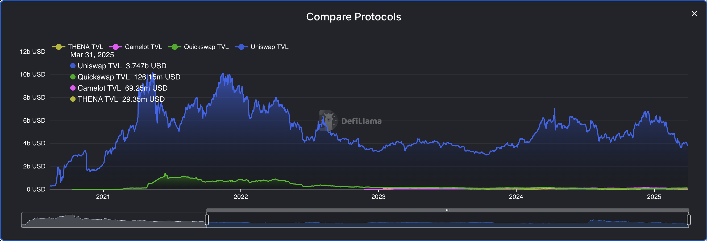
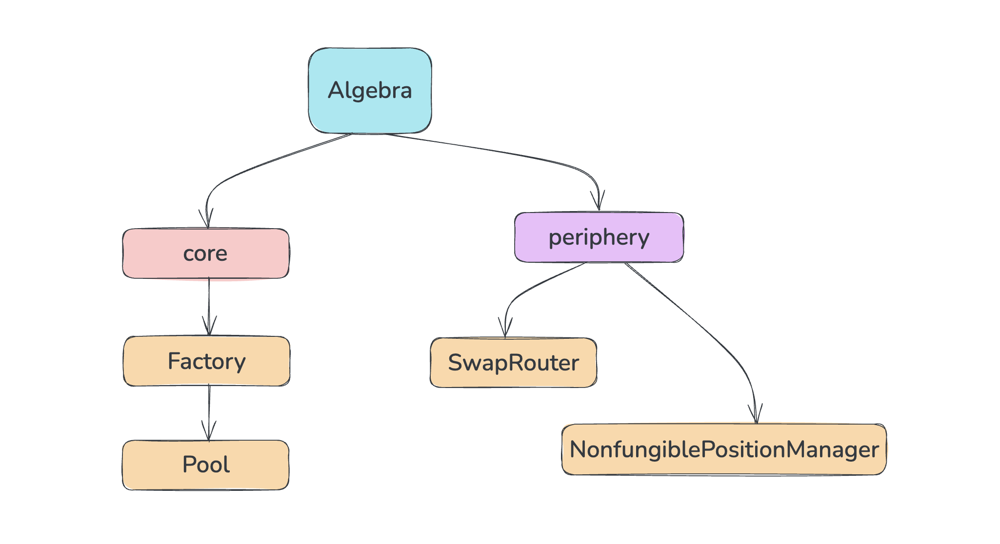
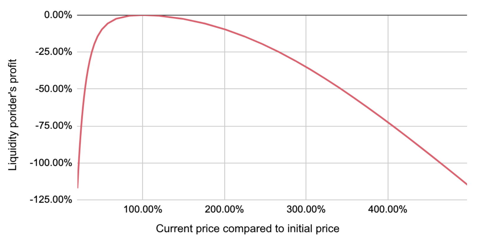
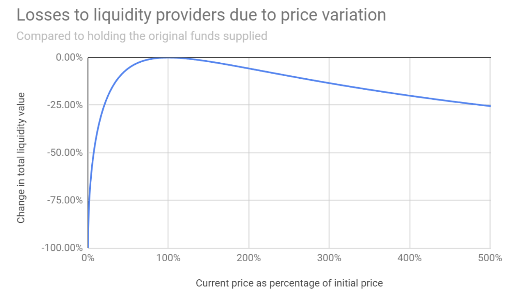
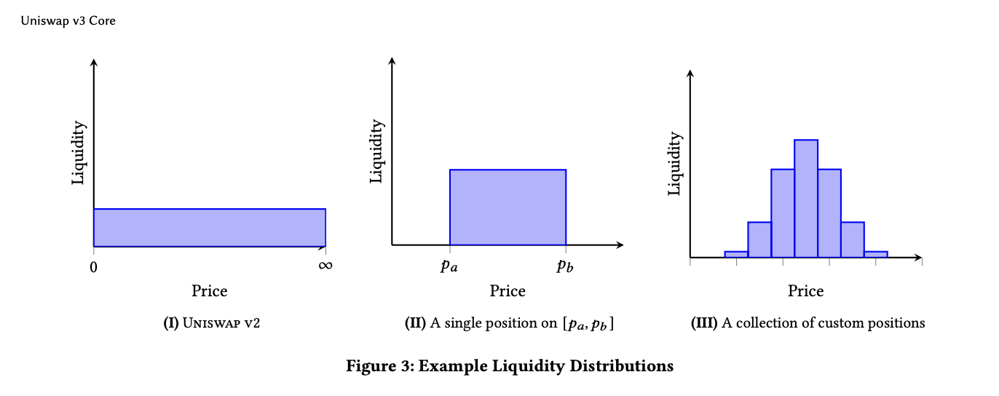
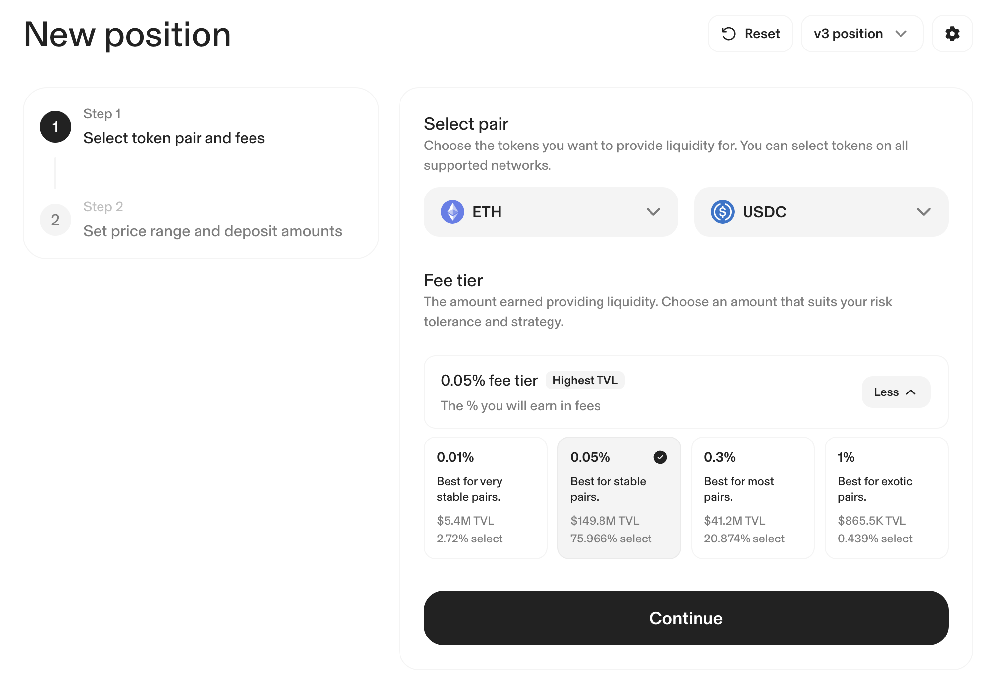
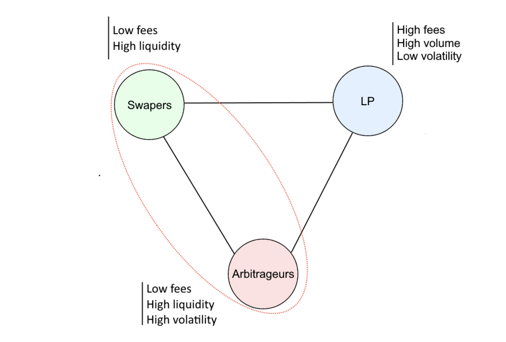
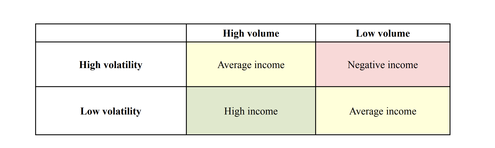
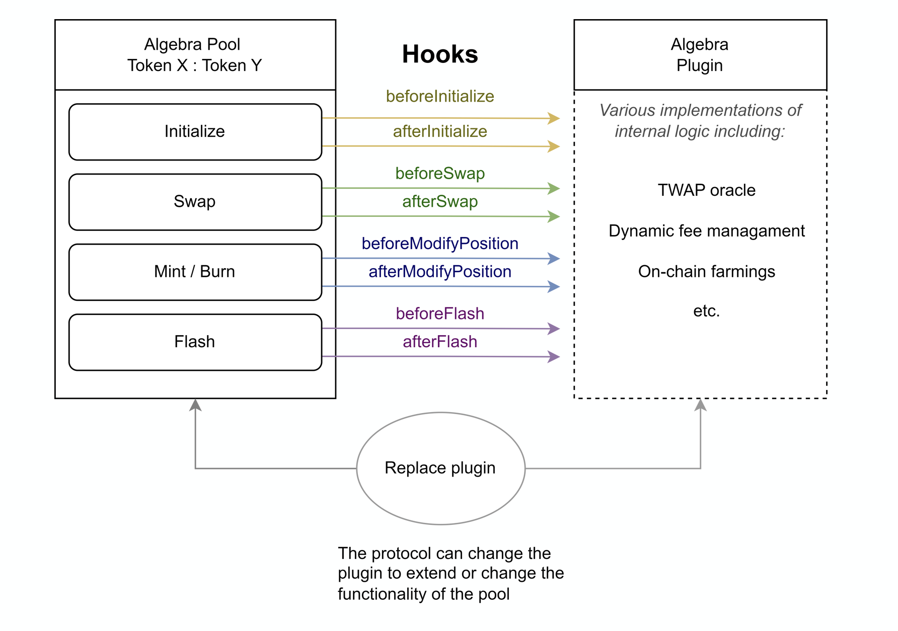

# Algebra Finance

**Author:** [Roman Yarlykov](https://github.com/rlkvrv) 🧐

Algebra is a B2B solution for AMM-based DEXs that allows you to launch an exchange with core functionality largely similar to Uniswap v3. The protocol positions itself as DEX-as-a-Service (DaaS). The main focus is on concentrated liquidity and adjustable fees (while in Uniswap v3, fees are fixed).

The protocol earns through so-called _community fees_ — a portion of the trading fees from all DEXs using their code. The majority of these funds (around 70%) are used to buy back and burn the ALGB token to support its price; the rest goes toward protocol development. The ALGB token can be staked to receive a share of the trading fees.

At the moment, the solution has been integrated by more than 30 decentralized exchanges. But even the most notable among them — QuickSwap, Camelot, and THENA — are more like tier-2 projects with a TVL around $100 million. They clearly don’t match the market leaders with multi-billion dollar TVLs and hundreds of millions in daily volume, but they’ve still managed to carve out their own niche.

For example, the DEXs QuickSwap and Camelot are in the top 30 among all decentralized exchanges, of which there are around 1,400 listed on DeFi Llama! The other DEXs that have integrated Algebra show even more modest results.

  
_Comparison of the top three (by performance) DEXs that integrated Algebra with Uniswap for the period from 2021 to 2025. Source: DeFi Llama_

## Context

I first came across the Algebra protocol when my team and I were forking Camelot DEX. The first version of Camelot was a fork of Uni v2, and for the next version with concentrated liquidity support, they integrated Algebra. Even back then, I was curious about the advantages of that approach.

There are two important points here:

1. Each version of Uniswap is protected by the BUSL-1.1 license — it prohibits commercial use in a production environment for a certain period if someone decides to fork the protocol. Typically, when a new version of Uni is released, the license on the previous one expires. At the same time, viewing, modifying, and using the code for non-commercial purposes — like testing or development — is allowed.
2. The Uni v2 version became extremely popular for forks after its license expired.

Against this backdrop, Algebra chose the following strategy: while the Uniswap v3 license was still in effect, they could freely experiment with the code, identify its weak spots, and think about how to improve them.

This is how the first version of Algebra came to be — essentially an improved version of Uniswap v3, with enhancements and new features.

## Basic Architecture

At the base level, Algebra’s structure mirrors the architecture of Uniswap v3 — the "DEX engine" includes the same key smart contracts.

  
_Basic architecture of the Algebra protocol_

- The core includes a factory for creating liquidity pools and the pool contract itself.
- The peripheral part includes a router for adding/removing liquidity and executing swaps, as well as the `NonfungiblePositionManager` — an ERC721 token that represents a position in the pool (I'll talk more about positions later).
- Helper contracts and libraries (not shown in the diagram) are also taken from Uniswap.

Since its launch, the protocol has undergone significant changes, but the basic structure remains relevant — one of the key goals is still to maintain compatibility with Uniswap v3 interfaces.

Next, I'll try to explain how Algebra gained an edge over Uni v3. We'll have to talk quite a bit about Uniswap itself, but the main idea is simple: `Algebra == Uniswap + new features`.

## What Makes Uni v3 So Good That It’s Worth Copying?

What’s included in the core functionality of Uniswap v3? What makes this protocol innovative, and why did it make sense to use it as the "DEX engine" for Algebra?

Let’s take the following approach: we’ll break down how Uni v3 reimagined the very concept of a decentralized exchange and its own solutions from previous versions, and how Algebra managed to take it even further and make it better.

What were the drawbacks of Uniswap v2?

- **Impermanent loss** — Liquidity Providers lose potential profit compared to a “hold” strategy if asset prices fluctuate significantly.
- **Inefficient capital usage** — in Uniswap v2, liquidity is spread evenly across the entire price curve (from 0 to infinity), while trading typically happens within a narrow range. This means that most of the LP’s capital remains inactive and doesn’t generate yield.

Let’s take a closer look at the phenomenon of impermanent loss — it’s key to understanding the core issues.

**Why does impermanent loss happen?**

1. In AMMs like Uniswap, liquidity providers (LPs) deposit a pair of assets into the pool (e.g., ETH and USDC). The ratio between these assets in the pool changes dynamically based on prices, in order to maintain the AMM invariant — `x * y = k`.
2. When the price of ETH rises, the pool automatically starts selling ETH (to maintain balance), and when it falls — it buys more. As a result, the LP loses potential profit they could’ve gained by simply holding ETH in their wallet.

So, the LP loses profit both when the price of ETH rises (they end up with less ETH) and when it falls (they get more ETH, but it’s worth less). In the second case, the losses are even greater.

**The Role of Fees**

The next important factor is the pool fees, which can partially or fully offset impermanent loss. Let’s look at this using two charts:

The first one shows LP losses without taking fees into account:

  
_Comparison of LP losses relative to a “hold” strategy during price drops and increases, without accounting for fees. Source: Algebra Whitepaper_

Here we can see that if the price doesn’t change (100% on the X-axis), the LP doesn’t lose anything, but with significant price increases or drops, the losses become noticeable.

Now, the chart including fee income:

  
_Comparison of LP losses relative to a “hold” strategy during price drops and increases, with fees taken into account. Source: article ["What is Impermanent Loss?"](https://finematics.com/impermanent-loss-explained/)_

As we can see, losses during asset price increases become much less significant because fees partially offset the missed profit. But there’s one important point: *in Uniswap v2, the fee was fixed — 0.3% for all pools, regardless of asset volatility*.

**How Did Uni v3 Reduce the Impact of Impermanent Loss?**

In the third version of the protocol, Uniswap pulled off another revolution — it introduced the concept of CLMM (Concentrated Liquidity Market Maker), or concentrated liquidity.

Instead of distributing liquidity evenly across the entire price range like in Uniswap v2, LPs in Uniswap v3 can allocate their assets within specific price ranges (called “positions”). For example, if the current ETH/USDC price is 2000 USDC per 1 ETH, an LP can provide liquidity only in the range from 1800 to 2200 USDC.

Liquidity is used for swaps and earns fees only when the current price is within the specified range. If the price moves outside that range, the position becomes “inactive” (it no longer participates in trading), but the assets remain safe. Positions are created as NFTs and can be freely traded on marketplaces, creating a secondary market for liquidity.

This way, an LP can create either a single position within a narrow range or multiple positions across different segments of the price curve.

  
_Comparison of positions in Uniswap v2 and v3. Source: Uniswap v3 Whitepaper_

Such positions help reduce the impact of impermanent loss — LPs gain the flexibility to choose a strategy based on their risk tolerance. In addition, the new approach significantly improves capital efficiency. For example, in Uniswap v2, `$10,000` might generate a 1% return, while in v3 the same `$10,000`, concentrated in an active range, can generate 10% or more.

**Rethinking the Fee Structure**

The second major innovation in Uniswap v3 is a flexible fee system. For each asset pair, Uniswap v3 offers multiple pools with different fee tiers: 0.01%, 0.05%, 0.3%, and 1%. Typically, high fees (like 1%) are suitable for volatile pairs with higher risks and impermanent loss, while low fees (like 0.05%) are used for stable pairs.

In practice, the same pair can exist in multiple pools with different fee tiers at the same time. This creates a balance between the interests of LPs (who benefit from higher fees) and traders (who want low slippage and low fees).

For example, when adding liquidity to an ETH/USDC pool, you can choose one of four fee tiers:

  
_Adding liquidity to the ETH/USDC pool on Uniswap v3. Source: Uniswap app_

The interface also shows the liquidity share distributed across pools with the same assets but different fee tiers. Despite the dominance of the 0.05% fee pool, around 20% of the liquidity still remains in the 0.3% pool.

**To sum it up: Uni v3 is the foundation, but there are caveats**

Uni v3 focused on improving capital efficiency — meaning it allows you to earn more with less capital. But certain drawbacks still remain:

- Yes, fees became more flexible, but if you want a single token pair to have different fee tiers, you have to “split” the liquidity across multiple pools.

- The Uni v3 architecture doesn’t support farming directly. Farming is a tool to attract additional liquidity, but Uniswap already has strong liquidity on its own. So just forking Uni v3 isn’t enough — you still need a way to incentivize liquidity inflow.

- No support for fee-on-transfer tokens — these are tokens that charge a fee on every transfer, which affects the final amount that actually ends up in the liquidity pool.

## How Algebra Started

In its first version, Algebra focused on fixing the shortcomings of Uniswap that I mentioned earlier. Most of the work went into dynamic fees — the protocol gives special attention to this feature in its [whitepaper](https://algebra.finance/static/Algerbra%20Tech%20Paper-15411d15f8653a81d5f7f574bfe655ad.pdf).

In the end, they entered the market with three main features:
1. Dynamic fees  
2. Built-in farming (works out of the box)  
3. Support for fee-on-transfer tokens

### Dynamic Fees

Fees are the cornerstone of any DEX. To satisfy all market participants, they shouldn’t be too high or too low — ideally, they should be as flexible as possible. Let’s start by identifying who these participants are and what their interests look like:

1. Regular traders — simply swap tokens and pay fees.  
2. Arbitrageurs — profit from price differences between DEXs or pools.  
3. Liquidity providers (LPs) — provide capital and expect fair compensation.

Each of these groups has its own interests, and they often conflict with one another:

- Traders want high liquidity and low fees  
- Arbitrageurs want high liquidity + volatility + low fees  
- LPs want high fees + high liquidity + low volatility

  
_Market participants and their interests. Source: Algebra Whitepaper_

The goal of the fee mechanism is to find a balance between the interests of all parties. As we discussed earlier, in Uniswap v3 this is done through fixed fee tiers (0.05%, 0.3%, 1%). The problem is that this leads to fragmentation of liquidity across multiple pools.

In addition, asset behavior can change over time. For example, an asset considered stable might quickly become volatile. As a result, liquidity may end up being inefficiently distributed across pools with different fee tiers.

Algebra offers a solution to this problem in the form of **dynamic fees**, which adapt to the pool’s behavior. To achieve this, three key metrics are analyzed:

1. Volatility  
2. Liquidity volume  
3. Trading volume

High returns for LPs are achieved when there is high trading activity and low volatility:

  
_Dependency of LP returns on market behavior. Source: Algebra Whitepaper_

In practice, it works like this:

- When volatility is high, the fee increases to compensate LP risks  
- When trading activity is low but liquidity is sufficient, the fee decreases to encourage more swaps

Algebra uses a flexible formula that takes all these parameters into account and allows keeping all liquidity within a single pool, without splitting it across multiple pools. Thus, unlike Uniswap v3, there’s no need to create two or three different pools with different fees.

**Technical Details**

The implementation of the dynamic fees mechanism deserves a separate article, but let’s highlight the key points:

- Minimum fee is 0.01%. It can be changed by the factory administrator after initialization.  
- Maximum fee is 6.5535% (`type(uint16).max` with a divisor of `1e6`)  
- Fee recalculation happens with every interaction with the pool (swap, adding/removing liquidity), but the actual recalculation occurs only once per block.
- The recalculation is handled by the function [DataStorageOperator::getFee](https://github.com/cryptoalgebra/AlgebraV1/blob/789384bc5084dd694f3d1e189250491086e44653/src/core/contracts/DataStorageOperator.sol#L150), which uses the `DataStorage` and `AdaptiveFee` libraries.  
- The [configuration](https://github.com/cryptoalgebra/AlgebraV1/blob/789384bc5084dd694f3d1e189250491086e44653/src/core/contracts/libraries/AdaptiveFee.sol#L10) allows setting the fee change rate. Volatility is taken as an average over 24 hours, which smooths fluctuations and improves calculation stability.

Details of the formula implementation and mathematical justification can be found in the [whitepaper](https://algebra.finance/static/Algerbra%20Tech%20Paper-15411d15f8653a81d5f7f574bfe655ad.pdf).

### Built-in Farming

In Algebra (like in Uniswap v3), liquidity providers receive an NFT (ERC-721) when adding liquidity, representing their position in the pool — the price range where their liquidity is active. However, in Uniswap itself, there’s no way to directly incentivize LPs — this requires external protocols.

**What’s the challenge with farming in CLMM?**

Liquidity only works within a specific price range. Accordingly, a fair reward distribution should take into account:

- the amount of liquidity;  
- the time the position was "in-range," meaning it participated in swaps and earned fees;

This makes the traditional farming mechanism unsuitable for CLMM models. Algebra solved this by introducing a **virtual pool** (_Virtual Pool_), linked to the main pool and tracking its activity. Thanks to this, fair reward distribution became possible.

A virtual pool is a separate smart contract (for example, [LimitVirtualPool](https://github.com/cryptoalgebra/AlgebraV1/blob/main/src/tokenomics/contracts/farmings/limitFarming/LimitVirtualPool.sol)) that stores and tracks only the liquidity pool parameters needed for correct reward calculations.

The Virtual Pool works like this:  
1. When the virtual pool is created, it is linked to the main pool by calling the function [FarmingCentre::connectVirtualPool](https://github.com/cryptoalgebra/AlgebraV1/blob/789384bc5084dd694f3d1e189250491086e44653/src/tokenomics/contracts/FarmingCenter.sol#L209);  
2. After that, every tick update during swaps is passed to the virtual pool via [VirtualPool::cross](https://github.com/cryptoalgebra/AlgebraV1/blob/789384bc5084dd694f3d1e189250491086e44653/src/core/contracts/AlgebraPool.sol#L832-L834), so it can update the parameters needed for calculations;  
3. The virtual pool can also fetch data from the main pool when necessary, for example [like this](https://github.com/cryptoalgebra/AlgebraV1/blob/789384bc5084dd694f3d1e189250491086e44653/src/tokenomics/contracts/farmings/eternalFarming/AlgebraEternalFarming.sol#L176).

As a result, the protocol gained the ability to launch **farming campaigns** — temporary incentive programs tied to specific liquidity pools.

**How does a farming campaign work?**

- Each campaign has a set amount of reward tokens.  
- LPs must send their ERC-721 token to the farming contract.  
- Tokens remain locked until the campaign ends.  
- After the campaign finishes, rewards are distributed, and positions are returned to their owners.

**How are rewards calculated?**

First, the liquidity active time is determined:

```bash
secondsPerLiquidity = rangeSecondsInside / rangeLiquidity
```

where:

- `rangeSecondsInside` — time during which the price was inside the range;  
- `rangeLiquidity` — total liquidity in that range.

Then, the contribution of a specific position is calculated:

```bash
positionSecondsInside = secondsPerLiquidity * positionLiquidity
```

And finally, the total reward:

```bash
reward = (totalReward * positionSecondsInside) / campaignDuration
```

where:

- `totalReward` — total amount of rewards in the campaign;  
- `campaignDuration` — duration of the campaign.

Recalculation happens with every swap in the pool or when a new participant joins the campaign.

**Types of farming**

In Algebra v1, two types of farming are available:

|                              | **Temporary (limited)**                                                                                                                          | **Permanent (eternal)**                                                                                                                                    |
| ---------------------------- | ----------------------------------------------------------------------------------------------------------------------------------------------- | ---------------------------------------------------------------------------------------------------------------------------------------------------------- |
| **Smart contract**                 | [AlgebraLimitFarming](https://github.com/cryptoalgebra/AlgebraV1/blob/main/src/tokenomics/contracts/farmings/limitFarming/AlgebraLimitFarming.sol) | [AlgebraEternalFarming](https://github.com/cryptoalgebra/AlgebraV1/blob/main/src/tokenomics/contracts/farmings/eternalFarming/AlgebraEternalFarming.sol)     |
| **Campaign duration** | Fixed start and end dates                                                                                                                      | No fixed duration                                                                                                                                           |
| **Position lock**       | LPs must lock their position in advance                                                                                                       | NFT is not locked; entry and exit can happen at any time                                                                                                  |
| **Exit conditions**           | Position cannot be withdrawn before campaign ends                                                                                            | LPs can exit at any time                                                                                                                                     |
| **Operating conditions**           | Campaign ends after the set duration                                                                                                         | Runs as long as rewards continue                                                                                                                           |


### Support for Fee-on-Transfer Tokens

In its first version, Algebra added support for fee-on-transfer tokens, including deflationary tokens whose total supply can decrease during transactions.

Examples of such tokens:  
- Tokens where part of the amount is burned on each transfer, reducing the total supply.  
- Tokens that charge a fee on transfers, with the fee being burned.  
- Tokens with other fee mechanisms that may not be deflationary but affect the amount of tokens received.

For proper handling of such assets, Algebra implements the function  
[swapSupportingFeeOnInputTokens](https://github.com/cryptoalgebra/AlgebraV1/blob/789384bc5084dd694f3d1e189250491086e44653/src/core/contracts/AlgebraPool.sol#L626C12-L626C42).  
It determines the actual amount of tokens received by the pool after all deductions, including burns, enabling correct swaps.

Unlike Uniswap v3, where supporting such tokens requires creating wrapped tokens, Algebra handles these assets natively, simplifying interaction.

### New Features in Version v1.9

Before releasing the second version of the protocol, Algebra introduced an intermediate update — [Algebra v1.9](https://github.com/cryptoalgebra/AlgebraV1.9). This is a minor release, but it’s worth mentioning to understand the protocol’s evolution. In this version, the developers focused on contract optimization, improved tick handling, and added new features. Let’s look at the key changes.

**Configurable Tickspacing**

**Tickspacing** is the interval between price levels (ticks) in a pool, which determines how precisely you can set the concentrated liquidity range. The larger the tickspacing value, the more available price intervals and higher flexibility in range settings, but this also increases gas costs.

In previous versions, the tickspacing value was a constant set to 60. In v1.9, the developers allowed this parameter to be configurable, limiting the maximum number of intervals to 500. This made it possible to manage ranges more precisely, which is especially relevant for stable pairs (like USDC/USDT), where setting intervals more accurately is important.

**Limit Orders**

Version v1.9 introduced a new feature — limit orders. Limit orders allow automatically closing positions at predefined prices, reducing price impact. But it’s important to understand that this is a separate product; it just works with the codebase (core) of the protocol’s first version.

## A New Stage in Algebra’s Evolution

Recently, Uniswap released its fourth version, whose code is again locked under a 2.5-year license. As I mentioned earlier, all versions of Uniswap are protected against copying by licenses. In the case of the first version, the Algebra team simply waited for its expiration.

This time, to avoid waiting for the license to expire, Algebra took a smarter approach — the new protocol version, **Algebra Integral (v2)**, will still be based on Uniswap v3 but with added hooks, like in Uniswap v4. This will allow moving to a modular architecture and implementing plugin support.

With this approach, it’s unlikely to create a DEX that surpasses Uni v4, but implementing similar features without violating the license is quite possible.

**Modular DEX Instead of Monolith**

One of the key features of Uniswap v4 is its modular architecture. The idea of a modular DEX is to create a simple, reliable, and secure core that can be extended with external modules (plugins). Not every pool needs, say, dynamic fees or a TWAP oracle, and having such functionality can significantly increase gas costs.

The previous approach to building a DEX always assumed a monolithic structure, which didn’t allow dropping unnecessary features. But by moving these functions "outside," the pool creator gains the ability to add extra "features" as needed.

Algebra managed to implement modularity through plugins. This approach, in theory, also allows adding new functionality to the DEX without the need to migrate liquidity.

### Plugins

Plugins in Algebra Integral are smart contracts that can be attached to a liquidity pool to extend its functionality. Currently, only one plugin can be connected to a pool at a time. It can be disabled or replaced with another.

In theory, the new protocol architecture allows implementing a proxy plugin that enables connecting multiple plugins simultaneously (the protocol plans to develop such a plugin in the future).

**Plugins can:**

- perform arbitrary actions on the blockchain (including calling other contracts),  
- change fees in the pool,  
- perform additional checks or execute other external logic.

**Plugins cannot:**

- directly work with liquidity,  
- modify the core mathematical formulas of the pool’s operation.

**Hooks**

Each plugin interacts with the pool through **hooks** — special callback functions that are called before and after key pool operations: initialization, position changes, swaps, flash loans, etc. This allows plugins to "hook into" the pool’s workflow and execute necessary external logic.

  
_Hook workflow in Algebra. Source: Algebra Integral documentation_

**Examples of Existing Plugins**

- **TWAP Oracle**. Provides access to historical price and volatility data — useful for trading strategies and risk management.

- **Adaptive Fee**. Calculates dynamic fees by adapting to changes in the trading pair’s volatility. This allows for more efficient pricing.

- **Farming**. Integrates farming mechanisms, enabling users to earn additional rewards for providing liquidity.

New plugins are also in development. In the future, a marketplace is planned where third-party developers can offer their own solutions.

You can read more about plugins [in the documentation](https://docs.algebra.finance/algebra-integral-documentation/algebra-integral-technical-reference/plugins).

### Other Minor Improvements in v2

Besides implementing the modular architecture, version v2 also introduced [other, smaller changes](https://github.com/cryptoalgebra/algebra-integral-docs/blob/main/changes-after-v1.md):

- Contracts were rewritten in the latest Solidity version (0.8.20), all `require` statements replaced with `custom errors`, and additional gas optimizations were made.  
- A linked list is now used for handling `tickspacing`, so increasing the number of intervals doesn’t increase gas costs.  
- Farming-related changes:  
  - farming logic was moved into a separate plugin;  
  - the ability to create temporary (limit) farming was removed from the protocol, as such pools were hardly used;  
  - no need to send NFTs to the farming contract address anymore — just increase or decrease the position participating in the campaign.  
- More flexible pool management with `AccessControl` was added.  
- Logic for handling `community fee` was simplified and reworked.  
- The dynamic fees mechanism was not only moved into a separate plugin but also simplified, further reducing gas costs.

## Conclusion

The Algebra Finance protocol has firmly carved out its niche in the DeFi world. The project continues to evolve and offer solutions aligned with current trends in decentralized exchanges. In any case, competition is a good thing.

At the same time, the protocol team can no longer be accused of blind copying: for example, all the "innovations" of Uniswap v4 have already [been implemented in one way or another by other protocols](https://arc.net/l/quote/tjrlogva). Overall, DeFi is a highly competitive environment where good ideas spread and get adopted quickly. Otherwise, there’s a high risk of being left behind.

## Links

- [Docs: Algebra finance](https://docs.algebra.finance/algebra-integral-documentation)
- [Github: Algebra](https://github.com/cryptoalgebra/Algebra)
- [Whitepaper: ALGEBRA Ecosystem: Decentralized exchange](https://algebra.finance/static/Algerbra%20Tech%20Paper-15411d15f8653a81d5f7f574bfe655ad.pdf)
- [Article: What is impermanent loss?](https://finematics.com/impermanent-loss-explained/)
- [Article: The Ultimate Algebra Solution for DEXs vs. Uniswap V3](https://medium.com/%40crypto_algebra/the-ultimate-algebra-solution-for-dexs-vs-uniswap-v3-4832a39d8d82)
- [Article: Introducing Algebra V1.9: The Perfect Blend of Innovation & Efficiency](https://medium.com/@crypto_algebra/introducing-algebra-v1-9-the-perfect-blend-of-innovation-efficiency-eb7a419c21fe)
