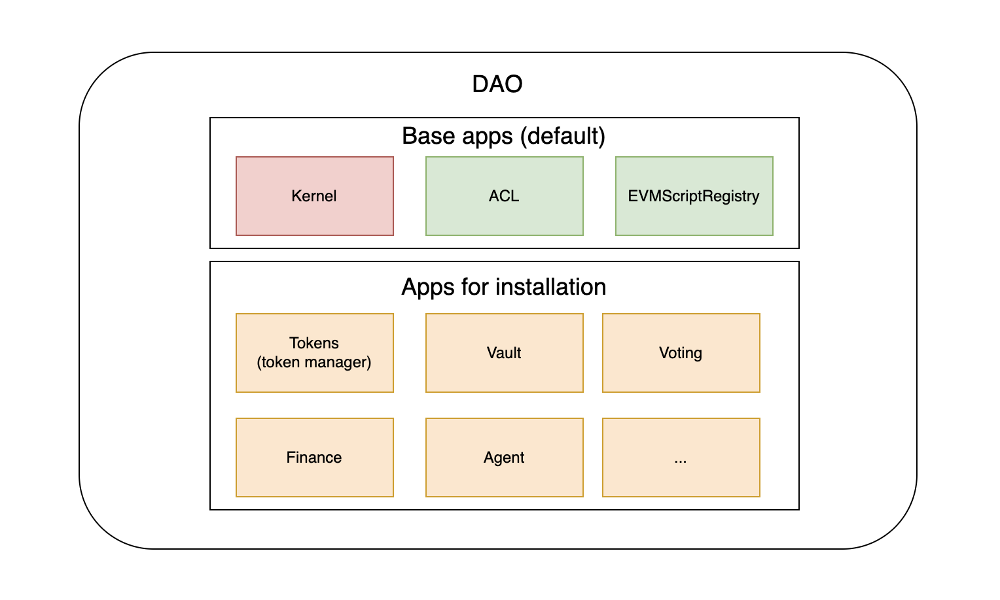
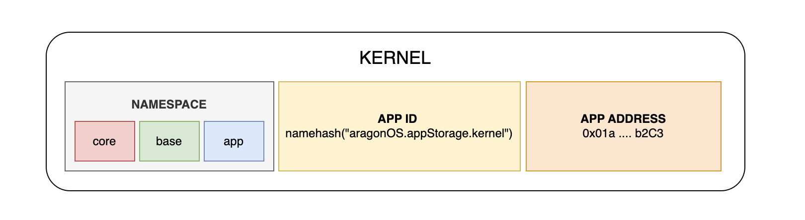
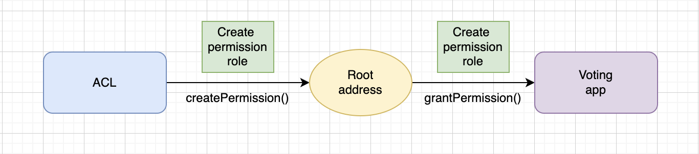
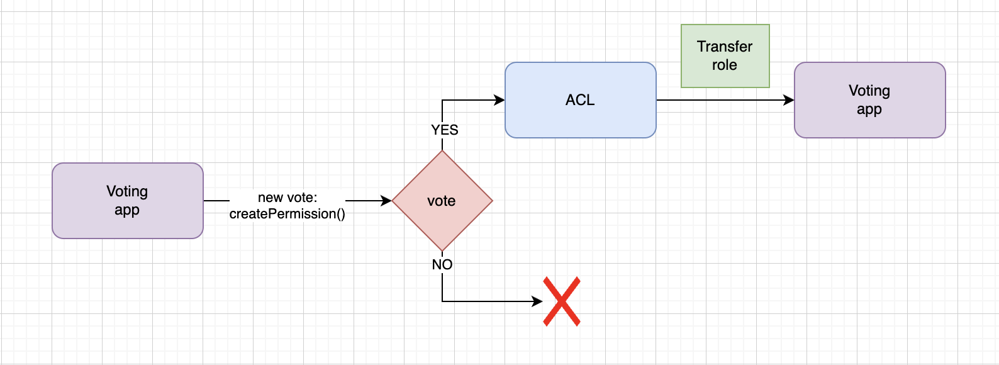
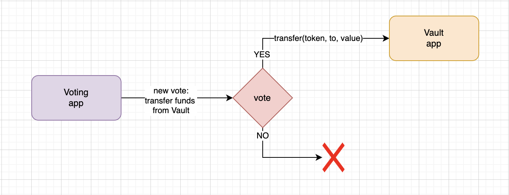
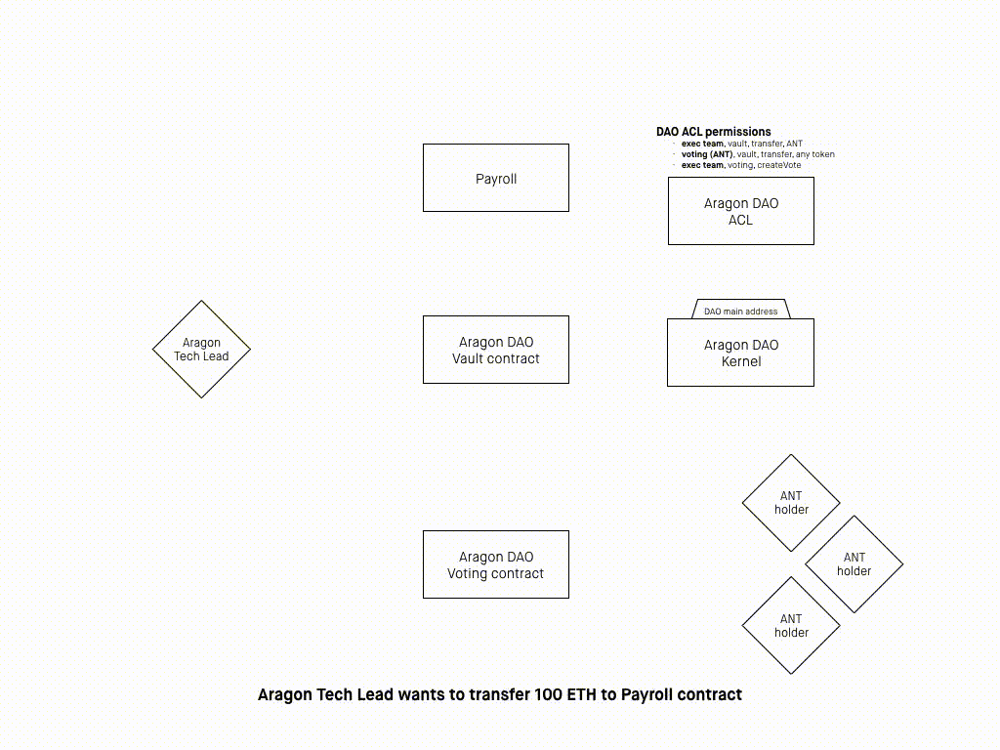
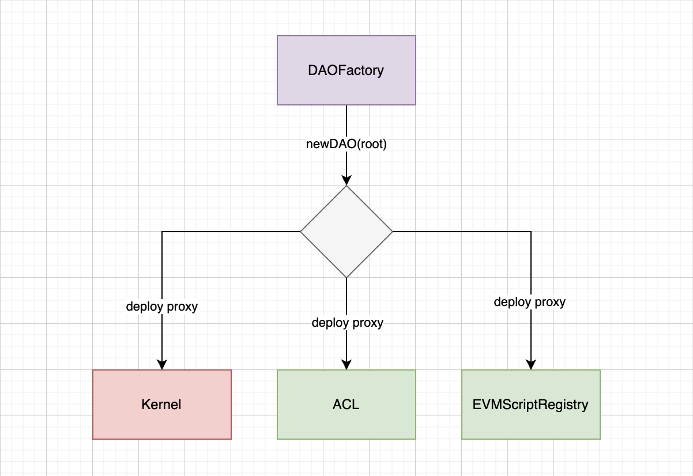
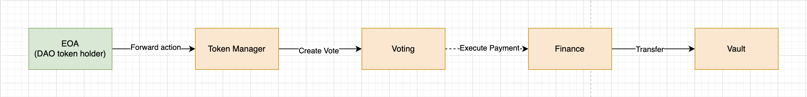

# Aragon DAO V1 (Legacy)

**Author:** [Roman Yarlykov](https://github.com/rlkvrv) 🧐

A Decentralized Autonomous Organization (DAO) is an organization managed through smart contracts on a public blockchain. "Decentralized" means it is built on trustless and permissionless technology. "Autonomous" indicates self-governance based on smart contracts. "Organization" implies that participants coordinate their actions to achieve common goals.

**Aragon (Aragon Network)** is a platform for creating such DAOs, and Aragon itself is governed through a Main DAO and Sub-DAOs by ANT token holders. The main component of Aragon is a framework for building DAOs, featuring its own operating system (aragonOS), which is based on smart contracts and provides extensive capabilities for creating and configuring DAOs.

Aragon was founded in 2016 to address emerging social crises and democratic failures (as stated by its founders Luis Cuende and Jorge Izquierdo). In 2017, the first version of the [whitepaper](https://github.com/aragon/whitepaper) was published, an ICO was conducted, and the initial version of aragonOS was launched. In 2018, the [Aragon Manifesto](https://github.com/aragon/manifesto) was published.
(https://medium.com/aragondec/the-aragon-manifesto-4a21212eac03), in which the organization promises to fight for freedom and provide all the necessary tools to achieve it. In 2020, an experimental product called Aragon Court — a decentralized digital judiciary system — was launched, along with Aragon Client, a user interface for creating and managing DAOs.

## Framework Overview

Aragon provides a suite of open-source applications and services that enable the creation of new forms of global communities (or DAOs). An organization in Aragon is the central system around which everything is built. It consists of a core, a set of applications, and a permissions system that defines the organization's protocol: what can be done and how.

Applications can be installed, removed, or updated, similar to managing apps on a computer or smartphone operating system. Who can perform these tasks and how they are carried out depends entirely on the permissions set within the organization. In Aragon organizations, the same application can be installed multiple times (aragonPM is responsible for tracking application versions). These are referred to as application instances. This is a useful feature, as a specific instance of an application contains its own configuration and set of permissions, which are not shared with other instances.

You can use a pre-built Aragon application or write your own. There is even an "App Center" — a kind of app store. The code for Aragon's pre-built applications is available [here](https://github.com/aragon/aragon-apps) in the repository.

Each organization also includes a set of three system applications that are typically not removed. These are smart contracts providing the core functionalities of organizations:
- The organization's core and list of installed applications (`Kernel`);
- The organization's permissions module (`ACL`);
- The ability to forward actions to other applications (`EVM Script Registry`).



To understand how this system works, we first need to dive into the framework's architecture, specifically its main module — aragonOS.

## aragonOS Architecture

aragonOS is a system of smart contracts that consists of multiple components (called applications) and a foundation, which is the `Kernel`. The `Kernel` serves as the core, defining how these applications interact with each other and how external entities can interact with them.

> The design philosophy we follow when developing Aragon applications is very similar to the UNIX philosophy: we aim to make them do one thing well and implement multiple aragonOS interfaces so that they integrate seamlessly with the rest of the ecosystem. This approach provides technical benefits, such as testability, and is also highly effective when applications are combined, where the output of one application becomes the input for another (Forwarders resemble UNIX pipes in this sense).
> > From the Aragon documentation.

### The Kernel

The `Kernel` is the foundation of any organization. The core acts as a coordinator for all the organization's components. It is a relatively simple smart contract that provides two main functions: upgradability and authorization.

The core is implemented using the [DelegateProxy (ERC-897)](https://eips.ethereum.org/EIPS/eip-897) pattern with [unstructured storage](https://blog.openzeppelin.com/upgradeability-using-unstructured-storage).This pattern divides the contract into two instances: a base logic contract (implementation) and a proxy contract (which references the implementation). The proxy delegates all its logic to the base contract and can change its pointer to the base contract to update its logic. Incidentally, ERC-897 was developed by Aragon in collaboration with OpenZeppelin. While newer proxy patterns have since emerged, this conceptually implements the foundational mechanisms of any proxy.

The upgradability applies not only to the core itself but also to the applications installed through the core, which can also be updated via the core.

The two main functions of the core, which connect applications, are:
```solidity
function setApp(bytes32 namespace, bytes32 appId, address app) public;
function getApp(bytes32 namespace, bytes32 appId) public view returns (address);
```

- **namespace**: Specifies the type of application being installed. The core implements three namespaces where installed applications can be registered.
  - **Core namespace** (`keccak256('core')`): The only contract installed in the core must be a reference to the `Kernel` implementation.
  - **Base namespace** (`keccak256('base')`): Addresses of contract implementations (excluding `Kernel`).
  - **App namespace** (`keccak256('app')`): Address of the proxy contract for the installed application (set when this proxy instance will be the "default" address for the implementation from the base).
  - **appId**: Identifier of the installed application. This is a hash of the name in ENS format, such as `namehash('aragonOS.appStorage.kernel')` or `namehash('voting.aragonpm.eth')`.
- **app**: Address of the proxy contract for the application instance.



Thus, the Kernel storage is very minimalistic. The key element here is the apps mapping:

```solidity
contract KernelStorage {
    // namespace => app id => address
    mapping (bytes32 => mapping (bytes32 => address)) public apps;
}
```

The Kernel smart contract can be found [here](https://github.com/aragon/aragonOS/blob/next/contracts/kernel/Kernel.sol).

#### Installing Applications

The `Kernel` stores information about application implementations but does not keep a reference to every proxy that can be created. The core can only register one "default" proxy contract address, although multiple proxy instances can exist.

An application is considered "installed" only when it has been granted its first permission through the ACL (we will discuss the ACL later). A well-designed application should not function without permissions. If it can operate without permissions from the ACL, it is a red flag.

Proxy instances enable the creation of two `Kernel` functions:
```js
function newAppInstance(bytes32 appId, address appBase);
function newPinnedAppInstance(bytes32 appId, address appBase);
```

According to ERC-897, which I referenced earlier, there are two types of proxies:

- **Forwarding proxy (id = 1)**: Uses only one address as the implementation, which cannot be changed.
- **Upgradeable proxy (id = 2)**: A standard proxy where the implementation can be updated.

Thus, the `newAppInstance` function creates an Upgradeable proxy, while `newPinnedAppInstance` creates a Forwarding proxy.

These functions have overloads that allow passing a payload for immediate initialization of the created proxy and a `setDefault` flag. If the flag is set, the core's `setApp` function will be called under the hood, adding the proxy address to the `app` namespace and making it the "default" proxy instance.

```solidity
function newAppInstance(bytes32 appId, address appBase, bytes initializePayload, bool setDefault);
function newPinnedAppInstance(bytes32 appId, address appBase, bytes initializePayload, bool setDefault);
```

#### Application Permissions

For convenience, the `Kernel` also includes two functions for managing permissions:

```solidity
function acl() public view returns (IACL);
function hasPermission(address who, address where, bytes32 what, bytes how) public view returns (bool);
```

The `acl` function returns the address of the ACL proxy instance, while `hasPermission` allows you to check permissions without directly interacting with the ACL.

### ACL

The second critical function of the core is tracking the Access Control List (ACL) for applications, which is used to manage access rights at the DAO level. Permissions are managed by the ACL system application. Essentially, it defines who can perform specific actions in an Aragon application and who can grant or revoke permissions.

> A permission is required to perform actions (grouped by roles) in a specific application instance (identified by its address).

Smart contract [ACL](https://github.com/aragon/aragonOS/blob/next/contracts/acl/ACL.sol) is structured as a regular `AragonApp`, so it can also be updated. Unlike other applications, its instance is created during the initialization of the core, as it is an application without which other applications cannot function.

The ACL instance can always be retrieved through the core (and every application, in turn, knows the address of the core):

```solidity
ACL acl = ACL(kernel.acl());
```

After this, three main actions can be performed:
- **Create Permission**: Create a permission and assign a manager for this role.
- **Grant Permission**: Grant a permission for a specific role.
- **Revoke Permission**: Revoke a permission from a role.

Creating a permission is done through the corresponding function:

```solidity
acl.createPermission(address entity, address app, bytes32 role, address manager);
```
- **entity**: the entity to which the permission is granted;
- **app**: the application with which the entity can interact after receiving the role;
- **role**: the role within the application;
- **manager**: the manager who can grant and revoke the permission for this role.

After this, the manager can call `grantPermission` and `revokePermission`. These functions accept the parameters `entity`, `app`, and `role`.

#### Example of ACL Usage

Let’s consider an example where a "Root" user creates a new DAO with basic permissions set up, allowing the Voting application to manage funds stored in the Vault application:

1. Deploy the proxy contracts for `Kernel` and `ACL`.
2. During deployment, the function `kernel.initialize(acl, rootAddress)` is called, which in turn calls `acl.initialize(rootAddress)` and under the hood creates a permission for the "permissions creator":
   ```solidity
   createPermission(rootAddress, aclAddress, CREATE_PERMISSIONS_ROLE, rootAddress)
   ```
3. Deploy the Voting application.
4. Next, grant the Voting application the ability to call `createPermission()`:
   ```solidity
   grantPermission(votingAppAddress, aclAddress, CREATE_PERMISSIONS_ROLE)
   ```
   In this case, the permission is granted by `rootAddress`.
   
5. Deploy the Vault application, which has the `transfer()` function.
6. Now create a new vote through the Voting application to grant the `TRANSFER_ROLE` permission:
   ```solidity
   createPermission(votingAppAddress, vaultAppAddress, TRANSFER_ROLE, votingAppAddress)
   ```
7. If the vote passes, the Voting application now has access to all actions in the Vault protected by the `TRANSFER_ROLE`, in this case, the `transfer()` action.
   
8. Fund transfers from the Vault can now be controlled through votes in the Voting application. Each time a user wants to transfer funds, they can create a new vote through the Voting application to propose executing the `transfer()` action in the Vault. The `transfer()` action will only be executed if the vote passes.
   

_Important!_ Only the Voting application can now revoke or reassign the `TRANSFER_ROLE` permission, as it is the manager of the `TRANSFER_ROLE` permission on `vaultAppAddress`.

#### Configuring Parameters for Permissions

When a manager assigns an entity to a role, they can also pass a parameter array via `grantPermissionP`. These parameters enable the ACL to perform specific computations with the permission arguments to decide whether to allow an action or not. This makes the ACL a more sophisticated system, allowing finer access control.

The setup of conditions and their evaluation is defined by different data arrays. At the time of granting a role permission, an array of parameters (conditions) is passed, where each index of the array represents a separate condition. Later, during permission checks, an array of arguments will be passed, which will be processed by the defined conditions.

```solidity
function grantPermissionP(address _entity, address _app, bytes32 _role, uint256[] _params)
```

Parameters allow certain computations to be performed with arguments that are passed during authorization. They are provided as a `uint256` array. Essentially, the process is based on comparing two values, with varying conditions for comparison and the number of values to compare.

Each such parameter (`uint256`) encodes a structure of three values:

```solidity
    struct Param {
        uint8 id;
        uint8 op;
        uint240 value;
    }
```

- **Argument Value (`uint240`)**: Fits into `uint240` and can be a number, an address, or even a 30-byte hash. The value loses its two most significant bytes (MSB), which is necessary for the entire structure to fit within `uint256`, thereby saving space in the smart contract's storage.
- **Argument ID (uint8)**: Specifies which argument, passed to the role, will be used for comparison with the `Argument value`. IDs from 0 to 200 refer to the index of the argument passed to the role. Special IDs above 200 include:
  - `BLOCK_NUMBER_PARAM_ID (id = 200)`: Sets the comparison value to the block number at execution time;
  - `TIMESTAMP_PARAM_ID (id = 201)`: Sets the comparison value to the timestamp of the current block;
  - `ORACLE_PARAM_ID (id = 203)`: The argument is passed to an oracle, which can be any external smart contract that returns `true` or `false`;
  - `LOGIC_OP_PARAM_ID (id = 204)`: Evaluates logical operations instead of an `Argument value`, enabling the programming of complex logic through recursive calls.
  - `PARAM_VALUE_PARAM_ID (id = 205)`: Uses the `Argument value` for comparison. Logically, such a comparison is meaningless, but it is used for `Operation type = RET`. If the value is greater than 1, it returns `true`.
- **Operation type (uint8)**: The operation to be performed for comparing the values extracted using the `Argument ID` or `Argument value`. The comparison always follows this order: `args[param.id] <param.op> param.value`. The following types of operations are implemented:
  - **None (Op.NONE)**: Always evaluates to `false`;
  - **Equals (Op.EQ)**: Evaluates to `true` if all bytes between `args[param.id]` and `param.value` are equal;
  - **Not equals (Op.NEQ)**: Evaluates to `true` if any byte does not match;
  - **Greater than (Op.GT)**: Evaluates to `true` if `args[param.id] > param.value`;
  - **Less than (Op.LT)**: Evaluates to `true` if `args[param.id] < param.value`;
  - **Greater than or equal (Op.GTE)**:Evaluates to `true` if `args[param.id] >= param.value`;
  - **Less than or equal (Op.LTE)**: Evaluates to `true` if `args[param.id] <= param.value`;
  - **Return (Op.RET)**: Evaluates to `true` if `args[param.id]` is greater than one. Used with `PARAM_VALUE_PARAM_ID`, it sets `args[param.id] = param.value`, thus returning the associated parameter value.

To handle multiple arguments, `LOGIC_OP_PARAM_ID` is used along with the following logical operations:
- **Not (Op.NOT)**: Takes 1 parameter and computes its opposite value;
- **And (Op.AND)**:Takes 2 parameters and checks that both are true;
- **Or (Op.OR)**: Takes 2 parameters and checks that at least one of them is true;
- **Exclusive or (Op.XOR)**: Takes 2 parameters and checks that only one of them is true;
- **If else (Op.IF_ELSE)**: Takes 2 parameters, checks the first parameter, and if true, uses the value of the second parameter; otherwise, the third.

Thus, ACL rules always evaluate the result of the first parameter, but the first parameter can be an operation linked to other parameters. Evaluation is performed recursively, allowing for a large set of rules.

The code responsible for parameter validation is located in the ACL smart contract, within the function [_evalParam](https://github.com/aragon/aragonOS/blob/4bbe3e96fc5a3aa6340b11ec67e6550029da7af9/contracts/acl/ACL.sol#L320). The functionality of this function is best illustrated by [a set of tests](https://github.com/aragon/aragonOS/blob/63c4722b8629f78350586bcea7c0837ab5882a20/test/TestACLInterpreter.sol#L112-L126), some of which I will provide below. However, to understand these tests, it is necessary to first grasp how the `_evalParam` function works.

For example, in this test, you can see how simple conditions are encoded and validated. Two arguments — the numbers 10 and 11 — are provided for validation. Then, three checks are performed:

- Check if the first argument equals 10.
- Check if the second argument equals 10.
- Check if the second argument equals 11.

```solidity
function testEqualityUint() public {
    // Check that the argument at index 0 equals 10 | `arr[0] == 10`
    assertEval(arr(uint256(10), 11), 0, Op.EQ, 10, true);
    // Check that the argument at index 1 equals 10 | `arr[1] == 10`
    assertEval(arr(uint256(10), 11), 1, Op.EQ, 10, false);
    // Check that the argument at index 1 equals 11 | `arr[1] == 11`
    assertEval(arr(uint256(10), 11), 1, Op.EQ, 11, true);
}
```

If predefined `Argument ID`s are used, an empty array of arguments is passed:

```solidity
function testTimestamp() public {
    assertEval(arr(), TIMESTAMP_PARAM_ID, Op.EQ, uint256(block.timestamp), true);
    assertEval(arr(), TIMESTAMP_PARAM_ID, Op.EQ, uint256(1), false);
    assertEval(arr(), TIMESTAMP_PARAM_ID, Op.GT, uint256(1), true);
}
```

More complex logic that can be programmed in conditions:

```solidity
function testComplexCombination() {
    // if (oracle and block number > block number - 1) then arg[0] < 10 or oracle else false

    Param[] memory params = new Param[](7);

    params[0] = Param(LOGIC_OP_PARAM_ID, uint8(Op.IF_ELSE), encodeIfElse(1, 4, 6));
    params[1] = Param(LOGIC_OP_PARAM_ID, uint8(Op.AND), encodeOperator(2, 3));
    params[2] = Param(ORACLE_PARAM_ID, uint8(Op.EQ), uint240(new AcceptOracle()));
    params[3] = Param(BLOCK_NUMBER_PARAM_ID, uint8(Op.GT), uint240(block.number - 1));
    params[4] = Param(LOGIC_OP_PARAM_ID, uint8(Op.OR), encodeOperator(5, 2));
    params[5] = Param(0, uint8(Op.LT), uint240(10));
    params[6] = Param(PARAM_VALUE_PARAM_ID, uint8(Op.RET), 0);

    assertEval(params, arr(uint256(10)), true);

    params[4] = Param(LOGIC_OP_PARAM_ID, uint8(Op.AND), encodeOperator(5, 2));
    assertEval(params, arr(uint256(10)), false);
}
```

Explanation:

1. The first parameter is `LOGIC_OP_PARAM_ID` with the operation `Op.IF_ELSE` and argument IDs 1, 4, and 6. This means we immediately evaluate the first parameter, and if it returns `true`, we proceed to parameter 4; otherwise, to parameter 6.
2. The second parameter is another logical operation, this time `Op.AND`, which must evaluate parameters 2 and 3.
3. Moving to the second parameter, it involves an oracle call with the operation `Op.EQ`. It is assumed that the call to `AcceptOracle` will return `true`.
4. Since the operation was `AND`, the third parameter is also evaluated, where `block.number` must equal (`block.number - 1`).
5. If both the oracle and the `block.number` operation return `true`, we proceed to parameter 4, as defined in parameter 0.
6. Parameter 4 involves another logical operation, `Op.OR`, between parameters 5 and 2. This means the next step is to evaluate these comparisons.
7. In parameter 5, there is a check to ensure that the first argument in the externally passed array is less than 10, and another oracle is invoked. If at least one of these conditions is satisfied, the comparison ends here, and access to the function is granted.
8. If the last condition fails, we move to parameter 6, which simply returns `false` because the operation is `Op.RET` with a value of 0, which is less than 1.

Thus, permission logic can be programmed with great flexibility witho

#### Permission Management

Now that we understand the system, we can take a closer look at how permissions are managed by the ACL. Permission management is described as follows:

> Entity E (Entity) can call Function F (Function) (protected by Role R (Role) and parameterized by Params P (Params)) on Application A (App) only if Entity E (Entity) has permission for Role R (Role) on Application A (App), and the arguments for Function F (Function) satisfy the Rules R (Rules). The Permission Manager M (Permission Manager) can revoke or reassign this permission.

This may sound complex, but it’s actually quite straightforward. Let’s break it down in detail:

1. **Entity E**: The entity attempting to call the function. This could be a user or another smart contract.
2. **Function F**: The function that Entity E wants to call. The function is protected by Role R and may have protective parameters Params P.
3. **Role R**: The role that protects Function F. The role defines a set of actions that can be performed within the application.
4. **Params P**: Parameters passed to Function F. These can be used for additional access control.
5. **App A**: The application containing Function F. The application represents a separate component in the Aragon ecosystem.
6. **Rules R**: The rules that the arguments passed to Function F must satisfy for the permission to be valid.

Thus, Entity E can call Function F in App A only if:
- Entity E has permission for Role R in App A.
- The arguments passed to Function F satisfy Rules R.

At the same time, the Permission Manager can revoke or reassign permissions for a given role.

### Aragon App

`AragonApp` is the base class for all aragonOS applications. It configures the application's storage to connect with the `Kernel` and adds some basic business logic and extensions. For example, it allows transferring any accidentally sent tokens to the Vault. The base class also enables executing arbitrary EVM scripts, includes an extension for reentrancy protection, and has an extension to disable initialization of the application's implementation. You can view the code [here](https://github.com/aragon/aragonOS/blob/next/contracts/apps/AragonApp.sol).

#### Authentication

An essential component of an application is authentication. Authentication is based on roles and two modifiers: `auth()` and `authP`.

Roles are usually declared at the beginning of the smart contract as `bytes32`, which is always a hash of the role's name, for example:

```solidity
bytes32 public CUSTOM_ACTION_ROLE = keccak256("CUSTOM_ACTION_ROLE");
```

Using the `auth()` and `authP()` modifiers, the ACL determines whether the entity calling a function has access to that function.

```solidity
function customAction() auth(CUSTOM_ACTION_ROLE) {}
```

The second modifier, `authP(bytes32 role, uint256[] params)`, also allows passing parameters to check conditions in the ACL. I discussed parameters in detail in the previous section.

```solidity
bytes32 public TRANSFER_ROLE = keccak256("TRANSFER_ROLE");

function transfer(uint256 amount) authP(TRANSFER_ROLE, arr(amount)) {}
```

The helper function `arr()` for forming a parameter array is also available out of the box. Both modifiers ensure that the application has been initialized before any action is called.

There is also a public getter, `canPerform()`, which allows checking whether an entity can call a function on behalf of a specific role.

```solidity
function canPerform(address who, bytes32 what, uint256[] how) public view returns (bool) {
    return acl().hasPermission(who, address(this), what, how);
}
```

Thus, the `AragonApp` base class provides fundamental functions for access management and authentication in aragonOS applications.

### Forwarder and EVMScript

Forwarders and EVM scripts are used to avoid implementing voting mechanisms in each application and to allow scripts that need to be executed after a vote to be forwarded between different applications.

For example, suppose you want to transfer funds from the Vault application, but you don’t have access to perform this action. If you are using `aragonUI`, it won’t let you call the transaction directly in the Vault application because it won’t execute. Instead, the interface calculates the required path: for instance, if you have permission to create a vote, the script will be forwarded to the Voting application. Technically, this happens via a call to `Voting::forward(evmScript)`. The `forward()` function checks whether the caller is allowed to perform this forwarding, and if everything checks out, a vote is created. Upon successful voting, the `runScript()` function is called.

Below is an example from the documentation: the technical lead of Aragon wants to send 100 ETH from the Vault application to the Payroll application:



An application that receives a forwarded script must implement the `IForwarder` interface.

```solidity
interface IForwarder {
    function isForwarder() external pure returns (bool);
    function canForward(address sender, bytes evmCallScript) public view returns (bool);
    function forward(bytes evmCallScript) public;
}
```

In theory, at the time of script execution, it can be forwarded again to another application, which must also implement the `IForwarder` interface.

#### EVMScripts

EVM scripts are a critical element of the system. These scripts can encode any logic that needs to be executed through the DAO. For example, instead of simply transferring funds from the Vault, the script can invest them in a protocol or even across multiple protocols. To ensure safety, the script is registered and can also be forwarded between applications, allowing for additional checks (besides voting) before execution.

The base `AragonApp` application includes the `EVMScriptRunner` extension, meaning that any application "out of the box" can set up script execution logic.

An application that wants to execute scripts must be registered in the platform's `EVMScriptRegistry` smart contract. After registration, the application can act as a script executor (EVMScript executor) and is assigned an identifier (`executorId`).

The script itself is encoded in a specific way and stored in a `bytes` array. The structure of most calls will look like this:

```solidity
[specId (uint32)][to (address: 20 bytes)][calldataLength (uint32: 4 bytes)][calldata (calldataLength bytes)]
```

The first 4 bytes will always contain the `executorId`, which can be used to retrieve the registered executor smart contract.

An organization can have multiple executor contracts. This approach is important because it allows scripts to be forwarded for execution to another organization, enabling additional possibilities.

The executor smart contract must implement the following interface:

```solidity
interface IEVMScriptExecutor {
    function execScript(bytes script, bytes input, address[] blacklist) external returns (bytes);
    function executorType() external pure returns (bytes32);
}
```

An example of such an executor smart contract is [CallScript](https://github.com/aragon/aragonOS/blob/v4.0.0/contracts/evmscript/executors/CallsScript.sol#L25), this is a smart contract provided by aragonOS, which can perform multiple calls to other smart contracts.

## Using the Aragon Framework

Interaction with organizations can be done through tools like the Aragon Client for browsers, the `aragonCLI` command-line tool, or programmatically via Aragon Connect. Unfortunately, as of now, Aragon v1 is hopelessly outdated, along with all its available tools. The only option is to interact directly with the smart contracts.

### Creating a DAO

Everything begins with the smart contract [DAOFactory](https://github.com/aragon/aragonOS/blob/next/contracts/factory/DAOFactory.sol) and the creation of the organization. For this, a so-called root address is required. At the time of creating the DAO, it is assigned the main role in the organization — `CREATE_PERMISSIONS_ROLE`.

During the creation of the organization, the following core applications are initialized and configured under the hood:

- **Kernel:** Essentially, this is the proxy smart contract whose instance represents the DAO. The address of the Kernel implementation is stored in the "core" namespace.
- **ACL:** The address of the ACL implementation is stored in the "base" namespace. A proxy ACL is created for this DAO, and its address is recorded in the "app" namespace. During ACL initialization, the root address passed to the DAO is assigned the `CREATE_PERMISSIONS_ROLE` and designated as the manager of this role.
- **EVMScriptRegistry:** A proxy contract for this organization is created. The address of the EVMScriptRegistry implementation is stored in the "base" namespace, and its proxy address is recorded in the "app" namespace. Additionally, a script with `id = 1` is registered — this is [CallScript](https://github.com/aragon/aragonOS/blob/next/contracts/evmscript/executors/CallsScript.sol), which allows for making multiple calls to smart contracts.



During the deployment process, the ACL grants the necessary permissions to the system smart contracts, but after the setup, all permissions are revoked, leaving only the permission for the root address.

### Configuring the DAO

Configuring the DAO involves adding the required applications and setting permissions for specific actions.

#### TokenManager

The DAO is managed through tokens, so the first step is to create such a token. For this, you will need [MiniMeTokenFactory](https://github.com/aragon/deployments/blob/master/environments/mainnet/contracts/minime/MiniMeTokenFactory.sol) and an application (smart contract)[TokenManager](https://github.com/aragon/aragon-apps/blob/master/apps/token-manager/contracts/TokenManager.sol).

In Aragon, you can create 3 types of tokens:
- **Membership**: A non-transferable token; one account can hold only 1 token.
- **Reputation**: A non-transferable token with no balance limit.
- **Equity**: A transferable token that can be sent and has no balance limit.

After creating the token through `MiniMeTokenFactory`, a **controller** is required — the entity that will have access to all the critical token functions. Initially, the deployer is assigned as the controller, but this role must later be transferred to `TokenManager`.

To do this, you need to deploy the `TokenManager` smart contract and "install" it in the `Kernel`. Then, through the ACL, grant this contract the `CREATE_PERMISSIONS_ROLE`.

You can only initialize the `TokenManager` if the DAO token, which will be managed by the `TokenManager`, has transferred its controller rights to it. During the initialization of the `TokenManager`, two parameters can be set:
- **`transferable`**: A flag that determines whether the token is transferable (by default, tokens are transferable, but this can be changed).
- **`maxAccountTokens`**: A parameter that sets the maximum number of tokens one account can hold (passing `0` removes this restriction).

Using these two parameters during the initialization of the `TokenManager`, you can create a DAO token as **Membership**, **Reputation**, or **Equity**.

Next, through the ACL, grant the `MINT_ROLE` to the `TokenManager` application so it can mint tokens for new DAO participants.

#### Voting

Now the organization has tokens and a `TokenManager`. The next step is installing an application [Voting](https://github.com/aragon/aragon-apps/blob/master/apps/voting/contracts/Voting.sol), to ensure that all important decisions are made through voting.

The Voting application requires the following initialization parameters:
- **`minime token`**: The address of the DAO token, which we obtained in the previous step.
- **`support required percentage`**: The percentage of votes "for" out of the total votes required for the vote to succeed (expressed as a percentage of `10^18`; for example, `10^16` = 1%, `10^18` = 100%). For instance, if the support required percentage is set to 60%, and a total of 100 votes are cast, then 60 of those votes must be "for" for the vote to pass.
- **`min accept quorum`**: The percentage of "for" votes out of the total possible votes required for the vote to succeed (also expressed as a percentage of `10^18`). For example, if the min accept quorum is set to 20%, and there are a total of 1000 voting tokens, then 200 of those tokens must vote "for" for the vote to succeed.
- **`vote time`**: The number of seconds during which the vote will remain open for token holders (if a sufficient number of "for" or "against" votes is not reached earlier for a decision).

Next, you need to assign the permission to create votes. If you want all token holders to be able to create votes, you can grant the `CREATE_VOTES_ROLE` to the TokenManager address. After this, any token holder will be able to create a vote.

#### Vault и Finance

The next step is managing the organization's finances. You will need to install the application [Vault](https://github.com/aragon/aragon-apps/blob/master/apps/vault/contracts/Vault.sol) and the application [Finance](https://github.com/aragon/aragon-apps/blob/master/apps/finance/contracts/Finance.sol). The Vault application does not take any arguments. To deploy the Finance application, you need the Vault address and a `budgeting period`, which is specified in seconds. After deployment, it is possible to assign a separate budget for each asset.

This will work as follows: For a given budgeting period `P`, you can set a budget `B` for asset `A`. The total volume of transfers for asset `A` cannot exceed its budget within the period `P`. For example, if we set `P` as 1 month, we can specify a budget for DAI of 1000. Even if there is more than 1000 DAI in the Vault, it will not be possible to spend more than 1000 DAI in a month.

The most important step remains — granting the Finance application permission to transfer tokens from the Vault. To do this, it needs to be assigned the `TRANSFER_ROLE` in the Vault application. As with any other case, this is done through the ACL.

In addition, the main functionality of the Finance application is delegated to the Voting application. Permissions are granted for the following roles:
- `CREATE_PAYMENTS_ROLE`
- `EXECUTE_PAYMENTS_ROLE`
- `MANAGE_PAYMENTS_ROLE`

Now the organization's budget is managed exclusively through votes in the Voting application.

#### Finalizing Permission Setup

To complete the DAO configuration, it is necessary to review all issued permissions. For example, it is unsafe to leave an EOA address as the manager of the ACL. The permission should be transferred to a more secure entity, such as the Voting application.

_Important!_ When transferring permissions, the new entity must first be assigned to the role, verified to be correct, and only then should the permission be revoked from the EOA address. If an error occurs in the address, it will not be possible to modify anything after the permission has been revoked.

By connecting contracts together through permissions, it becomes possible to define complex criteria that restrict actions within the organization. For example, in a common scenario where the DAO wants to approve a payment, the payment will only be executed under the following conditions:

1. The proposal is submitted by a member of the organization.
2. The proposal is approved by a majority of the organization's members.
3. The payment does not exceed the allocated budget.

The permission chain will be as follows


The Vault, which stores the organization's assets, grants the **"Transfer"** role only to the **Finance** application, which internally implements the budgeting logic. The **"Create Payment"** role in the Finance application is assigned exclusively to the **Voting** application, ensuring that the only way to create a payment is through a successful vote. The **"Create Votes"** role in the Voting application is granted exclusively to the **TokenManager**, which manages the organization's token. TokenManager will forward actions from token holders.

#### Additional Applications

Aragon offers a comprehensive library of various applications, and third-party developers can also create new ones. After the basic setup, additional applications can be installed to meet the specific needs of the DAO, or you can develop your own.

For example, an interesting application from Aragon is [Agent](https://github.com/aragon/aragon-apps/blob/master/apps/agent/contracts/Agent.sol), this application can replace the Vault while adding the ability to interact directly with smart contracts. Agent supports [ERC-1271](https://eips.ethereum.org/EIPS/eip-1271). By combining it with the **Voting** application, Agent can function as a multisig wallet. To use it like a regular EOA account, you will need the [Frame](https://frame.sh/) application. If Agent is used through `aragonUI`, creating a vote will automatically be required when calling an external smart contract from this address. This simplifies the interaction of the DAO with various DeFi protocols.

## Conclusion

The Aragon protocol has laid a solid foundation for building DAOs. With such an architecture, organizations can flexibly configure internal processes thanks to extensive customization options and a well-developed permissions system. It is even possible to develop a variety of custom applications and integrate them using the Kernel and ACL. Out of the box, Aragon provides enough tools to launch a DAO.

The protocol continues to evolve, and the version of `aragonOS` described in this article is already outdated. However, the article remains useful for working with older DAOs or migrating to newer versions of Aragon.

## Links

- [Whitepaper](https://github.com/aragon/whitepaper)
- [Aragon Manifesto](https://medium.com/aragondec/the-aragon-manifesto-4a21212eac03)
- [Legacy documentation](https://legacy-docs.aragon.org/)
- [Repo: aragonOS](https://github.com/aragon/aragonOS)
- [Repo: aragon-apps](https://github.com/aragon/aragon-apps)
- [Repo: aragon deployments](https://github.com/aragon/deployments/blob/master/environments/mainnet/readme.md)

