# Aragon DAO v2

**Author:** [Roman Yarlykov](https://github.com/rlkvrv) 🧐

DAO are decentralized autonomous organizations representing a group of people managing on-chain assets using a set of smart contracts.

Aragon is a well-established framework for building DAOs, founded in 2016 and significantly evolving since then. The protocol is unafraid to experiment with different approaches and concepts: some of them stick, while others are abandoned, but overall, this allows the framework to improve and evolve.

On the conceptual level, many things remain the same, but the implementation has undergone significant changes, so it's worth diving deeper into the architecture of the updated framework.

## Architecture

_Disclaimer!_ This article discusses version Aragon OSx 1.3.0 of the protocol. Subsequent versions might have minor changes in the implementation of specific features, but at the level of the basic architecture, everything should work the same way.

Aragon v2, or the "new technological stack" of Aragon, was introduced in March 2023. This is a completely updated and redesigned framework based on the Aragon OSx operating system. The new stack also allows the creation, configuration, and management of DAOs but does so differently. The main concept is similar to the previous version of the protocol, where three main primitives are distinguished, though their responsibilities and interaction methods have changed. I’ve written about the previous version before, and to recap, it was based on the Kernel (core, responsible for installing and removing applications), ACL (access control lists), and AragonApps (applications that contained all the logic).

Main Primitives of Aragon OSx [core](https://github.com/aragon/osx/tree/v1.3.0/packages/contracts/src/core)-contracts) are:
- **DAO contract**: Contains all the basic organizational logic, stores assets, and manages access control;
- **Permissions**: Defines relationships between plugins, the DAO, and other addresses;
- **Plugins**: Contain the custom functionality of the organization, managed through on-chain repositories (version control).

As before, permissions and plugins allow for very flexible creation and customization of DAOs. You can also write your own plugin and publish it in the on-chain plugin repository. To simplify this task, Aragon OSx uses a set of smart contracts [framework](https://github.com/aragon/osx/tree/v1.3.0/packages/contracts/src/framework):
- **DAOFactory and DAORegistry:** Used for creating and curating DAOs;
- **PluginRepoFactory and PluginRepoRegistry:** Used for creating and versioning plugin repositories;
- **PluginSetupProcessor:** Installs plugins from the plugin repository into a DAO (installation, update, removal).

The protocol uses smart contracts from the OpenZeppelin library and ENS Domains as external dependencies.

Below is a diagram from the Aragon documentation showing the hierarchy of entities and their responsibilities:

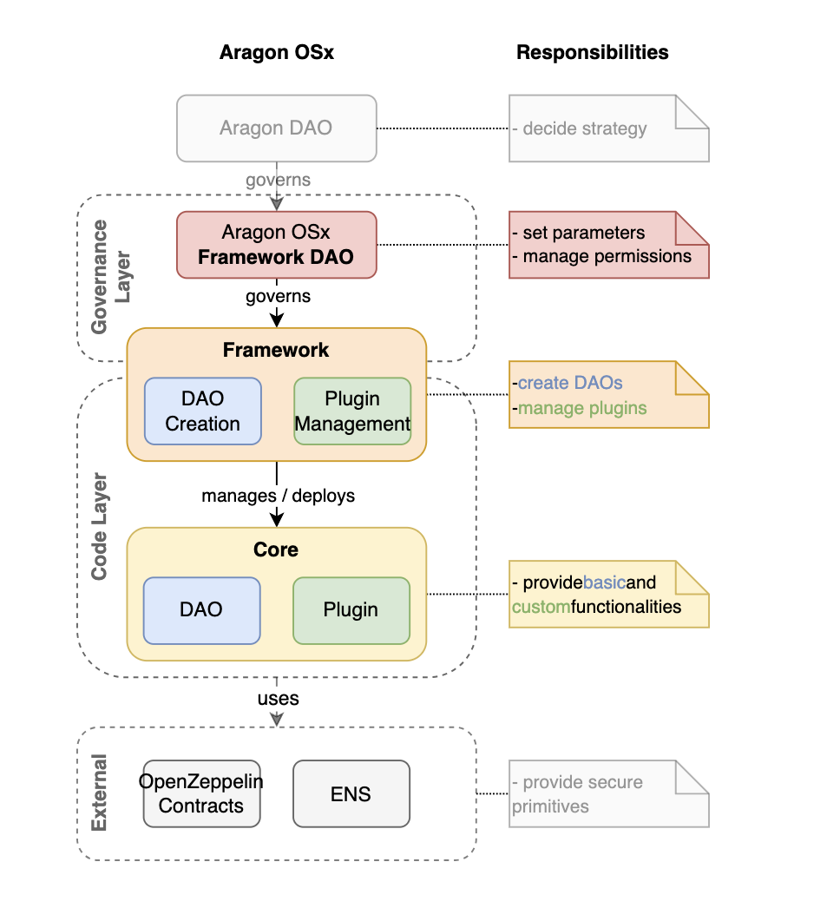

In addition to the code layer, the diagram also reflects the Aragon DAO and its "subdivision" — the Framework DAO. Aragon OSx is a smart contract-based operating system, and like any operating system, the protocol is constantly improved and updated — this is the responsibility of the Framework DAO, while the main DAO makes strategic decisions for all protocol products.

### Main Smart Contracts

Each DAO consists of three interconnected components: DAO, Permissions, Plugins.

#### DAO Smart Contract

[DAO](https://github.com/aragon/osx/blob/v1.3.0/packages/contracts/src/core/dao/DAO.sol) — It is the core of the organization that contains all vital functions.

**Responsibilities of the DAO Smart Contract**:
- Stores key information about the DAO (ENS name, logo, description, and other metadata) — [ERC-4824](https://eips.ethereum.org/EIPS/eip-4824)).
- Stores and manages the organization's assets (native currency, ERC20, ERC721, ERC1155).
- Can perform arbitrary actions:
  - Transfer assets.
  - Interact with external smart contracts and execute arbitrary actions. Typically, these actions are approved by voting beforehand. It is possible to execute a batch of actions by assembling them into an `Action[]` array and passing it to the `execute` function.
- Supports upgrades to new versions of Aragon OSx.
- Can handle callbacks like onERC721Received or onERC1155Received. Additionally, callbacks can be added to the DAO without upgrading, managed via the `registerStandardCallback` function.
- Supports the ERC-1271 standard (can sign transactions).
- Manages permissions.

The diagram below shows the main DAO methods (setters and getters):

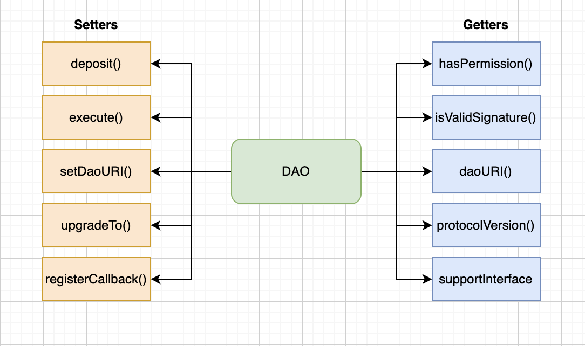

The DAO is a proxy smart contract that uses the UUPS (Universal Upgradeable Proxy Standard) pattern from the OpenZeppelin library. This means that the upgrade logic resides in the implementation smart contract. In general, all upgradable smart contracts in the protocol follow this pattern.

Additionally, all upgradable smart contracts in the protocol inherit from the smart contract [ProtocolVersion](https://github.com/aragon/osx/blob/v1.3.0/packages/contracts/src/utils/protocol/ProtocolVersion.sol), whose sole task is to display the current version of the protocol:

```solidity
abstract contract ProtocolVersion is IProtocolVersion {
    function protocolVersion() public pure returns (uint8[3] memory) {
        return [1, 4, 0];
    }
}
```

### Permission Manager

The DAO smart contract inherits from the smart contract [PermissionManager](https://github.com/aragon/osx/blob/v1.3.0/packages/contracts/src/core/permission/PermissionManager.sol), which is responsible for managing permissions and access to functionality.

This is a key linking mechanism in the protocol that works with permissions. Permission settings determine which wallets or smart contracts (where) are allowed to call specific authorized functions on a target smart contract (who). Each permission has its own identifier, and the authorization of this identifier is handled by the `auth` modifier. If you're familiar with Aragon v1, the Permission Manager is an improved version of the ACL (Access Control List) smart contract.

The main methods of the `PermissionManager` smart contract are shown in the diagram below:

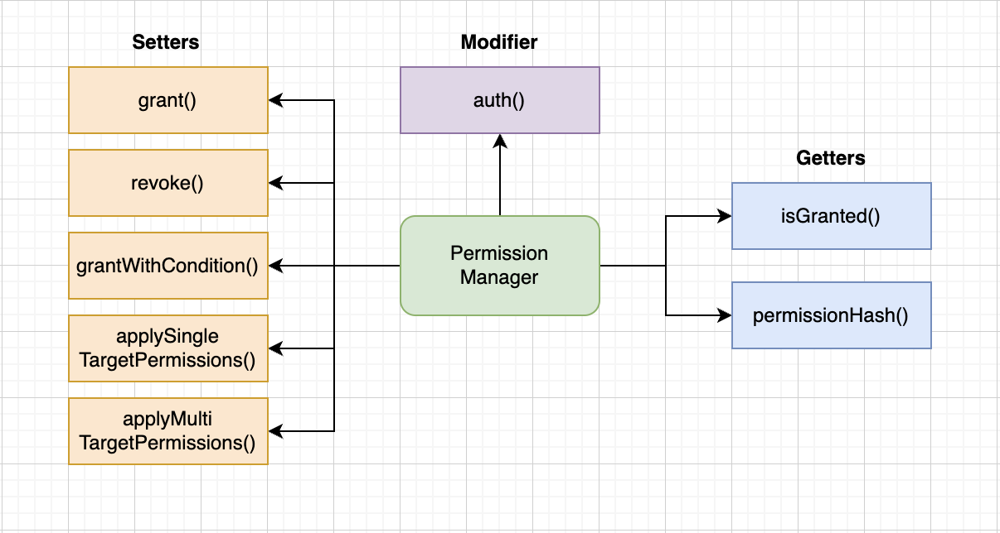

##### Permission ID

The identifier (`permissionId`) is a hash of the specific permission's name. This approach is similar to how OpenZeppelin's `AccessControl` identifies roles on a smart contract.

```solidity
bytes32 public constant EXECUTE_PERMISSION_ID = keccak256("EXECUTE_PERMISSION");
```

Permissions are stored as hashes that include the `PERMISSION` prefix, the `where` address, the `who` address, and the `permissionId`.

```solidity
function permissionHash(
  address _where,
  address _who,
  bytes32 _permissionId
) internal pure returns (bytes32) {
  return keccak256(abi.encodePacked('PERMISSION', _who, _where, _permissionId));
}
```

These hashes serve as keys for the `permissionsHashed` mapping, which stores an address. This address can be a service flag (`ALLOW_FLAG`, `UNSET_FLAG`) or a smart contract address:
- `ALLOW_FLAG = address(2)` — the permission is set, returns `true`;
- `UNSET_FLAG = address(0)` — the permission is not set, returns `false`;
- `PermissionCondition contract` — the address of a smart contract implementing the `IPermissionCondition` interface, capable of executing any validation logic using data from `msg.data` (more details on this later).

The function for checking permissions is `isGranted`:

```solidity
function isGranted(
    address _where,
    address _who,
    bytes32 _permissionId,
    bytes memory _data
) public view virtual returns (bool) {
    // ...

    // Retrieves a special flag or the address of a smart contract.
    address specificCallerTargetPermission = permissionsHashed[
        permissionHash({_where: _where, _who: _who, _permissionId: _permissionId})
    ];

    // If the permission is granted directly, return `true`.
    if (specificCallerTargetPermission == ALLOW_FLAG) return true;

    // If the permission was granted with a condition, check the condition and return the result.
    if (specificCallerTargetPermission != UNSET_FLAG) {
        return
            _checkCondition({
                _condition: specificCallerTargetPermission,
                _where: _where,
                _who: _who,
                _permissionId: _permissionId,
                _data: _data
            });
    }

    // ...

    return false;
}
```

##### Managing Permissions

The `auth` modifier is now minimalistic:

```solidity
function foo() external auth(EXECUTE_PERMISSION_ID);
```

This modifier calls the `_auth` function, which, in turn, calls `isGranted`.

Thus, to manage permissions, the DAO smart contract provides three public functions: `grant`, `revoke`, and `grantWithCondition`.

The `grant` and `revoke` functions have the same set of parameters (`where`, `who`, `permissionId`).

```solidity
function grant(
  address _where,
  address _who,
  bytes32 _permissionId
) external auth(_where, ROOT_PERMISSION_ID);
```

_Important!_ Typically, `ROOT_PERMISSION_ID` is granted only to the DAO smart contract, while `EXECUTE_PERMISSION_ID` is provided by a management smart contract, such as voting or multisig.

##### Permission Conditions

Usually, additional authorization conditions (`PermissionCondition`) are written specifically for plugins (more on plugins later, for now, it’s not crucial), although any smart contract can include validation logic.

This is very convenient: to add additional validation logic, you can write a small, separate smart contract instead of updating the main one. To do this, you need to implement the interface [IPermissionCondition](https://github.com/aragon/osx/blob/v1.3.0/packages/contracts/src/core/permission/IPermissionCondition.sol), specifically the `isGranted` function, which will accept the same arguments as the main function [isGranted](https://github.com/aragon/osx/blob/e90ea8f5cd6b98cbba16db07ab7bc0cdbf517f3e/packages/contracts/src/core/permission/PermissionManager.sol#L213) in the smart contract [PermissionManager](https://github.com/aragon/osx/blob/v1.3.0/packages/contracts/src/core/permission/PermissionManager.sol).

Step-by-step, it will look like this:

1. Let's take a simple smart contract as an example, which includes authorization through `auth`. Suppose we want to ensure that, in addition to checking the `SEND_COINS_PERMISSION_ID` permission for `msg.sender`, the function arguments `_to` and `amount` are also validated

```solidity
contract Example is Plugin {
  constructor(IDAO _dao) Plugin(_dao) {}

  function sendCoins(address _to, uint256 _amount) external auth(SEND_COINS_PERMISSION_ID) {
    // logic to send `_amount` coins to the address `_to`...
  }
}
```

2. To do this, we'll write a separate smart contract that implements this validation logic. It might look like this:

```solidity
contract ParameterConstraintCondition is PermissionCondition {
    uint256 internal maxValue;

    constructor(uint256 _maxValue) {
      	maxValue = _maxValue;
    }

    function isGranted(
        address _where,
        address _who,
        bytes32 _permissionId,
        bytes calldata _data
    ) external view returns (bool) {
        (_where, _who, _permissionId); // Prevents compiler warnings about unused variables

        // Extracts the values passed to the original function for validation
        (address _to, uint256 _amount) = abi.decode(_data, (address, uint256));

        return _amount <= _maxValue;
    }
}
```

3. Once we have a smart contract that will validate the function arguments when calling the `sendCoins` function, it is necessary to grant the permission using the `grantWithCondition` function [grantWithCondition](https://github.com/aragon/osx/blob/e90ea8f5cd6b98cbba16db07ab7bc0cdbf517f3e/packages/contracts/src/core/permission/PermissionManager.sol#L133) on our DAO.

```solidity
function grantWithCondition(
    address _where,
    address _who,
    bytes32 _permissionId,
    IPermissionCondition _condition
) external virtual auth(ROOT_PERMISSION_ID) {
    _grantWithCondition(_where, _who, _permissionId, _condition);
}
```

Where `_condition` will be the address of the additional validation smart contract `ParameterConstraintCondition`.

Thus, you can implement absolutely any validation logic for any permission without changing the smart contract's code. At the same time, it's just as easy to revert this permission back to a standard one without additional checks — you simply need to revoke the previous permission using `revoke` and re-grant it using the standard `grant` function.

###### Granting Permissions to `ANY_ADDR`

In combination with setting conditions, the `where` and `who` addresses can be set to `ANY_ADDR = address(type(uint160).max)`. If it is set for the `who` address, it will be equivalent to the absence of the `auth` modifier, meaning anyone will be able to call such a function. On the other hand, if `ANY_ADDR` is set for `where`, the `who` user will be able to call any smart contract within the organization.

_Important!_ You cannot set `ANY_ADDR` simultaneously for both `who` and `where`, and it will not work for the `ROOT_PERMISSION_ID` permission.

#### Plugins

After creation, a DAO already has a solid set of basic functionality, but at this stage, it represents a "bare" operating system. To add additional functionality, plugins are required. Generally, an organization needs at least one plugin responsible for governance (e.g., Voting or Multisig). Other plugins may address specific needs of the organization, such as asset management strategies or membership control.

At the same time, the DAO will store all permissions for plugin interactions, and it can also execute code if necessary.

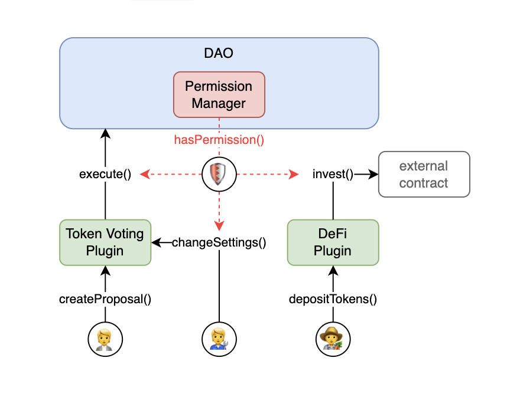

In such a scheme, any action will require the appropriate permission.

The Aragon team provides several plugins. The list is small, but they cover most use cases for organizations. It is recommended to use them, as they are safe and highly efficient. On the other hand, all the necessary conditions are provided for writing your own logic — you just need to understand how to correctly install, update, and remove plugins.

Abstract Smart Contract [Plugin](https://github.com/aragon/osx/blob/v1.3.0/packages/contracts/src/core/plugin/Plugin.sol),that needs to be inherited to implement your own logic has minimal functionality. It must include functionality for authorization within the organization (`DAOAuthorizable`) and specify the plugin type and protocol version.

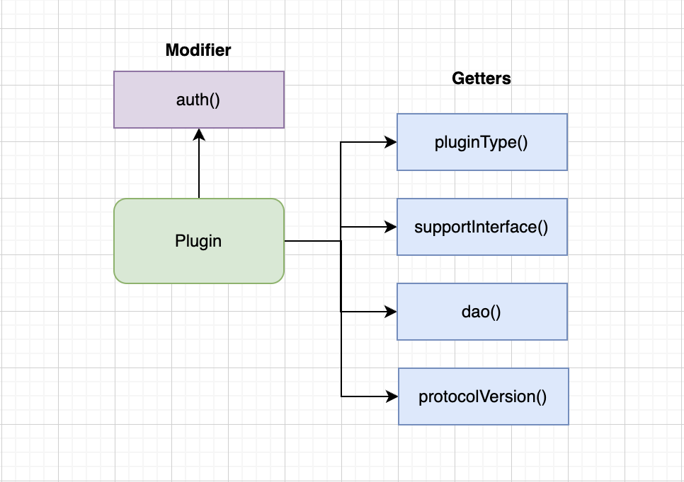

There are three types of plugins:
- **Constructable**: For creating a standard (non-upgradeable) smart contract.
- **Cloneable**: For creating a proxy using the Minimal Proxy Clones pattern ([ERC-1167](https://eips.ethereum.org/EIPS/eip-1167), non-upgradeable).
- **UUPS**: For creating a proxy using the UUPS pattern ([ERC-1822](https://eips.ethereum.org/EIPS/eip-1822), upgradeable).

### Framework Smart Contracts

To create and manage core contracts, framework smart contracts are required (https://github.com/aragon/osx/tree/v1.3.0/packages/contracts/src/framework). To create a DAO, two smart contracts are required: [DAOFactory](https://github.com/aragon/osx/blob/v1.3.0/packages/contracts/src/framework/dao/DAOFactory.sol) and [DAORegistry](https://github.com/aragon/osx/blob/v1.3.0/packages/contracts/src/framework/dao/DAORegistry.sol). During the creation of a DAO, it is fully configured: metadata is set, an ENS name is registered, plugins are installed, and the necessary permissions are granted.

Additionally, if a set of plugins can be installed during the creation of the DAO, this will be handled by [PluginSetupProcessor](https://github.com/aragon/osx/blob/v1.3.0/packages/contracts/src/framework/plugin/setup/PluginSetupProcessor.sol). But there is an important condition: the plugins must already be created and associated with the corresponding [PluginRepo](https://github.com/aragon/osx/blob/v1.3.0/packages/contracts/src/framework/plugin/repo/PluginRepo.sol), which must be registered in the [PluginRepoRegistry](https://github.com/aragon/osx/blob/v1.3.0/packages/contracts/src/framework/plugin/repo/PluginRepoRegistry.sol). In other words, `PluginSetupProcessor` is an installer, just like in a real operating system.

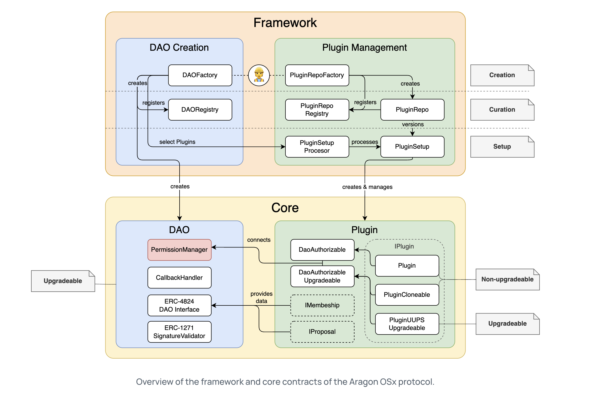

It might seem a bit complicated, but once you understand how plugins are created and installed, the above scheme becomes straightforward.

#### Creating a Plugin

First, the "body" of the plugin is created. As mentioned earlier, you need to inherit the base implementation of `Plugin` and add your custom logic.

At this stage, you need to decide whether the plugin should be upgradable or if, for example, new versions with similar functionality will need to be deployed. Depending on this, you can choose one of three options:

|                    | new Instantiation                    | Minimal Proxy (Clones)                    | UUPS Proxy                           |
| ------------------ | ------------------------------------ | ----------------------------------------- | ------------------------------------ |
| **upgradeability** | <span style="color:red">no</span>    | <span style="color:red">no</span>         | <span style="color:green">yes</span> |
| **gas costs**      | <span style="color:red">high</span>  | <span style="color:green">very low</span> | <span style="color:green">low</span> |
| **difficulty**     | <span style="color:green">low</span> | <span style="color:green">low</span>      | <span style="color:red">high</span>  |

In the case of deploying a plugin via `new`, it will be a standard smart contract with a constructor. However, for `MinimalProxy` or `UUPSProxy`, you need to add an `initialize` function.

The simplest version of a non-upgradeable plugin would look something like this:

```solidity
// SPDX-License-Identifier: AGPL-3.0-or-later
pragma solidity 0.8.21;

import {Plugin, IDAO} from '@aragon/osx/core/plugin/Plugin.sol';

contract SimpleAdmin is Plugin {
  /// @notice the permission ID for calling the function to execute code.
  bytes32 public constant ADMIN_EXECUTE_PERMISSION_ID = keccak256('ADMIN_EXECUTE_PERMISSION');
  address public immutable admin;

  /// @notice Initializes the smart contract.
  /// @param _dao The address of the associated DAO.
  /// @param _admin The address of the administrator.
  constructor(IDAO _dao, address _admin) Plugin(_dao) {
    admin = _admin;
  }

  /// @notice Executes actions in the associated DAO.
  function execute(IDAO.Action[] calldata _actions) external auth(ADMIN_EXECUTE_PERMISSION_ID) {
    dao().execute({callId: 0x0, actions: _actions, allowFailureMap: 0});
  }
}
```

After the plugin code is ready, it is necessary to write [PluginSetup](https://github.com/aragon/osx/blob/v1.3.0/packages/contracts/src/framework/plugin/setup/PluginSetup.sol) — a smart contract containing instructions for installing, configuring, removing, and updating the plugin. The `PluginSetup` smart contract must include the functions `prepareInstallation()`, `prepareUninstallation()`, and, if necessary, `prepareUpdate()`. These functions are at least responsible for requesting the granting or revoking of permissions for `who` addresses on `where` smart contracts (and explicitly declaring which permissions are used in the plugin). For example, `prepareInstallation()` creates an instance of the plugin and requests all necessary permissions at once. Additionally, `PluginSetup` can perform any other actions required to configure the plugin. More details can be found [here](https://devs.aragon.org/osx/how-to-guides/plugin-development/non-upgradeable-plugin/setup/). All of this is also necessary for compatibility with `PluginSetupProcessor`.

An example from the practical section can be found [here](./contracts/src/WETHPluginSetup.sol).

##### Plugin Repository

For the previously created plugin and installer, an on-chain repository (`PluginRepo`) must be created using the framework smart contract [PluginRepoFactory](https://github.com/aragon/osx/blob/v1.3.0/packages/contracts/src/framework/plugin/repo/PluginRepoFactory.sol). The repository is required for tracking plugin versions.

All versions are registered in the [PluginRepoRegistry](https://github.com/aragon/osx/blob/v1.3.0/packages/contracts/src/framework/plugin/repo/PluginRepoRegistry.sol), Each plugin version has a corresponding tag, which consists of a Release number and a Build number. Different versions may include bug fixes, new features, or "breaking changes" — modifications that are not backward compatible with previous plugin versions.

The first plugin version will have the tag `1.1`. All subsequent updates with significant changes will increment the Release number (the first digit), while bug fixes or the addition of new features will update the Build number for a specific release (the second digit).

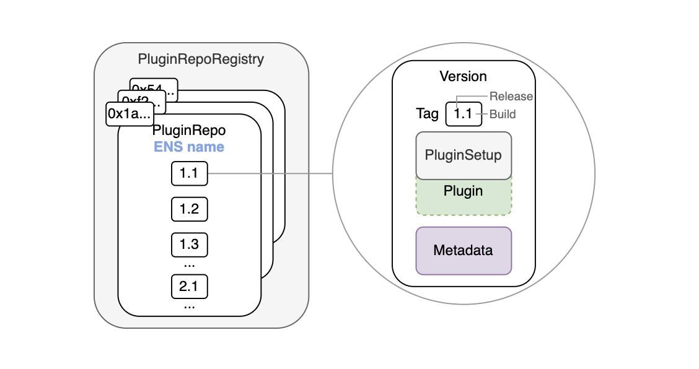

The first version will be created by calling the function `PluginRepoFactory::createPluginRepoWithFirstVersion()`:

```solidity
/// @notice Creates and registers a `PluginRepo` with an ENS subdomain and publishes the initial version `1.1`.
/// @param _subdomain ENS the plugin repository subdomain.
/// @param _pluginSetup The plugin setup contract associated with this plugin version.
/// @param _maintainer The address responsible for maintaining the plugin, which is granted all rights for managing and updating the plugin.
/// @param _releaseMetadata URI - metadata containing information about a specific release.
/// @param _buildMetadata URI - metadata containing information about a specific build.
/// @dev После создания `PluginRepo` and upon the factory releasing the first version, ownership is transferred to the `_maintainer` address.
function createPluginRepoWithFirstVersion(
  string calldata _subdomain,
  address _pluginSetup,
  address _maintainer,
  bytes memory _releaseMetadata,
  bytes memory _buildMetadata
) external returns (PluginRepo pluginRepo);
```

The `_maintainer` address receives the permissions `ROOT_PERMISSION_ID`, `MAINTAINER_PERMISSION_ID`, and `UPGRADE_REPO_PERMISSION_ID` upon repository creation. These permissions allow `_maintainer` to call the `PermissionManager::createVersion()` and `updateReleaseMetadata()` functions, as well as update the plugin smart contract.

The factory immediately registers the plugin through `PluginRepoRegistry::registerPluginRepo(string calldata subdomain, address pluginRepo)`.

Now the plugin is ready for installation (during the creation of a new DAO). This means it is effectively "published" in Aragon.

#### Installing the Plugin

Creating and registering a repository, as well as writing an installer, is necessary if you intend to publish the plugin for use within the Aragon framework. If you need to add custom functionality to your organization or extend an existing plugin, inheriting the base functionality is sufficient. Additionally, for convenience, you can write a `PluginSetup`, but creating a repository is not mandatory unless you plan to version your plugin.

If the plugin is being developed for Aragon, you must meet all preparation requirements outlined above. Afterward, you can pass the `PluginSettings` structure to the `DAOFactory::createDao()` function, which will contain the repository address and additional installation data, if required.

The installation of a plugin in an existing DAO must be performed in two steps through `PluginSetupProcessor`:
- Preparing the plugin for installation (`PluginSetupProcessor::prepareInstallation()`).
- Approving the installation after preparation (`PluginSetupProcessor::applyInstallation()`).

Approval of the plugin installation can only be executed by an entity with the `APPLY_INSTALLATION_PERMISSION_ID` permission. Thus, the installation of a new plugin must go through a proposal and be approved by the DAO, allowing a review of which permissions are being granted to the plugin and what actions it will perform.

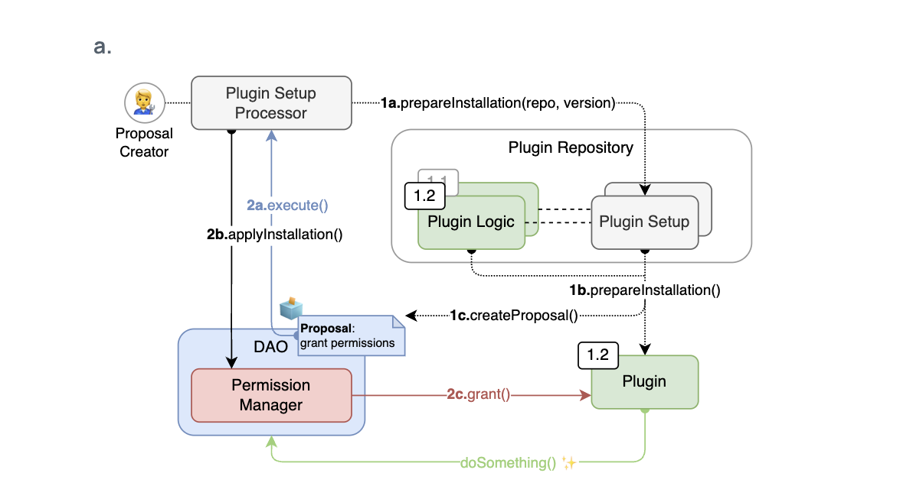

A good example of a `PluginSetup` smart contract is [TokenVotingSetup](https://github.com/aragon/osx/blob/v1.3.0/packages/contracts/src/plugins/governance/majority-voting/token/TokenVotingSetup.sol). Plugin [TokenVoting](https://github.com/aragon/osx/blob/v1.3.0/packages/contracts/src/plugins/governance/majority-voting/token/TokenVoting.sol) which is necessary for Governance functionality. During the plugin setup process prior to installation, you have the option to create a new voting token or add your own. If the existing token already supports `IVotesUpgradeable` from OpenZeppelin, it can be used directly. If not, `TokenVotingSetup` will create a wrapper token that includes the necessary functionality for voting.

#### Updating and Removing a Plugin

The `PluginSetupProcessor` also includes methods for updating and uninstalling a plugin (`applyUpdate`, `applyUninstallation`), which, similar to installation, are performed in two stages. During the installation, update, or removal of a plugin, the smart contract [PluginSetupProcessor](https://github.com/aragon/osx/blob/v1.3.0/packages/contracts/src/framework/plugin/setup/PluginSetupProcessor.sol) is temporarily granted the `ROOT_PERMISSION_ID` rights, but these are immediately revoked after the operations are completed.

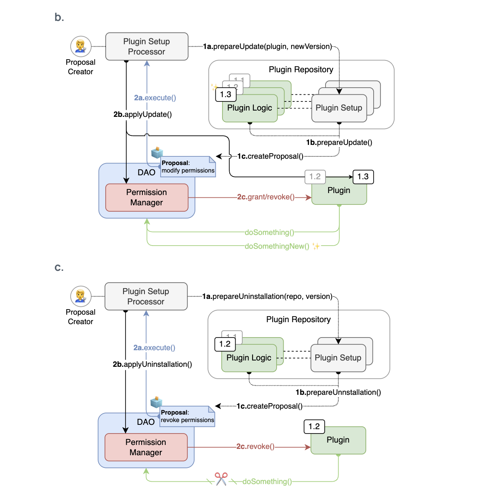

Since the `DAO::execute()` function can accept an array of `Actions[]`, this allows for approving multiple actions with different plugins in a single proposal. For example, in the case of replacing one plugin with another, the installation of the new plugin and the removal of the old one can be performed simultaneously.

Updating a plugin to a new release version or build version must be accompanied by a call to `PluginRepo::createVersion()`.

_Important!_ `PluginRepo` is responsible only for the versioning of the plugin but does not perform installation, updating, or uninstallation.

## Usage

There are three main ways to create and interact with a DAO:
- [Aragon App](https://app.aragon.org/) — a simple and intuitive interface from Aragon that allows you to create and configure a DAO, as well as create proposals;
- [Aragon SDK](https://github.com/aragon/sdk) — allows you to create custom interfaces for managing the DAO;
- [Aragon OSx](https://github.com/aragon/osx) — is used under the hood in the Aragon App and Aragon SDK, but it also allows for direct interaction with smart contracts (for advanced users only).

### Aragon App

For most users, the Aragon App will be more than sufficient. The protocol has significantly simplified its interface. Using the Aragon App, you can quickly create a DAO with just one plugin installed — [TokenVoting](https://github.com/aragon/osx/blob/v1.3.0/packages/contracts/src/plugins/governance/majority-voting/token/TokenVoting.sol). Combined with the `DAO::execute()` function, this becomes a very powerful tool. During the setup process, you can create or add your own token, choose the voting method, and configure the necessary parameters. In the future, any action will be executed only by creating a proposal, including changes to voting parameters.

Key voting settings for proposals if voting is done with tokens:
- **Support threshold**: The percentage of tokens voting "Yes" to support the proposal. Calculated from all tokens participating in the vote;
- **Minimum participation**: The required percentage of tokens from the total supply (`totalSupply`);
- **Minimum duration**: The shortest period during which the proposal remains open for voting (at least one day);
- **Early execution**: Allows the proposal to be executed before the voting period ends if the support threshold is exceeded, the minimum participation is met, and the result cannot be changed by additional voters;
- **Vote change**: Allows voters to change their vote during the voting period. This setting cannot be enabled if early execution is enabled;
- **Proposal creation**: Proposals can be created either by token holders or by any user. It is also possible to set a minimum token threshold for proposal creation.

_Note:_ In the case of a multisig model, simply add the addresses that will participate in voting and set the minimum number of addresses required to execute a proposal.

When creating a proposal, you can choose the action to be executed if the proposal is accepted. Here, you can select interactions with any smart contract (this is optional; you can simply describe the proposal in text).

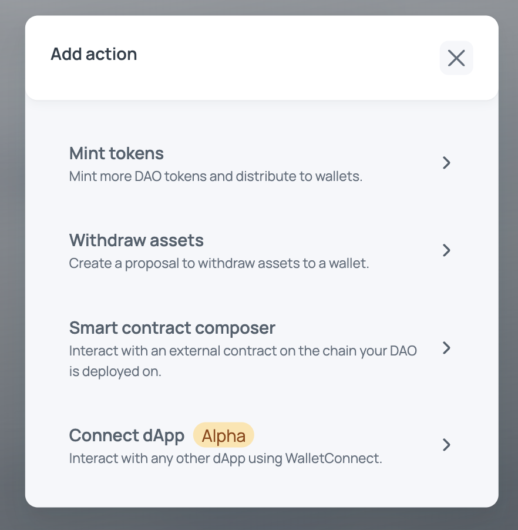

For example, this is how wrapping ETH into WETH looks using the WETH smart contract.

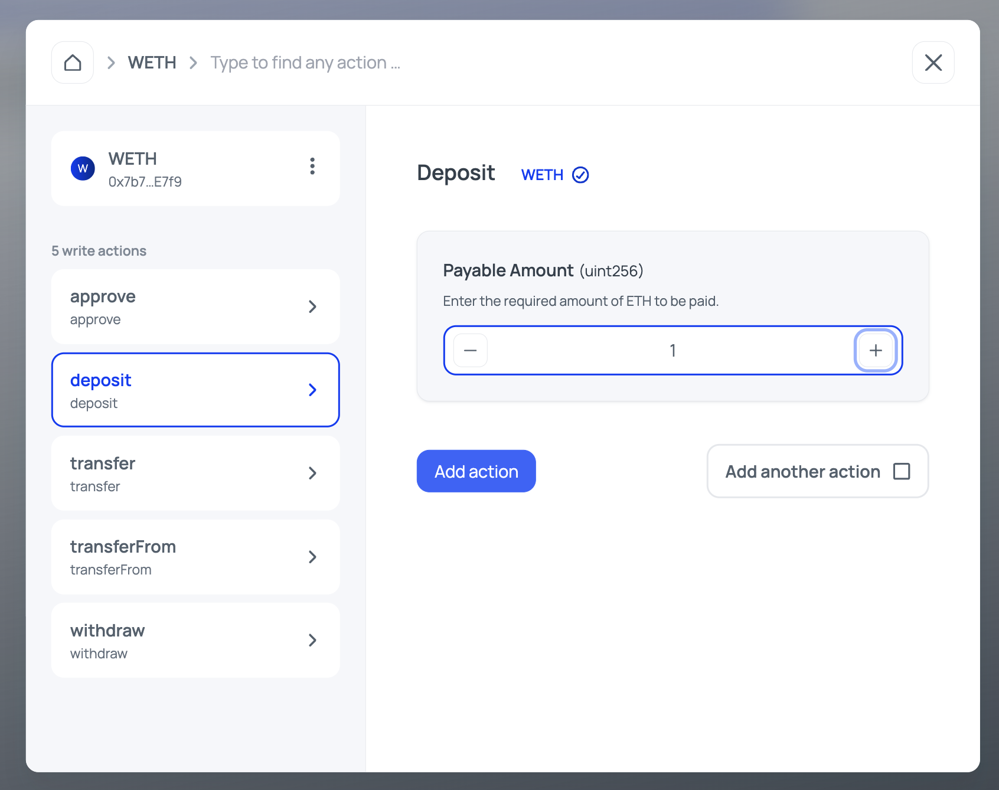

After the proposal is approved, you can call `DAO::execute()`.

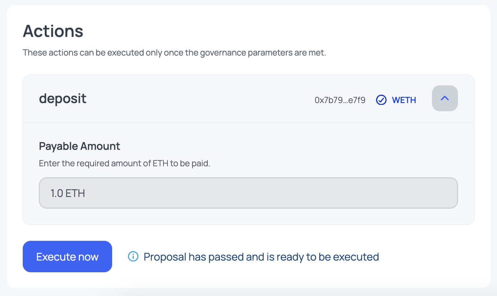

### Aragon OSx

To visually demonstrate what happens "under the hood," we will write foundry scripts for interacting with the protocol. In this example, we will use version Aragon OSx v1.3.0 of the protocol. You can view the smart contracts for this version [here](https://github.com/aragon/osx/tree/v1.3.0/packages/contracts).

#### Creating a DAO

_Note:_ A bit of configuration is required to launch the project; details can be found [here](./contracts/README.md).

The first script will create a DAO on the Sepolia network. All you need to do is replace the `DEPLOYER_ADDRESS` and optionally modify some DAO configuration parameters. The addresses of Aragon utility smart contracts for Sepolia (`DAOFactory`) can be found [here](https://github.com/aragon/osx-commons/blob/develop/configs/src/deployments/json/sepolia.json).

Deployment is performed in three stages:

1. Configuration parameters for the DAO itself are created. These are mainly various metadata that comply with [ERC-4824](https://eips.ethereum.org/EIPS/eip-4824).
2. Parameters for the TokenVoting plugin are created. Remember, it’s not possible to create a DAO without at least one plugin. These parameters include voting settings, token voting settings if a token needs to be created, and initial token issuance parameters. Additionally, information about the `PluginRepo` for this plugin and its version will be required.
3. Deploy the DAO with the plugin installation and configuration of all parameters.

```solidity
contract CreateDao is Script {
    /// Here, you only need to change DEPLOYER_ADDRESS
    address constant DEPLOYER_ADDRESS = 0x32bb35Fc246CB3979c4Df996F18366C6c753c29c;

    address constant DAO_FACTORY_ADDRESS = 0x7a62da7B56fB3bfCdF70E900787010Bc4c9Ca42e;
    address constant TOKEN_VOTING_PLUGIN_REPO_ADDRESS = 0x424F4cA6FA9c24C03f2396DF0E96057eD11CF7dF;

    /// We use DAOFactory on the Sepolia network.
    IDAOFactory daoFactory = IDAOFactory(DAO_FACTORY_ADDRESS);

    function run() external {
        /// Step 1 - Preparing configurations for DAO creation.

        /// 1.1 For simplicity, we will not provide detailed information about the DAO.
        DAOSettings memory daoSettings =
            DAOSettings({trustedForwarder: address(0), daoURI: "", subdomain: "", metadata: new bytes(0)});

        /// Step 2 - Preparing configurations for installing the TokenVoting plugin.

        /// 2.1 Specify the version of the TokenVoting plugin and the address of the PluginRepo for this plugin (Sepolia).
        PluginSetupRef memory pluginSetupRef = PluginSetupRef(
            PluginRepo.Tag({release: uint8(1), build: uint16(2)}), PluginRepo(TOKEN_VOTING_PLUGIN_REPO_ADDRESS)
        );

        /// 2.2 Voting parameters for installing the TokenVoting plugin.
        MajorityVotingBase.VotingSettings memory votingSettings = MajorityVotingBase.VotingSettings({
            votingMode: MajorityVotingBase.VotingMode.EarlyExecution, // Early execution is allowed
            supportThreshold: uint32(500000), // 50%
            minParticipation: uint32(150000), // 15%
            minDuration: uint64(86400), // 1 day
            minProposerVotingPower: 1e18 // Minimum number of tokens required for voting = 1
        });

        /// 2.3 Parameters for creating a voting token
        TokenVotingSetup.TokenSettings memory tokenSettings = TokenVotingSetup.TokenSettings({
            addr: address(0), // create new token
            name: "Test",
            symbol: "T"
        });

        /// 2.4 Token recipient — deployer address
        address[] memory receivers = new address[](1);
        receivers[0] = DEPLOYER_ADDRESS;

        /// 2.5 For example, we will mint 10 tokens to the deployer address
        uint256[] memory amounts = new uint256[](1);
        amounts[0] = 10e18;

        /// 2.6 Parameters for the initial issuance of the voting token
        GovernanceERC20.MintSettings memory mintSettings = GovernanceERC20.MintSettings(receivers, amounts);

        /// 2.7 Finally, we assemble all the plugin configurations together
        bytes memory data = abi.encode(votingSettings, tokenSettings, mintSettings);
        PluginSettings[] memory pluginSettings = new PluginSettings[](1);
        pluginSettings[0] = PluginSettings(pluginSetupRef, data);

        uint256 deployerPrivateKey = vm.envUint("PRIVATE_KEY");

        vm.startBroadcast(deployerPrivateKey);

        /// Step 3 - Create the DAO
        IDAO dao = daoFactory.createDao(daoSettings, pluginSettings);

        vm.stopBroadcast();

        console.log("------------------ Deployed contracts --------------------");
        console.log("DAO               : ", address(dao));
        console.log("------------------ Deployment info -----------------------");
        console.log("Chain id          : ", block.chainid);
        console.log("Deployer          : ", vm.addr(deployerPrivateKey));
    }
}
```

The full script code for `CreateDao` can be viewed [here](./contracts/script/CreateDao.s.sol).

Now, simply run this script. The `-vvvv` flag will display detailed information about the deployment and configuration of the DAO. If you do not plan to deploy the smart contract and only want to see what happens during deployment, remove the `--broadcast` flag:

```shell
$ forge script script/CreateDao.s.sol \
--rpc-url sepolia\
--broadcast \
-vvvv
```

#### Creating and Installing a Plugin

We will create a simple plugin for a task similar to what we performed through the interface — wrapping ETH into WETH.

_Note:_ In reality, such a simple plugin is unnecessary because this action can be performed directly via `DAO::execute()`. Therefore, the plugin is used solely for demonstration purposes.

The plugin will have only one function, which makes a deposit and sends the wrapped tokens to the DAO's address. To call this function, the calling entity must have the `DEPOSIT_PERMISSION` on this plugin. Additionally, the plugin is upgradeable.

```solidity
contract WETHPlugin is PluginUUPSUpgradeable {
    /// @notice Permission to call the `deposit()` function
    bytes32 public constant DEPOSIT_PERMISSION = keccak256("DEPOSIT_PERMISSION");

    IWETH internal _weth;
    IDAO internal _dao;

    /// @notice Performs the plugin initialization
    function initialize(IDAO dao, IWETH weth) external initializer {
        __PluginUUPSUpgradeable_init(dao);

        _weth = weth;
        _dao = dao;
    }

    /// @notice Wraps ETH into WETH
    function depositToWeth() external payable auth(DEPOSIT_PERMISSION) {
        _weth.deposit{value: msg.value}();
        IERC20(address(_weth)).transfer(address(_dao), msg.value);
    }
}
```

Suppose we want to publish our plugin. For this, a smart contract is required [WETHPluginSetup](./contracts/src/WETHPluginSetup.sol). This smart contract will be deployed only once for our plugin, so the plugin implementation will be deployed in the constructor.

```solidity
contract WETHPluginSetup is PluginSetup {
    /// @notice Plugin address
    address private immutable wethPlugin;

    /// @dev The `PluginSetup` contract is deployed only once for the plugin
    constructor() {
        wethPlugin = address(new WETHPlugin());
    }
}
```

The most important functions are `prepareInstallation` and `prepareUninstallation`. Let’s add the `prepareInstallation` function to set up the plugin in our `WETHPluginSetup`. This function will receive the necessary parameters for initialization, create a plugin proxy, and grant permission for the DAO to interact with the main function.

```solidity
contract WETHPluginSetup is PluginSetup {
    /// ...

    function prepareInstallation(address _dao, bytes calldata _data)
        external
        returns (address plugin, PreparedSetupData memory preparedSetupData)
    {
        /// Retrieve the WETH address from the data provided during installation
        IWETH weth = abi.decode(_data, (IWETH));

        /// Verify that the address is valid
        if (address(weth) == address(0)) {
            revert WethAddressInvalid();
        }

        /// Create a proxy for the `WETHPlugin`
        plugin = createERC1967Proxy(wethPlugin, abi.encodeCall(WETHPlugin.initialize, (IDAO(_dao), weth)));

        /// Grant permission for the DAO to call the `deposit()` function
        PermissionLib.MultiTargetPermission[] memory permissions = new PermissionLib.MultiTargetPermission[](1);

        permissions[0] = PermissionLib.MultiTargetPermission({
            operation: PermissionLib.Operation.Grant,
            where: plugin,
            who: _dao,
            condition: PermissionLib.NO_CONDITION,
            permissionId: WETHPlugin(this.implementation()).DEPOSIT_PERMISSION()
        });

        preparedSetupData.permissions = permissions;
    }
}
```

The full smart contract code with the uninstallation function can be viewed [here](./contracts/src/WETHPluginSetup.sol).

#### Script for Plugin Installation

To install the plugin in our DAO, it is necessary to create and register a repository for it, as well as create a vote in `TokenVoting`. Only this smart contract can call `DAO::execute()`, and only the DAO smart contract can install a plugin.

The steps are as follows:

1. Deploy the `WETHPluginSetup` smart contract.
2. Create and register a `PluginRepo` for `WETHPlugin` in ENS. These actions are performed via the `PluginRepoFactory` framework smart contract.
3. Perform the so-called pre-installation: call the `prepareInstallation` function on the `PluginSetupProcessor` framework smart contract, passing all parameters for the upcoming installation.
4. Next, prepare the parameters for the final installation through `PluginSetupProcessor::applyInstallation`.
5. Then, create a proposal in `TokenVoting`. This proposal will include a call to `PluginSetupProcessor::applyInstallation` and grant the `ROOT_PERMISSION_ID` permission to `PluginSetupProcessor`. After installing the plugin, this permission is immediately revoked within the same transaction.
6. After creating the proposal, a vote must be held.
7. Finally, after successful voting, the proposal can be executed, completing the plugin installation in the DAO.

```solidity
contract InstallWethPlugin is Script {
    /// Here, you need to change: DEPLOYER_ADDRESS, DAO_ADDRESS
    address constant DEPLOYER_ADDRESS = 0x32bb35Fc246CB3979c4Df996F18366C6c753c29c;
    address constant DAO_ADDRESS = 0x201836b4AEE703f29913c4b5CEb7E1c16C5eAb7b;

    address constant PLUGIN_REPO_FACTORY = 0x07f49c49Ce2A99CF7C28F66673d406386BDD8Ff4;
    address constant PLUGIN_SETUP_PROCESSOR = 0xC24188a73dc09aA7C721f96Ad8857B469C01dC9f;
    address constant WETH = 0x7b79995e5f793A07Bc00c21412e50Ecae098E7f9;
    address constant TOKEN_VOTING = 0xAABcB955DC1Ab7fDE229944DD329b4efc10c4ca7;

    /// Используем pluginRepoFactory и pluginSetupProcessor в сети Sepolia
    PluginRepoFactory pluginRepoFactory = PluginRepoFactory(PLUGIN_REPO_FACTORY);
    PluginSetupProcessor pluginSetupProcessor = PluginSetupProcessor(PLUGIN_SETUP_PROCESSOR);

    function run() external {
        uint256 deployerPrivateKey = vm.envUint("PRIVATE_KEY");

        vm.startBroadcast(deployerPrivateKey);

        /// Step 1 - Deploy the smart contract with the configurations for plugin installation
        WETHPluginSetup pluginSetupAddress = new WETHPluginSetup();

        /// Step 2 - Create and register the PluginRepo
        /// 2.1 Subdomain for plugin registration in ENS
        string memory subdomain = "weth-plugin";
        /// 2.2 Metadata (cannot pass bytes(0))
        bytes memory releaseMetadata = new bytes(1);
        bytes memory buildMetadata = new bytes(1);
        /// 2.3 Deploy and register the PluginRepo
        PluginRepo pluginRepo = pluginRepoFactory.createPluginRepoWithFirstVersion(
            subdomain, address(pluginSetupAddress), DEPLOYER_ADDRESS, releaseMetadata, buildMetadata
        );

        /// Step 3 - Submit a request to install the plugin in our DAO
        /// For this, the parameters need to be prepared
        /// 3.1 Plugin version and PluginRepo address
        PluginSetupRef memory pluginSetupRef =
            PluginSetupRef(PluginRepo.Tag({release: uint8(1), build: uint16(1)}), pluginRepo);

        /// 3.2 Data required for plugin installation
        bytes memory payload = abi.encode(WETH);

        /// 3.3 Prepare the final parameters
        PluginSetupProcessor.PrepareInstallationParams memory prepareInstallationParams =
            PluginSetupProcessor.PrepareInstallationParams(pluginSetupRef, payload);

        /// 3.4 Perform pre-installation (this is only the first stage of the installation)
        (address plugin, IPluginSetup.PreparedSetupData memory preparedSetupData) =
            pluginSetupProcessor.prepareInstallation(DAO_ADDRESS, prepareInstallationParams);

        /// Step 4 - Prepare for the final plugin installation
        /// 4.1 Helpers are not needed, so create an empty array
        address[] memory helpers = new address[](0);

        /// 4.2 Set the installation parameters
        /// The plugin address was obtained during pre-installation since it was deployed via `prepareInstallation`
        /// pluginSetupRef already prepared earlier
        /// Permissions are used from WETHPluginSetup
        PluginSetupProcessor.ApplyInstallationParams memory applyInstallationParams = PluginSetupProcessor
            .ApplyInstallationParams({
            pluginSetupRef: pluginSetupRef,
            plugin: plugin,
            permissions: preparedSetupData.permissions,
            helpersHash: hashHelpers(helpers)
        });

        /// Step 5 - Since only the DAO can perform the installation, and the `DAO::execute()` function can be called
        /// only through the TokenVoting app, it is necessary to create a vote for these actions

        /// 5.1 Get the instance of the TokenVoting app
        TokenVoting tokenVoting = TokenVoting(TOKEN_VOTING);

        /// 5.2 Prepare an array of Actions that will be submitted for execution by the DAO
        /// In addition to directly installing the WETHPlugin
        /// It will be necessary to grant the ROOT_PERMISSION_ID permission to the PluginSetupProcessor contract
        /// So that it can grant permissions from WETHPluginSetup
        /// After that, this permission must be revoked
        IDAO.Action[] memory actions = new IDAO.Action[](3);

        /// Action to grant the ROOT_PERMISSION_ID permission to PluginSetupProcessor
        actions[0] = IDAO.Action({
            to: address(DAO_ADDRESS),
            value: 0,
            data: abi.encodeCall(
                PermissionManager.grant,
                (DAO_ADDRESS, address(pluginSetupProcessor), DAO(payable(DAO_ADDRESS)).ROOT_PERMISSION_ID())
            )
        });
        /// Action to install the plugin
        actions[1] = IDAO.Action({
            to: address(pluginSetupProcessor),
            value: 0,
            data: abi.encodeCall(PluginSetupProcessor.applyInstallation, (DAO_ADDRESS, applyInstallationParams))
        });
        /// Action to revoke the ROOT_PERMISSION_ID permission from PluginSetupProcessor
        actions[2] = IDAO.Action({
            to: address(DAO_ADDRESS),
            value: 0,
            data: abi.encodeCall(
                PermissionManager.revoke,
                (DAO_ADDRESS, address(pluginSetupProcessor), DAO(payable(DAO_ADDRESS)).ROOT_PERMISSION_ID())
            )
        });

        ///5.3 Create a proposal for voting
        bytes memory metadata = new bytes(0);
        uint256 proposalId =
            tokenVoting.createProposal(metadata, actions, 0, 0, 0, IMajorityVoting.VoteOption.None, false);

        /// Step 6 - Vote for the proposal (since we are the only holders of voting tokens)
        tokenVoting.vote(proposalId, IMajorityVoting.VoteOption.Yes, false);

        /// Step 7 - Execute the proposal (only at this step will the plugin be installed)
        tokenVoting.execute(proposalId);

        vm.stopBroadcast();

        console.log("------------------ Deployed contracts --------------------");
        console.log("WethPlugin        : ", plugin);
        console.log("WETHPluginSetup   : ", address(pluginSetupAddress));
        console.log("WethPluginRepo    : ", address(pluginRepo));
        console.log("------------------ Deployment info -----------------------");
        console.log("Chain id           : ", block.chainid);
        console.log("Deployer          : ", vm.addr(deployerPrivateKey));
    }
}
```

The full script code is available [here](./contracts/script/InstallWethPlugin.s.sol). To run it, the `--via-ir` flag is required:

```shell
forge script script/InstallWethPlugin.s.sol --rpc-url sepolia --via-ir -vvvv --broadcast
```

Now the plugin is installed and ready to use.

#### Using the Plugin

Let’s write the final script for using the plugin. The rights to call the main function are with the DAO, so again we need to create a proposal and vote on it. The sequence of actions is as follows:

1. Send some ETH to the DAO address; this ETH will be wrapped by our plugin.
2. Create a vote; this time only one action is required — calling the `WETHPlugin::depositToWeth` function.
3. Create the corresponding proposal for voting.
4. Vote on this proposal.
5. Execute the proposal after successful voting.
6. Verify that the tokens were indeed wrapped and sent to the DAO address.

```solidity
contract DepositToWeth is Script {
    /// Here, you need to change: DEPLOYER_ADDRESS, DAO_ADDRESS, WETH_PLUGIN
    address constant DEPLOYER_ADDRESS = 0x32bb35Fc246CB3979c4Df996F18366C6c753c29c;
    address constant DAO_ADDRESS = 0x201836b4AEE703f29913c4b5CEb7E1c16C5eAb7b;
    address constant WETH_PLUGIN = 0x6602440aB337addc708cfa10077eabAEda6Cc882;

    address constant WETH = 0x7b79995e5f793A07Bc00c21412e50Ecae098E7f9;
    address constant TOKEN_VOTING = 0xAABcB955DC1Ab7fDE229944DD329b4efc10c4ca7;

    function run() external {
        uint256 deployerPrivateKey = vm.envUint("PRIVATE_KEY");

        vm.startBroadcast(deployerPrivateKey);

        /// Step 1 - Send a small amount of ETH (0.000000000000001 ETH) to the DAO
        IDAO(DAO_ADDRESS).deposit{value: 1000}(address(0), 1000, "");

        /// Step 2 - Create a vote
        TokenVoting tokenVoting = TokenVoting(TOKEN_VOTING);

        /// 2.2 Add the action WETHPlugin::depositToWeth().
        IDAO.Action[] memory actions = new IDAO.Action[](1);

        /// Deposit 1000 wei (0.000000000000001 ETH)
        actions[0] =
            IDAO.Action({to: WETH_PLUGIN, value: 1000, data: abi.encodeCall(IWETHPlugin.depositToWeth, ())});

        /// 2.3 Create a proposal for voting
        bytes memory metadata = new bytes(0);
        uint256 proposalId =
            tokenVoting.createProposal(metadata, actions, 0, 0, 0, IMajorityVoting.VoteOption.None, false);

        /// Step 3 - Vote on the proposal
        tokenVoting.vote(proposalId, IMajorityVoting.VoteOption.Yes, false);

        /// Step 4 - Execute the proposal (since we are the only holders of voting tokens)
        tokenVoting.execute(proposalId);

        /// Step 5 - Verify the deposit; the funds should be credited to the DAO address
        uint256 wethPluginBalance = IWETH(WETH).balanceOf(DAO_ADDRESS);

        vm.stopBroadcast();

        console.log("------------------ Scrypt info --------------------");
        console.log("ProposalID        : ", proposalId);
        console.log("wethPluginBalance : ", wethPluginBalance);
        console.log("------------------ Chain info -----------------------");
        console.log("Chain id           : ", block.chainid);
    }
}
```

The full script code is available [at this link](./contracts/script/DepositToWeth.s.sol).

Command to execute the script:
```shell
forge script script/DepositToWeth.s.sol --rpc-url sepolia -vvvv --broadcast
```

## Conclusion

The Aragon protocol has significantly evolved from its first version to Aragon OSx. While retaining its core concept, the implementation has become much simpler and more intuitive. Moreover, the protocol has moved away from the idea of creating numerous plugins (known as applications in the first version). In Aragon OSx, a single plugin — TokenVoting — can cover a vast number of use cases. Interacting with external smart contracts has also become much easier, allowing multiple smart contract calls to be encoded in a single proposal.

As seen in the last section, it is much easier to interact with the protocol through the interface or SDK. Direct interaction with AragonOSx smart contracts is possible but quite challenging and requires a solid knowledge of Solidity. At the same time, it is always possible to develop your own plugin or improve an existing one, enabling the execution of any logic necessary for the organization’s operation.

The approach to working with plugins is quite rigorous, ensuring safe installation, upgrades, and removal. Notably, Aragon OSx represents a decentralized mini-operating system in terms of its approach to plugins.

Overall, the protocol leaves a very positive impression and inspires hope for the emergence of more decentralized organizations.

## Links

- [Docs: Aragon](https://devs.aragon.org/)
- [Repo: Aragon OSx (v1.3.0)](https://github.com/aragon/osx/tree/v1.3.0)
- [Repo: Aragon OSx (latest)](https://github.com/aragon/osx)
- [Addresses of deployed smart contracts in different networks](https://github.com/aragon/osx-commons/tree/develop/configs/src/deployments/json)
