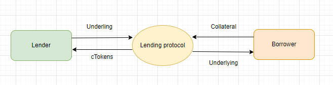
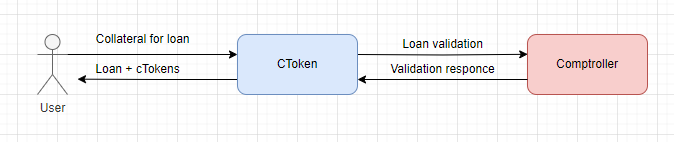
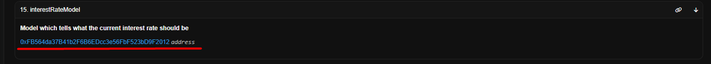
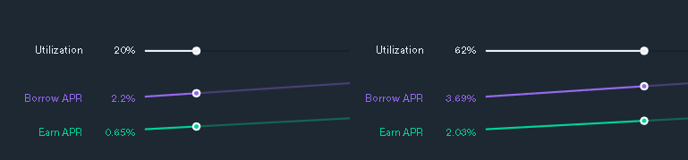
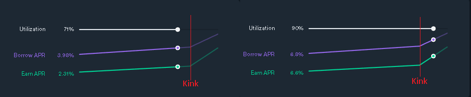
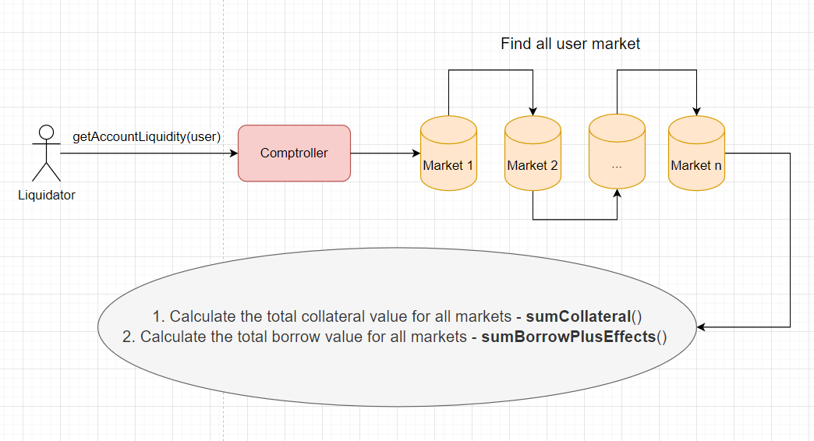
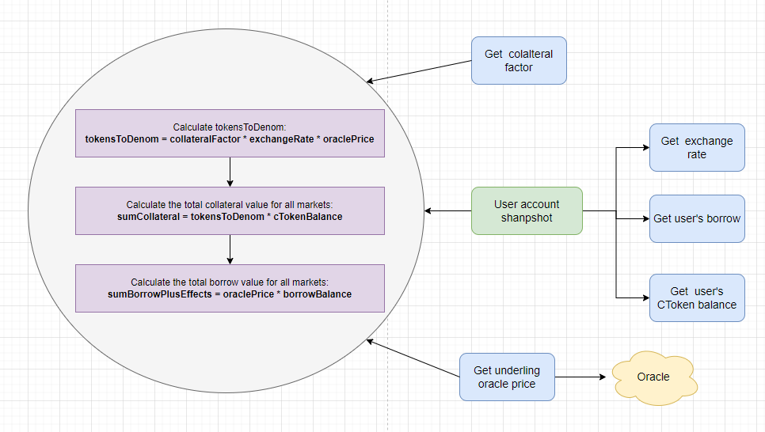
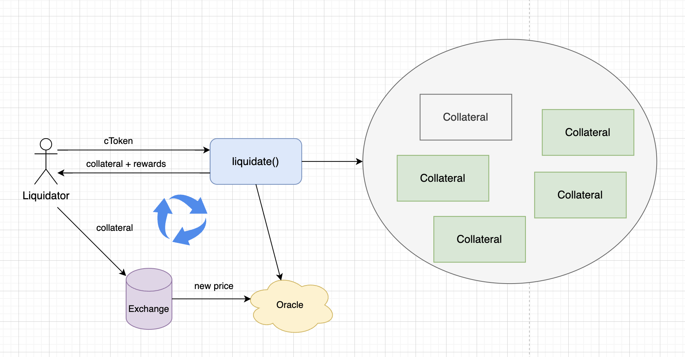

# The Compound DeFi Protocol

**Author:** [Pavel Naydanov](https://github.com/PavelNaydanov) 🕵️‍♂️

> "Compound interest is the eighth wonder of the world. He who understands it, earns it … he who doesn’t … pays it." — Albert Einstein

_**Note!**_ **Compound** is one of the earliest lending protocols in DeFi. It is used for lending and borrowing without intermediaries like traditional banks.
Compound connects lenders and borrowers using a set of smart contracts on EVM-compatible networks. Rewards are paid out in cryptocurrency.

In the protocol, there are two main types of users:
- **Lenders** — they supply assets to Compound. They send assets to a smart contract address controlled by Compound. The incentive is to earn rewards for providing funds.
- **Borrowers** — they borrow assets provided by Compound lenders. Collateral must be provided to be eligible for borrowing. Interest is accrued on borrowed funds.

_**Important!**_ I will be discussing the **second version** of Compound from hereon.

## Contracts

The protocol provides two main contracts:
  - [CToken.sol](https://github.com/compound-finance/compound-protocol/blob/master/contracts/CToken.sol). Represents each individual asset used within the Compound protocol. Such assets within cToken are referred to as the **underlying**.
  - [Comptroller.sol](https://github.com/compound-finance/compound-protocol/blob/master/contracts/Comptroller.sol). Acts as the main contract, managing risks, determining the amount of collateral a user must maintain for their loan, and overseeing the liquidation process.

In most cases, users interact with the protocol through the **CToken** contract.


### More About cToken

Currently, there are two types of cTokens:
1. **CErc20**. Wraps around an underlying ERC-20 asset.
2. **CEther**. Wraps around the native currency ETH.

The contracts [CErc20](https://github.com/compound-finance/compound-protocol/blob/master/contracts/CErc20.sol) and [CEther](https://github.com/compound-finance/compound-protocol/blob/master/contracts/CEther.sol) extend the functionality of **CToken** to work with the ERC-20 standard and the native blockchain currency, respectively. For the native currency, cToken is called **cETH**, for USDT - **cUSDT**, and so on.


From a user's perspective, **cToken** is the primary way to interact with the Compound protocol. To perform operations (provide liquidity or borrow assets), a user needs to interact with this contract. In return, the user receives an equivalent amount of **cToken** as confirmation of the operation. Each **cToken** can be transferred or traded without limitations. At any time, **cToken** can be exchanged only for the underlying asset originally locked in the protocol.



To keep track of the amount of assets, the protocol introduces the following variables:
  - totalBorrows (total amount borrowed),
  - totalReserves (total available funds for lending),
  - initialExchangeRate (initial exchange rate of cToken to the underlying asset and vice versa), among others.

For a detailed overview of the variables describing the storage of the cToken contract, you can refer to the official [repository](https://github.com/compound-finance/compound-protocol/blob/master/contracts/CTokenInterfaces.sol). Look into the contracts: [CTokenStorage](https://github.com/compound-finance/compound-protocol/blob/master/contracts/CTokenInterfaces.sol#L9C10-L9C23), [CErc20Storage](https://github.com/compound-finance/compound-protocol/blob/master/contracts/CTokenInterfaces.sol#L233).

Let's now delve into the functions of the [cToken](https://github.com/compound-finance/compound-protocol/blob/master/contracts/CToken.sol) smart contract. Some functions are present in the [CErc20](https://github.com/compound-finance/compound-protocol/blob/master/contracts/CErc20.sol) and [CEther](https://github.com/compound-finance/compound-protocol/blob/master/contracts/CEther.sol) contracts, which extend the functionality of cToken, or are declared as public variables in the [CTokenInterfaces](https://github.com/compound-finance/compound-protocol/blob/master/contracts/CTokenInterfaces.sol) interfaces.

- `mint()` - allows the user to deposit an asset into the protocol. In return, the user receives an amount of **cToken** equivalent to the underlying token divided by the current exchange rate. Interest can accumulate on the deposited asset.

- `redeem()` - redemption function. Converts a specified amount of **cToken** into the underlying asset and returns it to the user.

- `redeemUnderlying()` - redemption function. Converts **cToken** into a specified amount of the underlying asset and returns it to the user.

- `borrow()` - asset borrowing function. Transfers assets from the protocol to the user and starts accruing interest on the borrowed amount based on the asset's interest rate. Requires collateral to be provided through the `mint()` function.

- `repayBorrow()` - loan repayment function. Transfers assets back into the protocol, reducing the user's debt.

- `repayBorrowBehalf()` - loan repayment function. Transfers assets back into the protocol, reducing the debt of the specified user. This function allows one user to repay the debt on behalf of another borrower.

- `liquidateBorrow()` - function for liquidating an undercollateralized loan. It can only be called by other protocol participants (liquidators), not the borrowers themselves.

- `getCashPrior()` - function to retrieve the balance of the underlying asset in **cToken**.

- `totalBorrows()` - function to retrieve the total amount of outstanding underlying assets currently borrowed from the market.

- `borrowBalanceCurrent()` - function to retrieve the current outstanding balance of underlying assets for a specified user.

- `balanceOf()` - function to retrieve the balance of **cToken** for a user who has deposited assets into the protocol.

- `balanceOfUnderlying()` - function to retrieve the balance of the underlying asset for a user who has deposited assets into the protocol. It is equal to the user's **cToken** balance multiplied by the exchange rate.

- `supplyRatePerBlock()` - function to retrieve the current interest rate for supplying the underlying asset to the protocol for the current block.

- `borrowRatePerBlock()` - function to retrieve the current interest rate for borrowing the underlying asset from the protocol for the current block.

- `totalReserves()` - function to retrieve the reserves of the underlying asset. A small portion of the borrower's interest is accumulated in the protocol, determined by the reserve factor.

- `reserveFactorMantissa()` - function to retrieve the percentage of interest currently set aside as reserves.

### More about comptroller

In Compound, several **cTokens** operate as independent contracts. However, Compound allows users to collateralize one asset and borrow another. This makes sense because collateralizing and borrowing the same asset would be redundant. Therefore, management of all **cToken** contracts should be centralized.

The **Comptroller** acts as the connecting element for various **cTokens**. It manages concepts such as "operation allowed," collateral factor, close factor, and liquidation incentive.

Every time a user interacts with a **cToken**, under the hood, the **cToken** contract interfaces with the **comptroller** to validate the transaction. The **comptroller** has the authority to reject the transaction if conditions are not met.

> Example!
> * When a user wants to borrow from Compound, they first interact with the corresponding **cToken** contract to provide collateral. For example, to collateralize ETH, the user interacts with the cETH contract.
> * The **cToken** contract (in our case, cETH) interacts with the **comptroller** contract to check if the collateral requirements are met, such as having a sufficient collateral size.
> If conditions are met, the **comptroller** approves the transaction, and the user can borrow other assets based on their collateral.
> * The **Comptroller** also updates the user's account state, tracking how much they have borrowed and what collateral they have.



> This diagram is a simplified and concise representation. During the interaction between **comptroller** and **cToken**, many additional functions are called. For example, **comptroller** may distribute **COMP** tokens to users.

In its smart contract, **comptroller** has parameters:
- [borrowCaps](https://github.com/compound-finance/compound-protocol/blob/master/contracts/ComptrollerStorage.sol#L135). This parameter controls the borrowing limit for each user. By default, it is set to 0, indicating no limit.
- [collateralFactorMantissa](https://github.com/compound-finance/compound-protocol/blob/master/contracts/ComptrollerStorage.sol#L66). A metric representing the maximum borrowing amount relative to the total collateral value. For example, a value of 0.9 means you can borrow up to 90% of the collateral value. If the collateral is 100 DAI, the equivalent borrowed amount cannot exceed 90 DAI.
- [liquidationIncentiveMantissa](https://github.com/compound-finance/compound-protocol/blob/master/contracts/ComptrollerStorage.sol#L66). A parameter that denotes the bonus received by a liquidator.

These parameters are found in the contract [ComptrollerStorage.sol](https://github.com/compound-finance/compound-protocol/blob/master/contracts/ComptrollerStorage.sol) from which the contract [Comptroller.sol](https://github.com/compound-finance/compound-protocol/blob/master/contracts/Comptroller.sol) inherits and are used in lending and repayment.

The relationship between **cToken** and **Comptroller** orchestrates the lending and borrowing process for users within the protocol. To interact with a specific asset, the concept of a **market** is introduced.

## Market

_A market_ is a fully-fledged mini-ecosystem for an individual asset within the Compound protocol. Each market is serviced through its dedicated **cToken** contract, representing a user's ownership of the underlying asset. The **Comptroller** acts as a supportive contract for **cToken** and regulates the available types of assets that can be used as collateral. It also tracks the user's total collateral amount contributed through various **cToken** contracts.

Key characteristics of a Compound **market** include:

1. **cToken**: Each market has its own cToken (e.g., cDAI for DAI, cETH for ETH). Users receive cTokens when they provide liquidity or collateralize assets on the platform.

2. **Interest Rates**: Each market has its own borrowing and lending rates. These rates dynamically adjust based on supply and demand within the market.

3. **Metrics**: Metrics display information such as the amount of assets available for borrowing, the total earned interest, and other data.

4. **Collateralization Level**: Determines what percentage of a loan must be collateralized to participate in a particular market.

5. **Liquidation**: Regulates the liquidation process and monitors the percentage that liquidators can receive as a reward.

Let's briefly explore the Compound application and see how different [markets](https://app.compound.finance/markets) appear.


In the screenshot above, the first column represents the **market** names. The market for the "Ether" asset on the Ethereum network is highlighted with a red line. The list of other columns includes:

1. **Utilization**: The utilization rate or the percentage of borrowed assets relative to the total available for borrowing in this market. We'll discuss this in more detail later.
2. **Earn APR**: The Earn Annual Percentage Rate for lenders.
3. **Borrow APR**: The Borrow Annual Percentage Rate for borrowers.
4. **Total Earning**: The overall earnings for this market.
5. **Total Borrowing**: The total amount borrowed.
6. **Total Collateral**: The total amount of collateral deposited in this asset.
7. **Collateral assets**: The types of assets available for use as collateral.

If you enter a specific [market](https://app.compound.finance/markets/weth-mainnet) designed for Ether, you can find comprehensive information. See the screenshot below.


_Important!_ Interest rates, available collateral types, and other essential **market** parameters are set by the protocol administrator.

In essence, these multiple **markets** represent a list of tokens available for lending or borrowing. To associate users with specific **cTokens**, the **Comptroller** needs to be informed. This is done through the `enterMarkets()` function within the [Comptroller](https://github.com/compound-finance/compound-protocol/blob/master/contracts/Comptroller.sol#L121) contract. You call `enterMarkets()` to associate with specific markets. This function must be called for one reason:

1. For borrowing other assets. After entering a market and providing collateral, you can borrow other assets.

## Supplying

Let's discuss how a user begins interacting with the protocol. First and foremost, a user needs to supply their assets to the protocol. The supplied assets will act as liquidity or collateral for borrowing. In exchange for the supplied assets, users receive the corresponding **cToken**.

_Important!_ Users who are not tech-savvy can interact with the protocol using the [interface](https://app.compound.finance/).

The process of supplying liquidity works as follows:
1. Supplying liquidity starts with calling the `mint()` function on the respective cToken contract. A call in our custom **Adapter** contract might look like this:
    ```solidity
    contract CompoundAdapter {
        /// Добавление tokenA в качестве ликвидности в Compound
        function addCollateral(uint256 amount) external {
          /// Перевод средств с кошелька пользователя на контракт.
          /// Подразумеваем, что владелец кошелька заранее дал апрув на списание tokenA
          tokenA.transferFrom(msg.sender, address(this), amount);
          /// Старт взаимодействия с контрактом Compound
          cTokenA.mint(amount);
        }
    }
    ```
2. Under the hood, the `mint()` function is located in [CErc20.sol](https://github.com/compound-finance/compound-protocol/blob/master/contracts/CErc20.sol#L49) or [CEther.sol](https://github.com/compound-finance/compound-protocol/blob/master/contracts/CEther.sol#L45). From there, the call is forwarded to the [CToken.sol](https://github.com/compound-finance/compound-protocol/blob/master/contracts/CToken.sol#L386C14-L386C26) contract through the `mintInternal()` function call.
    ```solidity
    function mint(uint mintAmount) override external returns (uint) {
        mintInternal(mintAmount);
        return NO_ERROR;
    }
    ```
3. In `mintInternal()`, we observe a sequential invocation of two functions: `accrueInterest()` and `mintFresh()`. The first one accrues interest for the last accounting period, while the second one performs the actual transfer of liquidity into the protocol and issues CToken in return.
    ```solidity
    function mintInternal(uint mintAmount) internal nonReentrant {
        accrueInterest();
        mintFresh(msg.sender, mintAmount);
    }
    ```
4. Let's break down the `accrueInterest()` function.
    ```solidity
    function accrueInterest() virtual override public returns (uint) {
        /// obtain the current block number and the last block number at which interest was accrued.
        uint currentBlockNumber = getBlockNumber();
        uint accrualBlockNumberPrior = accrualBlockNumber;

        /// exit the function without an error if interest has already been accrued in the current block.
        if (accrualBlockNumberPrior == currentBlockNumber) {
            return NO_ERROR;
        }

        uint cashPrior = getCashPrior();
        uint borrowsPrior = totalBorrows;
        uint reservesPrior = totalReserves;
        uint borrowIndexPrior = borrowIndex;

        /// Calculation of the current loan interest rate coefficient.
        uint borrowRateMantissa = interestRateModel.getBorrowRate(cashPrior, borrowsPrior, reservesPrior);
        require(borrowRateMantissa <= borrowRateMaxMantissa, "borrow rate is absurdly high");

        /// We calculate the difference between the last block where the calculation was performed and the current block.
        uint blockDelta = currentBlockNumber - accrualBlockNumberPrior;

        /// Calculation of interest accrued on loans and reserves.
        Exp memory simpleInterestFactor = mul_(Exp({mantissa: borrowRateMantissa}), blockDelta);
        uint interestAccumulated = mul_ScalarTruncate(simpleInterestFactor, borrowsPrior);
        uint totalBorrowsNew = interestAccumulated + borrowsPrior;
        uint totalReservesNew = mul_ScalarTruncateAddUInt(Exp({mantissa: reserveFactorMantissa}), interestAccumulated, reservesPrior);
        uint borrowIndexNew = mul_ScalarTruncateAddUInt(simpleInterestFactor, borrowIndexPrior, borrowIndexPrior);

        /// We set the current block as the block in which interest was accrued.
        accrualBlockNumber = currentBlockNumber;

        /// update the loan interest rate coefficient.
        borrowIndex = borrowIndexNew;
        /// update the metrics for the total amount of loans and total reserves.
        totalBorrows = totalBorrowsNew;
        totalReserves = totalReservesNew;

        emit AccrueInterest(cashPrior, interestAccumulated, borrowIndexNew, totalBorrowsNew);

        return NO_ERROR;
    }
    ```
5. Let's dissect the `mintFresh()` function.
    ```solidity
    function mintFresh(address minter, uint mintAmount) internal {
        /// Checking in the comptroller for the ability to call the `mint()` function.
        uint allowed = comptroller.mintAllowed(address(this), minter, mintAmount);
        if (allowed != 0) {
            revert MintComptrollerRejection(allowed);
        }

        /// verify that interest has already been accrued in this block.
        if (accrualBlockNumber != getBlockNumber()) {
            revert MintFreshnessCheck();
        }

        /// We obtain the current value of the CToken relative to the underlying asset.
        /// Inside the `exchangeRateStoredInternal()` function, the calculation of the value is based on `totalCash`, `totalBorrows`, `totalReserves`, and `totalSupply`.
        Exp memory exchangeRate = Exp({mantissa: exchangeRateStoredInternal()});

        /// Transfer of liquidity to the CToken contract.
        /// The function differs for CErc-20 and CEther because native currency is transferred with the `mint()` function call.

        uint actualMintAmount = doTransferIn(minter, mintAmount);

        /// Calculation of the quantity of cTokens based on the cToken value.
        uint mintTokens = div_(actualMintAmount, exchangeRate);

        totalSupply = totalSupply + mintTokens;
        /// Accruing cTokens in exchange for provided liquidity.
        accountTokens[minter] = accountTokens[minter] + mintTokens;

        emit Mint(minter, actualMintAmount, mintTokens);
        emit Transfer(address(this), minter, mintTokens);
    }
    ```
Here's the scheme below to assist! 🧐


## Borrowing

Let's discuss what happens inside the Compound protocol when taking out a loan. We assume that collateral in a certain asset has already been deposited into the protocol as described in the [supplying](#supplying) section.

_Important Note:_ It's essential to mention that taking out a loan requires over-collateralization. Therefore, the borrower must deposit enough collateral first.

1. The loan process begins with "entering the market." To do this, you need to call the `enterMarkets()` function on the [comptroller contract](https://github.com/compound-finance/compound-protocol/blob/master/contracts/Comptroller.sol#L121) and pass a list of CToken addresses that you plan to use. Our potential **Adapter** contract would look like this.
    ```solidity
    contract CompoundAdapter {
        constructor(Comptroller comptroller, address[] cTokens) {
            /// Next, we perform "entering the market."
            uint256[] memory errors = comptroller.enterMarkets(cTokens);
            if (errors[0] != 0) {
                revert EnterMarketsFailed();
            }
        }

        function borrow(uint256 amount) {
            cTokenB.borrow(amount);
            tokenB.transfer(
                msg.sender,
                tokenB.balanceOf(address(this))
            );
        }
    }
    ```
    The `enterMarkets()` call processes the received list of cTokens and invokes the `addToMarketInternal()` function.
    ```solidity
    function addToMarketInternal(CToken cToken, address borrower) internal returns (Error) {
        Market storage marketToJoin = markets[address(cToken)];

        /// Returning from the function if the token is not allowed by the protocol.
        if (!marketToJoin.isListed) {
            return Error.MARKET_NOT_LISTED;
        }

        /// Early return if the user has already joined the market.
        if (marketToJoin.accountMembership[borrower] == true) {
            return Error.NO_ERROR;
        }

        /// We record in the contract's state that the user has joined the market.
        marketToJoin.accountMembership[borrower] = true;
        accountAssets[borrower].push(cToken);

        emit MarketEntered(cToken, borrower);

        return Error.NO_ERROR;
    }
    ```
2. Next, you need to call the `borrow()` function on the cToken contract. After this, lenders earn interest on the provided liquidity, and borrowers increase their funds. Under the hood, `borrow` is located in the CErc20 and CEther contracts, respectively, and calls the `borrowInternal()` function.
    ```solidity
    function borrow(uint borrowAmount) override external returns (uint) {
        borrowInternal(borrowAmount);
        return NO_ERROR;
    }

    ```
3. In `borrowInternal()` on the [CToken contract](https://github.com/compound-finance/compound-protocol/blob/master/contracts/CToken.sol#L555C14-L555C28), similar to `mintInternal()`, two functions are called: `accrueInterest()` and `borrowFresh()`.
    ```solidity
    function borrowInternal(uint borrowAmount) internal nonReentrant {
        accrueInterest();
        borrowFresh(payable(msg.sender), borrowAmount);
    }
    ```
4. We've already partially discussed `accrueInterest()` in the [supplying](#supplying) section. Let's take a closer look at `borrowFresh()`.
    ```solidity
    function borrowFresh(address payable borrower, uint borrowAmount) internal {
        /// Checking the ability to borrow on the comptroller contract.
        uint allowed = comptroller.borrowAllowed(address(this), borrower, borrowAmount);
        if (allowed != 0) {
            revert BorrowComptrollerRejection(allowed);
        }

        /// Cancellation of the transaction if interest has not been accrued in the current block.
        if (accrualBlockNumber != getBlockNumber()) {
            revert BorrowFreshnessCheck();
        }

        /// Cancellation of the transaction if there are not enough available funds in the protocol for borrowing.
        if (getCashPrior() < borrowAmount) {
            revert BorrowCashNotAvailable();
        }

        /// We obtain the existing debt amount of the borrower.
        uint accountBorrowsPrev = borrowBalanceStoredInternal(borrower);
        /// We obtain the new amount, taking into account the new loan.
        uint accountBorrowsNew = accountBorrowsPrev + borrowAmount;
        /// We obtain the total loan amount in the protocol.
        uint totalBorrowsNew = totalBorrows + borrowAmount;

        /// We update the loan information in the state of the contract.
        accountBorrows[borrower].principal = accountBorrowsNew;
        accountBorrows[borrower].interestIndex = borrowIndex;
        totalBorrows = totalBorrowsNew;

        /// Transfer of borrowed assets from the protocol to the borrower.
        /// The function differs for CErc-20 and CEther contracts.
        doTransferOut(borrower, borrowAmount);

        emit Borrow(borrower, borrowAmount, accountBorrowsNew, totalBorrowsNew);
    }
    ```

## Interest Rates

Interest rates are updated in every block and depend on the changes in the ratio of free assets to borrowed assets. There are three types of interest rates:

1. **Supply Rate:** This is the interest rate earned by liquidity providers for supplying their assets to the protocol.

2. **Exchange Rate:** This is the exchange rate within the protocol for cTokens (cDAI, cETH, etc.) relative to the underlying asset (DAI, ETH, etc.).

3. **Borrow Rate:** This is the interest rate that borrowers need to pay for using borrowed funds.

Interest rate values are calculated in a separate smart contract called [InterestRateModel](https://github.com/compound-finance/compound-protocol/blob/master/contracts/InterestRateModel.sol).

**Important:** Each cToken contract can have its own interest rate model. Admins can set the interest rate model by calling the `_setInterestRateModel()` function, which is located in the [cToken contract](https://github.com/compound-finance/compound-protocol/blob/master/contracts/CToken.sol#L1080).

The `InterestRateModel.sol` contract is an abstraction that requires the implementation of two functions: `getBorrowRate()` and `getSupplyRate()`. The purpose of these functions is to calculate interest rates based on the total amount of free assets (cash), the total amount of assets borrowed (borrows), and the amount of reserve funds.

Finding out which interest rate model is in use is straightforward. You need to call the public reading function `interestRateModel()` on the cToken contract. In the screenshot below, I did this for [cDAI](https://etherscan.io/address/0x5d3a536E4D6DbD6114cc1Ead35777bAB948E3643) on the Ethereum network.



The result of the function call was the address `0xFB564da37B41b2F6B6EDcc3e56FbF523bD9F2012`. Let's verify it on Etherscan.


You can view the complete code for the `JumpRateModelV2` contract on [Etherscan](https://etherscan.io/address/0xFB564da37B41b2F6B6EDcc3e56FbF523bD9F2012#code) or find it in the [repository](https://github.com/compound-finance/compound-protocol/blob/master/contracts/JumpRateModelV2.sol).

### Supply Rate

At any given moment, for each [cToken](https://github.com/compound-finance/compound-protocol/blob/master/contracts/CToken.sol#L215), you can request the interest rate earned by liquidity providers per block by calling the public function `supplyRatePerBlock()`.

```solidity
function supplyRatePerBlock() override external view returns (uint) {
    return interestRateModel.getSupplyRate(getCashPrior(), totalBorrows, totalReserves, reserveFactorMantissa);
}
```

Interestingly, the `interestRateModel.getSupplyRate()` call is used solely for obtaining information from outside the contract. For calculations at the moment of liquidity withdrawal, the [exchangeRate](https://github.com/compound-finance/compound-protocol/blob/master/contracts/CToken.sol#L484) is used.

In each block, the interest rate information can vary. However, we have observed that the actual interest accrual occurs with the `accrueInterest()` function call.

_Genius always works simply!_ Liquidity providers supply assets that borrowers can borrow. Borrowers pay interest (in the underlying asset) for using these assets. This constant inflow of the underlying asset leads to its accumulation. All collected interest (the increased amount of the underlying asset) is evenly distributed among all liquidity providers within the market.

### Exchange Rate

This interest rate is used to represent the exchange rate between the underlying asset and cTokens. When providing liquidity, you receive cTokens in exchange based on the exchange rate.

The exchange rate between cTokens and the underlying asset is calculated as follows:

`exchangeRate = (getCash() + totalBorrows() - totalReserves()) / totalSupply()`

You can obtain the current exchange rate value by calling the `exchangeRateCurrent()` function on the [cToken contract](https://github.com/compound-finance/compound-protocol/blob/master/contracts/CToken.sol#L274).

### Borrow Rate

At any given moment, for each [cToken](https://github.com/compound-finance/compound-protocol/blob/master/contracts/CToken.sol#L207), you can request the interest rate charged to borrowers per block.

```solidity
function borrowRatePerBlock() override external view returns (uint) {
    return interestRateModel.getBorrowRate(getCashPrior(), totalBorrows, totalReserves);
}
```

It is this rate that borrowers must pay for using assets borrowed from the protocol. Unlike `supplyRatePerBlock()`, `borrowRatePerBlock()` implements the logic of `interestRateModel.getBorrowRate()`, which plays a role in calculating accrued interest in the `accrueInterest()` function of the [cToken contract](https://github.com/compound-finance/compound-protocol/blob/master/contracts/CToken.sol#L344).

## Utilization Rate

Now, let's dive into the [InterestRateModel contract](https://github.com/compound-finance/compound-protocol/blob/master/contracts/InterestRateModel.sol). It serves as an abstraction for implementing interest rate models. The actual implementation resides in the [JumpRateModelV2 contract](https://github.com/compound-finance/compound-protocol/blob/master/contracts/JumpRateModelV2.sol).

If we look at JumpRateModelV2, we'll see that it not only inherits from InterestRateModel but also from [BaseJumpRateModelV2](https://github.com/compound-finance/compound-protocol/blob/master/contracts/BaseJumpRateModelV2.sol).

Here, it's worth pausing, as the [utilizationRate() function is used](https://github.com/compound-finance/compound-protocol/blob/master/contracts/BaseJumpRateModelV2.sol#L116C1-L121C6) for `getSupplyRate()`.

```solidity
function getSupplyRate(uint cash, uint borrows, uint reserves, uint reserveFactorMantissa) virtual override public view returns (uint) {
    uint oneMinusReserveFactor = BASE - reserveFactorMantissa;
    uint borrowRate = getBorrowRateInternal(cash, borrows, reserves);
    uint rateToPool = borrowRate * oneMinusReserveFactor / BASE;
    return utilizationRate(cash, borrows, reserves) * rateToPool / BASE;
}
```

_Bam!_ **Utilization rate** is the ratio or percentage of borrowed assets relative to the total available assets.

The amount of assets in the protocol is limited because every asset is provided by lenders as liquidity. Therefore, it's crucial to maintain a balance between the amount of assets available for borrowing and the assets already lent out.

If there are too many free assets, there might not be enough to generate profits for lenders. Conversely, if there are too few free assets, borrowers might need to look for other lending protocols.

The calculation of the utilization rate can be represented as follows:

> **utilizationRate** = **totalBorrows** / **totalSupply**, where
>
> **totalBorrows** - The total amount of assets borrowed.
>
> **totalSupply** - The total amount of assets.

However, `totalSupply` consists of the following components:

> **totalSupply** = **cash** + **borrows** - **reserves**, where
>
> **cash** - The amount of assets available for borrowing. This is the sum of assets provided by lenders.
>
> **borrows** - The amount of assets borrowed.
>
> **reserves** - The amount of assets held by the protocol as profit.

> Example!
>
> Alice is a lender and provides $750 for borrowing.
>
> Bob is a lender and provides $300 for borrowing.
>
> Charlie borrowed $150.
>
> The protocol's reserve is $10.
>
> Then the **utilizationRate** is calculated as follows:
>
> **cash** = $750 + $300 - $150 = $900 (subtracting $150 because Charlie has already borrowed these funds, and they are no longer available for borrowing)
>
> **borrows** = $150
>
> **reserves** = $10
>
> We get **utilizationRate** = **totalBorrows** / **cash** + **borrows** - **reserves** = $150 / ($900 + $150 - $10) ≈ 0.144 ≈ 14.4%

**Important!** A utilization rate of 14.4% means that only 14.4% of the protocol's assets are being used for borrowing. This implies that a significant portion of assets is free, meaning the protocol has ample liquidity. Borrowers can utilize these assets.



**Observation!** As the utilization rate increases, interest rates for providing liquidity will rise to motivate lenders to increase the supply of available assets. Conversely, as the utilization rate decreases, borrowing rates will decrease to make borrowing more attractive to borrowers.

Solidity, the language used for writing smart contracts for Ethereum-compatible networks, does not handle fractional numbers. Therefore, smart contracts use precision BASE in the formula.

> utilizationRate = borrows * BASE / (cash + borrows - reserves)

To obtain the **utilizationRate** off-chain, you need to divide utilizationRate by precision.

## Kink

**What happens if the utilization rate becomes too high and approaches 100%?** This means that the balance between free assets available for borrowing and borrowed assets is disrupted. In other words, the amount of assets in use as loans will approach the total assets available. If the utilization rate reaches 100%, it essentially halts the protocol's operation. In such a state, the protocol lacks available liquidity for new loans, and since all assets are already in use as loans, lenders cannot withdraw their assets. In this state, the protocol remains inactive until new liquidity providers arrive or some loans are repaid, which is undesirable. 🤢

To prevent such a situation, a special parameter called **kink** is used. It defines the value of the **utilizationRate** at which interest rates increase for both lenders and borrowers.

When `utilizationRate < kink`, interest rates change linearly.
When `utilizationRate > kink`, interest rates change exponentially. Lenders start earning significantly higher interest for supplying assets, and borrowing becomes more expensive for borrowers.



The kink point in the interest rate curve regulates the protocol's liquidity. Thanks to this, the scenario of continuous utilization rate growth becomes unlikely because high interest rates for lenders quickly attract a large amount of liquidity, reducing the utilization rate.

**Important!** In the Compound protocol, the kink level is set to 80%. Thus, once the utilizationRate exceeds 80%, interest rates for suppliers and borrowers will sharply increase. You can verify this by calling the `kink()` function on the [JumpRateModelV2 contract](https://etherscan.io/address/0xFB564da37B41b2F6B6EDcc3e56FbF523bD9F2012#readContract).

### Borrow Rate in InterestRateModelV2

Now, let's look at the calculation of the interest borrow rate. I've explained kink and utilizationRate. From here, we can derive two calculation scenarios:

> 1. When utilizationRate <= kink.
> Formula: **interest borrow rate** = (utilization rate * multiplierPerBlock / BASE) + baseRatePerBlock, where:
>    * **baseRatePerBlock** - The base interest rate, which determines the rate when utilizationRate = 0%.
>    * **multiplierPerBlock** - The interest rate multiplier that models its increase as utilizationRate increases. In other words, it determines the slope of the interest rate growth graph in proportion to utilizationRate.
>    * **BASE** - Precision for calculations, as Solidity does not support fractional numbers.
>
>    This results in a linear increase in the interest rate up to the kink level.
> 2. When utilizationRate > kink.
> Formula: **interest borrow rate** = (excessUtil * jumpMultiplierPerBlock / BASE) + normalRate, where:
>    * **normalRate** = (kink * multiplierPerBlock / BASE) + baseRatePerBlock. Same as when utilizationRate <= kink.
>    * **excessUtil** = utilization rate - kink. The difference, exceeding the kink level.
>    * **jumpMultiplierPerBlock**. For calculating interest rates after exceeding the kink level.

In the [BaseJumpRateModelV2 code](https://github.com/compound-finance/compound-protocol/blob/master/contracts/BaseJumpRateModelV2.sol#L96), this looks more concise:
```solidity
function getBorrowRateInternal(uint cash, uint borrows, uint reserves) internal view returns (uint) {
    uint util = utilizationRate(cash, borrows, reserves);

    if (util <= kink) {
        return ((util * multiplierPerBlock) / BASE) + baseRatePerBlock;
    } else {
        uint normalRate = ((kink * multiplierPerBlock) / BASE) + baseRatePerBlock;
        uint excessUtil = util - kink;
        return ((excessUtil * jumpMultiplierPerBlock) / BASE) + normalRate;
    }
}
```

## Redemption

As my reader, you should have already grasped that for operations like `supply()` - providing liquidity, and `borrow()` - borrowing assets, there must be corresponding reverse operations. Based on the examples and descriptions above, you can explore the Compound protocol's code on your own.

I'll guide you through these operations and provide entry points:
1. **Redeeming liquidity:** In the [cToken](https://github.com/compound-finance/compound-protocol/blob/master/contracts/CToken.sol#L456C14-L456C28) contract, you'll find the `redeemInternal()` function.
2. **Repaying a loan:** In the [cToken](https://github.com/compound-finance/compound-protocol/blob/master/contracts/CToken.sol#L619C14-L619C33) contract, there's the `repayBorrowInternal()` function.

## Liquidation

Over time, the collateralization of a loan may no longer be sufficient due to cryptocurrency volatility. In such cases, a user's loan can be subjected to the liquidation mechanism.

### Possibility of Loan Liquidation

To determine whether the collateral and loan position meet the collateralization requirements in Compound, the total value of the collateral and the total value of borrowed assets are compared. This is handled by a separate function called `getAccountLiquidity(address user)` in the [Comptroller](https://github.com/compound-finance/compound-protocol/blob/master/contracts/Comptroller.sol#L676) contract.

This time, I suggest skipping the chain of internal calls and jumping straight to the `getHypotheticalAccountLiquidityInternal()` function, which contains the core logic. This function can be found in the [Comptroller](https://github.com/compound-finance/compound-protocol/blob/master/contracts/Comptroller.sol#L723) contract.

```solidity
function getHypotheticalAccountLiquidityInternal(
    address account,
    CToken cTokenModify,
    uint redeemTokens,
    uint borrowAmount
) internal view returns (Error, uint, uint) {
    /// Intermediate results and calculations are recorded here.
    AccountLiquidityLocalVars memory vars;

    CToken[] memory assets = accountAssets[account];
    /// Organize a loop to iterate through all the user's nested assets with the address account
    for (uint i = 0; i < assets.length; i++) {
        CToken asset = assets[i];

        /// Loading information for each asset.
        (oErr, vars.cTokenBalance, vars.borrowBalance, vars.exchangeRateMantissa) = asset.getAccountSnapshot(account);
        if (oErr != 0) {
            return (Error.SNAPSHOT_ERROR, 0, 0);
        }

        /// Adding precision according to the contract "./ExponentialNoError.sol".
        vars.collateralFactor = Exp({mantissa: markets[address(asset)].collateralFactorMantissa});
        vars.exchangeRate = Exp({mantissa: vars.exchangeRateMantissa});

        /// Fetching the price from the oracle for the base asset.
        vars.oraclePriceMantissa = oracle.getUnderlyingPrice(asset);
        if (vars.oraclePriceMantissa == 0) {
            return (Error.PRICE_ERROR, 0, 0);
        }
        vars.oraclePrice = Exp({mantissa: vars.oraclePriceMantissa});

        /// Calculating the cost of one cToken.
        vars.tokensToDenom = mul_(mul_(vars.collateralFactor, vars.exchangeRate), vars.oraclePrice);

        /// sumCollateral += tokensToDenom(cost per one cToken) * cTokenBalance(account's balance of cToken)
        vars.sumCollateral = mul_ScalarTruncateAddUInt(vars.tokensToDenom, vars.cTokenBalance, vars.sumCollateral);

        /// sumBorrowPlusEffects += oraclePrice(The asset's value according to the oracle) * borrowBalance(Balance of borrowed funds)
        vars.sumBorrowPlusEffects = mul_ScalarTruncateAddUInt(vars.oraclePrice, vars.borrowBalance, vars.sumBorrowPlusEffects);

        /// For the asset that the user borrowed and whose position will change.
        if (asset == cTokenModify) {
            // sumBorrowPlusEffects += tokensToDenom(price of one cToken) * redeemTokens(Number of cTokens required to close the position)
            vars.sumBorrowPlusEffects = mul_ScalarTruncateAddUInt(vars.tokensToDenom, redeemTokens, vars.sumBorrowPlusEffects);

            // sumBorrowPlusEffects += oraclePrice(the cost of the asset) * borrowAmount (Amount of borrowed funds)
            vars.sumBorrowPlusEffects = mul_ScalarTruncateAddUInt(vars.oraclePrice, borrowAmount, vars.sumBorrowPlusEffects);
        }
    }

      /// Protection against overflow.
    if (vars.sumCollateral > vars.sumBorrowPlusEffects) {
        return (Error.NO_ERROR, vars.sumCollateral - vars.sumBorrowPlusEffects, 0);
    } else {
        return (Error.NO_ERROR, 0, vars.sumBorrowPlusEffects - vars.sumCollateral);
    }
}
```

At the top level, this can be represented as a diagram.



Inside the `getHypotheticalAccountLiquidityInternal()` function, the protocol calculates the collateral value for each **market** in which the user is participating. To do this, it needs to calculate the sum and retrieve user data, including **cTokenBalance**, **borrowBalance**, and **exchangeRate**, which are essential pieces of information about the user's borrowing position. The **collateralFactor** and the collateral asset's value will be determined using an oracle.

Based on the asset's value, exchange rate of cTokens to the asset, and collateralFactor, the collateral value of one cToken is computed as:

> tokensToDenom = collateralFactor * exchangeRate * oraclePrice

Then, this computed value is stored in a variable that keeps track of the cumulative value across all markets:

> sumCollateral += tokensToDenom * cTokenBalance

Additionally, the protocol calculates the value of borrowed funds in each market, maintaining a variable for the cumulative borrow value across all markets:

> sumBorrowPlusEffects += oraclePrice * borrowBalance

Schematically, the evaluation of each market can be represented as follows.



Once this algorithm is applied cyclically for each market in which the user is involved, we obtain the final values of the cumulative variables, `sumCollateral` and `sumBorrowPlusEffects`.

> At the end, there is a check!
> If `sumCollateral > sumBorrowPlusEffects`, then there is enough collateral to support the borrowing.
> If `sumCollateral < sumBorrowPlusEffects`, then there is insufficient collateral to support the borrowing. This means the user's borrowing may be subject to liquidation.

> When there is insufficient collateral, users become eligible for liquidation by other participants in the protocol (liquidity providers). During this time, users cannot withdraw or borrow assets until they rectify the collateral shortfall (i.e., ensuring `sumCollateral > sumBorrowPlusEffects`).

**Why might a collateral shortfall occur?**

- Interest on borrowed funds accumulates over time, leading to a decrease in user liquidity.
- The value of the collateral sharply declines (the collateral becomes cheaper).
- The value of the borrowed asset sharply increases (the borrowing becomes more expensive, and the collateral is no longer sufficient).

### Liquidation Process

When liquidation becomes possible, a liquidator can repay a portion or the entirety of a user's debt. In return, they receive compensation in the form of a portion of the user's collateral.

The percentage of the user's debt that can be repaid by a liquidator ranges from 0% to 100% and can be configured within the protocol. However, there are limits set on the minimum and maximum allowable repayment percentages, controlled by the `closeFactorMinMantissa` and `closeFactorMaxMantissa` variables in the [Comptroller](https://github.com/compound-finance/compound-protocol/blob/master/contracts/Comptroller.sol#L81C28-L81C51) contract.

1. The liquidation process begins with a call to the `liquidateBorrow()` function on the [CErc20.sol](https://github.com/compound-finance/compound-protocol/blob/master/contracts/CErc20.sol#L115C14-L115C29) or [CEther.sol](https://github.com/compound-finance/compound-protocol/blob/master/contracts/CErc20.sol#L115C14-L115C29) contracts.

    ```solidity
        function liquidateBorrow(address borrower, CToken cTokenCollateral) external payable {
            liquidateBorrowInternal(borrower, msg.value, cTokenCollateral);
        }
    ```
2. Next, the call goes inside the `liquidateBorrowInternal()` function of the [CToken](https://github.com/compound-finance/compound-protocol/blob/master/contracts/CToken.sol#L700C5-L711C6) contract.
    ``` solidity
    function liquidateBorrowInternal(address borrower, uint repayAmount, CTokenInterface cTokenCollateral) internal nonReentrant {
        /// Accrual of accumulated interest for the last calculation period.
        accrueInterest();

          /// Initiating liquidation.
        liquidateBorrowFresh(msg.sender, borrower, repayAmount, cTokenCollateral);
    }
    ```
    In essence, it follows the familiar scheme of the supplying and borrowing process.
3. Next, the call is directed to the `liquidateBorrowFresh()` function of the [CToken](https://github.com/compound-finance/compound-protocol/blob/master/contracts/CToken.sol#L721) contract.
    ```solidity
    function liquidateBorrowFresh(address liquidator, address borrower, uint repayAmount, CTokenInterface cTokenCollateral) internal {
        /// The liquidation permission is checked at the Comptroller contract.
        uint allowed = comptroller.liquidateBorrowAllowed(address(this), address(cTokenCollateral), liquidator, borrower, repayAmount);
        if (allowed != 0) {
            revert LiquidateComptrollerRejection(allowed);
        }

        /// It's verified that the interest accrual occurred in the current block.
        if (accrualBlockNumber != getBlockNumber()) {
            revert LiquidateFreshnessCheck();
        }

        /// Additionally, it's confirmed that the interest accrual for the specific CToken occurred in the current block.
        if (cTokenCollateral.accrualBlockNumber() != getBlockNumber()) {
            revert LiquidateCollateralFreshnessCheck();
        }

        /// Borrowers are prohibited from liquidating their own loans.
        if (borrower == liquidator) {
            revert LiquidateLiquidatorIsBorrower();
        }

        /// The repayment amount must not be zero.
        if (repayAmount == 0) {
            revert LiquidateCloseAmountIsZero();
        }

        /// The repayment amount must not be negative or exceed the `uint` limit.
        if (repayAmount == type(uint).max) {
            revert LiquidateCloseAmountIsUintMax();
        }

        /// Calling the loan repayment function.
        uint actualRepayAmount = repayBorrowFresh(liquidator, borrower, repayAmount);

        /// The number of cTokens to be deducted from the liquidator to repay the loan is calculated.
        (uint amountSeizeError, uint seizeTokens) = comptroller.liquidateCalculateSeizeTokens(address(this), address(cTokenCollateral), actualRepayAmount);
        require(amountSeizeError == NO_ERROR, "LIQUIDATE_COMPTROLLER_CALCULATE_AMOUNT_SEIZE_FAILED");

        /// It's verified that the liquidator has enough cTokens to deduct for loan repayment in the user's liquidation.
        require(cTokenCollateral.balanceOf(borrower) >= seizeTokens, "LIQUIDATE_SEIZE_TOO_MUCH");

        /// If the calling contract's address matches the specified cToken's address, then
        /// reduce the borrower's position and reward the liquidator.
        if (address(cTokenCollateral) == address(this)) {
            seizeInternal(address(this), liquidator, borrower, seizeTokens);
        } else {
            require(cTokenCollateral.seize(liquidator, borrower, seizeTokens) == NO_ERROR, "token seizure failed");
        }

        emit LiquidateBorrow(liquidator, borrower, actualRepayAmount, address(cTokenCollateral), seizeTokens);
    }
    ```

1. What happens in the function for checking the possibility of loan liquidation, `liquidateBorrowAllowed()`, on the [Comptroller](https://github.com/compound-finance/compound-protocol/blob/master/contracts/Comptroller.sol#L473) contract.
    ```solidity
    function liquidateBorrowAllowed(
        address cTokenBorrowed,
        address cTokenCollateral,
        address liquidator,
        address borrower,
        uint repayAmount
    ) override external returns (uint) {
        liquidator;

        /// Verification that the tokens are available in the Compound protocol.
        if (!markets[cTokenBorrowed].isListed || !markets[cTokenCollateral].isListed) {
            return uint(Error.MARKET_NOT_LISTED);
        }

        /// Retrieving the loan amount for the borrower.
        uint borrowBalance = CToken(cTokenBorrowed).borrowBalanceStored(borrower);

        /// Verification that the market for the cToken has not been disabled.
        if (isDeprecated(CToken(cTokenBorrowed))) {
            require(borrowBalance >= repayAmount, "Can not repay more than the total borrow");
        } else {
            /// Checking that the user's position is available for liquidation.
            (Error err, , uint shortfall) = getAccountLiquidityInternal(borrower);
            if (err != Error.NO_ERROR) {
                return uint(err);
            }

            if (shortfall == 0) {
                return uint(Error.INSUFFICIENT_SHORTFALL);
            }

            /// Verification that the position will be closed for an amount not exceeding the protocol's maximum allowed.
            uint maxClose = mul_ScalarTruncate(Exp({mantissa: closeFactorMantissa}), borrowBalance);
            if (repayAmount > maxClose) {
                return uint(Error.TOO_MUCH_REPAY);
            }
        }
        return uint(Error.NO_ERROR);
    }
    ```
2. What happens when the `repayBorrowFresh()` function is called. Essentially, it handles loan repayment but on behalf of a liquidator. You should already be familiar with the loan repayment process, so I won't provide the entire function. If you haven't done so yet or need a refresher, you can refer to the [cToken](https://github.com/compound-finance/compound-protocol/blob/master/contracts/CToken.sol#L643C14-L643C30) contract.

3. What happens when the `liquidateCalculateSeizeTokens()` function is called specifically for calculating the amount of seized collateral tokens in the [cToken](https://github.com/compound-finance/compound-protocol/blob/master/contracts/Comptroller.sol#L789) contract.

    ```solidity
    function liquidateCalculateSeizeTokens(address cTokenBorrowed, address cTokenCollateral, uint actualRepayAmount) override external view returns (uint, uint) {
        /// Obtaining the value of collateral and borrowed funds from the oracle.
        uint priceBorrowedMantissa = oracle.getUnderlyingPrice(CToken(cTokenBorrowed));
        uint priceCollateralMantissa = oracle.getUnderlyingPrice(CToken(cTokenCollateral));
        if (priceBorrowedMantissa == 0 || priceCollateralMantissa == 0) {
            return (uint(Error.PRICE_ERROR), 0);
        }

        /// Obtaining the exchange rate for converting CToken.
        uint exchangeRateMantissa = CToken(cTokenCollateral).exchangeRateStored(); // Note: reverts on error
        uint seizeTokens;
        Exp memory numerator;
        Exp memory denominator;
        Exp memory ratio;

        /// Calculation of the amount of collateral token to be liquidated.
        numerator = mul_(Exp({mantissa: liquidationIncentiveMantissa}), Exp({mantissa: priceBorrowedMantissa}));
        denominator = mul_(Exp({mantissa: priceCollateralMantissa}), Exp({mantissa: exchangeRateMantissa}));
        ratio = div_(numerator, denominator);

        seizeTokens = mul_ScalarTruncate(ratio, actualRepayAmount);

        return (uint(Error.NO_ERROR), seizeTokens);
    }
    ```
4. What happens when the `seizeInternal()` function is called for the direct liquidation of a user's cToken and the reward allocation for the liquidator.
    ```solidity
    function seizeInternal(address seizerToken, address liquidator, address borrower, uint seizeTokens) internal {
        /// Checking the eligibility to call the function on the Comptroller contract.
        uint allowed = comptroller.seizeAllowed(address(this), seizerToken, liquidator, borrower, seizeTokens);
        if (allowed != 0) {
            revert LiquidateSeizeComptrollerRejection(allowed);
        }

        /// Borrowers are prohibited from liquidating their own loans.
        if (borrower == liquidator) {
            revert LiquidateSeizeLiquidatorIsBorrower();
        }

        /*
         * Calculating new balances for the borrower and the liquidator.
         *  borrowerTokensNew = accountTokens[borrower] - seizeTokens
         *  liquidatorTokensNew = accountTokens[liquidator] + seizeTokens
         */
        uint protocolSeizeTokens = mul_(seizeTokens, Exp({mantissa: protocolSeizeShareMantissa}));
        uint liquidatorSeizeTokens = seizeTokens - protocolSeizeTokens;
        Exp memory exchangeRate = Exp({mantissa: exchangeRateStoredInternal()});
        uint protocolSeizeAmount = mul_ScalarTruncate(exchangeRate, protocolSeizeTokens);
        uint totalReservesNew = totalReserves + protocolSeizeAmount;

        /// Updating the cToken balances for the borrower and the liquidator directly.
        totalReserves = totalReservesNew;
        totalSupply = totalSupply - protocolSeizeTokens;
        accountTokens[borrower] = accountTokens[borrower] - seizeTokens;
        accountTokens[liquidator] = accountTokens[liquidator] + liquidatorSeizeTokens;

        emit Transfer(borrower, liquidator, liquidatorSeizeTokens);
        emit Transfer(borrower, address(this), protocolSeizeTokens);
        emit ReservesAdded(address(this), protocolSeizeAmount, totalReservesNew);
    }
    ```

You can depict the order of liquidation as described above schematically.


### Cascading Liquidations

_Caution!_ Cascading liquidations are a sequence of liquidations that trigger one another. For example, when the collateral value significantly and systematically drops, it opens up the opportunity for multiple positions to be liquidated. Liquidators diligently perform their duties, but when they receive collateral assets, they often try to "dispose" of them quickly (e.g., sell them while it's still profitable), further lowering the asset's value and creating opportunities for new liquidations, setting off a chain reaction. This occurs because the collateral's value is determined using an oracle, which relies on the market value of the asset.



In the Compound protocol, several measures are in place to mitigate the risk of cascading liquidations:

1. **Collateral Evaluation**: Compound utilizes reliable price oracles and performs frequent asset price reassessments in the market. This helps accurately assess the collateral's value and prevents unnecessary or premature liquidations.

2. **Collateralization Requirements**: Over-collateralization of loans is required. This creates a "buffer" for fluctuations in asset values.

3. **Maximum Borrowing Limits**: The protocol sets borrowing limits for various assets. This helps prevent excessive borrowing and reduces the likelihood of mass liquidations.

4. **Price Smoothing**: Instead of reacting to short-term market price fluctuations, Compound can use averaged or smoothed prices over a specified period to determine collateral value.

5. **Administrative Actions**: In extreme market situations, protocol administrators have the option to intervene in the system to prevent cascading liquidations or other issues. This may include adjusting system parameters or temporarily pausing the protocol.

6. **Community Communication**: Compound actively engages with its community through various channels, including forums and social media. This allows for timely communication with users about market risks and provides recommendations for managing their positions.

These measures, collectively, help reduce the risks of cascading liquidations but cannot entirely eliminate such outcomes. Therefore, borrowers should still be informed about the risks and manage their loan positions accordingly.

## Conclusion

On that positive note, it's a good place to stop. I've covered all the essential aspects of the protocol's operation, from providing liquidity to borrowing, calculating interest accruals to liquidations. As of today, the Compound protocol has released its third version. This version introduces a new concept called "Comet" and an updated architecture, but that's a whole different story!
