# The Compound DeFi Protocol v3

**Author:** [Pavel Naydanov](https://github.com/PavelNaydanov) 🕵️‍♂️

**Compound v3** is still an Ethereum protocol for borrowing assets at interest. Assets are supplied by liquidity providers, who receive a share of the interest from borrowers.

The protocol is inspired by the [SushiSwap](https://www.rareskills.io/post/staking-algorithm) staking algorithm. In this algorithm, accumulated rewards are only calculated when a user interacts with the protocol. Moreover, instead of calculating rewards for each user individually, the protocol tracks the total sum of all accumulated rewards, where each user has their own share. A user’s share in the total rewards is reflected by the balance of a reward-linked token. Compound uses a similar approach to calculate accrued interest on loans and accumulated earnings for liquidity providers.

Where asset values are required for calculations, a mechanism based on Chainlink’s oracle is implemented.

Initially, the third version was deployed only on the Ethereum network, with USDC as the sole borrowable asset. Currently, Compound supports multiple blockchains and three assets on the Ethereum network.

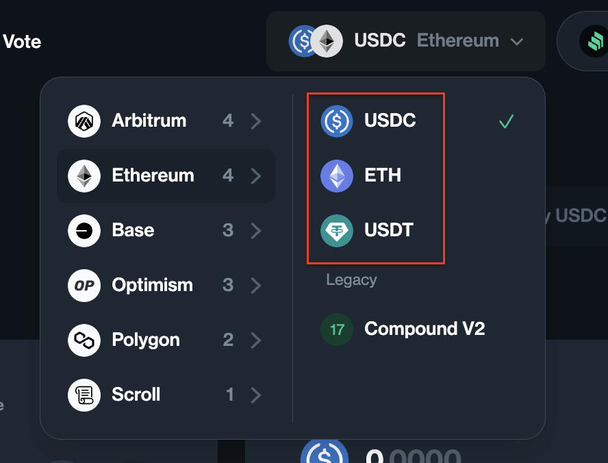

You can check this directly in the [application](https://app.compound.finance/markets). The asset that can be borrowed is called the **base asset**. The surrounding infrastructure is still referred to as the **market**.

_Important!_ Compound has introduced the codename "**Comet**" for the smart contracts of its third version.

## Differences from Compound v2

Below, we will analyze the main conceptual differences between the third and second versions.

**Isolated Market.** Within a single market, only one asset can be borrowed, and this loan will be isolated.

This is arguably one of the most significant differences. It means that collateral deposited for borrowing USDC according to market rules will not serve as collateral for borrowing another asset, such as in the ETH market.

**Collateral is separated from liquidity.** An asset provided as collateral for borrowing cannot be borrowed by another user. In other words, "flies separate, cutlets separate." Only the base asset supplied by the liquidity provider (the lender) is used for borrowing. Collateral in such a market does not contribute to the protocol’s liquidity and does not participate in loans.

**Minimum borrow amount and collateral cap.** These parameters are called `baseBorrowMin` and `supplyCap`. They are configured by the protocol at the time of deployment.

The first parameter, `baseBorrowMin`, prevents borrowing small amounts, where the overhead costs of liquidation would exceed the collateral.

The second parameter, `supplyCap`, limits the maximum total collateral amount for a specific asset that can exist on the protocol. This is a custom setting for each asset.

**BorrowRate and SupplyRate are no longer dependent on each other.** The supply rate directly depends on the utilization rate and no longer takes the borrow rate into account. The borrow rate follows its own interest rate curve.

## Architecture and Smart Contracts

This section is based on the protocol’s smart contracts from the [official repository](https://github.com/compound-finance/comet).

All the smart contracts in the repository can be divided into four groups:
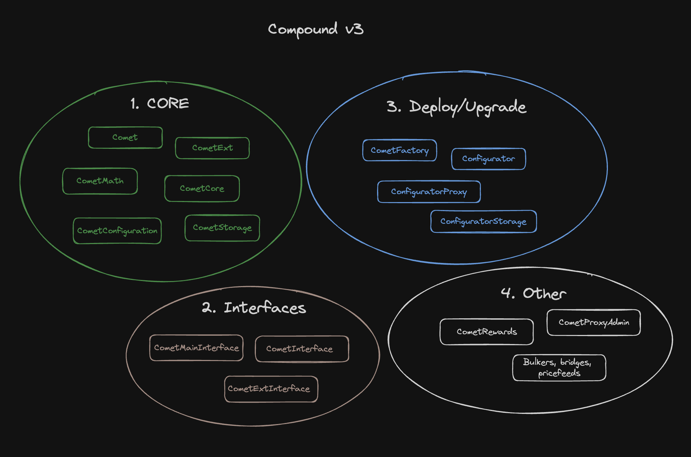

1. The first group consists of core contracts that implement the basic business logic.
2. The second group includes interfaces that are implemented on the core contracts from the first group.
3. The third group comprises contracts that handle deployment, configuration, and logic upgrades.
4. The fourth group includes all other smart contracts, from liquidation examples to reward contracts.

In a way, the protocol's architecture has become simpler, thanks to the isolation of each market from one another. This facilitated the implementation of just one core smart contract, [Comet.sol](https://github.com/compound-finance/comet/blob/main/contracts/Comet.sol), in the core group. This contract is wrapped under a proxy to allow for upgrades. As a result, only one smart contract is needed as the entry point for user interaction with a market. Let’s start our analysis from this entry point. On the diagram, it is marked with a red circle.

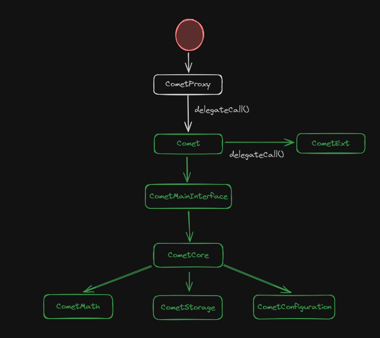

Thus, a typical call to the smart contracts looks like this:
1. The proxy delegates the call to the [Comet.sol](https://github.com/compound-finance/comet/blob/main/contracts/Comet.sol) contract.
2. If necessary, the call will be proxied to [CometExt.sol](https://github.com/compound-finance/comet/blob/main/contracts/CometExt.sol). Some less critical functionality has been moved there to avoid exceeding the maximum allowed smart contract size (24 KB).
3. If there is no need, the call will be executed within `Comet.sol`, whose functionality is distributed across a number of smart contracts: [CometMainInterface](https://github.com/compound-finance/comet/blob/main/contracts/CometMainInterface.sol), [ComentCore](https://github.com/compound-finance/comet/blob/main/contracts/CometCore.sol), [ComentMath.sol](https://github.com/compound-finance/comet/blob/main/contracts/CometMath.sol), [CometStorage](https://github.com/compound-finance/comet/blob/main/contracts/CometStorage.sol), [CometConfiguration](https://github.com/compound-finance/comet/blob/main/contracts/CometConfiguration.sol).

Let’s briefly define the responsibilities of each smart contract in the core group:
1. **Comet.sol**. The main contract with business logic, implementing borrowing, liquidity provision, and liquidations.
2. **CometExt.sol**. An additional contract introduced because the main contract could not fit all the business logic. This contract handles basic functions related to ERC-20 functionality: name, symbol, approve, and a few others. It is implemented using "[The Fallback Extension Pattern](https://www.rareskills.io/post/fallback-extension-pattern)."
3. **CometCore.sol**. A small contract that describes the logic for accruing interest on loans and liquidity provision.
4. **CometStorage.sol**. A contract for storing state variables. State variables are no longer declared in any other contract.
5. **CometMath.sol**. A utility contract that implements simple mathematical functions. It includes safeguards against overflows.
6. **CometConfiguration.sol**. Contains functionality for configuring `Comet.sol`.

### Updating Smart Contracts

The purpose of an update is to change the implementation contract address for the `Comet.sol` proxy. The proxy needs to start referencing the new implementation version.

Note that the smart contract [Comet.sol](https://github.com/compound-finance/comet/blob/main/contracts/Comet.sol#L17) has a lot of immutable variables.

```solidity
contract Comet is CometMainInterface {
    /// @notice The admin of the protocol
    address public override immutable governor;

    /// @notice The account which may trigger pauses
    address public override immutable pauseGuardian;

    /// @notice The address of the base token contract
    address public override immutable baseToken;

    ...
}
```

These variables are quite diverse. They include the address of the `governor`, `supplyKink`, `decimals`, and so on. All these variables are configurations for `Comet.sol` and are set in the constructor at the time of the smart contract deployment. This means that the settings are part of the smart contract's code, and to update them, the entire implementation contract for the proxy contract must be updated. In the classic approach, a `setter()` function is created on the contract, which can update any configuration. For example:

```solidity
contract Comet {
  function setGovernor(address governor) external onlyOwner {
    _governor = governor;
    ...
  }
}
```

In Compound v3, this is not the case, and updating the `governor` address requires a full implementation change for the proxy. The process looks as follows:

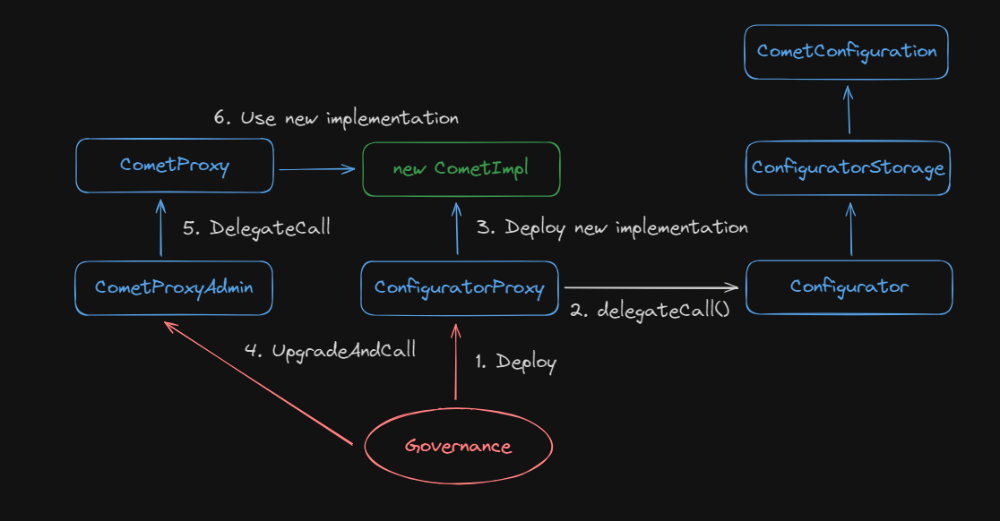

**Steps 1 and 2.** A positive voting result initiates the deployment process through a call to the [ConfiguratorProxy.sol](https://github.com/compound-finance/comet/blob/main/contracts/ConfiguratorProxy.sol) smart contract. The proxy delegates the call to its implementation and invokes the [deploy()](https://github.com/compound-finance/comet/blob/main/contracts/Configurator.sol#L333) function on the `Configurator.sol` contract.

**Step 3.** Not without the involvement of [the factory] (https://github.com/compound-finance/comet/blob/main/contracts/CometFactory.sol#L8) a new implementation of the `Comet` contract will be created. In the diagram, the new implementation is highlighted in green.

**Steps 4, 5, 6.** After that, all that remains is to update the smart contract [CometProxyAdmin.sol](https://github.com/compound-finance/comet/blob/main/contracts/CometProxyAdmin.sol#L16) to call the function
[upgradeAndCall()](https://github.com/OpenZeppelin/openzeppelin-contracts/blob/4764ea50750d8bda9096e833706beba86918b163/contracts/proxy/transparent/ProxyAdmin.sol#L38) and replace the implementation address in `CometProxy` with the new one.

_Important!_ You can explore for yourself which settings of the `Comet` smart contract are being changed in the [Governance](https://compound.finance/governance/proposals) section.

## Principal Value and Present Value

To move forward and analyze the code, jumping back and forth through it, you first need to understand how Compound stores data for borrowers and liquidity providers.

The variable responsible for accruing profits for providers is [baseSupplyIndex](https://github.com/compound-finance/comet/blob/main/contracts/CometStorage.sol#L50). It can be interpreted as accruing a certain amount of tokens over a certain period of time. Each time an operation occurs (borrow, deposit, etc.), this variable increases according to the elapsed time and the interest rate for that period.

The only place where the **baseSupplyIndex** variable is modified is the function [accruedInterestIndices()](https://github.com/compound-finance/comet/blob/main/contracts/Comet.sol#L403).

```solidity
function accruedInterestIndices(uint timeElapsed) internal view returns (uint64, uint64) {
    uint64 baseSupplyIndex_ = baseSupplyIndex;
    uint64 baseBorrowIndex_ = baseBorrowIndex;
    if (timeElapsed > 0) {
        uint utilization = getUtilization();
        uint supplyRate = getSupplyRate(utilization);
        uint borrowRate = getBorrowRate(utilization);
        // We are interested in this place now.
        baseSupplyIndex_ += safe64(mulFactor(baseSupplyIndex_, supplyRate * timeElapsed));
        baseBorrowIndex_ += safe64(mulFactor(baseBorrowIndex_, borrowRate * timeElapsed));
    }
    return (baseSupplyIndex_, baseBorrowIndex_);
}
```

Now, knowing what `baseSupplyIndex` is, we are ready to look at the structure responsible for storing information about the user's base asset balance and their interest. This structure is called [UserBasic](https://github.com/compound-finance/comet/blob/main/contracts/CometStorage.sol#L29).

```solidity
struct UserBasic {
    int104 principal; // Information about the amount of the base asset in the user's balance
    uint64 baseTrackingIndex; // Used for calculating accumulated rewards in the COMP token
    uint64 baseTrackingAccrued; // Used for accumulating rewards in the COMP token
    uint16 assetsIn; // A set of bits, each representing an asset supplied by the user as collateral.
    uint8 _reserved;// Currently not in use
}
```

However, the **principal** field is not as simple as it may seem. In the case of a deposit, this field will be divided by **baseSupplyIndex**.

For example:
> The baseSupplyIndex is 5. A deposit of 500 USDC is made. **principal** will equal 100.

If the asset is withdrawn at the same moment, the principal will be multiplied by the baseSupplyIndex, and we will get the same 500 USDC. Over time, the baseSupplyIndex increases, thereby increasing the amount the user can withdraw. This is how interest accrual works.

_Important!_ The initial deposit amount is called **"present value"** (500), while the "present value" divided by the baseSupplyIndex is called **"principal value"** (100).

The transition of numbers from present to principal and back is handled by two functions: [presentValue()](https://github.com/compound-finance/comet/blob/main/contracts/CometCore.sol#L79C14-L79C26) и [principalValue()](https://github.com/compound-finance/comet/blob/main/contracts/CometCore.sol#L104).

The situation with calculations for borrowing completely mirrors that of liquidity provision. The only difference is that the "principal value" becomes negative, and **baseBorrowIndex** is used instead of baseSupplyIndex for calculations.

## Supply

A user's first interaction with any lending protocol involves supplying an asset. In Compound v3, an asset is supplied for three purposes: as liquidity, as collateral, or for loan repayment.

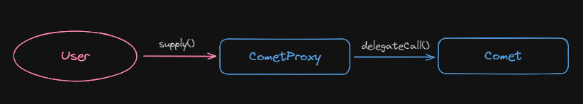

There are three different ways to supply an asset to the protocol:
- **supply()**. Used to supply an asset directly on behalf of the liquidity provider.
- **supplyTo()**. Used to supply an asset on behalf of the caller to the `to` address.
- **supplyFrom()**. Used to supply an asset from the `from` account on behalf of an operator to whom the `from` address has delegated authority.

Under the hood, the process of supplying an asset looks as follows:
1. Regardless of what the user called ([supply()](https://github.com/compound-finance/comet/blob/main/contracts/Comet.sol#L835), [supplyTo()](https://github.com/compound-finance/comet/blob/main/contracts/Comet.sol#L845C14-L845C22), [supplyFrom()](https://github.com/compound-finance/comet/blob/main/contracts/Comet.sol#L856)) the call will go to an internal function [supplyInternal()](https://github.com/compound-finance/comet/blob/main/contracts/Comet.sol#L864).
    ```solidity
    // operator is always the msg.sender of the transaction
    function supplyInternal(address operator, address from, address dst, address asset, uint amount) internal nonReentrant {
      // Checks that supplying the asset is not paused
      if (isSupplyPaused()) revert Paused();

      // Checks that the call is from the `from` address or on behalf of someone to whom the `from` address has delegated authority
      if (!hasPermission(from, operator)) revert Unauthorized();

      // If the asset is the base asset, account for it as liquidity provision or loan repayment; otherwise, account for it as collateral for securing a loan
      if (asset == baseToken) {
          if (amount == type(uint256).max) {
              amount = borrowBalanceOf(dst);
          }
          return supplyBase(from, dst, amount);
      } else {
          return supplyCollateral(from, dst, asset, safe128(amount));
      }
    }
    ```
2. `supplyBase()` looks as follows:
    ```solidity
    function supplyBase(address from, address dst, uint256 amount) internal {
        // Transfer the base asset to the contract
        amount = doTransferIn(baseToken, from, amount);

        // Accrue interest
        accrueInternal();

        UserBasic memory dstUser = userBasic[dst];
        // Principal amount of the base asset for the user with the address dst
        int104 dstPrincipal = dstUser.principal;
        // Calculate the new balance of the base asset
        int256 dstBalance = presentValue(dstPrincipal) + signed256(amount);
        // Convert the balance to a new base asset amount
        int104 dstPrincipalNew = principalValue(dstBalance);

        // Calculate the amount that will go toward debt repayment and liquidity provision
        (uint104 repayAmount, uint104 supplyAmount) = repayAndSupplyAmount(dstPrincipal, dstPrincipalNew);

        // Update the total liquidity and total borrow amounts
        totalSupplyBase += supplyAmount;
        totalBorrowBase -= repayAmount;

        // Update the user's information about their base asset position on the contract
        updateBasePrincipal(dst, dstUser, dstPrincipalNew);

        emit Supply(from, dst, amount);

        if (supplyAmount > 0) {
            emit Transfer(address(0), dst, presentValueSupply(baseSupplyIndex, supplyAmount));
        }
    }
    ```
3. `supplyCollateral()` looks as follows:
    ```solidity
    function supplyCollateral(address from, address dst, address asset, uint128 amount) internal {
        // Transfer the collateral asset to the contract
        amount = safe128(doTransferIn(asset, from, amount));

        AssetInfo memory assetInfo = getAssetInfoByAddress(asset);
        TotalsCollateral memory totals = totalsCollateral[asset];
        totals.totalSupplyAsset += amount;
        // Limit on the maximum amount of collateral asset that can be supplied to the contract
        if (totals.totalSupplyAsset > assetInfo.supplyCap) revert SupplyCapExceeded();

        uint128 dstCollateral = userCollateral[dst][asset].balance;
        uint128 dstCollateralNew = dstCollateral + amount;

        // Update the total collateral amount and the user's supplied amount on the contract
        totalsCollateral[asset] = totals;
        userCollateral[dst][asset].balance = dstCollateralNew;

        // Sets a flag (bit) indicating that this asset is being used as collateral by the user
        updateAssetsIn(dst, assetInfo, dstCollateral, dstCollateralNew);

        emit SupplyCollateral(from, dst, asset, amount);
    }
    ```

   The diagram can visually reinforce the process of calling to supply an asset in your mind.

    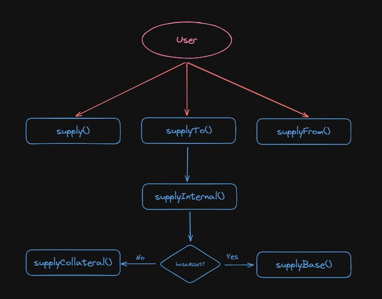

## Withdraw

Withdrawing assets from the protocol works in a similar way, analogous to `supply()`.


To withdraw an asset from the protocol, users can use one of three functions:
- **withdraw()**. Used to withdraw an asset directly on behalf of the caller.
- **withdrawTo()**. Used to withdraw an asset on behalf of the caller to the `to` address.
- **withdrawFrom()**. Used to withdraw an asset from the `from` address on behalf of an operator to whom the `from` address has delegated authority.

Under the hood, the process of withdrawing an asset looks as follows:

1. Regardless of what the user called ([withdraw()](https://github.com/compound-finance/comet/blob/main/contracts/Comet.sol#L1057), [withdrawTo()](https://github.com/compound-finance/comet/blob/main/contracts/Comet.sol#L1067), [withdrawFrom()](https://github.com/compound-finance/comet/blob/main/contracts/Comet.sol#L1078)) the call will go to an internal function [ withdrawInternal()](https://github.com/compound-finance/comet/blob/main/contracts/Comet.sol#L1086).

    ```solidity
    function withdrawInternal(address operator, address src, address to, address asset, uint amount) internal nonReentrant {
        // Checks that asset withdrawal is not paused
        if (isWithdrawPaused()) revert Paused();

        // Checks that the call is from the `src` address or on behalf of someone to whom the `src` address has delegated authority
        if (!hasPermission(src, operator)) revert Unauthorized();

        // If the asset is the base asset, account for it as a liquidity withdrawal; otherwise, account for it as collateral for securing a loan.
        if (asset == baseToken) {
            if (amount == type(uint256).max) {
                amount = balanceOf(src);
            }
            return withdrawBase(src, to, amount);
        } else {
            return withdrawCollateral(src, to, asset, safe128(amount));
        }
    }
    ```
2. If the asset is the base asset, it is necessary to ensure that the balance is positive, which means we provided liquidity; if it is negative, it means we borrowed.
    ```solidity
    function withdrawBase(address src, address to, uint256 amount) internal {
        // Accrue interest
        accrueInternal();

        // Read information for address src, from which we are withdrawing the asset
        UserBasic memory srcUser = userBasic[src];
        int104 srcPrincipal = srcUser.principal;
        int256 srcBalance = presentValue(srcPrincipal) - signed256(amount);
        int104 srcPrincipalNew = principalValue(srcBalance);

        // Calculate the amounts for withdrawal and the amount that will remain in the loan
        (uint104 withdrawAmount, uint104 borrowAmount) = withdrawAndBorrowAmount(srcPrincipal, srcPrincipalNew);

        // Update the total supply amount after withdrawal and adjust the total borrowed amount
        totalSupplyBase -= withdrawAmount;
        totalBorrowBase += borrowAmount;

        // Update the user's position for the base asset on the contract
        updateBasePrincipal(src, srcUser, srcPrincipalNew);

        if (srcBalance < 0) {
            if (uint256(-srcBalance) < baseBorrowMin) revert BorrowTooSmall();
            if (!isBorrowCollateralized(src)) revert NotCollateralized();
        }

        // Transfer the base asset to the specified address
        doTransferOut(baseToken, to, amount);

        emit Withdraw(src, to, amount);

        if (withdrawAmount > 0) {
            emit Transfer(src, address(0), presentValueSupply(baseSupplyIndex, withdrawAmount));
        }
    }
    ```
3. // If withdrawing a collateral asset, the call goes to `withdrawCollateral()`
    ```solidity
    function withdrawCollateral(address src, address to, address asset, uint128 amount) internal {
        uint128 srcCollateral = userCollateral[src][asset].balance;
        uint128 srcCollateralNew = srcCollateral - amount;

        // Updating the total collateral token amount on the contract and the user's balance
        totalsCollateral[asset].totalSupplyAsset -= amount;
        userCollateral[src][asset].balance = srcCollateralNew;

        AssetInfo memory assetInfo = getAssetInfoByAddress(asset);
        updateAssetsIn(src, assetInfo, srcCollateral, srcCollateralNew);

        // Prevents withdrawing assets that are not collateral
        if (!isBorrowCollateralized(src)) revert NotCollateralized();

        // Transfer assets to the user
        doTransferOut(asset, to, amount);

        emit WithdrawCollateral(src, to, asset, amount);
    }
    ```

## Borrow

A collateral loan is one of the most important mechanics of any lending protocol. This is why we’re here. You can only borrow one underlying asset within a single market on the smart contract `Comet.sol`.

Before borrowing, one condition must be met – you need to deposit a sufficient amount of collateral to ensure the loan is fully and "slightly over" collateralized. For this, the `supply()` function is called first. We’ve already discussed this function above.

The actual loan is managed by the asset withdrawal function `withdraw()`. We have already gone over the calling order of this function earlier. Since you can only borrow the underlying asset, let’s dive a little deeper into the `withdrawBase()` function. We will highlight only the sections of code that are of interest to us.

```solidity
function withdrawBase(address src, address to, uint256 amount) internal {
    ...

    UserBasic memory srcUser = userBasic[src];
    int104 srcPrincipal = srcUser.principal;
    int256 srcBalance = presentValue(srcPrincipal) - signed256(amount);
    // Calculate the new amount of the underlying asset after withdrawal
    int104 srcPrincipalNew = principalValue(srcBalance);

    // Here we will decide how much the user is simply withdrawing and how much they are borrowing
    (uint104 withdrawAmount, uint104 borrowAmount) = withdrawAndBorrowAmount(srcPrincipal, srcPrincipalNew);

    ...
}
```

// We are interested in the function `withdrawAndBorrowAmount()`, which determines the loan amount. Let's take a look inside.

```solidity
// oldPrincipal - the old amount of the underlying asset
// newPrincipal - the new amount of the underlying asset
// Returns (Amount to withdraw from the contract, Amount to borrow of the underlying asset)
function withdrawAndBorrowAmount(int104 oldPrincipal, int104 newPrincipal) internal pure returns (uint104, uint104) {
    // If the new amount is greater than the old one, it means we neither withdrew assets nor borrowed. Something went wrong, and this shouldn't happen in our case.
    if (newPrincipal > oldPrincipal) return (0, 0);

    // If the new amount is greater than or equal to zero, it means we are withdrawing the asset.
    if (newPrincipal >= 0) {
        return (uint104(oldPrincipal - newPrincipal), 0);
    // If the old amount is less than or equal to zero, it means we have already borrowed the asset, and we didn’t meet the first condition because the new amount is also less than zero. This means we continue to borrow assets.
    } else if (oldPrincipal <= 0) {
        return (0, uint104(oldPrincipal - newPrincipal));
    // If we don't meet any of the conditions above, we simply return the values that were passed to us.
    } else {
        return (uint104(oldPrincipal), uint104(-newPrincipal));
    }
}
```

So, the user will borrow the amount of assets they specify when calling `withdraw()`, but if they had a deposit of the underlying asset, the debt will be recorded after subtracting the deposit. More precisely, they will receive the specified amount, but they will no longer have liquidity in the underlying asset.

## Repay

Repaying the loan works similarly to the `withdraw()` function through the call to the `supply()` function. We also saw the [supplyBase()](https://github.com/compound-finance/comet/blob/main/contracts/Comet.sol#L872) function there.

Practice is one of the best ways to reinforce the material, so I suggest figuring out on your own how the loan repayment works.

## Liquidation

Liquidation in Compound v3 is straightforward because all loans are made within a single market and technically within a single smart contract, `Comet.sol`. You still need to interact with the proxy smart contract. However, here another smart contract comes into play. This is the oracle contract, which is responsible for calculating the value of collateral assets.

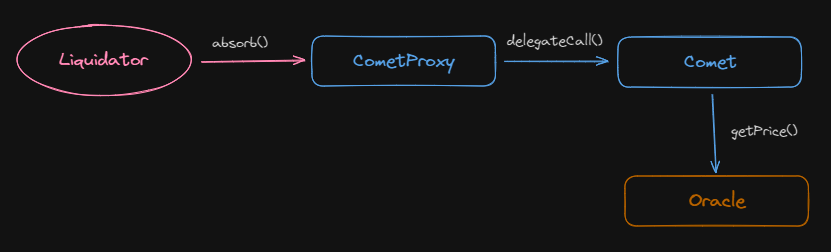

For the liquidation process, you only need to work with two functions:
- **isLiquidatable()**: This checks all collateral tokens provided by the user, sums the value of the entire collateral, and for each asset, it fetches the price from the oracle.
- **absorb()**: This function directly liquidates the borrower’s position.

The function [isLiquidatable()](https://github.com/compound-finance/comet/blob/main/contracts/Comet.sol#L566) sums up the collateral provided by the user in USD for each asset, multiplying it by the **liquidateCollateralFactor**, which indicates the portion of the collateral that can be liquidated.

```solidity
function isLiquidatable(address account) override public view returns (bool) {
    int104 principal = userBasic[account].principal;

    // If the balance of the underlying asset is positive, it means the user does not have a loan and cannot be liquidated immediately.
    if (principal >= 0) {
        return false;
    }

    uint16 assetsIn = userBasic[account].assetsIn;
    // Recalculate the amount of the underlying asset in USD. If there is a loan, the value will be negative.
    int liquidity = signedMulPrice(
        presentValue(principal),
        getPrice(baseTokenPriceFeed),
        uint64(baseScale)
    );

    // Loop through all allowed assets
    for (uint8 i = 0; i < numAssets; ) {
        if (isInAsset(assetsIn, i)) {
            // If there is enough liquidity from multiple assets, there is no need to check all assets
            // Such a user is no longer subject to liquidation
            if (liquidity >= 0) {
                return false;
            }

            AssetInfo memory asset = getAssetInfo(i);
            // The user's collateral amount for the asset in USD
            uint newAmount = mulPrice(
                userCollateral[account][asset.asset].balance,
                getPrice(asset.priceFeed),
                asset.scale
            );
            // Apply the liquidation factor to the asset and sum the resulting value with the liquidity from other assets
            liquidity += signed256(mulFactor(
                newAmount,
                asset.liquidateCollateralFactor
            ));
        }
        unchecked { i++; }
    }

    return liquidity < 0;
}
```

The function `absorb(address absorber, address[] calldata accounts)` takes two parameters:

- **absorber**: The address that will receive the points for the liquidation.
- **accounts**: A list of users whose positions are subject to liquidation.

The order of function calls for liquidation will be as follows:
1. The `absorb()` function is called.
    ```solidity
    function absorb(address absorber, address[] calldata accounts) override external {
        // Check that the liquidation process is not paused
        if (isAbsorbPaused()) revert Paused();

        uint startGas = gasleft();

        // Interest is accrued
        accrueInternal();

        // Liquidation is carried out for each address in the list of users
        for (uint i = 0; i < accounts.length; ) {
            absorbInternal(absorber, accounts[i]);
            unchecked { i++; }
        }
        uint gasUsed = startGas - gasleft();

        // Liquidation points are awarded based on the number of users and the gas spent for the liquidation
        LiquidatorPoints memory points = liquidatorPoints[absorber];
        points.numAbsorbs++;
        points.numAbsorbed += safe64(accounts.length);
        points.approxSpend += safe128(gasUsed * block.basefee);
        liquidatorPoints[absorber] = points;
    }
    ```
2. // The call proceeds to the internal function `absorbInternal()`.
    ```solidity
    function absorbInternal(address absorber, address account) internal {
        // Check if the account is eligible for liquidation
        if (!isLiquidatable(account)) revert NotLiquidatable();

        // Fetch the user's loan information
        UserBasic memory accountUser = userBasic[account];
        int104 oldPrincipal = accountUser.principal;
        int256 oldBalance = presentValue(oldPrincipal);
        uint16 assetsIn = accountUser.assetsIn;

        // Fetch the price of the underlying asset
        uint256 basePrice = getPrice(baseTokenPriceFeed);

        // Essentially, deltaValue is the amount in USD that will be liquidated
        uint256 deltaValue = 0;
        for (uint8 i = 0; i < numAssets; ) {
            if (isInAsset(assetsIn, i)) {
                AssetInfo memory assetInfo = getAssetInfo(i);
                address asset = assetInfo.asset;
                uint128 seizeAmount = userCollateral[account][asset].balance;
                userCollateral[account][asset].balance = 0;
                totalsCollateral[asset].totalSupplyAsset -= seizeAmount;

                uint256 value = mulPrice(seizeAmount, getPrice(assetInfo.priceFeed), assetInfo.scale);
                // Apply the liquidation factor to the collateral amount for the asset
                deltaValue += mulFactor(value, assetInfo.liquidationFactor);

                emit AbsorbCollateral(absorber, account, asset, seizeAmount, value);
            }
            unchecked { i++; }
        }

        // Calculate the amount of the underlying asset that will be liquidated
        uint256 deltaBalance = divPrice(deltaValue, basePrice, uint64(baseScale));
        // oldBalance is negative, as it shows the amount in the loan
        // Therefore, adding deltaBalance will liquidate the position by this amount
        int256 newBalance = oldBalance + signed256(deltaBalance);
        if (newBalance < 0) {
            newBalance = 0;
        }

        // Record the remaining amount of the underlying asset in the user's loan
        int104 newPrincipal = principalValue(newBalance);
        updateBasePrincipal(account, accountUser, newPrincipal);

        // Reset the collateral information for the assets that were pledged by the user
        userBasic[account].assetsIn = 0;

        (uint104 repayAmount, uint104 supplyAmount) = repayAndSupplyAmount(oldPrincipal, newPrincipal);

        // Set the totals for loans and liquidity
        totalSupplyBase += supplyAmount;
        totalBorrowBase -= repayAmount;

        uint256 basePaidOut = unsigned256(newBalance - oldBalance);
        uint256 valueOfBasePaidOut = mulPrice(basePaidOut, basePrice, uint64(baseScale));
        emit AbsorbDebt(absorber, account, basePaidOut, valueOfBasePaidOut);

        if (newPrincipal > 0) {
            emit Transfer(address(0), account, presentValueSupply(baseSupplyIndex, unsigned104(newPrincipal)));
        }
    }
    ```

If even one address from the list of users for liquidation is not actually subject to liquidation, the entire transaction will be reverted.

An important feature here is that there is no partial liquidation. A user is either fully liquidated or not liquidated at all. Anything remaining from the liquidation will turn into provided liquidity. So, the liquidated user will become a liquidity provider.

Even more interesting is that the liquidator **did not receive** anything directly except for bonuses. We didn’t see any `transfer()` functions throughout the entire call to the `absorb()` function.

**So what is the incentive for the liquidator to engage in this activity?** The answer is simple: the protocol allows the liquidator to buy the remaining collateral assets from liquidated users at a discount. To do this, the liquidator must use the function [buyCollateral()](https://github.com/compound-finance/comet/blob/main/contracts/Comet.sol#L1247).

```solidity
function buyCollateral(address asset, uint minAmount, uint baseAmount, address recipient) override external nonReentrant {
    if (isBuyPaused()) revert Paused();

    // Protocol reserves, accumulated when the protocol takes a protocol fee
    int reserves = getReserves();
    // The protocol prevents the collateral from being purchased if the reserves exceed the target threshold
    if (reserves >= 0 && uint(reserves) >= targetReserves) revert NotForSale();

    // Deducts the underlying asset from the buyer
    baseAmount = doTransferIn(baseToken, msg.sender, baseAmount);

    // Calculates the amount of the asset the buyer will receive
    uint collateralAmount = quoteCollateral(asset, baseAmount);
    if (collateralAmount < minAmount) revert TooMuchSlippage();
    if (collateralAmount > getCollateralReserves(asset)) revert InsufficientReserves();

    // Sends the purchased asset to the buyer
    doTransferOut(asset, recipient, safe128(collateralAmount));

    emit BuyCollateral(msg.sender, asset, baseAmount, collateralAmount);
}
```

// The discount will be applied inside the function [quoteCollateral()](https://github.com/compound-finance/comet/blob/main/contracts/Comet.sol#L1274).

To summarize the liquidation process, in the end, the liquidator needs to implement a bot that will call both `absorb()` and `buyCollateral()` in a single transaction.

Compound v3 provides a basic implementation of a liquidation [bot] (https://github.com/compound-finance/comet/tree/main/contracts/liquidator).

## Interest Rates

The protocol accrues two types of interest:

- **For the loan.** The borrower pays interest to the protocol for using the loan.
- **For providing liquidity.** The protocol pays a fee to liquidity providers.

Interest is recalculated over time. The application interface displays annual percentage rates (APR).

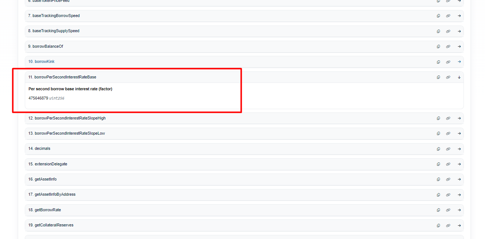

For example, if we get `borrowPerSecondInterestRateBase()` from Etherscan, we might receive the value `475646879`. How would this look on the client?

According to Compound, there are `31536000` seconds in a year. So, for the year, we calculate:

475646879 * 31536000 = 1.5e+16. The precision for this parameter is 1e18. Therefore, converting this to a percentage, we get 1.5% for the `borrowInterestRate`.

An important difference from the second version is that the `borrowRate` is calculated using a separate curve formula and is not linked to the `supplyRate`. As a result, instead of a single parameter, `kink`, the protocol has two separate parameters [supplyKink](https://github.com/compound-finance/comet/blob/main/contracts/Comet.sol#L33C41-L33C42) и [borrowKink](https://github.com/compound-finance/comet/blob/main/contracts/Comet.sol#L49).

To find out how much interest the protocol offers to liquidity providers, you need to call the function [getSupplyRate()](https://github.com/compound-finance/comet/blob/main/contracts/Comet.sol#L449) on the `Comet.sol` contract

```solidity
// The current utilization can be obtained by calling the function getUtilization()
function getSupplyRate(uint utilization) override public view returns (uint64) {
    if (utilization <= supplyKink) {
        // interestRateBase + interestRateSlopeLow * utilization
        return safe64(supplyPerSecondInterestRateBase + mulFactor(supplyPerSecondInterestRateSlopeLow, utilization));
    } else {
        // interestRateBase + interestRateSlopeLow * kink + interestRateSlopeHigh * (utilization - kink)
        return safe64(supplyPerSecondInterestRateBase + mulFactor(supplyPerSecondInterestRateSlopeLow, supplyKink) + mulFactor(supplyPerSecondInterestRateSlopeHigh, (utilization - supplyKink)));
    }
}
```

The function [getUtilization()](https://github.com/compound-finance/comet/blob/main/contracts/Comet.sol#L478) is simple. It shows the ratio of the total amount of assets in loans to the total amount of assets provided as liquidity.

```solidity
function getUtilization() override public view returns (uint) {
    uint totalSupply_ = presentValueSupply(baseSupplyIndex, totalSupplyBase);
    uint totalBorrow_ = presentValueBorrow(baseBorrowIndex, totalBorrowBase);
    if (totalSupply_ == 0) {
        return 0;
    } else {
        return totalBorrow_ * FACTOR_SCALE / totalSupply_;
    }
}
```

To find out how much interest the protocol offers for borrowing, you need to call the function [getBorrowRate()](https://github.com/compound-finance/comet/blob/main/contracts/Comet.sol#L464) on the `Comet.sol` contract.

```solidity
// The current utilization can be obtained by calling the function getUtilization()
function getBorrowRate(uint utilization) override public view returns (uint64) {
    if (utilization <= borrowKink) {
        // interestRateBase + interestRateSlopeLow * utilization
        return safe64(borrowPerSecondInterestRateBase + mulFactor(borrowPerSecondInterestRateSlopeLow, utilization));
    } else {
        // interestRateBase + interestRateSlopeLow * kink + interestRateSlopeHigh * (utilization - kink)
        return safe64(borrowPerSecondInterestRateBase + mulFactor(borrowPerSecondInterestRateSlopeLow, borrowKink) + mulFactor(borrowPerSecondInterestRateSlopeHigh, (utilization - borrowKink)));
    }
}
```

## Rewards

Participants in the protocol are rewarded with COMP tokens in the Compound ecosystem.

The `Comet.sol` contract only tracks the user's participation in the protocol (liquidity provision and borrowing) but does not manage the reward distribution process.

To distribute rewards, the protocol has implemented the smart contract [CometRewards.sol](https://github.com/compound-finance/comet/blob/main/contracts/CometRewards.sol), which reads the `Comet.sol` contract and issues COMP tokens.

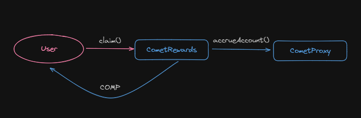

The rate at which rewards are distributed is declared as parameters within the `CometRewards.sol` contract, which are set through [DAO](https://github.com/compound-finance/comet/blob/main/contracts/CometRewards.sol#L67).

To check if there are any accumulated rewards, you can call the function [getRewardOwed()](https://github.com/compound-finance/comet/blob/main/contracts/CometRewards.sol#L146). This is not a view function, as it interacts with the `Comet.sol` contract.

To distribute rewards to a user, two functions are provided:
- [claim()](https://github.com/compound-finance/comet/blob/main/contracts/CometRewards.sol#L165)
- [claimTo()](https://github.com/compound-finance/comet/blob/main/contracts/CometRewards.sol#L175C14-L175C21)

Overall, the internal structure is exactly the same as in the `Comet.sol` contract.

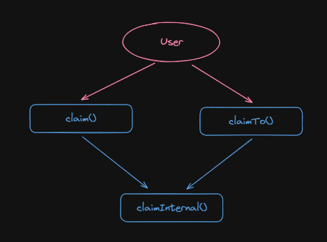

The user can call the function [claim()](https://github.com/compound-finance/comet/blob/main/contracts/CometRewards.sol#L165C14-L165C19) or [claimTo()](https://github.com/compound-finance/comet/blob/main/contracts/CometRewards.sol#L175) of their choice, after which the call proceeds to the internal function [claimInternal()](https://github.com/compound-finance/comet/blob/main/contracts/CometRewards.sol#L184).

```solidity
function claimInternal(address comet, address src, address to, bool shouldAccrue) internal {
    // Check for compatibility with comet
    RewardConfig memory config = rewardConfig[comet];
    if (config.token == address(0)) revert NotSupported(comet);

    // Get the value that shows how much reward the user has earned
    if (shouldAccrue) {
        CometInterface(comet).accrueAccount(src);
    }

    uint claimed = rewardsClaimed[comet][src];
    uint accrued = getRewardAccrued(comet, src, config);

    if (accrued > claimed) {
        uint owed = accrued - claimed;
        // Record the amount of reward that has already been paid out
        rewardsClaimed[comet][src] = accrued;

        // Transfer the reward to the user
        doTransferOut(config.token, to, owed);

        emit RewardClaimed(src, to, config.token, owed);
    }
}
```

The `CometRewards.sol` contract does not mint COMP tokens when the `claim()` function is called, so it is the responsibility of the DAO to maintain a sufficient balance of COMP tokens in the smart contract.

_Important!_ The supply of COMP tokens is limited, so it will not always be possible to distribute rewards for participation in the protocol.

## cToken

We have explored liquidity provision and borrowing, but we haven't yet encountered the familiar and user-friendly **cToken**, which we know well from the second version of Compound. However, this term can still be found in the Compound documentation. We see cUSDC among the deployed contract addresses.

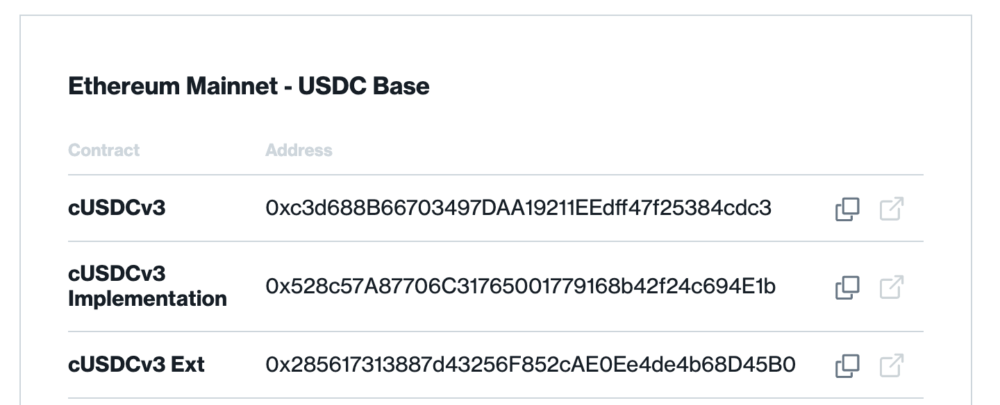

In reality, the cToken hasn’t disappeared; it has been disguised as the `Comet.sol` smart contract. If you take a closer look at this contract, you can find a number of functions typical of an ERC-20 token that handle transfers:
- [transfer()](https://github.com/compound-finance/comet/blob/main/contracts/Comet.sol#L933)
- [transferFrom()](https://github.com/compound-finance/comet/blob/main/contracts/Comet.sol#L945)
- [transferAsset()](https://github.com/compound-finance/comet/blob/main/contracts/Comet.sol#L956C14-L956C27)
- [transferAssetFrom()](https://github.com/compound-finance/comet/blob/main/contracts/Comet.sol#L967)

In addition, all other functions required by the ERC-20 specification are implemented in the extension contract of `Comet.sol` called [CometExt.sol](https://github.com/compound-finance/comet/blob/main/contracts/CometExt.sol). These functions include: `name()`, `approve()`, `symbol()`, and so on. Since the call to the extension is made through a delegated call (`delegateCall`), Etherscan cannot display these functions for the `Comet.sol` smart contract.

## Conclusion

In my subjective opinion, Compound v3 is the simplest and most elegant codebase among the lending protocols I’ve seen. I enjoy reading and analyzing the code of Compound v3. I appreciate that all the logic is practically contained in a single main smart contract with a clear inheritance chain and unified entry points for interaction. The unique process of updating and initially setting up smart contracts provides a special kind of aesthetic pleasure! I believe that Compound v3 can serve as a benchmark among similar lending protocols.

However, it is important not to forget the real user benefits, such as market isolation and asset segregation across different `Comet.sol` contracts. This significantly reduces risks and potential losses in the event of a protocol hack. Even though the smart contracts have undergone multiple audits, no one is immune to vulnerabilities. Furthermore, such an architecture allows for effective scalability and protocol management.

## Links

1. Github [Repository](https://github.com/compound-finance/comet)
2.Official [documentation](https://docs.compound.finance/)
3. [Interest Rate Model](https://www.rareskills.io/post/aave-interest-rate-model)
4. [Book](https://www.rareskills.io/compound-v3-book) Compound V3 by RareSkills served as the foundation for writing this article. If you need to dive deeper, make sure to check it out.
