# CoW DAO

**Author:** [Aleksei Kutsenko](https://github.com/bimkon144) 👨‍💻

[CoW DAO](https://cow.fi/) is a full suite of products governed by its own DAO.

The main product is the Cow Protocol.

At the core of the Cow Protocol is the concept of CoW ([Coincidence of Wants](https://docs.cow.fi/cow-protocol/concepts/how-it-works/coincidence-of-wants)), which allows traders to swap tokens directly, without unnecessary intermediaries.

Imagine you want to sell ETH for USDC, and someone else wants to sell USDC for ETH. On a typical DEX, each of you would pay a fee for your trade to external liquidity providers — and of course, pay for gas. But on CoW Swap, you can simply trade directly with each other, paying only a portion of the sold tokens to the transaction executor! It’s like finding the perfect trading partner at the market.

## List of Products

**CoW Protocol**
The core of the entire system – a fully open-source trading protocol that uses batch auctions and the Coincidence of Wants.

**CoW Swap**
[Web interface](https://github.com/cowprotocol/cowswap) through which users interact with the trading protocol.

**CoW AMM**
A specialized liquidity pool that solves the main problem of traditional AMMs – LVR (Loss-versus-Rebalancing) caused by arbitrageurs.

LVR is when liquidity providers in traditional AMMs lose money because arbitrageurs take the profit by buying tokens at the old (more favorable) price in the pool before it adjusts to the market rate.
Essentially, it’s a problem of the time lag between price changes on centralized exchanges and price updates in the decentralized liquidity pool.

**MEV Blocker**
An RPC endpoint designed to protect transactions from MEV, such as frontrunning and sandwiching. Additionally, users can earn profit from backrunning their transactions.

**Cow Explorer**
A [block explorer](https://explorer.cow.fi/) similar to Etherscan, but built to visualize orders placed and executed within the protocol.

**Widget**

With the help of the [widget](https://widget.cow.fi/), you can create a custom interface to interact with the protocol within your own application.

## How It All Started: From Gnosis Protocol to CoW DAO

The history of CoW DAO began in the [Gnosis](https://www.gnosis.io/) ecosystem — one of the oldest projects on Ethereum.

**Gnosis Protocol v1 (2020)**

The first version was an ambitious attempt to create a decentralized exchange with an order book directly on-chain. The idea was solid, but in practice, several issues arose:

- Each order was expensive due to high gas fees
- Storing orders on-chain limited liquidity

Thus, a new approach was needed to improve the situation and solve the problems mentioned above.

**Gnosis Protocol v2 (2021)**

In 2021, the team made a major upgrade:

- Removed the order book from the blockchain (moved it off-chain)
- Switched to a system of intentions and solvers. In short, users now simply sign their trading intentions off-chain, and solvers compete for the right to execute them on-chain in the most profitable way.

**CoW Protocol (2022)**

The success of Gnosis Protocol v2 led to an important decision — the team proposed that Gnosis DAO spin off the protocol into an independent project. In January 2022, [proposal GIP-13](https://forum.gnosis.io/t/gip-13-phase-2-cowdao-and-cow-token/2735) was submitted to create an independent CoW Protocol with its own token and DAO.

The separation process was mutually beneficial:
- **Gnosis DAO received 10% of COW tokens** as compensation for previous investments in the team and protocol development
- **The development team received 15% of the tokens** to attract new developers
- **Users received an airdrop** for using the protocol

In spring 2022, the COW token was launched and [CoW DAO](https://docs.cow.fi/governance) was created — a fully independent decentralized organization. CoW Swap became the flagship interface of the new protocol.

Governance is carried out through the [CIP](https://docs.cow.fi/governance/process) system (CoW Improvement Proposals) — every major decision is discussed by the community and put to a vote.

The [COW](https://coinmarketcap.com/currencies/cow-protocol/) token serves three key functions in the ecosystem:

- Participation in protocol governance through DAO voting
- Staking by solvers as a guarantee of honest behavior
- Incentivizing active ecosystem participants: rewarding solvers for successful batch auction execution and funding developers through CowDAO grants to improve the protocol

Thus, the CoW protocol has its own governance system, its own token, and its own team under a new brand.

## CoW Protocol

The CoW protocol is a trading protocol that uses an intent-based model, solvers, and auctions to find optimal prices and protect transactions from MEV.

### System Architecture

Before diving into the details, let’s take a look at the overall architecture of the CoW Protocol:

```mermaid
graph TB
    subgraph "User Layer"
        U1[👤 User 1]
        U2[👤 User 2]
        UN[👤 User N]
        UI[🖥️ CoW Swap UI]
        Widget[📱 CoW Widget]
    end

    subgraph "Protocol Layer"
        OrderBook[📋 Order Book<br/>off-chain storage]
        Autopilot[🤖 Autopilot<br/>orchestrator]

        subgraph "Solvers"
            S1[🔧 Solver 1<br/>Driver + Engine]
            S2[🔧 Solver 2<br/>Driver + Engine]
            SN[🔧 Solver N<br/>Driver + Engine]
        end
    end

    subgraph "Blockchain Layer"
        Settlement[⚖️ Settlement<br/>Contract]
        VaultRelayer[🏦 Vault Relayer<br/>Contract]

        subgraph "External Liquidity"
            Uniswap[🦄 Uniswap]
            Curve[🌀 Curve]
            Balancer[⚖️ Balancer]
            Other[🔗 Other DEXs]
        end
    end

    subgraph "Infrastructure"
        MEVBlocker[🛡️ MEV Blocker<br/>RPC]
        Explorer[🔍 CoW Explorer]
    end

    %% User connections
    U1 --> UI
    U2 --> Widget
    UN --> UI
    UI --> OrderBook
    Widget --> OrderBook

    %% Order processing
    OrderBook --> Autopilot
    Autopilot --> S1
    Autopilot --> S2
    Autopilot --> SN

    %% Solver connections
    S1 --> Settlement
    S2 --> Settlement
    SN --> Settlement

    %% Settlement connections
    Settlement --> VaultRelayer
    Settlement --> Uniswap
    Settlement --> Curve
    Settlement --> Balancer
    Settlement --> Other

    %% MEV Protection
    UI --> MEVBlocker
    MEVBlocker --> OrderBook

    %% Monitoring
    Settlement --> Explorer
```



**Key Components:**

- **User Layer** – interfaces for users to interact with the protocol
- **Protocol Layer** – the core of the system coordinating auctions and solver competition
- **Blockchain Layer** – smart contracts for executing trades and accessing external liquidity
- **Infrastructure** – auxiliary services for MEV protection and monitoring

CoW Protocol is built on an **intent-based** model — a trading approach where users simply express their intentions ("I want to swap 1000 USDC for ETH"), and specialized participants (solvers) compete for the right to find the best execution method.

This is fundamentally different from traditional DEXs, where the user chooses the route themselves and bears all the risks of MEV and slippage.

For more details on the concept of intent-based protocols, check out the dedicated article in our wiki.

### How Does CoW Protocol Implement the Intention Model?

CoW Protocol implements the intent-based model through a system of solvers who compete for the right to execute user intention batches (`batch`) in the most efficient way by participating in `batch auctions`.

**Key elements in CoW Protocol:**

- **Intentions** – off-chain orders signed via EIP-712, ERC-1271, eth-sign, or by having a Presign on the contract.

- **Solvers** – protocol participants who compete for the right to process a batch of `intentions`. The competition involves finding the most profitable swap route for all user orders.

```mermaid
sequenceDiagram
    participant User1 as 👤 User 1
    participant User2 as 👤 User 2
    participant UserN as 👤 User N
    participant CoWProtocol as 🔄 CoW Protocol<br/>(Order Book)
    participant Solver1 as 🤖 Solver 1
    participant Solver2 as 🤖 Solver 2
    participant SolverN as 🤖 Solver N
    participant Settlement as ⚖️ Settlement<br/>Contract
    participant DEX as 🏪 External DEX<br/>(Uniswap, etc.)

    Note over User1, DEX: 1. Intent Expression (off-chain)
    User1->>CoWProtocol: Signs intent:<br/>"Sell 1000 USDC for ETH"
    User2->>CoWProtocol: Signs intent:<br/>"Sell 0.5 ETH for DAI"
    UserN->>CoWProtocol: Signs intent:<br/>"Sell DAI for USDC"

    Note over User1, DEX: 2. Batch Formation & Solver Auction
    CoWProtocol->>CoWProtocol: Forms batch of intentions

    CoWProtocol->>Solver1: Sends batch
    CoWProtocol->>Solver2: Sends batch
    CoWProtocol->>SolverN: Sends batch

    Note over Solver1, SolverN: Solvers analyze batch and find optimal solutions

    Solver1->>Solver1: Finds CoW opportunities<br/>+ external liquidity
    Solver2->>Solver2: Finds ring trades<br/>+ better DEX routes
    SolverN->>SolverN: Finds direct swaps<br/>+ high gas costs

    Solver1->>CoWProtocol: Solution A:<br/>Price: 0.46 ETH, Gas: 0.003 ETH
    Solver2->>CoWProtocol: Solution B:<br/>Price: 0.47 ETH, Gas: 0.002 ETH ⭐
    SolverN->>CoWProtocol: Solution N:<br/>Price: 0.45 ETH, Gas: 0.005 ETH

    CoWProtocol->>CoWProtocol: Selects best solution<br/>(Solver 2 wins auction)

    Note over User1, DEX: 3. Execution (on-chain)
    CoWProtocol->>Solver2: Authorizes execution

    Solver2->>Settlement: Calls settle() with:<br/>- CoW matches (User1↔User2)<br/>- External trades for UserN

    alt CoW Opportunities Found
        Settlement->>Settlement: Direct P2P exchange<br/>User1 USDC → User2<br/>User2 ETH → User1
    else External Liquidity Needed
        Settlement->>DEX: Execute trade for UserN<br/>DAI → USDC via Uniswap
        DEX->>Settlement: Returns USDC
    end

    Settlement->>User1: Receives ETH at best price
    Settlement->>User2: Receives DAI at best price
    Settlement->>UserN: Receives USDC at best price
```



Thus, the workflow can be described as follows:

1. Creation of `intent` by users.
2. Formation of a `batch auction` from multiple `intentions`.
3. Execution of the `batch auction` among solvers, where the solver first looks for matches among the intentions themselves — CoW ([Coincidence of Wants](https://docs.cow.fi/cow-protocol/concepts/how-it-works/coincidence-of-wants)), and then uses external or private liquidity sources, Uniswap pools, Balancer, etc.
4. Execution of the `batch auction` on-chain.

Let’s look at the existing types of Coincidence of Wants, which are one of the core features of the protocol:

**Simple Swap (Direct CoW)**

The simplest case – when two traders want to trade directly with each other.


*Full execution of two orders:*
- Alice wants to sell 1000 DAI for ETH
- Bob wants to sell 0.5 ETH for DAI
- The system finds this match, and you trade directly with each other

This allows you to avoid paying fees to liquidity providers (LPs) on exchanges.

*Partial execution of orders:*
- Alice wants to sell DAI for 0.5 ETH
- Bob only wants to sell 0.3 ETH for 600 DAI
- The system finds this match, and you trade partially: 600 DAI for 0.3 ETH

The remaining part of your order (400 DAI) will be filled through external liquidity sources such as Uniswap or 1inch.

**Batching**

Often, a batch auction contains intentions from different users who want to perform the same type of swap:

- Alice wants to receive ETH and is willing to give USDC
- Bob also wants to receive ETH and is willing to give USDC
- Instead of executing two separate trades via Uniswap, the solver bundles these intentions into a single transaction


Such batching optimizes gas costs, since interactions with AMM smart contracts happen fewer times.

**Intermediate Swap**

An intermediate CoW occurs when the batch contains "intermediate" trades that can be linked together:

- Alice wants to receive USDC and is giving COW tokens
- Bob wants to receive COW and is giving USDT tokens

These trades don’t match directly, but through an intermediate token like ETH, the solver creates a swap chain:

1. Alice gives COW → receives ETH → receives USDC
2. Bob gives USDT → receives ETH → receives COW


In this scheme, a shared segment is formed: COW → ETH (from Alice) and ETH → COW (for Bob).

The solver links this segment directly between the users.

**Important:** ETH is used only as a settlement currency — in reality, Alice’s COW tokens go directly to Bob, bypassing intermediate swaps.

*Advantages of this approach:*
1. **Lower fees** – duplicate swap steps are eliminated
2. **Reduced slippage** – direct swaps don’t impact market price
3. **Gas savings** – fewer interactions with smart contracts
4. **Less impact on liquidity pools** – more stable prices for all users

**Ring Trade (Ring CoW)**

A ring CoW connects three or more users whose intentions form a closed loop of swaps:

- Alice wants to receive ETH by giving DAI
- Bob wants to receive USDC by giving ETH
- Niko wants to receive COW by giving USDC
- Vlad wants to receive DAI by giving COW

Instead of separate trades, the solver creates a ring structure where each participant receives their desired token directly:

1. DAI от Alice → Vlad
2. COW от Vlad → Niko
3. USDC от Niko → Bob
4. ETH от Bob → Alice


Each token is moved only once, directly between participants, without using external liquidity pools.

*Advantages of ring trading:*
- Maximum savings on fees and gas
- Zero slippage
- Fair pricing for all participants
- Efficient use of liquidity without market impact

It’s worth mentioning that CoW Protocol has multiple sources of liquidity.

Use of external liquidity sources:
- AMMs (Uniswap, Sushiswap, Balancer, CoW AMM, Curve, and others)
- Aggregators (1inch, Paraswap, Matcha, and others)
- Private market makers (Liquidity available directly to solvers, or even from CEXs)

These types of P2P swaps, combined with the use of external liquidity, enable significant optimization in terms of fees and gas costs.

### Batch Auctions

The heart of CoW Protocol is **batch auctions** — a system that groups multiple user intentions into batches and runs an auction among solvers for the right to execute them.

**Key Components:**
- **Order Book** – an off-chain service for placing and managing orders
- **Autopilot** – the auction coordinator that forms batches and selects the best solutions
- **Solvers** – independent participants competing for the right to execute order batches

**How it works:**
1. Users place their intentions in the Order Book
2. Autopilot forms a batch and starts the auction (every ~15 seconds)
3. Solvers analyze the batch and submit proposed solutions with a quality score
4. Autopilot selects the best solution and authorizes its execution
5. The winner executes all orders in a single transaction

**Advantages of batch auctions:**
- **Fair pricing** – all orders in the batch are executed at unified clearing prices
- **MEV protection** – private processing of intentions before execution
- **Gas optimization** – multiple orders executed in a single transaction
- **Solver competition** – ensures the best outcomes for users

A detailed description of the architecture and mechanisms can be found in our wiki article.

### Solver Profit

**Solver Reward System**

The protocol subsidizes solver competition on all supported networks by paying out rewards weekly (every Tuesday) in COW tokens for the previous 7-day period.

**Requirements to participate:**
- Collateral: $500,000 USD in cUSDC + 1,500,000 COW tokens
- Technical infrastructure to run a solver engine + driver

**Two types of rewards:**

1. **Solver Competition Rewards** (main competition)
   - Uses the [Vickrey–Clarke–Groves](https://en.wikipedia.org/wiki/Vickrey%E2%80%93Clarke%E2%80%93Groves_auction) mechanism
   - The reward is calculated using the formula: `payment = cap(totalScore - referenceScore - missingScore)`

     - `totalScore` – the sum of scores for all winning solutions in the auction
     - `referenceScore` – the total score of a hypothetical auction as if this solver didn’t exist (all their bids removed from consideration)
     - `missingScore` – the sum of scores for this solver’s winning solutions that failed during on-chain execution (reverted)
     - `cap(x)` – a function that limits payouts depending on the network

     *Note: if the calculation results in a negative value, the solver must pay the protocol. Yes, that happens.*

2. **Price Estimation Competition** (quote competition)
   - Rewards for providing quotes — this is the result of the solvers’ work shown to users in the web interface when they want to see how much they’ll get for their tokens.
   - Payouts are made for each executed order for which the solver provided a quote:
     - **Ethereum**: min{0.0006 ETH, 6 COW}
     - **Arbitrum**: min{0.0002 ETH, 6 COW}
     - **Gnosis Chain**: min{0.15 xDAI, 6 COW}
     - **Base**: min{0.0002 ETH, 6 COW}

Thus, the solver covers gas costs out of pocket and is held accountable through penalties for failed on-chain transactions.
Overall, this is why such a significant collateral is required from solvers.

### Protocol and Partner Fees

Key concepts:

> **Surplus** – the difference between the actual execution price and the minimum execution price of a **limit order**. This is how much better you received compared to your minimum requirement. For example, if you set a minimum price of 0.45 ETH for 1000 USDC, and the order is executed at 0.47 ETH, the Surplus is 0.02 ETH.

> **Quote improvement** – the difference between the actual execution price and the initially estimated quote price for a **market order**, if the difference is positive. This is how much better you received compared to what was shown in the interface. For example, if the interface shows you’ll get 0.45 ETH for 1000 USDC, but you actually receive 0.46 ETH, the quote improvement is 0.01 ETH.

*Key difference*: `Surplus` compares against your own conditions when placing a limit order, while `Quote improvement` compares against the system’s estimated price for a market order.

**Current Protocol Fee Structure**

The system uses the following types of fees, which go to the protocol treasury:

* **Surplus Fee for Limit Orders**
  * *Definition*: 50% of the `Surplus`, but no more than 1% of the total order volume
  * *Applies to*: only limit orders that cannot be executed at the time of creation (i.e., when the buy/sell price doesn't match the current market price)
  * *Calculation formula*: surplus × 0.5 OR volume × 0.01 (whichever is smaller)

* **Quote Improvement Fee for Market Orders**
  * *Definition*: 50% of the positive quote improvement for market orders, but no more than 1% of the total order volume
  * *Applies to*: all market orders where the user receives a better price than the quoted estimate
  * *Calculation formula*: quote_improvement × 0.5 OR volume × 0.01 (whichever is smaller)

* **Volume-Based Fee on Gnosis Chain**
  * *Definition*: 0.1% (10 basis points) of the total order volume
  * *Applies to*: all market orders, limit orders, and TWAP orders on Gnosis Chain, except for token pairs with correlated prices (e.g., USDC/USDT)
  * *Calculation formula*: volume × 0.001

**Example of fee calculation for a limit order**:
You create a limit order to sell 1000 USDC for ETH, with a minimum rate of 0.5 ETH per 1000 USDC.
A solver finds a way to execute the order but will spend 4 USDC on gas.

* Gas cost: the solver spent the equivalent of 4 USDC to execute the order (deducted from the sold token)
* You give: 1000 USDC
* Deducted: 4 USDC (gas compensation)
* Solver swaps the remaining 996 USDC and receives 0.5279 ETH
* Actual surplus: 0.5279 ETH - 0.5 ETH (minimum price) = 0.0279 ETH
* Surplus fee (50%): 0.0279 ETH × 0.5 = 0.01395 ETH
* Max fee (1% of volume): 0.5279 ETH × 0.01 = 0.00528 ETH
* Final fee: min(0.01395 ETH, 0.00528 ETH) = 0.00528 ETH (the lower value is applied)
* You receive: 0.5279 ETH - 0.00528 ETH (fee) = 0.52262 ETH

>**Important:** The surplus fee is deducted in the token you receive, while the gas compensation is deducted from the token you sell. The solver pays gas out of pocket but recovers it by deducting from the amount the user gives. The more intentions in the batch, the lower the gas fee for each user.

**Partner Fees**

CoW Protocol allows integrators (widgets, dApps, wallets) to charge an additional fee of up to 1% of the trade volume. This fee is deducted first from the `buyAmount` during a purchase, before calculating surplus and protocol fees.

Detailed calculation examples and fee mechanics are described in the [official documentation](https://docs.cow.fi/governance/fees/partner-fee).

### Order Structure

In CoW Protocol, user `intents` are formed into a signed order with the following fields:

```solidity
struct Data {
    IERC20 sellToken;        // Token to sell
    IERC20 buyToken;         // Token to buy
    address receiver;        // Recipient of the bought tokens
    uint256 sellAmount;      // Amount of tokens to sell
    uint256 buyAmount;       // Minimum amount of tokens to buy
    uint32 validTo;          // Order expiration time (Unix timestamp)
    bytes32 appData;         // Metadata (partner fees, hooks)
    uint256 feeAmount;       // Execution fee (in sell tokens)
    bytes32 kind;            // Order type (sell/buy)
    bool partiallyFillable;  // Whether partial fills are allowed
    bytes32 sellTokenBalance;// Source of sell token balance
    bytes32 buyTokenBalance; // Destination of buy token balance
}
```

#### What is appData?

`appData` is a `bytes32` field in the order structure that contains an IPFS hash (which needs to be converted to a CID) of a JSON document with additional information. According to the [official CoW Protocol documentation](https://docs.cow.fi/cow-protocol/reference/core/intents/app-data), this field allows various metadata to be attached to an order:

**Main use cases:**
- **Partner integrations** – tracking the volume brought in by partners
- **Referral addresses** – for referral programs
- **CoW Hooks** – additional actions before/after the swap

**JSON Document Structure:**

The JSON file must follow a specific [JSON schema](https://docs.cow.fi/cow-protocol/reference/core/intents/app-data#schema).

**Required fields:**
- `version` – schema version (e.g., "1.3.0")
- `metadata` – object with additional data (hooks, referral addresses, etc.)

**Optional fields:**
- `appCode` – identifier of the application/UI
- `environment` – information about the source of the order

To make appData creation easier, the following tools are available:

- [CoW Explorer appData utility](https://explorer.cow.fi/appdata?tab=encode) – a web interface for creating and parsing appData
- [app-data SDK](https://docs.cow.fi/cow-protocol/reference/sdks/app-data) – a library for working with appData in code

> **Important:** When creating appData manually, make sure to follow the JSON schema and upload the file to IPFS before submitting the order.

### Order types

1. Market Order:
    - A standard order executed at the current market price
    - Used for quick execution at the best available rate
    - The protocol searches for the best price across all available liquidity sources

2. Limit Order:
    - Allows you to set a specific execution price
    - Executes only when the market price meets or exceeds the specified rate

3. TWAP Order (Time-Weighted Average Price):
    - Splits a large order into multiple smaller ones executed at regular time intervals
    - Helps minimize market impact and slippage on large trades
    - Well-suited for large investors and institutional traders

4. Programmatic Order:
   Designed for smart contracts that implement the [ERC-1271](https://eips.ethereum.org/EIPS/eip-1271) standard.

    **ERC-1271** is a standard that allows smart contracts to validate signatures on their behalf. Smart contracts cannot create signatures (they don’t have a private key), but they can verify whether a given signature is valid for the contract. ERC-1271 solves this through the `isValidSignature()` function, which allows the contract to define its own signature validation logic.

   Example implementation with an owner:
    ```solidity
    contract SimpleWallet {
        address public owner;
        bytes4 constant MAGIC_VALUE = 0x1626ba7e; // ERC-1271 magic value

        function isValidSignature(bytes32 hash, bytes memory signature)
            external view returns (bytes4) {

            // Recover the signer address from the signature
            address signer = recoverSigner(hash, signature);

            // Check that the signer is the owner of the contract
            if (signer == owner) {
                return MAGIC_VALUE; // // Signature is valid
            } else {
                return 0xffffffff; // // Signature is invalid
            }
        }
    }
    ```

    In this example, the contract considers the signature valid only if it was created by the owner. The process works as follows:
    1. The owner creates the signature off-chain using their private key
    2. CoW Protocol calls `isValidSignature()` on the contract
    3. The contract recovers the address from the signature and compares it with the owner
    4. If it matches – it returns the magic value (signature is valid)

     - Allows implementation of complex trading logic
     - Can be used for automated strategies and integrations

6. Milkman Order:
   - An order placement mechanism developed by [Yearn Finance](https://yearn.fi/) in collaboration with CoW Protocol
   - Allows orders to be executed based on oracle prices
   - Useful for scenarios with high price volatility (for example, automatically selling assets at the oracle price at the end of a DAO vote. If this were a regular limit order set at the beginning of the vote, changing market conditions could make it outdated by the time the vote ends)

### CoW Hooks

CoW Hooks are a feature of the CoW Protocol that allows users to attach any Ethereum actions to their order, using solvers to execute the entire sequence in a single transaction.

Developers and advanced traders can use code to express intentions that perform certain actions before the swap (pre-hooks) and after the swap (post-hooks).

Possible use cases for `pre-hooks`:

- Unstaking tokens from staking contracts
- Claiming airdrops before selling
- Approving tokens for use in a swap
- Converting tokens

Possible use cases for `post-hooks`:

- Bridging to L2 (Arbitrum, Optimism, Polygon)
- Staking tokens in yield protocols
- Adding liquidity to DEX pools
- Creating LP positions in Uniswap v3, Curve

#### Passing Hook Data via appData

The hook data structure looks like this:

- `target` – the address of the contract to call
- `value` – amount of ETH (in wei) to send along with the function call
- `callData` – ABI-encoded function call data
- `gasLimit` – gas limit for executing the hook

**Important notes:**
- Pre-hooks are executed **only on the first fill** of partially fillable orders
- Post-hooks are executed **on every fill** of the order
- Hooks are executed via the `HooksTrampoline` contract
- **Execution is not guaranteed** – the order can still be executed even if the hook fails. So if you set `gasLimit` incorrectly, the hook will simply be skipped. One trick to ensure 100% hook execution is to make the success of the order depend on the hook itself — for example, by issuing an `approve` for the tokens being traded.

#### Developing Hook dApps

CoW Protocol provides infrastructure for building custom Hook dApps — web applications that integrate with CoW Swap via an [iframe](https://developer.mozilla.org/en-US/docs/Web/HTML/Reference/Elements/iframe).

##### Development Tools

**[@cowprotocol/hook-dapp-lib](https://www.npmjs.com/package/@cowprotocol/hook-dapp-lib)** – the main JavaScript/TypeScript library for building Hook dApps, providing:
- An EIP-1193 provider for interacting with the user’s wallet
- `HookDappContext` with environment settings and current order parameters
- Callback functions to add or edit hooks

**[CoW Shed](https://github.com/cowprotocol/cow-shed)** – an advanced system for building complex hooks with support for sophisticated DeFi scenarios.

CoW Hooks greatly simplify complex DeFi operations by allowing regular users to perform simple actions like "swap and stake" in one click, developers to build advanced trading strategies, and protocols to integrate with CoW Swap to enhance the user experience (UX).

### Flash loans

Flash loans are the ability to borrow funds and repay them within a single transaction without collateral. If the loan + fee is not repaid before the transaction ends, the entire operation is reverted.

**How it works in CoW Swap:**

**1. Pre-hook: Take a flash loan**

```javascript
// In the pre-hook, specify a call to the flash loan provider
const preHook = {
  target: "0x...FlashLoanProvider",
  value: 0,
  callData: "0x...flashLoan(token, amount)", // // Request the loan
  gasLimit: "200000"
};
```

**2. Swap: Use the borrowed tokens**
- The flash loan provider sends the tokens to the Settlement contract
- CoW Swap performs the swap of the borrowed tokens into the desired ones
- The result of the swap remains in the Settlement contract

**3. Post-hook: Repay the loan + fee**
```javascript
// In the post-hook, repay the loan
const postHook = {
  target: "0x...FlashLoanProvider",
  value: 0,
  callData: "0x...repayFlashLoan(token, amount + fee)", // Repayment with fee
  gasLimit: "200000"
};
```

**4. Encoding in appData:**
```javascript
const appData = {
  metadata: {
    flashloan: {
      lender: "0x...FlashLoanProvider",
      token: "0x...TokenAddress",
      amount: "1000000000" // Loan amount
    },
    hooks: {
      pre: [preHook],
      post: [postHook]
    }
  }
};
```

**5. Creating the Order:**
To simplify creating orders with flash loans, use **[@cowprotocol/cow-sdk](https://www.npmjs.com/package/@cowprotocol/cow-sdk)** – it allows you to easily create orders, sign them, track status, and work with appData metadata.

**6. Setting the Pre-signature:**
After creating the order, you need to set the pre-signature by calling the `setPreSignature(orderUid, true)` function on the Settlement contract. This makes the order executable by solvers. Without this step, the order will remain inactive.

**Practical Example – Arbitrage Without Collateral:**
- You spot a price difference: 1 ETH = 3000 USDC on CoW Swap, 1 ETH = 3050 USDC on Uniswap
- **Pre-hook**: take a flash loan of 3000 USDC from a provider
- **Swap**: buy 1 ETH for 3000 USDC on CoW Swap
- **Post-hook**: sell 1 ETH for 3050 USDC on Uniswap, repay the 3000 USDC + fee
- **Profit**: ~50 USDC from the operation with no upfront capital

**Technical Implementation for Solvers:**
CoW Protocol solvers use the [flash-loan-router](https://github.com/cowprotocol/flash-loan-router) – a specialized smart contract that allows executing the `settle` function through a flash loan contract. The contract supports various providers (Aave, ERC-3156 compatible).

Flash loans are especially useful for arbitrage, debt refinancing, and complex DeFi strategies.

So basically, we program the appData, and then the solver will automatically call the flash loan through a special contract, which in turn will trigger `settle`.

## CoW AMM

This is a product that solvers use as an additional source of liquidity in their operations.

AMM (Automated Market Maker) is a type of decentralized exchange that uses a pricing formula instead of an order book. Trades are executed through liquidity pools, where users deposit assets and earn fees in return.

**The Problem with Traditional AMMs:**

The most basic AMMs are so-called CF-AMMs (Constant Function AMMs).
They use the formula x × y = k to calculate the price between two tokens in the pool.

When the amount of one token decreases – its price increases, and vice versa.
All trades happen along this curve and cannot go beyond its limits.

Accordingly, in such AMMs (for example, Uniswap), arbitrageurs exploit Liquidity Providers (LPs) through **LVR (Loss-versus-Rebalancing)** – they buy assets at outdated prices before the pool rebalances, profiting at the expense of liquidity providers.

**CoW AMM Solution:**

FM-AMM (Function-Maximizing AMM) is a new AMM model that solves the main problems of traditional CF-AMMs and eliminates LVR (Loss Versus Rebalancing).

Unlike Uniswap-style AMMs, where trades are executed sequentially,
FM-AMM batches all orders and executes them simultaneously at a single fair price — the clearing price.

This price is chosen so that the AMM transitions into a new state that maximizes the total value of the pool — instead of handing that value over to arbitrageurs.

Essentially, this means liquidity providers (LPs) don’t lose out — they receive a share of the profits, reflected in the increasing value of their LP tokens.

For more in-depth understanding, check out the detailed [math](https://arxiv.org/pdf/2307.02074) and [explanation](https://medium.com/taipei-ethereum-meetup/eli5-what-is-fm-amm-the-theory-behind-cow-amm-and-how-is-it-mev-resistant-53d1960324c0).

**Architecture:**

The [cow-amm](https://github.com/balancer/cow-amm/blob/main/src/contracts/BCoWPool.sol) pool smart contract is built on top of the [Balancer pool](https://github.com/balancer/cow-amm/blob/main/src/contracts/BPool.sol).

However, when deployed through the [factory](https://github.com/balancer/cow-amm/blob/main/src/contracts/BCoWFactory.sol), due to the contract inheriting from the Balancer pool, full MEV protection requires setting the fee to 99.9%. This fee prevents anyone from trading directly with the pool.

This is done to ensure that all trades go strictly through the `GPv2Settlement` contract via the `settle` function, which can only be called by trusted solvers.

The cow amm pool contract contains the main methods:

- `commit()` – commits the order parameters as a hash to the cow amm pool, indicating the planned trade.
- `isValidSignature()` (ERC-1271 function) – verifies the signature.
- `verify()` – checks if the trade is possible: it calculates the swap outcome based on the pool reserves and `swapFee = 0` using `calcOutGivenIn()`, and ensures that the amount of output tokens `tokenAmountOut` is at least equal to the requested `order.sellAmount`.

So, CoW AMM is a liquidity source with `swapFee = 0` for CoW Protocol solvers. It leverages its partnership with `Balancer` to access liquidity.

You can see the trading flow diagram below:

```mermaid
sequenceDiagram
    participant Users as 👥 Users
    participant OrderBook as 📚 OrderBook
    participant Solvers as 🔧 Solvers
    participant Winner as 🏆 Winner Solver
    participant CoWAMM as 🐄 CoW AMM Pool
    participant LP as 💰 LP

    Note over Users, LP: CoW AMM Trading Flow

    Users->>OrderBook: Submit trading intents<br/>"Sell ETH for USDC"

    OrderBook->>OrderBook: Create batch auction<br/>Group intents together
    OrderBook->>Solvers: Send batch to all solvers<br/>Find best execution

    Solvers->>CoWAMM: Check prices & liquidity<br/>Calculate optimal solution
    CoWAMM-->>Solvers: Return pricing info

    Solvers->>OrderBook: Submit solutions<br/>Best execution proposals
    OrderBook->>OrderBook: Select winning solution<br/>Best price for users

    OrderBook->>Winner: You won! Execute this solution

    Winner->>CoWAMM: commit(orderHash)
    Winner->>CoWAMM: verify(order)
    Winner->>CoWAMM: isValidSignature(hash, signature)
    Winner->>CoWAMM: Execute trades

    CoWAMM->>LP: Increase LP token value<br/>
    CoWAMM->>Winner: Provide liquidity at 0% fee

    Winner->>Users: Deliver tokens<br/>✅ Best execution achieved

    Note over Users, LP: Result: Users get best prices,<br/>LP earns from efficient execution
```



In addition to solvers using these pools in their solutions, there’s an extra rebalancing mechanism in case arbitrage opportunities are detected in a CoW AMM pool.

An off-chain infrastructure regularly monitors token prices via oracles (Chainlink, Uniswap pools, Balancer pools), and as soon as the price of a token in the CoW AMM pool deviates from other liquidity sources, the protocol itself creates an order to rebalance the pool. In other words, what used to be done by arbitrageurs is now handled by a solver via the order book they have access to.

An example of how this works can be seen in the diagram below:


## Smart Contracts

Cow Protocol has only 3 core contracts — meaning the protocol cannot function without them:

- **GPv2Settlement**
- **GPv2VaultRelayer**
- **GPv2AllowlistAuthentication**

There are also periphery contracts that are not strictly required but provide additional functionality:
- **Eth-flow** ([GitHub](https://github.com/cowprotocol/ethflowcontract)) – a contract that enables trading with native ETH. It acts as an intermediary contract that wraps ETH into WETH and creates an intent on behalf of the user.
- **HooksTrampoline** ([GitHub](https://github.com/cowprotocol/hooks-trampoline)) – a contract for executing CoW Hooks. It performs arbitrary external calls (pre-hooks and post-hooks) in the context of orders, enabling extra functionality before and after swaps.
- **ComposableCoW** ([GitHub](https://github.com/cowprotocol/composable-cow)) – a framework for creating programmable smart orders with conditional logic. Allows building autonomous trading strategies (e.g. TWAP orders, conditional limit orders, portfolio rebalancing).
- **CoWUidGenerator** – a helper contract to calculate the same EIP-712 signature hash for a given user order, as expected by the `GPv2SettlementContract`.
- **Flash loans** ([GitHub](https://github.com/cowprotocol/flash-loan-router)) – a specialized router for executing flash loans within CoW Protocol. Allows solvers to take flash loans from various providers (ERC-3156 compatible) for arbitrage and advanced DeFi strategies without collateral.

Let’s take a look at the core contracts only:

**GPv2Settlement** ([Github](https://github.com/cowprotocol/contracts/blob/main/src/contracts/GPv2Settlement.sol)) – The main contract that receives user intentions and actions from a solver and executes them in a transaction.

**Main functions of the contract:**

- **`settle()`** – the core function for executing a batch of orders (only callable by authorized solvers)
  - Validates user signatures and checks order expiration
  - Enforces limit prices and order fill status
  - Executes interactions with external liquidity via the `interactions` array
  - Transfers tokens through the `GPv2VaultRelayer` and sends results to users

- **`swap()`** – direct token swap via Balancer pools
- **`setPreSignature()`** – activates/deactivates an order on-chain
- **`invalidateOrder()`** – cancels an order on-chain

Why is this needed?

It’s actually very simple:

- `setPreSignature`: Required for smart contracts that do not implement the ERC-1271 interface. Since smart contracts don’t have a private key to sign an order, this method allows them to authorize orders on-chain. It requires an on-chain transaction and gas payment. It can be used by both EOAs and smart contract wallets.

- `invalidateOrder`: Marks an order as invalid, since off-chain cancellation may not be fast enough to prevent execution due to delays in the off-chain architecture.

Example use cases for `setPreSignature`:

1. EOA:

A trader may want to first submit an order off-chain, and later, once their trading strategy signals a profit opportunity, activate that order on-chain via a bot.

2. Smart account:

Imagine a DAO with a Gnosis Safe multisig wallet that needs to swap 100,000 USDT for ETH.

A DAO administrator creates an order via the CoW Protocol API (receiving the order ID in return) and submits it as a governance proposal. After the vote passes, a transaction is executed with `setPreSignature(orderId, true)`, which activates the order. This way, the order is considered signed and becomes eligible for inclusion in auction batches.

**GPv2VaultRelayer** ([Github](https://github.com/cowprotocol/contracts/blob/main/src/contracts/GPv2VaultRelayer.sol)) – A proxy contract for secure access to user funds and integration with Balancer Vaults. It provides three ways to access tokens: direct ERC-20 transfers from user wallets, external Balancer balances, and internal Balancer balances.

The `transferFromAccounts` function handles token transfers using one of the following methods:
directly from the wallet, from an external balance in the Balancer Vault, or from an internal balance in the Balancer Vault.

Let’s break down these methods:

- **Direct ERC-20 approvals**: Standard `approve` calls directly to the GPv2VaultRelayer address
- **External Balancer balances**: Uses the user’s existing ERC-20 approvals for the Balancer Vault
- **Internal Balancer balances**: Uses internal balances in the Balancer Vault for gas-efficient transfers

The first method is straightforward — just like with any DEX, you need to approve the token being spent. We’ll dive into the last two methods in more detail a bit later.

**GPv2AllowlistAuthentication** ([Github](https://github.com/cowprotocol/contracts/blob/main/src/contracts/GPv2AllowListAuthentication.sol)) – an authentication contract that checks whether a solver is authorized when calling the `settle` method on the **GPv2Settlement** contract.

It is governed by the CoW DAO, ensuring decentralized control.

Thus, the process of executing a batch of intentions looks like this:

**Intentions batch execution process**:
1. The solver calls the `settle()` function on `GPv2Settlement`, providing:
   - A list of tokens
   - Calculated uniform clearing prices for each token
   - An array of orders to execute
   - A set of interactions with external liquidity

2. `GPv2Settlement` performs the following checks:
   - `GPv2AllowlistAuthentication` confirms solver authorization
   - Each order is verified (expiration, signature, fill status)
   - Limit prices are enforced for every order

3. If all checks pass:
   - Pre-interactions (pre-hooks) are executed
   - `GPv2VaultRelayer` transfers tokens from users
   - Main interactions with external liquidity are executed
   - Users receive the purchased tokens
   - Post-interactions (post-hooks) are executed
   - Order fill statuses are updated

So, the solver is responsible for finding the optimal solution, while the smart contracts enforce strict order execution rules.

## Integrations with Other Protocols

It’s important to understand that CoW Protocol can also be used by other applications.

For example, in 2021, [Balancer](https://balancer.gitbook.io/balancer-v2/products/balancer-cow-protocol) integrated the protocol into its interface, creating the Balancer-CoW-Protocol (BCP).

**Integration with Balancer: Security Architecture**

CoW Protocol collaborates with [Balancer](https://balancer.fi/) to maximize user profit and provide additional security.

It’s important to note that the key element of this partnership is the **GPv2VaultRelayer** contract, which serves as a critical security component. Its main guarantee: **GPv2VaultRelayer can transfer ERC-20 tokens ONLY to the GPv2Settlement contract**.

This architectural decision protects user funds from potentially malicious solvers. If users granted approvals directly to the `GPv2Settlement` contract, a malicious solver could abuse the "interactions" mechanism to gain access to user funds. The `GPv2Settlement` contract explicitly forbids this with a check in the code: `require(interaction.target != address(vaultRelayer), "GPv2: forbidden interaction")`, which further guarantees that even a malicious solver cannot directly interact with the contract holding user approvals.

The "interactions" mechanism is a specific parameter of the `settle()` function in the `GPv2Settlement` contract. It allows solvers to pass arbitrary calls to external smart contracts. Technically, it’s a bytecode array (`bytes[] calldata interactions`) that the solver can fill with any external protocol calls.

These interactions are used to route funds through various DEXs (Uniswap, Curve, Balancer) or aggregators (1inch, Paraswap) to get the best prices.

It’s critically important to understand that:

1. Interactions are **not part** of the data signed by the user in their order
2. They are fully controlled by the solver at the time of transaction execution
3. They may contain arbitrary calls to any contracts on the blockchain

This is where the vulnerability would arise: If the user approved tokens directly to the `GPv2Settlement` contract and the solver was malicious, they could insert calls into the `interactions` array that transfer tokens anywhere. The architecture with `GPv2VaultRelayer` solves this problem by restricting the flow of funds:

1. Tokens can be transferred **only** to the `GPv2Settlement` contract
2. `GPv2Settlement` can use the tokens **only** within the current transaction
3. Even if `GPv2Settlement` were compromised, an attacker still couldn’t move funds outside the trusted contracts

Thus, the system preserves flexible routing while eliminating the risk of fund theft through malicious interactions.

**Example of Fund Flow:**

Let’s say a user wants to sell 100 USDC for at least 0.05 ETH:

1. **With VaultRelayer architecture (secure):**
   - The user gives `approve` for 1000 USDC to the VaultRelayer contract
   - VaultRelayer transfers only 100 USDC to the Settlement contract (exact amount specified in the order)
   - Settlement swaps 100 USDC for 0.053 ETH via DEX interactions
   - The user receives 0.053 ETH minus protocol fee
   - The remaining 900 USDC are untouched by Settlement and stay secure

2. **Without VaultRelayer (insecure):**
   - If the user had approved tokens directly to the Settlement contract
   - A malicious solver could avoid executing the order via a DEX and instead:
     - Add a call to `USDC.transferFrom(user, attacker, 100)` in the `interactions` array to steal the swap amount
     - Never send the promised ETH to the user
     - Also add `USDC.transferFrom(user, attacker, 900)` to steal the remaining balance
   - All of this is possible because the solver fully controls the contents of the `interactions` array

This example clearly shows why the VaultRelayer architecture is a critically important security component in CoW Protocol. VaultRelayer not only limits the amount available per order but also guarantees that even this amount can only be transferred to the Settlement contract, where strict order execution checks are enforced.

Now let’s move on to the benefits of integrating with Balancer.

**Benefits for Balancer:**
Balancer gains an additional trading interface without needing to develop its own. Its users get MEV protection, access to better prices, and gas-efficient trading — all without needing to interact with a new protocol. This increases trading volume in Balancer pools and, as a result, boosts fees for liquidity providers, all while keeping users within the Balancer ecosystem.

**Benefits for CoW Protocol:**
CoW Protocol gains privileged access to Balancer liquidity, gas optimization via internal Vault balances, and the ability to reuse approvals users have already granted to the Balancer Vault. This significantly lowers the entry barrier for millions of Balancer users and expands the protocol’s user base. Additionally, the user journey is simplified and security is improved, since users can manage all approvals through a unified Balancer interface.

It’s important to understand how balances work in Balancer:

> **External Balancer balances** – these are standard ERC-20 tokens held in users’ wallets. To use them, the user must `approve` the Balancer Vault contract to access the tokens. This is the typical token management method used in most DeFi protocols.

> **Internal Balancer balances** – this is an accounting system within the Balancer Vault contract that tracks how many tokens each user owns, without requiring additional on-chain ERC-20 transfers. The user must first "deposit" tokens into their internal balance in the Vault, after which they can be used with minimal gas costs.

**Access to user funds** is performed in three ways:

- **Direct ERC-20 approvals** – Standard `approve` calls made directly to the GPv2VaultRelayer address (explained earlier)
- **External Balancer balances** – Uses the user’s existing ERC-20 approvals for the Balancer Vault
- **Internal Balancer balances** – Uses internal balances in Balancer for gas-efficient transfers

**Using External Balancer Balances:**

Two independent levels of authorization are required:

1. **Protocol level**: `GPv2VaultRelayer` is authorized in Balancer as an official relayer through a Balancer DAO vote (this has already been implemented at the protocol level).


2. **User level**: To use this mechanism, the following is required:
   - The user must already have a standard ERC-20 `approve` set for the Balancer Vault contract
   - The user must additionally approve `GPv2VaultRelayer` as a trusted relayer by calling the `setRelayerApproval` function in the Balancer Vault


When executing an order using external Balancer balances, the process works as follows:
1. `GPv2Settlement` calls `GPv2VaultRelayer`
2. `GPv2VaultRelayer` requests the Balancer Vault to transfer tokens from the user
3. [Balancer Vault](https://github.com/balancer/balancer-v2-monorepo/blob/master/pkg/vault/contracts/Vault.sol) verifies:
   - That `GPv2VaultRelayer` is authorized at the protocol level
   - That the user has given the relayer explicit permission via `setRelayerApproval`
4. After these checks, Balancer Vault uses the existing ERC-20 approval to transfer the tokens

**Using Internal Balancer Balances:**

The third mechanism for accessing user funds:

1. **Requirements for use:**
   - The user must have internal token balances in the Balancer Vault
   - The user must approve `GPv2VaultRelayer` as a relayer, same as for external balances
   - The `sellTokenBalance` flag in the order must be set to `internal`


2. **Advantages:**
   - Significant gas savings when executing orders
   - Ability to receive trade results directly into internal balances by setting the `buyTokenBalance` flag to `internal`
   - Free conversion between internal balances and standard ERC-20 tokens at any time

This provides three key advantages:
- Reuse of existing ERC-20 approvals for the Balancer Vault (no need for new approvals specifically for CoW Protocol)
- Instead of approving each contract for every token, you only need to authorize `GPv2VaultRelayer` once via `setRelayerApproval`, and if you want, you can revoke it in a single transaction. This is more convenient, safer, and easier to control
- The approval for `GPv2VaultRelayer` can be revoked in a single transaction in the Balancer Vault, instead of revoking approvals separately for every ERC-20 token

So, even if the Settlement contract were compromised, the VaultRelayer would not allow arbitrary actions with user funds, thanks to the dual-authorization architecture and its limited functionality.

Simply put, the partnership between CoW Protocol and Balancer is like a friendship between two neighbors, where each benefits. Balancer doesn’t need to build its own trading system from scratch — it leverages CoW Protocol’s infrastructure, offering its users frontrunning protection and better prices. Meanwhile, CoW Protocol gains access to Balancer’s massive user base and liquidity.

The main feature of this integration is security. Think of the VaultRelayer as a reliable guard standing between your funds and the protocol. It double-checks every request and only transfers the tokens you actually want to trade. Even if the main contract were hacked, your remaining funds would be safe — because the guard won’t allow more tokens to be moved than required for that specific trade.

For users, it’s also convenient: instead of granting dozens of separate approvals for each token, you give one global approval via Balancer, and you can revoke it anytime with a single transaction. It’s like having one master key instead of a bundle of dozens of keys.

## Limitations and Challenges of the Protocol

CoW Protocol is a strong protocol, but it does have its limitations:

**Execution delays**
Unlike regular DEXs, where trades are instant, in CoW Swap the process takes from a few seconds up to 30 seconds. This is due to batch formation, finding the optimal solution, and running the solver auction.

**Dependence on external infrastructure**
The system relies on off-chain components — solvers and API services. If any of these fail, it becomes impossible to create new orders.

**High entry barrier for solvers**
In theory, anyone can become a solver, but in practice it requires a large collateral and significant technical expertise. This creates a centralization risk — the system may end up with only a few large solvers.

**Uneven efficiency**
The protocol is most effective with high activity and liquidity. For rare tokens or during periods of low trading activity, the benefits of the system may be less noticeable.

## Security Incidents

In February 2023, there was a small incident — a hacker stole around $166K from the settlement contract. But there are two pieces of good news:

1. **User funds were completely safe.** CoW Swap is designed so that your assets are never stored in the protocol — all trades are executed instantly and directly.

2. **The stolen funds were recovered** thanks to the collateral posted by solvers.

What happened? In short:
- One of the solvers deployed a contract with a vulnerability
- A hacker found this vulnerability and exploited it to steal DAI tokens
- The team reacted quickly and patched the issue

How the problem was handled:
- The vulnerable contract was disabled
- The solver updated their code
- The solver was temporarily removed from the system and penalized

The system worked exactly as intended — solver collateral acted as insurance and covered the losses.

If you’re interested in the details, you can read the [official incident post-mortem](https://cow.fi/learn/cow-swap-solver-exploit-post-mortem).

## Conclusion

CoW Protocol represents a huge step forward in decentralized trading, combining the best of centralized and decentralized exchanges through intentions, batch auctions, and solvers.

The protocol provides **economic efficiency** through direct user-to-user swaps (CoW), which save fees and gas. Solver competition with liquidity aggregation guarantees the best prices. Users can pay gas fees in their sell tokens without needing to hold the blockchain’s native token in their wallet, and failed transactions do not cost gas.

**Security** is achieved through batch auctions and unified prices, protecting against frontrunning and sandwich attacks. In addition, many solvers use MEV Blocker, which further enhances protection while also generating surplus for users.

**Ease of use** includes a flexible architecture supporting different order types, the ability to place multiple orders at once, and intent-based trading — you just specify the desired outcome, and the solver finds the optimal path.

CoW Protocol not only solves the problems of existing DEXs but also creates an entirely new trading paradigm, where users get the best prices, full MEV protection, and maximum usability.

CoW Protocol proves that decentralized trading can be both efficient and secure. The system creates proper incentives — the more benefit for the user, the more benefit for the solver. And CoW Swap, in turn, makes this complex technology accessible through a simple and intuitive interface.

## Links

- [CoW Protocol (official website)](https://cow.fi/)
- [CoW Swap (protocol interface)](https://cow.fi/cow-swap)
- [CoW Protocol Documentation](https://docs.cow.fi/)
- [GitHub: CoW Protocol](https://github.com/cowprotocol)
- [CoW DAO Forum](https://forum.cow.fi/)
- [Discord](https://discord.gg/cowprotocol)
- [Smart-contracts repo](https://github.com/cowprotocol/contracts/tree/main)
- [CoW AMM](https://medium.com/taipei-ethereum-meetup/understanding-cow-amm-a-zero-swap-fee-mev-mitigating-liquidity-source-for-cowswap-25f8cb1e8b78)
- [FM-AMM formula](https://medium.com/taipei-ethereum-meetup/eli5-what-is-fm-amm-the-theory-behind-cow-amm-and-how-is-it-mev-resistant-53d1960324c0)
