# CoW Protocol: Batch Auctions

**Author:** [Aleksey Kutsenko](https://github.com/bimkon144) 👨‍💻

Batch auctions are a key mechanism of the CoW Protocol that ensures fair pricing and protection against MEV. Unlike traditional DEXs, where each trade is processed individually, the CoW Protocol groups multiple user intentions into batches and runs an auction among solvers for the right to execute them.

## How Batch Auctions Work

Let's break down the high-level architecture of a `batch auction`.

```mermaid
sequenceDiagram
    participant User as 👤<br/>User
    participant OrderBook as 📚<br/>Order book
    participant Autopilot as 🤖<br/>Autopilot
    participant Solver as ⚡<br/>Solver

    User->>OrderBook: POST /order
    Autopilot->>OrderBook: Request solvable orders
    OrderBook-->>Autopilot: Response solvable orders
    Autopilot->>Autopilot: Create auction
    Autopilot->>Solver: /solve
    Solver-->>Autopilot: Score
    Autopilot->>Solver: /settle
    Solver->>Solver: Settles transaction on-chain
    Solver-->>Autopilot: Transaction hash
    Solver->>User: User receives tokens
```



These three main components are required for the auction to function.

**Order book** is an off-chain component with a database, whose API is used to place, cancel, and fetch active orders. It enables interaction between traders, the UI, and other interfaces with the CoW Protocol.

**Autopilot** is an off-chain service that receives orders from the `order book` and organizes the auction. It sends auction information to all solvers, collects their quotes, and selects the best one to execute the tasks. If a solver behaves dishonestly, for example by inflating a quote, the system can penalize them through the DAO.

**Solver** are independent protocol participants who compete for the right to execute a batch of orders. Each solver analyzes the batch of intentions received from Autopilot, looks for optimal execution paths, and submits a quote to Autopilot.

To understand better, let's take a closer look at each participant in the system.

## Orderbook

Essentially, it's an off-chain [CRUD](https://en.wikipedia.org/wiki/Create,_read,_update_and_delete) state service that consists of an API and a database. You can check out the code [here](https://github.com/cowprotocol/services/tree/main/crates/orderbook).

The Orderbook is the **main entry point** to the protocol. Through its API, users, UIs, and other integrations can:

- Get quotes for orders (`post/quote`)
- Place orders (`post/orders`)
- Cancel orders (`delete/orders`)
- Retrieve information about the current settled auction
- Track the status of their orders

The full list of [API](https://docs.cow.fi/cow-protocol/reference/apis/orderbook).

You can see the interaction scheme of the `orderBook` below:


It can be broken down into 3 stages: getting a quote, placing an order, and processing & monitoring the order.

### Getting a Quote

1. `User → Order book: POST /quote`
   The user sends a quote request with the trade parameters to understand how many tokens they will receive in the swap.

2. `Order book → Solver1/SolverN: quote?`
   The Orderbook queries solvers to solve a `batch` with a single order, and the solvers return their proposals.

3. `Order book → Order book: simulate & pick best result`
   The Orderbook simulates the quotes and selects the best one that maximizes the output for the trader, then saves it in the database.

4. `Order book → User: quote`
   Returns the quote to the trader for signing.

### Placing an Order

1. `User → Order book: sign & POST /order`
   The user signs the order off-chain and sends it to the Order book to be included in the next batch.

2. `Order book → Order book: verify order & fetch quote`
   The Order book validates the order (format, balances, signature, appData) and looks for a matching quote for classification. If no quote is found, a new one is created.

3. `Order book → Database → User: insert order & return UID`
   The Order book saves the validated order in the database for the autopilot and returns a unique identifier to the user.

### Order Processing and Monitoring

1. `User → User: wait for happy moo`
   The user waits for the order to be executed. Now it's up to the autopilot and solvers to distribute and execute the order ("happy moo" = successful execution CoW-style).

2. `User → Order book: GET /trades`
   After execution, the user requests information about the completed trade.

3. `Order book → Database → User: lookup & return trades`
   The Order book looks up the order information in the database and returns the details of the completed trade and the results of the solver competition to the user.

## Autopilot

You can check out the code of the off-chain service [here](https://github.com/cowprotocol/services/tree/main/crates/autopilot)

### When New Auctions Are Created

Autopilot runs continuously and starts a new auction in three cases. First — when users create, cancel, or update their orders. Second — when a new block appears on the blockchain and the network state might change. Third — if more than 2 seconds have passed since the last block and the system decides to check for updates.

This logic helps avoid creating empty auctions without any changes. Solvers have 15 seconds for each auction.

After a winner is selected, the solver has a limited time to send the transaction to the network. If the solver fails to send the transaction within this time, the orders are returned to the next auction.

### Detailed Diagram of Autopilot Workflow


The workflow can be divided into 3 stages: data collection, auction formation, solver competition and execution.

### Collecting Order Data

1. `Autopilot → Database & Blockchain: Get order information`
   Autopilot requests information from the shared database with the Orderbook (UIDs, off-chain signatures, owners) and monitors the blockchain:
   - **Pre-signatures**: tracks `PreSignature` events when users sign orders on-chain using the `setPreSignature` function
   - **Order cancellations**: monitors `OrderInvalidated` events triggered by the `invalidateOrder` function
   - **ETH flow**: tracks events from the ETH Flow contract — when users create new orders using the network’s native token.

2. `Autopilot → Autopilot: Cut auction`
   Autopilot forms an auction batch from all tradable orders. Then, the service fetches token prices in ETH from multiple sources (solvers, Paraswap, 1inch, Uniswap pools). These prices are included in the auction batch so that solvers have a unified view of token prices and to simplify conversion into `scores` using consistent ETH-based pricing. If a token’s ETH price cannot be fetched, the order is excluded. Essentially, this acts as a price oracle for all solvers.

   Then it filters out orders that can’t be executed: expired ones, orders with insufficient balance for fill-or-kill, without approval for the contract used for trading, with unsupported tokens, or with invalid ERC-1271 signatures.

### Solver Competition

1. `Autopilot → Solver1/2/3: /solve`
   Autopilot sends the auction batch to all registered solvers. Solvers have a limited time (15 seconds by default, configurable via `solve_deadline` in the Autopilot config) to analyze the auction and return a solution. This time limit helps maintain fast auction cycles.

2. `Solver1/2/3 → Autopilot: Proposed batch`
   Solvers analyze the auction and return their proposals with calculated `scores`, which represent the quality of the solution.

3. `Autopilot → Autopilot: Pick winner`
   When selecting a winner, Autopilot performs additional checks and filters the solutions to ensure fairness. For more details on this filtering system, see the section "Score Calculation and Winner Selection Algorithm."

### Execution and Finalization

1. `Autopilot → Winner: /settle`
   Autopilot notifies the winner to execute the solution. The solver is responsible for submitting the transaction on-chain.

2. `Winner → Blockchain → Autopilot: Execute & report`
   The solver executes the transaction on the blockchain and reports the transaction hash to Autopilot.

3. `Autopilot → Database: Store auction data`
   Autopilot stores all auction data: proposals from solvers, scores, surplus fees for limit orders, and the results of on-chain execution. This data is used to calculate solver payouts. Misbehavior by solvers is detected during the payout calculation stage.

Essentially, Autopilot acts as a referee in the competition between solvers. It sets the rules for each round — which orders participate and what prices should be used for scoring the results. The system is built on a smart balance between speed and security: solvers can compete and execute solutions quickly, while fairness is enforced both during the winner selection and after the auction ends. It's similar to a sports competition, where the referee records results in real-time, and a detailed review with potential penalties happens afterward. This approach allows the protocol to operate at high speed without sacrificing reliability.

## Solvers

Solvers are off-chain services made up of two components: the driver and the solver engine.

```mermaid
sequenceDiagram
    participant Autopilot as 🤖<br/>autopilot
    participant Driver as 🔧<br/>driver
    participant Engine as 🧠<br/>solver engine

    Autopilot->>Driver: auction
    Driver->>Driver: pre-process auction
    Driver->>Driver: fetch liquidity
    Driver->>Engine: auction
    Engine-->>Driver: set of solutions
    Driver->>Driver: post-process solutions
    Driver-->>Autopilot: participate with the best solution
    Autopilot->>Driver: request to execute the settlement,<br/>in case this solver won
    Driver->>Driver: execute the settlement
```



**Driver** – coordinates the work of the solver: receives the auction from Autopilot, prepares data for the Engine, processes solutions, evaluates them, sends the solution to Autopilot, and executes it on the blockchain. There is [open source code](https://github.com/cowprotocol/services/tree/main/crates/driver).

**Solver Engine** – implements order-matching algorithms to find optimal solutions. It receives data from the Driver, finds the best execution paths, and returns instructions to achieve the result on-chain. Various open-source solvers are available in [CoW Protocol solvers](https://github.com/cowprotocol/services/tree/main/crates/solvers). However, to win auctions, teams develop their own highly optimized algorithms with private liquidity in their `solver engine`.

The solver's work can be divided into 4 stages: preparation phase, solving phase, finalization and submission, execution (if the solver wins).

### Detailed Solver Workflow

#### Preparation Phase

1. `Autopilot → Driver: auction`
   Autopilot sends the new auction to all registered solvers. The Driver receives the "raw" auction with a minimal data set.

2. `Driver → Driver: pre-process auction`
   The Driver enriches the auction with additional information: token metadata (decimals, symbols), filters out unfillable orders (insufficient balances, expired), and performs basic prioritization.

3. `Driver → Driver: fetch liquidity`
   The Driver gathers up-to-date liquidity data from cached sources: AMM pools (Uniswap, Balancer, Curve), aggregators, and the team's private liquidity sources.

#### Solving Phase

4. `Driver → Engine: auction`
   The Driver passes the fully prepared auction to the Solver Engine with all the necessary information for decision-making.

5. `Engine → Driver: set of solutions`
   The Solver Engine analyzes the auction using its algorithms and returns a set of possible solutions with their quality scores.

#### Finalization and Submission

6. `Driver → Driver: post-process solutions`
   The Driver verifies the correctness of the solutions, simulates their execution, combines compatible solutions to improve efficiency, calculates the score, and selects the best solution to submit.

7. `Driver → Autopilot: submit solution`
   The Driver submits the best solution with the calculated score:

   ```rust
   // https://github.com/cowprotocol/services/blob/main/crates/driver/src/infra/api/routes/solve/dto/solve_response.rs
   pub struct Solution {
      solution_id: u64,              // Unique solution ID
      score: eth::U256,             //  Batch auction solution score
      submission_address: eth::H160, // Solver address for execution
      orders: HashMap<OrderId, TradedOrder>, // Executed orders with details
      clearing_prices: HashMap<eth::H160, eth::U256>, // Execution prices proposed by the solver
   }
   ```

8. `Autopilot → Driver: execute settlement (if winner)`
   If the solver wins the auction, the Driver executes the solution on-chain.

The architecture separates responsibilities: the Driver handles protocol integration, while the Engine implements matching algorithms.

## Score Calculation and Winner Selection Algorithm

### Score Calculation

The key mechanism for competition between solvers is the calculation of the `score` (quality rating) of solutions, which determines the auction winner.

The score calculation formula is defined in [CIP-38](https://forum.cow.fi/t/cip-38-solver-computed-fees-rank-by-surplus/2061) and [CIP-65](https://forum.cow.fi/t/cip-65-updating-score-definition-for-buy-orders/2930)

```
Score = (User Surplus + Protocol Fees) в ETH
```

**For sell orders:**
```
score = (surplus + protocol_fees) × native_price_buy_token
# surplus for a sell order is already in the buy token
```

**For buy orders:**
```
score = (surplus + protocol_fees) × p_limit × native_price_buy_token
где p_limit = limit_buy_amount / limit_sell_amount
```

> **Explanation:** For buy orders, the surplus is in the sell token, so we first convert it to the buy token using the limit price ratio `p_limit`, and then to ETH using `native_price_buy_token`.

Where:
- `surplus` – the extra value the user receives above the limit price
- `protocol_fees` – protocol fees
- `native_price_buy_token` – price of the buy token in ETH (from the auction)

**Example calculation for a sell order:**
```
Sell order: sell 1 ETH for USDC
- Limit price: 1 ETH = 2000 USDC
- Actual execution: 1 ETH = 2050 USDC
- User surplus: 2050 - 2000 = 50 USDC (surplus in the buy token)
- Protocol fees: 5 USDC
- USDC price: 0.0004 ETH

Score = (50 + 5) × 0.0004 = 0.022 ETH
# We use the USDC price since both surplus and fees are in USDC (buy token)
```

**Example calculation for a buy order:**
```
Buy order: buy 100 USDC for DAI
- limit_buy_amount: 100 USDC
- limit_sell_amount: 102 DAI (maximum willing to pay)
- executed_sell_amount: 98 DAI (actual payment)
- executed_buy_amount: 100 USDC (received)

1. Surplus in the sell token: 102 - 98 = 4 DAI
2. Protocol fees: 0.5 DAI
3. p_limit = 100 USDC / 102 DAI = 0.98 USDC/DAI
4. USDC price: 0.0004 ETH

Score = (4 + 0.5) × 0.98 × 0.0004 = 0.001764 ETH
# We use the USDC price since we convert the total surplus into USDC (buy token)

Step-by-step:
- 4.5 DAI surplus converted into buy tokens: 4.5 × 0.98 = 4.41 USDC
- 4.41 USDC converted into ETH: 4.41 × 0.0004 = 0.001764 ETH
```

**Score calculation function implementation:**

```rust
// https://github.com/cowprotocol/services/blob/main/crates/driver/src/domain/competition/solution/scoring.rs
fn score(&self, native_prices: &auction::Prices) -> Result<eth::Ether, Error> {
    let native_price_buy = native_prices
        .get(&self.signed_buy.token)
        .ok_or(Error::MissingPrice(self.signed_buy.token))?;

    let surplus_in_surplus_token = self
        .user_surplus()?
        .0
        .checked_add(self.fees()?.0)
        .ok_or(Error::Math(Math::Overflow))?;

    let score = match self.side {
        // surplus for sell orders is already in buy tokens, just convert to ETH
        Side::Sell => native_price_buy.in_eth(eth::TokenAmount(surplus_in_surplus_token)),

        Side::Buy => {
            // surplus for buy orders is in sell tokens. Convert to buy tokens:
            // buy_amount = surplus * buy_price / sell_price
            let surplus_in_buy_tokens: eth::U256 = surplus_in_surplus_token
                .full_mul(self.signed_buy.amount.0)         // surplus * buy_price
                .checked_div(self.signed_sell.amount.0.into())  // / sell_price
                .ok_or(Error::Math(Math::DivisionByZero))?
                .try_into()
                .map_err(|_| Error::Math(Math::Overflow))?;

            // Then convert buy tokens to ETH
            native_price_buy.in_eth(surplus_in_buy_tokens.into())
        }
    };
    Ok(score)
}
```

### Winner Selection Algorithm

After receiving solutions from all solvers, Autopilot initiates a multi-step selection process with independent score verification:

**1. Score Recalculation for Verification**
Autopilot independently recalculates the score for each solution using the same token prices from the auction (not current market prices). Solutions for which the score cannot be recalculated are automatically discarded.

**2. EBBO Fairness Check (Equal or Better than Best Offer)**
It verifies that the prices in the solution are equal to or better than the best offers from liquidity sources (Uniswap, Sushiswap, Balancer, etc.). Solutions that violate EBBO are rejected as "unfair".

**3. Sorting and Winner Selection**
The solution with the highest recalculated score is selected.

**Winner selection logic implementation:**

```rust
// https://github.com/cowprotocol/services/blob/main/crates/autopilot/src/domain/competition/winner_selection/combinatorial.rs
fn partition_unfair_solutions(&self, mut participants: Vec<Participant<Unranked>>,
                             auction: &domain::Auction) -> PartitionedSolutions {
    // SCORE RECALCULATION in autopilot for verification!
    let scores_by_solution = compute_scores_by_solution(&mut participants, auction);

    // Sort by RECALCULATED score
    participants.sort_by_key(|participant| {
        std::cmp::Reverse(participant.solution().computed_score().expect("computed").get().0)
    });

    // Fairness check с baseline scores (EBBO)
    let baseline_scores = compute_baseline_scores(&scores_by_solution);
    let (fair, unfair) = participants.into_iter().partition_map(|p| {
        if aggregated_scores.iter().all(|(pair, score)| {
            baseline_scores.get(pair).is_none_or(|baseline| score >= baseline)  // EBBO check
        }) {
            Either::Left(p)   // Fair solution
        } else {
            Either::Right(p)  // Unfair solution – discarded
        }
    });

    PartitionedSolutions { kept: fair, discarded: unfair }
}
```

The system ensures fairness through three layers of rules: smart contract, off-chain protocol (Autopilot), and social consensus (governance with penalties).

## Conclusion

Batch auctions in CoW Protocol represent a complex but effective system for fair execution of trading intentions. The three-layer architecture (Orderbook, Autopilot, Solvers) provides an optimal balance of speed, security, and efficiency.

Key advantages of the system:
- **Fair pricing** through unified clearing prices
- **MEV protection** thanks to batch processing
- **Competition among solvers** for the best user outcomes
- **Transparency** through independent verification and EBBO checks

This architecture makes CoW Protocol a unique solution in the world of decentralized trading, where user interests are protected at every level of the system.

## Links

- [CoW Protocol Documentation](https://docs.cow.fi/)
- [Orderbook API Reference](https://docs.cow.fi/cow-protocol/reference/apis/orderbook)
- [Autopilot Source Code](https://github.com/cowprotocol/services/tree/main/crates/autopilot)
- [Driver Source Code](https://github.com/cowprotocol/services/tree/main/crates/driver)
- [CIP-38: Solver Computed Fees](https://forum.cow.fi/t/cip-38-solver-computed-fees-rank-by-surplus/2061)
- [CIP-65: Score Definition Update](https://forum.cow.fi/t/cip-65-updating-score-definition-for-buy-orders/2930)
