# MEV Blocker

**Author:** [Aleksei Kutsenko](https://github.com/bimkon144) 👨‍💻

[MEV Blocker](https://cow.fi/mev-blocker) is a joint product of [CoW DAO](https://forum.cow.fi/?utm_source=cow.fi&utm_medium=web&utm_content=link), [Beaver Builder](https://beaverbuild.org/), and [Gnosis DAO](https://www.gnosis.io/), which not only protects transactions from harmful MEV, but also introduces beneficial MEV in the form of `back-running`, allowing the user to earn additional income on the Ethereum network.

What is MEV?

**MEV (Maximal Extractable Value)** is a mechanism that underlies the process of selecting transactions and adding them to a block. The principle is that validators or block builders, aiming to earn the maximum profit from building a block, prioritize transactions that offer more gas fees. Since gas is a parameter in the transaction and the one signing it can control this parameter, it becomes possible to influence the order in which the transaction is executed. This is exactly where the four main types of MEV manipulations come from, which are described below.

To understand how `Mev Blocker` works, let's first look at the types of MEV and follow the path that transactions take from users in the Ethereum blockchain.

There are four main types of MEV:

**Front-running:**

A bot sees the victim's transaction in the `mempool` (before it gets included in a block) and executes its own transaction before the victim's.
Example: You want to buy a token at a certain price and send a transaction. At that moment, a bot notices that your purchase will move the token's price and front-runs you. As a result, you end up buying the token at a higher price.

**Back-running**

The bot sees that a certain trade is about to happen (for example, a large token purchase), and immediately after it, executes its own transaction to profit from the market changes.
Example: the bot notices that a token is about to start trading, its price is rising linearly, and the bot wants to be among the first to buy this token right after sales begin.

**Sandwich attack**

The bot inserts two of its own transactions — one before yours and one after. The first pushes the price up, you buy at the inflated price, and then the bot sells back at a higher price.
Example: you want to buy a token, the bot buys it first, then lets you buy it at a higher price, and immediately sells it right after.

**Bandit Attack**

A validator sees a profitable user transaction and instead of including it in the block, executes a similar transaction on their own behalf, keeping all the profit.
Example: the validator notices an arbitrage opportunity in your transaction and copies it, but executes it themselves, taking all the profit. The risk of this strategy is the possibility of punishment (slashing) for dishonest behavior if detected.

All these attacks are only possible because the mempool is open, and bots can spy on your transactions.
MEV is not a hypothetical threat — it’s a regular exploitation of users: every day, thousands of transactions lose money because bots have early access to transaction data in the open mempool. Users are losing massive amounts of money.

To understand the scale of the problem, take a look at the 7-day sandwich attack statistics at the time of writing this article.

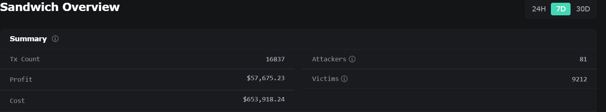

- **16,837 transactions** were attacked
- **$653,918** in total user losses (e.g. overpaying due to inflated prices)
- **$57,675** in profits made by attacking bots
- **81 bots** attacked **9,212 users**
- Users lose **11 times more** than bots earn

You can view up-to-date detailed statistics [here](https://eigenphi.io/mev/ethereum/sandwich).

### How Block Building Works in Ethereum

After Ethereum's transition to Proof-of-Stake and the introduction of the [Proposer-Builder Separation](https://ethereum.org/en/roadmap/pbs/) (PBS) model, block building now looks like this:

1. **User** signs a transaction with their private key and sends it through JSON-RPC to a node.
2. First, the transaction enters the so-called `mempool`. Anyone can see the details of these transactions.
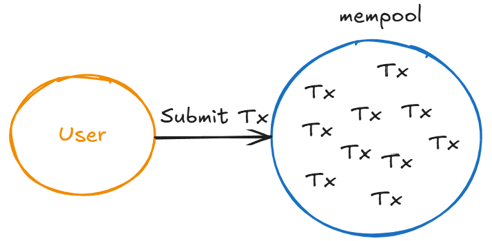
3. **Searchers** are bots that scan the public `mempool`, find opportunities for `MEV`, and package their trades into `Bundles` (a set of transactions that generates profit). `Searchers` can also include a bribe as the last transaction in the `Bundle` to incentivize the `Builder` to include that `Bundle` in the block.
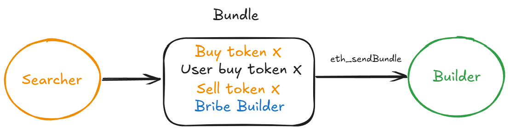
4. **Builders** are entities that assemble the block. They include `Bundles` received from `Searchers`, as well as regular transactions from the public mempool. Their goal is to build a block with the highest possible block value — meaning the maximum combined profit from MEV, priority fees (user tips), arbitrage, and other sources.
They also set the `feeRecipient` field to their own address — this means they will receive both the `bribes` from `Searchers` and all the priority fees (tips) specified by users in their transactions. At the end of the block, the Builder adds a special transaction that acts as a bribe for the `Proposer` — similar to how a `Searcher` pays a `Builder`.
_Important! Builders are external entities — they do not interact with the blockchain directly._
5. **Relay** – intermediary entities between `Builders` and `Proposers`. Since the `Builder` market is competitive (everyone wants their block to be included and bring profit), `Relays` help `Proposers` choose the best block. They receive block payloads from different `Builders`, validate them, and forward to the `Proposer` only the one with the highest payout (maximum bid). To prevent the Proposer from seeing valuable information in the block and stealing it, a mechanism similar to `Commit-Reveal` is used. The `Relay` first shows only the block header and the promised payment, and reveals the full block only after the `Proposer` agrees to it. This way, if a `Proposer` tries to cheat and not use the agreed block, instead creating their own, the signature they gave to the `Relay` becomes proof of misconduct — which can lead to punishment or the `Proposer` being cut off from participation.

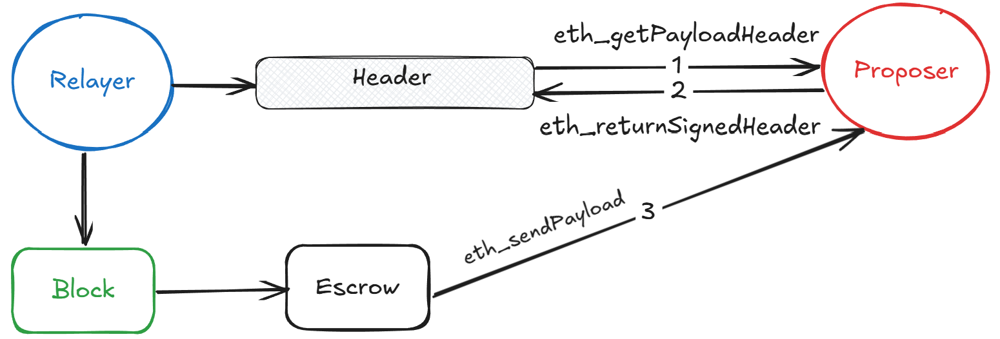

Although Builders construct many blocks, in reality, almost all finalized blocks are assembled by a few major players, such as BeaverBuild, BuilderNet, and Titan Builder.
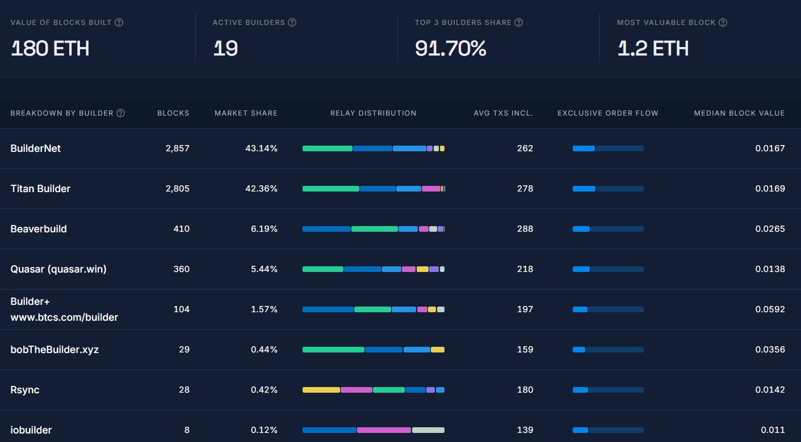

You can view detailed statistics [here](https://explorer.rated.network/builders?network=mainnet&timeWindow=1d&page=1).

As a result, `Relays` take on the role of a "trusted intermediary" to simplify block selection and protect the interests of all participants. You can check the statistics for `Relays` [here](https://explorer.rated.network/relays?network=mainnet&timeWindow=30d).

And if we put it all together:
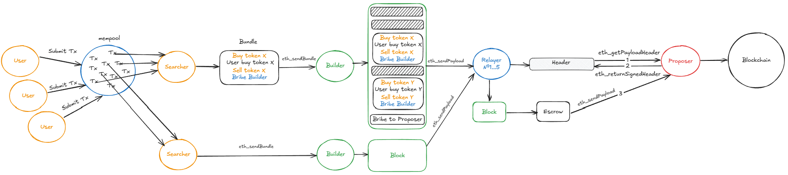

### How Mev Blocker Works

Now that we understand how a transaction gets into a block, we can look at where Mev Blocker fits into this process.

The main feature of `Mev Blocker`, aside from protecting against MEV attacks, is that it distributes potential MEV profit (back-running) between the `User` (90%) and the `Builder` (10%). This way, the user receives the profit that would otherwise go to some bot.

1. **Users** send transactions through a connected wallet to the [RPC](https://cow.fi/mev-blocker#rpc) provided by `Mev Blocker`.
2. The `Mev Blocker RPC` receives the transactions. Instead of going to the public `mempool`, they are sent directly to this service.
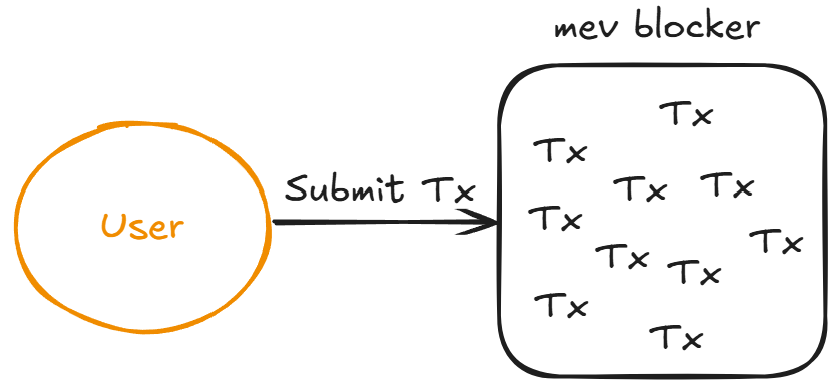
3. `Mev Blocker` separates user signatures from the transaction and uses AI to generate fake transaction information (`Tx info`).
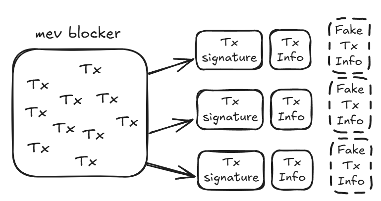
    Why are fake transaction data added? Simple — to prevent `Searchers` who have access to transaction info from trying to game the system.
With access to real data, they could perform `probabilistic MEV`, which is when you profit just by guessing what’s going to happen.

    Example: take the info from the publicly available `Tx info` and try to front-run the user directly in the public mempool. In other words, using knowledge of real trades and not playing by the rules of `mev blocker`.

    In addition to what `Mev Blocker` does, there are extra user protection mechanics:
    - For example, in the case of swaps, MEV Blocker removes some slippage data to prevent `Sandwich attacks`.
    - If a transaction is unlikely to be profitable for back-running, MEV Blocker doesn’t forward it to `Searchers` at all.

4. `Mev Blocker` shares the `Tx info` with all `Searchers` via [websocket](https://docs.cow.fi/mevblocker/searchers/listening-for-transactions).
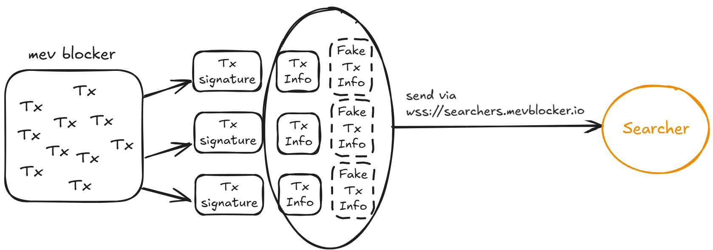

5. `Searchers` collect the `Tx info` into a `Bundle`, including their own transactions to maximize user profit through `back-running`, and send it back to `Mev Blocker`.
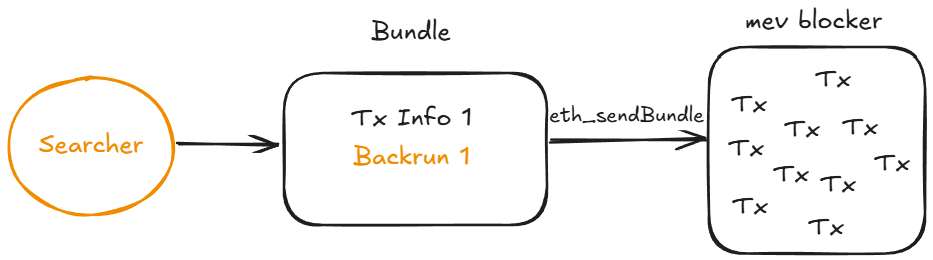
The `Bundle` is sent via the same websocket `wss://searchers.mevblocker.io` using the `eth_sendBundle` method.

The submission data looks like this:
```json
{
    "jsonrpc": "2.0",
    "id": 1,
    "method": "eth_sendBundle",
    "params":
        [
            { "txs": [ // this is the 32-byte transaction hash of the target transaction "0xfec1700ef24c9ff6fd2e07584a16bbb2fec1700ef24c9ff6fd2e07584a16bbb2", // this is your signed encoded transaction "0xabc123.." ],
            "blockNumber": "0xb63dcd",
            "minTimestamp": 0,
            "maxTimestamp": 1615920932
            }
        ]
}
```

  There are specific rules for how a `Bundle` should be constructed:
    - The first element in the `txs` array must always be the user's transaction hash. This is needed so that `mev blocker` can identify which transaction is being processed. The second element is the transaction that includes the `back-running`.
    - The `back-run` transaction must include a `bid` — a payment in ETH for including the bundle. (The higher the bid compared to other `Searchers`, the better the chance your `Bundle` gets included in the block.) This is essentially the MEV profit that gets shared between the `User` and the `Builder/Proposer/Validator`.
    - Only one user transaction hash is allowed per `Bundle`.

6. `Mev Blocker` receives all `Bundles` from `Searchers` via websocket, removes all fake `Tx info`, and attaches the user's signatures back to their `Tx info`. After that, `Builders` select the `Bundles` with the highest `bids` (profit for users) and build the block. The `Builder` is required to return 90% of the `bid` amount to `tx.origin` in the same block.

This creates a bidding auction, where the winner is the one who provides the `Bundle` with the most profit for the users (the bid), —not the one who pays the biggest bribe to the `Builder`, as is common in Ethereum.


_If the simulation of the most profitable `Bundle` fails, the `Builder` can choose the next most profitable `Bundle` (by bid). This way, the `User` always gets the maximum possible profit, and the transaction doesn’t get delayed._
7. `Block Builders` send the assembled blocks through the `Relayer` to the `Proposers/Validators`.
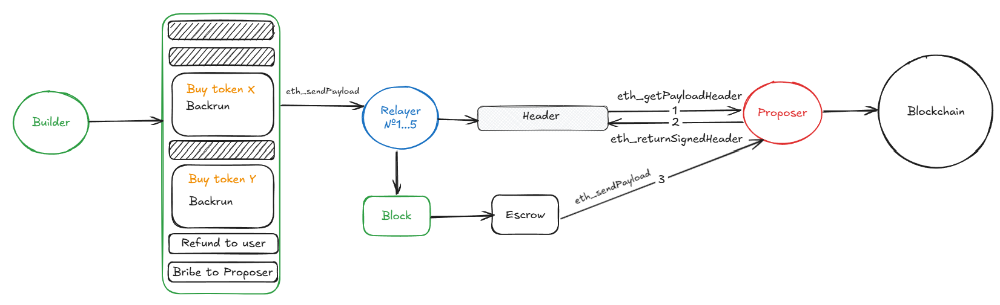

The overall workflow looks like this:
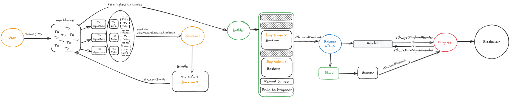

In the standard Ethereum architecture, as soon as a user sends a transaction via RPC, it immediately enters the public `mempool`, where it becomes visible to everyone — especially bots (`Searchers`). This opens the door to harmful MEV. `Searchers` form bundles that are often designed to work against the user, maximizing their own profit rather than benefiting the sender of the transaction.

With `MEV Blocker`, it’s the opposite. Transactions don’t go to the public `mempool` — they’re processed through a private RPC. Their data is anonymized, and additional fake transaction data is added to prevent exploits. Searchers receive only partial data (`Tx info`) and compete to find the most profitable back-running scenario — with the profit going back to the user (90%) instead of ending up in the hands of bots.
The winner is the one who brings the most value to the user.

### How to Participate

**User**: Just connect the MEV Blocker RPC endpoint to your wallet (e.g., MetaMask) and you’ll automatically get protection from MEV and profit from back-running opportunities. Some Dapps will prompt you to connect to the `Mev Blocker` RPC.

**Searcher**: Connect to the [WebSocket](https://docs.cow.fi/mevblocker/searchers/listening-for-transactions) stream of MEV Blocker. Build `bundles` using your own back-running strategy and send them back to `Mev Blocker` according to the [rules](https://docs.cow.fi/mevblocker/searchers/bidding-on-transactions).

**Builder**: Make a 10 ETH deposit via the [smart contract](https://etherscan.io/address/0x08cd77feb3fb28cc1606a91e0ea2f5e3eaba1a9a#writeContract). This acts as collateral, which can be used in case of any misconduct or rule violations.

Follow the [rules](https://docs.cow.fi/mevblocker/builders/rules), such as:
- Build at least 1% of blocks each week, or risk being removed from the system.
- Do not use private data for front-running or sandwiching. Harmful MEV strategies are strictly forbidden.
- Pay fees regularly via smart contract within 24 hours of invoicing, or face disconnection (reconnection costs 2 ETH).
- Do not create `shadow builders`. You’re not allowed to disguise yourself as another `Builder` to avoid fees.

Details on how to join, pay, or exit as a `Builder` via the [contract](https://github.com/cowprotocol/mev-blocker-till) can be found [here](https://docs.cow.fi/mevblocker/builders/fees/fee-management-smart-contract).

### Economics

The `MEV Blocker` system is built on a transparent and balanced incentive model, where each participant gets their share of the extracted MEV (back-running). It’s worth taking a closer look to understand what keeps all components running.

**Users**:
Receive 90% of the profit from back-running operations involving their transaction. The refund is sent in the same block to the `tx.origin` address.
_If sending via a manual request, such as through a backend RPC call, it’s possible to specify a different address to receive the profit._

**Searchers**:
Earn the difference between the actual profit from `back-running` and the amount they submitted as the back-running profit (bid).
For example: the actual profit might be 1 ETH, and they submit a bid of 0.9 ETH to `Mev Blocker`, trying to earn 0.1 ETH.
If they miscalculate or overestimate the profit — they might lose on `gas` or lose the auction to other `Searchers` who offer a higher profit to the user. So they compete with each other to generate the maximum possible profit for the user.

**Block Builders**: From the total `bid` amount, the remaining 10% goes to the `Builder`, with the majority of it used to sponsor the `Validator` so that blocks are included on-chain in a timely manner.

It’s important to note that using `Mev Blocker` is not free for `Builders`.

Here’s how the subscription fee for `Mev Blocker` is calculated:

Each week, the system calculates how many blocks a builder produced and how many MEV transactions were included via `Mev Blocker`.

Based on that, the average value per block (M) is calculated using the formula:

**M** = (total value of private transactions − public) / number of blocks built.

Builder fee = 50% * **M** * number of their blocks during the week.

_If a builder produces less than 1% of all blocks — they still pay as if they produced exactly 1%._
_This means it's not profitable for a builder to produce less than 1% of blocks, since they’ll still be charged the full participation fee._

_Public data for fee calculation and invoicing is taken from [Dune](https://dune.com/cowprotocol/mev-blocker).
That data is based on the usage of the [service](https://github.com/cowprotocol/mevblocker-dune) which handles `Bundles` from `Searchers`._

## Where It's Used

**Intent-Based DEXs (e.g., CoW Protocol)**
In such protocols, the user doesn't send a finalized transaction, but rather expresses an intent — for example, to swap token A for token B.
With MEV Blocker, these transactions don’t enter the public `mempool`, avoiding harmful manipulation from bots, and 90% of any possible backrun profit is returned to the user. If you remember, these protocols operate using `solvers` — participants who compete to execute user transactions — and they can additionally earn by acting as `Searchers`, profiting from the difference between the `bid` and the actual backrun profit.

**Oracle Extractable Value (OEV)**
Oracles that update price feeds in the public `mempool` create arbitrage opportunities, which are immediately exploited by MEV bots — while the oracle itself earns nothing.

By using MEV Blocker, oracles send updates through a private channel. `Searchers` still compete for the arbitrage opportunity, but 90% of the profit is returned to the oracle itself.

**NFT minting**

When a project launches a new NFT with public minting, the usual story begins: gas wars, `frontrunning`, and `snipers`. Regular users end up losing.

MEV Blocker helps avoid all of that. The minting goes through a private mempool — no gas race, and no chance for bots to cut in line.

## Conclusion

In the past, you just sent transactions — without realizing that someone was profiting off you every time. Bots were watching your actions in the `mempool`, launching MEV attacks — and in the best case, you lost a bit to slippage; in the worst case, you got sandwiched.

Now it’s different.

With MEV Blocker, the system doesn’t steal — it shares:
you get up to 90% of the profit that used to be taken by anonymous searcher bots.

Every transaction you send is no longer a potential loss, but a chance to receive a transparent, automatic "cashback" from `back-running`.

It’s an infrastructure-level mechanism where back-running profits are redistributed in favor of the transaction initiator.

You keep sending transactions just like before,
but now — thanks to `MEV Blocker` — 90% of the extracted MEV profit comes back to you, instead of staying with the bots.

Before: private `searchers` earned money off you.
Now: they earn money for you.

And yes, to participate — all you need is to connect to the RPC. The infrastructure handles the rest. Welcome to fair MEV.

## Links

- [MEV Blocker](https://cow.fi/mev-blocker)
- [Docs MEV Blocker](https://docs.cow.fi/mevblocker)
- [RPC-endpoints](https://docs.cow.fi/mevblocker/users-and-integrators/users/available-endpoints)
- [Connection by Searchers (WebSocket)](https://docs.cow.fi/mevblocker/searchers/listening-for-transactions)
- [Rules for Builders](https://docs.cow.fi/mevblocker/builders/rules)
- [Contract for Builders](https://etherscan.io/address/0x08cd77feb3fb28cc1606a91e0ea2f5e3eaba1a9a#writeContract)
- [MEV Blocker: Dune](https://dune.com/cowprotocol/mev-blocker)
