# Curve

**Author:** [Pavel Naydanov](https://github.com/PavelNaydanov) 🕵️‍♂️


**Curve** is a decentralized exchange (DEX) based on an automated market maker (AMM) for Ethereum and EVM-compatible blockchains. It's mainly designed for efficient stablecoin swaps, though volatile assets can also be traded.

## Background and Motivation

Interestingly enough, Curve emerged due to a limitation of [Uniswap](https://app.uniswap.org/) v2. At that time, Uniswap had already implemented the constant product formula `x * y = k`. This formula worked great for trades that used only a small portion of the pool, but significantly affected pricing for larger trades.

Imagine a Uniswap ETH/USDC pool with \$1,000,000 in liquidity. If you try to swap \$750,000 worth of ETH, you’ll end up receiving far less than \$750,000 in USDC because this heavily shifts the ETH/USDC balance in the pool.

This is especially problematic when swapping one stablecoin for another, since their value should always equal \$1. Take a USDT/USDC pool as an example—when you trade USDT for USDC, the pool ends up with more USDT and less USDC. Even a slight imbalance pushes prices away from the \$1 peg due to the constant product formula.

So, a fix for this was inevitable. Curve introduced a clever pricing formula that lies somewhere between Uniswap's model and a fixed price. Slight deviation from the fixed price is allowed, but it's much smaller than with Uniswap. The graph below compares the price slippage of Uniswap and Curve (StableSwap), taken from the [whitepaper](https://docs.curve.fi/assets/pdf/stableswap-paper.pdf).

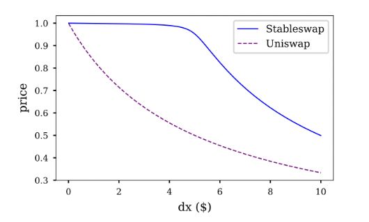

The graph shows that with an increase in the amount of liquidity used for the swap (`dx`), the price under StableSwap remains almost unchanged in the beginning.

To see Curve's efficiency, compare a stablecoin swap on Uniswap v2 and Curve (make sure to enable v2 pools in Uniswap settings). At `$100,000`, swapping USDC for DAI shows a noticeable difference. The larger the amount, the bigger the difference.

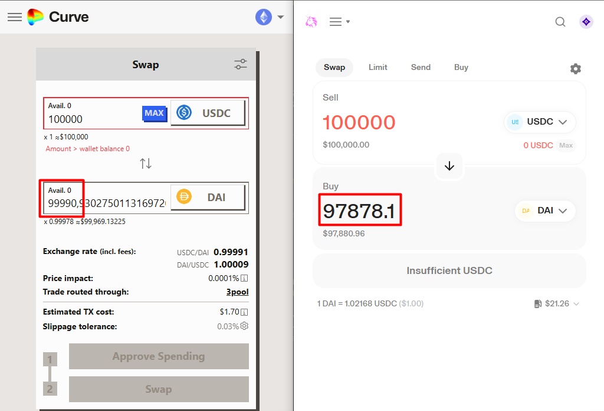

> Uniswap V3 doesn’t have this issue because its new concept of "Concentrated Liquidity" reduces price slippage by focusing liquidity within a specific price range.

## Curve Math

Curve uses a unique automated market maker (AMM) formula optimized for asset swaps. What makes it special is that the formula allows it to navigate between the constant sum and constant product formulas. This helps manage slippage when swapping stablecoins.
- Constant sum formula `x + y = k`. Provides minimal slippage but can deplete one of the assets in the pool.
- Constant product formula `x * y = k`. Ensures infinite liquidity for all assets, which can’t be depleted, but comes with higher slippage. Used in Uniswap v2 and v3.

Curve introduces the concept of an invariant, denoted by `D`. It's similar to `k` in Uniswap. Since pools can contain more than two assets, both the sum and product formulas are generalized.

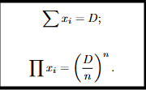

In the diagram:
- D - the invariant
- x - the i-th asset
- n - the number of assets in the pool
- Σ - sum of all assets
- Π - product of all assets

We’ll skip the derivation of the final Curve formula from the sum and product formulas. If you're curious, check out the [official StableSwap whitepaper](https://docs.curve.fi/references/whitepapers/stableswap/). We'll jump straight to the final StableSwap formula.

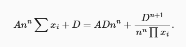

The formula introduces the concept of the amplification coefficient, denoted as `A`. The amplification coefficient `A` defines the shape of the swap curve between assets in the pool and is a dynamic parameter.

A high value of `A` makes the pool behave more like a constant sum pool, which ensures minimal slippage for small trades. This is achieved by increasing liquidity around the current exchange price, making swaps more efficient and cheaper for users.

A low value of `A` makes the pool behave more like a constant product pool (as in Uniswap), which is better suited for highly volatile assets and can handle larger trading volumes or significant price deviations.

You can easily verify this by assuming our pool contains just two assets, `x` and `y`, and that `A = 0`. This should lead us to the constant product formula.

Substitute into Curve’s final formula:
- A -> 0
- x[i] -> `x` and `y`

We get the following formula, since multiplication by 0 zeroes out the respective term:

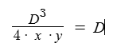

On the chart, our formulas look like this:

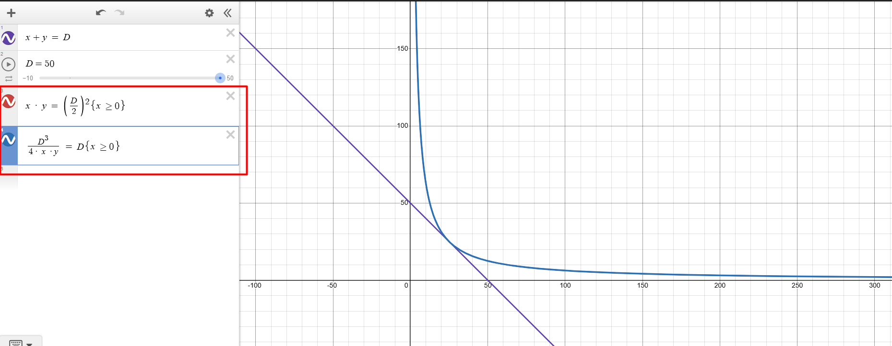

From the chart, we can see that the function is a hyperbola, which matches the constant product formula for two assets. The blue curve overlaps with the red one, indicating they’re the same.

Now let’s look at a chart for the two-asset formula with a non-zero `A`:

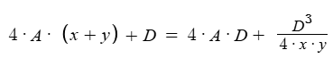

With a small value of `A`, it behaves almost like the constant product formula.

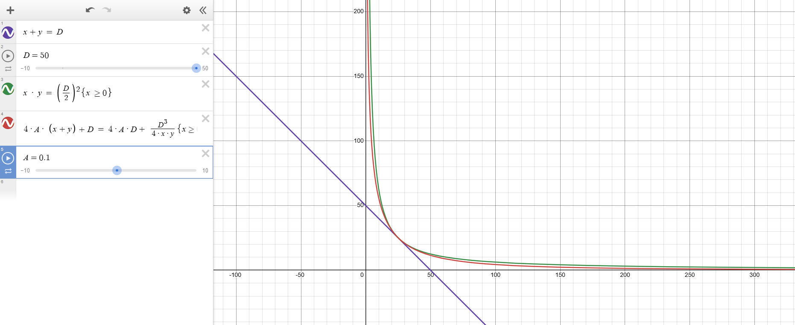

With a large value of `A`, it clearly approaches the constant sum formula.

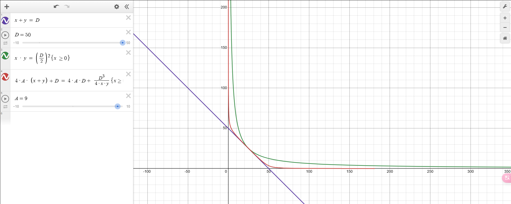

So we’ve visually explored how Curve is able to move between the constant sum and constant product formulas to achieve efficient stablecoin swaps.

## StableSwap exchange

The StableSwap algorithm combines the properties of the constant sum and constant product formulas, adapting to these models based on the balance of assets in the pool. We saw this clearly in the previous section on Curve math.

What’s important is that the protocol doesn’t care what kind of stablecoin is used. It can be a stablecoin pegged to fiat or to other crypto assets.

Depending on the blockchain, Curve provides two implementations:
- [StableSwap](https://github.com/curvefi/curve-contract/tree/master/contracts/pools): the original version of smart contracts for implementing pools.
- [StableSwap-ng](https://github.com/curvefi/stableswap-ng): the updated generation of smart contracts, considered the next version.

> If you check the [deployments](https://github.com/curvefi/stableswap-ng/tree/main/deployments) folder in the StableSwap-ng repo, you’ll see the list of networks this version was deployed to. At the time of writing, these include Mantle, XLayer, zkSync, and others.

We’ll focus only on the StableSwap smart contracts since they’re the main version and supported on more networks.

### StableSwap

Technically, a pool of assets is implemented using a smart contract written in `vyper` and the [Brownie](https://github.com/eth-brownie/brownie) framework.

There are three types of Curve pools:
- **Plain pool** – A simple pool that combines two or more assets for swapping.
- **Lending pool** – A pool that works with LP tokens from various lending protocols.
- **Metapool** – A pool where an asset is paired with the LP token of a **plain** pool.

Regardless of the type, a pool exposes the following user-facing functions:
- `exchange()` – swap one asset for another
- `add_liquidity()` – add liquidity
- `remove_liquidity()` – remove liquidity
- `remove_liquidity_imbalance()` – remove liquidity in an imbalanced way
- `remove_liquidity_one_coin()` – remove liquidity in a single asset

Additional functions:

- `_xp()` – converts token balances inside the pool to a unified decimals format. Before any calculations, token balances are normalized to 18 decimals.
- `get_D()` – returns the invariant value. Newton's method is used for calculation, which is why the formula is complex. You can only fully grasp this by diving into the original whitepaper.
- `get_virtual_price()` – returns the price of the LP token relative to the pool’s base assets
- `calc_token_amount()` – calculates the totalSupply when adding or removing liquidity. However, it doesn’t determine the exact amount of tokens to mint or burn, since it doesn’t account for the imbalance fee.

### Pool Code Overview

Curve has a lot of functionality that’s split atomically across multiple repositories. Everything related to stablecoin swapping is located in the [curve-contract](https://github.com/curvefi/curve-contract) repository. Unsurprisingly, the actual contracts are in the `./contracts` folder.

The folder structure looks like this:

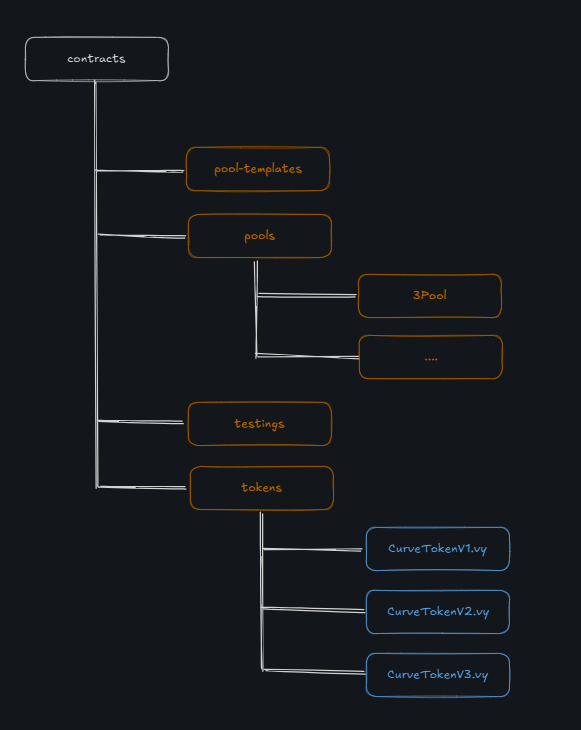

- **pool-templates** – Reference templates for pool smart contracts. Used to quickly deploy a new pool.
- **pools** – Contains many pools. Each pool has its own dedicated folder.
- **testings** – A set of smart contracts used only for testing. Includes mock tokens and other protocol contract stubs.
- **tokens** – Several versions of LP token smart contracts for pools.

Let’s take a look inside the `3Pool` folder – the first on the list and one of the most popular pools. Note that this pool supports three tokens: DAI, USDC, and USDT.

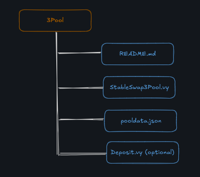

- **Readme.md** – Contains a textual description of the pool and the addresses of deployed contracts.
- **StableSwap3Pool** – The main pool smart contract that contains the business logic.
- **pooldata.json** – Contains the pool configuration settings that were used during smart contract deployment.
- **Deposit.vy** – An additional and optional smart contract. Usually contains logic for adding and removing liquidity from the pool. Needed for pool types that already have a lot of code, to get around the max contract size limitation.

To understand how a specific pool works, you need to check its implementation inside the corresponding pool folder. But we’ll go a different route and focus on the templates, since that’s the most up-to-date and abstracted code.

Let’s open the `pool-templates` folder:

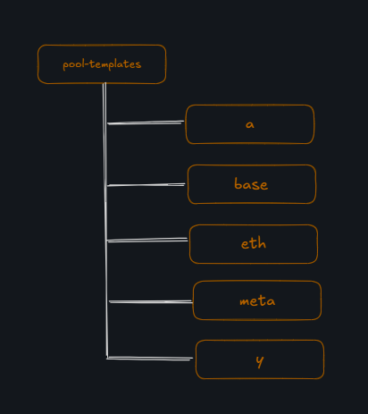

- **a** – Template for a pool that contains lending protocol LP tokens (like Aave’s aTokens).
- **base** – Template with the minimal pool implementation.
- **eth** – Template for a simple pool that supports ETH.
- **meta** – Template for a metapool that supports LP tokens from standard Curve pools.
- **y** – Template for a pool that contains LP tokens from a lending protocol (like yearn).

**Base Template**

Let's look at the implementation of the base pool template [SwapTemplateBase.vy](https://github.com/curvefi/curve-contract/blob/master/contracts/pool-templates/base/SwapTemplateBase.vy).

Every pool starts with settings defined as constants at the beginning of the smart contract:

```solidity
N_COINS: constant(int128) = ___N_COINS___ // Number of assets in the pool
PRECISION_MUL: constant(uint256[N_COINS]) = ___PRECISION_MUL___ // Precision for math operations per asset, to normalize all assets to the same precision
RATES: constant(uint256[N_COINS]) = ___RATES___ // Sets the exchange rate for each asset

FEE_DENOMINATOR: constant(uint256) = 10 ** 10 // Fee normalization factor
PRECISION: constant(uint256) = 10 ** 18 // Main precision for invariant and balance calculations

MAX_ADMIN_FEE: constant(uint256) = 10 * 10 ** 9 // Max protocol fee that the admin can set
MAX_FEE: constant(uint256) = 5 * 10 ** 9 // Max transaction fee within the pool
MAX_A: constant(uint256) = 10 ** 6 // Max amplification coefficient
MAX_A_CHANGE: constant(uint256) = 10 // Max value indicating how much A can increase

ADMIN_ACTIONS_DELAY: constant(uint256) = 3 * 86400 // Time delay before an admin action is applied
MIN_RAMP_TIME: constant(uint256) = 86400 // Minimum time that must pass before the next change in A coefficient
```

Just like in Solidity, Vyper also has a constructor. Let's take a look at it:

```solidity
def __init__(
    _owner: address, // Administrator of the smart contract, can manage the A coefficient, fees, and destroy the contract
    _coins: address[N_COINS], // List of asset addresses in the pool
    _pool_token: address, // LP token of the pool
    _A: uint256, // Amplification coefficient
    _fee: uint256, // Fee for liquidity providers
    _admin_fee: uint256 // Protocol fee
):
```
Next, let's go through the main functions that users interact with.

**Adding Liquidity**

To add liquidity, you need to call the function [add_liquidity()](https://github.com/curvefi/curve-contract/blob/master/contracts/pool-templates/base/SwapTemplateBase.vy#L296). Let’s break down the main parts:

```solidity
@external
@nonreentrant('lock')
def add_liquidity(_amounts: uint256[N_COINS], _min_mint_amount: uint256) -> uint256:
    assert not self.is_killed // Make sure the contract hasn't been killed

    amp: uint256 = self._A()
    old_balances: uint256[N_COINS] = self.balances

    // Calculate the invariant
    D0: uint256 = self._get_D_mem(old_balances, amp)

    lp_token: address = self.lp_token
    token_supply: uint256 = CurveToken(lp_token).totalSupply()
    new_balances: uint256[N_COINS] = old_balances
    for i in range(N_COINS):
        if token_supply == 0:
            assert _amounts[i] > 0 // The first deposit must include all pool tokens to initialize the invariant
        # balances store amounts of c-tokens
        new_balances[i] += _amounts[i]

    // Recalculate the invariant with updated balances
    D1: uint256 = self._get_D_mem(new_balances, amp)
    // After adding liquidity, the new invariant value should be greater
    assert D1 > D0

    // Now recalculate the invariant D considering the fee
    D2: uint256 = D1
    fees: uint256[N_COINS] = empty(uint256[N_COINS])
    mint_amount: uint256 = 0
    // If it's not the first liquidity addition
    if token_supply > 0:
        fee: uint256 = self.fee * N_COINS / (4 * (N_COINS - 1))
        admin_fee: uint256 = self.admin_fee

        for i in range(N_COINS):
            ideal_balance: uint256 = D1 * old_balances[i] / D0
            difference: uint256 = 0
            new_balance: uint256 = new_balances[i]
            if ideal_balance > new_balance:
                difference = ideal_balance - new_balance
            else:
                difference = new_balance - ideal_balance
            fees[i] = fee * difference / FEE_DENOMINATOR
            self.balances[i] = new_balance - (fees[i] * admin_fee / FEE_DENOMINATOR)
            // Save token balances minus fee
            new_balances[i] -= fees[i]
        // Recalculate invariant considering the fee
        D2 = self._get_D_mem(new_balances, amp)
        // Calculate the amount of LP tokens to mint
        mint_amount = token_supply * (D2 - D0) / D0
    // If it's the first liquidity addition
    else:
        // Save the token balances
        self.balances = new_balances
        // LP token amount equals the invariant
        mint_amount = D1
    assert mint_amount >= _min_mint_amount, "Slippage screwed you"

    // Equivalent to calling safeTransferFrom to transfer assets from the user to the liquidity pool
    for i in range(N_COINS):
        if _amounts[i] > 0:
            _response: Bytes[32] = raw_call(
                self.coins[i],
                concat(
                    method_id("transferFrom(address,address,uint256)"),
                    convert(msg.sender, bytes32),
                    convert(self, bytes32),
                    convert(_amounts[i], bytes32),
                ),
                max_outsize=32,
            )
            if len(_response) > 0:
                assert convert(_response, bool)  # dev: failed transfer
            # end "safeTransferFrom"

    // Mint LP tokens in return for the liquidity provided
    CurveToken(lp_token).mint(msg.sender, mint_amount)

    log AddLiquidity(msg.sender, _amounts, fees, D1, token_supply + mint_amount)

    return mint_amount
```

**Liquidity Withdrawal**

To withdraw liquidity, you need to call one of the three functions:
- [remove_liquidity()](https://github.com/curvefi/curve-contract/blob/master/contracts/pool-templates/base/SwapTemplateBase.vy#L513C5-L513C21).
- [remove_liquidity_imbalance()](https://github.com/curvefi/curve-contract/blob/master/contracts/pool-templates/base/SwapTemplateBase.vy#L552C5-L552C31)
- [remove_liquidity_one_coin()](https://github.com/curvefi/curve-contract/blob/master/contracts/pool-templates/base/SwapTemplateBase.vy#L704)

Let’s take a look at the `remove_liquidity()` function:

```solidity
@external
@nonreentrant('lock')
// amount – the number of LP tokens to be burned
def remove_liquidity(_amount: uint256, _min_amounts: uint256[N_COINS]) -> uint256[N_COINS]:
    lp_token: address = self.lp_token
    total_supply: uint256 = CurveToken(lp_token).totalSupply()
    amounts: uint256[N_COINS] = empty(uint256[N_COINS])

    // Equivalent to calling transfer() for each asset in the pool to send it to the user
    for i in range(N_COINS):
        old_balance: uint256 = self.balances[i]
        // Calculate the transfer amount for each token
        value: uint256 = old_balance * _amount / total_supply
        assert value >= _min_amounts[i], "Withdrawal resulted in fewer coins than expected"
        self.balances[i] = old_balance - value
        amounts[i] = value
        _response: Bytes[32] = raw_call(
            self.coins[i],
            concat(
                method_id("transfer(address,uint256)"),
                convert(msg.sender, bytes32),
                convert(value, bytes32),
            ),
            max_outsize=32,
        )
        if len(_response) > 0:
            assert convert(_response, bool)

    // Burn LP tokens from the liquidity provider
    CurveToken(lp_token).burnFrom(msg.sender, _amount)

    log RemoveLiquidity(msg.sender, amounts, empty(uint256[N_COINS]), total_supply - _amount)

    return amounts
```

It’s worth noting that the other two withdrawal options will require an additional fee, but the logic is essentially the same: calculate the amount of the asset to be withdrawn, transfer it to the caller, and burn the LP token. The extra step involves recalculating the new value of the invariant D, since the token balance proportions (which affect the value of D) in the pool will be disrupted.

**Asset exchange**

The function responsible for exchanging assets is [exchange()](https://github.com/curvefi/curve-contract/blob/master/contracts/pool-templates/base/SwapTemplateBase.vy#L447). Let's take a look at its code:

```solidity
@external
@nonreentrant('lock')
// i - index of the asset in the pool that the user is sending for the swap
// j - index of the asset in the pool that the user will receive
// _dx - amount of the asset the user is sending
// _min_dy - minimum amount of the asset the user is willing to receive. Protection against slippage
def exchange(i: int128, j: int128, _dx: uint256, _min_dy: uint256) -> uint256:
    assert not self.is_killed // Check that the contract is not killed

    old_balances: uint256[N_COINS] = self.balances
    // Get the list of asset balances adjusted to a unified precision
    xp: uint256[N_COINS] = self._xp_mem(old_balances)

    rates: uint256[N_COINS] = RATES
    // Calculate the amount of the asset in the pool after the user adds this asset
    x: uint256 = xp[i] + _dx * rates[i] / PRECISION
    // Calculate the amount of the asset in the pool after the user withdraws it
    y: uint256 = self._get_y(i, j, x, xp)

    // Amount of the asset received by the user
    dy: uint256 = xp[j] - y - 1 // This part with rounding is a bit of magic to me
    // Calculate the fee in the output asset
    dy_fee: uint256 = dy * self.fee / FEE_DENOMINATOR

    // Calculate the actual amount of the asset the user will receive, adjusted for the asset's precision and minus the fee.
    dy = (dy - dy_fee) * PRECISION / rates[j]
    assert dy >= _min_dy, "Exchange resulted in fewer coins than expected"

    // Calculate the protocol fee
    dy_admin_fee: uint256 = dy_fee * self.admin_fee / FEE_DENOMINATOR
    dy_admin_fee = dy_admin_fee * PRECISION / rates[j]

    // Update the balances of the two assets in the smart contract storage
    self.balances[i] = old_balances[i] + _dx
    self.balances[j] = old_balances[j] - dy - dy_admin_fee

    // Аналог transferFrom(). Transfer the asset from the user to the pool
    _response: Bytes[32] = raw_call(
        self.coins[i],
        concat(
            method_id("transferFrom(address,address,uint256)"),
            convert(msg.sender, bytes32),
            convert(self, bytes32),
            convert(_dx, bytes32),
        ),
        max_outsize=32,
    )
    if len(_response) > 0:
        assert convert(_response, bool)

    // Аналог transfer(). Transfer the asset from the pool to the user
    _response = raw_call(
        self.coins[j],
        concat(
            method_id("transfer(address,uint256)"),
            convert(msg.sender, bytes32),
            convert(dy, bytes32),
        ),
        max_outsize=32,
    )
    if len(_response) > 0:
        assert convert(_response, bool)

    log TokenExchange(msg.sender, i, _dx, j, dy)

    return dy
```

To determine how much of a token will be received during the swap before calling the swap function, there's a function called [get_dy()](https://github.com/curvefi/curve-contract/blob/master/contracts/pool-templates/base/SwapTemplateBase.vy#L434), which returns the amount of the asset minus the fee.
It's a small function and partially repeats the logic implemented inside the `exchange()` function:

```solidity
@view // Indicates that the function is read-only
@external
def get_dy(i: int128, j: int128, _dx: uint256) -> uint256:
    ...

    x: uint256 = xp[i] + (_dx * rates[i] / PRECISION)
    // Similar calculation of the output asset's balance that will be in the pool after the swap is completed
    y: uint256 = self._get_y(i, j, x, xp)
    dy: uint256 = xp[j] - y - 1
    fee: uint256 = self.fee * dy / FEE_DENOMINATOR

    return (dy - fee) * PRECISION / rates[j]
```

**Changing the Amplification Coefficient A**

There are two functions for changing the coefficient: [ramp_A()](https://github.com/curvefi/curve-contract/blob/master/contracts/pool-templates/base/SwapTemplateBase.vy#L742C5-L742C11) and [stop_ramp_A()](https://github.com/curvefi/curve-contract/blob/master/contracts/pool-templates/base/SwapTemplateBase.vy#L765).

Only the pool administrator can call these two functions, which makes sense since this coefficient is crucial and affects the formula used for asset swaps.

What's interesting is not just the ability to change A, but *how* it's done. Let's look at the parameters of the `ramp_A()` function. There are two: **_future_A** (uint256) and **_future_time** (uint256). The "future" prefix is not accidental. It means that the A value in the smart contract should equal _future_A when _future_time is reached. But this is not a scheduled change — it's a gradual shift of A over time. Let's take a look at the internal [_A()](https://github.com/curvefi/curve-contract/blob/master/contracts/pool-templates/base/SwapTemplateBase.vy#L154C5-L154C9) function, which returns the current value of the amplification coefficient.

```solidity
@view
@internal
def _A() -> uint256:
    t1: uint256 = self.future_A_time // value set by calling the ramp_A() function
    A1: uint256 = self.future_A      // value set by calling the ramp_A() function

  // The code below means that for the intermediate time between initial_A_time and future_A_time, an intermediate value of A (between initial_A and future_A) will be calculated
    if block.timestamp < t1:
        A0: uint256 = self.initial_A
        t0: uint256 = self.initial_A_time
        # Expressions in uint256 cannot have negative numbers, thus "if"
        if A1 > A0:
            return A0 + (A1 - A0) * (block.timestamp - t0) / (t1 - t0)
        else:
            return A0 - (A0 - A1) * (block.timestamp - t0) / (t1 - t0)

    else:  # when t1 == 0 or block.timestamp >= t1
        return A1
```

Thus, the amplification coefficient A will gradually change toward the target value by the specified date after the `ramp_A()` function is called.

The `stop_ramp_A()` function is used to halt the scheduled change of the amplification coefficient A at any moment.

To wrap up the review of the plain pool template — the architecture for other pool types is similar, but with some modifications. For example, lending pools include logic for base tokens. That means the pool holds LP tokens from a lending protocol and knows the base token for each of those LP tokens.  This way, the pool can accept liquidity in both LP tokens and the underlying base tokens.

### LP токены

There are three versions of LP tokens for pools:
- [CurveTokenV1](https://github.com/curvefi/curve-contract/blob/master/contracts/tokens/CurveTokenV1.vy): for Vyper ^0.1.0-beta.16
- [CurveTokenV2](https://github.com/curvefi/curve-contract/blob/master/contracts/tokens/CurveTokenV2.vy): for Vyper ^0.2.0
- [CurveTokenV3](https://github.com/curvefi/curve-contract/blob/master/contracts/tokens/CurveTokenV3.vy): for modified Vyper ^0.2.0

LP tokens are minted when liquidity is added to a pool and burned when liquidity is withdrawn. Nothing unusual here.

The third version is much more gas-efficient. Plus, it includes two `allowance` management functions: [increaseAllowance()](https://github.com/curvefi/curve-contract/blob/master/contracts/tokens/CurveTokenV3.vy#L115) and [decreaseAllowance()](https://github.com/curvefi/curve-contract/blob/master/contracts/tokens/CurveTokenV3.vy#L132).
Overall, there’s nothing particularly interesting in the token code — it’s just a basic ERC-20 implementation, except written in `Vyper`. However, one fun detail I noticed is this [function](https://github.com/curvefi/curve-contract/blob/master/contracts/tokens/CurveTokenV3.vy#L189):

```solidity
def set_name(_name: String[64], _symbol: String[32]):
    assert Curve(self.minter).owner() == msg.sender
    self.name = _name
    self.symbol = _symbol
```
So if you suddenly lose LP tokens from your wallet, now you know — the protocol admin probably just renamed the LP token’s name and symbol.

### Deposit contract

A pool can interact with a separate deposit contract. This contract is useful for two types of pools:
- lending: template [DepositTemplateY.vy](https://github.com/curvefi/curve-contract/blob/master/contracts/pool-templates/y/DepositTemplateY.vy)
- meta: template [DepositTemplateMeta.vy](https://github.com/curvefi/curve-contract/blob/master/contracts/pool-templates/meta/DepositTemplateMeta.vy)

The main reason this contract exists is due to the size limitations of smart contracts. For more complex pools, a lot of logic may be needed — enough to exceed this limit. So the deposit contract allows offloading the logic for adding and removing liquidity.  And that’s pretty much all it does.

We won’t look at the exact process of adding and removing liquidity here, since it’s mostly the same as in the basic pool. Let’s just see how the deposit contract is [linked](https://github.com/curvefi/curve-contract/blob/master/contracts/pool-templates/y/DepositTemplateY.vy#L48) to the main pool:

```solidity
def __init__(
    _coins: address[N_COINS], // LP tokens of the lending or meta pool
    _underlying_coins: address[N_COINS], // Base tokens for those LP tokens
    _curve: address, // Address of the main pool contract
    _token: address // LP token of this pool
):
    ....
```
So, when deployed, the deposit contract receives the addresses of the main pool and all the required tokens.

## Overview of Everything in Curve

So far, we’ve only looked at stablecoin swaps (StableSwap), but the protocol offers a whole range of interesting features.
Here’s the full list of everything Curve has to offer:
- Curve DAO
- Curve Stablecoin
- Savings crvUSD
- Curve Lending
- CryptoSwap

**Curve DAO**

For its DAO, Curve uses [AragonDAO](https://aragon.org/). But it’s not that simple — the protocol has modified the [Voting.sol](https://github.com/curvefi/curve-aragon-voting) smart contract implementation to suit its own needs. To participate in voting, you need a veCRV (vote-escrowed CRV) token. You can get veCRV by staking the protocol’s main token, CRV. The key point of veCRV is that your voting power decreases linearly over time.

**Curve Stablecoin**

crvUSD is a real stablecoin backed by various crypto collateral. It has a unique price-stabilizing mechanism called LLAMMA (Lending-Liquidating AMM Algorithm). It’s designed to boost decentralization, increase liquidity (used in pools), and attract new users.

Any user can deposit collateral and mint the stablecoin.

**Savings crvUSD (scrvUSD)**

scrvUSD offers an additional way to earn interest on crvUSD. To receive it, you need to stake crvUSD in the Savings Vault. This helps maintain the peg of crvUSD. Without it, when crvUSD increases in value, it might be profitable to sell it.
But with scrvUSD, the yield grows alongside crvUSD, making it more attractive for long-term holders.

**Curve Lending**

Implements a mechanism that lets users borrow crvUSD with soft liquidation, using LLAMMA (Lending-Liquidating AMM Algorithm). It allows liquidity providers to earn rewards, while giving borrowers a softer liquidation model.

**CryptoSwap**

It’s not just stablecoins that can be swapped. For assets with dynamic pegs, a separate AMM algorithm has been developed. The core idea is to concentrate liquidity around a single price point (hello Uniswap v3 😅).

## Fees

Curve has two main sources of fees:
- Liquidity pools. Fees are taken from swaps in regular pool tokens, but sometimes in LP tokens too.
- crvUSD markets. Interest from loans.

Fees can accumulate in any type of token, whether LP or “regular” tokens.

The fee collection architecture looks like this:

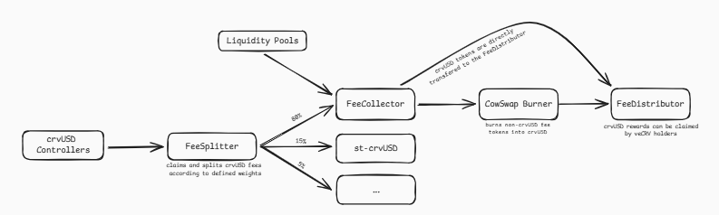

According to the diagram, the two sources of fees are clearly visible. For crvUSD, fees are collected through an additional smart contract called [FeeSplitter.vy](https://github.com/curvefi/fee-splitter/blob/main/contracts/FeeSplitter.vy). For liquidity pools, fees are collected directly from the pools. However, the pool’s smart contract only has an [admin function](https://github.com/curvefi/curve-contract/blob/master/contracts/pool-templates/base/SwapTemplateBase.vy#L854C5-L854C24) called `withdraw_admin_fees()` which allows the pool owner to withdraw the fee — and from there, as I understand, the fee is delivered manually to the FeeCollector.

The burning process is essentially the conversion of various collected assets into a single asset — `crvUSD` — using the CowSwap protocol. This is necessary to fairly distribute fees among Curve ecosystem participants. In networks where CowSwap isn’t available, a different (classic) scheme is used, with predefined swap routes and slightly less flexibility.

## Curve Wars

> We’ve made it to the most exciting part. What you’re about to read is truly unique and fascinating! Big thanks to the article ["Field Guide to the Curve Wars: DeFi’s Fight for Liquidity"](https://every.to/almanack/curve-wars) — definitely give it a read if you enjoy my take below. Just note: the article was written back in 2022, so consider it more of a historical perspective on what sparked the Curve Wars.

We’ve established that Curve is a liquidity marketplace, aiming to aggregate different types of liquidity. To attract that liquidity, Curve implemented several incentive mechanisms — and that eventually escalated into full-blown “wars.” At the core of these wars is the incentive system around Curve’s governance token — `CRV`.
This token is earned by providing liquidity to a pool, alongside the usual LP tokens. At the time the article was written, depositing into the most popular pool — 3Pool (with a TVL of $167.36M) — could earn you around 1.15% APY.

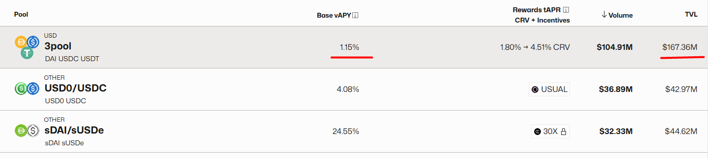

But if you look closely at the screenshot, you’ll notice the **Rewards tAPR** column,
which shows additional rewards ranging from 1.80% to 4.51% in CRV tokens. And I gotta say — that’s a solid bonus.

However, this brings us to a key issue: the protocol needs to keep the price of CRV stable. But as it stands, liquidity providers are heavily incentivized to immediately dump their CRV, which would lead to the token’s devaluation.
To prevent that — Curve introduced veCRV.

**veCRV**

Each asset swap on Curve charges a fee. Part of it goes directly to liquidity providers, but the other part goes to veCRV holders.

veCRV stands for [Vote Escrowed Curve](https://curve.readthedocs.io/dao-vecrv.html), and there’s only one way to get it: by staking CRV. This gives CRV holders an additional way to grow their assets, since it’s more profitable to [stake](https://dao.curve.fi/#/ethereum/vecrv/create) and get veCRV
than to immediately dump CRV.

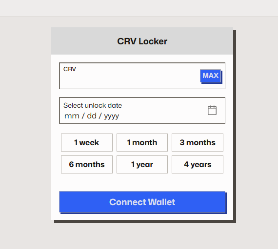

CRV can be locked for a minimum of 1 week and a maximum of 4 years. The reward rate depends on the lock duration. So veCRV provides a solid passive income. But that’s not all. veCRV holders also get to take part in the protocol’s governance —
specifically, by voting on which pools will receive CRV distributions.

Theoretically, the more votes a pool receives, the more CRV goes to stakers, and the more liquidity that pool attracts. That’s the CRV cycle inside Curve.

To understand the cycle, take a look at the diagram below:

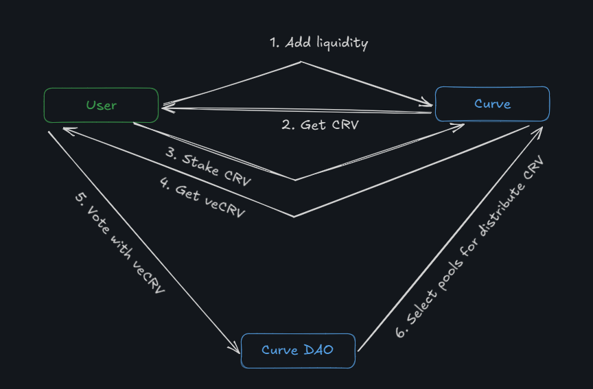

For a protocol that has its own token and wants to launch on Curve, this mechanic is crucial. To make a pool stable and popular, a protocol would typically need to provide a huge amount of liquidity. That’s the classic approach.
But if the protocol has enough veCRV, it can vote for its own pool —  and the pool will start receiving CRV rewards. This makes it attractive for outside liquidity providers, who will receive CRV and reinvest it back into Curve to get additional rewards.

And this... is where the “wars” begin!

**Convex Finance**

It’s believed that the first battle was won by the [Convex](https://www.convexfinance.com/) protocol. Convex started out as a yield aggregator on Curve.

The more veCRV you have, the more CRV rewards you can direct to a pool. But to get veCRV, you need to provide liquidity in other pools. A vicious cycle!

Convex solved this problem by pooling liquidity providers and their veCRV under one roof. That way, to earn maximum rewards, you either need to have veCRV in Curve, or simply bring your regular CRV to Convex — without holding any veCRV at all.

Here’s how it works:

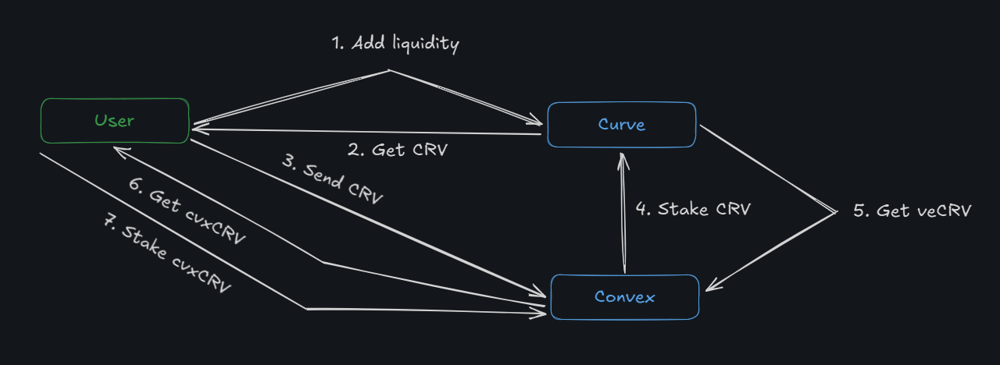

1. You add liquidity to Curve
2. You receive CRV. Alternatively, you can just buy CRV
3. You deposit CRV into Convex
4. Convex stakes the CRV in Curve on your behalf
5. Convex receives veCRV
6. Convex gives you cvxCRV in exchange for your CRV
7. cvxCRV can be staked to earn a share of what Convex earns from veCRV — or it can be sold to get back CRV. This is a way to bypass the 4-year CRV lock while still earning maximum yield!

This scheme allowed Convex to aggregate a large portion of Curve’s supply. And to add a layer of decentralization, the protocol introduced the CVX token for use in voting. What do you think people vote on? Voting rights let holders decide how Convex will use its veCRV — and which pools will receive rewards.

**CVX Bribery**
For protocols that want to increase the liquidity of their tokens, it now makes more sense to acquire CVX tokens instead of CRV tokens — since Convex already controls the majority of the voting power.
And again, there are two options: either buy a large amount of CVX yourself, or pay someone who already holds CVX.

That’s why protocols pay CVX holders to vote in favor of listing their tokens on Curve. It’s a win-win: CVX holders earn extra income, and protocols don’t need to buy CVX themselves — it’s cheaper to pay those who already have it. With that, we can say the Curve wars are over. Convex won!

But now, whoever controls veCVX will win the Convex war. Though that’s a slightly different story — one that needs its own deep dive.

## Conclusion

I’d like to start the final chapter with a comparison table:

| | Uniswap v2 | Uniswap v3| Curve |
|-|------------|-----------|----------|
| **Language** | Solidity | Solidity| Vyper |
| **Slippage** | High | Low| Low |
| **Pool** | 2 tokens | 2 tokens | 2 or more |
| **Liquidity** | Both tokens | Depends on position and price | 1 to all (you can withdraw either in a single token or in multiple tokens) |
| **Liquidity fee** | None | None | Fee on imbalance |
| **Swap fee** | Token in | Token in | Token out |

I think you’ve noticed that Curve is, in some ways, the polar opposite of Uniswap. The smart contracts are written in Vyper, the pools have more than two tokens, and it charges a fee. I’m not implying anything, but it’s interesting... Is Curve a competitor to Uniswap!?  Seems like that question deserves a separate article.

Curve is a solution not just for stablecoins — it includes complex pool types with lending protocol functionality, as well as metapools, which are pools that allow swapping LP tokens from regular pools. To me, it feels like a tool for building an endless layered pie —  tokens go into a pool, LP tokens go into another pool, and so on.

But above all, I find Curve most interesting for the magic around its CRV token, which incentivizes liquidity provision. And we haven’t even dug deep yet into the crvUSD stablecoin or Curve Lending with its liquidation mechanism known as LLAMMA (Lending Liquidating Automated Market Maker Algorithm).

From a technical point of view, I really liked the documentation and whitepaper. The math inside the pool is clearly separated, and it’s easy to understand how to interact with the pool and what happens after calling different smart contract functions. Even though I don’t use Vyper in my day-to-day work, a well-documented protocol is a pleasure to study!

## Links

1.  Official technical [documentation](https://docs.curve.fi/)
2. [Protocol Overview](https://curve.readthedocs.io/index.html)
3. Cyfrin courses. [Curve Stableswap](https://updraft.cyfrin.io/courses/curve-v1).
4. [Field Guide to the Curve Wars: DeFi’s Fight for Liquidity](https://every.to/almanack/curve-wars)

