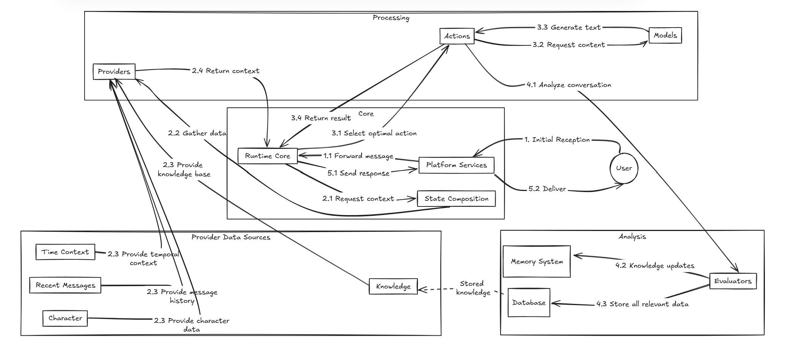

# ElizaOS v2

**Author:** [Aleksei Kutsenko](https://github.com/bimkon144) 👨‍💻

ElizaOS is an open-source framework written entirely in TypeScript for creating autonomous AI agents that can interact with:

- **Social networks**: Discord, Telegram, X — creating personalized bots to communicate with users
- **Web3 infrastructure**: DeFi protocols, NFT platforms — for executing transactions and managing assets
- **External services**: GitHub, APIs of various platforms

Each agent is a kind of "living" runtime companion, equipped with memory, a brain (LLM), and expandable capabilities through a plugin system.

Most on-chain automations are stateless bots and scripts that simply react to events. They have no memory, no access to external data, and no ability to plan — just rigid logic and direct calls.

ElizaOS turns simple bots into fully autonomous agents with the ability to learn and make decisions.

The result — fully-fledged digital entities that can, for example, automatically:

* analyze blockchain data,
* vote on DAO proposals,
* manage an asset portfolio,
* communicate on X/Telegram on behalf of a project,
* generate audio/video content

## History and Evolution

[ElizaOS](https://eliza.how/) began as AI16z — the world’s first hedge fund managed by artificial intelligence. The project launched in October 2024 as a nod to [a16z](https://a16z.com/), a major American venture capital firm that invests in tech startups. The project quickly gained momentum and moved beyond a joke: AI agents weren’t just managing tokens and accounts — they started demonstrating real coordination and decision-making mechanisms.

By early 2025, it became clear that the project was reaching a new level — both technically and reputationally. To avoid legal and branding conflicts with the real a16z, the team decided to rebrand as ElizaOS. The new name marked the shift from an experimental MVP to a focused effort on building infrastructure for autonomous AI agents.

Since then, ElizaOS has gone through a rapid evolution cycle. The architecture became more modular, agent interaction with Web3 environments improved, resource management was unified, and the project started attracting an active developer community. The transition to the second version of the system was accompanied by ecosystem growth, the launch of a grant fund, and the emergence of dozens of new AI integrations.

Today, ElizaOS is not just a framework for building agents — it’s an evolving operating system for decentralized, autonomous, and coordinated AI entities in the Web3 space.

## Architecture and Components

Let’s take a look at the architecture and workflow of the protocol.


Based on the diagram, we can identify the following:

**Core Components**:

- Agent Runtime — The main component of the agent. It handles the database and coordinates other components.
- Services — This component connects agents to external services. Essentially, it’s the entry point for communication with agents. For example: Discord, X, Telegram.
- Database — The place where the agent stores everything it needs to remember. For example, who it talked to, what happened, what commands were executed, how different participants are connected, and its configuration settings.

**Intelligence & Behavior**:

- Actions — These are the things the agent can do: send transactions, answer questions, generate content, etc.
- Providers — Components that build the context for the agent’s LLM model. They collect and structure relevant information (e.g., user data, previous messages, system state) so the agent can make informed decisions.
- Evaluators — Cognitive components that analyze the agent's dialogues after they end, extract important facts and patterns, and update the agent’s knowledge base. They help the agent learn and improve from past experiences.
- Knowledge — A structured system for storing information and the agent’s long-term memory. It preserves facts, conclusions, and personalized data so the agent can use them in future interactions.

**Structure & Organization**:

- Worlds — Like "separate worlds" or projects where the agent operates. Similar to servers in Discord or workspaces.
- Rooms — Channels within a world where specific discussions happen — like chats, channels, or individual tasks.
- Entities — All participants within the rooms: users, agents, bots, and any other entities that can be interacted with.

**Development & Integration**:

- Plugins — Plugins that allow the agent to perform specific actions. For example, there are plugins for interacting with the blockchain or sending messages to Telegram.
- Projects — Prebuilt agent setups that are ready to use. They come configured with plugins, memory, roles, and logic.
- Tasks — The scheduler. It lets the agent run actions on a schedule or postpone tasks for later. (For example, tell the agent to check the ETH price daily and send a signal or even buy when a target price is reached.)

Workflow according to the diagram:

1. **Service Reception**: The user sends a message via a platform (e.g., writes in a Discord chat or sends a message in Telegram), and the agent receives it
2. **Runtime Processing**: The main component coordinates the response generation process
3. **Context Building**: Providers deliver the necessary context
4. **Action Selection**: The agent evaluates and selects appropriate `actions`
5. **Response Generation**: The selected `actions` generate the response
6. **Learning & Reflection**: Evaluators analyze the dialogue to understand what can be improved and use it to further train the model
7. **Memory Storage**: New information is saved to the database (interaction history, analysis results, etc.)
8. **Response Delivery**: The response is sent back to the user through the service

What does this provide? This creates a continuous operational loop: interaction → analysis → improvement. This mechanism enables agents to constantly learn and evolve through ongoing interaction.

It's starting to make sense, but there are still questions. So let’s take a closer look at the most important components in action.

### Service

The service acts as a layer between Eliza agents and platforms like Discord and Telegram.

Services handle integration with specific platforms (for example, processing messages in Discord or posts on X).

A single agent can manage multiple services at once and maintains separate context for each platform.

You can view the full list of active services and their capabilities [here](https://eliza.how/docs/core/services).

### Agent Runtime

As mentioned earlier, this is the main component that receives messages from the `service` and manages the processing cycle — handling and responding to user messages or commands.

Let’s look at a detailed workflow diagram:


1. Initial Reception:
   The user sends a message, which is received by the **Platform services**

2. Context Building:

   2.1. The **Runtime Core** requests context from the **State Composition** system

   2.2. **State Composition** gathers data from various providers

   2.3. Providers fetch the necessary data from sources (User, Knowledge Base, Recent Messages, etc.)

   2.4. The complete context is returned to the **Runtime Core**

3. Action Processing:

   3.1. The **Runtime Core** identifies applicable **Actions** and selects the optimal one

   3.2. The selected action may request content generation from Models (such as GPT)

   3.3. Models generate the response

   3.4. The result of the action is returned to the **Runtime Core**

4. Learning and Storage:

   4.1. The conversation is analyzed by **Evaluators** to extract meaningful insights and facts

   4.2. **Knowledge** updates are sent to the **Memory System**

   4.3. All relevant data is saved in the **Database**

5. Response Delivery:

   5.1. The final response is sent back to the **Platform services**

   5.2. The **Platform services** deliver the response to the user

A question comes up — how does the agent know which Action is appropriate to use for a request?

### Actions

This is one of the key components that determines how agents respond to messages and perform tasks. It could be a simple pre-written text reply, a response from an LLM (like GPT), or execution of a command (for example, sending a transaction to the blockchain).
Each Action performs a single operation — but it’s also possible to use a chain of `actions`.

Action structure:

```javascript
name: Unique identifier
similes: Alternative names/triggers
description: Explanation of purpose and usage
validate: Function that checks whether the action is suitable
handler: Core implementation logic that will be executed when this action is selected
examples: Usage examples
suppressInitialMessage: A flag that indicates whether the agent should immediately give a response before executing the action, or just start preparing a reply. Useful when the agent will perform multiple actions together and intermediate responses aren't needed.

```

A basic template that can be used:

```javascript
const customAction: Action = {
  name: 'CUSTOM_ACTION',
  similes: ['ALTERNATE_NAME', 'OTHER_TRIGGER'],
  description: 'Detailed description of when and how to use this action',

  validate: async (runtime: IAgentRuntime, message: Memory, state?: State) => {
    // Check to determine if this action can be selected.
    return true;
  },

  handler: async (
    runtime: IAgentRuntime,
    message: Memory,
    state?: State,
    options?: any,
    callback?: HandlerCallback
  ) => {
    // Action handling logic
    const responseContent = {
      thought: 'Internal reasoning about what to do (not shown to users)',
      text: 'The actual message to send to the conversation',
      actions: ['CUSTOM_ACTION'],
    };

    if (callback) {
      await callback(responseContent);
    }

    return true;
  },

  examples: [
    [
      {
        name: '{{name1}}',
        content: { text: 'Trigger message' },
      },
      {
        name: '{{name2}}',
        content: {
          text: 'Response',
          thought: 'Internal reasoning',
          actions: ['CUSTOM_ACTION'],
        },
      },
    ],
  ],

  suppressInitialMessage: true,
};
```

Thus, the workflow for executing actions is as follows:

1. All available Actions are checked for applicability to the current message using the `validate` function
2. Valid actions are formatted and included in the agent’s context, which was previously retrieved from the providers
3. The LLM decides which actions to perform based on the user's message and the context
4. Then, the sequence of Actions is executed using the `handler` function

And once the response processing is complete, **Evaluators** extract new facts from the interaction with the user and write them to the **Memory System** and **Database**.

This creates an effective learning and improvement loop for the agent.

To avoid writing your own actions from scratch, you can use prebuilt ones — these are called plugins. You can either create a plugin or connect an existing one.

### Plugins

Initially, there is a core plugin called `Bootstrap`.

It comes as the base in ElizaOS and includes components we already know — such as Actions, Providers, Service, and Evaluators. It's not recommended to modify its code.

```javascript
export const bootstrapPlugin: Plugin = {
  name: 'bootstrap',
  description: 'Agent bootstrap with basic actions and evaluators',
  actions: [...],
  events: {...},
  evaluators: [...],
  providers: [...],
  services: [TaskService, ScenarioService],
};
```

This plugin essentially initializes the minimal functionality required for agents to operate.

All other plugins simply add extra actions, events, evaluators, and so on.

ElizaOS supports a plugin registry that you can easily add to your project.

If you want to create your own and share it with the community, you can submit a [pull request](https://github.com/elizaos-plugins/registry?tab=readme-ov-file#pull-request-requirements).

You can check out the available plugins [here](https://eliza.how/docs/awesome-eliza#-plugins).

At this point, we've figured out the full path from receiving a message to generating a response.

Now let's take a look at how the next component analyzes and records data for future requests.

### Evaluators

Evaluators are cognitive components in ElizaOS responsible for analyzing dialogues, extracting knowledge, and building understanding after the agent has generated its main response. Unlike Actions, which produce visible replies for the user, Evaluators perform background cognitive tasks and form the agent’s `Knowledge` and `Memory System`.

Interface structure:

```javascript
interface Evaluator {
  name: string;        // Unique identifier
  similes?: string[];  // Alternative names
  description: string; // Description of purpose
  examples: EvaluationExample[]; // Usage examples
  handler: Handler;    // Implementation logic
  validate: Validator; // Validation criteria check
  alwaysRun?: boolean; // Run regardless of validation
}
```
Key types of Evaluators:

1.  Fact Evaluator:
    - Responsible for forming the agent's "episodic memory" by extracting from conversations:
    - Facts: Immutable truths ("The user lives in Moscow")
    - Status: Temporary states ("The user is working on a project")
    - Opinions: Subjective views ("The user prefers TypeScript")
2. Reflection Evaluator:
    - Generates self-reflective thoughts about the quality of the conversation
    - Extracts facts
    - Identifies and tracks relationships between entities (e.g., one user interacting with another)

So this component updates the `Knowledge` base, saves analysis results for future use in the `Memory System`, and in turn, this allows agents to continuously learn from interactions — accumulating knowledge and adjusting behavior. This creates a long-term effect of personalization and adaptation to users.

## Potential Use Cases

Based on the existing ecosystem of ElizaOS plugins and integrations, a wide range of practical scenarios can be implemented:

**DeFi Portfolio Manager**

An agent powered by plugins for working with blockchains (EVM, Solana, Avalanche) and crypto exchanges that:
- Monitors portfolio status across different networks
- Tracks arbitrage opportunities between DEXs
- Executes transactions via 1inch
- Protects against MEV attacks using private mempools
- Sends market update notifications via Telegram
- Analyzes the safety of new tokens using GoPlus and Quick Intel plugins

**DAO Coordinator**

An agent that helps manage decentralized organizations:
- Monitors proposals on Snapshot and provides analysis
- Creates summaries of discussions from Discord and Telegram groups
- Interacts with multisigs via wallet plugins
- Publishes voting reports on social media using the Twitter plugin
- Checks smart contract security via audit integrations
- Generates community content through media plugins (images, video)

**AI Marketer for Web3 Projects**

An agent for promoting projects in the Web3 space:
- Creates and publishes content on social platforms (Twitter, Lens, Farcaster)
- Analyzes trends via news and Web Search plugins
- Generates visual content using image and 3D Generation plugins
- Engages with the community on Discord and Telegram
- Tracks project activity and metrics across various networks
- Provides analytics and strategic adjustment recommendations

**NFT Community Manager**

An agent for managing NFT communities:
- Answers questions in Discord via relevant integrations
- Generates personalized content for NFT holders
- Tracks collection activity on marketplaces
- Organizes automated rewards and airdrops
- Creates streaming content using music (Suno) and image generation plugins
- Stores collection data through decentralized storage (IPFS)

**Research Assistant**

An agent that supports research on crypto projects:
- Gathers data from multiple sources via Web Search and News plugins
- Analyzes blockchain transactions through EVM and other plugins
- Prepares reports and exports them in various formats (PDF)
- Performs comparative analysis of different projects' tokenomics
- Converts YouTube videos into text summaries

There are countless use cases thanks to the modular architecture and the vast plugin ecosystem, which continues to grow and evolve.

## Conclusion

After reviewing the architecture of ElizaOS, it becomes clear why this technology is gaining attention. What stands out most is the structure with a clear separation of components — this provides flexibility for customization and scaling. Thanks to plugins, there’s no need to rewrite core code — functionality can simply be extended as needed.

Integration with various LLMs (GPT-4, Claude, and others) is another big advantage of the system. Agents get powerful tools for analysis and decision-making. And when you add memory and context to the mix, you get truly adaptive assistants — not just a set of instructions.

The learning mechanisms also deserve attention. The system with Evaluators and the Memory System allows agents to learn from every interaction — remembering useful information and improving response quality over time. This approach sets ElizaOS apart from typical bots — the more you work with an agent, the better it becomes.

There are countless use cases. From creating a helper agent that generates social media posts, to one that handles arbitrage or interacts with communities on Discord.

## Links

- [GitHub](https://github.com/elizaOS/eliza)
- [Docs](https://eliza.how/docs/intro)
- [Plugins](https://eliza.how/docs/awesome-eliza#-plugins)
- [How to add plugin](https://eliza.how/blog/add-plugins)
- [Registy of plugins](https://github.com/elizaos-plugins/registry)
- [Services](https://eliza.how/docs/core/services)
- [Generate agent character](https://github.com/elizaOS/characterfile)
- [Guide on X agent](https://eliza.how/blog/twitter-agent-guide)
- [ElizaOs DAO](https://www.elizaos.ai/dao)
