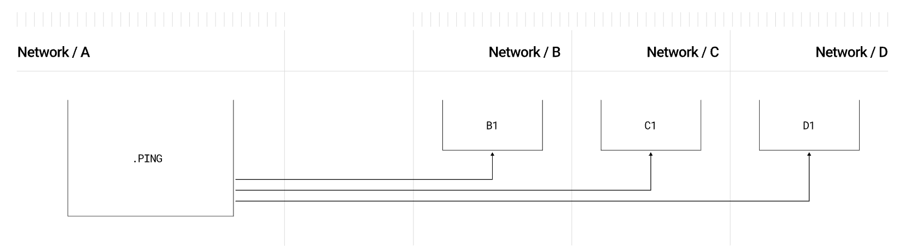

# Overview and Architecture of the LayerZero v2 Protocol

**Author:** [Roman Yarlykov](https://github.com/rlkvrv) 🧐

LayerZero is an immutable, censorship-resistant, and permissionless protocol that enables any blockchain user to send, verify, and execute messages on a supported destination network.

This is how it's described in the documentation, but understanding what it actually means can be tricky. LayerZero is NOT a standalone blockchain or a bridge between blockchains. Moreover, as Brian Pellegrino (CEO of LayerZero Labs) states, it is not a cross-chain messaging standard but a protocol for data transfer (where the data is transmitted as messages). Beyond data exchange, the protocol also provides infrastructure for executing and verifying this data during transportation.

On a global scale, the protocol offers its vision of a decentralized solution to the blockchain interoperability problem, emphasizing scalability, flexible security configurations, and the separation of data verification and execution functionalities, which sets it apart from other solutions. The second version of the protocol positions itself as an *omnichain* solution (Omnichain Messaging Protocol — OMP).

> Interoperability (from the English term "interoperability" — the ability to interact) is the capability of a product or system with fully open interfaces to interact and function with other products or systems without access or implementation restrictions.

_Note:_ You can read more about interoperability, approaches to solving it, as well as the differences between cross-chain, multichain, and omnichain in [this](https://hackernoon.com/omnichain-vs-multichain-vs-crosschain-what-are-they) article.

In short, **cross-chain** is about the interaction between two different blockchains via bridges; **multichain** refers to deploying a specific DApp on various blockchains, including modular blockchains; **omnichain** is about creating a foundational layer (Layer 0) on which various blockchains and DApps can be built. The advantage of omnichain solutions is their universal message-passing logic and flexible security configurations for each individual network.


*Differences between cross-chain and omnichain. Source: LayerZero v2 whitepaper.*

The image illustrates two approaches:

- **Cross-chain** (left): Here, networks are connected through separate bridges between chains. A key point is that each connection must be set up individually, and interaction between different compatibility groups (e.g., "Compatibility Group A" and "Compatibility Group B") requires additional layers of security and integrations. Essentially, these are fragmented connections between chains, increasing the complexity of managing relationships and ensuring security.

- **Omnichain** (right): In this approach, every chain can interact directly with any other in the network through unified network semantics. In LayerZero, this means that each cross-chain connection is standardized, but security for each connection can be configured individually.

## Principles of LayerZero

The Omnichain Messaging Protocol (OMP) is built on two main principles: security and universal semantics.

### Security

Security is divided into internal (or built-in) and external. Most protocols only implement external security, ignoring internal security.

**Internal security** includes several key invariants:

1. **Lossless** (lossless delivery or censorship resistance) — ensures that the message maintains its integrity and is delivered without data loss or alteration.
2. **Exactly-once** (non-replayability) — a message can be processed by the recipient only once.
3. **Eventual delivery** (liveness) — the message will eventually be delivered, even if there are temporary disruptions at some stage.

**External security** encompasses other aspects such as signature and verification algorithms. This layer can be configured and modified depending on the needs of a specific application.

The protocol's integrity is divided into two levels: the integrity of the data transfer channel and the integrity of the data itself. Each of these levels includes two aspects — correctness (validity) and liveness. Internal security is responsible for the correctness and liveness of the channel, while external security ensures the correctness of the data. The whitepaper provides the following table:


*Note:* A packet refers to a set of data for transmission. More details on this later.

All of this forms a modular security stack, which is configured individually for each OApp (omnichain application). This is in contrast to monolithic systems, where changes to one fragment of code can jeopardize the entire protocol.

An advantage is that changes to the security stack are made solely at the discretion of the OApp owner. Such updates are isolated, preventing system-wide failures in the event of errors or vulnerabilities in the updates. LayerZero employs an immutable code approach — updates are applied through new module versions, which are implemented securely, while old versions remain operational and are never deleted.

### Universal Semantics

The protocol must be universal in its structure to support any blockchain and ensure consistent behavior across all interactions.

LayerZero aims to standardize cross-blockchain interaction. Applications running on LayerZero should not depend on the specifics of individual blockchains, whether they are EVM-compatible or non-EVM chains. Universal semantics includes two key aspects:

- **Execution semantics** (The logic of OApp functions): Execution semantics should be chain-agnostic and sufficiently expressive to enable any functionality required by an OApp. This makes the protocol independent of the specifics of each chain.
- **Interface unification**: There must be a unified interface for message transmission between blockchains, eliminating the need to develop unique solutions for each new chain and allowing OApps to scale more quickly.

The lack of unified interfaces and message-passing semantics complicates the development of applications that operate on multiple blockchains. LayerZero addresses this issue, enabling developers to avoid dealing with the nuances of each chain individually.

## Architecture

The core idea and goal of the LayerZero protocol are very simple — to deliver a message from one blockchain to another while ensuring maximum security and reliability. A message contains the data payload and routing information for that data.


*High-level representation of message transmission. Source: LayerZero Documentation.*

### Endpoint

It all starts with the OApp on the source network and ends with the OApp on the destination network. The primary interface for the OApp is the smart contract. [Endpoint](https://github.com/LayerZero-Labs/LayerZero-v2/blob/main/packages/layerzero-v2/evm/protocol/contracts/EndpointV2.sol).


*Interaction with the Endpoint.*

The Endpoint handles incoming and outgoing messages; all messages during transmission are wrapped into packets.

A packet consists of a header and a body. The header includes routing information and service data, while the body contains the transmitted data.


*Packet structure. Source: LayerZero v2 whitepaper.*

**Endpoint** performs the following tasks:
1. **Transaction payment**: Charges the OApp for the transaction in the network's native currency or in an ERC20 token (`lzToken`).
2. **Packet preparation for sending**: Consists of several steps:
   - **Assigning nonce and GUID**: Assigns a unique number (nonce) to each message to ensure its one-time execution and [generates] (https://github.com/LayerZero-Labs/LayerZero-v2/blob/7aebbd7c79b2dc818f7bb054aed2405ca076b9d6/packages/layerzero-v2/evm/protocol/contracts/libs/GUID.sol#L10) GUID to track this message. The GUID is `keccak256(nonce, srcId, sender, dstId, receiver)`, where `srcId` and `dstId` are network identifiers (introduced because not all blockchains have a chainId).
   - **Message serialization and packet formation**: Converts the message (payload and routing information) into a serialized packet for transmission through the LayerZero protocol.
        ```solidity
        struct Packet {
            uint64 nonce; // unique transaction number, always increments by one and follows sequential order
            uint32 srcEid; // source network identifier
            address sender; // sender address
            uint32 dstEid; // destination network identifier
            bytes32 receiver; // recipient address
            bytes32 guid; // GUID
            bytes message; // message body
        }
        ```
3. **Send notification**: Emits the `PacketSent` event after the message is sent.
4. **Incoming packet verification**: Validates the integrity of incoming packets.
5. **Execution**: The Endpoint contains a function [lzReceive](https://github.com/LayerZero-Labs/LayerZero-v2/blob/7aebbd7c79b2dc818f7bb054aed2405ca076b9d6/packages/layerzero-v2/evm/protocol/contracts/EndpointV2.sol#L172), which ensures the delivery of packets to the destination network.
6. **Proper packet processing**: Responsible for the "liveness" of the channel and acts as a guarantor of internal security.

*Note:* GUID is used to track the status of the message and to trigger actions in both off-chain and on-chain operations.

#### Lossless Channel

One of the primary tasks of the *Endpoint* smart contract is to ensure a reliable data transfer channel. To achieve this, two key requirements for message channel consistency are established: **lossless transmission** and [*MessagingChannel*](https://github.com/LayerZero-Labs/LayerZero-v2/blob/7aebbd7c79b2dc818f7bb054aed2405ca076b9d6/packages/layerzero-v2/evm/protocol/contracts/MessagingChannel.sol).

Each message is assigned a unique sequential number (nonce). Although the system allows out-of-order message delivery, it guarantees the processing of all previous messages. This is achieved using the concept of a "lazy" inbound *nonce* — the highest *nonce* for which all previous messages have either been processed or skipped. *lazyInboundNonce* starts at zero, and packets can only be executed when all packets from *lazyInboundNonce* to the *nonce* of the current packet have been verified.

For example, if packets with *nonce* 1 and 2 have not been verified, then the packet with *nonce* 3 cannot be delivered and executed until the previous *nonce* values are verified.

Once *nonce* 1, 2, and 3 are verified, if *nonce* 2 fails to execute (e.g., due to gas issues or application logic problems), *nonce* 3 can still be executed.


*Out-of-order packet delivery. Source: LayerZero v2 whitepaper.*

*Important!* Verified packets can be executed out of order, but strict sequential execution can be configured if needed.

Additional functions are available to add *nonce* management logic, such as *skip*, *clear*, *nilify*, and *burn*:

- In the case of erroneous or malicious messages, OApps can use the **clear** function to skip the delivery of a specific message, or **skip** to bypass both verification and delivery.
- The **nilify** function nullifies a verified packet, preventing its execution until a new packet is received via *MessageLib*. This is useful for invalidating malicious packets that might have been generated by compromised *DVNs* (decentralized verifiers).
- The **burn** function allows applications (*OApps*) to delete a packet without knowing its contents. This is useful if a faulty security stack has recorded an incorrect hash on the *Endpoint*, or if the *OApp* needs to clean up a previously nullified (*nilified*) *nonce*.

### MessageLib

The smart contract [MessageLib](https://github.com/LayerZero-Labs/LayerZero-v2/blob/main/packages/layerzero-v2/evm/messagelib/contracts/SendLibBaseE2.sol) plays a key role in ensuring external security. Each OApp must specify which *MessageLib* it will use. If no library is specified in the OApp configuration, a default library (e.g., ULN) will be used. There is a registry of such libraries (MessageLib Registry), and there can be many of them; however, for two OApps to interact, the same library must be used in both networks as a single instance.


*Message processing scheme via MessageLib. Source: LayerZero Documentation.*

Each *MessageLib* library can implement arbitrary verification mechanisms, provided it adheres to the interface. [ISendLib](https://github.com/LayerZero-Labs/LayerZero-v2/blob/main/packages/layerzero-v2/evm/protocol/contracts/interfaces/ISendLib.sol) of the protocol. This design prevents reliance on a single verification mechanism, which often happens in other cross-chain messaging systems.

The main task of the library is to ensure the secure sending and receiving of a packet by verifying compliance with all external security requirements (which can be configured by the OApp).

Other tasks are performed by executors, which minimizes the amount of code in *MessageLib* and simplifies the addition of new features through the development of new executors.


*Interaction with the library in the source network.*

After processing the message in *MessageLib*, the packet is sent back to the *Endpoint* so it can emit an event and notify all participants.

*MessageLib* in the destination network verifies the packet and records this in the *Endpoint*, after which the `Endpoint::lzReceive()` function can be invoked.


*Interaction with the library in the destination network.*

#### Library Versioning and Migration

Once a library is added to the *MessageLib* registry, no one, including the LayerZero administrator, has the right to modify or delete it. To ensure the extensibility of external security while protecting existing OApps from "in-place" updates, the *MessageLib* registry only allows new libraries (append-only) or their versions to be added. New libraries can be added, but existing ones remain unchanged.

Each *MessageLib* in LayerZero is identified by a unique ID and version in the format *major.minor* (e.g., 1.0). A message can only be sent between two *Endpoints* if both *Endpoints* use a *MessageLib* with the same *major* version.

- The *Major* version defines compatibility for serialization and deserialization of packets.
- The *Minor* version is intended for bug fixes and other changes that do not break compatibility.

Each LayerZero packet version is tied to a specific version of *MessageLib*, helping *DVNs* (decentralized verifiers) determine which library to use for packet verification on the target blockchain.

Libraries are numbered using three digits, where the last digit represents the *Endpoint* version:
- **First digit**: The major version of the library. These versions are incompatible with each other. If the source network uses one major version and the destination network uses another, they will not be able to transmit messages to each other.
- **Second digit**: The minor version. Minor versions are compatible with each other.
- **Third digit**: The *Endpoint* version (e.g., for LayerZero v2, this is version 2).

The current version of *ULN* (the default library) is as follows:

```solidity
function version() external pure override returns (uint64 major, uint8 minor, uint8 endpointVersion) {
    return (3, 0, 2);
}
```

Migration between major versions occurs gradually to ensure security and enable asynchronous actions.

### Security Stack

The security stack consists of *DVNs* (Decentralized Verifier Networks), *MessageLib*, and *OApp config* settings, but the key component is the *DVNs*. Since LayerZero and similar protocols aim to solve blockchain interoperability, the only way to ensure this is to add a verifier between two networks.

**Decentralized Verifier Networks (DVNs)** are networks of verifiers that perform distributed consensus to securely and reliably read packet hashes from the source blockchain. An important feature of this design is the support for diverse clients within a single *DVN*, minimizing the risk of failures or errors caused by issues with a single verifier.


*Packet sending scheme involving DVNs. Source: LayerZero Documentation.*

Each *OApp* can configure its security stack, which includes several mandatory and optional decentralized verifier networks (*DVNs*) for verifying the integrity of the `payloadHash`, specifying an optional threshold, upon reaching which the packet is considered verified.

A *DVN* can contain on-chain and/or off-chain components. Each security stack can include an unlimited number of *DVNs*. The structure of a *DVN* can leverage ZKP, sidechains, or native blockchains. This allows for flexible configuration of the security stack depending on specific tasks.


*Packet verification process via DVNs. Source: LayerZero Documentation.*

Each *DVN* uses its own verification scheme to determine the integrity of the `payloadHash` before it is verified in the *MessageLib* of the destination network.

When the mandatory *DVN* confirms the `payloadHash` and the minimum threshold for additional *DVNs* is reached, the packet's `nonce` and `payloadHash` are recorded in the *Endpoint* as verified. After this, the *Executor* can execute the message.

The list of available *DVNs* can be found [here](https://docs.layerzero.network/v2/developers/evm/technical-reference/dvn-addresses).

The advantage of this approach is that even if all existing *DVNs* become inoperable due to software failures, security threats, natural disasters, or management issues, *OApp* developers can independently deploy their own *DVNs* and continue the protocol's operation.

#### Ultra Light Node

**Ultra Light Node (ULN)** is the basic messaging library (*MessageLib*) included in every LayerZero deployment. *ULN* allows the use of up to 254 *DVNs* through a customizable two-tier quorum system.

*ULN* implements a minimal set of functions necessary for any verification algorithm, making it compatible with any blockchain. Each *Security Stack* of an OApp using *ULN* includes:

- Mandatory *DVNs*.
- Optional *DVNs* and a threshold for optional verifiers (*OptionalThreshold*).

For a packet to be delivered, all mandatory *DVNs* and at least the *OptionalThreshold* of optional *DVNs* must sign the payload hash. Once the necessary *DVN* signatures are collected in *ULN*, the packet can be recorded at the endpoint (*Endpoint*).


*Example of DVNs working with ULN. Source: whitepaper.*

In this example, the *OApp* security stack includes:
- **Mandatory DVN (DVN_A)**, which has veto power.
- **N-1 optional DVNs** (DVN_B, DVN_C, etc.) with an optional verifier threshold (*OptionalThreshold*) set to 2.

This means that to confirm a packet:
- **DVN_A** must confirm the packet (it has veto power).
- At least one of the optional *DVNs* must also confirm the packet.
- **Nonce 1** has already been recorded in the message channel (marked as *Verified*).
- **Nonces 2, 3, and 6** can be recorded since security requirements are met, but they will only be finalized after the *Executor* is invoked through the `commitVerification` function.
- **Nonces 4 and 5** cannot be recorded because nonce 4 failed to meet the mandatory verifier requirements, and nonce 5 did not reach the threshold for optional *DVNs*.

### Executor

LayerZero addresses the challenge of resource-intensive code development and updates for external security by **separating verification and execution**. Any code that is not critical to security is moved into separate components — **executors**, which operate permissionlessly and are isolated from the packet verification process.


*Separation of execution layer and security layer. Source: whitepaper.*

This separation between **secure code** (in *MessageLib*) and **functional code** (in *executors*) provides two key advantages:
1. **Ease of extension**: Developers can add and implement new functionalities without worrying about security, as the *Endpoint* prevents the execution of unverified or incomplete messages. This isolates the packet execution process from its verification.
2. **Separation of security and liveness**: Even if an executor fails, it cannot prevent message delivery, ensuring the system's resilience. This isolation simplifies debugging, making it easy to identify where an error occurred — in the verification layer or the execution layer.

When an *OApp* sends a message in LayerZero, it specifies all external executors (e.g., **executors**, **DVNs**) and passes the corresponding arguments through a byte array called **Message Options**, which is interpreted by the *MessageLib* library. Executors wait for the *Security Stack* to verify the packet before executing the commands encoded in the *Message Options*.

The isolation of execution from verification improves the reliability of the data transfer channel. This model ensures that the channel can be restored even in the event of an *Executor* failure. After the *Security Stack* verifies the message, anyone willing to pay the gas fees can execute the message without additional permissions. This allows end users to manually trigger the recovery of an *OApp* after an executor failure.

The list of available executors can be found [here] (https://docs.layerzero.network/v2/developers/evm/technical-reference/deployed-contracts) (these are the executors deployed by LayerZero).

### Full Message Path from Sender to Recipient

Now that we are familiar with the main modules of LayerZero, let's examine the full message path and the sequence of actions:

1. The *OApp* on the source network calls the `lzSend` function on the *Endpoint*, providing packet routing data and information about the amount of gas required to execute the packet on the destination network.
   - The *Endpoint* forms the packet, assigns it a `nonce` and `GUID`, and then sends the packet to the *MessageLib* specified in the security stack of that *OApp*.
   - The library (in this example, *ULN*) knows which *DVNs* will be used for verification and which *Executor* should execute the transaction. It calculates the fees and passes this information to the *Endpoint*.
   - The *Endpoint* deducts the required amount from the user and emits the `PacketSend` event.
   ```solidity
   event PacketSent(bytes encodedPayload, bytes options, address sendLibrary);
   ```
2. This event is monitored by *DVNs* and the *Executor*. *DVNs* verify the packet through the *MessageLib* library (in this case, *ULN*) on the destination network and confirm its validity with their signatures. Once the required number of verifiers confirms the packet, the next step can proceed.
3. The *Executor* monitors the confirmation process. The library includes a `verifiable` function that checks whether the packet has passed full verification. After this, the *Executor* calls the `commitVerification` function, during which the *Endpoint* on the destination network verifies the *nonce*.
4. If all checks are successfully passed, the *Executor* calls the `lzReceive` function to complete the delivery of the packet to the *OApp* on the destination network. If the packet's options include information for `lzCompose`, all additional transactions are executed afterward.


*Packet delivery scheme from the source network to the destination network. Source: whitepaper.*

## Gas Calculation

A critical question for all bridges is the calculation of gas costs in the source network and the destination network. In LayerZero, these costs are divided into four components:
1. Costs for the initial transaction in the source network.
2. Fees for the operation of the security stack (*DVNs*).
3. Fees for the operation of the executor (*Executor*).
4. Coverage of gas expenses for the executor in the destination network plus, if necessary, the purchase of native tokens for their transfer within the destination network.

The last point presents some challenges. The problem is that the source blockchain has no knowledge of the state of the blockchain where the packet will be delivered, so it is impossible to emulate the transaction beforehand and calculate how much gas will be spent. Additionally, different blockchains have different native tokens for paying gas and varying gas prices.

To address this problem, before sending a message, developers must calculate how much gas the `_lzReceive` function will consume in the destination network and specify this value in the options. If the packet combines multiple transactions, the expenses for `lzCompose` must be specified separately.

For example, delivering a simple message on an EVM blockchain will consume around 50,000 gas units. The options would then be configured as follows:

```solidity
// addExecutorLzReceiveOption(GAS_LIMIT, MSG_VALUE)
bytes memory options = OptionsBuilder.newOptions().addExecutorLzReceiveOption(50000, 0)
```

*Note:* The second parameter of the `addExecutorLzReceiveOption` function specifies the amount of native currency we want to transfer to the destination network. However, this is an optional parameter and can be omitted. The use of `msg.value` has its own nuances, which are beyond the scope of this article.

The `Endpoint` smart contract includes a `quote` method for estimating the gas costs you wish to send. Generally, all OApps replicate this method.

```solidity
// LayerZero Endpoint's quote mechanism
function quote(MessagingParams calldata _params, address _sender) external view returns (MessagingFee memory);
```

The function takes a *MessagingParams* structure as input and returns a *MessagingFee*:

```solidity
struct MessagingParams {
    uint32 dstEid; // identifier of the destination network
  bytes32 receiver; // address of the OApp that will receive the packets
  bytes message; // data to be transmitted
  bytes options; // options specifying the gas amount and msg.value
  bool payInLzToken; // flag for paying gas fees in lzToken
}

struct MessagingFee {
    uint256 nativeFee; // стоимость газа который будет отправлен в wei
    uint256 lzTokenFee; // стоимость газа в lzToken если payInLzToken == true
}
```

The gas cost will be calculated as follows:


For example, we want to send a message from Ethereum to Polygon. We need to calculate how much gas to send in ETH.

Initial data:
1. ETH price - $2500
2. POL price - $0.5
3. Gas price on Polygon - 50 GWei
4. Amount of gas we want to send - 50,000

```bash
gasPriceETH = 50000 * (50000000000 / 10**18) * $0.5 / $2500 = 0.0000005 ETH
```

In theory, this should be enough to pay for the transaction on Polygon. In practice, you also need to add the fee for the security stack (which depends on how many DVNs participate in the verification) and the *Executor* fee in the destination network. The *Executor* fee depends on its implementation and can also vary. Notably, any unused gas remains with the *Executor*, but as an option, you can always deploy your own executor to optimize these expenses.

Thus, the total cost of sending a message will be calculated as follows:

```
execution logic on network A + verification and execution fees + execution logic costs on network B
```

For example, I sent a message from Arbitrum to Polygon ([link] (https://layerzeroscan.com/tx/0x55615e9ee9be40614756fed61af5e5ad35b4e63cceefce4e3d49a6ccf0cf9f95) on layerzeroscan), the approximate costs were as follows:
- Transaction fee on Arbitrum - $0.009
- Gas transfer to Polygon - $0.0555 (while the calculated cost based on the formula was ~\$0.0008)
  - Payment to two DVNs - $0.0025 ($0.00125 each)
  - Transaction execution on Polygon - ~$0.001
  - The rest goes to the *Executor* - ~$0.053

In total, for sending the message "Hello, Polygon!" I spent:

$0.009 in the source network + $0.0025 for verification fees + ~$0.053 for the executor. The total cost was $0.0645.

It’s quite difficult to determine how much of this amount is "net profit" for the executor because it incurs expenses not only for executing the transaction in the destination network but also for fetching current prices and converting native tokens. In the future, the developers promise to add a breakdown of these fees in [layerzeroscan](https://layerzeroscan.com).

According to calculations on Tenderly, the `_lzReceive` function on Polygon required 50,102 gas units (as a reminder, I only allocated 50,000), and the entire transaction consumed 85,925 gas (while the gasLimit was set to a whopping 295,812).


*Source: dashboard.tenderly.co*

The documentation also includes a [table](https://docs.layerzero.network/v2/developers/evm/technical-reference/tx-pricing#profiling) with approximate gas estimates for various actions in the destination network.

## Protocol Capabilities

LayerZero offers extensive cross-chain interaction capabilities. By default, three main *OApp* standards and various design patterns are provided for their interaction across different blockchains.

1. **Omnichain Application** (OApp) — a standard [OApp](https://github.com/LayerZero-Labs/LayerZero-v2/blob/7aebbd7c79b2dc818f7bb054aed2405ca076b9d6/packages/layerzero-v2/evm/oapp/contracts/oapp/OApp.sol) provides developers with a unified messaging interface for sending and receiving data between contracts that exist on different blockchain networks. This is a foundational standard on which anything can be built — financial logic for DeFi applications, voting mechanisms for DAOs, and more.

2. **Omnichain Fungible Token** (OFT) — allows the creation of a single ERC20 token for all blockchains that support the standard. [OFT](https://github.com/LayerZero-Labs/LayerZero-v2/blob/7aebbd7c79b2dc818f7bb054aed2405ca076b9d6/packages/layerzero-v2/evm/oapp/contracts/oft/OFT.sol). Thanks to standardization and guaranteed packet delivery, it becomes possible to transfer the entire supply of tokens between networks 🤯. This works using a `burn/mint` scheme: when assets are transferred from the source network, they are burned, and in the destination network, they are created (minted). For existing tokens, there is a [OFTAdapter](https://github.com/LayerZero-Labs/LayerZero-v2/blob/7aebbd7c79b2dc818f7bb054aed2405ca076b9d6/packages/layerzero-v2/evm/oapp/contracts/oft/OFTAdapter.sol), mechanism that leverages the benefits of *OFT* and operates using the classic `lock/mint` and `burn/unlock` scheme.

You can read more about the standard in the [documentation] (https://docs.layerzero.network/v2/developers/evm/oft/quickstart) and practical examples below.

3. **Omnichain Non-Fungible Token** (ONFT) — works similarly to *OFT* but is applied to ERC721 standard tokens.

### Design Patterns

LayerZero design patterns offer more complex [scenarios] ((https://docs.layerzero.network/v2/developers/evm/oapp/message-design-patterns)) interactions than simple message transfer between two networks. They showcase the protocol's capabilities and function as standalone building blocks for creating *omnichain* applications, which can be used individually or in combination.

**ABA**

Pattern [ABA](https://docs.layerzero.network/v2/developers/evm/oapp/message-design-patterns#aba) - This is a nested call sequence from chain A to chain B, which then sends a message back to the original chain (A -> B -> A). Also known as ping-pong. It can be used for:

- **Conditional Contract Execution**: A smart contract on chain A will execute a function only if a condition on chain B is met. It sends a message to chain B to check the condition and waits for a confirmation response before proceeding with execution.
- **Omnichain Data Feeds**: A contract on chain A can fetch data from chain B to complete a process on chain A.
- **Cross-Chain Authentication**: A user or contract can authenticate on chain A, interact with chain B to process something that requires this authentication, and then receive a token or confirmation back indicating the process was successfully completed.

**Batch send**

Pattern [Batch Send](https://docs.layerzero.network/v2/developers/evm/oapp/message-design-patterns#batch-send) involves sending a single message to multiple networks at once.


*The process of sending a single packet to multiple networks. Source: LayerZero Documentation.*

Use cases:
- **Simultaneous Omnichain Updates**: Can be used to update the same information across multiple networks, such as changes to governance parameters or updates to oracle data.
- **DeFi Strategies**: In DeFi protocols operating across multiple networks, batch sending helps rebalance liquidity pools or implement yield strategies.
- **Publishing Aggregated Data**: Oracles and data providers can use batch sending to publish information, such as token prices or event outcomes, simultaneously across multiple networks.

**Composed**

Pattern [Composed](https://docs.layerzero.network/v2/developers/evm/oapp/message-design-patterns#composed) It's not just a design pattern but also a crucial feature of the protocol. In addition to the `lzReceive` interface, there is the `lzCompose` interface, which enables transaction composition. For example, blockchains based on *MoveVM* (such as Aptos or Sui) do not support EVM-style transaction semantics, making it impossible to perform multiple calls in a single transaction.

How **lzCompose** works:
- The recipient stores the received data in the *Endpoint* via a `sendCompose` call, which occurs during the first `lzReceive` invocation.
- Then, this data is retrieved from the registry and passed to a callback function via the `lzCompose` call, but in a separate transaction.


*The process of sequential `lzReceive` and `lzCompose` calls. Source: LayerZero Documentation.*

*Note:* Multiple calls can be combined.

Advantages of this approach:
- **Scalability**: *lzCompose* is a universal primitive that can work across different blockchains.
- **Reliability and Security**: Isolated smart contract calls prevent errors in one smart contract from affecting another.
- **Gas Management**: Allows gas allocation for each call separately, simplifying transaction debugging.

*Important!* The `lzReceive` call always comes first, adding the transmitted data for new transactions with `lzCompose` to the *Executor* smart contract's queue.

The resulting sequence of calls looks like this:

`_lzSend`(source chain) -> `_lzReceive`(dest chain) -> `sendCompose`(dest) -> `lzCompose`(dest)

Usage examples:
- **Omnichain DeFi Strategies**: A contract can initiate the transfer of tokens to a destination chain and then interact with a DeFi protocol to provide loans, credits, or liquidity.
- **NFT Interaction**: When transferring an NFT to another chain, a contract can automatically trigger the issuance of a license or provision of services.
- **DAO Coordination**: A DAO can send funds to a smart contract on another chain and draft a proposal for investment or voting.

**Composed ABA**

Pattern [Composed ABA](https://docs.layerzero.network/v2/developers/evm/oapp/message-design-patterns#composed-aba) represents a combination of two patterns, enabling call sequences such as `A -> B1 -> B2 -> A` or `A -> B1 -> B2 -> C`, depending on the tasks.

Use cases:
- **Omnichain Data Verification**: Chain A sends a request to chain B to verify data. After verification, a smart contract on chain B performs an action based on this data and sends a signal back to chain A to continue the process or record the results.
- **Omnichain Collateral Management**: When collateral in chain A is locked or released, a smart contract in chain B can be triggered to issue a loan or unlock funds. Confirmation is sent back to chain A to finalize the process.
- **Multistep Smart Contract Interaction for Games and Collectibles**: In a gaming scenario, an asset (e.g., NFT) can be sent from chain A to chain B, triggering a contract on B to unlock a new level or feature in the game, after which confirmation or a reward is sent back to chain A.


*Execution scheme using the Composed ABA pattern. Source: LayerZero Documentation.*

**Message Ordering** и **Rate Limit**

These two patterns are also useful, although we will not go into detail about them:

- [Message Ordering](https://docs.layerzero.network/v2/developers/evm/oapp/message-design-patterns#message-ordering) allows asynchronous execution of packets as long as their verification order is not violated. However, if necessary, the transmission can be configured so that packets are delivered and executed strictly in order.

- [Rate Limit](https://docs.layerzero.network/v2/developers/evm/oapp/message-design-patterns#rate-limiting) provides the ability to limit traffic for data or token transfers.

### Token Bridging

For [creating bridges] (https://docs.layerzero.network/v2/developers/evm/technical-reference/integration-checklist#token-bridging-guidelines) in their classical sense (for token transfers), the correct solution would be to use the *OFT* or *ONFT* standards. These standards can also be applied in combination with the aforementioned design patterns. For example, you can implement a [Composed OFT](https://docs.layerzero.network/v2/developers/evm/oft/oft-patterns-extensions#composed-oft) by combining the capabilities of *OFT* with other patterns.

## Conclusions

In my opinion, the LayerZero team has come very close to solving the [interoperability trilemma](https://medium.com/connext/the-interoperability-trilemma-657c2cf69f17). The separation of security and execution layers, as well as the two-tier security system (internal and external), ensures a reliable data transmission channel. Moreover, the level of security can be flexibly configured based on the requirements of a specific application. The protocol supports arbitrary data transfer, and the unified interfaces open up possibilities for interaction beyond the EVM ecosystem (although it currently dominates due to the abundance of L2 solutions).

Particularly noteworthy is the ability to create *omnichain* applications, which theoretically could reduce liquidity fragmentation — an issue that is becoming increasingly relevant as the number of L2 solutions grows. The protocol's *whitepaper* describes additional measures to enhance the security of such applications, citing an extension called *Pre-Crime* (section 4.3 Application-level security), which allows invariants to be checked across all networks where the application is deployed and stops packet delivery if invariants are violated.

Given the flexibility of the LayerZero protocol and the multitude of configuration options, developing a large *omnichain* application could become a challenging task. However, simple integration with the protocol for sending messages between networks (using the standard security stack) or token transfers is accessible to any Solidity developer. The protocol even offers its own standards for token transfers.

Ultimately, what we have is a highly flexible system-builder for creating secure and decentralized protocols. This looks like an essential component of the DeFi ecosystem alongside oracles, and it’s likely that LayerZero will become as significant a player in the world of bridges as Chainlink is in the world of oracles.

## Links

- [Whitepaper: LayerZero v2](https://layerzero.network/publications/LayerZero_Whitepaper_V2.1.0.pdf)
- [Docs: LayerZero v2](https://docs.layerzero.network/v2)
- [Github: LayerZero v2](https://github.com/LayerZero-Labs/LayerZero-v2)
- [Article: Omnichain vs Multichain vs CrossChain: What Are They?](https://hackernoon.com/omnichain-vs-multichain-vs-crosschain-what-are-they)
- [Video: Intro to LayerZero V2 & Omnichain Apps for Beginners](https://www.youtube.com/watch?v=W0J_Jz76apE)
