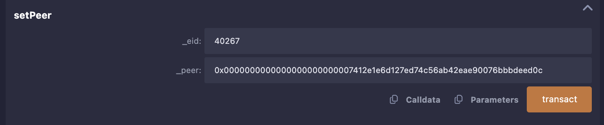
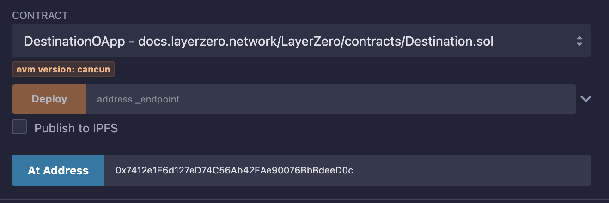

# Interacting with the LayerZero v2 Protocol. Part 1. Simple OApp in Remix

**Author:** [Roman Yarlykov](https://github.com/rlkvrv) 🧐

If you've already read the article on the LayerZero protocol architecture, the next step is to try it in action. The easiest way to do this is to deploy smart contracts in [Remix IDE](https://remix-ide.readthedocs.io/en/latest/index.html), configure them, and send a simple message. This will help you understand what a basic OApp is, how it works, and why it's needed.

Terminology:

- **Source network** – the blockchain that sends data to another network.
- **Destination network** – the blockchain that receives data from the source network.
- **OApp** (Omnichain Application) – an omnichain application with all necessary interfaces for sending and receiving messages.
- **EID** – Endpoint ID. An endpoint is a smart contract that handles all incoming and outgoing messages in any network.
- **ZRO** – the utility token of the LayerZero platform, also used for governance voting.
- **Executor** – also called the executor, a smart contract that executes the message delivery transaction in the destination network.

## Creating a Simple OApp

In the [documentation](https://docs.layerzero.network/v2/developers/evm/getting-started#example-omnichain-application), it's suggested to deploy two smart contracts: `SourceOApp` and `DestinationOApp`, which send messages between blockchains using Remix (see the _Example Omnichain Application_ section). These contracts are already written — you just need to deploy and configure them.

Just in case, I'm duplicating the Remix links here, since the documentation often gets updated:

- [SourceOApp](https://remix.ethereum.org/#url=https://docs.layerzero.network/LayerZero/contracts/Source.sol&lang=en&optimize=false&runs=200&evmVersion=null&version=soljson-v0.8.26+commit.8a97fa7a.js)
- [DestinationOApp](https://remix.ethereum.org/#url=https://docs.layerzero.network/LayerZero/contracts/Destination.sol&lang=en&optimize=false&runs=200&evmVersion=null&version=soljson-v0.8.26+commit.8a97fa7a.js)

These are two very simple smart contracts. `SourceOApp` inherits from [OAppSender](https://github.com/LayerZero-Labs/devtools/blob/main/packages/oapp-evm/contracts/oapp/OAppSender.sol), and `DestinationOApp` inherits from [OAppReceiver](https://github.com/LayerZero-Labs/devtools/blob/main/packages/oapp-evm/contracts/oapp/OAppReceiver.sol).

Our task is to send a simple message (a string) from one blockchain to another.

What do we need? Actually, not much:

1. Two OApp applications deployed on different blockchains (`SourceOApp` and `DestinationOApp`).
2. The `Endpoint` addresses in both networks, as well as their `EID` (Endpoint ID). You can find them in [this table](https://docs.layerzero.network/v2/developers/evm/technical-reference/deployed-contracts).

  
_Table with the addresses of main contracts and `EID`. Source: LayerZero Chains._

### Source OApp

Take a look at the `SourceOApp` code (in Remix) — it's pretty straightforward. We're interested in two functions:

- `SourceOApp::quote` — allows you to calculate how much native token needs to be sent to the destination network to cover transaction execution and security stack checks. The `_payInLzToken` parameter is set if the payment will be made _not_ in the network's native token (but for example using the protocol's ZRO ERC20 token).

```solidity
function quote(
    uint32 _dstEid,
    string memory _message,
    bool _payInLzToken
) public view returns (MessagingFee memory fee) {
    bytes memory payload = abi.encode(_message);
    fee = _quote(_dstEid, payload, _options, _payInLzToken);
}
```

- `SourceOApp::send` — sends the message and transfers native tokens to pay for gas in the destination network.

```solidity
function send(
    uint32 _dstEid,
    string memory _message
) external payable {
    // Encode the message before calling _lzSend.
    bytes memory _encodedMessage = abi.encode(_message);
    _lzSend(
        _dstEid,
        _encodedMessage,
        _options,
        // The fee is paid in the native token (or in the ZRO token).
        MessagingFee(msg.value, 0),
        // Sender's address in the source network (in case the fee needs to be refunded).
        payable(msg.sender)
    );
    emit MessageSent(_message, _dstEid);
}
```

### Basic OApp Setup

The `Endpoint` address is set during contract deployment. After deployment, you also need to link the smart contracts by calling `SourceOApp::setPeer(uint32 eid, bytes32 peer)` in both contracts (in the source network and in the destination network).

_Note:_ A peer in this context means an OApp. Two OApps can exchange messages only if they have a **peer-to-peer** connection via `eid` and the contract address. The `setPeer` function is located in the `OAppCore` smart contract.

_Important!_ `SourceOApp::setPeer` accepts the address in `bytes32` format. This is intentional, since address formats can vary between blockchains (for example, it's 20 bytes in EVM and 32 bytes in Solana).



To convert an EVM address to `bytes32`, you can use the following function:

```solidity
function addressToBytes32(address _addr) public pure returns (bytes32) {
    return bytes32(uint256(uint160(_addr)));
}
```

After the transaction is executed, you can verify that the `peer` is set correctly.


_Note:_ `EID` is necessary because not all blockchains have a `chain ID`.

### Destination OApp

In the destination OApp network, there's one key function we're interested in — `_lzReceive`. It’s overridden to handle specific types of messages. In our case, it's a plain string.

```solidity
function _lzReceive(
    Origin calldata _origin,
    bytes32 /*_guid*/,
    bytes calldata message,
    address /*executor*/,  // Executor address specified for the OApp.
    bytes calldata /*_extraData*/  // Any additional data or options.
) internal override {
    // Decode the payload to get the message.
    data = abi.decode(message, (string));
    emit MessageReceived(data, _origin.srcEid, _origin.sender, _origin.nonce);
}
```

### Practical Part

Now let's go through all the steps from the documentation to deploy the applications and send a message. For a deeper experience, I recommend using other blockchains from [this list](https://docs.layerzero.network/v2/developers/evm/technical-reference/deployed-contracts) instead of the ones suggested in the documentation.

_Note:_ copy the contract addresses right after deployment, and also use "Pin contract for current workspace" — click the corresponding icon next to the contract address, because in Remix, if you switch to another network, the deployed contracts are reset (even if the tab stays open).

Reminder: to access the functions of an already deployed contract in Remix, select the contract in the **Contract** tab and paste its address into **At Address**.



Steps to follow:

1. Choose two blockchains. Make sure you have enough native tokens to pay for gas.
2. Go to the LayerZero documentation → [Chains](https://docs.layerzero.network/v2/developers/evm/technical-reference/deployed-contracts) and find the `Endpoint` addresses and corresponding `EID`. Save them — you'll need them later.
3. Deploy the `SourceOApp` contract to the **source network**. You'll need the `Endpoint` address for that network.
4. Deploy the `DestinationOApp` contract to the **destination network**, also using the corresponding `Endpoint`. Save the address.
5. Switch back to the source network and convert the addresses to `bytes32` format. To do this, call `Source::addressToBytes32` (for both the OApp in the source network and the one in the destination).
6. Link the OApps using `setPeer` by executing two transactions:
   - `Source::setPeer(uint32 eid, bytes32 peer)`
   - `Destination::setPeer(uint32 eid, bytes32 peer)`
7. Calculate how many native tokens are needed to pay for gas in the destination network. Use `Source::quote(uint32 dstEid, string message, bool payLzToken)` for that. You can set the `payLzToken` parameter to `false`.

   

8. Paste the calculated `fee` (amount in Wei) into the **Value** field in Remix and send the message using `Source::send(uint32 dstEid, string message)`.

     
   

9. Check the transaction on [testnet.layerzeroscan.com](https://testnet.layerzeroscan.com/). Search by the transaction hash (you can find it in the Remix logs).

     
   

10. Right after the transaction is sent, the status in the explorer will be **Inflight**. After a few minutes, if everything went well, the status will change to **Delivered**. In the destination network, you can check the received message using `Destination::data`.

    

_Note:_ if you have a bit of ETH on **Arbitrum** and POL on **Polygon**, you can use the smart contracts I deployed and see how it works on mainnet. It'll only cost a few cents, but sometimes it's easier to pay than to hunt for test tokens.

To do this:

- Open Remix.
- Connect to the contracts using the addresses provided below (via **At Address**).
- Send a text message.

**Important:** works only in one direction — **Arbitrum → Polygon**.

Smart contracts:

- **Arbitrum:**
  - `SourceOApp`: `0x6b5ebc0bdb2572533f1cbe09026663a524421594`
  - `EID`: `30110`
- **Polygon:**
  - `DestinationOApp`: `0x0c02cb84eef5f3ea61be9dfec7f884dffc1fa6c0`
  - `EID`: `30109`

Example transactions:

- [Example 1](https://layerzeroscan.com/tx/0x55615e9ee9be40614756fed61af5e5ad35b4e63cceefce4e3d49a6ccf0cf9f95)
- [Example 2](https://layerzeroscan.com/tx/0x9124aa03fefd50d7d2345c941e7e9e26c41d1b98023326548ce5346c0fa22257)

When you're working on mainnet, you naturally start doing everything more carefully and dive deeper into the details. Though even that doesn’t always save you from mistakes 😁. For example, I messed up a few times — entered the wrong `EID` and forgot to send native tokens. So I definitely recommend giving it a try!

## Conclusion

Now you can deploy `DestinationOApp` to any other blockchain (including non-EVM networks), add a new `peer` to `SourceOApp`, and start sending messages there.

This was kind of a warm-up. Maybe this will be enough for you, but if you want to dive deeper into OApp, I wrote a separate article on creating an OFT (Omnichain Fungible Token). An OFT is also an OApp, just with additional logic for transferring tokens between networks. That will be part 2.

## Links

- [GitHub: LayerZero v2](https://github.com/LayerZero-Labs/LayerZero-v2)
- [Docs: LayerZero v2](https://docs.layerzero.network/v2)
- [LayerZeroScan](https://layerzeroscan.com/)
