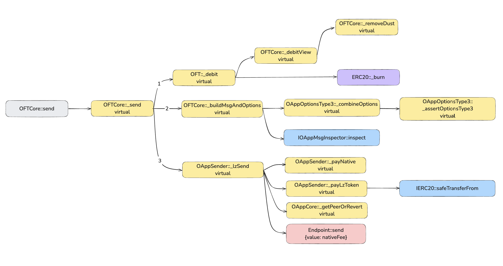

# Interacting with the LayerZero v2 Protocol. Part 2. OFT Token

**Author:** [Roman Yarlykov](https://github.com/rlkvrv) 🧐

In this article, I’ll show how to create and configure omnichain applications using LayerZero v2. As an example, we'll write an OFT (Omnichain Fungible Token).

A high-level overview of the protocol architecture and the whitepaper is covered in a separate article (which also explains the concept of omnichain applications). Here, we’ll focus on the code.

*Note:* LayerZero has solid documentation, so to avoid repetition, I’ll occasionally refer you to it. In this article, we’ll cover the main points and some of the less obvious ones.

The goal of this article is to introduce you to the key smart contracts and walk you through building your own OFT to get a real feel for how LayerZero works and what to pay attention to.

Terminology:
- **Source network** – the blockchain that sends data to another network.  
- **Destination network** – the blockchain that receives data from the source network.
- **OApp** (Omnichain Application) – an omnichain application with all necessary interfaces for sending and receiving messages.
- **OFT** (Omnichain Fungible Token) – a fungible omnichain token.
- **EID** – Endpoint ID. An endpoint is a smart contract that handles all incoming and outgoing messages in any network.
- **ZRO** – the utility token of the LayerZero platform, also used for governance voting.
- **Executor** – also called the executor, a smart contract that executes the message delivery transaction in the destination network.

## OFT Token 

In the previous article (Part 1), we created a basic omnichain application. The downside of that app was that it worked in only one direction (because `SourceOApp` inherited only from `OAppSender`, and `DestinationOApp` only from `OAppReceiver`). Of course, we want to build universal solutions that can both send and receive messages. OApp applications can contain any logic and exchange arbitrary data. 

One of the most interesting use cases is the **OFT token**. The LayerZero protocol has already figured out how to create such a token using their platform and developed the **OFT** standard. It's an ERC20 token that can exist on any number of blockchains. To support a new blockchain, you just need to deploy a new OApp there and link it to the others.  

A logical question comes up: how is this different from a regular bridge? I already answered that in the overview article, but to keep it short — the main difference is in the universal interfaces and the ability to achieve a truly high level of token transfer security.

### USDT0 Example  

A real-world example of an OFT token is [USDT0](https://usdt0.to/). This is the well-known Tether USD (USDT), which is transitioning its token to the **OFT model**. By the time you're reading this, USDT might have already migrated to USDT0 on all networks except Ethereum. As of now, it's available only on a few blockchains. 

In the case of USDT0, they used an **OFTAdapter** — a mechanism that locks/unlocks the original token in the base network, and in all other blockchains mints/burns it. The OFTAdapter is necessary if you already have a regular ERC20 token but want to turn it into an OFT.  

  
*Source: USDT0 documentation* 

Unfortunately, the project doesn't have a public GitHub repository, but all smart contracts are verified and the code can be viewed in blockchain explorers (links are [here](https://docs.usdt0.to/technical-documentation/developer#id-3.-deployments)). There are also some interesting USDT0 audit reports — I recommend checking them out [here](https://github.com/Everdawn-Labs/usdt0-audit-reports). There's a lot of useful information in them.

## What do you need to create an OFT token?

The fastest way to deploy an OFT token for LayerZero is to [create](https://docs.layerzero.network/v2/developers/evm/oft/quickstart) a project on your machine via npm. To do this, run the command:  

```bash
npx create-lz-oapp@latest
```  

Then select **OFT**.  

  

After selecting a package manager, you'll get a ready-to-go project with an OFT token. It comes **out of the box** with support for both Hardhat and Foundry, which is especially convenient. All that's left is to change the naming, deploy the contracts, and set up their interaction across different networks. The project already includes everything needed for deployment, testing, and even scripts for gas estimation.  

## OFT Token Structure

The basic structure of an OFT looks like this:  

  
*Source: LayerZero documentation*  

But if you take a closer look at the OFT token, it includes a few more dependencies. As an example, I wrote a token called [MetaLampOFTv1](./contracts/contracts/MetaLampOFTv1.sol). Read the diagram **from bottom to top**.  

  
*Inheritance diagram of the OFT token*  

Here you can see two additional smart contracts — [OAppPreCrimeSimulator](https://github.com/LayerZero-Labs/devtools/blob/main/packages/oapp-evm/contracts/precrime/OAppPreCrimeSimulator.sol) and [OAppOptionsType3](https://github.com/LayerZero-Labs/devtools/blob/main/packages/oapp-evm/contracts/oapp/libs/OAppOptionsType3.sol), which we’ll talk about a bit later. You can also see that [OApp](https://github.com/LayerZero-Labs/devtools/blob/main/packages/oapp-evm/contracts/oapp/OApp.sol) inherits from both [OAppSender](https://github.com/LayerZero-Labs/devtools/blob/main/packages/oapp-evm/contracts/oapp/OAppSender.sol) and [OAppReceiver](https://github.com/LayerZero-Labs/devtools/blob/main/packages/oapp-evm/contracts/oapp/OAppReceiver.sol), meaning it can both send and receive messages. [OAppCore](https://github.com/LayerZero-Labs/devtools/blob/main/packages/oapp-evm/contracts/oapp/OAppCore.sol) is responsible for setting the `endpoint`, `delegate`, and `peers` addresses.


*Note:* if you don't want to set up the whole project, you can check out the ready-made code [here](./contracts/contracts/MetaLampOFTv1.sol). To do this, install the dependencies by running `pnpm install` in the `protocols/layerzero-v2/smart-contracts/contracts` folder. 

You can also check out the [LayerZero-Labs/devtools](https://github.com/LayerZero-Labs/devtools/blob/main/packages/oft-evm/contracts) repository — it has all the examples.

## Basic OFT Functionality

Here’s what the simplest **ERC20 OFT token** looks like: 

```solidity
// SPDX-License-Identifier: UNLICENSED

pragma solidity ^0.8.22;

import { Ownable } from "@openzeppelin/contracts/access/Ownable.sol";
import { OFT } from "@layerzerolabs/oft-evm/contracts/OFT.sol";

contract MetaLampOFTv1 is OFT {
    constructor(
        string memory _name,
        string memory _symbol,
        address _lzEndpoint,
        address _delegate
    ) OFT(_name, _symbol, _lzEndpoint, _delegate) Ownable(_delegate) {}
}
```

- The `_name` and `_symbol` parameters are passed during deployment, since a separate instance of the token (OApp) needs to be deployed for each new network.  
- `_lzEndpoint` is the Endpoint address used to interact with the LayerZero infrastructure — that is, for sending and receiving messages, as well as paying fees. Each network has its own.
- `_delegate` is the address of the token owner, who is also responsible for changing OApp settings.

You can add any additional logic or dependencies to the token smart contract (for example, **Permit**). But everything related to the OFT mechanics is already implemented in the `OFT` contract.

The main functions we're interested in within **OFT** are `_debit` and `_credit`. They implement the basic **mint/burn** mechanics, but you can override them in the main token contract.

### Sending Tokens from the Source Network (`send`)  

The main function for sending tokens is [`OFTCore::send`](https://github.com/LayerZero-Labs/devtools/blob/05443835db976b7a528b883b19ddf02cb7f36d89/packages/oft-evm/contracts/OFTCore.sol#L175). If you remember, we had a similar function in the Remix example, but now it has become more complex:  

```solidity
function send(
    SendParam calldata _sendParam, // Main parameters for sending the message
    MessagingFee calldata _fee, // Fee to cover gas and security stack
    address _refundAddress // Refund address for unused gas in the source network
) external payable virtual returns (
    MessagingReceipt memory msgReceipt, // Main transaction receipt
    OFTReceipt memory oftReceipt // Additional info specific to OFT
) { ... }
```

Parameters that need to be specified for sending: 

```solidity
struct SendParam {
    uint32 dstEid;        // Target network ID in LayerZero (e.g. 30101 - Ethereum, 30343 - TON).
    bytes32 to;           // Address of the OApp in the destination network.
    uint256 amountLD;     // Token amount in local decimals.
    uint256 minAmountLD;  // Minimum token amount in local decimals (e.g. after fee deductions).
    bytes extraOptions;   // Options provided by the caller (e.g. gas amount required for delivery).
    bytes composeMsg;     // Additional message(s) to be executed in a separate transaction (e.g. token swap after delivery).
    bytes oftCmd;         // Custom command for OFT, unused in standard implementations.
}
```

This is what the MessagingReceipt looks like:

```solidity
struct MessagingReceipt {
    bytes32 guid; // GUID for on-chain and off-chain message tracking.
    uint64 nonce; // Unique nonce for managing the message in the channel.
    MessagingFee fee; // Fee for gas and security stack execution
}
```

#### How `send` Works

Without going too deep into the details, the `send` function performs three key steps:

1. **Calls `_debit`** — burns tokens or executes other logic when sending to the destination network (for now, you can ignore LD and SD amounts).  
2. **Builds the message** using `_buildMsgAndOptions` — adds OFT-specific data and sets the parameters.  
3. **Sends the message** via `_lzSend` — this is the first call to the base **OApp** function. All previous steps were just preparation. `_lzSend` sends the message through the Endpoint and transfers funds to cover the fee. 

During the execution of `send`, other helper functions are also called. All `internal` methods in the contract are marked as `virtual`, so you can override them in your own OFT token.

  
*Call graph of the `OFTCore::send` function*

I’ve roughly split the execution flow into three main branches — it makes it easier to break down step by step how this function works.

##### Local Decimals и Shared Decimals  

Now let’s go over specific aspects of token sending, starting with the helper functions `_debitView` and `_removeDust`, as well as concepts like **Local Decimals (LD)** and **Shared Decimals (SD)**. In other words, we’ll take a look at what happens in **branch 1**. 

  
*Token burning and additional calculations for correct `amount` display* 

Why do we need LD and SD? To ensure maximum compatibility across different blockchains (including non-EVM networks) without losing precision, LayerZero uses `uint64` and `decimals = 6` for token transfers.  

This means the maximum `totalSupply` can be 18,446,744,073,709.551615.

You can override the `OFTCore::sharedDecimals` function to reduce the number of decimal places. For example, if you lower `sharedDecimals` to 4, the maximum number increases to 1,844,674,407,370,955.1615, but the precision decreases.

Increasing `sharedDecimals` is not recommended — the LayerZero team has tested this format and believes its precision is sufficient for all existing blockchains.  

How does it work? There are two key steps:

1. **Dust removal** via `_removeDust` — to precisely determine how many tokens will be sent.  
2. **Conversion** between `local decimals` (used on the sender and receiver networks) and `shared decimals` (used only during transfer).  

For this, the `decimalConversionRate` variable is used, which is set in the constructor:  

```solidity
decimalConversionRate = 10 ** (_localDecimals - sharedDecimals());
```

**Example:** 

Let’s say in EVM blockchains `decimals = 18` (which is most common), then:  
```solidity
decimalConversionRate = 10 ** (18 - 6) = 1_000_000_000_000
```

But what if we want to transfer **1 token**, with `decimals = 18`, which has some leftover dust and looks like this: `1_123_123_123_123_123_123`.

1. Dust removal (`_removeDust`). The `_removeDust` function rounds the value down, removing the dust:

    ```solidity
    function _removeDust(uint256 _amountLD) internal view virtual returns (uint256 amountLD) {
        return (_amountLD / decimalConversionRate) * decimalConversionRate;
    }
    ```

    **Before:** `1_123_123_123_123_123_123` (1.123123123123123123)  
    **After:** `1_123_123_000_000_000_000` (1.123123000000000000)  

2. Conversion to SD (`_toSD`). For sending to the destination network, the amount is converted to **shared decimals**:  

    ```solidity
    function _toSD(uint256 _amountLD) internal view virtual returns (uint64 amountSD) {
        return uint64(_amountLD / decimalConversionRate);
    }
    ```

    We trim off 12 digits, getting `1_123_123` (1.123123).  

3. Reverse conversion (`_toLD`). On the destination network, the reverse conversion is performed:  

    ```solidity
    function _toLD(uint64 _amountSD) internal view virtual returns (uint256 amountLD) {
        return _amountSD * decimalConversionRate;
    }
    ```

    If the destination network has `decimals = 18`, we’ll get back 1.123123000000000000. 

You can take ETH at current prices and calculate the potential losses due to this level of precision. I ran the numbers — and it really is just "dust."

In addition to `_removeDust`, the `_debitView` function also performs a slippage check, in case any extra fees are deducted during the transfer.  

We've covered all of **branch 1**. I think the `ERC20::_burn` function is self-explanatory.

#### Building the Message and Options for Sending 

Now let’s break down **branch 2** — the `_buildMsgAndOptions` function. Logically, it can be divided into three stages:

1. Message encoding  
2. Building options  
3. Inspector check (optional)

  
*Building the message and options for sending*  

**Step 1:** Encoding is done using the [`OFTMsgCodec`](https://github.com/LayerZero-Labs/devtools/blob/main/packages/oft-evm/contracts/libs/OFTMsgCodec.sol) library. Its main task is to correctly pack the byte data for transmission.  

```solidity
function _buildMsgAndOptions(
    SendParam calldata _sendParam, // Send parameters
    uint256 _amountLD // Token amount in local decimals
) internal view virtual returns (bytes memory message, bytes memory options) {
    // 1. Message encoding
    bool hasCompose;
    (message, hasCompose) = OFTMsgCodec.encode(
        _sendParam.to,
        _toSD(_amountLD),
        _sendParam.composeMsg
    );

    // 2. Building options
    uint16 msgType = hasCompose ? SEND_AND_CALL : SEND;
    options = combineOptions(_sendParam.dstEid, msgType, _sendParam.extraOptions);

    // 3. Optional inspector check
    address inspector = msgInspector;
    if (inspector != address(0)) IOAppMsgInspector(inspector).inspect(message, options);
}
```

**Step 2:** Building options. I’ll explain what the options consist of in Part 3. Here, let’s look at how they are combined using [`combineOptions`](https://github.com/LayerZero-Labs/devtools/blob/05443835db976b7a528b883b19ddf02cb7f36d89/packages/oapp-evm/contracts/oapp/libs/OAppOptionsType3.sol#L63).

The thing is, the `OAppOptionsType3` smart contract allows setting predefined "enforced" options (`enforcedOptions`). These options are set by the OApp owner — for example, if they know that a specific blockchain requires a higher `gasLimit` or a mandatory *native drop*.

*Important!* **native drop** is the amount of native tokens you want to send along with the message. But these tokens are **not** used to pay the messaging fee.

To distinguish between regular and composed messages, OFT defines two message types. Depending on the type, different `enforcedOptions` can be set:
- **1 - `SEND`** — regular message sending (including token transfer);
- **2 - `SEND_AND_CALL`** — used for `compose` messages (sending + function call on the destination network). 

**Example**

Let’s say we’re sending a message, like in the Remix example — if you go back to the `Source` contract, it defines the following default options:  

```solidity
bytes _options = OptionsBuilder.newOptions().addExecutorLzReceiveOption(50000, 0);
```

That means `{ gasLimit: 50000, value: 0 }`. Now imagine the destination network requires the gas limit to be doubled and adds a 0.5 ETH native drop. In that case, the OApp owner sets the `enforcedOptions` as:  

```solidity
{ gasLimit: 100000, value: 0.5 ETH }
```

Final result after merging:  

```solidity
{ gasLimit: 150000, value: 0.5 ETH }
```

The `combineOptions` function merges the options as follows:  

```solidity
function combineOptions(
    uint32 _eid,
    uint16 _msgType,
    bytes calldata _extraOptions
) public view virtual returns (bytes memory) {
    bytes memory enforced = enforcedOptions[_eid][_msgType];

    if (enforced.length == 0) return _extraOptions;
    if (_extraOptions.length == 0) return enforced;

    if (_extraOptions.length >= 2) {
        _assertOptionsType3(_extraOptions);
        return bytes.concat(enforced, _extraOptions[2:]);
    }

    revert InvalidOptions(_extraOptions);
}
```

In the diagram, it would look like this:

  
*Selecting and merging options*  

- If `enforcedOptions` are missing → `extraOptions` are used.  
- If `extraOptions` are missing → `enforcedOptions` are used.  
- If both are set → `extraOptions` must be valid to merge correctly.  

**Step 3:** Inspector check (optional). If the OApp has a `msgInspector` contract address set, it will verify the `message` and `options` before sending.  

This allows you to programmatically define additional checks before sending data to another blockchain.

We’ve now covered **branch 2** — the process of encoding and building options for sending.

#### Sending the Message

Finally, we’ve reached **branch three** of the `send` function execution — the part responsible for actually sending the message through the Endpoint.  

  
*Call diagram for sending the message*  

The internal function `OAppSender::_lzSend` is called, which performs three key actions:  

1. Calls `_payNative` to check if `msg.value` is enough to cover the `gasLimit` in the destination network, or transfers tokens to the Endpoint via `safeTransferFrom` if payment via `_lzPayToken` is chosen. Currently, only the protocol token `ZRO` can be used as `_lzPayToken`. But I haven't tested this.
2. Checks if the `peer` to whom the message is sent exists (`getPeerOrRevert`).
3. Calls `Endpoint.send{ value: nativeFee }()`, sending the message to the security stack.  

After that, the message is passed to the Endpoint, which is responsible for further processing as well as paying the DVNs and Executor fees.

### Receiving the Message in the Destination Network 

Message reception happens through the base function [`OAppReceiver::lzReceive`](https://github.com/LayerZero-Labs/devtools/blob/05443835db976b7a528b883b19ddf02cb7f36d89/packages/oapp-evm/contracts/oapp/OAppReceiver.sol#L95) — the standard entry point for all incoming messages. It performs basic checks before calling `OAppReceiver::_lzReceive`, which is overridden with token logic in [`OFTCore`](https://github.com/LayerZero-Labs/devtools/blob/05443835db976b7a528b883b19ddf02cb7f36d89/packages/oft-evm/contracts/OFTCore.sol#L266).  

Two checks are performed:

1. The `lzReceive` function can be called **only** by the Endpoint.  
2. The message sender must match the `peer` set for the source network via `setPeer`.  

After that, control is passed to `OFTCore::_lzReceive`.  

  
*Call graph for lzReceive*  

The `OFTCore::_lzReceive` function performs two simple steps:

- Calls `_credit` to mint tokens on the destination network (or execute other token logic).  
- Checks if there are additional transactions to execute via `Endpoint::sendCompose`, and if so, adds them to the queue.  

```solidity
function _lzReceive(
    Origin calldata _origin,
    bytes32 _guid,
    bytes calldata _message,
    address /*_executor*/, // @dev not used in the default implementation.
    bytes calldata /*_extraData*/ // @dev not used in the default implementation.
) internal virtual override {
    // Convert address to EVM format
    address toAddress = _message.sendTo().bytes32ToAddress();

    // Call OFT::_credit
uint256 amountReceivedLD = _credit(toAddress, _toLD(_message.amountSD()), _origin.srcEid);

// If there are additional transactions, add them to the Endpoint queue
if (_message.isComposed()) {
    bytes memory composeMsg = OFTComposeMsgCodec.encode(
        _origin.nonce,
        _origin.srcEid,
        amountReceivedLD,
        _message.composeMsg()
    );
    endpoint.sendCompose(toAddress, _guid, 0 /* compose message index */, composeMsg);
}

    emit OFTReceived(_guid, _origin.srcEid, toAddress, amountReceivedLD);
}
```

*Important!* For an OApp to work with `compose` transactions, it must implement the [`IOAppComposer`](https://github.com/LayerZero-Labs/devtools/blob/05443835db976b7a528b883b19ddf02cb7f36d89/packages/oapp-evm/contracts/oapp/interfaces/IOAppComposer.sol) interface. The base implementation does not include this functionality.

### Estimating `gasLimit` and Security Stack Fee

To successfully execute a transaction on the destination network, two parameters need to be calculated correctly:

1. **Gas amount** (`gasLimit`) required to run the transaction.  
2. **Gas cost on the destination network**, expressed in tokens of the source network (for example, if sending from Ethereum to Polygon, the calculation is done in POL, but payment is made in ETH).  

GasLimit isn’t always straightforward. For different blockchains, you can either set it **with some margin**, or calculate it empirically. Later, we’ll cover how to verify the set value before sending.

Let’s say for **EVM networks** we take an average value of **80,000 gas units**. Then the options look like this:  

```solidity
bytes memory options = OptionsBuilder.newOptions().addExecutorLzReceiveOption(80000, 0);
```

Next, you need to build the [`SendParam`](https://github.com/LayerZero-Labs/devtools/blob/05443835db976b7a528b883b19ddf02cb7f36d89/packages/oft-evm/contracts/interfaces/IOFT.sol#L10) struct, filling in all the required fields:  

```solidity
SendParam memory sendParam = SendParam(
    40267, // EID
    addressToBytes32(0x32bb35Fc246CB3979c4Df996F18366C6c753c29c), // Address of the OFT token recipient in the destination network
    1e18, // amountLD
    1e18, // minAmountLD
    options,
    "", // composeMsg
    ""  // oftCmd
);
```

To calculate the security stack and Executor fees, call [`OFTCore::quoteSend`](https://github.com/LayerZero-Labs/devtools/blob/05443835db976b7a528b883b19ddf02cb7f36d89/packages/oft-evm/contracts/OFTCore.sol#L145):  

```solidity
MessagingFee memory fee = OFT.quoteSend(sendParam, false);
```

  
*Call graph of quoteSend*

Steps 1 and 2 here are similar to `OFTCore::send`, but `_debit` is not called. On **step three**, `Endpoint::quote` is called, where the fee is calculated based on gas prices in the destination network and the configured security parameters.  

The calculations performed by the Endpoint can be found [here](https://github.com/LayerZero-Labs/LayerZero-v2/blob/a3637f851ab1b987bff9fb3db31bf40a59ac374b/packages/layerzero-v2/evm/protocol/contracts/EndpointV2.sol#L55).  

Knowing the calculated fee, you can send the message:  

```solidity
OFT.send{ value: fee.nativeFee }(sendParam, fee, refundAddress);
```

You can see an example in the tests — [`test_send_oft`](./contracts/test/foundry/MetaLampOFTv1.t.sol).  

#### `gasLimit` Limit  

Earlier, we discussed `enforcedOptions`. If you’ve already calculated the average gas for a specific network, you can set it via [`OAppOptionsType3::setEnforcedOptions`](https://github.com/LayerZero-Labs/devtools/blob/05443835db976b7a528b883b19ddf02cb7f36d89/packages/oapp-evm/contracts/oapp/libs/OAppOptionsType3.sol#L28).

### Token Limits Estimation 

OFT has an additional pre-check function [`OFTCore::quoteOFT`](https://github.com/LayerZero-Labs/devtools/blob/05443835db976b7a528b883b19ddf02cb7f36d89/packages/oft-evm/contracts/OFTCore.sol#L108). It can be customized depending on the requirements of a specific token.

```solidity
function quoteOFT(
    SendParam calldata _sendParam
) external view virtual returns (
    OFTLimit memory oftLimit, // Optional customizable limits. Default is from 0 to totalSupply.
    OFTFeeDetail[] memory oftFeeDetails, // Token fees, also optional.
    OFTReceipt memory oftReceipt // amountSentLD and amountReceivedLD
) {}
```

## How to Deploy and Configure an OFT Token

If your OFT token project was created using `npx create-lz-oapp@latest`, it already includes the necessary deployment scripts. Just create a `.env` file and configure the required networks in [`hardhat.config.ts`](./contracts/hardhat.config.ts) for deploying and verifying contracts on explorers.

After that, you can run the command:  

```bash
npx hardhat lz:deploy
```

Then follow the instructions, specifying the smart contract name as the tag. Detailed instructions are available [in the documentation](https://docs.layerzero.network/v2/developers/evm/create-lz-oapp/deploying) or in the project's [`README`](./contracts/README.md#layerzero-hardhat-helper-tasks). 

  
*Deploying smart contracts to test blockchains* 

After deployment, the contracts are deployed but still need to be configured and linked together.

The first step is to create the configuration. There is a separate Hardhat script for this:  

```bash
npx hardhat lz:oapp:config:init --contract-name MetaLampOFTv1 --oapp-config layerzero.config.ts
```

As a result, a file [`layerzero.config.ts`](./contracts/layerzero.config.ts) is created, where standard security stack parameters are set, and the Executor address for the selected networks is specified.  

The next step is to apply these settings to the OApps (token contracts on different networks) and the Endpoint contracts.  

```bash
npx hardhat lz:oapp:wire --oapp-config layerzero.config.ts
```

This script will perform all the necessary transactions on each network. Since there will be many, make sure you have enough funds to cover gas fees.

The following functions will be called during the process:  

- `OFTToken::setPeer`  
- `OFTToken::setEnforcedOptions` (if they are specified in the configuration)  
- `Endpoint::setConfig`  
- `Endpoint::setSendLibrary`  
- `Endpoint::setReceiveLibrary`  

For each blockchain, you can separately set `setEnforcedOptions`, which we discussed earlier.

The great thing is that if you change any options, the next time you run the script, only the transactions needed to apply the new options will be executed — everything else will be skipped.

You can read more about the configuration [in the documentation](https://docs.layerzero.network/v2/developers/evm/protocol-gas-settings/default-config).  

## Sending a Transaction

Sending omnichain tokens isn’t the simplest process. It’s hard to do without helper scripts, so I wrote a Foundry script [`SendTokens`](./contracts/scripts/SendTokens.s.sol) that allows transferring tokens between `MetaLampOFTv1` contracts on Ethereum Sepolia and Polygon networks.  

Before sending tokens, you need to have them in your balance. The contract has a `claim` function that mints 100 MLOFTv1. The easiest way is to call it via the blockchain explorers of the respective networks (contract links are [here](./contracts/README.md)).

Command to send tokens:  

```bash
pnpm send \
--rpc-url <rpc_url> \
<sender_address> \
<src_oft_oapp_address> \
<dst_recipient_address> \
<amount_LD> \
<dst_eid> \
--broadcast
```

Example of sending: 

```bash
pnpm send \
--rpc-url sepolia \
0x32bb35Fc246CB3979c4Df996F18366C6c753c29c \
0xcd5407ae7FA70C6ea1f77eDD7A3dde34BED187F5 \
0x32bb35Fc246CB3979c4Df996F18366C6c753c29c \
1000000000000000000 \
40267 \
--broadcast
```

Result:  

```bash
== Logs ==
  GUID: 
  0x832318c92f1b0abe842f8ec5059d47aad92df8ca8de6a94b4bf8be301b689952
  MessagingReceipt: nonce: 4, fee: 75768729416500
  OFTReceipt: amountSentLD: 1000000000000000000, amountReceivedLD: 1000000000000000000

##### sepolia
✅  [Success] Hash: 0xb791c8aae098e5bfe449ddf58e012beebbf1ff2c3b81960adddd6abc67a7620e
```

After sending, you can take the transaction hash and check its status on [LayerZeroScan](https://testnet.layerzeroscan.com/). If the status is **"Delivered"**, the tokens have successfully reached the destination network. You can check the balance on the destination network as well as the `totalSupply` on both networks.

*Note:* I recommend running the command **without** the `--broadcast` flag first, to see how much **fee** will be required for the transaction. For example, when sending in the opposite direction, I got a very high `nativeFee` on Polygon Amoy — probably due to issues with the `priceFeed`.

### What if the transaction failed?

I had a situation where I sent a transaction with insufficient `gasLimit`, causing it to fail on the destination network. As a result, the tokens were **burned on the source network** but were not minted on the destination network, breaking the total `totalSupply`.  

The solution was simple: I called `Endpoint::lzReceive` on the destination network, passing the arguments of the stuck transaction, after which it was successfully executed. Such a transaction can be executed by **anyone** who pays the gas, since it has already passed all checks — it doesn’t matter who the executor is (it doesn’t have to be the Executor smart contract; it can be a regular user who calls the transaction on Etherscan).  

This is one of the advantages of the LayerZero protocol — the ability to manually fix some errors. However, this doesn’t mean it completely protects against all possible mistakes. That’s why it’s important to thoroughly test all use cases of your OFT token.  

## Average `gasLimit` Estimation

In a project created with `npx create-lz-oapp@latest`, there are scripts for gas estimation (`lzReceive` and `lzCompose`). They run a fork of the target network, execute the transactions the specified number of times, and output average values.  

At the time of writing, the `lzReceive` command in the template was incorrect. I fixed it in [this repository](./contracts/README.md#estimating-lzreceive-and-lzcompose-gas-usage).  

There are a few nuances:

1. The script requires a message in `bytes` format.  
2. If the recipient in the destination network has no balance, the gas estimate will be higher. The first write to a smart contract slot costs more than subsequent rewrites.
  
3. The script results seemed underestimated to me compared to measurements from Tenderly’s Gas Profiler.  

To get the message in `bytes`, use the command:  

```bash
forge script scripts/SendTokens.s.sol \
--via-ir \
--sig "encode(address,uint256,bytes)" \
<recipient_address> \
<amount_LD> \
<compose_msg>
```

Example:  

```bash
forge script scripts/SendTokens.s.sol \
--via-ir \
--sig "encode(address,uint256,bytes)" \
0x4cD6778754ba04F069f8D96BCD7B37Ccae6A145d \
1000000000000000000 \
"0x"
```

Output:  

```bash
== Return ==
_msg: bytes 0x0000000000000000000000004cd6778754ba04f069f8d96bcd7b37ccae6a145d00000000000f4240
```

Now you can run the gas estimation script:  

```bash
pnpm gas:lzReceive \
<rpcUrl> \
<endpointAddress> \
"(<srcEid>,<sender>,<dstEid>,<receiver>,[<message>],<msg.value>)<numOfRuns>"
```

Where:  
- `rpcUrl` — RPC URL of the network for which we calculate the average `gasLimit`.  
- `endpointAddress` — Endpoint address in that network.  
- `srcEid` — EID of the source network.  
- `sender` — OApp address in the source network.  
- `dstEid` — EID of the destination network.  
- `receiver` — OApp address in the destination network.  
- `message` — array of messages in `bytes` format.  
- `msg.value` — amount of native tokens (in wei).  
- `numOfRuns` — number of runs.  

Example:  

```bash
pnpm gas:lzReceive \
polygonAmoy \
0x6EDCE65403992e310A62460808c4b910D972f10f \
"(40161,0x000000000000000000000000cd5407ae7fa70c6ea1f77edd7a3dde34bed187f5,40267,0x54d412fee228e13a42f38bc760faeffdfe838536,[0x0000000000000000000000004cd6778754ba04f069f8d96bcd7b37ccae6a145d00000000000f4240],0,10)"
```

Output:  

```bash
== Logs ==
  Starting gas profiling for lzReceive on dstEid: 40267
  ---------------------------------------------------------
  Aggregated Gas Metrics Across All Payloads:
  Overall Average Gas Used: 19051
  Overall Minimum Gas Used: 19051
  Overall Maximum Gas Used: 19051
  Estimated options:
  0x00030100110100000000000000000000000000004e23
  ---------------------------------------------------------
  Finished gas profiling for lzReceive on dstEid: 40267
  ---------------------------------------------------------
```

### OFTProfilerExample  

I liked the [`OFTProfilerExample`](./contracts/scripts/OFTProfilerExample.s.sol) script more.

It runs with preset parameters but gives results close to real values. You can change its configurations, and it’s easy to run: 

```bash
pnpm gas:run 10
```

Where `10` is the number of runs. If the script doesn’t start, try removing the `--via-ir` flag in the command — it’s located in `package.json`. 

## Conclusion

The OFT standard leaves a positive impression. It’s flexible, offers extensive customization options, and comes **out of the box** with all the necessary functionality to create a simple ERC20 OFT token.

It’s also worth highlighting the convenience of quick project setup:  
- Ready-made tests;  
- Hardhat and Foundry scripts for deploying and configuring OApps on different blockchains;  
- Tools for gas estimation.

Despite the reliability of the LayerZero data transfer channel, there is always a risk of edge cases — especially if the token includes fees, admin functions, or complex mechanics.  

Therefore, it’s important to:  
- Thoroughly test the token  
- Conduct a code audit  
- Check behavior on mainnet, since much of the protocol works off-chain (DVN, security stack, Executor). Fee estimates in testnets can be inaccurate.

Experience shows that even big projects like Tether aren’t immune to mistakes. Audit and careful testing are key safety factors.

In Part 3, we’ll take a closer look at how message transfer options are formed, and also cover PreCrime.

## Links  
- [GitHub: LayerZero v2](https://github.com/LayerZero-Labs/LayerZero-v2)  
- [GitHub: LayerZero-Labs/devtools](https://github.com/LayerZero-Labs/devtools/blob/main/packages/oft-evm/contracts)  
- [Docs: LayerZero v2](https://docs.layerzero.network/v2)  
- [Docs: Solidity API](https://docs.layerzero.network/v2/developers/evm/technical-reference/api#endpointv2)  
- [Docs: LayerZero Glossary](https://docs.layerzero.network/v2/home/glossary#lzcompose)  
- [Docs: USDT0](https://docs.usdt0.to/)  
- [Audit: USDT0](https://github.com/Everdawn-Labs/usdt0-audit-reports)  
- [LayerZeroScan](https://layerzeroscan.com/)
