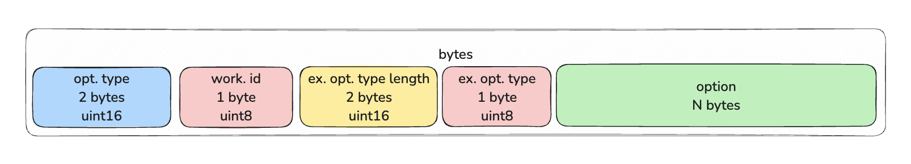

# Interaction with the LayerZero v2 Protocol. Part 3. Options, Features, PreCrime

**Author:** [Roman Yarlykov](https://github.com/rlkvrv) 🧐 

In the final part, we'll take a closer look at how options are formed, what types there are, and what they're used for. We'll also cover the additional PreCrime module.

## What types of options are there and how are they structured?  

The LayerZero protocol contains many features that are important to understand during development. One of these details is **options**.  

We've already used `options` many times in their simplest form, for example like this:  

```solidity
uint128 GAS_LIMIT = 50000; // gasLimit для Executor
uint128 MSG_VALUE = 0; // msg.value для lzReceive() (wei)

bytes memory options = OptionsBuilder.newOptions().addExecutorLzReceiveOption(GAS_LIMIT, MSG_VALUE);
```

The formation of options is handled by the [`OptionsBuilder`](https://github.com/LayerZero-Labs/devtools/blob/main/packages/oapp-evm/contracts/oapp/libs/OptionsBuilder.sol) library. The first thing `OptionsBuilder` does is call the `newOptions` function.


```solidity
function newOptions() internal pure returns (bytes memory) {
    return abi.encodePacked(TYPE_3);
}
```

The `OFTCore` contract inherits from `OAppOptionsType3`, which ensures that **all options must be of type `TYPE_3`** through `_assertOptionsType3`.  

Additionally, `OptionsBuilder::addExecutorLzReceiveOption` has the `onlyType3` modifier.  

Why can't `TYPE_1` and `TYPE_2` be used? These are outdated containers for packaging options from LayerZero v1. In LayerZero v2, only `TYPE_3` is used because it's more flexible and allows for extended functionality.  

### Container Contents 

Options of different types:  
- `TYPE_1` — contained only `gasLimit`.  
- `TYPE_2` — added the ability to transfer native tokens (`native drop`).  
- `TYPE_3` — includes additional parameters and allows combining options.  

The `TYPE_3` container consists of:  
- container type,  
- worker ID,  
- options size,  
- option type,  
- the options themselves. 

First, the container type (`TYPE_3`) is added: 

  

After that, the options themselves are formed. For example, in `addExecutorLzReceiveOption`, the data is encoded using the `ExecutorOptions` library:  

```solidity
// OptionsBuilder library
function addExecutorLzReceiveOption(
    bytes memory _options,
    uint128 _gas,
    uint128 _value
) internal pure onlyType3(_options) returns (bytes memory) {
    bytes memory option = ExecutorOptions.encodeLzReceiveOption(_gas, _value);
    return addExecutorOption(_options, ExecutorOptions.OPTION_TYPE_LZRECEIVE, option);
}

// ---------------------------------------------------------

// ExecutorOptions library
function encodeLzReceiveOption(uint128 _gas, uint128 _value) internal pure returns (bytes memory) {
    return _value == 0 ? abi.encodePacked(_gas) : abi.encodePacked(_gas, _value);
}
```

Here, `GAS_LIMIT` and `MSG_VALUE` are concatenated:

  

After that, the worker ID, size, and option type are added:  

```solidity
function addExecutorOption(
    bytes memory _options,
    uint8 _optionType,
    bytes memory _option
) internal pure onlyType3(_options) returns (bytes memory) {
    return abi.encodePacked(
        _options,
        ExecutorOptions.WORKER_ID,
        _option.length.toUint16() + 1, // размер опции + 1 байт для типа
        _optionType,
        _option
    );
}
```

The following are used here:  
- **Worker ID** (currently there are only two):  
  - Executor (`id = 1`) — processes options via [`ExecutorOptions`](https://github.com/LayerZero-Labs/LayerZero-v2/blob/main/packages/layerzero-v2/evm/messagelib/contracts/libs/ExecutorOptions.sol).  
  - DVN (`id = 2`) — uses [`DVNOptions`](https://github.com/LayerZero-Labs/LayerZero-v2/blob/main/packages/layerzero-v2/evm/messagelib/contracts/uln/libs/DVNOptions.sol).  
- **Option Type** (currently there are 5):
  - `OPTION_TYPE_LZRECEIVE` = 1  
  - `OPTION_TYPE_NATIVE_DROP` = 2  
  - `OPTION_TYPE_LZCOMPOSE` = 3  
  - `OPTION_TYPE_ORDERED_EXECUTION` = 4  
  - `OPTION_TYPE_LZREAD` = 5  

Final structure of `addExecutorLzReceiveOption`:  
- `worker id = 1` (Executor)  
- `option type = 1` (`OPTION_TYPE_LZRECEIVE`)  
- `option length = 17` (gasLimit = 16 bytes + 1 byte for type)  

If `value > 0`, the length of the `option` will be greater (`gasLimit 16 + value 16 + type 1 = 33 bytes`). In our case, a zero `value` is omitted.  
As a result, the options will be encoded like this:  

```bash
0003 01 0011 01 0000000000000000000000000000c350

opt.type | work.id | ex.opt.type.length | ex.opt.type |         option          |
uint16   | uint8   | uint16             | uint8       | uint128         | 0     |
3        | 1       | 17                 | 1           | 50000 (gasLimit)| value |
```

  
*Data layout in the TYPE_3 container* 

### Features of Setting Options  

Other options can be found in [`OptionsBuilder`](https://github.com/LayerZero-Labs/devtools/blob/main/packages/oapp-evm/contracts/oapp/libs/OptionsBuilder.sol).  

You can also try generating different types of options in [Remix](https://remix.ethereum.org/#url=https://docs.layerzero.network/LayerZero/contracts/OptionsGenerator.sol&lang=en&optimize=false&runs=200&evmVersion=null&version=soljson-v0.8.26+commit.8a97fa7a.js).

#### Working with gasLimit

The `gasLimit` parameter is calculated based on profiling gas consumption on the destination chain. The "cost" of executing opcodes may differ across blockchains, so it's important to consider the specifics of each network.  

Each blockchain has a **maximum gas limit** (`nativeCap`) that can be sent to the destination chain. This information can be retrieved via `Executor::dstConfig(dstEid)`, which returns a `DstConfig` struct:  

```solidity
struct DstConfig {
    uint64 baseGas;
    uint16 multiplierBps;
    uint128 floorMarginUSD;
    uint128 nativeCap;
}
```

- **`baseGas`** — fixed gas cost for basic operations (`lzReceive`, verification via security stack). This is the minimum amount of gas for the smallest message.  
- **`multiplierBps`** — multiplier in **basis points** (1 bps = 0.01%). Used to calculate additional gas depending on the message size.  
- **`floorMarginUSD`** — minimum fee in USD to prevent spam and cover costs. If the calculated transaction cost in USD is below this value, it is **set to `floorMarginUSD`**.  
- **`nativeCap`** — maximum gas limit that an OApp can specify for message execution on the destination chain.  

This data can be retrieved in a project by running the command: 

```bash
npx hardhat lz:oapp:config:get:executor
```

#### Native drop  

`Native drop` is the transfer of **native tokens** to the destination chain. For example, in `addExecutorLzReceiveOption`, the second parameter (`MSG_VALUE`) is used specifically for this.  

There is also a separate option `addExecutorNativeDropOption`, which takes `amount` (the sum) and `receiver` (the recipient address), and does not require specifying `gasLimit`:  

```solidity
function addExecutorNativeDropOption(
    bytes memory _options,
    uint128 _amount,
    bytes32 _receiver
) internal pure onlyType3(_options) returns (bytes memory) {
    bytes memory option = ExecutorOptions.encodeNativeDropOption(_amount, _receiver);
    return addExecutorOption(_options, ExecutorOptions.OPTION_TYPE_NATIVE_DROP, option);
}
```

*Note:* Previously, the protocol had a limit on native drop — 0.5 tokens in the native token equivalent of the network (e.g., ETH, BNB, etc.). Moreover, there was a warning that the larger the amount, the higher the transfer costs. This is no longer mentioned, but keep in mind that such limitations may still appear.

## PreCrime  

On the source chain, there are several mechanisms to validate a transaction before sending:  
- `quote`  
- `msgInspector`  
- `enforcedOptions`  

But on the **destination chain**, things are more complicated since the state of another blockchain is unknown.  

In the basic implementation of the OFT token, there's one smart contract we haven't looked at yet — [`OAppPreCrimeSimulator`](https://github.com/LayerZero-Labs/devtools/blob/05443835db976b7a528b883b19ddf02cb7f36d89/packages/oapp-evm/contracts/precrime/OAppPreCrimeSimulator.sol).  

This contract allows you to integrate [`PreCrime`](https://github.com/LayerZero-Labs/devtools/blob/05443835db976b7a528b883b19ddf02cb7f36d89/packages/oapp-evm/contracts/precrime/PreCrime.sol). The `PreCrime` module is used for **off-chain simulation of `_lzReceive`**, and is designed to work across all networks where the application is deployed. 

At the same time, the call to `OAppPreCrimeSimulator::lzReceiveAndRevert` **always** ends with a `revert`, and the simulation results are read from the `SimulationResult` error, where they are written using `PreCrime::buildSimulationResult`.  

This is an additional layer of security, but the **main feature** of PreCrime is its integration with the security stack. In other words, it has the authority to cancel transactions during the verification phase in the data transfer channel.

The backend can monitor transactions and use `PreCrime` to check the main invariants of the protocol. If a malicious transaction is detected, it is canceled in the `MessagingChannel` before it reaches the Executor.

## Conclusion

After reading these three articles, you should now have a more complete understanding of developing OApps in general and OFTs in particular, as well as how to properly estimate gas costs and choose the right options for sending messages.

There are still many interesting aspects in the LayerZero protocol — for example, handling protocol-level fees, deploying your own Executor, sending `compose` messages, using `lzRead` for off-chain transaction monitoring, and more. So this series of articles is just a starting point to help slightly lower the entry barrier for working with the protocol. 

## Links  
- [GitHub: LayerZero v2](https://github.com/LayerZero-Labs/LayerZero-v2)  
- [GitHub: LayerZero-Labs/devtools](https://github.com/LayerZero-Labs/devtools/blob/main/packages/oft-evm/contracts)  
- [Docs: LayerZero v2](https://docs.layerzero.network/v2)  
