# ONCHAINID: Onchain Identity Protocol (ERC-734 / ERC-735)

**Author:** [Aleksei Kutsenko](https://github.com/bimkon144) 👨‍💻

## 1. Introduction

ONCHAINID is a reference implementation of the [ERC-734](https://github.com/ethereum/EIPs/issues/734) (Key Manager) and [ERC-735](https://github.com/ethereum/EIPs/issues/735) (Claim Manager) standards for managing digital identities on the blockchain. Unlike traditional identification systems where a user is tied to a single wallet, ONCHAINID allows you to create an identity—a smart contract that:
- links multiple wallets to a single identity,  
- stores verifiable claims from trusted providers,  
- supports multi-level management through keys with different purposes,  
- allows actions to be executed on behalf of the identity via the execute/approve mechanism.


Protocol motivation: in the world of RWA, security tokens, and permissioned DeFi, having just a wallet is not enough.

Regulators require:  
- KYC/AML checks,  
- control over jurisdictions and sanctions lists,  
- the ability to recover access to assets if keys are lost,  
- revocation of access rights when a user's status changes.

ONCHAINID solves these problems through onchain claims that can be verified and revoked without the identity holder's involvement. At the same time, private data (passport, address) remains off-chain with KYC providers—only signatures and metadata are stored onchain.

**Relation to ERC-3643 (T-REX):**

The protocol was originally developed as a critical component of [ERC-3643 (T-REX)](https://eips.ethereum.org/EIPS/eip-3643) to implement a **permissioned** approach: where an investor physically cannot purchase a security token without meeting all regulatory requirements. Checks are built into the token's smart contract, and regulators can audit compliance via the public blockchain.

ONCHAINID can be used independently for any scenarios where onchain identity with verifiable attributes is required: permissioned DeFi, DAOs with participant requirements.

In this article, we look at ONCHAINID as a protocol:  
- which contracts it includes and how they interact,  
- how key-based management works (ERC-734),  
- how claims and their verification work (ERC-735),  
- how upgrades are implemented via ImplementationAuthority,  
- how Factory and Gateway provide deterministic addresses using CREATE2,

---

## 2. Terms

**Identity (ONCHAINID / Identity contract)** – the identity smart contract that implements the ERC-734 (key management) and ERC-735 (claims management) standards. It serves as a "digital passport" for a user or organization on the blockchain.

**ERC-734 (Key Manager)** – a standard for managing keys within an identity contract. It allows adding/removing keys with different purposes and executing actions through the approve/execute mechanism.

**ERC-735 (Claim Manager)** – a standard for managing claims in an identity contract. It defines the structure of a claim and methods for adding, verifying, and removing them.

**Key** – an address identifier in the identity contract. Typically represented as `keccak256(abi.encode(address))`. Each key has a purpose and a keyType (signature type).

**Claim (attestation)** – a statement about the identity holder, signed by a Claim Issuer. For example: "KYC passed", "country of residence: USA", "accredited investor". Stored onchain as a structure with topic, scheme, issuer, signature, data, and uri.

**Claim Topic** – the type of claim, represented as a `uint256` (e.g., 1 = KYC, 2 = AML, 3 = COUNTRY). The ecosystem agrees on how to interpret the topic ID.

**Claim Issuer** – a provider contract that:  
- signs claims for an identity,  
- verifies the validity of signatures,  
- maintains a revocation registry for claims.

The Claim Issuer is itself an Identity contract but acts as a "certification authority".

**Execute / Approve** – the ERC-734 mechanism for executing actions on behalf of an identity. Anyone can create an execution request via `execute()`, but it requires `approve()` from a key with the appropriate purpose to be carried out.

---

## 3. General Architecture of ONCHAINID

ONCHAINID consists of a set of interconnected smart contracts.


**System Components:**

**User Identity (Proxy + Implementation)** – the main contract, composed of two parts:

**Identity Proxy** (deployed via Factory):  
- Stores data: keys (with purposes), claims (attestations), executions (requests to execute a function in an external or internal contract),  
- Delegates all calls to the Implementation via `delegatecall`,  
- On each call, retrieves the Implementation address from the ImplementationAuthority,

**Identity Implementation** (shared logic for all Identities):  
- Contains the logic: addKey, removeKey, addClaim, removeClaim, execute, approve,  
- Stateless contract – does not store data, operates on the Proxy’s storage via `delegatecall`,  
- Can be updated via ImplementationAuthority for all Proxies at once.

**Claim Issuer** – a regular contract (deployed directly, without proxy):  
- Acts as a certification authority for issuing claims,  
- Holds keys for signing claims,  
- Provides the `isClaimValid()` method to verify claim validity,  
- Maintains a registry of revoked signatures (`revokedClaims` mapping),  
- Can revoke claims via `revokeClaimBySignature()`.

**ImplementationAuthority** – centralized contract for managing logic:  
- Stores the current Implementation address for Identity contracts,  
- The `getImplementation()` method returns the current logic address,  
- Allows updating the Implementation for all Proxies in a single transaction,

**IdFactory** – factory for deploying Identity Proxies:  
- Creates Identity Proxies using CREATE2 (deterministic addresses),  
- Initializes the Proxy upon creation: links it to the ImplementationAuthority, adds a management key for the owner,  
- Protects against reuse of salts (identity theft protection),  
- Stores a mapping of used salts.

**Gateway** – public interface for deployment:  
- Allows users to deploy an identity themselves (not just the Factory owner),  
- Automatically generates `salt = keccak256(wallet)` for deterministic addresses,  
- Optionally supports custom salts with a signed permission from a trusted deployer,  
- Calls IdFactory to create the Proxy.

### 3.1. Participants and Roles

ONCHAINID uses a key-based access control system within Identity contracts and Ownable for infrastructure contracts.

---

**Roles in Identity**

The Identity is managed through keys with different purposes.

**MANAGEMENT key (purpose 1)** – the `onlyManager` modifier checks `keyHasPurpose(keccak256(abi.encode(msg.sender)), 1)`:
- `addKey(key, purpose, keyType)` – adds new keys (of any purpose)  
- `removeKey(key, purpose)` – removes keys  
- `approve(executionId, bool)` – approves execution requests targeting **the identity itself** (`to == address(this)`)  
- `execute()` – creates execution requests  
- Effectively has **full control** over the identity

**ACTION key (purpose 2)** – checked via `keyHasPurpose(keccak256(abi.encode(msg.sender)), 2)`:
- `approve(executionId, bool)` – approves execution requests targeting **external contracts** (`to != address(this)`)  
- `execute()` automatically approves execution for external contracts if the sender has an ACTION key  
- Used for everyday operations (transfers, interacting with DeFi)  
- **Cannot** manage keys or claims  
- **Cannot** approve executions targeting the identity itself (protection against compromise)

**CLAIM signer key (purpose 3)** – the `onlyClaimKey` modifier checks `keyHasPurpose(keccak256(abi.encode(msg.sender)), 3)`:
- `addClaim(...)` – adds claims  
- `removeClaim(claimId)` – removes claims  
- Used for claim-related operations, but **cannot** manage keys

**ENCRYPTION key (purpose 4)** – keys for data encryption:  
- Intended for storing public encryption keys (e.g., RSA, ECIES)  
- Used to encrypt sensitive data that may be stored in claims (personal data, documents, medical records)  
- Off-chain applications can use these keys to:  
  - Encrypt data before saving it in `claim.data` or `claim.uri`  
  - Decrypt data when reading claims  
  - Ensure confidentiality when transferring data between participants  
> **Important:** The ENCRYPTION key does **not** grant any rights within the Identity contract – it is metadata for external systems only

**Permissions Table:**

| Target Contract | MANAGEMENT key | ACTION key | CLAIM key | Any Address |
|----------------|----------------|------------|-----------|-------------|
| **Identity itself** (addKey, removeKey) | ✅ Can approve | ❌ Cannot approve | ❌ Cannot approve | ❌ Cannot approve |
|  **External contract** (transfer, swap) | ✅ Can approve | ✅ Can approve | ❌ Cannot approve | ❌ Cannot approve |
| **Execute (create request)** | ✅ + auto-approve | ✅ + auto-approve for external | ❌ Cannot approve | ✅ Request creation only |

---

**Roles in Claim Issuer**

The Claim Issuer is the same Identity contract (it inherits from it but with additional functionality), acting as a certification authority. Management is done using the same purposes:

**MANAGEMENT key (purpose 1)** in Claim Issuer:  
- `revokeClaim(claimId, identity)` – revokes a claim by ID  
- `revokeClaimBySignature(signature)` – revokes a claim by signature  
- Manages keys of the Claim Issuer  
- Manages claims of the Claim Issuer itself

**CLAIM signer key (purpose 3)** in Claim Issuer:  
- Used for **off-chain signing of claims**  
- When `isClaimValid()` is called, the Claim Issuer checks that the signature was made by a key with **purpose 3** (CLAIM signer)  
- If the key is removed from the Claim Issuer, all its signatures become invalid

---

**Roles in ImplementationAuthority**

**Owner (Ownable)** – full control:  
- `updateImplementation(address)` – updates the implementation for all proxies  
- `transferOwnership(address)` – transfers ownership

---

**Roles in IdFactory**

**Owner (Ownable)**:  
- `setImplementationAuthority(address)` – changes the authority for new identities  
- `transferOwnership(address)` – transfers ownership

---

**Roles in Gateway**

**Owner (Ownable)**:  
- Manages trusted deployers (who can deploy with custom salts)  
- Changes the Factory address  
- Transfers ownership

**Any User** (public):  
- `deployIdentity(wallet)` – deploys with auto-generated salt = keccak256(wallet)  
- `deployIdentityWithSalt(wallet, salt, signature)` – deploys with a custom salt (requires signature from a trusted deployer)

### 3.2. How Components Interact

**Calling a method on Identity:**

So, following the flow and assuming all contracts are deployed, it looks like this:

1. The user calls a method on the Identity Proxy address (e.g., `addKey()`)  
2. The Proxy calls `ImplementationAuthority.getImplementation()`  
3. The Authority returns the address of the Identity Implementation  
4. The Proxy makes a `delegatecall` to the Implementation, which executes the logic using the Proxy's storage

### 3.3. Deployment and Its Types

**Two approaches to deploying an Identity:**

Deployment can be done independently by users through the Gateway, or centrally via backend using the Factory. Each approach has its own advantages:

**Deployment via Factory (backend/owner controlled):**

Advantages:  
- **Full control over salt**: Backend can ensure strict determinism of addresses (same addresses across networks)  
- **Centralized management**: Backend can control who gets an identity and when  
- **Better UX for users**: Users don’t need to pay gas or understand the deployment process  
- **Batch operations**: Backend can deploy multiple identities in a single transaction (gas efficient)  
- **KYC integration**: Identities can be deployed only after successful off-chain KYC  
- **Predictability**: Backend knows the identity address in advance and can prepare claims before deployment

Disadvantages:  
- **Centralization**: Only the Factory owner can deploy (single point of failure)  
- **Backend dependency**: If the backend is unavailable, users can’t get their identity  
- **Costs for the issuer**: Backend pays the gas fees for all deployments

**Deployment via Gateway (self-service or with permissions):**

Advantages:  
- **Decentralization**: Anyone can create an identity without the owner's permission  
- **Independence**: Users aren’t dependent on backend availability  
- **Self-custody**: The user pays for gas and controls the creation process  
- **Determinism for the user**: Salt is generated from the wallet address – the user can recreate the same identity on another network  
- **Public access**: Suitable for mass adoption (anyone can start using it)

Disadvantages:  
- **User pays for gas**: Entry barrier for new users  
- **Complexity for users**: Requires understanding the process and having native tokens for gas  
- **Less control**: Can’t restrict who creates an identity (in public mode)

**Identity creation happens as follows:**

```mermaid
%%{init: {
  "theme": "base",
  "themeVariables": {
    "background": "#ffffff",
    "primaryColor": "#ffffff",
    "secondaryColor": "#ffffff",
    "tertiaryColor": "#ffffff",
    "primaryBorderColor": "#000000",
    "lineColor": "#000000",
    "textColor": "#000000",
    "primaryTextColor": "#000000",
    "fontFamily": "Caveat, ui-sans-serif, system-ui"
  },
  "flowchart": { "curve": "basis" }
}}%%

flowchart TB

classDef card fill:transparent,stroke:#000000,color:#000000,stroke-width:2px,rx:14,ry:14;
classDef proxy fill:transparent,stroke:#000000,color:#000000,stroke-width:3px,rx:14,ry:14;
linkStyle default stroke:#000000,stroke-width:2px;

User[👤 User]:::card
G[🌐 Gateway]:::card
F[🏭 IdFactory]:::card
P[🔷 Identity Proxy]:::proxy
IA[📋 ImplementationAuthority]:::card
I[📦 Implementation]:::card

Step1[1. deployIdentity]:::card
Step2[2. Generate salt]:::card
Step3[3. createIdentity]:::card
Step4[4. Check salt]:::card
Step5[5. Deploy Proxy<br/>CREATE2]:::card
Step6[6. Initialize]:::card
Step6a[6a. Save Authority<br/>address]:::card
Step6b[6b. Call initwallet<br/>via delegatecall]:::card
Step6c[6c. Add wallet<br/>MANAGEMENT key]:::card
Step7[7. Save salt]:::card
Step8[8. Return address]:::card

User --> Step1
Step1 --> G
G --> Step2
Step2 --> Step3
Step3 --> F
F --> Step4
Step4 --> Step5
Step5 --> P
P --> Step6
Step6 --> Step6a
Step6a --> IA
Step6a --> Step6b
Step6b --> I
P -.->|delegatecall| I
Step6b --> Step6c
Step6c --> P
F --> Step7
Step7 --> Step8
Step8 --> User
```



1. The user calls `Gateway.deployIdentity(wallet)`  
2. Gateway generates `salt = keccak256(wallet)` (deterministic)  
3. Gateway calls `IdFactory.createIdentity(wallet, salt)`  
4. Factory checks: salt hasn’t been used before  
5. Factory deploys the Identity Proxy via CREATE2 with the given salt  
6. Proxy is initialized:  
   - Stores the address of the ImplementationAuthority in storage  
   - Calls `Implementation.init(wallet)` via delegatecall  
   - Adds the wallet as a MANAGEMENT key (purpose 1)  
7. Factory stores the `salt` in a mapping  
8. The address of the created Identity Proxy is returned

Once the Identity contract is created (via Factory or Gateway), the next step is adding claims — attestations from trusted providers. Claims allow proving that the identity has passed KYC, belongs to a specific jurisdiction, has investor status, etc.

### 3.4. Working with Claims

The process of adding a claim depends on the type of claim and the Claim Issuer's policy.

**Scenario A: Investor adds a claim manually**

This scenario is used when the Claim Issuer signs the claim off-chain and sends the signature to the investor (via email, API, UI, etc.). The investor then adds the claim to their own Identity contract.

**Who can add it:** The Identity owner (via purpose 3 or 1)

**Process:**

1. **Off-chain stage:** The Claim Issuer (e.g., a KYC provider) verifies the investor’s documents and signs the claim:
   ```solidity
   bytes32 dataHash = keccak256(abi.encode(identityAddress, topic, data));
   bytes memory signature = claimIssuerKey.sign(dataHash);
   ```
   The signature is sent to the investor off-chain.

2. **On-chain stage:** The investor (using a wallet with a CLAIM key, purpose 3) calls on their [Identity](https://github.com/onchain-id/solidity/blob/a483cda6821e3883497972d36d0c4c1e1693e483/contracts/Identity.sol#L342):
   ```solidity
   identity.addClaim(topic, scheme, issuerAddress, signature, data, uri);
   ```

3. **Validation:** Claim verification on [ClaimIssuer](https://github.com/onchain-id/solidity/blob/a483cda6821e3883497972d36d0c4c1e1693e483/contracts/ClaimIssuer.sol#L46):
   - Calls `claimIssuer.isClaimValid(identity, topic, signature, data)`  
   - The Claim Issuer checks:  
     - The signature is valid and made by a key with purpose 3 (CLAIM signer) in the Claim Issuer contract  
     - The signature is not revoked: `!revokedClaims[signature]`  
   - If the check passes, the claim is stored  
   - Emits a `ClaimAdded` event

```mermaid
%%{init: {
  "theme": "base",
  "themeVariables": {
    "background": "#ffffff",
    "primaryColor": "#ffffff",
    "secondaryColor": "#ffffff",
    "tertiaryColor": "#ffffff",
    "primaryBorderColor": "#000000",
    "lineColor": "#000000",
    "textColor": "#000000",
    "primaryTextColor": "#000000",
    "fontFamily": "Caveat, ui-sans-serif, system-ui"
  },
  "flowchart": { "curve": "basis" }
}}%%

flowchart LR

classDef card fill:transparent,stroke:#000000,color:#000000,stroke-width:2px,rx:14,ry:14;
classDef proxy fill:transparent,stroke:#000000,color:#000000,stroke-width:3px,rx:14,ry:14;
linkStyle default stroke:#000000,stroke-width:2px;

CI[📜 Claim Issuer]:::card
Investor[👤 Investor<br/>CLAIM key]:::card
ID[🔷 Identity]:::proxy

Step1[1. Offchain<br/>Sign claim]:::card
Step2[2. Send signature<br/>to investor]:::card
Step3[3. addClaim]:::card
Step4[4. isClaimValid]:::card

CI --> Step1
Step1 --> Step2
Step2 --> Investor
Investor --> Step3
Step3 --> ID
ID --> Step4
Step4 --> CI
```



**Scenario B: Claim Issuer adds a claim via execute/approve**

This scenario is used when the Claim Issuer wants to automate the process and initiates the claim addition on-chain. The final approval is left to the Identity owner (via approve).

**Who can add it:** Claim Issuer initiates, but the Identity owner must approve (via MANAGEMENT key)

**Process:**

1. **Claim Issuer initiates:** The Claim Issuer [calls](https://github.com/onchain-id/solidity/blob/a483cda6821e3883497972d36d0c4c1e1693e483/contracts/Identity.sol#L79):
   ```solidity
   identity.execute(
       address(identity),  // target = the identity itself
       0,                   // value = 0
       abi.encodeWithSignature(
           "addClaim(uint256,uint256,address,bytes,bytes,string)",
           topic, scheme, issuerAddress, signature, data, uri
       )
   );
   ```
   This creates an execution request in the Identity contract.

2. **Identity Owner approves:** The owner (via MANAGEMENT key) receives a notification and [approves](https://github.com/onchain-id/solidity/blob/a483cda6821e3883497972d36d0c4c1e1693e483/contracts/Identity.sol#L220):
   ```solidity
   identity.approve(executionId, true);
   ```
  The Identity executes `addClaim()` and stores the claim.

```mermaid
%%{init: {
  "theme": "base",
  "themeVariables": {
    "background": "#ffffff",
    "primaryColor": "#ffffff",
    "secondaryColor": "#ffffff",
    "tertiaryColor": "#ffffff",
    "primaryBorderColor": "#000000",
    "lineColor": "#000000",
    "textColor": "#000000",
    "primaryTextColor": "#000000",
    "fontFamily": "Caveat, ui-sans-serif, system-ui"
  },
  "flowchart": { "curve": "basis" }
}}%%

flowchart LR

classDef card fill:transparent,stroke:#000000,color:#000000,stroke-width:2px,rx:14,ry:14;
classDef proxy fill:transparent,stroke:#000000,color:#000000,stroke-width:3px,rx:14,ry:14;
linkStyle default stroke:#000000,stroke-width:2px;

CI[📜 Claim Issuer]:::card
Step1[1. execute<br/>addClaim]:::card
ID[🔷 Identity]:::proxy
Step2[2. Execution<br/>request created]:::card
Owner[👤 Owner<br/>MANAGEMENT key]:::card
Step3[3. approve]:::card
Step4[4. Execute<br/>addClaim]:::card
Step5[5. isClaimValid]:::card

CI --> Step1
Step1 --> ID
ID --> Step2
Step2 --> Owner
Owner --> Step3
Step3 --> ID
ID --> Step4
Step4 --> Step5
Step5 --> CI
```



**Scenario C: Backend manages the identity on behalf of the investor**

This scenario is used in enterprise setups and T-REX, where the backend (token issuer, custodian, platform) fully manages the investor’s identity. The backend deploys the identity with MANAGEMENT keys assigned to itself and adds claims without the investor’s involvement.

**Who can add it:** The backend (using a CLAIM key that it assigns to itself via a MANAGEMENT key)

**Process:**

1. **Backend deploys the identity with MANAGEMENT keys:** The backend uses a specific [method](https://github.com/onchain-id/solidity/blob/a483cda6821e3883497972d36d0c4c1e1693e483/contracts/factory/IdFactory.sol#L82) Factory, which allows adding MANAGEMENT keys at the time of creation:
   ```solidity
   bytes32[] memory managementKeys = new bytes32[](2);
   managementKeys[0] = keccak256(abi.encode(backendWallet1));  // first backend wallet
   managementKeys[1] = keccak256(abi.encode(backendWallet2));  // second backend wallet (multisig)

   factory.createIdentityWithManagementKeys(
       investorWallet,        // investor address
       "investor-123-v1",     // custom salt
       managementKeys        // MANAGEMENT keys for backend
   );
   ```
   
   This method: 
   - Deploys the Identity Proxy via CREATE2
   - Immediately adds the specified MANAGEMENT keys (backend wallets) 
   - Does **not** add `investorWallet` as a MANAGEMENT key (the investor cannot manage it)
   - Links the `investorWallet` to the identity

2. **Backend adds a CLAIM key for itself:** The backend (via a MANAGEMENT key) [adds](https://github.com/onchain-id/solidity/blob/a483cda6821e3883497972d36d0c4c1e1693e483/contracts/Identity.sol#L181) a CLAIM key for managing claims:
   ```solidity
   identity.addKey(
       keccak256(abi.encode(backendWallet)),
       3,  // CLAIM purpose
       1   // ECDSA
   );
   ```

3. **Backend adds a claim:** The backend (using its CLAIM key) [calls](https://github.com/onchain-id/solidity/blob/a483cda6821e3883497972d36d0c4c1e1693e483/contracts/Identity.sol#L342) directly:
   ```solidity
   identity.addClaim(topic, scheme, issuerAddress, signature, data, uri);
   ```
   No approval is required – the backend has full control via the CLAIM key.

```mermaid
%%{init: {
  "theme": "base",
  "themeVariables": {
    "background": "#ffffff",
    "primaryColor": "#ffffff",
    "secondaryColor": "#ffffff",
    "tertiaryColor": "#ffffff",
    "primaryBorderColor": "#000000",
    "lineColor": "#000000",
    "textColor": "#000000",
    "primaryTextColor": "#000000",
    "fontFamily": "Caveat, ui-sans-serif, system-ui"
  },
  "flowchart": { "curve": "basis" }
}}%%

flowchart TB

classDef card fill:transparent,stroke:#000000,color:#000000,stroke-width:2px,rx:14,ry:14;
classDef proxy fill:transparent,stroke:#000000,color:#000000,stroke-width:3px,rx:14,ry:14;
linkStyle default stroke:#000000,stroke-width:2px;

Backend[💻 Backend<br/>MANAGEMENT key]:::card
F[🏭 Factory]:::card
ID[🔷 Identity]:::proxy

Step1[1. Deploy identity<br/>with MANAGEMENT keys]:::card
Step2[2. Add CLAIM key]:::card
Step3[3. addClaim]:::card
Step4[4. Save claim]:::card

Backend --> Step1
Step1 --> F
F --> ID
Backend --> Step2
Step2 --> ID
Backend --> Step3
Step3 --> ID
ID --> Step4
```



**Investor is not involved:** The investor is unaware of the process, doesn’t pay gas, and doesn’t manage keys. The backend has full control over the identity. The investor can use their wallet for operations (e.g., token transfers), but cannot manage the identity (add/remove keys or claims).

**Advantages of this approach:**  
- **Investor UX:** The investor does nothing, everything happens automatically  
- **Centralized management:** The backend can batch-add claims for many investors  
- **KYC integration:** The backend can automatically add claims after successful off-chain KYC  
- **Recovery:** The backend can easily restore access if the investor loses their keys

**Disadvantages:**  
- **Centralization:** The investor doesn’t control their identity  
- **Trust:** The investor must trust the backend  
- **Risk:** If the backend is compromised, an attacker can control the identity

**When to use each scenario:**

- **Scenario A (investor adds):** For self-sovereign identity, where the investor wants full control. The Claim Issuer doesn’t pay gas. Suitable for public DeFi, DAOs, and decentralized systems.

- **Scenario B (Claim Issuer initiates):** For automated systems where the Claim Issuer wants to "push" the claim, but the final decision is up to the investor. Requires a notification mechanism for the Identity owner. Suitable for hybrid systems with partial automation.

- **Scenario C (backend manages):** For enterprise solutions, T-REX tokens, custodial services where the backend needs full control over the compliance process. The investor does not participate in identity management. Suitable for security tokens, RWA, and institutional investors.

### 3.5. Logic Upgrade (upgrade)

One of the advantages of the Proxy + ImplementationAuthority architecture is the ability to upgrade the logic of all Identity contracts at once (essentially a Beacon pattern), without changing their addresses or storage.

```mermaid
%%{init: {
  "theme": "base",
  "themeVariables": {
    "background": "#ffffff",
    "primaryColor": "#ffffff",
    "secondaryColor": "#ffffff",
    "tertiaryColor": "#ffffff",
    "primaryBorderColor": "#000000",
    "lineColor": "#000000",
    "textColor": "#000000",
    "primaryTextColor": "#000000",
    "fontFamily": "Caveat, ui-sans-serif, system-ui"
  },
  "flowchart": { "curve": "basis" }
}}%%

flowchart TB

classDef card fill:transparent,stroke:#000000,color:#000000,stroke-width:2px,rx:14,ry:14;
classDef proxy fill:transparent,stroke:#000000,color:#000000,stroke-width:3px,rx:14,ry:14;
linkStyle default stroke:#000000,stroke-width:2px;

subgraph Before["Before Upgrade"]
direction TB
P1[🔷 Identity Proxy<br/>storage: keys, claims]:::proxy
A1[📋 Implementation<br/>Authority]:::card
I1[📦 Implementation<br/>v1.0.0]:::card
P1 -->|getImplementation| A1
A1 -->|returns address| I1
P1 -.->|delegatecall| I1
end
style Before fill:none,stroke:#000000,stroke-width:2px,rx:18,ry:18;

subgraph Upgrade["Upgrade Process"]
direction TB
Owner[👨‍💻 Owner Authority]:::card
Deploy[1. Deploy new<br/>Implementation v1.1.0]:::card
Update[2. updateImplementation<br/>newAddress]:::card
A2[📋 Authority<br/>updated]:::card
Owner -->|deploys| Deploy
Deploy -->|calls| Update
Update -->|updates storage| A2
end
style Upgrade fill:none,stroke:#000000,stroke-width:2px,rx:18,ry:18;

subgraph After["After Upgrade"]
direction TB
P2[🔷 Identity Proxy<br/>storage: keys, claims<br/>unchanged]:::proxy
A3[📋 Implementation<br/>Authority]:::card
I2[📦 Implementation<br/>v1.1.0]:::card
P2 -->|getImplementation| A3
A3 -->|returns new address| I2
P2 -.->|delegatecall| I2
end
style After fill:none,stroke:#000000,stroke-width:2px,rx:18,ry:18;

Before --> Upgrade
Upgrade --> After
```



**Upgrade Process:**

1. The ImplementationAuthority owner deploys a new Identity Implementation contract with updated logic (bug fixes, new features, optimizations).

2. The owner calls `Authority.updateImplementation(newImplementationAddress)` to register the new version.

3. The Authority updates the Implementation address in its storage.

4. On the next call to any Identity Proxy:  
   - `Proxy.fallback()` intercepts the call  
   - Proxy queries `getImplementation()` from the Authority  
   - Authority returns the address of the new Implementation  
   - Proxy performs a `delegatecall` to the new logic

5. All Identity Proxies automatically start using the new logic. Storage remains in the Proxy (unchanged), so all data (keys, claims, executions) is preserved.

Updating the Implementation affects all Identity Proxies at once. This is a powerful tool but requires caution — the Authority owner should be protected (multisig, DAO, timelock).

---

## 4. In-Depth Breakdown of ONCHAINID Mechanics

### 4.1. Key management

The Identity contract [stores](https://github.com/onchain-id/solidity/blob/a483cda6821e3883497972d36d0c4c1e1693e483/contracts/storage/Storage.sol#L10) [keys](https://github.com/onchain-id/solidity/blob/a483cda6821e3883497972d36d0c4c1e1693e483/contracts/storage/Structs.sol#L16) as follows:

```solidity
struct Key {
    uint256[] purposes;  // an array purposes: [1] = MANAGEMENT, [2] = ACTION, [3] = CLAIM, [4] = ENCRYPTION
    uint256 keyType;     // 1 = ECDSA, 2 = RSA
    bytes32 key;         // keccak256(abi.encode(address))
}

mapping(bytes32 => Key) public keys;
mapping(uint256 => bytes32[]) public keysByPurpose;  // an array of keys for each purpose
```

**Flow diagram of adding a key:**

```mermaid
%%{init: {
  "theme": "base",
  "themeVariables": {
    "background": "#ffffff",
    "primaryColor": "#ffffff",
    "secondaryColor": "#ffffff",
    "tertiaryColor": "#ffffff",
    "primaryBorderColor": "#000000",
    "lineColor": "#000000",
    "textColor": "#000000",
    "primaryTextColor": "#000000",
    "fontFamily": "Caveat, ui-sans-serif, system-ui"
  },
  "flowchart": { "curve": "basis" }
}}%%

flowchart TB

classDef card fill:transparent,stroke:#000000,color:#000000,stroke-width:2px,rx:14,ry:14;
classDef decision fill:transparent,stroke:#000000,color:#000000,stroke-width:2px,rx:14,ry:14;
linkStyle default stroke:#000000,stroke-width:2px;

Start[addKey]:::card

Check1{Key<br/>exists?}:::decision

Check2{Purpose<br/>exists?}:::decision

Conflict[❌ Revert]:::card

AddPurpose[➕ Add purpose]:::card

CreateKey[🆕 New key]:::card

AddToPurpose[📋 keysByPurpose]:::card

Emit[📢 KeyAdded]:::card

Success[✅ Success]:::card

Start --> Check1

Check1 -->|Yes| Check2
Check1 -->|No| CreateKey

Check2 -->|Yes| Conflict
Check2 -->|No| AddPurpose

AddPurpose --> AddToPurpose
CreateKey --> AddToPurpose

AddToPurpose --> Emit
Emit --> Success
```



**Core key management logic:**

**`addKey(bytes32 _key, uint256 _purpose, uint256 _type)`** - only MANAGEMENT key:
- Key exists: checks for conflicts and adds the purpose to the array  
- New key: creates a Key struct  
- Updates `keysByPurpose[_purpose]`

**`removeKey(bytes32 _key, uint256 _purpose)`** – only allowed by a MANAGEMENT key:  
- Removes a single purpose from the array  
- If it's the last purpose: deletes the entire key

**`keyHasPurpose(bytes32 _key, uint256 _purpose)`** – permission check:  
- MANAGEMENT key (purpose 1) has all permissions  
- Returns true if the key has the required purpose

**Important Notes:**

1. **One key = multiple purposes:** A key can have multiple purposes at the same time (e.g., MANAGEMENT + ACTION + CLAIM). This allows a single address to perform multiple roles.

2. **keysByPurpose for optimization:** The `keysByPurpose[purpose]` mapping stores an array of all keys with a given purpose, allowing for fast lookup via `getKeysByPurpose(purpose)`.

3. **Key format:** Keys are stored as `keccak256(abi.encode(address))`, not as plain `address`. This follows ERC-734, where a key can be not only an EOA address but also any arbitrary public key.

### 4.2. Execute / Approve: Account Abstraction via ERC-734

ONCHAINID implements a "proposal + approval" mechanism to perform actions on behalf of the identity.

**Execution structure:**

```solidity
struct Execution {
    address to;          // target contract
    uint256 value;       // ETH value
    bytes data;          // calldata
    bool approved;       // whether the execution is approved
    bool executed;       // whether the execution is completed
}

mapping(uint256 => Execution) public executions;
uint256 public executionNonce;
```

**Flow diagram of Execute/Approve:**

```mermaid
%%{init: {
  "theme": "base",
  "themeVariables": {
    "background": "#ffffff",
    "primaryColor": "#ffffff",
    "secondaryColor": "#ffffff",
    "tertiaryColor": "#ffffff",
    "primaryBorderColor": "#000000",
    "lineColor": "#000000",
    "textColor": "#000000",
    "primaryTextColor": "#000000",
    "fontFamily": "Caveat, ui-sans-serif, system-ui"
  },
  "flowchart": { "curve": "basis" }
}}%%

flowchart TB

classDef card fill:transparent,stroke:#000000,color:#000000,stroke-width:2px,rx:14,ry:14;
classDef decision fill:transparent,stroke:#000000,color:#000000,stroke-width:2px,rx:14,ry:14;
linkStyle default stroke:#000000,stroke-width:2px;

Start[execute]:::card

Create[📝 Create request]:::card

Check1{MANAGEMENT<br/>key?}:::decision

AutoApprove1[✅ Auto approve]:::card

Check2{ACTION key<br/>+ external?}:::decision

AutoApprove2[✅ Auto approve]:::card

Pending[⏳ Pending]:::card

Execute[⚙️ Execute call]:::card

Success[✅ Success]:::card
Fail[❌ Failed]:::card

Start --> Create
Create --> Check1

Check1 -->|Yes| AutoApprove1
Check1 -->|No| Check2

Check2 -->|Yes| AutoApprove2
Check2 -->|No| Pending

AutoApprove1 --> Execute
AutoApprove2 --> Execute

Execute --> Success
Execute --> Fail
```



**Core logic:**

**`execute(address _to, uint256 _value, bytes memory _data)`** – public function (anyone can call):  
- Creates an execution request with a unique ID  
- MANAGEMENT key: automatically approves any execution  
- ACTION key: automatically approves only external contracts (target != identity)  
- Others: execution remains pending

**`approve(uint256 _id, bool _approve)`** – approves an execution:  
- Target = identity: requires a MANAGEMENT key  
- Target = external: requires an ACTION key  
- Executes the call and emits events (`Executed` / `ExecutionFailed`)

**Examples**

```solidity
// MANAGEMENT key can approve any execution  
identity.execute(address(identity), 0, abi.encodeWithSignature("addKey(...)"));  
// Automatically approved and executed

// ACTION key can only approve external contract calls  
identity.execute(tokenAddress, 0, abi.encodeWithSignature("transfer(...)"));  
// Automatically approved and executed

// ACTION key CANNOT approve execution targeting the identity itself  
identity.execute(address(identity), 0, abi.encodeWithSignature("removeKey(...)"));  
// Pending – requires approval from a MANAGEMENT key
```

The execute/approve mechanism turns the Identity contract into a smart contract wallet with account abstraction: any address can propose an action, while key holders control its execution. This separation of initiation (who can create a request) and authorization (who can approve it) is critical for both security and usability.

### 4.3. Claims: Structure, Addition, and Verification

Let's take a look at what a [Claim looks like](https://github.com/onchain-id/solidity/blob/a483cda6821e3883497972d36d0c4c1e1693e483/contracts/storage/Structs.sol#L63) and where it is [stored](https://github.com/onchain-id/solidity/blob/a483cda6821e3883497972d36d0c4c1e1693e483/contracts/storage/Storage.sol#L22) using the `identity.sol` contract as an example:

**Claim Structure:**

```solidity
struct Claim {
    uint256 topic;      // type of the claim (KYC, AML, COUNTRY, etc.)
    uint256 scheme;     // verification scheme (how to validate the signature and data)
    address issuer;     // address of the Claim Issuer contract
    bytes signature;    // claim signature
    bytes data;         // data (hash, encoded data, encrypted data)
    string uri;         // URI to off-chain data (IPFS, HTTPS, Swarm)
}

mapping(bytes32 => Claim) public claims;
mapping(uint256 => bytes32[]) public claimsByTopic;
```

Claim ID is [generated](https://github.com/onchain-id/solidity/blob/a483cda6821e3883497972d36d0c4c1e1693e483/contracts/Identity.sol#L360) deterministically:
```solidity
bytes32 claimId = keccak256(abi.encode(issuer, topic));
```
One issuer can have exactly one claim per topic. A repeated `addClaim` will overwrite the existing claim.

**Field `topic` – claim type:**

The topic defines the category of the claim. It’s a `uint256` interpreted by the ecosystem. Standard values include:

- **1**: KYC (Know Your Customer) – identity verification completed  
- **2**: AML (Anti-Money Laundering) – passed anti-money laundering check  
- **3**: COUNTRY – country of residence  
- **4**: ACCREDITED – accredited investor status  
- **5**: INVESTOR_TYPE – type of investor (retail, professional, institutional)

The ecosystem can define its own topic IDs.

**Field `scheme` – verification scheme:**

The scheme defines how to interpret and verify the `signature` and `data` fields. According to ERC-735:

- **1**: ECDSA signature (standard) – signed with an ECDSA private key  
- **2**: RSA signature – signed with an RSA private key  
- **3**: Self-attested claim – claim signed by the identity owner themselves  
- **4**: Contract verification – validated via external contract call

**Most commonly used scheme = 1 (ECDSA):**
```solidity
// The Claim Issuer signs the claim using an ECDSA key
bytes32 dataHash = keccak256(abi.encode(identityAddress, topic, data));
bytes32 prefixedHash = keccak256(abi.encodePacked("\x19Ethereum Signed Message:\n32", dataHash));
bytes memory signature = sign(prefixedHash);  // ECDSA signature

// During verification via ClaimIssuer.isClaimValid():  
// - recovers the signer address from the signature (ecrecover)  
// - checks that the address has a CLAIM key (purpose 3) in the Claim Issuer
```

The scheme can be used for custom verification methods, for example:  
- scheme = 10: off-chain verification via API  
- scheme = 20: zero-knowledge proof verification  
- scheme = 30: multi-sig verification

**Claim signature format (signature):**
```solidity
bytes32 dataHash = keccak256(abi.encode(identityAddress, topic, data));
bytes32 prefixedHash = keccak256(abi.encodePacked("\x19Ethereum Signed Message:\n32", dataHash));
bytes memory signature = sign(prefixedHash);
```
The signature is bound to a specific identity, not a wallet.

**Usage of `data` and `uri` fields:**  
- `data`: data hash, encoded data, or encrypted data  
- `uri`: IPFS hash, HTTPS URL

**Core logic:**

**`addClaim(...)`** – only callable by a CLAIM key (purpose 3):  
- Generates `claimId = keccak256(issuer, topic)`  
- Calls `issuer.isClaimValid()` for verification  
- Stores the claim in a mapping  
- Updates `claimsByTopic`

**`removeClaim(bytes32 claimId)`** – only callable by a CLAIM key:  
- Removes the claim from the mapping  
- Updates `claimsByTopic`

**`isClaimValid(identity, topic, signature, data)`** – in the Identity contract (basic version):  
- Recovers the signer address from the signature (ecrecover)  
- Checks that the signer has a CLAIM key (purpose 3) in the Identity contract  
- **Self-attested claims**: for claims issued by the Identity itself (`issuer == address(this)`), there is no revocation mechanism  
- A claim is valid as long as the signature is valid and the claim is stored in the Identity contract  
- Does not check revocation (the basic Identity contract has no `revokedClaims` mapping)

**Methods available only in the Claim Issuer contract (extend the base Identity):**

**`isClaimValid(identity, topic, signature, data)`** – overridden version in Claim Issuer:  
- Inherits logic from Identity (signature and CLAIM key verification)  
- Additionally checks revocation via `isClaimRevoked(signature)`  
- Returns true only if the signature is valid and the claim is not revoked

**`revokeClaimBySignature(signature)`** – only callable by a MANAGEMENT key:  
- Adds the signature to the `revokedClaims` mapping  
- After revocation, `isClaimValid()` will return false

**`revokeClaim(claimId, identity)`** – only callable by a MANAGEMENT key:  
- Alternative revocation method: retrieves the signature from the claim via `identity.getClaim(claimId)`  
- Adds the signature to the `revokedClaims` mapping  
- Useful when the claimId is known but not the signature directly

**`isClaimRevoked(signature)`**  
- Checks if a claim has been revoked based on its signature  
- Returns true if the signature exists in the `revokedClaims` mapping

**Key security point:**

Claim validity is verified through the **Claim Issuer**, not the Identity itself. The Claim Issuer maintains its own registry of revoked signatures (`revokedClaims`), meaning the investor cannot prevent revocation by removing a key from their Identity. Even if a claim is stored in the Identity, it becomes invalid if revoked in the Claim Issuer. This is critical for compliance: the Claim Issuer controls the validity of its claims independently of the identity owner’s actions. This allows regulators and KYC providers to instantly block access to tokens in case of rule violations or KYC expiration.

## 5. Conclusion

ONCHAINID is an onchain identity layer that transforms blockchain addresses into managed identity contracts with verifiable claims. The protocol solves a key challenge for permissioned systems: how to link real-world identity to onchain activity while preserving user control over their identity and ensuring compliance with regulatory requirements.

Architecturally, ONCHAINID is built on top of ERC-734 (Key Manager) and ERC-735 (Claim Holder). It's important to note that neither proposal reached Final status, and their role in the ecosystem has largely been overtaken by more modern specifications (notably, [LSP6 KeyManager](https://github.com/lukso-network/LIPs/blob/main/LSPs/LSP-6-KeyManager.md)). The Identity is implemented as a proxy contract with logic separated into a dedicated implementation. It operates through the execute/approve mechanism, enabling role separation (MANAGEMENT, ACTION, CLAIM keys) and recovery options in case of key loss. Claims are signed off-chain by trusted issuers, but their validity is verified onchain through a Claim Issuer with a revocation registry, allowing instant access control regardless of the identity owner’s actions.

ONCHAINID was originally developed as a critical component for T-REX (ERC-3643) — the standard for permissioned tokens. It enables linking a wallet to an ONCHAINID. More details about the integration can be found in my article on T-REX.

In practice, the protocol is used for tokenizing over $25 billion worth of assets within the ERC-3643 ecosystem. The [ERC-3643 Association](https://www.erc3643.org/members) brings together dozens of participants, including major banks, auditing firms, and KYC providers. [Tokeny](https://tokeny.com/), the company behind the standard, provides a full-featured platform with UI for deploying and managing ERC-3643 tokens.

Key limitations are similar to those of T-REX: centralization around the ImplementationAuthority owner, dependency on off-chain KYC providers, risk of spam execution requests, and user complexity without UI abstraction. At the same time, the proxy-based architecture offers upgrade flexibility, and CREATE2 deployment enables cross-chain identity portability.

From an engineering perspective, ONCHAINID provides a mature standard for onchain identity in permissioned systems. The protocol clearly separates layers: keys, claims, issuer registry, and verification. This enables building compliance layers on top of public blockchains, maintaining transparency of logic and data control while adding regulatory checks where needed.

### Links

- [ONCHAINID Documentation](https://docs.onchainid.com/)
- [onchain-id/solidity GitHub](https://github.com/onchain-id/solidity)
- [ERC-734: Key Manager](https://github.com/ethereum/EIPs/issues/734)
- [ERC-735: Claim Holder](https://github.com/ethereum/EIPs/issues/735)
- [ERC-3643 Association](https://www.erc3643.org/)
- [Tokeny Solutions](https://tokeny.com/)
