# Pendle - Liberating Yield

**Author:** [Pavel Naydanov](https://github.com/PavelNaydanov) 🕵️‍♂️

[Pendle](https://www.pendle.finance/) is a yield tokenization protocol with secondary market trading elements (yield-trading protocol). It supports several EVM-compatible networks.

The core idea of Pendle is to split yield-bearing tokens into two parts: **principal** and **yield**, where the principal represents the equivalent of the yield-bearing token, and the yield part represents the profit.

In traditional finance, a similar instrument has existed for a long time. [Strip bonds](https://www.investopedia.com/terms/s/stripbond.asp) or *stripped securities*. This involves separating a bond into the "body" (principal) and coupons.

An even clearer analogy is the separation of real estate rights:
- Ownership rights – equivalent to the "body" of the asset.
- Rights to rental income – equivalent to the "yield" portion.

In Pendle, it's possible to purchase the yield of an underlying asset separately from the asset itself, with the expectation that the yield will increase and the buyer will earn a profit. For example, staking the underlying asset ETH provides a variable yield. It changes over time. Therefore, the yield may increase in the future.

There are three key features that define the Pendle protocol:

1. Wrapping yield-bearing tokens.
2. An AMM for trading wrapped tokens.
3. vePENDLE to create a secure ecosystem and offer additional incentives for users.

**Token Wrapping**

Pendle wraps yield-bearing tokens. Examples of such tokens include any that generate yield: stETH, GLP, gDAI, and so on.

The protocol introduces the abbreviation **SY** (Standardized Yield token) for the wrapper. For example, SY-stETH is the wrapper for stETH.

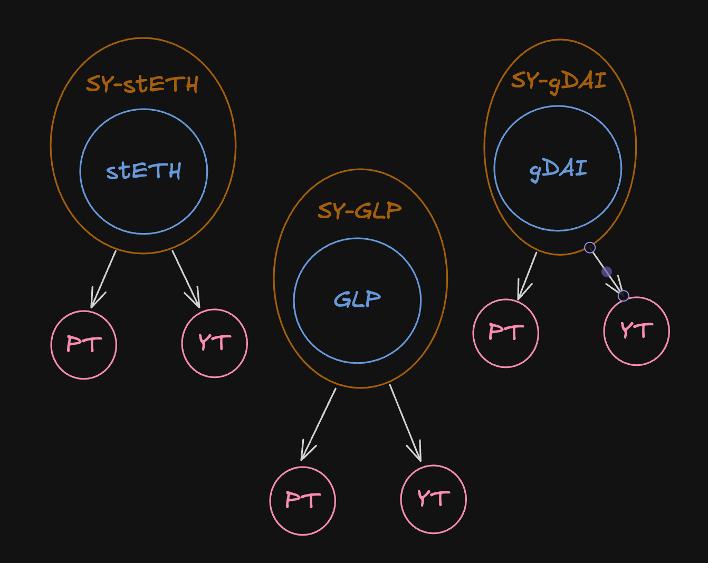

`SY` is not just a token like WETH. It is split into two parts:
- **PT** (principal token). Represents the equivalent of the underlying token.
- **YT** (yield token). Represents the yield of the underlying token.

The process of splitting `SY` into two tokens is called yield tokenization, where the yield is tokenized into a separate token `YT`.

_Important!_ A user can wrap into `SY` both a yield-bearing token (like stETH) and, in some cases, the base token (like ETH). Under the hood, this will first convert `ETH -> stETH`, and then `stETH -> SY-stETH`. This is how it works, except in cases where the yield-bearing token is itself the base representation, such as the [GLP](https://docs.gmx.io/docs/providing-liquidity/v1) token from GMX.

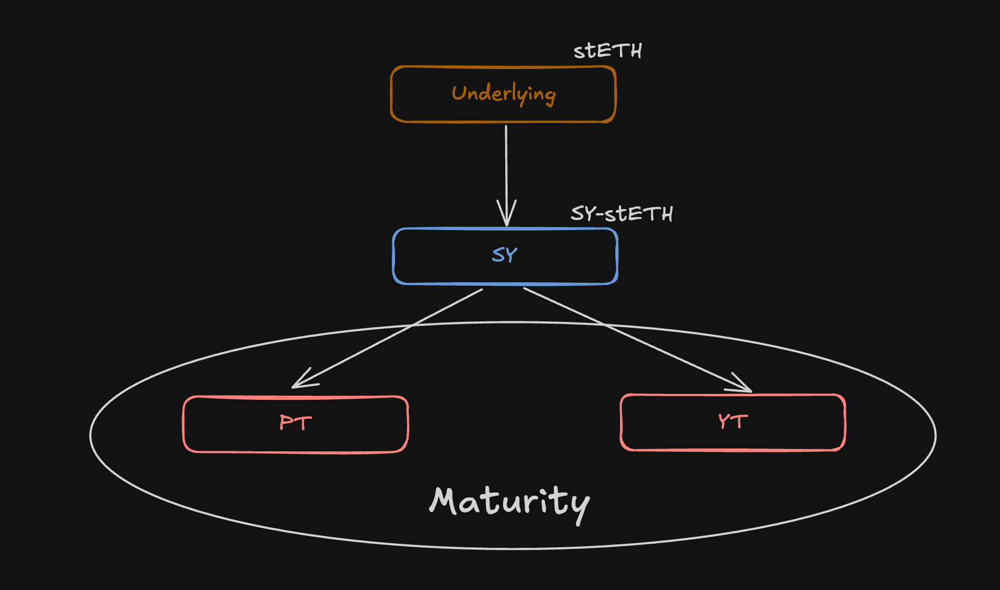

Another term associated with `PT` and `YT` is **maturity**. This is the expiration date, after which `YT` stops generating yield, and `PT` can be fully redeemed for the underlying asset at a 1:1 ratio.

`PT` can be traded via the AMM before maturity (at a discount to its nominal value), but a 1:1 redemption into the base asset is only possible after maturity.

**AMM**

Both parts of the wrapped token, `PT` and `YT`, can be traded on a special platform within the protocol called Pendle AMM.

The AMM is a key feature of the protocol. Its mathematical foundation is based on the [Notional Finance](https://www.notional.finance/) protocol. The AMM curve narrows the price range as it approaches maturity. But essentially, it resembles Uniswap v2 with its constant product formula `x * y = k`.

The AMM also requires liquidity providers who are willing to supply their `SY` and `PT` tokens. In return, they receive LP tokens as a claim on their share of liquidity in the pool.

Even though there are two assets in the pool (`PT` and `SY`), the AMM also allows swapping of the `YT` token. This type of swap is called a **Flash Swap**. It's called Flash because multiple transformations for the swap occur within a single block.

Flash swaps operate on top of the mathematical relationship `P(PT) + P(YT) = P(SY)` during the creation of the `SY` wrapper, where:
- **P(PT)** – the price of the `PT` token,
- **P(YT)** – the price of the `YT` token,
- **P(SY)** – the price of the `SY` token.

This ensures that the split of `SY` into `PT` + `YT` (or their recombination back into `SY`) is always economically balanced at the moment of minting or redemption.

If a user wants to buy `YT`, they deposit `SY` into the pool (to get `SY`, they first wrap the base asset). Since the amount of `SY` in existence increases, to maintain balance, new `PT` and `YT` tokens must be minted. After that, a portion of `YT` is sent to the user, and some amount of `PT` is sent to the pool to uphold the balance according to the formula `P(PT) + P(YT) = P(SY)`.

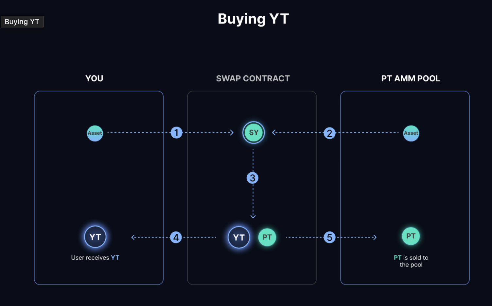
*// Diagram taken from Pendle protocol documentation*

**vePENDLE**

This is a [vote-escrowed](https://medium.com/@db371.eth/vote-escrowed-tokenomics-3cee9e9614db) token used by holders to participate in protocol governance. vePENDLE holders gain access to various protocol features:
- Additional income.
- Voting for pools to receive extra rewards.
- Boosted rewards for liquidity providers.

vePENDLE also serves as a mechanism to reduce the circulating supply of PENDLE tokens, since obtaining vePENDLE requires staking PENDLE. Over time, the amount of vePENDLE decreases, and PENDLE becomes unlocked.

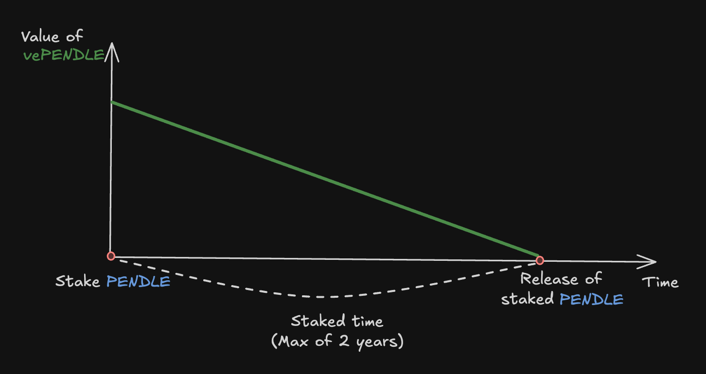

This way, the protocol increases the stability of the PENDLE token and the overall reliability of the protocol.

For users on L2 networks, things are a bit more complex. To maximize profit, users providing liquidity on Arbitrum need to lock PENDLE on Ethereum and sync the information with Arbitrum using cross-chain messaging.

However, earning yield from LP tokens doesn't require this, as reward distribution happens directly on the Arbitrum network (similarly in other L2 networks).

## Types of APY

Within the protocol, you may encounter different types of APY. There are four types in total, and it's important to understand what each one means. This will help you use the protocol effectively or understand the codebase.

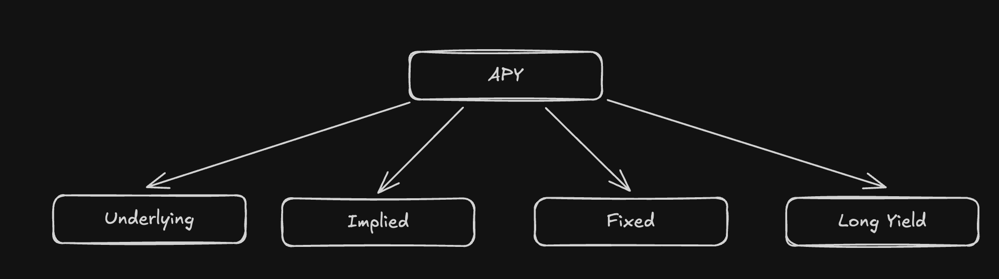

**Underlying APY**

Represents the 7-day moving average yield of the underlying asset.

**Implied APY**

The market yield of the underlying asset, calculated based on the prices of `YT` and `PT`.

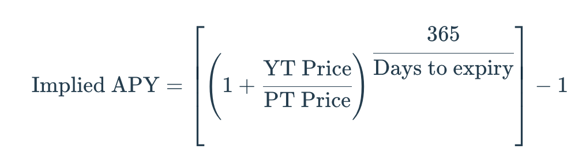

**Fixed APY**

The guaranteed yield that can be earned by holding `PT` in your wallet until maturity. It is determined by the Implied APY at the moment the `PT` is created.

**Long Yield APY**

An approximate annual yield when buying `YT` at the current price. This is relevant assuming the base annual yield remains constant.

## Key Mechanics of PT and YT

Both `PT` and `YT` are closely tied to the maturity date (**maturity**). We’ve already discussed this above.

**The Magic of the PT Token**

`PT` represents the equivalent of the underlying token, which can be redeemed after maturity. This means that a 1:1 exchange of `PT` for the base token is only possible after a certain time has passed.

At the start of the maturity period, `PT` trades at a discount. This is possible because the yield of the underlying asset is represented separately in the `YT` token.

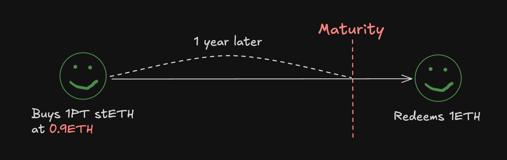

During the maturity period, `PT` will gradually approach the value of the base asset and eventually match it once redemption becomes possible. This price growth of the base asset defines the fixed annual yield (Fixed APY).

It’s important to understand that stETH is a yield-bearing token, which increases in value relative to the base ETH due to staking rewards. When purchasing the `PT` token, the 1:1 redemption (redeems in the diagram) can only be made into ETH, not stETH, which continues to grow in value relative to ETH.

**The Magic of the YT Token**

The holder of a `YT` token is entitled to all the yield from the underlying asset until the maturity date.

For example, holding 10 YT-stETH for 5 days earns you the equivalent yield of staking 10 ETH on Lido over the same period.

The value of `YT` approaches 0 as maturity nears. A key metric here is the Implied APY. Users make a profit when the yield collected by holding the `YT` is higher than the cost of purchasing that `YT`.

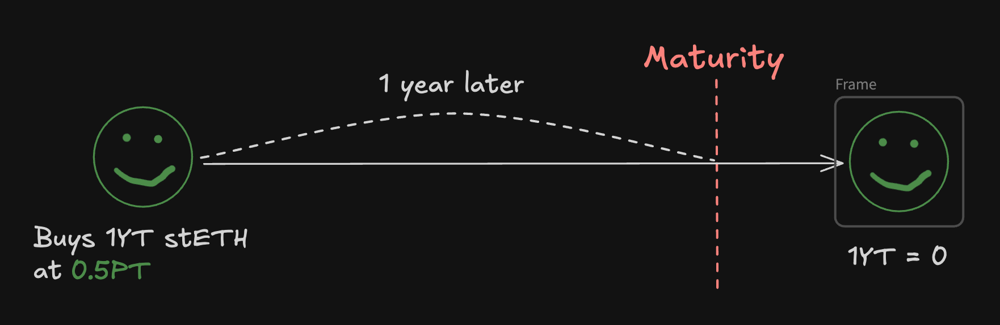

_Important!_ You can claim the accrued yield from the `YT` token at any time — even before the maturity date.

## OrderBook

Users can create limit orders to buy or sell. The key feature of a limit order is that it will only be executed when the specified Implied APY is reached.

The order book works in tandem with the AMM, but any swaps will first try to fill limit orders before falling back to the AMM. However, the order book is optional — the protocol can function solely with the AMM.

According to the documentation, Pendle runs an arbitrage bot that equalizes prices between the AMM and the order book. This ensures that any price discrepancies due to liquidity differences (between the AMM and the order book) are quickly corrected.

Orders follow a hybrid model: they are created and stored off-chain, but executed on-chain.

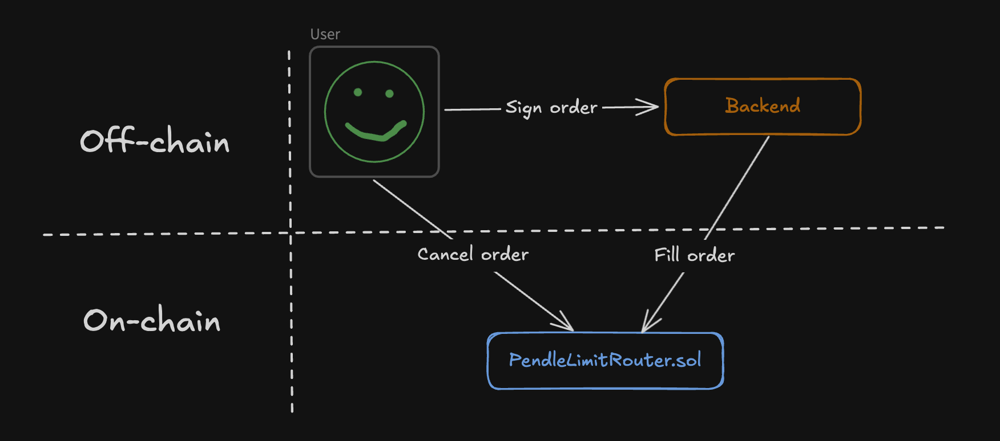

To create an order, the user signs a data structure containing the order parameters and sends it to the backend. Order execution takes place on the smart contract [PendleLimitRouter.sol](https://github.com/pendle-finance/pendle-core-v2-public/blob/main/contracts/limit/PendleLimitRouter.sol).

It's worth noting that creating an order does not require the user to make an on-chain transaction. However, canceling an existing order does require a transaction. The smart contract needs to know that the signature previously given to the backend is no longer valid.

[Documentation](https://api-v2.pendle.finance/limit-order/docs#/Maker/MakersController_generateLimitOrderData) for working with the limit order API.

## ERC-5115: SY Token

To implement the `SY` token, the protocol developed and proposed its own standard — [ERC-5115: SY Token](https://eips.ethereum.org/EIPS/eip-5115), which extends ERC-20 with the necessary functions for wrapping (deposit, withdraw, etc.).

The main motivation behind creating this standard was that [ERC-4626 Tokenized Vault](https://eips.ethereum.org/EIPS/eip-4626) didn’t cover all types of yield-bearing tokens. For example, native reward tokens (like COMP, CRV, and others) or AMM LP tokens, which are measured in “liquidity units” rather than base tokens.

So ERC-5115 proposes an extension of ERC-4626 to support any yield mechanism. To achieve this, the standard separates the concepts of an “input token” (used to start generating yield) and a “base asset” (from which the yield is derived).

In this way, SY tokens can wrap ERC-4626 tokens and add the missing functionality.

## Smart Contract Architecture Overview

This section covers the top-level smart contracts. It doesn’t go into deep implementation details, so it’s accessible for all readers.

### Repositories

It’s worth noting that at the time of writing, the protocol has two versions. There are three repositories for the two versions of smart contracts:
- [First version](https://github.com/pendle-finance/pendle-core).
- [Second version](https://github.com/pendle-finance/pendle-core-v2-public).
- [Standardized Yield (SY)](https://github.com/pendle-finance/Pendle-SY-Public/tree/main).

The first version is outdated, but still interesting from the perspective of smart contracts that were deployed a long time ago and haven’t changed. One such contract is the protocol’s token [PENDLE](https://github.com/pendle-finance/pendle-core/blob/master/contracts/tokens/PENDLE.sol).

The second version of the protocol — also known as the core functionality — is responsible for several features:
- Tokenization (implementations of [PT](https://github.com/pendle-finance/pendle-core-v2-public/blob/main/contracts/core/YieldContracts/PendlePrincipalToken.sol) and [YT](https://github.com/pendle-finance/pendle-core-v2-public/blob/main/contracts/core/YieldContracts/PendleYieldToken.sol) tokens).
- AMM (three contracts: [factory](https://github.com/pendle-finance/pendle-core-v2-public/blob/main/contracts/core/Market/v3/PendleMarketFactoryV3.sol), [market](https://github.com/pendle-finance/pendle-core-v2-public/blob/main/contracts/core/Market/v3/PendleMarketV3.sol), and [AMM math](https://github.com/pendle-finance/pendle-core-v2-public/blob/main/contracts/core/Market/MarketMathCore.sol)).
- Routing (the [router contract](https://github.com/pendle-finance/pendle-core-v2-public/blob/main/contracts/router/PendleRouterV4.sol) and various helper contracts).
- And several others, including the oracle, limit order execution, and reward distribution.

The smart contracts for token wrapping are located in a separate repository. The main wrapping functionality is in the abstract contract [SYBase.sol](https://github.com/pendle-finance/Pendle-SY-Public/blob/main/contracts/core/StandardizedYield/SYBase.sol).

## Smart Contract Call Flow

Even though the smart contracts are split across different repositories, in most cases there’s one main entry point for users — a group of contracts responsible for routing (labeled as `Router` in the diagram).

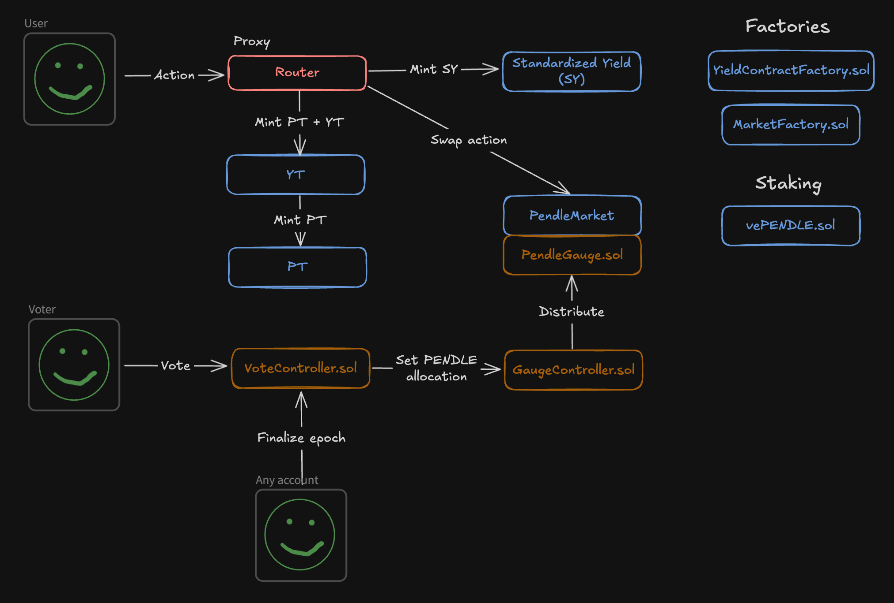

**Router**

The latest version of the router contract is a proxy smart contract. Its main role is to delegate calls to the appropriate contracts. When needed, the router also combines multiple calls.

To wrap a base asset, the call is routed to the `SY` contract. For tokenization, it goes to `YT` (which internally forwards the call to `PT`). For swaps, the call is routed to `PendleMarket`.

The router implementation is in the contract [PendleRouterV4.sol](https://github.com/pendle-finance/pendle-core-v2-public/blob/main/contracts/router/PendleRouterV4.sol). The diagram below shows how call delegation works.

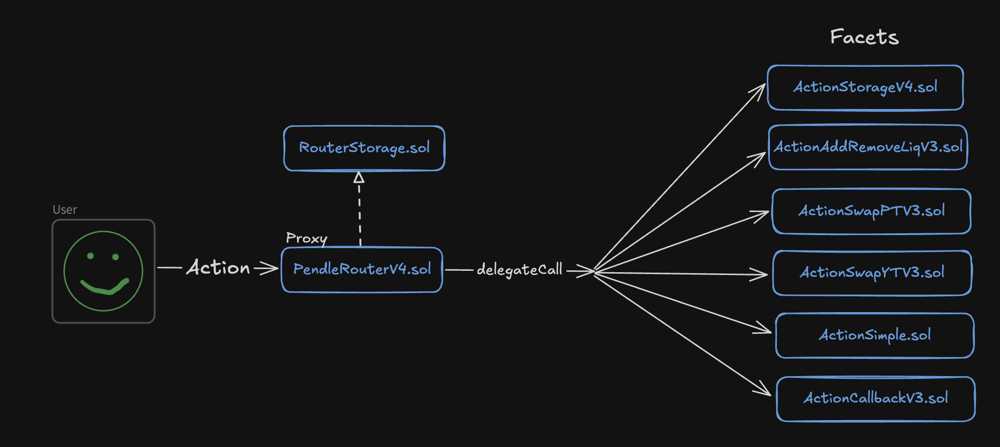

`PendleRouterV4` inherits from the [RouterStorage.sol](https://github.com/pendle-finance/pendle-core-v2-public/blob/main/contracts/router/RouterStorage.sol) contract and the standard OpenZeppelin [Proxy.sol](https://github.com/OpenZeppelin/openzeppelin-contracts/blob/v4.9.5/contracts/proxy/Proxy.sol) contract.

`RouterStorage.sol` stores the list of contracts that the proxy can delegate calls to. Depending on the type of call, the router delegates it to the appropriate contract — for liquidity management, swapping, etc. (such as [ActionAddRemoveLiqV3.sol](https://github.com/pendle-finance/pendle-core-v2-public/blob/main/contracts/router/ActionAddRemoveLiqV3.sol), [ActionSwapPTV3.sol](https://github.com/pendle-finance/pendle-core-v2-public/blob/main/contracts/router/ActionSwapPTV3.sol), and others).

**SY Token**

**SY** is the wrapped version of a yield-bearing token. As a reminder, this token is traded on `PendleMarket` in a pair with `PT`.

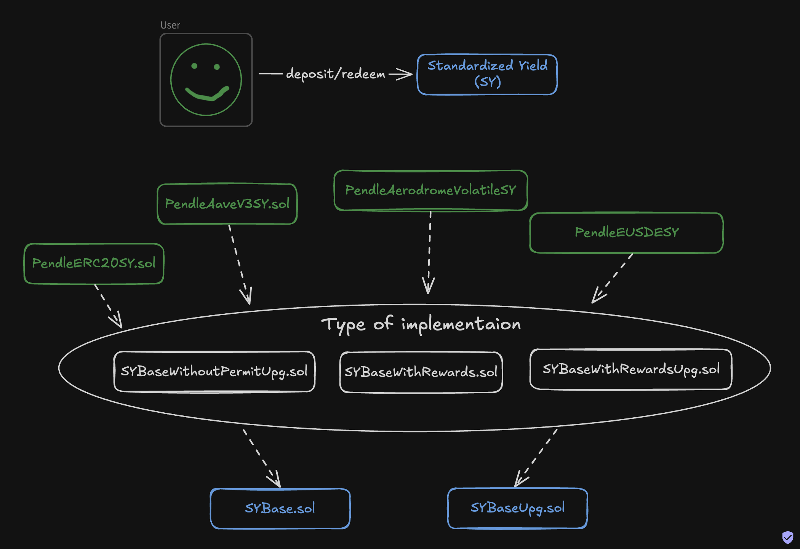

From the wrapping perspective, there’s not much complexity here. The base asset is locked in the wrapper smart contract via the [deposit()](https://github.com/pendle-finance/Pendle-SY-Public/blob/main/contracts/core/StandardizedYield/SYBase.sol#L38) function and unlocked again with the [redeem()](https://github.com/pendle-finance/Pendle-SY-Public/blob/main/contracts/core/StandardizedYield/SYBase.sol#L59) function.

However, when it comes to specific yield-bearing tokens, there are nuances. Just take a look at how many different [implementations](https://github.com/pendle-finance/Pendle-SY-Public/tree/main/contracts/core/StandardizedYield/implementations) of `SY` exist (PendleAaveV3SY, PendleAerodromeVolatile, and so on). It feels like there’s a custom version for every token out there.

Yes, the implementations are relatively simple, but each one has its own quirks. Some yield-bearing tokens generate yield through a rebasing mechanism, others through reward distribution, and so on. Each `SY` must implement a [function](https://github.com/pendle-finance/Pendle-SY-Public/blob/main/contracts/core/StandardizedYield/SYBase.sol#L107) to calculate the **exchangeRate**, which defines how much `SY` is received during a deposit.

For example, the `SY` token for AaveV3 works as shown in the diagram below.

That’s exactly why there are several base smart contracts (SYBase, SYBaseWithRewards). However, the core logic is located in [SYBase.sol](https://github.com/pendle-finance/Pendle-SY-Public/blob/main/contracts/core/StandardizedYield/SYBase.sol).

_Important!_ Note that some wrappers use an [upgradeable](https://github.com/pendle-finance/Pendle-SY-Public/blob/main/contracts/core/StandardizedYield/SYBaseUpg.sol) mechanism.

**PendleMarket**

Also referred to as "the market" — this smart contract acts as a liquidity pool for the `PT` and `SY` token pair. Swap fees go directly to liquidity providers. Each market has its own built-in oracle, similar to Uniswap V3.

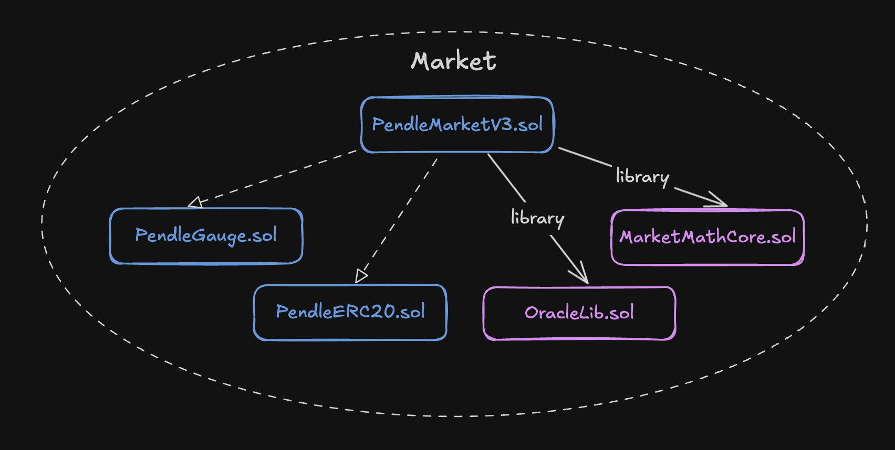

There have been multiple versions of the market implementation. The latest — version 3 — is in the contract [PendleMarketV3.sol](https://github.com/pendle-finance/pendle-core-v2-public/blob/main/contracts/core/Market/v3/PendleMarketV3.sol).

The market smart contract inherits from two other contracts:
- [PendleERC20.sol](https://github.com/pendle-finance/pendle-core-v2-public/blob/main/contracts/core/erc20/PendleERC20.sol). Implements the LP token for liquidity providers who supply `SY` and `PT` tokens to the pool.
- [PendleGauge.sol](https://github.com/pendle-finance/pendle-core-v2-public/blob/main/contracts/core/Market/PendleGauge.sol). A contract that distributes PENDLE and other rewards generated by `SY` among Market LP holders.

The core math logic of the pool (AMM logic) is implemented in a separate library: [MarketMathCore.sol](https://github.com/pendle-finance/pendle-core-v2-public/blob/main/contracts/core/Market/MarketMathCore.sol). This includes adding/removing liquidity and swapping one asset for another — classic AMM stuff!

**VotingController** and **GaugeController**

**VotingController** is a [smart contract](https://github.com/pendle-finance/pendle-core-v2-public/blob/main/contracts/LiquidityMining/VotingController/PendleVotingControllerUpg.sol) that allows vePENDLE holders to vote for markets. Before voting, users must obtain vePENDLE by staking the protocol’s main token, PENDLE, into the [VotingEscrowPendleMainchain.sol](https://github.com/pendle-finance/pendle-core-v2-public/blob/main/contracts/LiquidityMining/VotingEscrow/VotingEscrowPendleMainchain.sol) contract for mainnet, or [VotingEscrowPendleSidechain.sol](https://github.com/pendle-finance/pendle-core-v2-public/blob/main/contracts/LiquidityMining/VotingEscrow/VotingEscrowPendleSidechain.sol) for sidechains.

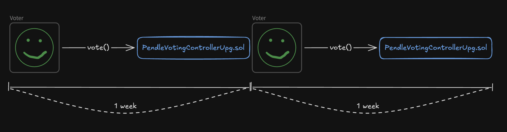

The voting process determines how much PENDLE each market will receive in the next epoch. Each epoch lasts exactly one week, starting at 00:00 UTC every Thursday. Votes can be changed during the epoch, as they are only finalized at the end of the epoch.

**GaugeController** is the smart contract that receives voting results from the VotingController and distributes PENDLE among the gauges of different markets (remember, each market has a built-in gauge). There are two versions: one for [mainnet](https://github.com/pendle-finance/pendle-core-v2-public/blob/main/contracts/LiquidityMining/GaugeController/PendleGaugeControllerMainchainUpg.sol) and one for [sidechains](https://github.com/pendle-finance/pendle-core-v2-public/blob/main/contracts/LiquidityMining/GaugeController/PendleGaugeControllerSidechainUpg.sol).

These two versions are necessary because voting only happens on mainnet. The voting results are delivered to sidechains via cross-chain messages powered by LayerZero.

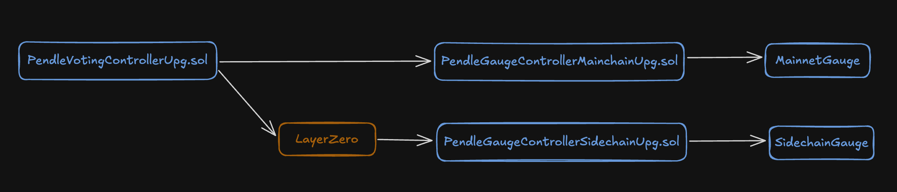

_Important!_ A user's vePENDLE balance decreases weekly until it reaches zero at the end of the lock period, similar to the [veCRV model](https://resources.curve.finance/vecrv/overview/) used by Curve. This model has been adopted by many other protocols.

## Fees

The protocol has two sources of revenue:

- **YT Fees.** Pendle charges a fee (up to 5%) on the yield earned by `YT`. The exact rate is determined by votes from vePENDLE holders. There’s also a fee on points (YT Fees on Points), which operate off-chain as user rewards and are also treated as yield.
- **Swap Fees.** Pendle charges a fee on all `PT` swaps. The fee rate is set by whoever deploys the pool (i.e., creates the token pair). The closer the `PT` is to its maturity date, the lower the swap fees.

Collected fees are accumulated in dedicated wallets and later distributed to vePENDLE holders. The protocol doesn’t take a cut for itself, but reserves the right to change this in the future.

## Conclusion

The secret behind the Pendle protocol is simple — take everything that already works well, combine it, and popularity will come naturally!

**What do I mean by that?**

- Tokenization, like in Yearn.
- AMM, inspired by Notional and based on Uniswap.
- vePENDLE, just like veCRV in Curve.
- Cross-chain messaging using [LayerZero](https://layerzero.network/).
- Splitting an asset into yield and principal, just like in traditional finance with bonds.

All of these concepts have been thoroughly battle-tested by various protocols and have proven themselves. Pendle took this collective knowledge, systematized it in the realm of tokenization, and unified it through a single standard — ERC-5115: SY Token.

Thanks to the new standard, Pendle expanded the list of supported yield-bearing tokens. And thanks to its AMM, it helps minimize impermanent loss for liquidity providers — a long-standing issue in DeFi.

_Tasty!_ Pendle’s smart contracts are licensed under GPL-3.0-or-later. This means personal and commercial use, code modification, and building new products on top are all allowed. However, any reused code must remain open-source.

You can also deploy a new Standardized Yield (SY) token without approval from the Pendle team. To integrate an `SY` token, you must follow the Pendle SY Token standard to ensure compatibility with the ecosystem.

The protocol's backend is open for integrations (Restful API, Pendle Hosted SDK).

However, Pendle is not completely risk-free. Liquidity in Pendle pools is exposed to yield fluctuation risk from the underlying asset. For example, if stETH’s APY drops, demand for `YT` will decrease, and the price of `PT` may not reach its nominal value (1:1 exchange ratio) by maturity.

## Links

1. [Official Documentation](https://docs.pendle.finance/Home).
2. [Yield Tokenization Protocols, How They're Made: Pendle](https://mixbytes.io/blog/yield-tokenization-protocols-how-they-re-made-pendle) by MixBytes().
3. [core-v2 Repository](https://github.com/pendle-finance/pendle-core-v2-public/tree/main).
4. [SY Token Repository](https://github.com/pendle-finance/Pendle-SY-Public/tree/main).
