# Polymarket

**Author:** [Pavel Naydanov](https://github.com/PavelNaydanov) 🕵️‍♂️

**Polymarket** is one of the largest and most popular prediction markets on the blockchain. It allows users to bet on the outcomes of various events: sports, politics, culture, and so on.

User assets are stored in non-custodial wallets. This means that the protocol does not store users' private keys and cannot access their assets.

## Proxy Wallets

When a user first uses Polymarket, they need to create an internal wallet. They have two options:
- Use their existing EOA (Externally Owned Account). Metamask, Coinbase, and WalletConnect are supported.
- Use an email address through a technology called [Magic Link](https://medium.com/@email_36494/magic-links-2149f31f1a56). Enter your email and receive a special link to access the service.

The wallet is created through a specialized smart contract factory and functions as a 1/1 multisig, meaning it is fully controlled by the user.

The use of internal wallets allows Polymarket to provide a better user experience, such as enabling multiple transactions at once.

## Prediction Market

A prediction market begins with a forecast. A forecast is the foundation around which user scenarios are built. In the context of prediction markets, this statement is called a **condition**. It could be a question, statement, description of an expected outcome, event, prediction, etc. We can view it as any form of assertion that claims future truth.

Examples of predictions:

> 1. An earthquake of 7.0 magnitude will occur in September.
> 2. Will GPT-5 be released in 2024?
> 3. Bieber's baby: boy or girl?
> 4. Highest-grossing movie in 2024?
> 5. Will Ethereum reach $10k in 2024?

Each prediction has a deadline for verification: whether the prediction came true or not. A special oracle in Polymarket is responsible for determining the outcome of each prediction.

**What’s the role of the oracle?** Polymarket is built using blockchain technology, and an oracle is used to transmit data to the network. The oracle is designed so that its results can be trusted for any prediction.

Often, a prediction has multiple possible outcomes. The oracle will determine the result of the prediction among these outcomes.

Example of predictions with outcomes:
> Will GPT-5 be released in 2024?
> - Yes
> - No
>
> Highest-grossing movie in 2024?
> - Inside Out 2
> - Other
> - Deadpool 3
> - Joker 2
> - Despicable Me 4
> - Dune: Part 2
> - Furiosa: A Mad Max Saga

A typical prediction market can be described using the following structure:

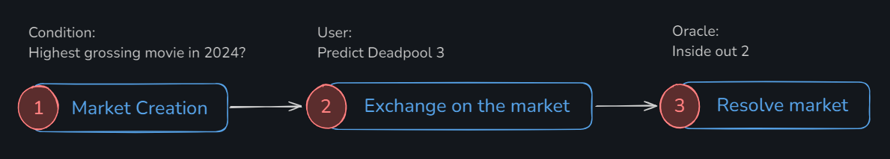

In the first stage, a market is created, and a new prediction (condition) is added with a set lifespan. During this time, users can choose the outcome they believe is most likely. In the final stage, the oracle determines which group of users was correct and which was wrong.

Users who chose the correct outcome receive a **reward**. This reward is formed from the contributions of all participants. Each user, by voting for a particular outcome, contributes a certain amount of the asset used in the prediction market. Accordingly, users who were wrong in their choice receive nothing.

This might lead one to conclude that a prediction market is essentially betting. Yes and no. The key idea behind prediction markets is advocated by Vitalik in his [blog](https://vitalik.eth.limo/general/2021/02/18/election.html). He believes that such services can serve as neutral sources for forecasting or analyzing the probability of various events occurring. Based on this data, informed managerial decisions can be made.

## How Accurate Are Predictions?

In general, the idea that prediction markets can be fairly accurate is supported by the [Efficient Market Hypothesis](https://en.wikipedia.org/wiki/Efficient-market_hypothesis). According to this hypothesis, the price of any asset directly corresponds to its true value because all available information is already factored into the price.

A simple example:

> Suppose investors know the market value of a commodity. They will keep buying it as long as it's profitable. Gradually, demand will increase, and along with it, the price of the commodity, until its price reaches a level where buying it is no longer profitable.

Research has shown that prediction markets are, on average, significantly more accurate than social surveys and expert opinions. The accuracy of such markets has been studied by numerous [researchers](https://en.wikipedia.org/wiki/Prediction_market#Accuracy) across various fields, including testing theories and lab data, healthcare, and managerial decision-making.

Participants in prediction markets analyze a wide range of information: news, sports, innovations, incidents, development trends, environmental issues, politics, and much more. Their economic incentive ensures that their influence on the market price (or probability) will adjust with such precision that it reflects the truth of the prediction.

Therefore, prediction markets are considered one of the best sources for real-time event probability. Polymarket is one such service that has been attracting increasing attention lately.

## Polymarket. How Does It Work? An Easy Explanation

To understand how the service works, let’s open a random event on [Polymarket](https://polymarket.com/) and go through its interface.

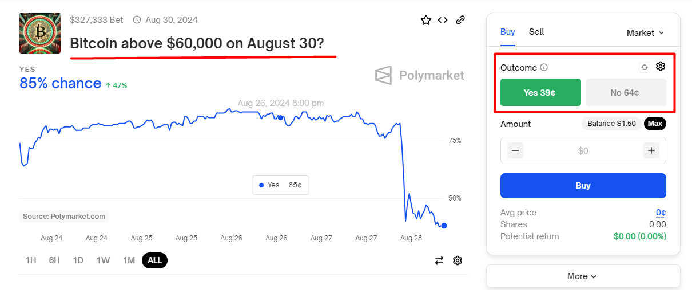

In the screenshot, the event title *"Bitcoin above $60,000 on August 30?"* is highlighted, along with the possible outcomes. In our case, there are only two outcomes: *"Yes"* and *"No"*. However, it’s important to remember that there can be more than two outcomes. Let’s look at the screenshot below for a more detailed understanding of the interface.

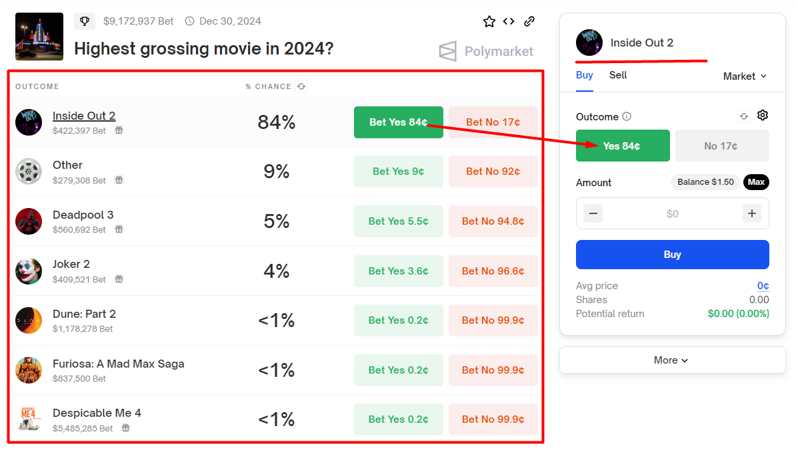

Multiple outcomes are displayed directly below the event title. The right panel shows the most popular outcome — the one currently chosen by the majority of users. This allows for quick access to this outcome option.

**What does the Buy button mean?**

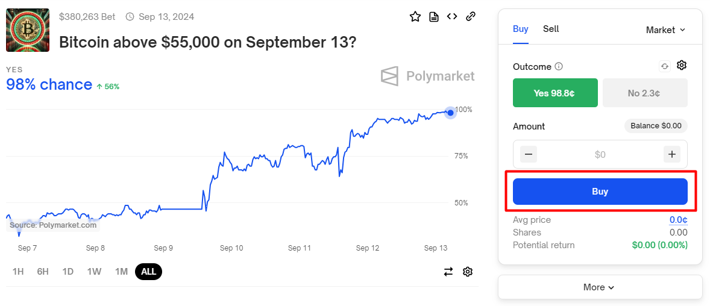

Under the hood, each outcome is represented by a special **share** token based on the ERC-1155 standard. The **Buy** button is used to purchase tokens for the selected outcome. In exchange, the user pays the base asset — USDC.

The purchase process can be seen as a form of voting. Users "vote" for one of the outcomes by backing their choice with real assets, which ensures accountability in decision-making. A corresponding sell process allows users to reverse their position.

Each vote represents the user's stance on a specific event. Various terms can be used to describe the purchase process: "vote," "bet," "position," or "poll," "purchase." Users can choose the term they feel most comfortable with, but all of them indicate the user's opinion on the event.

**How to understand the price of outcomes?**

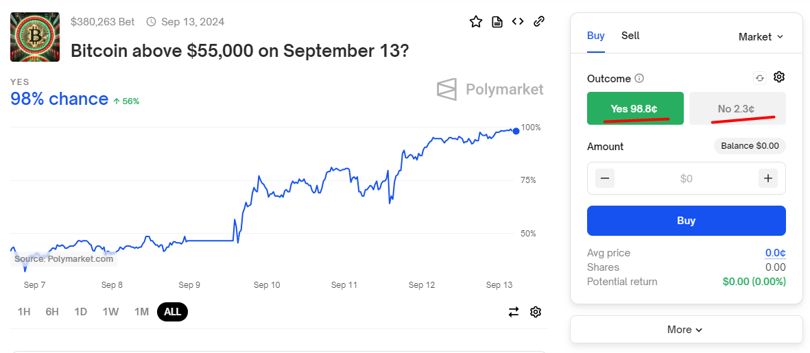

A price of 98.8 cents for the "Yes" outcome indicates a 98% probability that the event *"Bitcoin above $55,000 on September 13?"* will occur. Accordingly, a price of 2.3 cents indicates a 2% probability that Bitcoin will be below $55,000.

Essentially, the price reflects the likelihood of this outcome occurring. The higher the price, the greater the perceived probability of the event happening, according to users. If a user believes that Bitcoin has a good chance of exceeding $55,000, they can buy "Yes" tokens at 98.8 cents each.

If the user is correct and Bitcoin does indeed exceed $55,000, each "Yes" token purchased will be worth $1. Thus, the user will make a profit of 1.2 cents per token. At the same time, any user holding "No" tokens will lose their investment, as those tokens will become worthless.

It’s worth noting that a user is not required to hold their position until the end; they can sell their shares at any time at the current market price.

## Technical Breakdown

Now we’ll dive into a technical breakdown of all aspects of the protocol. Buckle up! 🤓

### Outcome Tokenization

We’ve established that all event outcomes on Polymarket are tokenized. Let’s recap what we already know:
- Such tokens can be called **share** tokens
- **Share** tokens are purchased with a base asset, so they are fully collateralized
- **Share** tokens can be sold back for the base asset

Now for some new information. Share tokens implement ERC-1155 based on the [Gnosis Conditional Tokens Framework (CTF)](https://github.com/gnosis/conditional-tokens-contracts), which has proven its effectiveness and has been tested by several protocols.

CTF can support up to 256 outcomes per event.

Each prediction is identified in CTF. For this purpose, it is assigned a **conditionalId**. The conditionalId is unique due to the hash of three parameters:
- **oracle**. The address of the oracle that will determine the event outcome. This ensures that only the specified oracle can settle the prediction.
- **questionId**. The prediction identifier, set by the creator of the prediction. This could be a simple counter where each new prediction increments by one, or a more complex scheme using hashing of text and other data.
- **outcomeSlotCount**. The number of possible outcomes for the prediction.

The diagram below provides a visual representation of how the CTF (Conditional Token Framework) works.

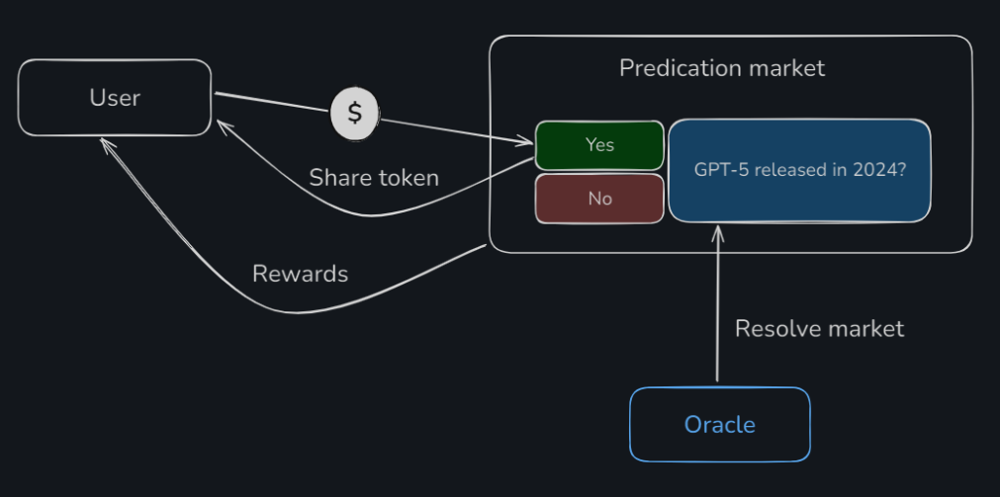

The user provides a base asset when placing a bet and receives a **share** token, which is called a **conditional token** within CTF. After the oracle settles the prediction, the user can claim their reward from the CTF based on the prediction outcome.

When a user receives a **conditional token**, they are considered to have taken a specific position. In CTF, positions represent a set of possible outcome combinations for each prediction. CTF generates these positions for each prediction, and each position corresponds to one of the possible outcome combinations that a user can choose.

For example:

> Highest-grossing movie in 2024?
> - Inside Out 2
> - Other
> - Deadpool 3
> - Joker 2
> - Despicable Me 4
> - Dune: Part 2
> - Furiosa: A Mad Max Saga
>
> A user could vote that *"Inside Out 2"* will be the highest-grossing movie, and that *"Dune: Part 2"* will definitely not be the highest-grossing movie in 2024. This combination of predictions would be considered their position.

CTF provides two interesting mechanisms for working with positions: **splitting** and **merging**. The **splitting** mechanism allows a single position to be divided into multiple separate outcomes, while **merging** combines different outcomes into one position. These mechanisms give users flexibility in managing their positions.

In my opinion, CTF provides Polymarket with four important advantages:
- The **share token** is used to confirm a user's vote for a specific prediction outcome.
- It implements a **flexible system** for combining a user’s votes into various positions.
- **Responsibility for outcome calculation** is delegated to CTF, based on the oracle’s signal.
- **Calculates rewards** according to the share token amount for the winning outcomes.

It’s particularly important to note that CTF allows for the organization of related events, where users' positions can be combined. However, I haven’t found such examples in Polymarket.

I really liked the CTF concept, although it’s quite complex for me to fully understand. You can learn more about it in the [official documentation](https://docs.gnosis.io/conditionaltokens/docs/devguide01).

### Orders

Now, let’s move on to one of the most mysterious aspects of Polymarket — orders.

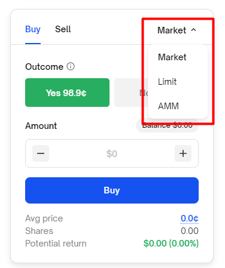

To make a purchase, the Polymarket interface offers three types of orders:

- **Market** — immediate purchase at the current market price.
- **Limit** — delayed orders that allow you to specify a price at which the purchase will be made once it’s reached.
- **AMM** — purchase at a price that is automatically determined, similar to decentralized exchanges, based on the reserve amounts in the pool.

Currently, it seems that the AMM order function isn’t working. I wasn’t able to find an event that would allow a purchase through AMM. After searching through the protocol’s Discord, I found a relatively recent comment from one of the users, which sheds some light on this situation. See the screenshot below.

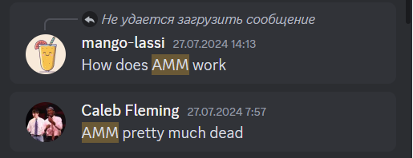

According to the protocol's [documentation](https://docs.polymarket.com/#fpmms), AMM used smart contracts developed as part of the [Conditional Token Framework](https://docs.gnosis.io/conditionaltokens/docs/introduction3). Thus, AMM was used to determine the purchase price of **share** tokens.

This basic mechanism required liquidity to ensure stable pricing and reduce volatility. Liquidity providers need an economic incentive, receiving a reward from each purchase made, to keep the system running.

Unfortunately, I’m new to Polymarket, but I would guess that initially, the protocol was fully based on CTF, with AMM used for price determination. Over time, the protocol developed a hybrid solution with an order book, and two other types of orders (limit and market) began working on a custom solution. This solution is called CLOB (Central Limit Order Book) or BLOB (Binary Limit Order Book).

### CLOB and BLOB

**CLOB** (Central Limit Order Book) or **BLOB** (Binary Limit Order Book) is a system representing a hybrid-decentralized order book. In this system, a specialized operator handles order matching and initiates execution on smart contracts.

Without going into too much detail, the system can be described as follows:

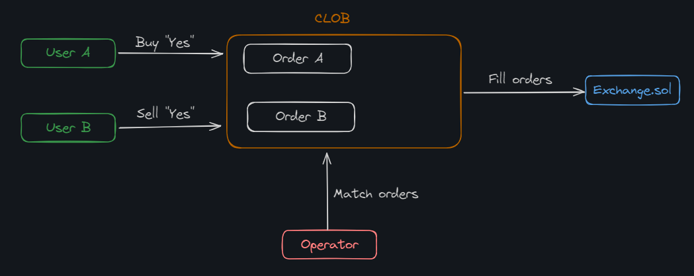

Users create orders for execution, which can be either limit or market orders. The operator matches user orders and initiates their execution on smart contracts. Creating an order means creating a data structure signed with the user’s private key according to the [EIP-712](https://eips.ethereum.org/EIPS/eip-712) standard. Since the order is stored off-chain until execution, this allows for quick and cost-free adjustments to the order terms or even full cancellation.

For those wanting more details, everything related to the order book and order matching can only be accessed through the [API](https://docs.polymarket.com/#api). For convenience, Polymarket provides two clients: one for [JavaScript](https://github.com/Polymarket/clob-client) and one for [Python](https://github.com/Polymarket/py-clob-client).

The [Exchange.sol](https://github.com/Polymarket/ctf-exchange/blob/main/src/exchange/CTFExchange.sol) smart contract, however, is public and is responsible for creating user positions within CTF. It also allows for managing user positions and transferring assets between them, ensuring security and transparency within the protocol.

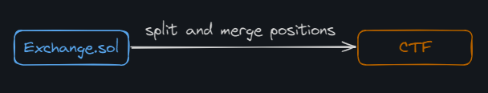

The smart contract has undergone an audit. The [audit report](https://github.com/Polymarket/ctf-exchange/blob/main/audit/ChainSecurity_Polymarket_Exchange_audit.pdf) is attached in the repository.

### Smart Contract

The `Exchange` smart contract actually has a more specific name, [CTFExchange.sol](https://github.com/Polymarket/ctf-exchange/blob/main/src/exchange/CTFExchange.sol). It’s not very large, containing around 100 lines of code, but it does have a substantial set of dependencies.

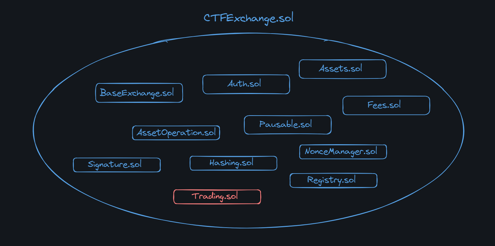

Most of these are small smart contracts that implement limited functionality:

- [BaseExchange.sol](https://github.com/Polymarket/ctf-exchange/blob/main/src/exchange/BaseExchange.sol). Abstract smart contract that implements the ability to receive ERC-1155 tokens. Also responsible for protection against reentrancy attacks.
- [Auth.sol](https://github.com/Polymarket/ctf-exchange/blob/main/src/exchange/mixins/Auth.sol). Role manager. Defines validation functions and modifiers to set up roles: admin and operator for `CTFExchange.sol`.
- [Assets.sol](https://github.com/Polymarket/ctf-exchange/blob/main/src/exchange/mixins/Assets.sol). Defines two assets: the base asset (collateral) and the CTF address.
- [Fees.sol](https://github.com/Polymarket/ctf-exchange/blob/main/src/exchange/mixins/Fees.sol). Defines the protocol fee.
- [Pausable.sol](https://github.com/Polymarket/ctf-exchange/blob/main/src/exchange/mixins/Pausable.sol). Defines the ability to pause the smart contracts' operation. A form of centralization that the protocol agrees to in case of unforeseen circumstances. Available only to the admin role.
- [AssetOperation.sol](https://github.com/Polymarket/ctf-exchange/blob/main/src/exchange/mixins/AssetOperations.sol). Defines operations for the base asset and CTF. Includes transfer, splitting, and merging of positions.
- [Signature.sol](https://github.com/Polymarket/ctf-exchange/blob/main/src/exchange/mixins/Signatures.sol). Defines the code for validating user signatures used when working with orders.
- [Hashing.sol](https://github.com/Polymarket/ctf-exchange/blob/main/src/exchange/mixins/Hashing.sol). Defines hashing of order parameters, used for signature verification.
- [Registry.sol](https://github.com/Polymarket/ctf-exchange/blob/main/src/exchange/mixins/Registry.sol). Defines the process of registering a prediction in the system and registering tokens for the prediction.

_Important!_ Everything related to the actual execution of orders is implemented in the smart contract. [Trading.sol](https://github.com/Polymarket/ctf-exchange/blob/main/src/exchange/mixins/Trading.sol).

Walking through the code and studying the smart contract is also straightforward. The structure has clearly defined entry points through functions:
- [fillOrder()](https://github.com/Polymarket/ctf-exchange/blob/main/src/exchange/CTFExchange.sol#L61) — Executes an order between the user who created it and the maker (another order) selected by the user.
- [fillOrders()](https://github.com/Polymarket/ctf-exchange/blob/main/src/exchange/CTFExchange.sol#L68C14-L68C24) — Same as `fillOrder()`, but for a list of orders.
- [matchOrders()](https://github.com/Polymarket/ctf-exchange/blob/main/src/exchange/CTFExchange.sol#L82) — The operator selects two different orders and executes them.

All of the above functions can only be called by the **operator**.

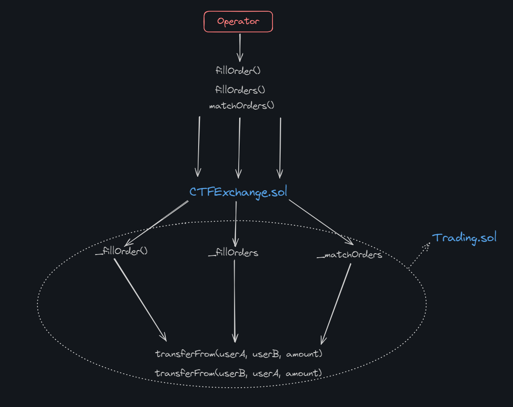

No matter how the call enters the smart contract, the result will always be the same: two users will exchange tokens according to their orders.

### Protocol Fee

The fee is charged on the asset that is the output. For binary predictions, fees are symmetric, meaning: if a user sells tokens at a price of $0.99, they will pay the same fee as the buyer purchasing them at a price of $0.01.

The calculation formulas are straightforward and are taken from the [documentation].(https://docs.polymarket.com/#fees).

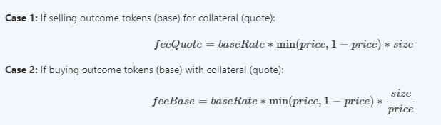

### Liquidity Rewards Program

The overall goal of this program is to incentivize liquidity in the market.

We know that for an order book-based exchange to work, someone needs to create limit orders. Limit orders provide the liquidity that allows market orders to be executed immediately. Users who create limit orders are called **market makers**. The "tighter" the limit orders are to the market price, the faster and in larger volumes market orders can be executed, which is certainly advantageous for the end user. Moreover, the more liquidity there is, the harder it is to manipulate the market.

To ensure sufficient liquidity, Polymarket has developed a special rewards program to incentivize users to create limit orders.

The closer the limit order is to the average market price, the higher the reward will be. Rewards are automatically paid out every day at midnight UTC.

The system is modeled after [dYdX](https://dydx.exchange/). The original dYdX program is described [here](https://docs.dydx.community/governance-documentation/rewards/liquidity-provider-rewards). The original program for Polymarket is available [here](https://docs.polymarket.com/#liquidity-rewards-program).

### Oracle

The oracle is used to deliver the outcomes of predictions — whether an event occurred or not. The oracle is one of the most crucial components of the protocol, but it is implemented by a third-party service rather than the Polymarket team. This oracle is called [UMA](https://uma.xyz/).

UMA is a decentralized oracle that specializes in recording any kind of data on the blockchain, except for data that cannot be verified. The oracle is considered **optimistic** because data is assumed to be correct unless disputed. UMA has its own arbitration system for resolving disputes, where the arbitrators are real people — participants in the UMA ecosystem, specifically UMA token holders. This system is called the **DVM** (Data Verification Mechanism).

The following multi-step process is used to determine the outcome of a prediction and record it on the blockchain:

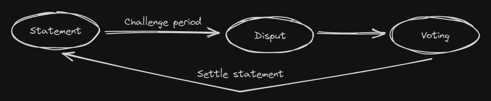

1. **Statement.** The prediction is added to the oracle along with a reward. The reward can be claimed by anyone who successfully disputes the prediction result.
2. **Challenge period.** During this period, anyone can challenge the prediction result. If no challenge occurs and time expires, the prediction result is considered ready for final settlement, which signifies its accuracy.
3. **Dispute.** Any protocol participant can dispute the result, either to claim the reward or in the interest of fairness (just kidding). In practice, this rarely happens, as game theory suggests that most participants behave honestly.
4. **Voting.** If a dispute is initiated, UMA token holders vote to resolve the dispute. UMA is the protocol’s token used for voting, and participants are rewarded for participating in it.
5. **Settle.** The final stage is the settle process, or the actual recording of data on the blockchain. After this, the prediction result can be considered reliably accurate.

The entire protocol is based on well-thought-out game theory, where it is economically disadvantageous for any participant to engage in malicious actions.

Examples:

> 1. A participant who submits a prediction result for voting provides collateral to the smart contracts. If their result is disputed, they lose the collateral; otherwise, they retrieve the collateral and receive a reward. This creates a strong incentive to submit only accurate results.
> 2. A participant who disputes the prediction result also puts up collateral. If they are correct, they take back the collateral and earn a reward; otherwise, they lose it. This incentivizes participants to challenge only those results they are confident are incorrect.
> 3. Participants who resolve disputes. They must stake UMA tokens and will earn rewards for resolving disputes. If they vote incorrectly or do not vote at all, they lose part of their staked balance; otherwise, they receive a reward. There's no way to slack off.

It’s particularly noteworthy that the voting process in a dispute occurs in two stages using the **commit/reveal** scheme:

1. **Commit.** Participants vote secretly by submitting the hash of their vote to the smart contracts. This means that no one can discern how a participant voted just by looking at the hash.
2. **Reveal.** After the voting phase ends, participants reveal their votes. The smart contract verifies if they match the previously submitted hashes.

This two-stage voting process prevents collusion among voters to discredit the oracle or attack services that rely on prediction results.

A prediction result can be challenged multiple times. In such cases, UMA allows the decision-making process to restart after the previous dispute is concluded.

This is what the dispute initiation process looks like:

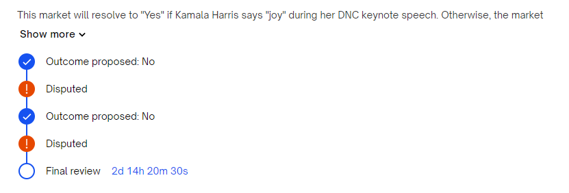

## Conclusion

What seems like a simple betting and prediction system actually consists of three major modules, each developed by different protocols and teams:

- **CTF** (Conditional Token Framework): Manages the combinatorics, positioning, and user shares in predictions. Huge thanks to Gnosis for creating such a flexible framework, perfectly suited for prediction markets.
- **CLOB** (Central Limit Order Book): Polymarket's in-house solution for implementing the order book and limit orders. CLOB enables users to effectively participate in the ecosystem and helps aggregate liquidity.
- **UMA**: A decentralized oracle with a unique arbitration system for dispute resolution. UMA is truly the heart of the system, transmitting prediction results via the blockchain.

This system could be viewed as a betting system, but when I started digging into Polymarket, I didn’t expect to have to break down my study into three different protocols or to spend so much time on it. Technically, this protocol is impressive and intriguing, successfully combining technologies from different projects, making it especially attractive to developers.

**My final opinion**: I genuinely want to see this protocol as something useful, as Vitalik Buterin suggests. May it become a tool for forecasting, decision-making, and analysis. However, despite this potential, the protocol is still most commonly associated with elections, where the demand for predictions skyrockets.

## Links

1. [Welcome to Polymarket](https://learn.polymarket.com/)
2. Gnosis Conditional Tokens Framework. [Getting Started](https://docs.gnosis.io/conditionaltokens/docs/devguide01/)
3. [Prediction Markets: Tales from the Election](https://vitalik.eth.limo/general/2021/02/18/election.html)
4. Very simply about [Outcome Tokens](https://mirror.xyz/polymarket.eth/txFHoXVU1QAsXCZQj6H_ag3kXv1QTcnbLVI8cL9CFYg) in the Polymarket blog.
5. [An In-Depth Overview of Polymarket's Market Making Rewards Program](https://mirror.xyz/polymarket.eth/TOHA3ir5R76bO1vjTrKQclS9k8Dygma53OIzHztJSjk)
6. [UMA protocol](https://uma.xyz/)
