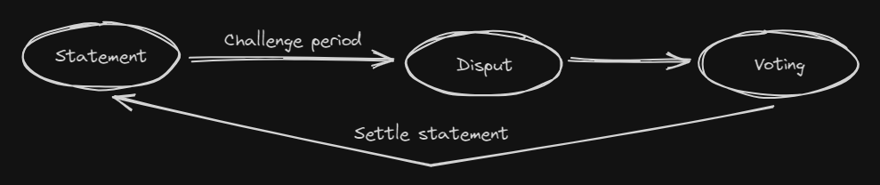
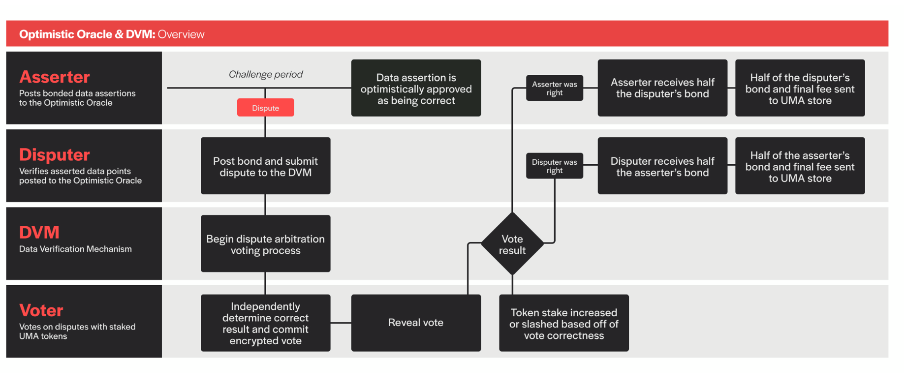
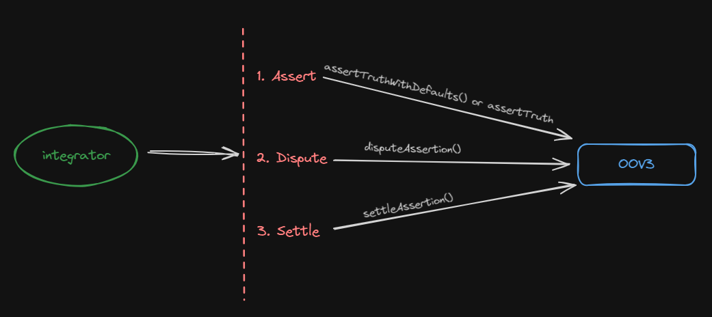
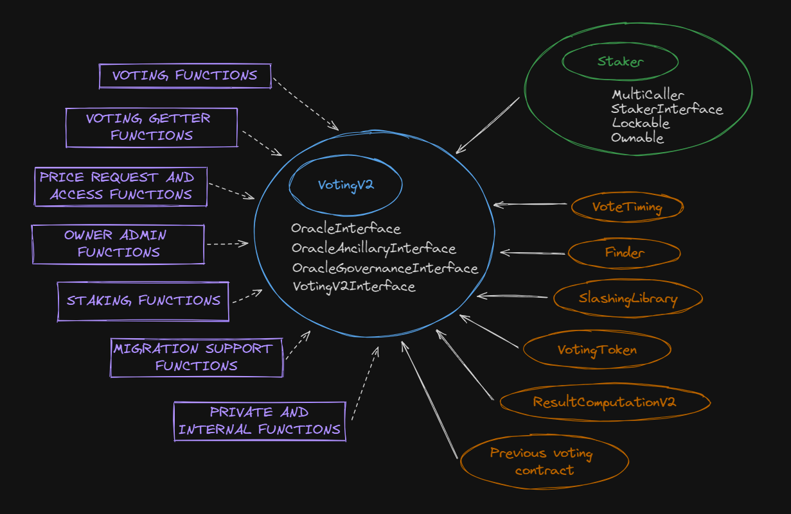
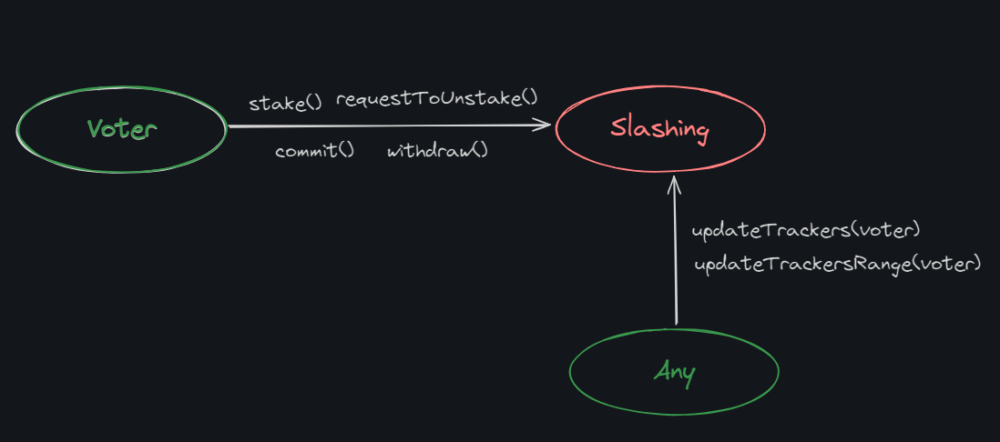
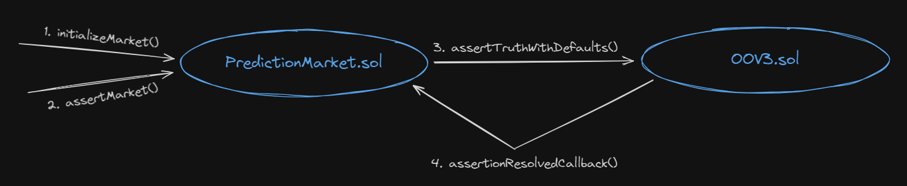

# Uma. Optimistic Oracle

**Author:** [Pavel Naydanov](https://github.com/PavelNaydanov) 🕵️‍♂️

**Uma** is a decentralized oracle designed to record any type of data on the blockchain, except those that can't be verified.

It's called an optimistic oracle because it operates on the assumption that if no one disputes the data, then it's considered accurate. Uma also has a built-in arbitration system to handle disputes.

This oracle provides data for projects like cross-chain bridges, insurance protocols, prediction markets, and derivatives.

The types of data can vary widely—from cryptocurrency prices to sports or political events. However, all the data relates to real-world events that can be verified at some point.

Here are a few examples of such data:
1. Elon Musk will tweet about cryptocurrencies before August 31st.
2. Trump will say the word "tampon" in an interview.
3. There will be a monkeypox outbreak in 2024.
4. The price of Solana will be over $140 on August 23rd.
5. Satoshi’s identity will be revealed in 2024.

## How Does the Oracle Work, in Simple Terms?

Let’s break down the basic process of how the oracle gathers reliable data. When we talk about data here, we’re referring to the examples mentioned above. Throughout this article, you’ll see terms like "statement," "assertion," "event," or "prediction"—all of these describe the data the oracle deals with at different stages of its lifecycle.



Here’s a simplified look at how data flows into the oracle:
1. **Statement.** A statement is submitted to the oracle along with a reward. The idea is that whoever can successfully challenge the statement gets the reward.
2. **Challenge period.** During this time, anyone can challenge the statement. If no one does, the statement is considered ready for finalization, meaning it’s accepted as true and reliable.
3. **Dispute.** Even after the challenge period, any participant can still dispute the statement to claim the reward or just to keep things honest. That last bit is kind of a joke—disputes don’t happen all that often. Game theory suggests most people play fair in the protocol’s ecosystem.
4. **Voting.** If a dispute is raised, UMA token holders vote to resolve it. UMA is the protocol’s token, and it gives holders the right to vote on disputes and earn rewards for doing so.
5. **Settle.** The final step is settling, where the statement is officially confirmed as true.

Let’s walk through an example.
> Vasily—thankfully not Terkhin—believes that Spain won the 2024 Euro Cup. This is a well-known fact, so Vasily decides to teach the Uma oracle about it. He submits the event to the oracle—this is the **statement** stage. The **challenge period** passes with no disputes—it’s pretty obvious. Then the final step, **settle**, confirms in the oracle that Spain was the champion. From now on, the oracle can always answer who won.

Vasily is pumped up by his success and plans to submit the entire 2024 Euro Cup results table.

> But Vasily was actually rooting for France, who came in third. He decides to cheat by moving them up to second place. A **disputer** catches this and raises a dispute. It’s worth noting that both Vasily and the disputer have **skin in the game**—they’ve staked some tokens. The voting happens, and Vasily’s attempt to cheat fails because the oracle’s arbitration system works as it should, and the event is flagged as false. At the final **settle** stage, the oracle awards some of Vasily’s tokens to the disputer as a reward. Vasily loses his tokens, and the disputer comes out ahead.

That’s a quick overview of how Uma’s oracle works to validate new data from the real world.

## How Does It Work Technically?

The Uma oracle allows smart contracts to quickly request and receive information. However, there's a process that needs to happen before that information is confirmed, which involves a certain amount of time and a full verification process.

The following system components are involved in the oracle's operation:

- **Asserter** - The participant who submits a statement from the real world into the system. For example, "The exchange rate of the yuan today is equal to one dollar."
- **Disputer** - The participant who can challenge the statement published by the **asserter**.
- **DVM** - A software module for resolving disputes between the **asserter** and **disputer**. However, using this module is optional and can be replaced with a custom dispute resolution system.
- **Voter** - The participant who votes to decide whether the **asserter** or the **disputer** is correct.

Let’s take a look at the diagram from the official documentation that shows how all these system components interact.



According to the diagram, the Uma oracle works as follows:

1. The **asserter** publishes a **statement** and puts up a collateral in a token approved by the protocol.
2. During the *challenge period*, the **disputer** can open a dispute if they disagree with the **asserter**'s statement. To initiate the dispute, the **disputer** also stakes collateral. If the **statement** isn’t challenged within the allowed time, it’s considered true.
3. After that, the **DVM** initiates an independent voting process among all UMA token holders. This process includes **commit** and **reveal** stages, where initially, no one knows how others have voted, and then each participant reveals their vote.
4. After voting concludes, if the **asserter** was correct, they receive half of the **disputer**'s collateral, with the other half remaining in the protocol. If the **disputer** wins, the reverse happens—they take half of the **asserter**'s collateral.

To participate in voting, a **voter** needs to have their UMA tokens staked in the protocol. This is a key difference between DVM v1.0 and v2.0. The motivation for staking is the opportunity to earn rewards. Overall, this is a common feature used by many protocols, and Uma doesn’t offer anything new in this regard.

**Voters** participate in the voting process in two stages: submitting their vote in secret and then revealing it. This is known as the "commit/reveal" scheme. In the first stage, the vote is hashed and submitted to the smart contract, and in the second stage, the vote is revealed. This ensures that no one can see how others have voted, which guarantees a truly independent voting process.

There’s also an interesting mechanism called **slashing**. According to this mechanism, staked balances are redistributed from participants who either don’t participate in voting or vote incorrectly, to those who vote correctly.

It’s important to define what "correct" and "incorrect" participants are. An incorrect participant is one who ends up in the minority after the vote.

> For example, the system proposes an event: "Zimbabwe will win exactly 10 gold medals at the Olympics." It’s unlikely, but let's say the stars align, and Zimbabwe wins exactly 10 gold medals. It seems straightforward, so we vote that the event is true. However, for some reason, the majority of participants, maybe due to a mistaken source, vote that the event didn’t happen, thinking Zimbabwe didn’t win any medals. In this case, even though we voted honestly, we would be labeled as "incorrect" voters and subject to **slashing**.

It’s worth noting again that an incorrect participant is someone who voted with the minority. However, this scenario is unlikely because participants don’t know how others have voted until the reveal stage. Since voting is secret, no one wants to end up in the minority, so they’ll try to vote correctly.

This mechanism eliminates the economic incentive to act dishonestly or sabotage the voting process. The documentation refers to this as a penalty for not participating in voting.

## OOV3

OOV3 is the code name for the [Optimistic Oracle V3](https://github.com/UMAprotocol/protocol/blob/master/packages/core/contracts/optimistic-oracle-v3/implementation/OptimisticOracleV3.sol) smart contract. If you need to integrate with the Uma protocol, this is the smart contract you'll be working with.

During deployment, the constructor of the smart contract takes three parameters:
- **finder**: A smart contract that stores the addresses of all active protocol smart contracts. This allows for efficient use of it in any third-party smart contract.
- **defaultCurrency**: The address of the token in which the protocol will accept collateral.
- **defaultLiveness**: The time frame during which a dispute can be initiated over a statement.

```solidity
constructor(
    FinderInterface _finder,
    IERC20 _defaultCurrency,
    uint64 _defaultLiveness
) {
    finder = _finder;
    // Set _defaultCurrency и _defaultLiveness on the smart contract
    setAdminProperties(_defaultCurrency, _defaultLiveness, 0.5e18);
}
```

The core logic of the smart contract is straightforward and mirrors the protocol’s workflow in three steps:
1. **Assert truth**: Proposes an event/statement from the real world for validation.
2. **Dispute assertion**: Allows for the event to be challenged.
3. **Settle assertion**: Confirms the event as truthful, accurate, or correct.



There are two public functions for asserting an event: [assertTruthWithDefaults()](https://github.com/UMAprotocol/protocol/blob/master/packages/core/contracts/optimistic-oracle-v3/implementation/OptimisticOracleV3.sol#L98) and [assertTruth()](https://github.com/UMAprotocol/protocol/blob/master/packages/core/contracts/optimistic-oracle-v3/implementation/OptimisticOracleV3.sol#L138). Essentially, the first function calls the second one with default parameters, so let's take a closer look at the second function in a simplified form.

```solidity
function assertTruth(
    bytes memory claim, // A set of bytes representing the encoded assertion.
    address asserter, // The address of the assertion initiator, needed to retrieve their collateral.
    address callbackRecipient, // The callback address.
    address escalationManager, // An alternative dispute resolution manager.
    uint64 liveness, // The time period during which the assertion can be disputed
    IERC20 currency, // The address of the token in which collateral will be held
    uint256 bond, // The amount of collateral, which must not be less than the minimum required by the protocol
    bytes32 identifier, // The identifier for the DVM
    bytes32 domainId // An optional parameter that allows grouping assertions

) public nonReentrant returns (bytes32 assertionId) {
    uint64 time = uint64(getCurrentTime());
    // An identifier is created for the assertion. it's a hash of its parameters.
    assertionId = _getId(claim, bond, time, liveness, currency, callbackRecipient, escalationManager, identifier);

    // Checks for the ability to add the assertion.
    require(asserter != address(0), "Asserter cant be 0");
    require(assertions[assertionId].asserter == address(0), "Assertion already exists");
    require(_validateAndCacheIdentifier(identifier), "Unsupported identifier");
    require(_validateAndCacheCurrency(address(currency)), "Unsupported currency");
    require(bond >= getMinimumBond(address(currency)), "Bond amount too low");

    // Saves the assertion on the smart contract.
    assertions[assertionId] = Assertion({
        // all assertion parameters
        ...
    });

    // This part determines how the dispute will be resolved. By default, 
    // if escalationManager is set to address(0), the dispute will be resolved through the DVM protocol. 
    // Otherwise, it will be handled by the escalationManager, which must implement a specific interface.

    {
        EscalationManagerInterface.AssertionPolicy memory assertionPolicy = _getAssertionPolicy(assertionId);
        // The dispute resolution system must be active (either DVM or escalationManager).
        require(!assertionPolicy.blockAssertion, "Assertion not allowed");
        EscalationManagerSettings storage emSettings = assertions[assertionId].escalationManagerSettings;
        // Reassignment is necessary to use the settings directly from the escalationManager.
        (emSettings.arbitrateViaEscalationManager, emSettings.discardOracle,
        emSettings.validateDisputers) = (
            assertionPolicy.arbitrateViaEscalationManager,
            assertionPolicy.discardOracle,
            assertionPolicy.validateDisputers
        );
    }

    // Transfers the collateral from the caller to the smart contract
currency.safeTransferFrom(msg.sender, address(this), bond);
    ...
}
```

After the assertion is created, the countdown begins for the period during which a dispute can be initiated. To do this, any party that disagrees must call the [disputeAssertion()](https://github.com/UMAprotocol/protocol/blob/master/packages/core/contracts/optimistic-oracle-v3/implementation/OptimisticOracleV3.sol#L220) function. It's a small function, so let's take a closer look at it.

```solidity
function disputeAssertion(bytes32 assertionId, address disputer) external nonReentrant {
    // Check if it's possible to create a dispute
require(disputer != address(0), "Disputer can't be 0");
Assertion storage assertion = assertions[assertionId];
require(assertion.asserter != address(0), "Assertion does not exist");
require(assertion.disputer == address(0), "Assertion already disputed");
    // Verify that the dispute period hasn't expired
require(assertion.expirationTime > getCurrentTime(), "Assertion is expired");
    // Check that there's a system available to resolve the dispute (DVM or escalation manager)
require(_isDisputeAllowed(assertionId), "Dispute not allowed");

    // Set the disputer's address for the assertion
assertion.disputer = disputer;

    // Collect collateral from the disputer
assertion.currency.safeTransferFrom(msg.sender, address(this), assertion.bond);

    // Notify the DVM that it's time to initiate the voting process to resolve the dispute
_oracleRequestPrice(assertionId, assertion.identifier, assertion.assertionTime);

    // Make a callback to the callbackRecipient address that was set with the assertion

    _callbackOnAssertionDispute(assertionId);
    ...
    emit AssertionDisputed(assertionId, msg.sender, disputer);
}
```

Once the dispute period has passed, the assertion can be finalized for public use. To do this, you need to call the [settleAssertion()](https://github.com/UMAprotocol/protocol/blob/master/packages/core/contracts/optimistic-oracle-v3/implementation/OptimisticOracleV3.sol#L250) function. Let's take a closer look at it.

```solidity
function settleAssertion(bytes32 assertionId) public nonReentrant {
  Assertion storage assertion = assertions[assertionId];

  // Checks for the ability to call settleAssertion()
  require(assertion.asserter != address(0), "Assertion does not exist");
  require(!assertion.settled, "Assertion already settled");

  // Sets the flag indicating the assertion is settled
  assertion.settled = true;

// If no dispute was initiated
  if (assertion.disputer == address(0)) {
      // Wait until the dispute period has expired
      require(assertion.expirationTime <= getCurrentTime(), "Assertion not expired");

      assertion.settlementResolution = true;
      // Return the collateral to the account that created the assertion
      assertion.currency.safeTransfer(assertion.asserter, assertion.bond);

      // Make a callback to the callbackRecipient address that was set when the assertion was created
      _callbackOnAssertionResolve(assertionId, true);

      emit AssertionSettled(assertionId, assertion.asserter, false, true, msg.sender);
  } else {
      // If a dispute was initiated, retrieve its result
      int256 resolvedPrice = _oracleGetPrice(assertionId, assertion.identifier, assertion.assertionTime);

      // Record the dispute result
      if (assertion.escalationManagerSettings.discardOracle) assertion.settlementResolution = false;
      else assertion.settlementResolution = resolvedPrice == numericalTrue;

      // Determine who will receive the collateral back
      address bondRecipient = resolvedPrice == numericalTrue ? assertion.asserter : assertion.disputer;

      // Calculate the oracle fee
      uint256 oracleFee = (burnedBondPercentage * assertion.bond) / 1e18;
      // Calculate the amount to be returned to the collateral recipient
      uint256 bondRecipientAmount = assertion.bond * 2 - oracleFee;

      // send fee
      assertion.currency.safeTransfer(address(_getStore()), oracleFee);
      // send a collateral to the recipient
      assertion.currency.safeTransfer(bondRecipient, bondRecipientAmount);

      // Make a callback to the callbackRecipient address that was set when the assertion was created.
      if (!assertion.escalationManagerSettings.discardOracle)
          _callbackOnAssertionResolve(assertionId, assertion.settlementResolution);

      emit AssertionSettled(assertionId, bondRecipient, true, assertion.settlementResolution, msg.sender);
  }
}
```

## DVM

It's time to get more familiar with the **DVM** dispute resolution system. In the repository, this part of the code is located in a separate folder called [data-verification-mechanism](https://github.com/UMAprotocol/protocol/blob/master/packages/core/contracts/data-verification-mechanism/README.md).

The main contract that's a good starting point for understanding the system is [Voting.sol](https://github.com/UMAprotocol/protocol/blob/master/packages/core/contracts/data-verification-mechanism/implementation/Voting.sol). Below, we'll be looking at its second version: the [VotingV2.sol](https://github.com/UMAprotocol/protocol/blob/master/packages/core/contracts/data-verification-mechanism/implementation/VotingV2.sol) smart contract.



This system is larger than OOV3, but we'll aim to cover the most important aspects. At the center of the diagram is the `VotingV2.sol` smart contract itself, along with the interfaces it inherits: [OracleInterface](https://github.com/UMAprotocol/protocol/blob/master/packages/core/contracts/data-verification-mechanism/interfaces/OracleInterface.sol), [OracleAncillaryInterface](https://github.com/UMAprotocol/protocol/blob/master/packages/core/contracts/data-verification-mechanism/interfaces/OracleAncillaryInterface.sol), [OracleGovernanceInterface](https://github.com/UMAprotocol/protocol/blob/master/packages/core/contracts/data-verification-mechanism/interfaces/OracleGovernanceInterface.sol), and [VotingV2Interface](https://github.com/UMAprotocol/protocol/blob/master/packages/core/contracts/data-verification-mechanism/interfaces/VotingV2Interface.sol).

To participate in voting on disputes, UMA token holders need to stake their tokens. This is handled by a separate smart contract, [Staker.sol](https://github.com/UMAprotocol/protocol/blob/master/packages/core/contracts/data-verification-mechanism/implementation/Staker.sol), which `VotingV2.sol` inherits from. In the diagram, this is highlighted in green.

The yellow/orange highlighted smart contracts are those used within the main `VotingV2.sol`. They add additional logic, and for some of them, their addresses need to be provided to the `VotingV2.sol` constructor during deployment, implying they must be deployed separately beforehand. Let's list them and explain their roles:

1. [VoteTiming.sol](https://github.com/UMAprotocol/protocol/blob/master/packages/core/contracts/data-verification-mechanism/implementation/VoteTiming.sol): Defines the timing intervals for UMA token holders' voting, specifically the order of commit/reveal operations. Remember, voting occurs in two stages. First, voters submit a hash of their vote, and then they reveal this hash.
2. [Finder.sol](https://github.com/UMAprotocol/protocol/blob/master/packages/core/contracts/data-verification-mechanism/implementation/Finder.sol): Responsible for storing the addresses of other smart contracts used throughout the protocol and beyond.
3. [FixedSlashSlashingLibrary.sol](https://github.com/UMAprotocol/protocol/blob/master/packages/core/contracts/data-verification-mechanism/implementation/FixedSlashSlashingLibrary.sol): Manages the redistribution of UMA tokens between honest and dishonest participants, favoring the former.
4. [VotingToken.sol](https://github.com/UMAprotocol/protocol/blob/master/packages/core/contracts/data-verification-mechanism/implementation/VotingToken.sol): This is the UMA protocol's token. Its address is provided to `VotingV2.sol` during deployment. Users must stake this token to gain access to voting.
5. [ResultComputationV2](https://github.com/UMAprotocol/protocol/blob/master/packages/core/contracts/data-verification-mechanism/implementation/ResultComputationV2.sol): A crucial library responsible for tallying votes.
6. **Previous voting contract**: The address of the previous version of the [Voting.sol](https://github.com/UMAprotocol/protocol/blob/master/packages/core/contracts/data-verification-mechanism/implementation/Voting.sol) smart contract. It's only used for retrieving rewards or information stored in the old version.

The purple-highlighted sections in the diagram represent groups of functions implemented by the `VotingV2.sol` smart contract:
- Voting functions
- Voting getter functions
- Price request and access functions
- Owner admin functions
- Staking functions
- Migrating support functions
- Private and internal functions

There's no need to go into detail about what each function group does—the names are pretty self-explanatory.

With all this in mind, you can explore the [VotingV2.sol](https://github.com/UMAprotocol/protocol/blob/master/packages/core/contracts/data-verification-mechanism/implementation/VotingV2.sol) smart contract on your own.

## Slashing

Now let's talk about the **slashing** mechanism. We've already identified it as the primary mechanism for incentivizing UMA token holders to participate in dispute resolution.

To understand how this mechanism works, we need to trace it back to its starting point in the code. A good place to start is the internal [_updateTrackers()](https://github.com/UMAprotocol/protocol/blob/425b075093de42695ef9ca02d542197f44dcfc31/packages/core/contracts/data-verification-mechanism/implementation/VotingV2.sol#L773) function in the VotingV2.sol smart contract. Let’s take a closer look at it.


```solidity
// voter - the address of the voting participant
function _updateTrackers(address voter) internal override {
    // Prepares the list of voting requests, updates the list of those where voting has concluded, so we can check if the voter participated in them
    processResolvablePriceRequests();

    // Applies slashing to the specific voter's address
    _updateAccountSlashingTrackers(voter, UINT64_MAX);

    // Calls the overridden function, which is physically located in the Staker.sol smart contract
    super._updateTrackers(voter);
}
```

This function is used in many places throughout the code. But if you look closely, most of the instances are tied to user actions: [stake()](https://github.com/UMAprotocol/protocol/blob/master/packages/core/contracts/data-verification-mechanism/implementation/Staker.sol#L133), [unstake()](https://github.com/UMAprotocol/protocol/blob/master/packages/core/contracts/data-verification-mechanism/implementation/Staker.sol#L157), [withdrawRewards()](https://github.com/UMAprotocol/protocol/blob/master/packages/core/contracts/data-verification-mechanism/implementation/Staker.sol#L202). There are a couple more instances—go find them yourself, as they say.

So, it turns out that any action a voter takes will trigger **slashing** for them. They won’t be able to avoid it. That means you can’t just stake tokens, accumulate staking rewards without participating in the voting, and then withdraw the rewards later. When the user tries to withdraw, they will trigger slashing on themselves with their own transaction and get penalized. The only way to avoid the penalty is to participate in voting and do so honestly.

Additionally, the protocol allows anyone to trigger slashing for anyone else **at any time**. So, even just waiting it out until the protocol potentially cancels slashing through a DAO won’t work. Someone will definitely trigger slashing for such a user. All it takes is calling the public [updateTrackers()](https://github.com/UMAprotocol/protocol/blob/master/packages/core/contracts/data-verification-mechanism/implementation/VotingV2.sol#L755) function. This function will, under the hood, call the internal function of the same name.


```solidity
function updateTrackers(address voter) external {
    _updateTrackers(voter);
}
```

If you don’t want to make the user go through the entire voting history, you can use a function that allows you to define the maximum depth of events for slashing. This is handled by the [updateTrackersRange()](https://github.com/UMAprotocol/protocol/blob/master/packages/core/contracts/data-verification-mechanism/implementation/VotingV2.sol#L766C14-L766C33) function.

Let’s summarize when a user encounters slashing. Take a look at the diagram.



The only thing we haven’t covered is how the slashing code is written. I’ll leave that as a homework assignment. Hint: check out the [_updateAccountSlashingTrackers()](https://github.com/UMAprotocol/protocol/blob/master/packages/core/contracts/data-verification-mechanism/implementation/VotingV2.sol#L832) function.

_Important!_ Earlier, we mentioned the [FixedSlashSlashingLibrary.sol](https://github.com/UMAprotocol/protocol/blob/master/packages/core/contracts/data-verification-mechanism/implementation/FixedSlashSlashingLibrary.sol) library. On closer inspection, you’ll see that it simply handles the amount of tokens that will be deducted from a user as a penalty for not participating in voting or for voting incorrectly.

## Building with Uma

Uma offers several example projects that demonstrate how to use the protocol:

- [Prediction market](https://github.com/UMAprotocol/dev-quickstart-oov3/blob/master/src/PredictionMarket.sol). Implements a prediction market where the outcomes are verified using the Optimistic Oracle V3.
- [Insurance contract](https://github.com/UMAprotocol/dev-quickstart-oov3/blob/master/src/PredictionMarket.sol). Implements an insurance contract that allows you to obtain a policy with the possibility of receiving a payout in case of an insured event.
- [A generic data assertion framework](https://github.com/UMAprotocol/dev-quickstart-oov3/blob/master/src/DataAsserter.sol). Allows making assertions on arbitrary data, verified through the Optimistic Oracle V3.

Let’s dive into the most interesting example, the "Prediction market." I chose this example because I know of a popular service in the prediction markets space, [Polymarket](https://polymarket.com/), which uses the Uma protocol.

**How does a prediction market work?** The service is populated with predictions that users can vote on, choosing one of the possible outcomes. For example: "Bitcoin will be worth $100,000 tomorrow." A user can agree with this statement or disagree, and cast their vote for either the positive or negative outcome.

You can think of it as a betting service. We’re betting on a specific outcome of an event. When the event happens, the bet either pays off and we earn money, or we lose everything. Usually, a prediction has two or three outcomes, but sometimes there are more. A fungible token is created for each outcome. To place a bet, you need to buy this token. The acquired token can be exchanged on other platforms for a more well-known token, if it’s listed there. Often, the ability to exchange is implemented directly within the prediction service itself.

Let’s jump right in. Let’s take a look at the [constructor](https://github.com/UMAprotocol/dev-quickstart-oov3/blob/master/src/PredictionMarket.sol#L71):


```solidity
constructor(
    address _finder,
    address _currency,
    address _optimisticOracleV3
) {
    // Set the addresses:
    // finder - for accessing the necessary UMA contracts
    // currency - the token to be used for collateral
    // optimisticOracleV3 - the oracle's address
    finder = FinderInterface(_finder);
    // Check if UMA allows the use of this token as collateral
    require(_getCollateralWhitelist().isOnWhitelist(_currency), "Unsupported currency");
    currency = IERC20(_currency);
    oo = OptimisticOracleV3Interface(_optimisticOracleV3);
    defaultIdentifier = oo.defaultIdentifier();
}
```

The main task of the prediction market is to create various binary assertions where users can express their opinions by indicating whether they "agree" or "disagree" with the assertion. These are referred to as possible outcomes of an assertion or prediction in the smart contract. There's a special mapping called [markets](https://github.com/UMAprotocol/dev-quickstart-oov3/blob/master/src/PredictionMarket.sol#L38) for storing these assertions.

```solidity
struct Market {
    bool resolved; // True if the assertion has been verified and can be settled
    bytes32 assertedOutcomeId; // Hash of the possible outcomes (outcome1, outcome2, or unresolvable)
    ExpandedIERC20 outcome1Token;
    ExpandedIERC20 outcome2Token;
    uint256 reward; // Reward for asserting the correct outcome
    uint256 requiredBond; // Required collateral for submitting the assertion to the UMA oracle
    bytes outcome1; // Short name of the first outcome
    bytes outcome2; // Short name of the second outcome
    bytes description; // Description of the prediction

}

mapping(bytes32 => Market) public markets;
```

Now that we know the data structures that describe the prediction market, we can take a look at the [initializeMarket()](https://github.com/UMAprotocol/dev-quickstart-oov3/blob/master/src/PredictionMarket.sol#L87) function, which creates markets on the smart contract.

```solidity
function initializeMarket(
    sstring memory outcome1, // Name of the first outcome
    string memory outcome2, // Name of the second outcome
    string memory description, // Market description
    uint256 reward, // Reward for the asserter
    uint256 requiredBond // Collateral for the UMA oracle

) public returns (bytes32 marketId) {
    ...

    // Creating an identifier for the prediction market
    marketId = keccak256(abi.encode(block.number, description));

    ...

    // Create a record for the market
    markets[marketId] = Market({
        resolved: false,
        assertedOutcomeId: bytes32(0),
        outcome1Token: outcome1Token,
        outcome2Token: outcome2Token,
        reward: reward,
        requiredBond: requiredBond,
        outcome1: bytes(outcome1),
        outcome2: bytes(outcome2),
        description: bytes(description)
    });

    // Fund the contract with the reward amount
    if (reward > 0) currency.safeTransferFrom(msg.sender, address(this), reward);

    emit MarketInitialized(
        marketId,
        outcome1,
        outcome2,
        description,
        address(outcome1Token),
        address(outcome2Token),
        reward,
        requiredBond
    );
}
```

The next step, after the prediction market is created and users have placed their bets "for" or "against" and the predicted event has occurred, is to submit the proposed outcome to the UMA protocol to validate the result. Our smart contract implements the [assertMarket()](https://github.com/UMAprotocol/dev-quickstart-oov3/blob/master/src/PredictionMarket.sol#L136) function for this purpose.

```solidity
// assertedOutcome - this is one of the prediction outcomes that the function caller believes is correct
function assertMarket(bytes32 marketId, string memory assertedOutcome) public returns (bytes32 assertionId) {
    Market storage market = markets[marketId];
    require(market.outcome1Token != ExpandedIERC20(address(0)), "Market does not exist");

    // The hash of the outcome will serve as the identifier
    bytes32 assertedOutcomeId = keccak256(bytes(assertedOutcome));
    require(market.assertedOutcomeId == bytes32(0), "Assertion active or resolved");
    // The resulting hash must match the hash of one of the market's outcomes
    require(
        assertedOutcomeId == keccak256(market.outcome1) ||
            assertedOutcomeId == keccak256(market.outcome2) ||
            assertedOutcomeId == keccak256(unresolvable),
        "Invalid asserted outcome"
    );

    market.assertedOutcomeId = assertedOutcomeId;
    // Get the collateral amount required by the Uma oracle
uint256 minimumBond = oo.getMinimumBond(address(currency));
uint256 bond = market.requiredBond > minimumBond ? market.requiredBond : minimumBond;
// Generate the assertion that will be sent to Uma for verification
bytes memory claim = _composeClaim(assertedOutcome, market.description);

// Transfer the collateral from the transaction caller to the smart contract
currency.safeTransferFrom(msg.sender, address(this), bond);
currency.safeApprove(address(oo), bond);
// Submit the assertion to the Uma oracle
assertionId = _assertTruthWithDefaults(claim, bond);

// Store the assertion identifier and the corresponding market identifier
    assertedMarkets[assertionId] = AssertedMarket({ asserter: msg.sender, marketId: marketId });

    emit MarketAsserted(marketId, assertedOutcome, assertionId);
}
```

At this point, a reasonable question might arise: how does the `PredictionMarket.sol` smart contract know when the oracle has settled the event and is ready to tell us that our assertion is correct? It's time to remember the callbacks that the oracle can perform. We just need to implement one of these callbacks, called [assertionResolvedCallback()](https://github.com/UMAprotocol/dev-quickstart-oov3/blob/master/src/PredictionMarket.sol#L167). When the assertion is verified by the oracle, it will trigger this callback.

```solidity
function assertionResolvedCallback(bytes32 assertionId, bool assertedTruthfully) public {
    // Check that the caller is the oracle
require(msg.sender == address(oo), "Not authorized");
Market storage market = markets[assertedMarkets[assertionId].marketId];

if (assertedTruthfully) {
        // If the outcome is confirmed, mark the market as resolved
    market.resolved = true;
        // If a reward was designated for this market, send it to the appropriate party
    if (market.reward > 0) currency.safeTransfer(assertedMarkets[assertionId].asserter, market.reward);
    emit MarketResolved(assertedMarkets[assertionId].marketId);
} else {
    market.assertedOutcomeId = bytes32(0); // Otherwise, do nothing and restart the assertion process
}
    // Remove the record that the market is being asserted by the oracle
delete assertedMarkets[assertionId];

}
```

The entire sequence of calls we described above can be summarized in a diagram for clarity.



With this, the main logic of how the `PredictionMarket.sol` smart contract interacts with the Uma oracle comes to an end. We intentionally skipped over the details related to the inner workings of the prediction market itself. Often, for each outcome in the market, a fungible token is created. When users choose an outcome, they are essentially buying these tokens under the hood and, moreover, can trade them (this functionality is beyond the scope of this example). The beginnings of this logic are also present in our example contract. The functions responsible for this are: [createOutcomeTokens()](https://github.com/UMAprotocol/dev-quickstart-oov3/blob/master/src/PredictionMarket.sol#L184), [redeemOutcomeTokens()](https://github.com/UMAprotocol/dev-quickstart-oov3/blob/master/src/PredictionMarket.sol#L197C14-L197C33), [settleOutcomeTokens()](https://github.com/UMAprotocol/dev-quickstart-oov3/blob/master/src/PredictionMarket.sol#L215).

## Participating as a Voter

Previously, to participate in voting, it was enough to hold UMA tokens in your wallet. The protocol used a snapshot mechanism to record users' balances, which acted as an "entry ticket." In the new version, you must stake UMA tokens on the protocol's smart contract to gain access to voting.

At the time of writing, users are offered an APR of 30.1%. However, this doesn't mean you can stake and passively earn rewards. Remember that the system has a slashing mechanism, which can redistribute stakers' balances.

According to the documentation, each voting period lasts 48 hours:
- The first 24 hours are for encrypting your vote. This is the commit stage.
- The next 24 hours are for revealing your vote. This is the reveal stage.

Staking rewards accumulate continuously and can be claimed at any time.

However, there’s a catch when you need to unstake your tokens. You’ll have to first make a request, wait for a certain period during which your tokens won’t earn rewards, and only after that can you withdraw your staked tokens with a separate transaction.

_Important!_ At the time of writing, the penalty for missing a vote is 0.05% of the staked balance.

## Governance

In addition to being used for voting on real-world event assertions, the UMA protocol token is also used for protocol governance.

The voting process is divided into two stages—commit and reveal—and lasts 48 hours, which we've already covered.

The protocol has its own proposal standard, similar to Ethereum's EIP. These proposals are called UMIPs (UMA Improvement Proposals).

It’s worth noting that the protocol uses a progressive approach to voting. What does this mean? It means that voting doesn’t immediately take place on-chain but starts with a special service called [snapshot.org](https://snapshot.org/#/uma.eth). In the end, the voting process looks like this:
1. **Post to Discourse.** First, you need to post your proposal on "https://discourse.uma.xyz/". The proposal outlines the key idea. At this stage, the community has the opportunity to discuss the proposal.
2. **Snapshot Vote.** Once the proposal is ready, the author creates a five-day vote on Snapshot.
3. **On-chain Vote.** If the Snapshot vote passes, the vote is conducted on-chain.

At the time of writing, the [protocol on Snapshot](https://snapshot.org/#/uma.eth) has only 71 participants.

## Conclusion

The Optimistic Oracle from UMA stands apart from other oracles. In the traditional model, oracles try to minimize human involvement by decentralizing data aggregation, selecting a leader to deliver the data, and using entire blockchains, additional consensus mechanisms, and multiple independent data sources. UMA does none of this; instead, the protocol takes a completely different approach, relying entirely on its community to determine the accuracy of the data.

This approach opens up entirely new use cases, particularly for prediction markets, insurance, and many other areas where data delivery speed is not the top priority, and they can afford to wait for the full cycle of data verification within the UMA protocol. However, this allows the oracle to provide an almost unlimited range of data types, essentially with semi-automated verification of their integrity and accuracy.

As usual, my personal opinion is this: it's an interesting protocol that has thought carefully about its incentive and restraint system for participants. It clearly understands its niche where it can be useful and tailors its service accordingly. The protocol definitely deserves attention because the solution is technically simple and elegant, yet completely different from the traditional oracle model. However, its practical success depends on the activity of the community, which needs to stake, vote, and resolve disputed assertions. But that’s a whole other story.

## Links

1. [Official Documentation](https://docs.uma.xyz/)
2. [Official Repository](https://github.com/UMAprotocol/protocol/tree/master)
3. [UMA Token Staking is Live — Here is How You Participate](https://medium.com/uma-project/uma-token-staking-is-live-here-is-how-you-participate-bf959cc39091)
4. [UMA Building with the Optimistic Oracle](https://www.youtube.com/embed/tyi6PnlIHw8?rel=0&start=26)
