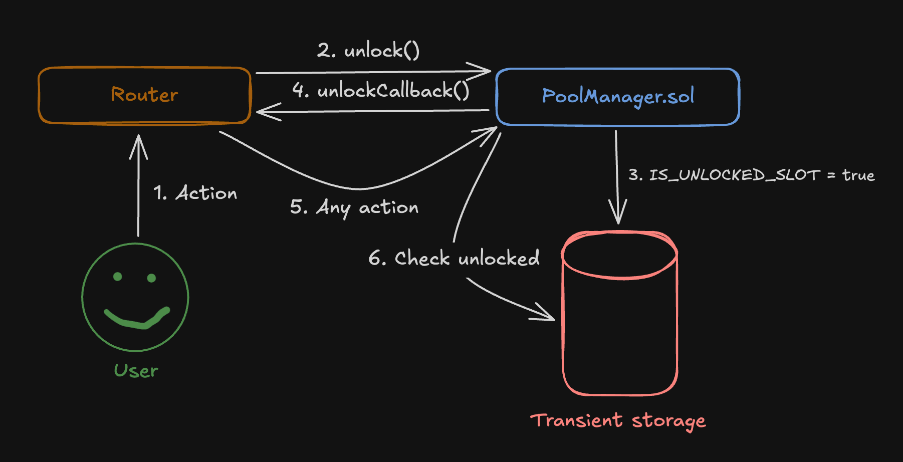

# Overview of Uniswap v4

**Author:** [Pavel Naydanov](https://github.com/PavelNaydanov) 🕵️‍♂️

Uniswap v4 is a new version of the protocol designed to improve asset swap efficiency and enhance scalability.

It's still a DEX. Many believe it's a next-generation DEX?!😅

The new version thoughtfully addresses two major drawbacks of the previous one:

- **High fees when swapping assets.** A swap that needs to go through multiple pools (more than two) is quite resource-intensive. This is especially critical when operating on the Ethereum network.
- **Limited ability to use protocol liquidity outside of it.** A unified codebase for all pools didn’t allow for flexible operations or building other applications on top. Any change to the protocol’s logic required a full fork of the codebase.

## Overview of Innovations

Let's start with the fact that the protocol's math is preserved and taken from the previous version. The code of version four continues to support the concept of concentrated liquidity by default, even though there’s now an option to change it. At the same time, the core principles remain: non-custodial, non-upgradable, and permissionless.

The main changes in the fourth version are aimed at:
- improving pool customization tools for developers
- architectural changes to increase gas efficiency.

These changes aim to address the issues of high fees and limited liquidity usability.

Below, we'll break down the key innovations described in the protocol documentation.

### Hooks

*Designed to solve scalability issues and make liquidity usage outside the protocol more flexible.*

Thanks to hooks, developers can add their own logic to how the protocol’s pools operate. This logic can be executed before and after specific actions: creating a liquidity pool, adding or removing liquidity, and swaps.

A **hook** is a function declared in an external smart contract that is passed along with a given operation call. The hook can be executed before or after the operation, depending on its purpose. The hook smart contract is attached to the pool at the moment of its creation and cannot be changed later—unless the hook smart contract is a proxy contract.

The diagram shows how a hook is integrated into the asset swap process. When the `swap()` function is called, the address of the hook smart contract is passed along with the function parameters. If the `beforeSwap()` hook is defined in that contract, the call is redirected to it. Then, the call returns and the main swap execution on Uniswap takes place. After the swap, the `afterSwap()` hook is triggered in the same way.

If a hook is not specified in the hook smart contract, the hook call is simply ignored during execution.

**Hook Insertion Points**

There are several pool operations that can be influenced by a hook smart contract:

1. When initializing a pool:
    - **beforeInitialize**: The hook will be triggered before the pool is initialized.
    - **afterInitialize**: The hook will be triggered after the pool is initialized.

2. Adding or removing liquidity:
    - **beforeAddLiquidity**: The hook will be triggered before adding liquidity.
    - **afterAddLiquidity**: The hook will be triggered after adding liquidity.
    - **beforeRemoveLiquidity**: The hook will be triggered before removing liquidity.
    - **afterRemoveLiquidity**: The hook will be triggered after removing liquidity.

3. Swap Hooks:
    - **beforeSwap**: The hook will be triggered before the asset swap.
    - **afterSwap**: The hook will be triggered after the asset swap.

4. Donate Hooks:
    - **beforeDonate**: The hook will be triggered before a donation to the pool.
    - **afterDonate**: The hook will be triggered after a donation to the pool.

A hook can affect all the operations described above and be integrated into all possible pool points—or only into some of them.

**Interesting Points**

**First point.** The **beforeInitialize** and **afterInitialize** hooks are executed only once, while all other types of hooks can be used an unlimited number of times.

**Second point.** Hooks for pool donations. What are donations? Donations are a new feature that allows assets to be contributed to a pool. It’s a kind of direct payment to the pool’s liquidity providers, which can be viewed as tipping. It can be used like a classic donation system, but with crypto assets.

For example, a project launches a pool (protocol token and stablecoin). Using a hook smart contract, a mechanism for initial token sales in exchange for the stablecoin is implemented. But if a user likes the project, they can make a donation without needing to buy the protocol token.

**Third point.** Hooks allow for intervention in swap logic. From access control to modifying swap fees and implementing a new pricing curve—whatever your imagination can come up with can be built using hooks. For instance, you could implement a StableSwap-like mechanism (like Curve) for stablecoin swaps.

### Singleton Design

*One pool for all token pairs, which is cheaper than creating separate smart contracts for each pool (as it was in Uniswap v2 and Uniswap v3).*

A new architecture is introduced called the "Singleton Design", which means that all pools are implemented within a single smart contract — [PoolManager.sol](https://github.com/Uniswap/v4-core/blob/main/src/PoolManager.sol). This smart contract defines the logic for managing pools and operations. This approach helps save on gas when creating pools.

Moreover, complex asset swaps involving multiple pools become simpler. There's no longer a need to transfer assets between different pool contracts, since all pools are now implemented within a single smart contract. It's enough to just update the balances inside this unified contract.

However, don’t think that the new version is just a single smart contract for everything. First of all, just like in previous versions, there are two repositories: [v4-core](https://github.com/Uniswap/v4-core) and [v4-periphery](https://github.com/Uniswap/v4-periphery). Core still handles the pools, while periphery is responsible for routing. There are also many additional contracts that implement various parts of the logic — for pools, routers, NFTs, and math. You’d run out of fingers trying to list all the contracts across different libraries.

With the release of newer protocol versions, routing has become a bit more complex. To unify routing, another smart contract is used — [UniversalRouter.sol](https://github.com/Uniswap/universal-router/blob/main/contracts/UniversalRouter.sol). It determines which version's router a call should be sent to. Everything related to routing is kept in a separate repository.

Thus, the fourth version of the protocol works schematically as follows:

Any user call first goes to the Universal Router, which inherits from all versions of routers (v2, v3, v4). This router handles routing calls between different protocol versions and also supports liquidity migration from version three to version four.

For the fourth version, the main logic for executing operations is located in [BaseActionRouter.sol](https://github.com/Uniswap/v4-periphery/blob/main/src/base/BaseActionsRouter.sol). There, a pool unlock call is made (in the diagram, this is the [unlock()](https://github.com/Uniswap/v4-periphery/blob/main/src/base/BaseActionsRouter.sol#L25) call) for the pool the router is interacting with. Then, using a callback, control is handed back to the router to execute the operation (in the diagram, this is the [unlockCallback()](https://github.com/Uniswap/v4-core/blob/main/src/PoolManager.sol#L109) call).

After the pool is unlocked, the call returns to the router to determine the type of action. For example, if the user's action is identified as a [swap()](https://github.com/Uniswap/v4-core/blob/main/src/PoolManager.sol#L109), the call will be sent back to the pool’s smart contract for execution. At that point, the pool will be unlocked to perform the operation.

The pool locking/unlocking mechanism is implemented using the [EIP-1153: Transient storage opcodes](http://eips.ethereum.org/EIPS/eip-1153) standard and serves several purposes at once:
- protection against reentrancy, also known as reentrancy attack prevention  
- atomic execution of complex operations, where a swap consists of a chain of swaps; intermediate balances are stored in transient storage  
- access control for the pool, allowing only authorized actors to interact with the pool’s smart contract.

### Flash Accounting

*Using the cheapest possible data storage for complex operations*

The use of [EIP-1153: Transient storage opcodes](http://eips.ethereum.org/EIPS/eip-1153) enables more efficient execution of operations.

> We’ve written about Transient Storage. If you want to learn more, check it out in our wiki under the EIPs folder.

This works because **Transient Storage** is used to store intermediate operations, while the blockchain state is only updated after all operations are completed. This way, expensive storage (Storage) is used only to finalize data.

Below, we’ve added intermediate storage to our diagram and simplified the router. It shows how transient storage is used in the pool unlocking mechanism.

The pool unlocking mechanism, used to protect against reentrancy attacks, sets the value `true` in a special `IS_UNLOCKED_SLOT` within transient storage. After that, the call is returned to the router, and the router executes the user’s operations. Once the transaction is complete, the transient storage is cleared.

To understand the efficiency of using transient storage, let’s look at the numbers. Changing blockchain state using the `sstore` opcode (writing to an empty storage slot) costs 20,000 gas, while writing to transient storage with the `tstore` opcode costs only 100 gas.

### Native Ether

*Native Ether is supported without the need to use wrappers like [WETH](https://coinmarketcap.com/academy/article/what-is-wrapped-ethereum-weth).*

It’s worth noting that the protocol hasn't worked directly with the native currency since the first version. This feature was removed in version two due to the growing complexity of the protocol and the conflict between native currency and its wrapped version, which would lead to liquidity fragmentation.

| Uniswap Version | ETH Handling | Explanation |
|------------------|--------------|-------------|
| **v2** | Can work with ETH directly | Conversion to WETH inside the contract |
| **v3** | Requires using WETH for ETH | Wrapping into WETH is mandatory for all operations |
| **v4** | Can work with ETH directly without wrapping into WETH | Direct use of ETH, improved efficiency, and gas optimization |

The approach to handling native currency in previous versions added extra steps for users, who had to wrap their native tokens before interacting with the protocol.

Now that inconvenience is in the past, largely thanks to the new Singleton architecture and Flash Accounting. This will improve the user experience and reduce the cost of transactions involving native currency.

### Fees. Dynamic fees

*Fees in Uniswap are charges on asset swaps, collected from users and directly credited to liquidity providers.*

> In addition to LP fees, there’s also a protocol fee. But we’ll focus only on LP fees here, since that’s where the truly important changes are.

The fee limits (0.05%, 0.30%, 1.00%) from version three have been removed. Now, it's possible to set arbitrary fees per pool.

Another innovation is dynamic fees, which can change within pools — increasing or decreasing over time.

The fee change can happen on each swap, each block, or on a schedule — weekly, monthly, etc.

Access to fee management is opened up through hooks. In other words, you can add custom logic inside hooks that affects the fee amount or makes it dynamic. This can be useful for volatile pairs or special liquidity usage scenarios.

_Important!_ As a result of adding dynamic fees, any token pair can now have an unlimited number of pools, each with different fee configurations or hooks.

On one hand, having many pools will let users choose the ones with the most favorable fees, creating natural competition and driving fees down as pools compete for users. On the other hand, it's still hard to say how much more complex routing will become in a soup of so many pools.

### Subscribers

*Allows subscribing to a liquidity provider's position smart contract to receive notifications about changes to that position.*

This is a completely new concept for the Uniswap protocol, aimed at improving the experience for liquidity providers.

Here’s how it works: any smart contract can subscribe to changes in a liquidity provider's position and receive notifications when that position is updated.

To subscribe, the position owner or an approved address must call the [subscribe()](https://github.com/Uniswap/v4-periphery/blob/main/src/base/Notifier.sol#L40) function on the [PositionManager.sol](https://github.com/Uniswap/v4-periphery/blob/main/src/PositionManager.sol) smart contract, which represents positions. They must also pass the address of the smart contract that will receive notifications. In the diagram, this is the `Subscriber.sol` smart contract, which implements a known interface with four functions.

After subscribing, the `Subscriber.sol` smart contract will receive notifications about all changes to the liquidity provider's position directly from the smart contract managing that position.

The following types of notifications are available:
- Subscription initialized  
- Position changed: increased or decreased. Includes info about withdrawn rewards  
- Position transferred  
- Subscription revoked

### ERC-6909

*A new token standard that reflects to the owner the equivalent value of their assets held within the Uniswap protocol, available for use.*

The [ERC-6909](https://eips.ethereum.org/EIPS/eip-6909) token standard is an alternative to ERC-1155. It implements minimal logic, which makes it more gas-efficient to use.

Compared to ERC-1155, ERC-6909 removes batch processing and callbacks, improves delegation, and reduces gas costs for both deployment and interaction.

It works quite simply and is somewhat similar to LP tokens for liquidity providers in traditional models. Instead of moving tokens out of the pool’s smart contract, a user can leave them inside the pool and mint themselves an ERC-6909 token as proof of ownership.

In future interactions that require using tokens held inside the pool, the user can simply burn part (or all) of their ERC-6909 tokens.

The value of this approach lies in reducing overhead, since moving tokens to and from a pool often requires calls to external token smart contracts. In this case, with ERC-6909, such interactions are minimized.

This kind of innovation will appeal to traders and arbitrageurs who perform many swaps in a short period of time — giving them a solid opportunity to save on costs.

This also opens up new possibilities for liquidity providers who frequently open, close, or shift their positions. I think we’ll soon see new rebalancing tools built on top of ERC-6909.

## The Routing Problem in Uniswap V4

Compared to Uniswap V3, routing in V4 has become significantly more complex. This is because, in addition to finding the optimal swap route, the logic introduced by hooks must also be considered.

Even though hooks are expected to implement clear and safe logic, their actual behavior can’t be known without execution. While it’s possible to detect which functions a hook implements, uncertainty remains — making routing in Uniswap V4 much more complex.

As a result, users must trust the logic behind the hooks connected to liquidity pools. And for executors in UniswapX, it’s critical to thoroughly review hooks before including them in their routing algorithms.

Given the trust issues around hooks, there’s a growing need for services that track and assess hook security. The community has already started building such tools, with the most notable example being [HookRank](https://hookrank.io/?ref=ghost-2077.arvensis.systems) — similar in concept to [L2Beat](https://l2beat.com/scaling/summary), but specifically for Uniswap V4 hooks and a bit simpler.

## Conclusion

Uniswap V4 is the next stage in the evolution of decentralized exchanges. It doesn’t introduce new math, but it does open the door to new use cases!

The new architecture removes many of the limitations of previous versions and brings a new level of scalability. Uniswap is no longer just a swap platform — it’s now a full-fledged foundation for building decentralized apps and unique markets.

Tasks that can be tackled with the new version:
- mitigate impermanent loss using dynamic fees configured via hooks  
- reduce gas costs  
- implement custom pricing curve formulas  
- optimize capital efficiency with hooks and subscriptions  
- minimize MEV impact  
- enable fair and transparent token launches  
- and anything else your imagination can come up with

Answering the question: is Uniswap v4 a next-gen DEX? The answer is — more no than yes. From the perspective of a swap engine, nothing revolutionary has been done. The concentrated liquidity concept still works by default. However, this new version throws the doors wide open for a true next-gen DEX to emerge!

Today, Uniswap has the potential to become a liquidity platform — one that others can build on top of using hooks, helping grow the entire protocol ecosystem.

## Links

1. [Official Documentation](https://docs.uniswap.org/contracts/v4/overview)
2. [Official Repositories](https://github.com/Uniswap)
3. [Uniswap V4: Hooks Security Considerations](https://www.certik.com/resources/blog/uniswap-v4-hooks-security-considerations?utm_source=substack&utm_medium=email)
4. [A Complete Guide to Uniswap V4](https://research.2077.xyz/a-complete-guide-to-uniswap-v4-1#history-of-uniswap-v1-and-v2)
5. [Uniswap V4 vs V3: Architectural Changes and Technical Innovations with Code Examples](https://www.cyfrin.io/blog/uniswap-v4-vs-v3-architectural-changes-and-technical-innovations-with-code-examples)
