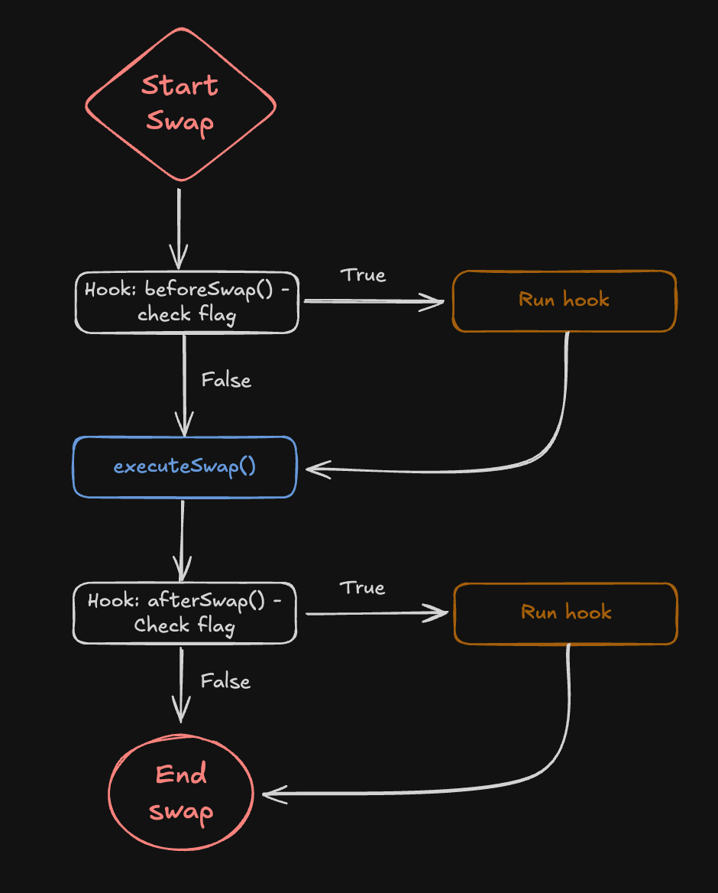

# Uniswap v4 Architecture

**Author:** [Pavel Naidanov](https://github.com/PavelNaydanov) 🕵️‍♂️

**Uniswap V4** is a platform for building DeFi protocols, implementing a **"Singleton Design"** architecture that allows arbitrary logic to be integrated into pool operations.

The architecture of the fourth version of the protocol has undergone significant changes: it has combined all liquidity pools into a single smart contract and implemented a "hook" mechanism for customizing pool logic.

In the third version of the protocol, the rule is 1 pool = 1 smart contract. To create a new pool, a special factory smart contract [UniswapV3Factory.sol](https://github.com/Uniswap/v3-core/blob/main/contracts/UniswapV3Factory.sol) is used, which inherits from [UniswapV3PoolDeployer.sol](https://github.com/Uniswap/v3-core/blob/main/contracts/UniswapV3PoolDeployer.sol).

At the same time, user operations, such as various types of swaps, go through the [SwapRouter.sol](https://github.com/Uniswap/v3-periphery/blob/main/contracts/SwapRouter.sol) smart contract directly to the pool.


Now let's see how pool creation works in the fourth version.


To create a new pool, the [initialize()](https://github.com/Uniswap/v4-core/blob/main/src/PoolManager.sol#L117) function is called on the [PoolManager.sol](https://github.com/Uniswap/v4-core/blob/main/src/PoolManager.sol) smart contract. Information about the created pool is stored in the state of the pool manager smart contract.

At the same time, user operations, such as various types of swaps, go through the [V4Router.sol](https://github.com/Uniswap/v4-periphery/blob/main/src/V4Router.sol) smart contract, but all the low-level logic for processing operations on the pool takes place in the [Pool.sol](https://github.com/Uniswap/v4-core/blob/main/src/libraries/Pool.sol) library, which is used by `PoolManager.sol`.

The singleton architecture provides significant gas savings, as creating a new pool only requires updating the state instead of deploying a new pool smart contract. Also, swapping through a chain of pools no longer requires physically transferring tokens through intermediate pools, which greatly reduces gas costs.

## Protocol Repositories

The protocol continues its tradition of splitting the codebase into two repositories, similar to previous versions:
- [v4-core](https://github.com/Uniswap/v4-core/tree/main).
- [v4-periphery](https://github.com/Uniswap/v4-periphery).

Core is still responsible for pools, while periphery handles routing to the pools. There are also many additional smart contracts that, in one way or another, implement the logic of pools, the router, the LP token, and the mathematics.

The diagram below shows the list of smart contracts in the two repositories.


I’ve listed the names of the main smart contracts divided into 4 groups:
- **Blue** indicates the main smart contracts that implement the core protocol logic.
- **Orange** indicates smart contracts that are libraries.
- **Pink** indicates auxiliary smart contracts intended only for reading data from the blockchain.
- **Green** indicates auxiliary smart contracts. In our case, we have identified only the smart contract that describes the minimal hook logic.

The larger the smart contract name, the more important it is in the Uniswap code. There are several such smart contracts in the diagram:
- [PoolManager.sol](https://github.com/Uniswap/v4-core/blob/main/src/PoolManager.sol). The primary smart contract from the core group that manages token pools.
- [V4Router.sol](https://github.com/Uniswap/v4-periphery/blob/main/src/V4Router.sol). A smart contract from the periphery group that is responsible for the initial processing of user operations before sending the call to the core group smart contracts.
- [PositionManager.sol](https://github.com/Uniswap/v4-periphery/blob/main/src/PositionManager.sol). A smart contract from the periphery group that is responsible for adding/removing liquidity and implementing the LP token (NFT) that represents a liquidity provider’s position. This is the entry point for the liquidity provider, allowing them to manage liquidity on the `PoolManager.sol` smart contract.

## Structure of the Pool Manager

The [PoolManager.sol](https://github.com/Uniswap/v4-core/blob/main/src/PoolManager.sol) smart contract implements the following functionality:

- **modifyLiquidity()**. Liquidity management function: adding, removing, and modifying liquidity. This function is usually called by the liquidity provider, but not directly — instead, through the `PositionManager.sol` smart contract.
- **swap()**. Asset swapping. This function is usually called by the user, but not directly — instead, through the `V4Router.sol` smart contract.
- **donate()**. Direct donations to liquidity providers. This is a way to increase liquidity in the pool bypassing the liquidity provider mechanism.
- **mint()/burn()**. Minting and burning ERC-6909 tokens, which confirm the presence of a user's assets in the protocol. After a swap, you can choose not to withdraw the token but instead mint its equivalent in ERC-6909. Minting ERC-6909 is always cheaper in gas than transferring any token.
- **take()/settle()**. Functions for borrowing and repaying assets. Used for flash loans and more. Allows taking assets from the pool as a loan and repaying them.
- **sync()**. For synchronizing the pool’s state with its current token reserves and price.

**Storage Variables**

The pool manager has acquired a neat mapping for managing multiple pools.

```solidity
mapping(PoolId id => Pool.State) internal _pools;
```

**PoolId** is a unique pool identifier, which is actually a `bytes32`. Essentially, the identifier is a hash of the pool parameters. To obtain the id, the [PoolIdLibrary](https://github.com/Uniswap/v4-core/blob/main/src/types/PoolId.sol#L9) library is used, with a single function `toId()`.

```Solidity
// Taken from PoolKey.sol
struct PoolKey {
    // Information about token 0
    Currency currency0;
    // Information about token 1
    Currency currency1;
    // Fee
    uint24 fee;
    // Tick size
    int24 tickSpacing;
    // Address of the hook smart contract
    IHooks hooks;
}

library PoolIdLibrary {
    function toId(PoolKey memory poolKey) internal pure returns (PoolId poolId) {
        assembly ("memory-safe") {
            // 0xa0 represents the size of PoolKey (5 slots of 32 bytes)
            poolId := keccak256(poolKey, 0xa0)
        }
    }
}
```

`Pool.State` is the entire current state of the pool — we’ll take a look at it a bit later.

`PoolManager.sol` also has two constants in storage that define the minimum and maximum tick boundaries.

```solidity
int24 private constant MAX_TICK_SPACING = TickMath.MAX_TICK_SPACING;
int24 private constant MIN_TICK_SPACING = TickMath.MIN_TICK_SPACING;
```

All other storage variables are tucked away in the smart contracts that `PoolManager.sol` inherits from.

**What PoolManager Inherits From**


- [NoDelegateCall.sol](https://github.com/Uniswap/v4-core/blob/main/src/NoDelegateCall.sol). Protection against delegated calls. Safeguards the unlock mechanism. When a callback is made, it’s not possible to execute the logic of another smart contract. In other words, `delegateCall` to `PoolManager` is prohibited for security reasons.
- [ERC6909Claims.sol](https://github.com/Uniswap/v4-core/blob/main/src/ERC6909Claims.sol). Allows minting and burning a token equivalent to the user’s assets left inside the protocol.
- [Extsload.sol](https://github.com/Uniswap/v4-core/blob/main/src/Extsload.sol) and [Exttload.sol](https://github.com/Uniswap/v4-core/blob/main/src/Exttload.sol). Allows the [TransientStateLibrary.sol](https://github.com/Uniswap/v4-core/blob/main/src/libraries/TransientStateLibrary.sol) library to read and write data to temporary storage. The library itself is used from outside the core group smart contracts. It is used for intermediate calculations.

But that’s not all — if we recall the screenshot with the repository smart contracts, it showed a lot of logic moved into libraries.


In fact, there are many [more libraries](https://github.com/Uniswap/v4-core/tree/main/src/libraries). But the most interesting one is the [Pool.sol](https://github.com/Uniswap/v4-core/blob/main/src/libraries/Pool.sol) smart contract. This library handles all operations that can be applied to a pool: from modifying a liquidity provider’s position to swapping and changing tick information.

`Pool.sol` defines the [state structure](https://github.com/Uniswap/v4-core/blob/main/src/libraries/Pool.sol#L83C1-L91C6) of the pool. We promised to take a look at the state structure earlier.

```solidity
struct State {
    Slot0 slot0; // Packed bytes: price, fee, unlock flag, current tick
    uint256 feeGrowthGlobal0X128; // Accumulated fees for liquidity providers for token 0
    uint256 feeGrowthGlobal1X128; // Accumulated fees for liquidity providers for token 1
    uint128 liquidity; // Total current pool liquidity, expressed in liquidity units
    mapping(int24 tick => TickInfo) ticks; // Liquidity information for all ticks
    mapping(int16 wordPos => uint256) tickBitmap; // Bit representation of ticks for efficient search during swaps
    mapping(bytes32 positionKey => Position.State) positions; // Stores the state of each liquidity position in the pool
}
```

After that, you should get familiar with the libraries:
- [StateLibrary.sol](https://github.com/Uniswap/v4-core/blob/main/src/libraries/StateLibrary.sol). Helps retrieve data from Slot0. Not used directly in `PositionManager.sol`, but clearly shows the structure of Slot0.
- [Position.sol](https://github.com/Uniswap/v4-core/blob/main/src/libraries/Position.sol). Responsible for operations with liquidity providers’ positions.
- [TickBitmap.sol](https://github.com/Uniswap/v4-core/blob/main/src/libraries/TickBitmap.sol) and [TickMath.sol](https://github.com/Uniswap/v4-core/blob/main/src/libraries/TickMath.sol). Auxiliary libraries for working with ticks.
- [SwapMath.sol](https://github.com/Uniswap/v4-core/blob/main/src/libraries/SwapMath.sol). Helps calculate swap results.
- [Hooks.sol](https://github.com/Uniswap/v4-core/blob/main/src/libraries/Hooks.sol). Executes the hook logic: validation and execution.

These were the main libraries necessary for understanding; the rest can be explored in the code as needed.

## Smart Contract Call Flow

In this section, we’ll break down the transaction call flow from the moment it’s sent by the user to its final execution on the smart contracts. All users can be conditionally divided into two types:
- A liquidity provider who supplies assets to an abstract token pool.
- A regular user performing a swap from one asset to another.

Each type of user will have a different entry point.


Liquidity providers must interact with the [PositionManager.sol](https://github.com/Uniswap/v4-periphery/blob/main/src/PositionManager.sol#L195) smart contract, which processes the operation data and forwards it to the pool manager smart contract.

Regular users use [V4Router.sol](https://github.com/Uniswap/v4-periphery/blob/main/src/V4Router.sol#L32), which processes the operation data and forwards it to the pool manager smart contract.

Both entry points, logically, inherit from the [BaseActionsRouter.sol](https://github.com/Uniswap/v4-periphery/blob/main/src/base/BaseActionsRouter.sol) smart contract, which governs the processing of incoming operations.

## Cross-Version Routing

It’s important to understand that at the time of writing this article, the second, third, and fourth versions of the protocol exist — and I think that’s not the limit! Swaps can be arranged into an entire chain of exchanges across different pools and different protocol versions.

Thus, it’s logical to have a layer between the protocol interface and the different versions of smart contracts. This layer is called **UniversalRouter** and is located in a separate [repository](https://github.com/Uniswap/universal-router).


The [UniversalRouter.sol](https://github.com/Uniswap/universal-router/blob/main/contracts/UniversalRouter.sol) smart contract inherits from specific smart contracts (routers) that implement integration logic with each version of the protocol.


To trigger the routing mechanism through `UniversalRouter.sol`, you need to call the [execute(bytes calldata commands, bytes[] calldata inputs, uint256 deadline)](https://github.com/Uniswap/universal-router/blob/main/contracts/UniversalRouter.sol#L35) function. The function takes a set of command bytes (or user operations, such as a swap in UniV2), an array of input data (recipient address, amount, and so on for each command), and a deadline.

Below is pseudocode: how to encode the `execute()` call.

```solidity
import {Commands} from 'universal-router/contracts/libraries/Commands.sol';

...

function executeV2SwapExactOut(address recipient, uint256 amountIn, uint256 amountOutMin) external {
    uint256 deadline = block.timestamp + 60;
    bytes memory commands = abi.encodePacked(bytes1(uint8(Commands.V2_SWAP_EXACT_OUT)));

    bytes[] memory inputs = new bytes[](1);
    inputs[0] = abi.encode(
      recipient,
      amountIn,
      amountOutMin,
      abi.encodePacked(WETH, DAI),
      true // Determines who will pay for the call
    );

    IUniversalRouter(router).execute{value: 0}(commands, inputs, deadline);
}
```

Multiple commands are encoded as follows:

```solidity
bytes memory commands = abi.encodePacked(
    bytes1(uint8(Commands.V2_SWAP_EXACT_OUT)),
    bytes1(uint8(Commands.V4_POSITION_MANAGER_CALL))
);
```

_Important!_ It’s worth noting the locations of the smart contracts. In the inheritance chain, the [V4SwapRouter.sol](https://github.com/Uniswap/universal-router/blob/main/contracts/modules/uniswap/v4/V4SwapRouter.sol#L11) smart contract inherits from the [V4Router.sol](https://github.com/Uniswap/v4-periphery/blob/main/src/V4Router.sol) smart contract, which is located in the periphery repository.

## Interesting Techniques in the Protocol Code

In this section, we’ll look at even more interesting mechanics used in the protocol.

### Pool Unlocking

By default, token pools are “locked,” meaning operations with them are unavailable. The pool unlocking mechanism ensures that operations are executed atomically and that no one can interfere with the process. Essentially, this is protection against reentrancy attacks.

The [unlock()](https://github.com/Uniswap/v4-core/blob/main/src/PoolManager.sol#L104) function is responsible for unlocking the pool. At the same time, the `unlock()` function is the only entry point for the `PoolManager.sol` smart contract.

The unlocking mechanism is implemented using [EIP-1153: Transient storage opcodes](https://eips.ethereum.org/EIPS/eip-1153).

> We’ve written about Transient Storage. If you want to learn more about it, look for it in our wiki under the EIPs folder.

The entire pool unlocking process is shown in the diagram below.


Any user action that reaches a routing smart contract (`V4Router.sol`, `PositionManager.sol`) first calls [unlock()](https://github.com/Uniswap/v4-periphery/blob/main/src/base/BaseActionsRouter.sol#L26) on the [PoolManager.sol](https://github.com/Uniswap/v4-core/blob/main/src/PoolManager.sol#L104) smart contract.

After unlocking, `PoolManager.sol` makes a callback through the [unlockCallback()](https://github.com/Uniswap/v4-core/blob/main/src/PoolManager.sol#L110) function. Then the user action is [processed](https://github.com/Uniswap/v4-periphery/blob/main/src/base/BaseActionsRouter.sol#L51), and another call is made to `PoolManager.sol` to handle the user’s action.

At the end of the operation, the pool will be [locked again](https://github.com/Uniswap/v4-core/blob/main/src/PoolManager.sol#L113) and unavailable for operations. Thus, the one who unlocked the pool is the one who performs the operation.

```solidity
function unlock(bytes calldata data) external override returns (bytes memory result) {
    if (Lock.isUnlocked()) AlreadyUnlocked.selector.revertWith();

    // Unlock the pool if it has not been unlocked
    Lock.unlock();

    // Make a callback to start the operation
    result = IUnlockCallback(msg.sender).unlockCallback(data);

    ...

    // Lock the pool
    Lock.lock();
}
```

The [unlockCallback()](https://github.com/Uniswap/v4-periphery/blob/main/src/base/SafeCallback.sol) function is located in the [SafeCallback.sol](https://github.com/Uniswap/v4-periphery/blob/main/src/base/SafeCallback.sol) smart contract, from which [BaseActionsRouter.sol](https://github.com/Uniswap/v4-periphery/blob/main/src/base/BaseActionsRouter.sol#L12C19-L12C36) inherits.

The actual implementation of the function is located in [BaseActionsRouter.sol](https://github.com/Uniswap/v4-periphery/blob/main/src/base/BaseActionsRouter.sol#L32).

```solidity
function _unlockCallback(bytes calldata data) internal override returns (bytes memory) {
    // Decodes the call parameters
    (bytes calldata actions, bytes[] calldata params) = data.decodeActionsRouterParams();

    // Executes the user's operation(s)
    _executeActionsWithoutUnlock(actions, params);

    return "";
}
```

It’s interesting to take a look at what the locking mechanism actually is, because transient storage is used to store the unlock state.

It’s simple: there’s a dedicated [Lock.sol](https://github.com/Uniswap/v4-core/blob/main/src/libraries/Lock.sol) library, which sets the unlock flag using the new `tstore` and `tload` opcodes.

```solidity
library Lock {
    // Unique hash of the slot
    bytes32 internal constant IS_UNLOCKED_SLOT = ...;

    function unlock() internal {
        assembly ("memory-safe") {
            // Set the unlocked flag
            tstore(IS_UNLOCKED_SLOT, true)
        }
    }

    function lock() internal {
        assembly ("memory-safe") {
            // Set the locked flag
            tstore(IS_UNLOCKED_SLOT, false)
        }
    }

    ...
}
```

In this simple way, call atomicity is guaranteed. In the future, the library may be removed once the Solidity compiler introduces keywords for managing transient storage.

### How Hooks Are Integrated

The theory is simple. You prepare your hook smart contract (to do this, you must inherit it from the abstract [BaseHook.sol](https://github.com/Uniswap/v4-periphery/blob/main/src/utils/BaseHook.sol)) and create a pool with this hook. Now all calls will automatically pass through this hook smart contract.

For this hook mechanism, it’s logical to assume that the pool manager smart contract must be able to do two things:
1. Know the hook of each pool (if it exists)
2. Be able to make calls to the hook smart contract

All hooks work on the same principle, so let’s look at the [swap()](https://github.com/Uniswap/v4-core/blob/main/src/PoolManager.sol#L187) function as an example.



In the code, triggering the hook before and after the operation looks simple and is done through a direct call to the `beforeSwap()`/`afterSwap()` functions.

```solidity
function swap(PoolKey memory key, SwapParams memory params, bytes calldata hookData)
    external
    onlyWhenUnlocked
    noDelegateCall
    returns (BalanceDelta swapDelta)
{
    ...

    BeforeSwapDelta beforeSwapDelta;
    {
        int256 amountToSwap;
        uint24 lpFeeOverride;
        (amountToSwap, beforeSwapDelta, lpFeeOverride) =

        // Call the hook before executing the swap
        key.hooks.beforeSwap(key, params, hookData);

        swapDelta = _swap(...);
    }

    BalanceDelta hookDelta;
    // Call the hook after executing the hook
    (swapDelta, hookDelta) = key.hooks.afterSwap(key, params, swapDelta, hookData, beforeSwapDelta);

    ...
}
```

Thus, the hook is executed before and after any user operation. Information about the hook’s address is stored in the [PoolKey](https://github.com/Uniswap/v4-core/blob/main/src/types/PoolKey.sol#L21) structure.

_Important!_ Pay attention to the `bytes calldata hookData` parameter in the `swap()` function. This is an arbitrary set of bytes that can be passed along with the call to the hook.

**Hook Codebase Architecture**

If the hook execution flow should be clear, the smart contracts are a bit more complex.


Initially, when a swap is called, the function on `PoolManager.sol` takes a `PoolKey` parameter, which, in addition to token information, contains the address of the hook smart contract.

_Important!_ The address of the hook smart contract is part of the unique pool identifier. That’s why the hook smart contract is set only once during pool initialization.

Then, to handle the hook call, a library is used that wraps all `IHooks` interfaces. This library validates the call and, if the hook is activated, forwards the call to the user’s `CustomHook.sol` smart contract, which inherits from the base `BaseHook.sol` implementation.

**Hook Processing Library**

The logic for processing a hook call is located in the [Hooks.sol](https://github.com/Uniswap/v4-core/blob/main/src/libraries/Hooks.sol) library.

If a hook is not defined, the call is effectively not executed, but the verification code is still present. Gas is spent on the check — there’s no way around it.

```solidity
function beforeSwap(IHooks self, PoolKey memory key, SwapParams memory params, bytes calldata hookData)
    internal
    returns (int256 amountToSwap, BeforeSwapDelta hookReturn, uint24 lpFeeOverride)
{
    ...

    // Check that the hook is active
    if (self.hasPermission(BEFORE_SWAP_FLAG)) {
        // Call the beforeSwap function on the hook smart contract
        bytes memory result = callHook(self, abi.encodeCall(IHooks.beforeSwap, (msg.sender, key, params, hookData)));

        ...
    }
}
```

**Initialization Hook**

There is one important difference with the hook that is called during initialization. We know that the hook smart contract address is not random — it is created using the special [HookMiner.sol](https://github.com/Uniswap/v4-periphery/blob/main/src/utils/HookMiner.sol) library, which encodes into the hook’s address the list of functions (user actions, swaps, etc.) for which the hook is active.

Therefore, during pool initialization, the hook address is additionally verified.

```solidity
function initialize(PoolKey memory key, uint160 sqrtPriceX96) external noDelegateCall returns (int24 tick) {
    ...

    // Verify the hook address
    if (!key.hooks.isValidHookAddress(key.fee)) Hooks.HookAddressNotValid.selector.revertWith(address(key.hooks));

    ...

    // Call the hook before pool initialization
    key.hooks.beforeInitialize(key, sqrtPriceX96);

    PoolId id = key.toId();
    tick = _pools[id].initialize(sqrtPriceX96, lpFee);

    ...

    // Call the hook after pool initialization
    key.hooks.afterInitialize(key, sqrtPriceX96, tick);
}
```

## Conclusion

Uniswap V4 continues to set trends in the technical implementation of DeFi applications. Combining all liquidity pools into a single smart contract not only reduces gas costs by eliminating the need to deploy new smart contracts but also simplifies “complex” swaps by removing the physical transfer of tokens between pools.

The V4 architecture, with management through `PoolManager.sol`, ensures atomic operations thanks to the unlocking mechanism (using EIP-1153), protecting against reentrancy attacks.

The new “hooks” feature adds flexibility, allowing developers to implement custom logic.

Uniswap V4 is not just an optimization but also a platform for innovation in DeFi, awaiting your contribution!

Thanks to this article, we’ve covered the basics of V4 while leaving room for further exploration — from deep dives into libraries such as `Pool.sol`, `SwapMath.sol`, and `Hooks.sol` to experimenting with hooks.
