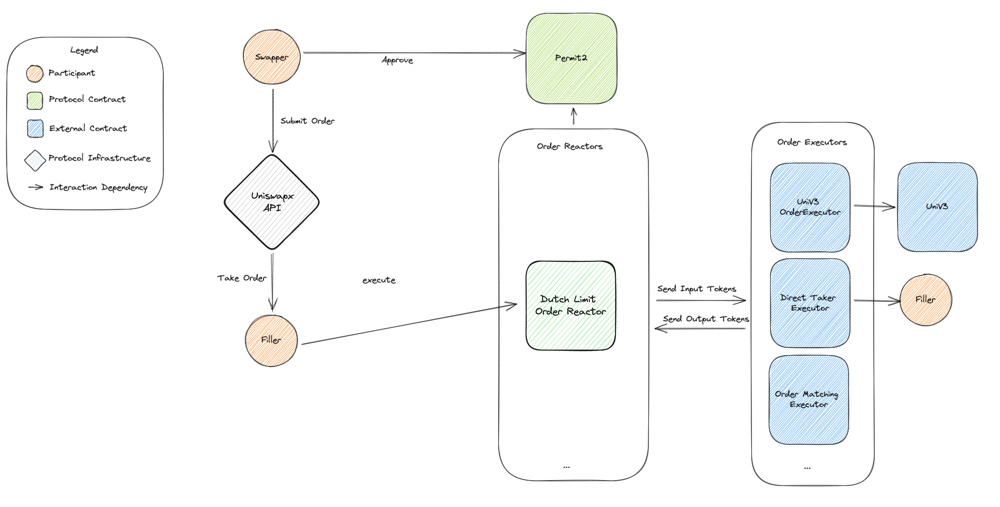
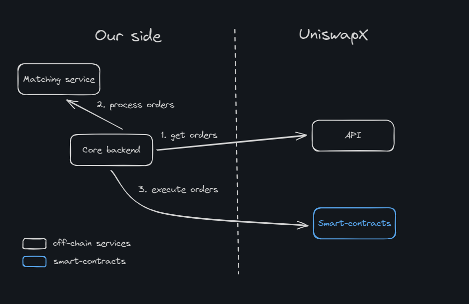
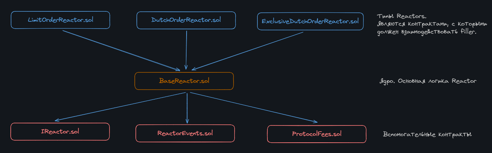
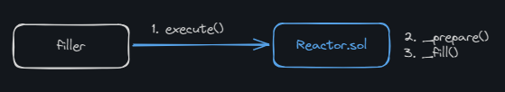
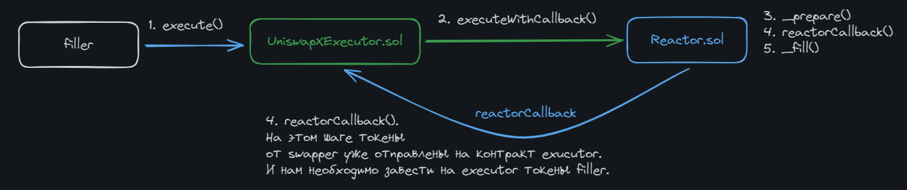

# Uniswap X

**Author:** [Pavel Naydanov](https://github.com/PavelNaydanov) 🕵️‍♂️

**UniswapX** is a protocol that facilitates token swaps through third-party liquidity providers using an auction mechanism. This approach is somewhat similar to a traditional orderbook filled with user limit orders. The difference is that orders are processed via an auction, where the execution cost decreases over time.

Essentially, as the complexity of asset swap routing grows, UniswapX offers a solution where the task of building swap routes can be delegated to third-party protocols. The idea is that these third-party protocols, which manage liquidity, will compete to offer the best execution price. Meanwhile, the user interface remains within the main Uniswap application.

The protocol defines two types of participants:
- **swapper** - the initial initiator of the swap. Creates a signed order to exchange one asset for another.
- **filler** - fulfills the order created by the **swapper**. To execute the order, provides the asset required by the **swapper**.

_Important!_ In this context, the swapper acts as the maker, while the filler acts as the taker.

## Protocol Workflow

To exchange one asset for another, the **swapper** creates a special type of order called an "Exclusive Dutch Order" with the following parameters:
- **endAmount** - the amount at the end of the auction, essentially the minimum amount the swapper is willing to receive
- **startAmount** - the amount at the beginning of the auction, essentially the maximum amount the swapper can receive
- **timePeriod** - the time period for order execution, during which the exchange rate will decrease from the startAmount to the endAmount

This means that a Dutch auction will be initiated for the user’s order, with the execution cost decreasing over time. In practice, the longer the order remains unfilled, the less the **swapper** will receive, but the more attractive it becomes for the **filler** to execute.

After creating an order, the **swapper** signs the order using [Permit2](https://github.com/Uniswap/permit2), which grants approval for UniswapX contracts to transfer assets in order to execute the order.

The information about the created order is available to anyone willing to take on the role of **filler**.



The diagram above is taken directly from the protocol documentation. It illustrates the process described above:
1. The **Swapper** submits an order to UniswapX and gives an approve() via the Permit2 service.
2. The **Filler** receives the user's order and executes it on the UniswapX contracts. These contracts are referred to by a special term, **Reactors**. We’ll take a closer look at them later.
3. The initiated order execution on the **Reactors** contracts validates the order for executability and performs the physical asset exchange between the **filler** and **swapper**.

## Integration with the Uniswap X Protocol

To integrate with the UniswapX protocol, the following capabilities are required:

1. Retrieve a list of all available orders ready for execution
2. Select orders that can be executed by a managed filler
3. Execute orders

At a high level, this can be represented as follows:



To retrieve orders, UniswapX provides an API. To select an order, you'll need to implement your own matching system, and to execute orders, you'll need to interact with UniswapX smart contracts.

### API

UniswapX offers several endpoints for retrieving the list of orders. You can check the [public Swagger documentation](https://api.uniswap.org/v2/uniswapx/docs).

Example of a curl request to retrieve an order based on a Dutch auction:

```js
GET https://api.uniswap.org/v2/orders?orderStatus=open&chainId=1&limit=1
```

The response will be approximately as follows json:

```json
{
    "orders": [
        {
            "outputs": [
                {
                    "recipient": "0x1453e532bd0e3425fec34c74b60feb58d3ced62e",
                    "startAmount": "19197120083527785617956515349",
                    "endAmount": "18920239513175289979421732778",
                    "token": "0x6982508145454Ce325dDbE47a25d4ec3d2311933"
                },
                {
                    "recipient": "0x000000fee13a103a10d593b9ae06b3e05f2e7e1c",
                    "startAmount": "48113082916109738390868459",
                    "endAmount": "47419146649562130274239931",
                    "token": "0x6982508145454Ce325dDbE47a25d4ec3d2311933"
                }
            ],
            "encodedOrder": "0x00000000000000000000000000000000000000000000000000000000000000200000000000000000000000000000000000000000000000000000000000000120000000000000000000000000000000000000000000000000000000006671858700000000000000000000000000000000000000000000000000000000667185ff000000000000000000000000bcc66fc7402daa98f5764057f95ac66b9391cd6b00000000000000000000000000000000000000000000000000000000000000640000000000000000000000006b175474e89094c44da98b954eedeac495271d0f000000000000000000000000000000000000000000002a5a058fc295ed000000000000000000000000000000000000000000000000002a5a058fc295ed00000000000000000000000000000000000000000000000000000000000000000002000000000000000000000000006000da47483062a0d734ba3dc7576ce6a0b645c40000000000000000000000001453e532bd0e3425fec34c74b60feb58d3ced62e046832ba303bf9169a9d46dd5a9d6d20483dd9cb0a9fc6a01957d06fcb8f5731000000000000000000000000000000000000000000000000000000006671860b000000000000000000000000000000000000000000000000000000000000000000000000000000000000000000000000000000000000000000000000000000c0000000000000000000000000000000000000000000000000000000000000000000000000000000000000000000000000000000000000000000000000000000020000000000000000000000006982508145454ce325ddbe47a25d4ec3d231193300000000000000000000000000000000000000003e077c4d0054fa9ae147ae1500000000000000000000000000000000000000003d22748f34df954eeae22faa0000000000000000000000001453e532bd0e3425fec34c74b60feb58d3ced62e0000000000000000000000006982508145454ce325ddbe47a25d4ec3d231193300000000000000000000000000000000000000000027cc57737d53651eb851eb000000000000000000000000000000000000000000273965173af2424872c5bb000000000000000000000000000000fee13a103a10d593b9ae06b3e05f2e7e1c",
            "signature": "0xa162dcbe5c514219b56cc076073c2f17f5e98884742140562a4c2cf1a874d31c125751581f9c8b8b77b1f386204a0fa3a0afddc2b463abea9d97090f3f52286d1b",
            "input": {
                "endAmount": "200000000000000000000000",
                "token": "0x6B175474E89094C44Da98b954EedeAC495271d0F",
                "startAmount": "200000000000000000000000"
            },
            "orderStatus": "open",
            "createdAt": 1718715742,
            "quoteId": "fa4abaa0-099c-4b80-910b-63ec29a34a44",
            "chainId": 1,
            "orderHash": "0xc9fda305699f447eb65c5fe013de773a8d3b31fbb22a5e0dfe9dfe607457486b",
            "nonce": "1993353596017098603749957683210189393906581838619635883099842642777929111345",
            "type": "Dutch"
        }
    ],
    "cursor": "eyJjaGFpbklkX29yZGVyU3RhdHVzIjoiMV9vcGVuIiwiY3JlYXRlZEF0IjoxNzE4NzE1NzQyLCJvcmRlckhhc2giOiIweGM5ZmRhMzA1Njk5ZjQ0N2ViNjVjNWZlMDEzZGU3NzNhOGQzYjMxZmJiMjJhNWUwZGZlOWRmZTYwNzQ1NzQ4NmIifQ=="
}
```

To decode the `encodedOrder` field, you’ll need to use the [SDKs](https://github.com/Uniswap/sdks/tree/main/sdks/uniswapx-sdk).

However, using polling to continuously retrieve the list of orders is not the most efficient or fastest approach. Therefore, UniswapX offers the option to work with webhooks. This is a more private method of receiving orders, and to implement it, you’ll need to contact the UniswapX team to get connected to their notification system. You can read more about it [here](https://docs.uniswap.org/contracts/uniswapx/guides/webhooks).

### Matching system

The smallest section in the article, but the most important from a business perspective. There are countless ways to select orders for execution specifically by your protocol. The final algorithm will depend on a variety of factors, from the protocol's goal to the execution amount. So, I suggest we treat this as a black box and move on to the next section.

### UniswapX Smart Contracts and Order Execution

The smart contract that the **filler** needs to interact with is referred to by a special term: **reactor**. `Reactor.sol` processes and validates user orders, determines input and output assets, and makes a callback to the caller's address (if necessary).

The protocol offers several options for implementing the `Reactor.sol` smart contract:
- [LimitOrderReactor.sol](https://github.com/Uniswap/UniswapX/blob/main/src/reactors/LimitOrderReactor.sol). For executing simple limit orders
- [DutchOrderReactor.sol](https://github.com/Uniswap/UniswapX/blob/main/src/reactors/DutchOrderReactor.sol). For executing orders whose price decreases according to a Dutch auction
- [ExclusiveDutchOrderReactor.sol](https://github.com/Uniswap/UniswapX/blob/main/src/reactors/ExclusiveDutchOrderReactor.sol). For executing orders whose price decreases according to a Dutch auction, but with the addition of an `exclusiveFiller` concept, which allows a specific participant to take part in the auction. This is an optional field that extends the functionality of `DutchOrderReactor.sol`. If it’s not specified, the reactor functions essentially as a simple auction-based reactor.

All implementation options share a large portion of common code, which is moved to an abstract smart contract [BaseReactor.sol](https://github.com/Uniswap/UniswapX/blob/main/src/reactors/BaseReactor.sol).



Let's take a look at the interface [IReactor.sol](https://github.com/Uniswap/UniswapX/blob/main/src/interfaces/IReactor.sol), which defines the set of functions for the `BaseReactor.sol` smart contract.

```js
// SPDX-License-Identifier: GPL-2.0-or-later
pragma solidity ^0.8.0;

import {SignedOrder} from "../base/ReactorStructs.sol";

interface IReactor {
   /// @notice Executes an order
/// @param order The structure of the signed order
function execute(SignedOrder calldata order) external payable;

/// @notice Executes an order with a callback
/// @param order The structure of the signed order
/// @param callbackData Data to be passed to the callback
function executeWithCallback(SignedOrder calldata order, bytes calldata callbackData) external payable;

/// @notice Executes an array of orders
/// @param orders Array of signed order structures
function executeBatch(SignedOrder[] calldata orders) external payable;

/// @notice Executes an array of orders with a callback for each order
/// @param orders Array of signed order structures
/// @param callbackData Array of data to be passed to the callback
    function executeBatchWithCallback(SignedOrder[] calldata orders, bytes calldata callbackData) external payable;
}
```

The interface describes only **four functions**, which are provided to the filler for order execution. The first two are responsible for different order execution strategies. The last two allow executing multiple orders for each strategy.

## Order Execution Strategies

The filler is provided with two strategies for order execution to choose from:
 1. Direct Filler
 2. Fill Contracts

### "Direct Filler" Strategy



The "Direct Filler" strategy assumes that at the moment of order execution, the **filler** already has enough assets on balance for the swapper. To use this strategy, the filler can call one of two functions. [execute()](https://github.com/Uniswap/UniswapX/blob/main/src/reactors/BaseReactor.sol#L31) или [executeBatch()](https://github.com/Uniswap/UniswapX/blob/main/src/reactors/BaseReactor.sol#L55) directly on the `Reactor.sol` contract.

To use this strategy, the **filler** must first grant approval to the Reactor contract and have a sufficient amount of the asset available to fulfill the order.

### "Fill Contracts" Strategy



The "Fill Contracts" strategy is slightly more complex but also more flexible. The main difference is that, for interacting with the `Reactor.sol` contract, the **filler** uses their own intermediary smart contract. In the diagram, this smart contract is called `UniswapXExecutor.sol`. Any **filler** can use their own intermediary smart contract or even multiple ones. The only requirement for the contract is that it must implement the interface.[IReactorCallback.sol](https://github.com/Uniswap/UniswapX/blob/v1.1.0/src/interfaces/IReactorCallback.sol).

And then the order execution process looks as follows:
1. The **filler** calls the `execute()` function on the `UniswapXExecutor.sol` contract. The main purpose of this function is to call `executeWithFallback()` on the `Reactor.sol` contract.
2. `executeWithFallback()` will validate the order for executability (by calling the private `_prepare()` function) and, if everything is fine, will deduct tokens from the swapper and send them to the caller. In our case, this is the filler contract `UniswapXExecutor.sol`. After that, it will make a callback to the `UniswapXExecutor.sol` contract.
3. This callback allows the filler to programmatically perform token manipulations on behalf of the swapper. For example, it could swap tokens on another DEX for the needed asset and withdraw it to their own address. After this, the assets that will be transferred to the swapper should be deposited back to the contract. This can be done in any convenient way. The simplest option is to transfer them directly from the filler.
4. Finally, the private `_fill()` function will transfer assets from the `UniswapXExecutor.sol` contract to the swapper. If something goes wrong, such as an insufficient token amount to fulfill the order, the transaction will be reverted.

_Important!_ The advantage of this process is that everything happens within a single transaction. Only the **filler** pays for the gas.

*What is this strategy useful for?* For any custom filler logic. Here are two examples that I think are the most interesting:

1. We manage multiple fillers. That is, we act as aggregators of liquidity providers. Thus, we can implement a single entry point in the form of the `UniswapXExecutor.sol` contract, to which fillers will grant approval for asset management. We can set up a whitelist of our own fillers and execute orders on behalf of the protocol, using the liquidity of the fillers.
2. The filler does not have the asset required to fulfill the order but has another asset. For example, our filler only has ETH, but USDT is needed to execute the order. Then, under the hood, our `UniswapXExecutor.sol` contract can swap ETH on any DEX for the required asset during order execution, all within a single transaction.

You can try to come up with your own use case for the "Fill Contracts" strategy.

UniswapX offers a basic example of the `UniswapXExecutor.sol` contract. It’s called [SwapRouter02Executor.sol](https://github.com/Uniswap/UniswapX/blob/main/src/sample-executors/SwapRouter02Executor.sol). Don’t worry about the name not matching our `UniswapXExecutor.sol`. You can use your own naming; there are no restrictions on that.

The contract provides two functions for order execution:

```js
function execute(SignedOrder calldata order, bytes calldata callbackData) external onlyWhitelistedCaller {
    reactor.executeWithCallback(order, callbackData);
}

function executeBatch(SignedOrder[] calldata orders, bytes calldata callbackData) external onlyWhitelistedCaller {
    reactor.executeBatchWithCallback(orders, callbackData);
}
```

And one function for implementing custom logic to provide assets for order execution:

```js
function reactorCallback(ResolvedOrder[] calldata, bytes calldata callbackData) external onlyReactor {
   /// Decodes the bytes set of callbackData
/// that was encoded by us when calling the function execute(, bytes calldata callbackData)
    (
        address[] memory tokensToApproveForSwapRouter02,
        address[] memory tokensToApproveForReactor,
        bytes[] memory multicallData
    ) = abi.decode(callbackData, (address[], address[], bytes[]));

    unchecked {
        /// /// Grants approval to the router for the tokens that will be swapped in the call multicallData
        for (uint256 i = 0; i < tokensToApproveForSwapRouter02.length; i++) {
            ERC20(tokensToApproveForSwapRouter02[i]).safeApprove(address(swapRouter02), type(uint256).max);
        }

        /// /// Grants approval to the UniswapX reactor for the tokens that will be deducted in favor of the swapper
        for (uint256 i = 0; i < tokensToApproveForReactor.length; i++) {
            ERC20(tokensToApproveForReactor[i]).safeApprove(address(reactor), type(uint256).max);
        }
    }

   /// Encoded call on the DEX router. Needed to obtain the tokens that will be transferred in favor of the swapper.
/// For example, the contract holds ETH, but USDT is required to fulfill the order. This encoded call will swap
/// ETH for USDT on the DEX, which will later be deducted by the reactor.
    swapRouter02.multicall(type(uint256).max, multicallData);

  /// The native currency cannot be deducted by the reactor, so all available funds are forcibly sent to the reactor.
/// No need to worry, any excess will be returned at the end of the execution.
    if (address(this).balance > 0) {
        CurrencyLibrary.transferNative(address(reactor), address(this).balance);
    }
}
```

## Advantages of UniswapX

1. Better swap rates for **fillers** represented by third-party liquidity providers. This is achieved through an auction that decreases the order execution cost over time.
2. Gasless swaps for **swappers** represented by users. The user signs an order, but the **filler** pays the gas, so the user does not need the network's native token. Additionally, **fillers** can reduce gas costs by batching multiple orders into a single transaction.
3. Protection against various types of MEV attacks. The user is guaranteed to receive the specified amount of assets under pre-defined conditions. **Fillers** are encouraged to use private nodes to protect against MEV according to [best practices](https://docs.flashbots.net/flashbots-protect/overview).

_Important!_ There is potential for expanding the protocol to cross-chain swaps, and at the time of writing, UniswapX promises to implement this. In fact, half of the [whitepaper](https://uniswap.org/whitepaper-uniswapx.pdf) discusses this topic. Additionally, UniswapX is in the process of launching a pilot version for the Arbitrum network.

## Conclusion

Nothing has been mentioned yet about the protocol fee. Like other versions of Uniswap, UniswapX includes a protocol fee switch that can only be activated by Uniswap Governance (Uniswap Labs is not involved in this process).

In my opinion, UniswapX's solution for delegating order execution routing is quite elegant and relatively simple to implement. However, much will depend on the quality and quantity of **fillers** that the protocol can attract for order execution.

## Links

1. [Code repository](https://github.com/Uniswap/UniswapX)
2. [Documentation](https://docs.uniswap.org/contracts/uniswapx/overview)
3. [Whitepaper](https://uniswap.org/whitepaper-uniswapx.pdf) для UniswapX
4. [Material on Permit2](https://github.com/dragonfly-xyz/useful-solidity-patterns/tree/main/patterns/permit2)
