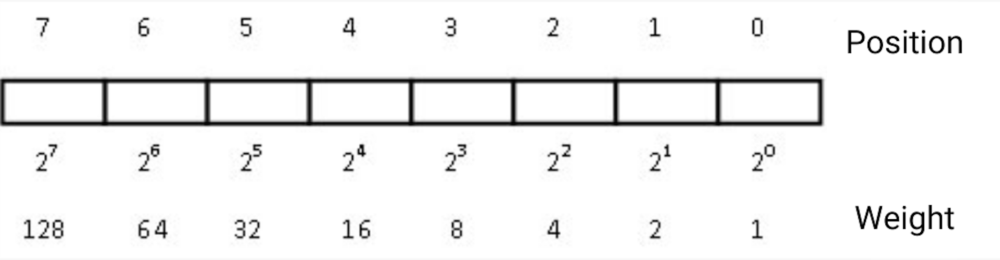
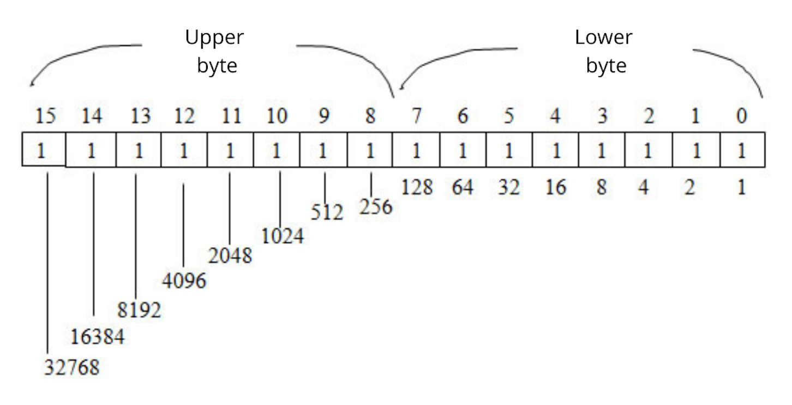
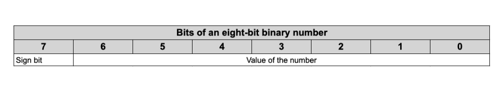
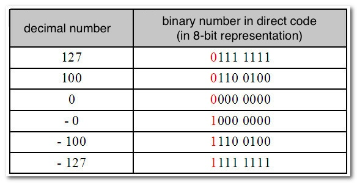
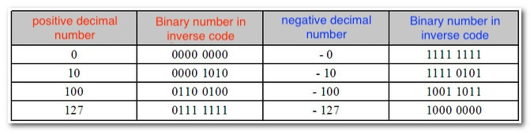
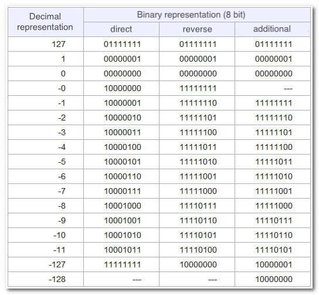
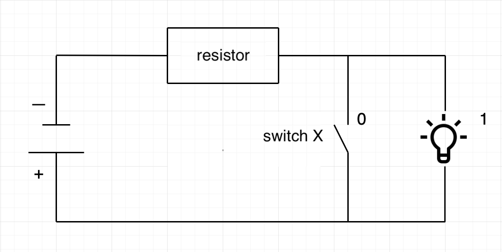
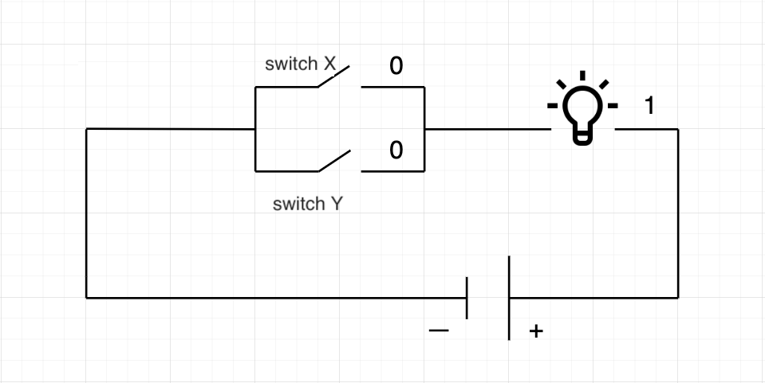
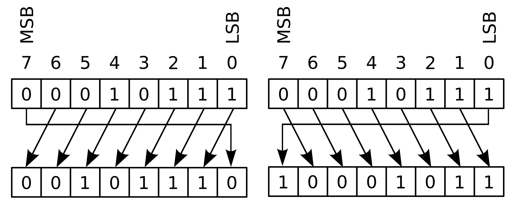

# Bitwise Operations

**Author:** [Roman Yarlykov](https://github.com/rlkvrv) 🧐

Before delving into bitwise operations, it's essential to understand what a bit and a byte actually are. So yes, this harks back to those school computer science lessons during which I played Counter-Strike with classmates and the teacher. And I have a feeling I wasn't the only one.

## A Bit of Computer Science

[A Bit](https://en.wikipedia.org/wiki/Bit) is the smallest unit of information, a symbol or signal that can take only 2 values: on or off, yes or no, high or low, charged or uncharged. One can say that any light bulb can become a bit - it's either on or off. In the binary numeral system, a bit represents 0 or 1.

If a bit is akin to a brick, then a wall made of bricks is a byte.

[A Byte](https://en.wikipedia.org/wiki/Byte) is a collection of bits that a computer can process simultaneously. Historically, in 99.9% of cases, one byte has been equivalent to 8 bits, because it was found to be convenient and efficient. The leftmost bit in a byte is the most significant (MSB - Most Significant Bit). The rightmost is the least significant (LSB - Least Significant Bit). Bits in a byte are numbered from right to left. Bit 0 is the far right and the smallest. Bit 7 is the far left and the largest.

_Important!_ The right-to-left numbering pertains to the **direct** order of bits. There's also an **inverse** order with numbering from left to right, though it's encountered much less frequently. Hence, all subsequent examples will be in direct order.

Within a bit, we can only store a 0 or 1; we can't represent a negative sign. However, we need a way to deal with negative numbers, and so, at the bit level, we have **signed** and **unsigned** numbers. Let's take a closer look.

### Unsigned Numbers (Positive)

In a single byte (when we're talking about an unsigned number), the values range from 0 to 255 or, in binary, from 00000000 to 11111111.

This means that a byte consists of 8 bits. Each bit has its sequential place (position) in the byte. Depending on the position where the bit is located, its weight changes.
Weight is the number obtained by raising 2 to the power of the position at which the bit resides.
Zeroth position - weight = 2<sup>0</sup> = 1, first position - weight = 2<sup>1</sup> = 2, second position - weight = 2<sup>2</sup> = 4, and so on.


To remember this, you can practice. For instance, initially, consider only the first 4 positions of a byte and convert numbers from 0 to 15 into binary code. To get the number 5, you'd need to add 2<sup>2</sup> + 2<sup>0</sup> because the number at the second position is 4, and at the zeroth position, it's 1, resulting in 0101.

For instance, 10 in binary is 1010, 13 = 1101, 14 = 1110, and so on.

Thus, having 4 positions allows us to work with numbers from 0 to 15 because 2<sup>3</sup> + 2<sup>2</sup> + 2<sup>1</sup> + 2<sup>0</sup> = 15.

Next, you can practice converting from binary to decimal using [this online calculator](https://www.duplichecker.com/decimal-to-binary.php). For instance, here's how the number 93 is translated from binary to decimal:

01011101<sub>2</sub> = 0 + 2<sup>6</sup> + 0 + 2<sup>4</sup> + 2<sup>3</sup> + 2<sup>2</sup> + 0 + 2<sup>0</sup> = 0 + 64 + 0 + 16 + 8 + 4 + 0 + 1 = 93<sub>10</sub>

You can again try it out on [the calculator](https://www.duplichecker.com/decimal-to-binary.php), for example, here's how the binary number 35 is calculated:

| Division | Quotient | Remainder |
| -------- | -------- | --------- |
| 35 / 2   | 17       | 1         |
| 17 / 2   | 8        | 1         |
| 8 / 2    | 4        | 0         |
| 4 / 2    | 2        | 0         |
| 2 / 2    | 1        | 0         |
| 1 / 2    | 0        | 1         |

35<sub>10</sub> = 100011<sub>2</sub>

And guess what? The standard calculator application of your operating system probably has a programming mode where you can perform all these operations and more.

In such a simple manner, bits allow us to encode numbers in the binary numeral system.

This is how 2 bytes or 16 bits will look if they are broken down into decimal numbers. 2 bytes form a machine word, but more on that in the upcoming segments.



With this knowledge, you can move forward.

### Signed Numbers (Positive and Negative)

Numbers can be not only positive but also negative. This compels us to view number storage differently. Let's say the number 5 in binary form looks like 00000101, but the number -5 has the exact same sequence of zeros and ones, only with a minus sign. We don't have a special notation that would allow us to store this sign in memory. Therefore, we need a specific format of notation through which the computer can distinguish numbers and understand which number is positive and which is negative. For this, there's the [direct, inverse, and two's complement notation](https://enbima.ru/en/adding-binary-numbers-direct-additional-and-inverse-codes.html). These are three different representations for storing negative numbers in binary code.




#### Direct Code

The direct code simply uses the most significant bit to denote the sign of the number. However, this introduces issues with handling negative zero and requires additional processing of the sign bit.



#### Inverse Code

The inverse code addresses some of these issues by inverting all bits of the number to create its negative equivalent. But it still faces the problem of negative zero.



#### Two's Complement

Two's complement, which is used in most modern computers, solves all these issues by adding 1 to the inverse code of the number. This eliminates negative zero, makes the numbers ordered, and expands the range of numbers that can be represented.

Subtraction in two's complement is done by adding two numbers, one of which is a negative representation. If the result of adding two large positive numbers or two large negative numbers exceeds the range of representable numbers, an overflow occurs. In this case, the result will be on the other side of the number range, indicated by the number of overflow steps.



The representation of numbers in two's complement turned out to be the most optimal both from a mathematical point of view and in terms of simplifying the computer architecture.

Now, we can start delving into bitwise operations.


## Bitwise Operations

**Bitwise operations** are a special type of operations in computing that allows direct manipulation of data bits. They operate at the level of individual bits in the binary representation of numbers.

In many programming languages, one often encounters logical operations such as:

-   `&&` - Logical AND
-   `||` - Logical OR
-   `!` - Logical NOT
-   `< > =` - less than, greater than, equals, and their combinations

For example, here are the truth tables for the AND, OR, and NOT operators:

**AND**
| left operand | right operand | result |
| ---- | ----- | ------ |
| 0 | 0 | **0** |
| 0 | 1 | **0** |
| 1 | 0 | **0** |
| 1 | 1 | **1** |

**OR**
| left operand | right operand | result |
|------|-------|--------|
| 0 | 0 | **0** |
| 0 | 1 | **1** |
| 1 | 0 | **1** |
| 1 | 1 | **1** |

**NOT**

| operand | result |
| ------- | ------ |
| 0       | **1**  |
| 1       | **0**  |

However, these operators work with numbers or Boolean values (in essence, with bytes), while bitwise operations work at a lower level. A few more operations are added to them. Thus, the complete list of bitwise operations looks like:

-   `& ` - Bitwise AND
-   `| ` - Bitwise OR
-   `^ ` - Bitwise Exclusive OR (XOR)
-   `~ ` - Bitwise NOT
-   `<<` - Bitwise left shift
-   `>>` - Bitwise right shift

Additionally, there is another truth table for the exclusive OR - XOR:

**XOR**
| left operand | right operand | result |
|------|-------|--------|
| 0 | 0 | **0** |
| 0 | 1 | **1** |
| 1 | 0 | **1** |
| 1 | 1 | **0** |

The tables for AND, OR, NOT operate in the same way as with logical operations, making them easy to remember. The exclusive OR produces a 1 only when the operands are different; when they are the same, the result is 0.


### Logic Gates

Indeed, bitwise operations combined with memory elements form the foundation of all computing hardware at the lowest level. These basic elemental logic operations, also known as logic gates, are directly handled by the processor using voltage and various circuit configurations.
For instance, this is what the NOT operator circuit looks like:

_Diagram of the elementary logic operation NOT at the electronics level_

If we consider the **light bulb** as representing the presence of voltage or a 1 output, and `X` is the **switch**, then when the **switch** is closed, the current doesn't flow to the light bulb, resulting in a 0; otherwise, it's a 1.

The OR looks like this, meaning if at least one **switch** (`x` or `y`) is closed, we'll get an output voltage:

_Diagram of the elementary logic operation OR at the electronics level_

For AND, **both switches** must be closed:

_Diagram of the elementary logic operation AND at the electronics level_

There's also an electrical circuit for XOR, but understanding it requires knowledge of electrical concepts like double-throw switches, inverters, etc. If you're interested, you can read more [here](https://en.wikipedia.org/wiki/XOR_gate).

### Simple Actions with Bitwise Operators

Before diving into the information below, I highly recommend watching [this video](https://www.youtube.com/watch?v=qewavPO6jcA).

Now, let's move on to examples at the binary code level.
Starting with a simple example, if we take the numbers 5 and 6 and apply the bitwise operator `&`, we get 4. To understand why this happens, we need to convert the decimal numbers to binary and perform the bitwise AND operation for each bit using the truth table for AND:

```js
    // x     = 101 = 4 + 0 + 1 = 5
    // y     = 110 = 4 + 2 + 0 = 6
    // x & y = 100 = 4 + 0 + 0 = 4
    function and(uint x, uint y) external pure returns (uint) {
        return x & y;
    }
```

Similar examples for other operators can be viewed [here](https://solidity-by-example.org/bitwise/), and you can also watch [this video](https://www.youtube.com/watch?v=oSALkuoONkw).
This is the basic principle on which all fundamental bitwise operations will function. One detail to keep in mind is whether we are dealing with a signed or an unsigned binary number. For instance, if we apply the `~` NOT operator to the number 8 (00001000), inverting it, depending on whether it's a signed or unsigned type, we'll end up with two different results.


```bash
    x  = 00001000 =   0 +  0 +  0 +  0 + 8 + 0 + 0 + 0 = 8
    ~x = 11110111 = 128 + 64 + 32 + 16 + 0 + 4 + 2 + 1 = 247 (unsigned)
    ~x = 11110111 =   0 +  0 +  0 +  0 + 8 + 0 + 0 + 0 + 1 = -9 (signed)
```

Remember, in two's complement (additional code), we need to add one to obtain the desired negative number.

#### Bit Check

Now, let's dive into some of the magic that can be achieved using bitwise operations. Suppose we store three states within a single byte using the last three bits. We want to determine the value inside a specific bit.


```js
bytes1 state1 = 0x1; // 00000001
bytes1 state2 = 0x2; // 00000010
bytes1 state3 = 0x4; // 00000100
```

To accomplish this, we need to create a mask for the desired bit and then apply the `&` AND operator. For instance, if we want to retrieve the value of the second bit:

```bash
    mask = 00000010

    00110010
  &
    00000010
    00000010 // result
    --------
    00110001
  &
    00000010
    00000000 // result
```

Thus, if there's something in the second bit, we will get a 1, and if not - it will be a 0.

#### Changing the value of one or several bits using OR and AND:

1. Setting a bit to one


```bash
    00110000
  |
    00000010
    00110010
```

Here, we changed the second bit to 1 using the bitwise OR `|` operation, while leaving the other bits unchanged.

2. Setting a bit to zero (use bitwise operation to zero out the second bit)

```bash
    00110010
  &
    11111101
    00110000

```

In this case, we zeroed out the second bit using the AND `&` operation while leaving the other bits untouched.

#### Inverting Specific Bits

The EXCLUSIVE OR `^` XOR operator allows inverting specific bits. To do this, let's, as usual, take the second bit and set it to 1.
If the second bit was 0, it will turn into 1:

```bash
    00110000
  ^
    00110010
    00110010
```

And conversely, if there was a 1, it will become 0:

```bash
   00110010
 ^
   00110010
   00110000
```

There's nothing complicated here, but in order to write the respective functions for working with individual bits, it's essential to understand another topic - **bitwise shifts**.

### Bitwise Shifts

Generally, there are three types of bitwise shifts:

-   Arithmetic shift `<< >>`
-   Logical shift `<<< >>>`
-   Rotational shift `<<<< >>>>`

The specific shifts available depend on the programming language being used. Shifts can be to the left `<<` and to the right `>>`.

#### Arithmetic Shift

For the arithmetic right shift `>>`, all bits are shifted to the right by n positions, and the leftmost (most significant) bit that's freed up is filled with the sign bit: if the number is positive, it's filled with 0, and if it's negative, it's filled with 1.


The notation for shifting the number 8 by one position would look like this: `8 >> 1` (with the number on the left and the number of bits to shift on the right).

```js
    00001000 >> 1 = 00000100 // 8 >> 1 = 4
```

In this case, the result is 4.

For the arithmetic left shift `<<`, all bits are shifted to the left by n positions, and the rightmost (least significant) bit that's freed up is filled with 0.


By shifting the number 8 one position to the left `8 << 1`, we obtain the number 16.

```js
    00001000 << 1 = 00010000 // 8 << 1 = 16
```

Thus, we have a quick method for multiplying or dividing a number by 2<sup>n</sup>:

```bash
    n << 1 == n * 2   |   n >> 1 == n / 2
    n << 2 == n * 4   |   n >> 2 == n / 4
    n << 3 == n * 8   |   n >> 1 == n / 8
```

_Important!_ Division is rounded down, for example `9 >> 1 = 4`.

_Important!_ Right-shifting the number (-1) will always yield (-1). It will look like this:

```js
    11111111 >> 1 = 11111111 // -1 >> 1 = -1
```

_Because as we remember, when shifting a number to the right, the most significant bit is filled with the sign bit, and for a negative number, this is 1._

#### Logical Shift

In the case of a logical shift, the freed bit will always be filled with 0, both when shifted to the right `>>>` and when shifted to the left `<<<`. This type of shift is also called an unsigned shift.

```js
    01000001 <<< 1 = 10000010 //  65 <<< 1 = 130
    10000001 >>> 1 = 01000000 // 129 >>> 1 = 64
```


_Important! Logical shift is applicable only to unsigned numbers._

#### Circular Shift

When a circular shift to the left `<<<<` or to the right `>>>>` is performed, the most significant or least significant bit that goes beyond the bounds of the register moves to the opposite side:

```js
    10000000 <<< 1 = 00000001 //  128 <<<< 1 = 1
    00000001 <<< 1 = 10000000 //    1 >>>> 1 = 128
```



_Important! In Solidity, only the arithmetic shift type is used and only for unsigned numbers (uint)._

### Solidity Code Examples

Now, knowing about shifts, you can [refer to this code](./examples/BitwiseOperations.sol) and test it in Remix. These are the 4 examples of using bitwise operations that we discussed above:

-   Checking a specific bit
-   Setting a specific bit to 1
-   Setting a specific bit to 0
-   Inverting a specific bit

You can also now explore the remaining shift examples [here](https://solidity-by-example.org/bitwise/).

### Use Cases

**1. Working with Flags and Masks**

One of the primary uses of bitwise operations is working with flags and masks. In the bit-finding section, we've already utilized both approaches.
Flags are bits used to represent states or properties of objects or systems. Bitwise operations allow you to set or reset specific bits, which is handy for flag management. With masks (a sequence of bits), you can select or hide specific properties of an object or data.

A refined example of working with flags in solidity can be seen in the [Universal Router](https://github.com/Uniswap/universal-router#universalrouter-command-encoding) contract by Uniswap, where they embed numerous commands into a single byte.

**2. Compact Data Representation**.

Bitwise operations allow for compact data storage and transfer. We can combine multiple boolean flags into a single number and use bitwise operations to read or write each flag individually. This conserves memory and simplifies data handling.

For example, in Solidity, the `bool` type is stored in `uint8`. If we use `uint8` and store each flag in separate bits, it can accommodate 256 boolean values!

**3. Performance Optimization**.

Bit operations execute much faster than standard arithmetic operations or conditional statements. Using bitwise operations is particularly beneficial in blockchain smart contracts, where gas is paid for each operation and code optimization is critically important to reduce execution costs.

**4. Encryption and Hashing**.

Bitwise operations play a crucial role in data encryption and hash generation. Many encryption and hashing algorithms utilize bitwise operations for data processing at the bit level. This ensures data security and the uniqueness of hashes.

**5. Hardware Interaction**.

Bitwise operations are widely used in embedded systems programming and hardware interaction. They allow for control over device registers, send and receive bit data, and perform other tasks related to low-level programming.

## Conclusion

Bitwise operations are a powerful tool that offers developers ways to work more efficiently with data, optimize code, and enhance security. They find extensive application in various programming domains, including blockchain. Understanding bitwise operations will enable one to harness their benefits in projects, resulting in more efficient and effective code.
