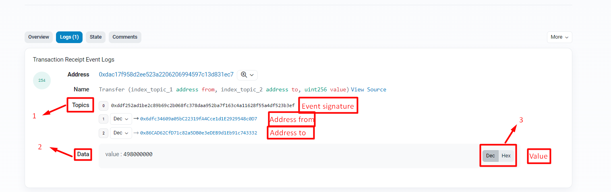

# Event argument indexing

Before diving into argument indexing in events, let's define what Events are in Solidity. Prior to reading this article, we recommend familiarizing yourself with the functioning of the Ethereum Virtual Machine (EVM) by Luit Hollander in his article ["The Ethereum Virtual Machine — How does it work?"](https://medium.com/mycrypto/the-ethereum-virtual-machine-how-does-it-work-9abac2b7c9e).

## Events
```solidity
event Transfer(address from, address to, uint256 amount);
```

Events in Solidity serve as a form of abstraction over the logging system in the EVM. Applications can subscribe to and listen to events through the RPC interface of the Ethereum client. Invoking an event stores the event's parameters in a special transaction log.

The events in this log are associated with the contract address, included in the blockchain, and remain there as long as the block is available (currently indefinitely, but this may change with [Serenity](https://medium.com/pnetwork/eth-2-0-what-is-it-6104a86ff634), where sharding, proof-of-stake, and moving EVM to eWASM will be implemented).

**Why do we need Events?**
1. Testing: In tests, events can be obtained from smart contracts' transaction data and verified.
2. State recovery: All events are stored in the EVM log and can be read.
3. Event listening: It is necessary to promptly respond to changes in the external interface.
4. Creating subgraphs for conversion and faster data reading.

There may be other areas of application for events.

## Argument indexing

We have defined that events in Solidity utilize the EVM's logging mechanism. The EVM provides 5 opcodes for logging:
>*LOG0, LOG1, LOG2, LOG3, LOG4*

These opcodes are used to create a log entry. Such an entry consists of two parts:
- **Topic**
- **Data**

**Topic** is a 32-byte word used to describe what is happening in the event. For example, a transfer from one address to another.

**Data** is the encoded data. For example, the amount of tokens transferred.

Different opcode codes **(LOG0 ... LOG4)** are used to specify the number of topics to include in the log entry. For instance, **LOG1** includes one topic, while **LOG4** includes four topics. Thus, the maximum number of topics that can be included in a single log entry is four.

The first **topic** always represents the *signature* of the event with its types. In other words, it is represented as the hash ```keccak(Transfer(address,address,uint256))```. Therefore, for custom events, you can add three parameters to the topics.

_Important!_ In Solidity, there are anonymous events. The keyword ```anonymous``` is used for this purpose. More details can be found [here](https://docs.soliditylang.org/en/latest/abi-spec.html#events). For such events, the default signature topic is not used. This means that you can add four custom topics.

In Solidity, to specify which parameter to include in the **topic**, the keyword ```indexed``` is used before the parameter name. For example,

```solidity
Transfer(address indexed from, address indexed to, uint256 value)
```

In other words, event parameters can be of two types:
1. Indexed
2. Non-indexed

Parameters with the ```indexed``` attribute will be recorded in the **topic** of the EVM log entry. All other parameters will automatically be considered ```non-indexed```. This means that the parameter will be added to the special data structure (**data**) of the EVM log entry.

**Topic** and **data**, or **indexed** and **non-indexed**, work best together. Each has its own advantages and disadvantages. For example, **topics** are searchable, while **data** is not. However, including **data** is much cheaper than including **topics**. Additionally, **topics** are limited to four 32-byte **topics**, while **data** is not limited. This means that **data** can include larger or more complex data, arrays, or structures.

For more details on how event logging works in the Ethereum blockchain, you can read [here](https://medium.com/mycrypto/understanding-event-logs-on-the-ethereum-blockchain-f4ae7ba50378).

## Why are indexed parameters useful?

Each ```indexed``` parameter creates a **topic**. This parameter is excluded from the data and is not encoded. Using this parameter, efficient searching can be achieved.

By using JSON-RPC requests to full nodes such as Geth or Parity, or services like Infura, event data can be queried from the blockchain. This is done based on a [Bloom filter](https://habr.com/ru/company/otus/blog/541378/), which is designed for fast membership tests.

It is important for Solidity developers to understand how ```indexed``` parameters are used for filtering beyond the contracts. Therefore, we suggest referring to the [ethers.js documentation](https://docs.ethers.io/v5/concepts/events/#events--filters), which allows you to retrieve data from filtered events.

## How it appears on Etherscan



Under the number **1**, we see the **Topics** section, where the ```indexed``` parameters are stored. The zeroth topic is the signature hash of the event ```Transfer(address,address,uint256)```.

Under the number **2**, we see the **Data** section, where the ```non-indexed``` parameter ```uint256 value``` is stored.

Under the number **3**, we see the toggle to switch the display type of the **Data** section. Remember that **Data** is stored in an encrypted format.

## Examples

For a simple explanation of how to use Solidity Events, you can refer to the article by [ChainLink](https://blog.chain.link/events-and-logging-in-solidity/).

In the same article, there is an example that demonstrates how ```indexed``` and ```non-indexed``` parameters work. The example can be found in this [repository](https://github.com/PatrickAlphaC/hardhat-events-logs). The repository includes a script that outputs events to the console.

## Links

1. [Solidity documentation: Events](https://docs.soliditylang.org/en/v0.8.18/contracts.html#events)
2. [Understanding event logs on the Ethereum blockchain](https://medium.com/mycrypto/understanding-event-logs-on-the-ethereum-blockchain-f4ae7ba50378)
3. [The Ethereum Virtual Machine — How does it work?](https://medium.com/mycrypto/the-ethereum-virtual-machine-how-does-it-work-9abac2b7c9e)
4. [Deep dive into Ethereum logs](https://codeburst.io/deep-dive-into-ethereum-logs-a8d2047c7371)
