# Yul

**Author:** [Roman Yarlykov](https://github.com/rlkvrv) 🧐

## Introduction

### Key Concepts

**Yul** is a mid-level assembly language designed specifically for the Ethereum Virtual Machine (EVM). It offers a balance between high-level and low-level programming, providing developers with direct control over EVM operations while maintaining a readable and structured syntax.

However, Ethereum, for example, also compiles a high-level language program, such as C, Go, or Java, into a so-called assembly language before execution.

**Assembly** is any low-level programming language that is translated into machine code (bytecode) using an assembler. Assembly languages are tied to either a physical or virtual machine as they implement its set of commands.

**EVM bytecode** is a compact representation of low-level instructions that are later interpreted by the Ethereum Virtual Machine (EVM).

_Note!_ Before diving into Yul, it is recommended to understand how [bitwise operations](https://github.com/fullstack-development/blockchain-wiki-en/blob/main/solidity/bitwise-operators/bitwise-operators.md) work, how the [EVM stack machine](https://github.com/fullstack-development/blockchain-wiki-en/blob/main/ethereum-virtual-machine/readme.md) is structured, how [opcodes](https://github.com/fullstack-development/blockchain-wiki-en/blob/main/ethereum-virtual-machine/evm-opcodes/README.md) function, and how [ABI encoding](https://github.com/fullstack-development/blockchain-wiki-en/blob/main/solidity/ABI/readme.md) is done. Understanding the workings of different types of memory in the EVM (storage, memory, calldata) and their specific considerations in use will also greatly aid in learning.

### Why Yul is Needed

The primary purpose of Yul is to optimize smart contracts for gas efficiency, both at the language level and compiler level, while also providing greater control over code execution.

Yul can be used in [inline assembly](https://docs.soliditylang.org/en/latest/assembly.html) mode within Solidity code, or you can [write smart contracts in pure Yul](#smart-contracts-in-yul) without using Solidity at all.

The compiler uses Yul as an intermediate language in the code generator based on [IR](https://docs.soliditylang.org/en/latest/ir-breaking-changes.html) (Intermediate Representation).

The design of Yul aims to achieve the following goals:

1. Programs written in Yul should be readable, even if the code is generated by the compiler from Solidity or another high-level language.
2. Control flow should be straightforward to understand to facilitate manual inspection, formal verification, and optimization.
3. Translation from Yul to bytecode should be as straightforward as possible.
4. Yul should be suitable for optimizing entire applications.

To achieve the first and second goals, Yul provides high-level constructs such as `for` loops, `if` and `switch` statements, instructions, and function calls. These are sufficient to represent control flow in assembly-like programs. However, there are no explicit instructions for stack management, such as `SWAP`, `DUP`, `JUMPDEST`, `JUMP`, and `JUMPI`, as the first two obscure data flow, and the last three obscure control flow.

_Note!_ In Yul, there is still the option to access the stack using the [verbatim](https://docs.soliditylang.org/en/latest/yul.html#verbatim) function.

### Getting Started

If you have already learned or reviewed the topics mentioned [above](#key-concepts), you can start by watching a [series of short videos](https://youtube.com/playlist?list=PL5hld-skrdFrxGUmmEbG1LBvYVyTE9M62&si=jwXH_rtSvoNfrDPg). Additionally, you can go through [this](https://medium.com/lumos-labs/inline-assembly-in-solidity-34d3ba2cfa7a) article. In the official documentation, you can refer to the [instructions](https://docs.soliditylang.org/en/latest/yul.html#evm-dialect) used in Yul.

To gain a better understanding of what's happening in the code, tools like the [Remix Debugger](https://medium.com/@kulman.david/how-to-use-remix-debugger-to-learn-solidity-assembly-5a745a22bb07) can be extremely helpful for low-level debugging of Solidity and Yul code. You can also use the debugger from Foundry or the [EVM Codes Playground](https://www.evm.codes/playground) (in the text, I will use the word "debugger" instead of "отладчик").

You can explore a series of short articles by Naveen: [Part 0](https://mirror.xyz/0xB38709B8198d147cc9Ff9C133838a044d78B064B/nk40v2MJKSHXXNSlbqqhpwJf4MtZ9V2Vp8P_bSNwjYc), [Part 1](https://mirror.xyz/0xB38709B8198d147cc9Ff9C133838a044d78B064B/PpA5KdQhrE_2Bf-USfKePROJ5tE-raL7_VGBR8HE39E), [Part 2](https://mirror.xyz/0xB38709B8198d147cc9Ff9C133838a044d78B064B/Hh69VJWM5eiFYFINxYWrIYWcRRtPm8tw3VFjpdpx6T8).

Afterward, you can dive into the [documentation](https://docs.soliditylang.org/en/latest/yul.html) and try writing your own code, as well as dissecting the provided examples.

## Language Features

Yul code can be written by developers or compiled from higher-level languages like Solidity or Vyper. However, unlike Solidity, in Yul, most tasks are performed manually: memory management, event emission, abi.encode, hashing, overflow checks, and more.

The only thing the assembler does for you is reordering operation codes in a functional style, calculating stack heights for variable access, and cleaning up stack slots for assembly-level local variables when their block ends.

Considering all this, errors can occur when using any Yul instruction: incorrectly passing arguments, misdefining memory offsets or data sizes. It's essential to have a clear understanding of what needs to be done and why. The most optimal approach is considered to be a combination of Solidity and inline assembly for optimizing specific code segments and for writing gas-efficient libraries, such as the string manipulation library [strings](https://github.com/Arachnid/solidity-stringutils) or the [bytes](https://github.com/GNSPS/solidity-bytes-utils/blob/master/contracts/BytesLib.sol) library.

### Scope

In the context of inline assembly, such blocks cannot "communicate" with each other. This means that variables and functions defined in one `assembly { ... }` block cannot be accessed from another `assembly { ... }` block. However, access to Solidity variables will be available to all blocks since they are initialized in memory.

Additionally, inside an assembly block, you can create inner scopes using `{ ... }`:


```js
    assembly {
        let x := 3          // x will be accessible in all scopes

        // Область видимости 1
        {
            let y := x     // this time it wokrks fine
        }

        // Область видимости  2
        {
            let z := y     // and now will get an error
        }
    }
```

But this doesn't apply to `for` loops and `function`.

In standalone assembly (code in pure Yul), there are different types of relationships between objects, detailed [here](https://docs.soliditylang.org/en/latest/yul.html#specification-of-yul-object).

### Syntax

Yul syntax differs from Solidity. One noticeable difference is that you don't need to use semicolons `;` after statements. Instead of familiar operators (e.g., mathematical operators like `+`, `-`, etc.), you need to use corresponding [instructions](https://docs.soliditylang.org/en/latest/yul.html#evm-dialect). The assignment operator will look like this `:=`. To declare a variable, you should use the keyword `let`. If you declare a variable without assigning it a value, the variable will be initialized to zero.

In the internal workings of the EVM, `let` does the following:

- Creates a new stack slot.
- Reserves a new slot for the variable.
- Then, the slot is automatically cleared again when the end of the block is reached.

Here's how assigning the result of mathematical operations looks in Solidity and in Yul:

```js
    // solidity
    uint256 a = (3 + 3) / 2;

    // Yul
    assembly {
        let b := div(add(3, 3), 2)
    }
```

In the example above, the `add` operation will be executed first, followed by `div`, and then the assignment. The innermost instruction always executes first.

The syntax for functions also differs. In functions, you don't need to specify visibility; they will never be part of the external interface of the contract and are part of a namespace separate from the Solidity functions namespace. Return values are specified after the `->` symbol separated by commas. This means you can return multiple values from a function. Inside functions, within an inline assembly block, it is not possible to access variables declared outside of that function.


```js
    function foo() external {
        assembly {
            function bar(param1, param2, ...) -> return1, return2, ... {
                // code
            }

            let x, y := bar(1, 2)
        }
    }
```

The `leave` keyword can be placed anywhere within the body of an assembly function to halt its execution and exit the function. It functions similarly to an empty `return` statement, with one exception: the function will return any value that was last assigned to the return variable.

```js
    assembly {
        function increment() -> result {
            let param := calldataload(4)
            result := add(param, 1)
            // leave returns "result", but won't finish the code execution
            // how it would happen with 'return'
            // Execution of assembly or Solidity code will continue.
            leave
        }
    }

```

// Important! The 'leave' keyword can only be used inside a Yul function.

Yul interprets comments just like Solidity, so you can use `//` and `/* */` to denote comments.

### Types

At the time of writing this article, Yul uses only one type - `u256`, which corresponds to `uint256`. However, it may be easier to think of it as `bytes32` because the stack machine operates with 32-byte words. The documentation also uses the term "256-bit word," but they all refer to the same thing.

In [this video](https://www.youtube.com/watch?v=ZGDQMS9GWo8&list=PL5hld-skrdFrxGUmmEbG1LBvYVyTE9M62&index=3), you can see how different types behave in Yul. All values are converted to `bytes32`, so working with dynamic data types (including strings) is not straightforward in Yul.

// Important! Be cautious when working with Boolean values. In Yul, a Boolean value is determined by checking if the value is a zero byte using the 'ISZERO' opcode. Therefore, any value other than 0 is considered 'true.'

```js
    function getBool() external pure returns (bool res) {
        uint256 a = 42; // 42 (decimal) == 0x2a (hex)

        assembly {
            res := a // 0x000000000000000000000000000000000000000000000000000000000000002a
        }
        // res == true
    }
```

### Literals

You can use the following literals:

- Integer constants in decimal or hexadecimal notation (`42`, `0x2a`).
- ASCII strings (e.g., "abc") that can contain hexadecimal escape characters `\xNN` and Unicode escape characters `\uNNNN`, where N represents hexadecimal digits.
- Hexadecimal strings (e.g., `hex"616263"`).

```js
    assembly {
        let a := 0x123             // Hexadecimal
        let b := 42                // Decimal
        let c := "hello world"     // String
        let d := "very long string more than 32 bytes" // Error
    }
```
Remember that the stack operates with 32-byte words, so you cannot store a string longer than 32 bytes in a variable declared with 'let'.

### Control Flow

Control flow in Yul is structured using 'if' and 'switch' statements, as well as the 'for' loop. Their syntax differs from Solidity, but the mechanics remain the same.

Notable differences include the absence of a 'while' loop in Yul, and the 'if' statement does not have an 'else' condition (multiple conditions are handled with 'switch'). Additionally, you cannot write a one-liner 'if' statement without curly braces.

Example with an 'if' statement:


```js
    function ifStatement(uint256 n) external {
        assembly {
            if iszero(n) {
                // if true, execute the action
            }
        }
    }
```

Example with `switch` operator:

```js
    function switchStatement(uint256 n) external {
        assembly {
            switch n
            case 0 {
                // if n == 0 execute the action
            }
            case 1 {
                // if n == 1 execute the action
            }
            default {
                //if any option hasn't worked
                // execute default action
            }
        }
    }
```

Example of `for` cycle:

```js
    function forLoop(uint256 n) external {
        assembly {
            for { let i := 0 } lt(i, n) { i := add(i, 1) } {
                // execute the action
            }
        }
    }

    function forLoopWithAnotherCondition(uint256 n) external {
        assembly {
            let i := 0
            for {} lt(i, n) {} {
                // execute the action
                i := add(i, 1)
            }
        }
    }
```

## Instructions

Here are some of the internal functions of the Yul language. You can find the current list in the [documentation](https://docs.soliditylang.org/en/latest/yul.html#evm-dialect). In function descriptions (in the documentation), you may often encounter expressions like `mem[a...b]`, which denotes bytes in memory starting from position `a` up to position `b`, but not including `b`, and `storage[p]` denotes the content of storage at slot `p`.

### Comparison Operations

| Function     | Description                             |
| ------------ | --------------------------------------- |
| `eq(x, y)`  | Checks for equality between `x` and `y` (`x == y`). |
| `iszero(x)` | Returns 1 if `x == 0`, otherwise 0.     |
| `lt(x, y)`  | Returns 1 if `x < y`, otherwise 0.      |
| `gt(x, y)`  | Returns 1 if `x > y`, otherwise 0.      |

### Bitwise Operations

| Function      | Description                                                     |
| ------------- | ---------------------------------------------------------------- |
| `and(x, y)`  | Bitwise "AND" between `x` and `y`.                              |
| `or(x, y)`   | Bitwise "OR" between `x` and `y`.                               |
| `xor(x, y)`  | Bitwise "XOR" between `x` and `y`.                              |
| `not(x)`     | Bitwise "NOT" for `x`.                                          |
| `byte(n, x)` | Returns the `n`-th byte from the number `x`, where the most significant byte is 0-th. |
| `shl(x, y)`  | Logical left shift `y` bits to the left of `x`.                 |
| `shr(x, y)`  | Logical right shift `y` bits to the right of `x`.               |

### Other Useful Functions

| Function         | Description                                                                                                                                                                                                                                                                                                                                                      |
| ---------------- | ---------------------------------------------------------------------------------------------------------------------------------------------------------------------------------------------------------------------------------------------------------------------------------------------------------------------------------------------------------------- |
| `pop(x)`        | Removes the value `x` (useful for removing function return values) from the stack.                                                                                                                                                                                                                                                                                                                                          |
| `gas()`         | Returns the remaining gas.                                                                                                                                                                                                                                                                                                                                                                                                    |
| `address()`     | Returns the address of the current contract.                                                                                                                                                                                                                                                                                                                                                                                 |
| `caller()`      | Returns the address of the caller (equivalent to msg.sender).                                                                                                                                                                                                                                                                                                                                                                  |
| `origin()`      | Returns the address of the original transaction sender (equivalent to tx.origin).                                                                                                                                                                                                                                                                                                                                             |
| `callvalue()`   | Returns the amount of wei sent with the current call.                                                                                                                                                                                                                                                                                                                                                                          |
| `selfbalance()` | Returns the balance of the current contract.                                                                                                                                                                                                                                                                                                                                                                                   |
| `balance(a)`    | Returns the balance of address `a`.                                                                                                                                                                                                                                                                                                                                                                                             |
| `gasprice()`    | Returns the gas price of the current transaction.                                                                                                                                                                                                                                                                                                                                                                              |
| `timestamp()`   | Returns the timestamp of the current block.                                                                                                                                                                                                                                                                                                                                                                                    |
| `number()`      | Returns the number of the current block.                                                                                                                                                                                                                                                                                                                                                                                       |
| `return(p, s)`  | Terminates program execution and returns data stored in memory starting at position `p` and occupying `s` bytes. This data will be returned as a result of executing the contract or function.                                                                                                                                                                                                                                                                                      |
| `revert(p, s)`  | Terminates program execution, reverts state changes in the smart contract, and returns data stored in memory starting at position `p` and occupying `s` bytes. This data will be returned as a result of executing the contract or function, with the contract's state at the time of the 'revert' call restored. |
| `mod(x, y)`     | Returns the remainder of the division of `x` by `y` (x % y). If `y` is equal to 0, it returns 0.                                                                                                                                                                                                                                                                                                                                  |
## Working with Memory

To work with Yul, it's crucial to understand how memory in the EVM (Ethereum Virtual Machine) is organized because nearly every action involves reading from or writing to memory. In the EVM, there are three types of memory: `memory`, `calldata`, and `storage`, and each has its own peculiarities.

**Note**: Technically, the EVM stack is also a form of memory, but its interaction capabilities are severely limited. Therefore, we won't delve into stack memory here.

### Storage

Storage represents a permanent data store that persists between function calls and across blocks, making it suitable for storing important and permanent information.

A smart contract's storage is essentially one immensely large array filled with zeros, effectively initialized. Each cell is a 32-byte slot. All that remains for us is to write and retrieve data correctly.

In storage, there are two types of variables: fixed-size and dynamic-size. Because of this, there are nuances you need to be aware of when working with Yul:

- Writing to storage is an expensive operation, so for data types smaller than 32 bytes, packing is applied whenever possible. It's essential to understand how this works.
- Storing dynamic data types differs from storing fixed-size data, and understanding these differences is crucial.

You can read more about these topics [here](https://noxx.substack.com/p/evm-deep-dives-the-path-to-shadowy-3ea?s=r) and [here](https://medium.com/@hayeah/diving-into-the-ethereum-vm-part-2-storage-layout-bc5349cb11b7).
Refer to the documentation [here](https://docs.soliditylang.org/en/latest/internals/layout_in_storage.html) for further details.

To work with storage, the following instructions are used:

| Function        | Description                                                              |
| --------------- | ------------------------------------------------------------------------ |
| `sload(p)`      | Loads a value from storage at key `p` and returns its value.             |
| `sstore(p, v)`  | Writes the value `v` to storage at key `p`.                             |

To access the storage slot of a variable, you can use the `.slot` keyword.


```js
contract Storage {
    uint256 x;

    function setStorageValue(uint256 _x) public {
        assembly {
            sstore(x.slot, _x)
        }
    }

    function getStorageValue() public view returns (uint256 ret) {
        assembly {
            ret := sload(x.slot)
        }
    }

}
```

Для работы с упакованными данными используется ключевое слово `.offset`.

Offset или смещение — это количество байт от начала слота, с которого начинается переменная.

Например тут все пять переменных будут храниться в слоте 0 с разным смещением. Упаковка будет производится справа-налево (в данном примере `a` будет занимать правые 16 байт, затем `b` займет еще 12, `c` - 2 байта, `d` и `e` по одному). Перед тем как записать в одну из этих переменных данные нужно сначала обнулить соответствующий диапазон байт. В таком случае для операций записи и чтения используются побитовые операции.

```js
contract Storage {
    uint256 x; // slot 0 - 32 bytes

    uint128 a; // slot 1 - 16 bytes
    uint96 b; // slot 1 - 12 bytes
    uint16 c; // slot 1 - 2 bytes
    uint8 d; // slot 1 - 1 bytes
    uint8 e; // slot 1 - 1 bytes

    function setCToPackedSlot(uint16 _c) public {
        assembly {
            // Load data from a slot
            let data := sload(c.slot)

            // Zero out the bytes where the variable is stored.
            // Since this is a uint16, it occupies 2 bytes (in the same order as declared in storage).
            let cleared := and(data, 0xffff0000ffffffffffffffffffffffffffffffffffffffffffffffffffffffff)

            // Shift the new value to the left by the variable's offset multiplied by 8 (1 byte = 8 bits).
            // the reason is that the offset returns a value in bytes, but we're performing the shift in bits.
            let shifted := shl(mul(c.offset, 8), _c)

            // combine the cleared slot with the shifted value.
            let newValue := or(shifted, cleared)

            // save the new value in the slot
            sstore(c.slot, newValue)
        }
    }

    function getCFromPackedSlot() public view returns (uint16 ret) {
        assembly {
            // Load data from a slot
            let data := sload(c.slot)

            // shift right using the offset of the desired variable.
            let shifted := shr(mul(c.offset, 8), data)

            // apply a mask to obtain the value of the variable.
            ret := and(shifted, 0xffff)
        }
    }
}
```

#### Structures in Storage

Structures in storage are merely a semantic wrapper, and all the contents are stored in slots just as if they were not within a structure, including the variables that have been packed.

Example:

```js
    // You can record all variables individually.

    // uint256 x; // slot 0 - 32 bytes

    // uint128 a; // slot 1 - 16 bytes
    // uint96 b; // slot 1 - 12 bytes
    // uint16 c; // slot 1 - 2 bytes
    // uint8 d; // slot 1 - 1 bytes
    // uint8 e; // slot 1 - 1 bytes

    // You can combine them into a single structure, and nothing will change for the variables.
    struct MyStruct {
        uint256 x; // slot 0 - 32 bytes
        uint128 a; // slot 1 - 16 bytes
        uint96 b; // slot 1 - 12 bytes
        uint16 c; // slot 1 - 2 bytes
        uint8 d; // slot 1 - 1 bytes
        uint8 e; // slot 1 - 1 bytes
    }

    MyStruct myStruct; // slot 0 - 62 bytes
    uint256 value; // slot 2 - 32 bytes
```

- In the first case, the variables occupy slots 0 and 1 (because variable packing occurs in slot 1).
- When wrapping the same variables in the `MyStruct` structure, absolutely nothing changes; they still occupy slots 0 and 1.

Here's how it will appear when you use `forge inspect`:
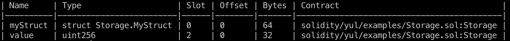

In Foundry, there is a possibility to view where the contract data is located in which slots. To do this, you need to execute the following command in the terminal:

```bash
    forge inspect <contract-name> storage-layout --pretty
```

The command will produce a table similar to the one I provided above.

#### Fixed-Length Arrays

To retrieve a value at a specific index of a fixed-length array, you need to use the `sload` instruction. The required slot can be calculated using the formula `array storage slot + array index`. When the array has a fixed length, and its values are of type `bytes32`, all values are simply stored sequentially as follows:

-   slot 0: array slot 0 + index in array 0 = value stored in slot 0;
-   slot 1: 0 + 1 = 1;
-   slot 2: 0 + 2 = 2;
-   ...

```js
contract Storage {
    // ...

    uint256[5] arr = [11, 22, 33, 44, 55]; // slot 2 - 6
    uint256 amount; // slot 7

    function getValueFromArray(uint256 index) public view returns (uint256 value) {
        assembly {
            value := sload(add(arr.slot, index))
        }
    }
}
```

For the example above, the table will look like this. Here, it is evident that the array occupies 5 slots (from the 2nd to the 6th inclusive) and 160 bytes of memory (32 * 5).
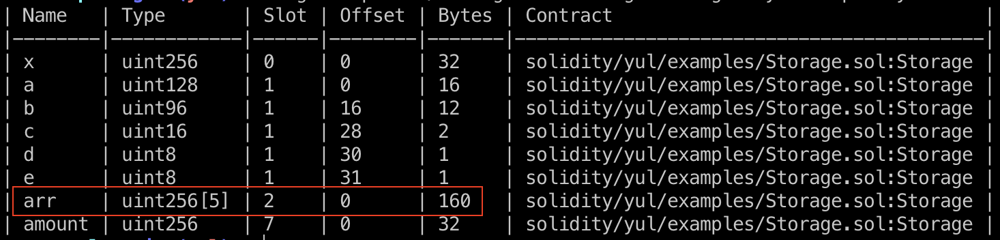

For arrays with value sizes less than 32 bytes, the compiler packs the values into a single slot whenever possible. In the example below, pay attention to `packedArr`; it occupies 1 slot (32 bytes) despite containing 2 elements.


```js
contract Storage {
    // ...

    uint256[5] arr = [11, 22, 33, 44, 55]; // slot 2 - 6
    uint256 amount; // slot 7
    uint128[2] packedArr = [21, 42]; // slot 8
    uint256 amount2; // slot 9

    function getPackedValueFromArray() public view returns (uint128 value) {
        bytes32 packed;

        assembly {
            // Loading packed data.
            packed := sload(packedArr.slot)

            // Shifting right by 16 bytes (128 bits).
            // To obtain the value of the array at index 1.
            value := shr(mul(16, 8), packed)
        }
    }
}
```

This is also evident in the table.
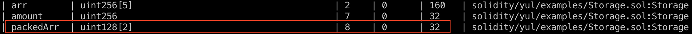

#### Dynamic Arrays

Due to their unpredictable size, dynamic array types cannot be stored "in between" state variables that precede and follow them. Instead, they are considered to occupy only 32 bytes, with their contained elements stored starting from another storage slot, calculated using the Keccak-256 hash.

For dynamic arrays, this slot stores the number of elements in the array (except for byte arrays and strings).

The data of the dynamic array starts at `keccak256(p)` and is organized the same way as the data of a static-sized array: one element after another. Dynamic arrays of dynamic arrays apply this rule recursively. For more details, refer to the [documentation](https://docs.soliditylang.org/en/latest/internals/layout_in_storage.html#mappings-and-dynamic-arrays).

Reading from a dynamic array would look like this:

-   Get the slot where the length of the array is stored.
-   Write the slot number to memory.
-   Hash the slot number (specify the memory location and data size for hashing).
-   Add the index of the element to the hash to obtain the necessary storage slot value.

```js
contract Storage {
    // ...

    uint256[] dynamicArr = [123, 345, 678];

    function getValueFromDynamicArray(uint256 index) external view returns (uint256 value) {
        uint256 slot;

        assembly {
            // Obtaining the slot where the array's length is stored.
            slot := dynamicArr.slot

            // Calculating the hash that points to the slot where the array values are stored.
            // Equivalent to the Solidity code:
            // bytes32 ptr = keccak256(abi.encode(slot));
            mstore(0x00, slot)
            let ptr := keccak256(0x00, 0x20)

            // Loading the required array element at the specified index.
            value := sload(add(ptr, index))
        }
    }
}
```

To obtain the size of a dynamic array, you need to call `sload` for the slot where it is stored:

```js
    uint256[] dynamicArr = [123, 345, 678]; // slot 10

    function getDynamicArrayLength() external view returns (uint256 length) {
        assembly {
            length := sload(dynamicArr.slot)
        }
    }
```
#### Mappings

Mappings behave similarly to dynamic arrays, but they combine the key and the mapping's storage slot to determine the value's location:

-   Get the storage slot.
-   Write the key to memory.
-   Write the slot to memory.
-   Hash the key and the slot.
-   Retrieve the value using the hash.

```js
contract Storage {
    // ...

    mapping(uint256 => uint256) map;

    function getValueFromMapping(uint256 key) public view returns (uint256 value) {
        bytes32 slot;

        assembly {
            // Obtaining the mapping's storage slot.
            slot := map.slot

            // Calculating the hash that points to the slot where the mapping values are stored.
            // Equivalent to Solidity code:
            // bytes32 ptr = keccak256(abi.encode(key, uint256(slot)));
            mstore(0x00, key)
            mstore(0x20, slot)
            let ptr := keccak256(0x00, 0x40)

            // Loading the required mapping element.
            value := sload(ptr)
        }
    }
}
```

#### Nested Mappings

Nested mappings are similar, but to determine the location of a value, hashes of hashes are used. Concatenation and hashing are performed from right to left.

Here, it's very similar to the previous example, except the resulting hash will consist of the hash of the second key + hash (slot + first key):

```js
contract Storage {
    // ...

    mapping(uint256 => mapping(uint256 => uint256)) nestedMap;

    function getValueFromNestedMapping(uint256 key1, uint256 key2) public view returns (uint256 value) {
        bytes32 slot;
        assembly {
            slot := nestedMap.slot

            // bytes32 ptr2 = keccak256(abi.encode(key2, keccak256(abi.encode(key1, uint256(slot)))));
            mstore(0x00, key1)
            mstore(0x20, slot)
            let ptr1 := keccak256(0x00, 0x40)

            mstore(0x00, key2)
            mstore(0x20, ptr1)
            let ptr2 := keccak256(0x00, 0x40)

            value := sload(ptr2)
        }
    }
}
```

#### Mappings with Arrays

To calculate the slot from which a dynamic array starts in a mapping, you need to obtain a hash of the hash (key + slot). After that, it's the same as with a regular dynamic array.

To get the length of the array, you need to execute `sload` for the hash (key + slot).


```js
contract Storage {
    // ...

    mapping(address => uint256[]) arrayInMap;

    function getValueFromArrayNestedInMapping(address key, uint256 index) public view returns (uint256 value, uint256 length) {
        bytes32 slot;

        assembly {
            slot := arrayInMap.slot
        }

        bytes32 arrSlot = keccak256(abi.encode(key, slot));
        bytes32 ptr = keccak256(abi.encode(arrSlot));

        assembly {
            value := sload(add(ptr, index))
            length := sload(arrSlot)
        }
    }
}
```

#### Bytes and Strings

**Warning!** The following discussion involves the concepts of "bytes" and "bits." If you are still confused about them, it's better to clarify before proceeding.

**Note!** For value conversions, you can use the `cast` utility commands from the Foundry framework:

-   `--to-base <number> <number system>` - for converting numbers from one base to another, e.g., `cast --to-base 0x20 10` will give you the number 32, and vice versa, `--to-base 32 16` will yield 0x20. You can also convert to binary (from binary) and use commands like `--to-hex`, `--to-dec`, etc.
-   `--format-bytes32-string <string>` - for converting a string to hex.
-   `--parse-bytes32-string <hex>` - for converting hex to a string.
    If you're not already using `cast`, I recommend trying it out; it has many useful features. Use `cast -h` to see all available commands.

Now, `bytes` and `string` are stored in storage the same way, but there's one important detail that may not be immediately clear from the [documentation](https://docs.soliditylang.org/en/latest/internals/layout_in_storage.html#bytes-and-string).

In the case of a `bytes` array longer than 31 bytes, its length is stored in the slot (not the actual length, but more on that later). Using the hash of this slot - `keccak256(p)` - you can find the starting location in memory from which the byte array begins. Remember that strings are stored from the most significant bit to the least significant bit.

**Important!** When you take the hash of the slot, you get a reference to the slot where the string begins. However, this slot will only contain 32 bytes (32 characters of the string). If the string is longer, the remaining characters will be stored in subsequent slots, also from most significant bit to least significant bit.

But what if the `bytes` (or `string`) array's length is less than or equal to 31 bytes? Such an array will be encoded "in-place," meaning it will reside in the same slot where the string is declared, with the 0th (least significant) byte indicating the string's size (not the actual size, which is important).

Now, about the string (bytes array) length. There are two formulas:

-   If the string length is less than or equal to 31 bytes: `length * 2`
-   If the string length is more than 31 bytes: `length * 2 + 1`

This is done to distinguish which string we're dealing with based on the least significant bit (LSB). If the LSB is not set (equals 0), it's a short string; if it's set (equals 1), it's a long one.

Let's illustrate this with an example: Suppose we have a string "Hello, world!" in storage, with a length of 13 bytes. When converted to hex, we get `0x48656c6c6f2c20776f726c6421`, where each individual byte represents a UTF-8 character (48 - uppercase "H", 65 - lowercase "e", 2c - ",", 20 - space, and so on). Now, we need to pad this value to 32 bytes, with the last byte indicating the length calculated by the formula `13 * 2 = 26` (`0x1a` in hex). Thus, we get this 32-byte array: `0x48656c6c6f2c20776f726c64210000000000000000000000000000000000001a`. If you convert it to binary, the least significant bit will be 0 - 00000000010010000110010101101100011011000110111100101100001000000111011101101111011100100110110001100100001000010000000000000000000000000000000000000000000000000000000000000000000000000000000000000000000000000000000000000000000000000000000000000000000001101**0**.

Using the formula `length * 2`, the least significant bit will always be 0 (unset). Conversely, using the formula `length * 2 + 1`, it will always be set to 1.

Now, let's see how to get the length using Yul. In the example below, there are three strings of different lengths. This is done to allow you to test how it works in Remix (also recommended to use the debugger). Don't forget to uncomment only one string and comment out the other two.

```js
contract Storage {
    /// ...

    // So, the string will be stored in the slot, with the last byte indicating the encoded length (0x1a).
    // 0x48656c6c6f2c20776f726c64210000000000000000000000000000000000001a // str.slot
    string str = "Hello, world!"; // 13 symbols

    // This is the maximum short string of 31 characters, with the length (0x3e) encoded in the last byte.
    // 0x48656c6c6f2c207468697320697320612074657374207068726173652030323e // str.slot
    string str = "Hello, this is a test phrase 02"; // 31 symbols

    // This is a long string, with only its length (0x4b) encoded in the slot.
    // 0x000000000000000000000000000000000000000000000000000000000000004b // str.slot
    // 0x48656c6c6f2c2074686973206973206120746573742070687261736520666f72 // keccak(str.slot)
    // 0x2077696b69000000000000000000000000000000000000000000000000000000 // keccak(str.slot) + 1
    string str = "Hello, this is a test phrase for wiki"; // 37 symbols

    function getStringInfo() external view returns (uint256 length, bytes32 lsb, bytes32 strBytes, bytes32 slot) {
        assembly {
            // cash the slot
            slot := str.slot
            // Loading the contents of the slot.
            strBytes := sload(slot)
            // Copying the contents to obtain the least significant bit.
            let _arr := strBytes
            // Obtaining the value of the least significant bit.
            lsb := and(_arr, 0x1)

            // Checking if it equals 0.
            if iszero(lsb) {
                // Taking the least significant byte and dividing by 2 to obtain the string length.
                length := div(byte(31, strBytes), 2)
            }

            // Checking if it's greater than 0.
            if gt(lsb, 0) {
                // Subtracting 1 and dividing by 2 to obtain the string length.
                length := div(sub(strBytes, 1), 2)

                // Writing the slot number to memory.
                mstore(0x00, slot)
                // Getting the hash of the slot to determine the actual location of the string.
                slot := keccak256(0x00, 0x20)
            }
        }
    }
}
```

So, what happens in the code:

- Remember the slot number where the string (or string length) is stored.
- Retrieve the contents of the slot using `sload`.
- Create a separate variable `_arr` to copy the contents of the slot.
- Use bitwise AND to obtain the value of the least significant bit (lsb).
- Next, check if lsb equals 0 (`iszero(lsb)`), which means it's a short string.
    - If it's a short string, take the last byte where the length is indicated (`and(_arr, 0x1)`).
    - Then, divide this length by 2 (`div(byte(31, strBytes), 2)`) to get the original string length (with this knowledge, you can load it into memory and return it, but we won't overload the function for now).
- If lsb is greater than 0 (`gt(lsb, 0)`):
    - Subtract 1 from the loaded length value (`sub(strBytes, 1)`).
    - Divide the resulting value by 2 (`div(sub(strBytes, 1), 2)`) to get the string length.
    - Then, load the slot number into memory to obtain its hash.
    - Get the hash based on the slot number (this will be the slot where the string is or starts).

All the examples are compiled in one contract [Storage.sol](./examples/Storage.sol).

### Memory

Memory is used for temporary storage of variables. It is cleared when a function call is completed.

Memory is used in the following cases:

- Returning values for external calls.
- Setting function arguments for external calls.
- Receiving values from external calls.
- Returning error messages.
- Logging messages.
- Creating other contracts.
- Using the keccak256 function.

Remember that memory is divided into 32-byte slots. Therefore, you will often see numbers that are multiples of 0x20 (0x40, 0x60, 0x80, 0xa0, ...). The first four slots are always reserved for specific purposes, from 0x00 to 0x60 inclusive.

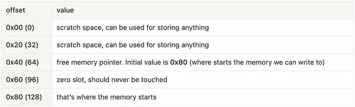

- The first two slots or 64 bytes (0x00 - 0x3f) are reserved for hashing methods.
- The next 32 bytes (0x40 - 0x5f) always store a pointer to the free memory location.
- Then comes the zero slot (0x60 - 0x7f), these 32 bytes are used to fill arrays with zeros, so nothing is ever written to them.

The execution of any function in the EVM starts with three opcodes: `PUSH1(0x80)`, `PUSH1(0x40)`, `MSTORE`. This initializes memory, where the pointer to free memory `0x80` (128th byte) is stored in slot 0x40. You can also call it a memory offset. Thus, the first two slots are initialized with zeros, and memory starting from offset 0x80 is used for adding data to memory.

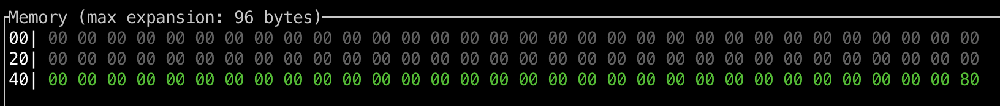

For example, to obtain the number stored in the zero storage slot, you first need to move it to memory.

To do this, you need to:

- Obtain the address (offset) of a free memory slot.
- Write the value from storage to that address.
- Return the address and the size of the returned data.

You can see an example in the debugger:

```js
contract Memory {
    uint256 value = 42; // slot 0

    function getValue() external view returns (uint256) {
        assembly {
            // Obtaining the value for `value`, which is located in the corresponding slot.
            let _value := sload(value.slot)

            // Then obtaining a "pointer" to the free memory in memory.
            let ptr := mload(0x40)

            // Writing our number there.
            mstore(ptr, _value)

            // Returning this number.
            return(ptr, 0x20)
        }
    }
}
```

This is how it will look in memory in the above function, where `value` is equal to 42 (0x2a in hex). We take it from storage and place it in the slot located at address 0x80 (offset by 128 bytes from the beginning).

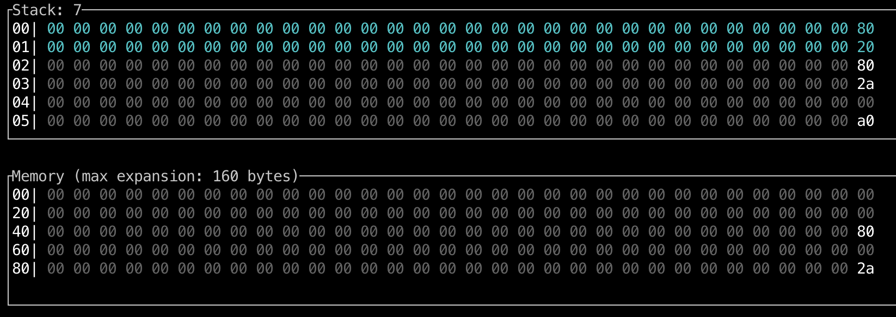

_Important!_ The free memory pointer is automatically updated in Solidity, but **is NOT updated** in assembly code (Yul). Therefore, you will need to do this manually if Solidity code follows assembly code. Each time you switch from Yul back to Solidity, you must update the free memory pointer manually so that the Solidity code can use it.

You can write a function to update the free memory pointer.

See an example in the debugger:

```js
contract Memory {
    // ...

    function allocateMemory() external pure {
        assembly {
            // Performing some operations in memory using 3 slots.
            let freeMemoryPointer := mload(0x40)
            mstore(freeMemoryPointer, 1)
            mstore(add(freeMemoryPointer, 0x20), 2)
            mstore(add(freeMemoryPointer, 0x40), 3)

            // Calling the function to update the pointer.
            allocate(0x60)

            // A function that retrieves the size of memory we used earlier.
            // And updates the pointer to free memory.
            function allocate(length) {
                let pos := mload(0x40)
                mstore(0x40, add(pos, length))
            }
        }
    }
}
```

The following instructions are primarily used when working with memory:

| Function         | Description                                                                                                         |
| ---------------  | --------------------------------------------------------------------------------------------------------------------|
| `mload(p)`       | Loads a 32-byte word from memory starting at position `p` and returns its value.                                   |
| `mstore(p, v)`   | Stores the value `v` in memory starting at position `p`. The value `v` must be 32 bytes in length.                 |
| `mstore8(p, v)`  | Stores the least significant byte of the value `v` (i.e., `v & 0xff`) in memory at address `p`. This only modifies one byte in memory. |
| `msize()`        | Returns the size of memory, i.e., the highest index in memory that has been accessed.                              |

When working with memory, it's important to understand how different data types are added to it.

#### Structures in Memory

Structures are stored sequentially starting from the free memory pointer, after which the free memory pointer is updated.

You can see an example in the debugger:


```js
contract Memory {
    // ...

    struct S {
        uint256 a;
        uint256 b;
    }

    function getStructValuesAndFreeMemoryPointer()
        external
        pure
        returns (uint256 a, uint256 b, bytes32 freeMemoryPointer)
    {
        // Creating a structure and adding values to it.
        S memory s = S({a: 21, b: 42});

        assembly {
            a := mload(0x80) // Returns a (21) because the default free memory pointer in Solidity is 0x80.
            b := mload(0xa0) // Returns b (42) because the second value in the structure is placed right after the first one.

            // The new free memory pointer is 0xc0 (0x80 + 32 bytes * 2).
            freeMemoryPointer := mload(0x40)
        }
    }
}
```

_Important!_ Unlike storage, in memory, data will not be packed if it occupies less than 32 bytes. For example, such a structure will also occupy 62 bytes, not 32, although in storage, the data would have been packed into 32 bytes:

```js
    struct S {
        uint128 a; // takes 32 bytes.
        uint128 b; // takes 32 bytes.
    }
```

#### Fixed-Length Arrays in Memory

Fixed-length arrays work the same way as structures.

You can see an example in the debugger:

```js
contract Memory {
    // ...

    function getFixedArrayValues() external pure returns (uint256 a, uint256 b) {
        uint256[2] memory arr;
        arr[0] = 21;
        arr[1] = 42;

        assembly {
            a := mload(0x80) // Returns the value at the specified index 0
            b := mload(0xa0) // Returns the value at the specified index 1
        }
    }
}
```

#### Dynamic Arrays in Memory

For dynamic arrays, the first 32-byte memory slot is used to store the array's length. In Yul, the array variable is the location of the array in memory.

You can see an example in the debugger:

```js
contract Memory {
    // ...

    function getDynamicArrayValues(uint256[] memory arr) external pure returns (uint256 a, uint256 b, uint256 length) {
        assembly {
            // The location is the first free pointer (e.g., 0x80).
            let ptr := arr
            // It contains the length of the array.
            length := mload(ptr)

            a := mload(add(ptr, 0x20)) // The next cell will contain the value at index 0.
            b := mload(add(ptr, 0x40)) // After that, you will have the value at index 1, and so on.
        }
    }
}
```

_Important!_ If you declare an empty dynamic array in Solidity, it will not be initialized in memory. Instead, it will point to the zero slot 0x60. Therefore, you will need to manually specify its length, add elements, and update the free memory pointer.

You can see an example in the debugger:

```js
contract Memory {
    // ...

    function setValuesToDynamicArray() external pure returns (uint256[] memory) {
        uint256[] memory arr;

        // Let's create an array in memory = [42, 43].
        assembly {
            // Currently, arr points to 0x60.

            // First, assign it the free memory pointer.
            arr := mload(0x40)
            // Next, write the length of the future array - 2 elements.
            mstore(arr, 2)
            // Now, add values to the array.
            mstore(add(arr, 0x20), 42)
            mstore(add(arr, 0x40), 43)

            // Update the free memory pointer.
            mstore(0x40, add(arr, 0x60))
        }

        return arr;
    }
}
```

#### Byte Arrays and Strings in Memory

In memory, elements of arrays always occupy a size that is a multiple of 32 bytes. This holds true even for `bytes1[]`, but not for `bytes` and `string`.

Variables of type `bytes` and `string` represent special dynamic arrays. The length of such an array is stored in the first slot of the array, followed by its elements.

_Important!_ When inspecting memory in a debugger, such arrays will always appear aligned to the left edge of 32-byte slots, just like they did in storage. However, it's crucial to understand that slots exist only in storage, and in memory and calldata, we can only work with offsets. So, what you see in the debugger is merely an abstraction for better comprehension.

This representation imposes certain peculiarities when working with `bytes` in memory.

Example:

```js
contract Memory {
    // ...

    function getStringInfo() external pure returns (uint256 len, bytes21 strInBytes) {
        string memory str = "Hello, this is a test"; // 21 symbols (0x15 в hex)

        assembly {
            len := mload(0x80) // In this slot, the length of the array will be stored.
            strInBytes := mload(0xa0) // In the next slot, the actual array data will be stored.
        }
    }
}
```

If you create a simple string and inspect how it is stored in memory in a debugger, you can observe the following sequence:

- First, a reference to free memory at address `0x40` will be obtained (since `0x60` is the zero slot and cannot be written to - free memory starts at `0x80`).
- The length of the array is written to `0x80` (in the case of our string "Hello, this is a test," it's 21 bytes (`0x15`)).
- In the next "slot," you will see the array of UTF-8 characters `48 65 6c 6c 6f 2c 20 74 68 69 73 20 69 73 20 61 20 74 65 73 74`, aligned to the left.
- Then, the pointer to free memory is updated to `0x40`, which is now `0xc0`.

The trick here is that in memory, this array is actually stored as `15 48 65 6c 6c 6f 2c 20 74 68 69 73 20 69 73 20 61 20 74 65 73 74`. Later, we'll see how to shift this relative to the slots that we see in the debugger. Please note that this is done for convenience (the stack machine works with 32-byte words) and visualization.

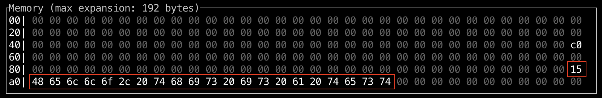

Above is an example of how a string is stored in memory during execution. However, if you need to return such a string from a function, the mechanism will be slightly different.

Example:

```js
contract Memory {
    // ...

    function getString() external pure returns (string memory str) {
        str = "Hello, this is a test";
    }
}
```

- First, the returned byte array will not be the one already stored in memory; all data will be duplicated and written to memory again.
- Second, before the length of the array, 32 bytes with the value `0x20` (32) will be added. You may argue that more than 32 bytes are added because the previous array storage occupied less space (21 bytes), but as we recall, the pointer to free memory was updated to `0xc0`.

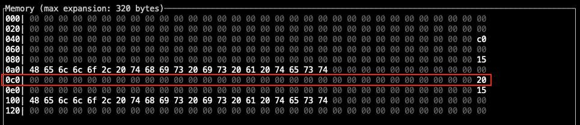

Regarding the addition of `0x20`, I couldn't find documentation, a yellow paper, or any other evidence to support my claim, but the assumption is that this explicitly tells the virtual machine that if it takes the next 32 bytes, it will find the array's length there. In other words, this length is somewhat "separated" from the main byte array. Most likely, this is done for the convenience of working with such data structures. You can increase the length of the string itself, but `0x20` will still be added.

Here's an example for a string with a length of 153 characters:

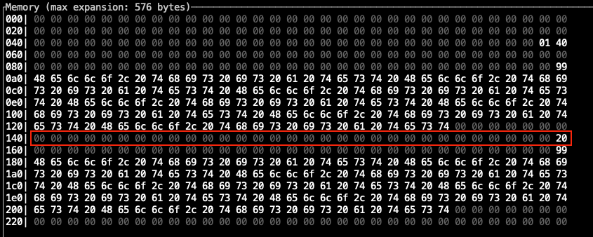

To see how to manually return a string from a function using Yul, let's take the example of the smart contract [Seaport](https://github.com/ProjectOpenSea/seaport/blob/539f0c18af85152aff9d64d90a55cf1627fd3e25/contracts/Seaport.sol#L102C9-L102C9) from OpenSea and its function [\_name()](https://github.com/ProjectOpenSea/seaport/blob/539f0c18af85152aff9d64d90a55cf1627fd3e25/contracts/Seaport.sol#L102C9-L102C9), which has one task: to return a 7-character protocol name - Seaport. Encoded as a byte array, this word would look like this: `07 53 65 61 70 6f 72 74`.


```js
    function _name() internal pure override returns (string memory) {
        // Return the name of the contract.
        assembly {
            mstore(0x20, 0x20)
            mstore(0x47, 0x07536561706f7274)
            return(0x20, 0x60)
        }
    }
```

Let's go through the steps of what happens in this function:

-   `mstore(0x20, 0x20)`: Take the offset `0x20` and write the value `0x20` to it.
-   `mstore(0x47, 0x07536561706f7274)`: Take the offset `0x47` and write our array there.
-   `return(0x20, 0x60)`: Return data from the function with a size of `0x60` bytes starting from offset `0x20`.

Now, let's see how it looks in memory:
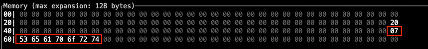

You can see that the data is laid out correctly, with `0x20` first, followed by the array's length `0x07`, and then the array itself aligned to the left. Please note that the write location was at offset `0x47`, not the usual offset that is a multiple of 32 bytes (`0x20`). You will understand why shortly.

Here are the original 32 bytes that were written to memory, highlighted in green, because when we called `mstore(0x47, 0x07536561706f7274)`, the array `0x07536561706f7274` was padded with zeros in front to make it 32 bytes in total.
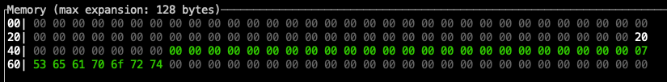

You can achieve the same result like this:

```js
contract Memory {
    // ...

    function getSeaport() external pure returns (string memory, uint256 len, bytes7 arr) {
        assembly {
            mstore(0x20, 0x20) // The second slot was taken for consistency with the original example.
            mstore(0x40, 0x07) // Here, we explicitly specify the length.
            mstore(0x60, 0x536561706f727400000000000000000000000000000000000000000000000000) // Here, we only record values.
            return(0x20, 0x60) // Additionally, we return 96 bytes.
        }
    }
}
```

You can also see that I added two return parameters - `len` and `arr`, which will display the array's length and the array itself (without specifying the length at the beginning).

Finally, I'll show that in memory, there are actually no slots. Let's take the `name` function and add a small offset of 5 bytes.


```js
contract Memory {
    // ...

    function getSeaportSecondVariant() external pure returns (string memory, uint256 len, bytes7 arr) {
        assembly {
            // сI'll comment out the old code to keep it in view.
            // mstore(0x20, 0x20)
            // mstore(0x47, 0x07536561706f7274)
            // return(0x20, 0x60)

            mstore(0x25, 0x20) // 0x20 + 5 = 0x25
            mstore(0x4c, 0x07536561706f7274) // 0x47 + 5 = 0x4c
            return(0x25, 0x60) // 0x20 + 5 = 0x25
        }
    }
}
```

Let's see what happens in memory. First, adding `0x20`:

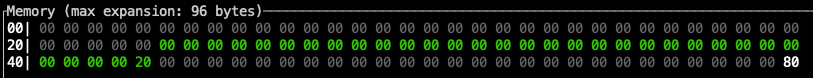

Then, adding the byte array:

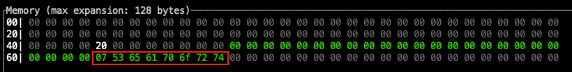

You may also notice that we overwrite the pointer to free memory, which was added before calling the function, and why not, `¯\_(ツ)_/¯`.

Result:

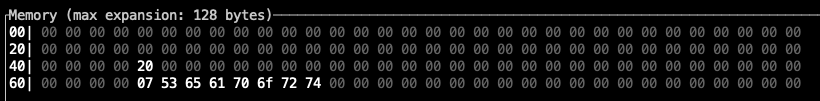

It appears that the data is arranged incorrectly if we think in terms of 32-byte slots, but it will work correctly. You can check for yourself.

#### abi.encode

The abi.encode operation first places the length of the arguments in bytes in memory, and then the arguments themselves. If any argument is less than 32 bytes, it will be extended to 32 bytes.


Example:

```js
contract Memory {
    // ...

    function abiEncode() external pure {
        abi.encode(uint256(1), uint256(2));

        assembly {
            let length := mload(0x80) // 0x0000...000040 (64 байт)
            let arg1 := mload(0xa0) // 0x0000...000001 (32 байт)
            let arg2 := mload(0xc0) // 0x0000...000002 (32 байт)
        }
    }
}
```

#### abi.encodePacked

In comparison to `abi.encode`, the `abi.encodePacked` function does not add additional bytes to the arguments.

Example:

```js
contract Memory {
    // ...

    function abiEncodePacked() external pure {
        abi.encodePacked(uint256(1), uint128(2));

        assembly {
            let length := mload(0x80) // 0x0000...000030 (48 байт)
            let arg1 := mload(0xa0) // 0x0000...000001 (32 байт)
            let arg2 := mload(0xc0) // 0x00...0002 (16 байт)
        }
    }
}
```

#### return

The `return(p, s)` function will take data from memory with a size of `s`, starting from slot `p`. This allows returning data larger than 32 bytes.

```js
contract Memory {
    // ...

    function returnValues() external pure returns (uint256, uint256) {
        assembly {
            // We will write values to slots `0x80` and `0xa0`.
            mstore(0x80, 1)
            mstore(0xa0, 2)
            // We will return data starting from offset `0x80` with a size of `0x40` (64 bytes).
            return(0x80, 0x40)
        }
    }
}
```

_Important!_ If the returned data is less than 32 bytes, it will not be padded to 32 bytes.

#### revert

The arguments of the `revert(p, s)` function are the same as those for `return(p, s)`, in the sense that it also returns data from memory with a size of `s`, starting from slot `p`. The difference is that `revert` will halt the execution of the transaction.

```js
contract Memory {
    // ...

    function revertExecution() external {
        assembly {
            if iszero(eq(mul(2, 2), 5)) {
                revert(0, 0)
            }
        }
    }
}
```

#### keccak256

Calling `keccak256(p, n)` returns the hash of data stored in memory, starting at position `p` and occupying `n` bytes.

Refer to the example in the debugger:

```js
contract Memory {
    // ...

    function getKeccak() external pure {
        assembly {
            // write values to slots `0x80` and `0xa0`.
            mstore(0x80, 1)
            mstore(0xa0, 2)

            // hash the data starting from `0x80` with a size of `0x40` and store it in slot `0xc0`.
            mstore(0xc0, keccak256(0x80, 0x40))
        }
    }
}
```

All the examples are compiled into a smart contract named [Memory.sol](./examples/Memory.sol).

### Calldata

Calldata is a special location in the EVM that refers to the raw bytes sent with any message call transaction between two addresses.

When a contract is called (either from an EOA or another contract), calldata represents the data location containing the initial input arguments of the called function.

Calldata can be considered the cheapest data storage type. This data is read-only and cannot be modified within the function. It's also temporary because it exists only within the transaction (in the `msg.data` field).

The main advantage is that we can take data from calldata and immediately place it on the stack for various operations. We can also load it into memory or storage. Calldata is allocated by the **calling** side, while memory is allocated by the **called** side. In other words, the calling side (EOA or smart contract) forms this data and sends it with the transaction, and the called side processes it in some way.

Data for function calls is encoded according to the ABI, which you can read about [here](https://github.com/fullstack-development/blockchain-wiki-en/blob/main/solidity/ABI/readme.md) and in the [documentation](https://docs.soliditylang.org/en/latest/abi-spec.html).

Key points:

- Calldata cannot be modified; it's immutable and potentially has an unlimited size (the technical limitation is the available gas in a block).
- The first 4 bytes always represent the function signature, and the rest are the arguments.
- When using types like `array`, `bytes`, or `string`, the first parameter is the offset from which the parameter begins, and at this offset, you will find its length.
- Arguments smaller than 32 bytes are padded to 32 bytes.

_An interesting fact!_ After [EIP-2028](https://eips.ethereum.org/EIPS/eip-2028), the cost of non-zero data in calldata was reduced from 68 to 16 gas per byte. This was done to increase the network's "throughput," including improving scalability with L2 solutions. For example, rollups combine multiple transactions into a single batch, and here, the cheaper calldata is particularly useful.

Primary functions for working with calldata:

| Function              | Description                                                                                    |
| --------------------- | ---------------------------------------------------------------------------------------------- |
| `calldataload(p)`     | Loads a 32-byte word from the input data of the call, starting at position `p`.                |
| `calldatasize()`      | Returns the size of the input data of the call in bytes.                                       |
| `calldatacopy(t, f, s)` | Copies `s` bytes from the input data of the call, starting at position `f`, to memory, starting at position `t`. |

When it comes to working with calldata, we return to the notion of "slots" or 32-byte words. The key is not to forget the 4-byte offset for the function signature. As an example, let's break down calldata that contains a string. Recall that a string will be encoded in the format `offset + length + data`.

```js
contract Calldata {

    function getString(string calldata) external pure returns(string memory, uint256 len) {
        assembly {
            // obtain the string offset, adding 4 bytes for the function signature to correct the offset.
            let strOffset := add(4, calldataload(4))
            // getting the string's length
            len := calldataload(strOffset)
            // obtain a pointer to free memory.
            let ptr := mload(0x40)
            // calculate the size of data without the function signature.
            let dataSize := sub(calldatasize(), 4)
            // copy all the data about the string to memory except for the function signature.
            calldatacopy(ptr, 0x04, dataSize)

            // return the string
            return(0x80, dataSize)
        }
    }
}
```

Therefore, the sequence of actions is as follows:

- First, we use `calldataload` to extract the offset from which the string data begins. We add 4 bytes for the function signature.
- With this offset, we obtain the length of the string.
- We get a pointer to free memory.
- We calculate the size of the data (`calldatasize` returns the total size), excluding the function selector.
- We copy all the calldata starting from the 5th byte (0x04) to memory, starting from the pointer to free memory `ptr`.
- We return the string (for clarification, refer to the section on [strings in memory](#массивы-байтов-и-строки-в-memory)).

It's important to note that this code is made solely for demonstration purposes and is somewhat simplified. The reason is that in this example, we know two things that we've taken advantage of:

- The string offset is 32 bytes.
- Nothing else is passed to the function except the string.

Therefore, we can afford to copy all the data immediately after the function signature. However, if there is something other than the string before it, this code will break. This is done intentionally, and I strongly recommend experimenting with it in Remix using the debugger. Try passing something before the string in the function, while also copying it to memory and returning it from the function, such as with a signature like `foo(uint256 amount, string calldata)`.

You can find an example in the contract [Calldata.sol](./examples/Calldata.sol).

By the way, in the Remix debugger, all passed calldata is always displayed.
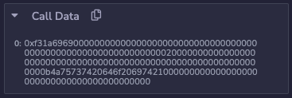

#### Data Slices

This topic is not entirely about Yul, but you might encounter a similar notation (`data[:4]`) somewhere near inline assembly, so it's better to know what it means.

Starting from Solidity 0.6.0, there's a `data[start:end]` syntax ("slices") for `bytes` variables passed with calldata (this does not work in memory).

Here's how it works:

- `start` - the offset from which to start the slice.
- `end` - the offset that determines where to end the slice.
- Colon `:` - separates the start and end.

You can omit the start or end. If you skip the start, the slice will default to starting at offset 0. If you don't specify the end, the slice will default to ending at the last byte in calldata.

This way, you can, for example, obtain the function selector: `bytes4 selector = msg.data[:4]`, or vice versa, only the encoded data `bytes data = msg.data[4:0]`. You can also specify a range `bytes data = msg.data[4:8]`.

## Calling Other Smart Contracts

In Yul, there's the ability to call other smart contracts, and the following instructions are used for this:

| Function                                        | Description                                                                                                                                                                                                                                                              |
| ---------------------------------------------- | --------------------------------------------------------------------------------------------------------------------------------------------------------------------------------------------------------------------------------------------------------------------- |
| `call(g, a, v, in, insize, out, outsize)`      | Calls the contract at address `a`, passing input data from memory `[in...(in+insize))`, providing `g` gas and `v` value. The result is written to memory `[out...(out+outsize))`. Returns 0 in case of an error (e.g., due to insufficient gas) and 1 on success. |
| `callcode(g, a, v, in, insize, out, outsize)`  | Similar to `call` but uses only the code of the contract at address `a`, remaining in the context of the current contract.                                                                                                                                                           |
| `delegatecall(g, a, in, insize, out, outsize)` | Similar to `callcode` but also preserves the calling contract's address and the passed value (callvalue).                                                                                                                                                                 |
| `staticcall(g, a, in, insize, out, outsize)`   | Similar to `call` but does not allow modifying the state of the contract.                                                                                                                                                                                                   |

All these functions return 1 in case of successful execution and 0 in case of failure.

Often, they are used in conjunction with instructions that allow working with the returned data:

| Function                   | Description                                                                                   |
| -------------------------- | --------------------------------------------------------------------------------------------- |
| `returndatasize()`         | Returns the size of the last returned data (returndata).                                      |
| `returndatacopy(t, f, s)`  | Copies `s` bytes from returndata, starting at position `f`, to memory, starting at position `t`. |

The most common use case is proxy contracts. Let's take a look at the private `_delegate` function of the [Proxy](https://github.com/OpenZeppelin/openzeppelin-contracts/blob/master/contracts/proxy/Proxy.sol) contract from OpenZeppelin.


```js
    function _delegate(address implementation) internal virtual {
        assembly {
            // Copy msg.data. We take full control of memory in this inline assembly
            // block because it will not return to Solidity code. We overwrite the
            // Solidity scratch pad at memory position 0.
            calldatacopy(0, 0, calldatasize())

            // Call the implementation.
            // out and outsize are 0 because we don't know the size yet.
            let result := delegatecall(gas(), implementation, 0, calldatasize(), 0, 0)

            // Copy the returned data.
            returndatacopy(0, 0, returndatasize())

            switch result
            // delegatecall returns 0 on error.
            case 0 {
                revert(0, returndatasize())
            }
            default {
                return(0, returndatasize())
            }
        }
    }
```

This function is called by the `fallback()` function, which in turn adds the implementation address stored in the Proxy contract. Let's see what happens next:

- First, all calldata data is copied to memory (as we remember, calldata memory is immutable, so the implementation address is not included; everything that came with the transaction in `msg.data` remains unchanged).
- Next, we call `delegatecall` and pass all the necessary parameters:
  - The remaining gas amount.
  - The address of the contract that will execute the code.
  - The offset of the data in memory where we copied the calldata, which is 0 in this case.
  - The size of the data we take from memory to send to the contract (calldata size).
  - The offset in memory where the returned data will be written, also 0 in this case.
  - The size of the returned data, which we don't know, so it's 0.
- After that, we copy the returned data into memory (the principle here is the same as with `calldatacopy`). Since in the previous step of `delegatecall`, we didn't know the size of the returned data and didn't specify a place for copying and the size.
- We check `result`, if everything went successfully, we return the returned data.
- If the transaction fails, we return the errors returned by the smart contract.

With `call`, everything will be the same, except one more parameter will be added for transfer - `value`. You can read more about how `call` and `delegatecall` work [here](https://noxx.substack.com/p/evm-deep-dives-the-path-to-shadowy-a5f).

_Important!_ If the address passed as a parameter as the sub-context does not have code (for example, EOA), the call will return true (1). And the opposite situation (returning false - 0) can occur if there is not enough gas or if the stack runs out of space.

Here's a [link to the smart contract](./examples/Delegatecall.sol) with which you can test calling one contract from another. It is also done as an example of a proxy and implementation. You can interact with the proxy contract through low-level interactions in Remix.
You can prepare data for it using `cast`, or you can use `abi.encode`.
With a `cast` it looks like this:
```bash
    cast calldata "increment(uint256)" 42

    >> 0x7cf5dab0000000000000000000000000000000000000000000000000000000000000002a
```

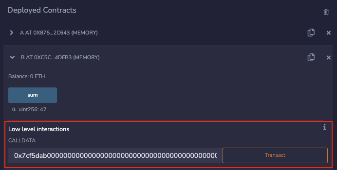

_Important!_ After the Byzantium hard fork, you don't need to specify the size of the returned data (the last parameter in `call`, `delegatecall`, `callcode`, and `staticcall`) and can copy it using `returndatacopy` and `returndatasize`. In the examples, it's done this way, but it should also work the other way (if you specify the size of the returned data, you won't need to do `returndatacopy`). In practice, when I conducted tests, if you don't do `returndatacopy` after `delegatecall` (even with zero arguments), the data isn't copied to memory ¯\_(ツ)_/¯.

## Events

In Yul, there are five different instructions for events, but if you know how events are created in the EVM, there won't be anything difficult for you here.

An event can have four topics and non-indexed data. The first topic, if present, is always the hash of the event's signature, and the other three are indexed parameters. For non-indexed data, you specify the memory offset and the size of this data.

| Function                      | Description                                                                                                                      |
| ------------------------------ | -------------------------------------------------------------------------------------------------------------------------------- |
| `log0(p, s)`                   | Creates an event without topics and with data of size `s`, starting from the memory offset `p`. Such events are also called anonymous. |
| `log1(p, s, t1)`               | Creates an event with one topic `t1` and data of size `s`, starting from the memory offset `p`.                                    |
| `log2(p, s, t1, t2)`           | Creates an event with two topics `t1` and `t2` and data of size `s`, starting from the memory offset `p`.                          |
| `log3(p, s, t1, t2, t3)`       | Creates an event with three topics `t1`, `t2`, and `t3` and data of size `s`, starting from the memory offset `p`.                |
| `log4(p, s, t1, t2, t3, t4)`   | Creates an event with four topics `t1`, `t2`, `t3`, and `t4` and data of size `s`, starting from the memory offset `p`.           |

Here, t1 is the keccak256 hash of the event's signature, t2 is the first indexed event argument, t3 is the second indexed event argument, and so on.

In the example below, it demonstrates how `log3` works to create an event `SomeLog(2, 3, true)`.:

```js
contract EmitEvent {
    event SomeLog(uint256 indexed a, uint256 indexed b, bool c);

    function emitEvent() external {
        assembly {
            // event's hash- keccak256("SomeLog(uint256,uint256,bool)")
            let signature := 0x39cf0823186c1f89c8975545aebaa16813bfc9511610e72d8cff59da81b23c72

            // Obtaining a Pointer to Free Memory
            let ptr := mload(0x40)

            // Writing the number 1 to this address (0x80):
            mstore(ptr, 1)

            // Creating an event SomeLog(2, 3, true):
            log3(0x80, 0x20, signature, 2, 3)
        }
    }
}
```

- `log3` includes `topic 1`, which is the event signature hash, so we store it in a variable.
- We obtain the memory write offset.
- We write the value `1` (`true`) to that location.
- We create the `log3` event, passing all the necessary arguments.

Here's how it will look at the stack and memory level:

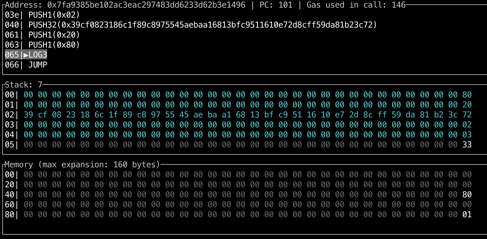

- Unindexed data is written in memory.
- In the stack, the following elements are stored in the required order:
    - The memory offset where unindexed data begins (0x80).
    - The size of unindexed data (0x20 - 32 bytes).
    - The keccak256 hash of the event signature `SomeLog(uint256,uint256,bool)`.
    - The first indexed argument.
    - The second indexed argument.
- The `LOG3` opcode is called, which takes the last 5 elements from the stack.

You can find the Smart Contract EmitEvent [here](./examples/EmitEvent.sol).

## Smart Contracts in Yul Language

You can write a smart contract using Standalone Assembly, which is pure Yul code in a `.yul` file. However, this is a more exotic approach and is more related to optimizing code with the Solidity compiler.

The syntax is relatively simple, but as always with Yul, it involves a lot of manual work, and all interactions with such a contract will occur through `msg.data`, which corresponds to the mentioned `calldata` and low-level interactions in Remix (if you're doing this in Remix).

In the `.yul` file, everything is built around objects. A contract is an object in Yul, and the `code` section is the actual code.

Functions `datasize`, `dataoffset`, and `datacopy` can be used to access sections of the code. Hexadecimal strings can be used to specify data in hexadecimal encoding, while regular strings are in their own encoding. As for `code` - `datacopy` will access its compiled binary representation.

| Function           | Description                                                                                         |
| ------------------ | --------------------------------------------------------------------------------------------------- |
| `datasize(x)`      | The `datasize(x)` function returns the size of the Yul object `x` in the data area. `x` must be a string literal representing the name of another object.  |
| `dataoffset(x)`    | The `dataoffset(x)` function returns the offset of the Yul object `x` in the data area. `x` must be a string literal representing the name of another object. |
| `datacopy(t, f, l)`| The `datacopy(t, f, l)` function copies `l` bytes from the data area starting at position `f` to memory starting at position `t`. For EVM, `datacopy` is equivalent to `codecopy`. |

You can find more detailed information in the [documentation](https://docs.soliditylang.org/en/latest/yul.html#specification-of-yul-object), but I also recommend trying to work with an ERC20 token contract for a more practical understanding [here](https://remix.ethereum.org/?#language=yul&version=0.8.22&code=b2JqZWN0ICJUb2tlbiIgewogICAgY29kZSB7CiAgICAgICAgLy8gU3RvcmUgdGhlIGNyZWF0b3IgaW4gc2xvdCB6ZXJvLgogICAgICAgIHNzdG9yZSgwLCBjYWxsZXIoKSkKCiAgICAgICAgLy8gRGVwbG95IHRoZSBjb250cmFjdAogICAgICAgIGRhdGFjb3B5KDAsIGRhdGFvZmZzZXQoInJ1bnRpbWUiKSwgZGF0YXNpemUoInJ1bnRpbWUiKSkKICAgICAgICByZXR1cm4oMCwgZGF0YXNpemUoInJ1bnRpbWUiKSkKICAgIH0KICAgIG9iamVjdCAicnVudGltZSIgewogICAgICAgIGNvZGUgewogICAgICAgICAgICAvLyBQcm90ZWN0aW9uIGFnYWluc3Qgc2VuZGluZyBFdGhlcgogICAgICAgICAgICByZXF1aXJlKGlzemVybyhjYWxsdmFsdWUoKSkpCgogICAgICAgICAgICAvLyBEaXNwYXRjaGVyCiAgICAgICAgICAgIHN3aXRjaCBzZWxlY3RvcigpCiAgICAgICAgICAgIGNhc2UgMHg3MGEwODIzMSAvKiAiYmFsYW5jZU9mKGFkZHJlc3MpIiAqLyB7CiAgICAgICAgICAgICAgICByZXR1cm5VaW50KGJhbGFuY2VPZihkZWNvZGVBc0FkZHJlc3MoMCkpKQogICAgICAgICAgICB9CiAgICAgICAgICAgIGNhc2UgMHgxODE2MGRkZCAvKiAidG90YWxTdXBwbHkoKSIgKi8gewogICAgICAgICAgICAgICAgcmV0dXJuVWludCh0b3RhbFN1cHBseSgpKQogICAgICAgICAgICB9CiAgICAgICAgICAgIGNhc2UgMHhhOTA1OWNiYiAvKiAidHJhbnNmZXIoYWRkcmVzcyx1aW50MjU2KSIgKi8gewogICAgICAgICAgICAgICAgdHJhbnNmZXIoZGVjb2RlQXNBZGRyZXNzKDApLCBkZWNvZGVBc1VpbnQoMSkpCiAgICAgICAgICAgICAgICByZXR1cm5UcnVlKCkKICAgICAgICAgICAgfQogICAgICAgICAgICBjYXNlIDB4MjNiODcyZGQgLyogInRyYW5zZmVyRnJvbShhZGRyZXNzLGFkZHJlc3MsdWludDI1NikiICovIHsKICAgICAgICAgICAgICAgIHRyYW5zZmVyRnJvbShkZWNvZGVBc0FkZHJlc3MoMCksIGRlY29kZUFzQWRkcmVzcygxKSwgZGVjb2RlQXNVaW50KDIpKQogICAgICAgICAgICAgICAgcmV0dXJuVHJ1ZSgpCiAgICAgICAgICAgIH0KICAgICAgICAgICAgY2FzZSAweDA5NWVhN2IzIC8qICJhcHByb3ZlKGFkZHJlc3MsdWludDI1NikiICovIHsKICAgICAgICAgICAgICAgIGFwcHJvdmUoZGVjb2RlQXNBZGRyZXNzKDApLCBkZWNvZGVBc1VpbnQoMSkpCiAgICAgICAgICAgICAgICByZXR1cm5UcnVlKCkKICAgICAgICAgICAgfQogICAgICAgICAgICBjYXNlIDB4ZGQ2MmVkM2UgLyogImFsbG93YW5jZShhZGRyZXNzLGFkZHJlc3MpIiAqLyB7CiAgICAgICAgICAgICAgICByZXR1cm5VaW50KGFsbG93YW5jZShkZWNvZGVBc0FkZHJlc3MoMCksIGRlY29kZUFzQWRkcmVzcygxKSkpCiAgICAgICAgICAgIH0KICAgICAgICAgICAgY2FzZSAweDQwYzEwZjE5IC8qICJtaW50KGFkZHJlc3MsdWludDI1NikiICovIHsKICAgICAgICAgICAgICAgIG1pbnQoZGVjb2RlQXNBZGRyZXNzKDApLCBkZWNvZGVBc1VpbnQoMSkpCiAgICAgICAgICAgICAgICByZXR1cm5UcnVlKCkKICAgICAgICAgICAgfQogICAgICAgICAgICBkZWZhdWx0IHsKICAgICAgICAgICAgICAgIHJldmVydCgwLCAwKQogICAgICAgICAgICB9CgogICAgICAgICAgICBmdW5jdGlvbiBtaW50KGFjY291bnQsIGFtb3VudCkgewogICAgICAgICAgICAgICAgcmVxdWlyZShjYWxsZWRCeU93bmVyKCkpCgogICAgICAgICAgICAgICAgbWludFRva2VucyhhbW91bnQpCiAgICAgICAgICAgICAgICBhZGRUb0JhbGFuY2UoYWNjb3VudCwgYW1vdW50KQogICAgICAgICAgICAgICAgZW1pdFRyYW5zZmVyKDAsIGFjY291bnQsIGFtb3VudCkKICAgICAgICAgICAgfQogICAgICAgICAgICBmdW5jdGlvbiB0cmFuc2Zlcih0bywgYW1vdW50KSB7CiAgICAgICAgICAgICAgICBleGVjdXRlVHJhbnNmZXIoY2FsbGVyKCksIHRvLCBhbW91bnQpCiAgICAgICAgICAgIH0KICAgICAgICAgICAgZnVuY3Rpb24gYXBwcm92ZShzcGVuZGVyLCBhbW91bnQpIHsKICAgICAgICAgICAgICAgIHJldmVydElmWmVyb0FkZHJlc3Moc3BlbmRlcikKICAgICAgICAgICAgICAgIHNldEFsbG93YW5jZShjYWxsZXIoKSwgc3BlbmRlciwgYW1vdW50KQogICAgICAgICAgICAgICAgZW1pdEFwcHJvdmFsKGNhbGxlcigpLCBzcGVuZGVyLCBhbW91bnQpCiAgICAgICAgICAgIH0KICAgICAgICAgICAgZnVuY3Rpb24gdHJhbnNmZXJGcm9tKGZyb20sIHRvLCBhbW91bnQpIHsKICAgICAgICAgICAgICAgIGRlY3JlYXNlQWxsb3dhbmNlQnkoZnJvbSwgY2FsbGVyKCksIGFtb3VudCkKICAgICAgICAgICAgICAgIGV4ZWN1dGVUcmFuc2Zlcihmcm9tLCB0bywgYW1vdW50KQogICAgICAgICAgICB9CgogICAgICAgICAgICBmdW5jdGlvbiBleGVjdXRlVHJhbnNmZXIoZnJvbSwgdG8sIGFtb3VudCkgewogICAgICAgICAgICAgICAgcmV2ZXJ0SWZaZXJvQWRkcmVzcyh0bykKICAgICAgICAgICAgICAgIGRlZHVjdEZyb21CYWxhbmNlKGZyb20sIGFtb3VudCkKICAgICAgICAgICAgICAgIGFkZFRvQmFsYW5jZSh0bywgYW1vdW50KQogICAgICAgICAgICAgICAgZW1pdFRyYW5zZmVyKGZyb20sIHRvLCBhbW91bnQpCiAgICAgICAgICAgIH0KCgogICAgICAgICAgICAvKiAtLS0tLS0tLS0tIGNhbGxkYXRhIGRlY29kaW5nIGZ1bmN0aW9ucyAtLS0tLS0tLS0tLSAqLwogICAgICAgICAgICBmdW5jdGlvbiBzZWxlY3RvcigpIC0+IHMgewogICAgICAgICAgICAgICAgcyA6PSBkaXYoY2FsbGRhdGFsb2FkKDApLCAweDEwMDAwMDAwMDAwMDAwMDAwMDAwMDAwMDAwMDAwMDAwMDAwMDAwMDAwMDAwMDAwMDAwMDAwMDAwMCkKICAgICAgICAgICAgfQoKICAgICAgICAgICAgZnVuY3Rpb24gZGVjb2RlQXNBZGRyZXNzKG9mZnNldCkgLT4gdiB7CiAgICAgICAgICAgICAgICB2IDo9IGRlY29kZUFzVWludChvZmZzZXQpCiAgICAgICAgICAgICAgICBpZiBpc3plcm8oaXN6ZXJvKGFuZCh2LCBub3QoMHhmZmZmZmZmZmZmZmZmZmZmZmZmZmZmZmZmZmZmZmZmZmZmZmZmZmZmKSkpKSB7CiAgICAgICAgICAgICAgICAgICAgcmV2ZXJ0KDAsIDApCiAgICAgICAgICAgICAgICB9CiAgICAgICAgICAgIH0KICAgICAgICAgICAgZnVuY3Rpb24gZGVjb2RlQXNVaW50KG9mZnNldCkgLT4gdiB7CiAgICAgICAgICAgICAgICBsZXQgcG9zIDo9IGFkZCg0LCBtdWwob2Zmc2V0LCAweDIwKSkKICAgICAgICAgICAgICAgIGlmIGx0KGNhbGxkYXRhc2l6ZSgpLCBhZGQocG9zLCAweDIwKSkgewogICAgICAgICAgICAgICAgICAgIHJldmVydCgwLCAwKQogICAgICAgICAgICAgICAgfQogICAgICAgICAgICAgICAgdiA6PSBjYWxsZGF0YWxvYWQocG9zKQogICAgICAgICAgICB9CiAgICAgICAgICAgIC8qIC0tLS0tLS0tLS0gY2FsbGRhdGEgZW5jb2RpbmcgZnVuY3Rpb25zIC0tLS0tLS0tLS0gKi8KICAgICAgICAgICAgZnVuY3Rpb24gcmV0dXJuVWludCh2KSB7CiAgICAgICAgICAgICAgICBtc3RvcmUoMCwgdikKICAgICAgICAgICAgICAgIHJldHVybigwLCAweDIwKQogICAgICAgICAgICB9CiAgICAgICAgICAgIGZ1bmN0aW9uIHJldHVyblRydWUoKSB7CiAgICAgICAgICAgICAgICByZXR1cm5VaW50KDEpCiAgICAgICAgICAgIH0KCiAgICAgICAgICAgIC8qIC0tLS0tLS0tIGV2ZW50cyAtLS0tLS0tLS0tICovCiAgICAgICAgICAgIGZ1bmN0aW9uIGVtaXRUcmFuc2Zlcihmcm9tLCB0bywgYW1vdW50KSB7CiAgICAgICAgICAgICAgICBsZXQgc2lnbmF0dXJlSGFzaCA6PSAweGRkZjI1MmFkMWJlMmM4OWI2OWMyYjA2OGZjMzc4ZGFhOTUyYmE3ZjE2M2M0YTExNjI4ZjU1YTRkZjUyM2IzZWYKICAgICAgICAgICAgICAgIGVtaXRFdmVudChzaWduYXR1cmVIYXNoLCBmcm9tLCB0bywgYW1vdW50KQogICAgICAgICAgICB9CiAgICAgICAgICAgIGZ1bmN0aW9uIGVtaXRBcHByb3ZhbChmcm9tLCBzcGVuZGVyLCBhbW91bnQpIHsKICAgICAgICAgICAgICAgIGxldCBzaWduYXR1cmVIYXNoIDo9IDB4OGM1YmUxZTVlYmVjN2Q1YmQxNGY3MTQyN2QxZTg0ZjNkZDAzMTRjMGY3YjIyOTFlNWIyMDBhYzhjN2MzYjkyNQogICAgICAgICAgICAgICAgZW1pdEV2ZW50KHNpZ25hdHVyZUhhc2gsIGZyb20sIHNwZW5kZXIsIGFtb3VudCkKICAgICAgICAgICAgfQogICAgICAgICAgICBmdW5jdGlvbiBlbWl0RXZlbnQoc2lnbmF0dXJlSGFzaCwgaW5kZXhlZDEsIGluZGV4ZWQyLCBub25JbmRleGVkKSB7CiAgICAgICAgICAgICAgICBtc3RvcmUoMCwgbm9uSW5kZXhlZCkKICAgICAgICAgICAgICAgIGxvZzMoMCwgMHgyMCwgc2lnbmF0dXJlSGFzaCwgaW5kZXhlZDEsIGluZGV4ZWQyKQogICAgICAgICAgICB9CgogICAgICAgICAgICAvKiAtLS0tLS0tLSBzdG9yYWdlIGxheW91dCAtLS0tLS0tLS0tICovCiAgICAgICAgICAgIGZ1bmN0aW9uIG93bmVyUG9zKCkgLT4gcCB7IHAgOj0gMCB9CiAgICAgICAgICAgIGZ1bmN0aW9uIHRvdGFsU3VwcGx5UG9zKCkgLT4gcCB7IHAgOj0gMSB9CiAgICAgICAgICAgIGZ1bmN0aW9uIGFjY291bnRUb1N0b3JhZ2VPZmZzZXQoYWNjb3VudCkgLT4gb2Zmc2V0IHsKICAgICAgICAgICAgICAgIG9mZnNldCA6PSBhZGQoMHgxMDAwLCBhY2NvdW50KQogICAgICAgICAgICB9CiAgICAgICAgICAgIGZ1bmN0aW9uIGFsbG93YW5jZVN0b3JhZ2VPZmZzZXQoYWNjb3VudCwgc3BlbmRlcikgLT4gb2Zmc2V0IHsKICAgICAgICAgICAgICAgIG9mZnNldCA6PSBhY2NvdW50VG9TdG9yYWdlT2Zmc2V0KGFjY291bnQpCiAgICAgICAgICAgICAgICBtc3RvcmUoMCwgb2Zmc2V0KQogICAgICAgICAgICAgICAgbXN0b3JlKDB4MjAsIHNwZW5kZXIpCiAgICAgICAgICAgICAgICBvZmZzZXQgOj0ga2VjY2FrMjU2KDAsIDB4NDApCiAgICAgICAgICAgIH0KCiAgICAgICAgICAgIC8qIC0tLS0tLS0tIHN0b3JhZ2UgYWNjZXNzIC0tLS0tLS0tLS0gKi8KICAgICAgICAgICAgZnVuY3Rpb24gb3duZXIoKSAtPiBvIHsKICAgICAgICAgICAgICAgIG8gOj0gc2xvYWQob3duZXJQb3MoKSkKICAgICAgICAgICAgfQogICAgICAgICAgICBmdW5jdGlvbiB0b3RhbFN1cHBseSgpIC0+IHN1cHBseSB7CiAgICAgICAgICAgICAgICBzdXBwbHkgOj0gc2xvYWQodG90YWxTdXBwbHlQb3MoKSkKICAgICAgICAgICAgfQogICAgICAgICAgICBmdW5jdGlvbiBtaW50VG9rZW5zKGFtb3VudCkgewogICAgICAgICAgICAgICAgc3N0b3JlKHRvdGFsU3VwcGx5UG9zKCksIHNhZmVBZGQodG90YWxTdXBwbHkoKSwgYW1vdW50KSkKICAgICAgICAgICAgfQogICAgICAgICAgICBmdW5jdGlvbiBiYWxhbmNlT2YoYWNjb3VudCkgLT4gYmFsIHsKICAgICAgICAgICAgICAgIGJhbCA6PSBzbG9hZChhY2NvdW50VG9TdG9yYWdlT2Zmc2V0KGFjY291bnQpKQogICAgICAgICAgICB9CiAgICAgICAgICAgIGZ1bmN0aW9uIGFkZFRvQmFsYW5jZShhY2NvdW50LCBhbW91bnQpIHsKICAgICAgICAgICAgICAgIGxldCBvZmZzZXQgOj0gYWNjb3VudFRvU3RvcmFnZU9mZnNldChhY2NvdW50KQogICAgICAgICAgICAgICAgc3N0b3JlKG9mZnNldCwgc2FmZUFkZChzbG9hZChvZmZzZXQpLCBhbW91bnQpKQogICAgICAgICAgICB9CiAgICAgICAgICAgIGZ1bmN0aW9uIGRlZHVjdEZyb21CYWxhbmNlKGFjY291bnQsIGFtb3VudCkgewogICAgICAgICAgICAgICAgbGV0IG9mZnNldCA6PSBhY2NvdW50VG9TdG9yYWdlT2Zmc2V0KGFjY291bnQpCiAgICAgICAgICAgICAgICBsZXQgYmFsIDo9IHNsb2FkKG9mZnNldCkKICAgICAgICAgICAgICAgIHJlcXVpcmUobHRlKGFtb3VudCwgYmFsKSkKICAgICAgICAgICAgICAgIHNzdG9yZShvZmZzZXQsIHN1YihiYWwsIGFtb3VudCkpCiAgICAgICAgICAgIH0KICAgICAgICAgICAgZnVuY3Rpb24gYWxsb3dhbmNlKGFjY291bnQsIHNwZW5kZXIpIC0+IGFtb3VudCB7CiAgICAgICAgICAgICAgICBhbW91bnQgOj0gc2xvYWQoYWxsb3dhbmNlU3RvcmFnZU9mZnNldChhY2NvdW50LCBzcGVuZGVyKSkKICAgICAgICAgICAgfQogICAgICAgICAgICBmdW5jdGlvbiBzZXRBbGxvd2FuY2UoYWNjb3VudCwgc3BlbmRlciwgYW1vdW50KSB7CiAgICAgICAgICAgICAgICBzc3RvcmUoYWxsb3dhbmNlU3RvcmFnZU9mZnNldChhY2NvdW50LCBzcGVuZGVyKSwgYW1vdW50KQogICAgICAgICAgICB9CiAgICAgICAgICAgIGZ1bmN0aW9uIGRlY3JlYXNlQWxsb3dhbmNlQnkoYWNjb3VudCwgc3BlbmRlciwgYW1vdW50KSB7CiAgICAgICAgICAgICAgICBsZXQgb2Zmc2V0IDo9IGFsbG93YW5jZVN0b3JhZ2VPZmZzZXQoYWNjb3VudCwgc3BlbmRlcikKICAgICAgICAgICAgICAgIGxldCBjdXJyZW50QWxsb3dhbmNlIDo9IHNsb2FkKG9mZnNldCkKICAgICAgICAgICAgICAgIHJlcXVpcmUobHRlKGFtb3VudCwgY3VycmVudEFsbG93YW5jZSkpCiAgICAgICAgICAgICAgICBzc3RvcmUob2Zmc2V0LCBzdWIoY3VycmVudEFsbG93YW5jZSwgYW1vdW50KSkKICAgICAgICAgICAgfQoKICAgICAgICAgICAgLyogLS0tLS0tLS0tLSB1dGlsaXR5IGZ1bmN0aW9ucyAtLS0tLS0tLS0tICovCiAgICAgICAgICAgIGZ1bmN0aW9uIGx0ZShhLCBiKSAtPiByIHsKICAgICAgICAgICAgICAgIHIgOj0gaXN6ZXJvKGd0KGEsIGIpKQogICAgICAgICAgICB9CiAgICAgICAgICAgIGZ1bmN0aW9uIGd0ZShhLCBiKSAtPiByIHsKICAgICAgICAgICAgICAgIHIgOj0gaXN6ZXJvKGx0KGEsIGIpKQogICAgICAgICAgICB9CiAgICAgICAgICAgIGZ1bmN0aW9uIHNhZmVBZGQoYSwgYikgLT4gciB7CiAgICAgICAgICAgICAgICByIDo9IGFkZChhLCBiKQogICAgICAgICAgICAgICAgaWYgb3IobHQociwgYSksIGx0KHIsIGIpKSB7IHJldmVydCgwLCAwKSB9CiAgICAgICAgICAgIH0KICAgICAgICAgICAgZnVuY3Rpb24gY2FsbGVkQnlPd25lcigpIC0+IGNibyB7CiAgICAgICAgICAgICAgICBjYm8gOj0gZXEob3duZXIoKSwgY2FsbGVyKCkpCiAgICAgICAgICAgIH0KICAgICAgICAgICAgZnVuY3Rpb24gcmV2ZXJ0SWZaZXJvQWRkcmVzcyhhZGRyKSB7CiAgICAgICAgICAgICAgICByZXF1aXJlKGFkZHIpCiAgICAgICAgICAgIH0KICAgICAgICAgICAgZnVuY3Rpb24gcmVxdWlyZShjb25kaXRpb24pIHsKICAgICAgICAgICAgICAgIGlmIGlzemVybyhjb25kaXRpb24pIHsgcmV2ZXJ0KDAsIDApIH0KICAgICAgICAgICAgfQogICAgICAgIH0KICAgIH0KfQ&lang=en&optimize=false&runs=200&evmVersion=null) в In Remix, you can call various functions and observe how they execute in the debugger. For example, you can invoke functions like this to interact with Remix and see how they work .
`mint(0x5B38Da6a701c568545dCfcB03FcB875f56beddC4, 42)`:

```
0x40c10f190000000000000000000000005b38da6a701c568545dcfcb03fcb875f56beddc4000000000000000000000000000000000000000000000000000000000000002a
```

**Note!** If you want to create your `.yul` contract, don't forget to inform the compiler, as it defaults to working with Solidity.

## In lieu of a conclusion

Studying Yul will help solidify many concepts related to EVM operation, gain a deeper understanding of optimization, and learn how to dissect smart contracts with inline assembly inserts, such as those found in libraries like [Solady](https://github.com/Vectorized/solady) or optimized contracts like [ERC721A](https://github.com/chiru-labs/ERC721A/blob/main/contracts/ERC721A.sol).

I'd also like to quote the documentation:
"Inline assembly is a way to interact with the Ethereum virtual machine at a low level. Unlike Solidity, Yul lacks certain important checks that allow for safer code. Use Yul only when it is truly necessary and when you are absolutely sure it is justified."

## Links:

- [Docs: Yul](https://docs.soliditylang.org/en/latest/yul.html)
- [Docs: Layout of memory](https://docs.soliditylang.org/en/latest/internals/layout_in_memory.html)
- [Playlist: Mastering Solidity Assembly (YUL)](https://youtube.com/playlist?list=PL5hld-skrdFrxGUmmEbG1LBvYVyTE9M62&si=jwXH_rtSvoNfrDPg)
- [Article: Inline Assembly in Solidity: A Practical Starter’s Guide](https://medium.com/lumos-labs/inline-assembly-in-solidity-34d3ba2cfa7a)
- [Video: The Dark Arts of Yul](https://www.youtube.com/watch?v=ew3pfnb2_V8)
