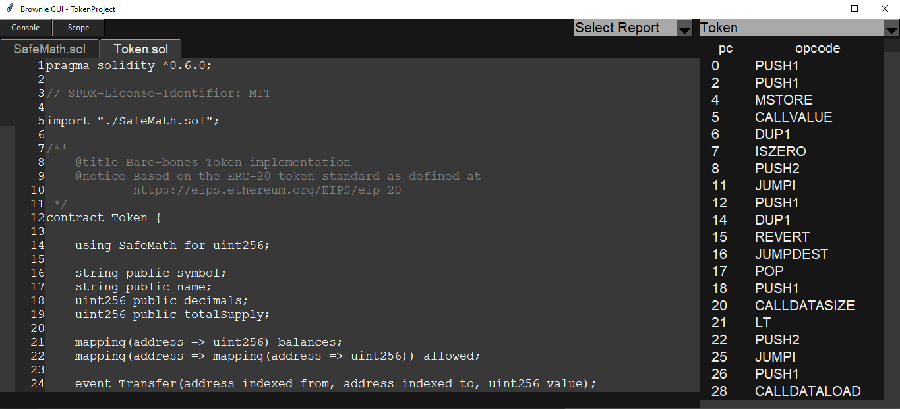
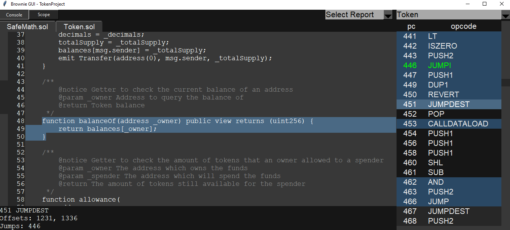
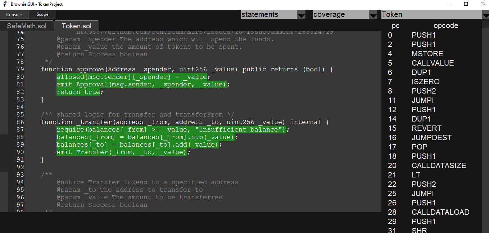

# Overview of the Brownie Tool

**Author:** [Alexey Kutsenko](https://github.com/bimkon144) 👨‍💻

[Brownie](https://eth-brownie.readthedocs.io/en/stable/index.html) is a Python-based smart contract development and testing framework focused on the Ethereum Virtual Machine.

Features:
- Full support for Solidity and Vyper
- Contracts are tested using [pytest](https://github.com/pytest-dev/pytest)
- A console is available for quick interaction with contracts
- Supports [ethPM](https://www.ethpm.com/) packages
- Property and state-based testing using the [hypothesis](https://github.com/HypothesisWorks/hypothesis/tree/master/hypothesis-python) library
- Built-in MythX security analysis tool for contracts

In this overview, we will look at how to initialize a project, the project structure, learn which library is used for writing tests, and how to debug during code testing.

_Important!_ Basic knowledge of [web3.py](https://web3py.readthedocs.io/en/stable/index.html) is required to work with Brownie.

## Installing Brownie

Before initializing a project, it must be installed according to the [documentation](https://eth-brownie.readthedocs.io/en/stable/install.html).

_Important!_ For the framework to work properly without errors, you need to install:
 - Python3 version 3.6 or higher, python3-dev
 - ganache-cli - tested with version 6.12.2

It should be mentioned that for the Brownie graphical interface to work, make sure the Tkinter library is installed. This can be done with the command ```python -m tkinter```. If for some reason it is not installed, you can read how to do it [here](https://tkdocs.com/tutorial/install.html).

## Initializing a Project

To initialize a new project, use ```brownie init```.
You can also use ready-made [templates](https://github.com/brownie-mix).
The command to initialize a project from templates is ```brownie bake nameOfRepo```.

## Project Structure

contracts/: 
The contracts themselves (code and libraries).

interfaces/: 
Contract interfaces.

scripts/: 
Python scripts.

tests/: 
Project tests.

build/: 
Information obtained as a result of building and deploying is stored here.

reports/: 
Reports in JSON format.

There is also a configuration file **brownie-config.yaml** — it can specify compiler options, data for connecting to a node, or testing parameters. Configuration options can be found [here](https://eth-brownie.readthedocs.io/en/stable/config.html).

## Brownie Commands

Main brownie commands:

 - `init` - initializes a new project
 - `bake` - initializes a project from a template
 - `pm` - installs and manages external packages
 - `compile` - compiles contracts
 - `console` - launches a console for interaction with the necessary network (local test environment or connection to mainnet/testnets)
 - `test` - runs all tests in the tests/ folder
 - `run` - executes a script in the scripts/ folder
 - `accounts` - allows managing accounts from which transactions will occur
 - `networks` - allows viewing, adding/removing networks
 - `gui` - launches a graphical interface that allows viewing test coverage and security reports, as well as contract opcodes
 - `analyze` - script for finding vulnerabilities in smart contracts through the MythX API tool

Let's discuss in more detail how the `pm` and `gui` commands work:

### pm
  - Brownie allows you to install other projects as packages, offering advantages like:
 - Easy import and development of code ideas written by others.
 - Reducing code duplication between projects.
 - Writing unit tests that check interactions between your project and another project.

You can use only GitHub repositories and [ethpm](https://www.ethpm.com/).

For more detailed information on how to install, manage packages and import them into tests, you can read [here](https://eth-brownie.readthedocs.io/en/stable/package-manager.html).

### gui

Brownie includes a graphical interface for viewing data on test coverage and analyzing the compiled bytecode of your contracts.

If you're not familiar with opcodes, I suggest you read this excellent [article](https://github.com/fullstack-development/blockchain-wiki/blob/b062e3a0b385c05120a898eda485a509d5d1745e/ehtereum-virtual-machine/evm-opcodes/README.md#L1).

_Important!_ If you have problems loading the gui, you probably haven't installed [Tkinter](#installing-brownie).

After entering the command `brownie gui`, a graphical interface will launch where you can select a contract. Then, tabs for all contracts and libraries imported into your contract will appear. In addition, on the right column, there will be opcodes and program counters.



Additionally, you can highlight sections of the code and view corresponding opcodes.



To generate a test coverage report, you need to call the command `brownie test --coverage`.

Afterwards, in the graphical interface, you can select the report (Report) and specify the mode - branches or statements.

Below is an image showing how test coverage appeared in our graphical interface:



You can read more in detail [here](https://eth-brownie.readthedocs.io/en/stable/gui.html).

## Testing

To run tests, use the command `brownie test`.

When writing tests, it's important to focus on key functions:
- [Fixtures](https://docs.pytest.org/en/latest/explanation/fixtures.html) (a function applied to one or several test functions, called before each test execution)
- [Markers](https://docs.pytest.org/en/stable/how-to/mark.html#mark) (a decorator applied to a test function. For example, you can specify that a test should run only when launched in a certain network)
- [Parametrizing Tests](https://docs.pytest.org/en/latest/how-to/parametrize.html) (essentially the same as the marker mentioned above, but it allows specifying function arguments as an array. You can set several sets of arguments, and the function will be called multiple times with different arguments)

It's also worth noting that you can install a package using the `pm` command, after which it can be imported via fixtures and deploy a specific contract. This way, you can test the interaction of your project with other projects.

### Property-Based Testing

Property-based testing is a powerful tool for identifying edge cases and detecting erroneous assumptions in your code.

The main concept of property-based testing is that instead of writing a test for one scenario, you write tests that describe a range of scenarios, and then let your computer explore the possibilities for you, instead of writing each one manually.

The process consists of steps:

- Choose a function in your smart contract you want to test.
- Specify a range of input data for this function that should always produce the same result.
- Call the function with random data from your specification.
- Conduct a test result check.

Using this method, each test runs many times with different random data. If a case is found where the test fails, an attempt is made to find the simplest possible case that still causes the problem. This example is saved in a database and repeated in each subsequent test to ensure that once the problem is fixed, it stays fixed.

This way, you can test necessary functions with a range of arguments, find vulnerabilities, and fix them. You can read more about setting up such tests [here](https://eth-brownie.readthedocs.io/en/stable/tests-hypothesis-property.html#what-is-property-based-testing).

### Stateful Testing 

Stateful testing is an advanced property-based testing method used for testing complex systems. It uses [Hypothesis](https://github.com/HypothesisWorks/hypothesis).

Hypothesis is a library for Python, used for automatic "property-based testing". Unlike the traditional approach to testing, where tests are manually written for specific input data and expected results, Hypothesis automatically generates test cases.

In Hypothesis, you define "properties" that your code should satisfy, and the library attempts to "disprove" these properties by generating various input data. If the library finds input data that leads to a property violation, it reports this, providing an example that causes the error. This allows developers to discover and fix potential problems and edge cases in their code that they might not have suspected when manually writing tests.

Hypothesis is particularly useful for testing functions with a wide range of possible inputs and finding rare but critical cases that can lead to program failures or errors.

_Important!_ This feature is still in development and is considered experimental.

You can learn more [here](https://eth-brownie.readthedocs.io/en/stable/tests-hypothesis-stateful.html).

### Security Analysis with MythX

Brownie integrates the [MythX](https://mythx.io/) analysis tool, which allows for automated security checks of your project.

MythX offers both free and paid services.

First, you need to register at [MythX](https://dashboard.mythx.io/registration#/) and obtain an API key. After that, you need to specify this key using the command `export MYTHX_API_KEY=YourToken` or through the flag `brownie analyze --api-key=<string>`.

Next, to start the scanning, you can use the built-in command `brownie analyze`.

To view the result in the graphical interface immediately after scanning, use the command `brownie analyze --gui`.

More details on how scanning works are explained [here](https://consensys.io/diligence/blog/2019/11/mythx-pro-security-analysis-explained/#more-37).

## Using External Tools with Brownie

- Brownie supports the popular Hardhat framework.

    To use it, install it using the command `npm install --save-dev hardhat`.

    Now, when we want to use the local hardhat network, we can use the command `--network hardhat`. For example, launch the console with `brownie console --network hardhat`.

- Brownie supports the very fast local network [Anvil](https://github.com/foundry-rs/foundry/tree/master/crates/anvil), which is a tool of the [Foundry](https://book.getfoundry.sh/) framework.
    See how to install it [here](https://github.com/foundry-rs/foundry/tree/master/crates/anvil).
    After installation, we can use this network `--network anvil`.

## Links:

- [Docs: Brownie](https://eth-brownie.readthedocs.io/en/stable/index.html)
- [Docs: hypothesis](https://hypothesis.works/)
- [Docs: stateful testing](https://hypothesis.works/articles/rule-based-stateful-testing/)
- [Article: stateful testing article](https://hypothesis.works/articles/how-not-to-die-hard-with-hypothesis/)

