# Smart Contract Automation

**Author:** [Alexey Kutsenko](https://github.com/bimkon144) 👨‍💻

## Introduction

Smart contracts have evolved from simple blockchain token management to hybrid forms using external data and off-chain computations. Developers then started using oracle networks to create hybrid smart contracts that use external data and off-chain computations in blockchain applications to open up new markets such as DeFi, dynamic NFTs, and GameFi. Now, additional infrastructure - smart contract automation - is coming to the forefront.

In this article, we will explore smart contract automation and the opportunities it opens up, as well as review popular automation tools.

## The Problem with Smart Contract Automation

Smart contracts are code deployed on a blockchain that is triggered and executes predefined conditions only when it receives an incoming transaction. This ensures controlled and deterministic execution of the conditions embedded in the contract code. An external transaction acts as a "kick" that activates the smart contract and initiates its logic, similar to how pressing a button can turn on the light.

This is illustrated in the image below:
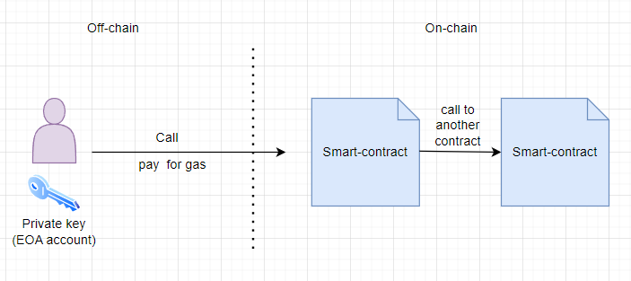

Thus, to change something in the blockchain, a transaction signed with a private key is required. The private key is usually associated with a specific user and account (EOA) in the blockchain network.
This is the main reason why functions on smart contracts cannot just be called. Moreover, a single private key is not enough, as this account must also pay for the gas in the native currency of the blockchain. The amount of gas will depend on the number and complexity of operations performed in the blockchain. All collected gas goes to the validators, who receive it as a reward for adding the transaction to the block.

## Solutions

One option for automating smart contract calls could be the use of [cron](https://timeweb.com/ru/community/articles/chto-takoe-cron) tasks, implemented on a centralized server. This is much simpler than using manual transaction execution, where a team monitors the state of the smart contract and initiates calls on the smart contract themselves. In this approach, the automation node becomes a centralized point of failure, creating a risk of untimely execution of smart contract functions (such as downtime or delays). Smart contracts that do not execute when necessary can lead to asymmetric exploits and missed opportunities, such as trading slippage, insolvency of the protocol, and loss of user funds.

Ultimately, smart contracts should be fully decentralized, including autonomous automation infrastructure responsible for their execution.

Another solution is decentralized smart contract automation, which allows developers to automatically trigger smart contract functions without worrying about a single point of failure.

## When Is Automatic Execution of Smart Contracts Necessary?

There are many situations where smart contracts need to perform operations on the network to ensure the functioning and utility of the protocol, without direct user intervention to activate them.

Let's consider the most interesting ones:

- [Yield Harvesting and Compounding](https://chain.link/education-hub/what-is-yield-farming). Used in protocols that reward users for providing liquidity. For example, the Beefy protocol uses automation to call the harvest() function in smart contracts to collect rewards when there is a certain profit, exchange them for the necessary token, and reinvest according to the required strategy. Thus, investors provide liquidity once, and the protocol itself organizes the collection of rewards and reinvestment.

- Liquidations in lending protocols. For example, Aave, a DeFi protocol, allows users to borrow and lend crypto assets. If it turns out that a user's loan is under-collateralized, part of the loan must be liquidated. Thus, liquidators can set up automatic checks on the state of user loans and necessary liquidations, helping to ensure that positions remain solvent even during periods of high market volatility and network congestion. Automation will monitor the state of user loans off-chain.

- [Pickle Finance](https://www.pickle.finance/). The protocol uses automation to manage LP positions in Uniswap v3. Helps rebalance user LP into the necessary price range of the pool to maximize returns.

- DEX Limit Orders. Thanks to automation, users no longer need to monitor the price of assets for buying or selling. This allows the use of limit orders in DEXs, which automatically trigger at a certain price.

- Automated vesting. Helps fully automate the token distribution process, making this process even more decentralized.

- Automation of DAOs (Decentralized Autonomous Organizations). An example of using automation could be distributing tokens as rewards, paying salaries, automatically executing a task after a vote is completed, and other necessary automations.

## Popular Automation Tools

Let's briefly go through popular smart contract automation tools and learn about the capabilities of each.

### Gelato Networks

[Gelato Network](https://www.gelato.network/) is a web3 service that acts as a Decentralized Cloud Platform. The main goal of the protocol is to solve the problems of unreliability, scalability, and centralization surrounding web3 applications that want to augment their smart contracts with off-chain automation capabilities, to overcome limitations imposed on them by current EVM-based blockchains.

Gelato addresses these issues by providing decentralized cloud services that allow developers to automate their smart contracts, gas-free and off-chain.

#### Smart Contract Automation

Web3 Functions are used to address automation tasks.

- **Web3 Functions**: A powerful automation system designed to optimize and improve Web3 operations. Web3 Functions serve as a comprehensive tool that enables developers to easily customize, manage, and automate their smart contract tasks.

Gelato Network essentially consists of two sides. On one side, developers offer transaction automation for their users, and on the other, infrastructure operators run executor bots that search for tasks to perform and are ready to execute future transactions as directed by users for a small [fee](https://docs.gelato.network/web3-services/web3-functions/subscription-and-payments).

A unique feature of Gelato is its ability to connect smart contracts with off-chain data. This is achieved through [Web3 Functions](https://app.gelato.network/functions), which allow developers to perform blockchain transactions based on information stored outside the blockchain, such as API data or subgraphs. These functions are written in TypeScript and stored in a decentralized system like IPFS, and are executed by the Gelato network. Currently, this feature is in private beta.

Automation can be easily set up through a [UI interface](https://app.gelato.network/functions), [smart contract](https://docs.gelato.network/developer-services/web3-functions/understanding-web3-functions/create-a-web3-function-task/using-a-smart-contract), or [Automate SDK](https://docs.gelato.network/developer-services/web3-functions/understanding-web3-functions/create-a-web3-function-task/using-the-automate-sdk).

Let's consider the possible triggers for automation that the protocol can offer, as exemplified by the UI interface.

**Trigger** - a condition that, when met, initiates the automatic execution of a smart contract function.

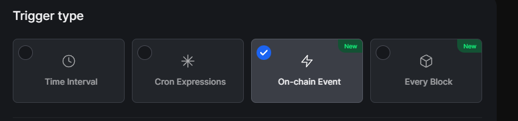

- Time interval (e.g., every 10 minutes).
- Cron expressions (schedule tasks at specific times, e.g., every Tuesday at 18:00).
- On-chain event (triggers the task after a certain event in the blockchain).
- Every Block (occurs every block in the blockchain).

The list of what can be triggered:
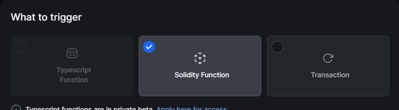

- TypeScript function (decentralized cloud functions. They allow developers to perform on-chain transactions based on arbitrary off-chain data (API/subgraphs, etc.) and computations. These functions are written in TypeScript, stored in IPFS, and executed by Gelato).
- Solidity function (part of the logic written in Solidity that determines whether certain conditions are met to execute a task, after which a call is made on the required smart contract).
- Transaction (calls a specific smart contract function with given parameters).

After creating a smart contract automation task, you can monitor execution statistics through the [UI interface](https://docs.gelato.network/developer-services/web3-functions/analytics-and-monitoring).

Ready-made templates and usage examples can be found [here](https://docs.gelato.network/developer-services/web3-functions/template-and-use-cases).

#### Payment 

When using the Gelato service, you need to pay for:
 - Gas costs for your executed transactions (or those of your end-users if you sponsor them via the relay service).
 - Service fee - subscription to Gelato or a % added to the cost of gas for each transaction.

For such purposes, the [1Balance](https://app.gelato.network/1balance) service was created.

The main advantage of this service is that it allows you to easily pay all expenses in one currency and across all networks. (You need to deposit USDC tokens on the Polygon network).

Additionally, using this service allows you to set up notifications about balance replenishments for payments in Telegram, Discord, or email. More details about subscription plans can be read [here](https://app.gelato.network/1balance/subscriptions/functions). However, if you require the transaction to pay for itself, this can be implemented through the UI interface or through a [smart contract](https://docs.gelato.network/web3-services/web3-functions/subscription-and-payments#transaction-pays-for-itself).

#### Conclusions

Gelato Network is an important tool in the blockchain ecosystem, offering solutions for automating smart contracts, making it a valuable tool for developers of decentralized applications (DApps). The benefits of Gelato include its ability to decentralize reliable and efficient transaction execution, improve user experience through automation of tasks, reduce operational and management costs, and provide flexibility in integration with various blockchains. These qualities make Gelato Network a key component in creating more efficient, accessible, and scalable DApps, fostering further development and innovations in blockchain technologies.

You can view the supported networks of the protocol [here](https://docs.gelato.network/developer-services/web3-functions/supported-networks).

Gelato Networks integrations and clients can be seen [here](https://gelato-network.notion.site/Gelato-Ecosystem-6706d2a6134d485995484f6ce77dfddb).

### Chainlink

[Chainlink](https://chain.link/) offers a wide range of products, each strengthening the blockchain and Web3 infrastructure by providing developers and enterprises with reliable tools for creating decentralized applications and services.

#### Smart Contract Automation

**Chainlink Automation** uses a network of reliable, decentralized nodes (called Keepers) to ensure the reliable and secure execution of automated tasks (jobs, tasks).

Developers can register their tasks (Upkeeps), and node owners, so-called operators, can register in the automation registry as Automation Nodes.

Below you can see the automation architecture:

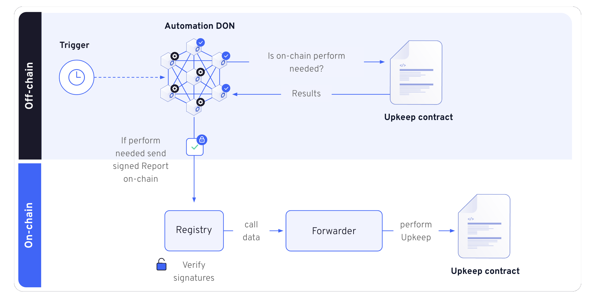

For a better understanding, you can view an animation of how automation works.

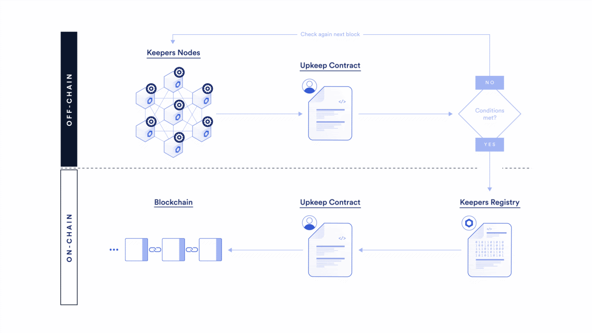

1. **Chainlink Nodes (Automation DON)**: They are part of a decentralized network and constantly interact with each other via the [OCR3](https://docs.chain.link/architecture-overview/off-chain-reporting#what-is-ocr) protocol to achieve action consensus.

2. **Registry**: Nodes use the registry to identify a list of Upkeep contracts that need servicing. The registry contains information about each Upkeep contract and the conditions under which they should be activated.

3. **`checkUpkeep` function**: This function is inside each Upkeep contract and determines whether the contract requires maintenance. Nodes locally simulate the call of this function to check if maintenance is needed.

4. **Consensus and Signed Report**: When nodes agree on the results of the `checkUpkeep` call, they create and sign a report. This report contains data that will be used when calling the `performUpkeep` function on the blockchain.

5. **Report Validation**: The signed report is validated in the registry, ensuring that it has been agreed upon and signed by all nodes, and provides data (`performData`) for execution on the blockchain.

6. **Performing Upkeep (`performUpkeep`)**: After validation, the data from the report is used to call the `performUpkeep` function in the Upkeep contract, which performs the planned actions.

7. **Fail-Safe**: The system is designed to operate even if some nodes fail, ensuring the continuity of Upkeep services.

Chainlink Automation allows automating the execution of smart contract tasks on the blockchain while ensuring a high level of decentralization and security through consensus mechanisms and cryptographic validation. For more understanding, I suggest looking at an example of an upkeep contract that contains `checkUpkeep` and `performUpkeep` functions [here](https://docs.chain.link/chainlink-automation/guides/compatible-contracts).

Automation (registration of upkeep contract) can be set up either through the [UI interface](https://automation.chain.link/mumbai/new) or through [smart contracts](https://docs.chain.link/chainlink-automation/guides/register-upkeep-in-contract).

Triggers for smart contract automation:

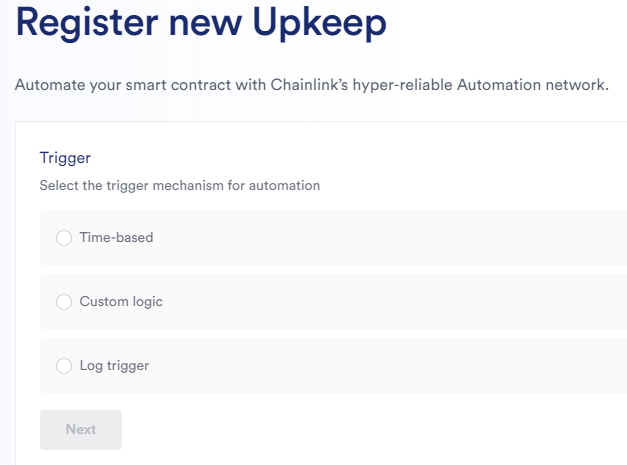

- [Time-based trigger](https://docs.chain.link/chainlink-automation/guides/job-scheduler) - automates a function according to a specified schedule or time interval. Can be implemented directly in the UI interface, without the need to implement logic in the smart contract.
- [Custom logic](https://docs.chain.link/chainlink-automation/guides/register-upkeep) - allows using necessary logic to determine when exactly to call the functions of your contract. The Contract for logic verification must inherit from [AutomationCompatibleInterface](https://github.com/smartcontractkit/chainlink/blob/develop/contracts/src/v0.8/automation/interfaces/AutomationCompatibleInterface.sol) and implement two necessary functions - checkUpkeep, to verify the need to start automation, and performUpkeep, which will perform the necessary automation.
- [Log trigger](https://docs.chain.link/chainlink-automation/guides/log-trigger) - the trigger allows you to monitor events in the contract you need and perform the necessary logic.

You can view examples of task solution variants [here](https://dev.chain.link/resources/quickstarts?product=Automation).

After creating an automation task, you will have a list of created upkeeps (tasks for automation).

#### Payment

Chainlink Automation requires a fee for executing transactions on the blockchain and a percentage as compensation for the work of node operators. Thus, the fee includes the cost of transactions plus minor fixed overhead costs for gas between the network and the Registry, and payment to the node operator.

The payment requires the LINK token, created by Chainlink. To enable your upKeep, you must transfer it to the upKeeper Contract. You can read more about this [here](https://docs.chain.link/chainlink-automation/overview/automation-economics).

#### Conclusions

Chainlink is an extremely important decentralized and secure automation tool for your smart contracts.

Currently, the company is developing and introducing many other products, such as Data Streams, VRF, and others, which aid in the development of Dapps and blockchain solutions in general. The documentation is well-written and includes all necessary examples.

You can view the currently supported blockchains [here](https://docs.chain.link/chainlink-automation/overview/supported-networks#overview).

If you want to become a node operator and receive compensation for your work or be a data provider, you can refer to their [ecosystem](https://chain.link/ecosystem).

### OpenZeppelin Defender

OpenZeppelin Defender is a web application from the renowned organization [OpenZeppelin](https://www.openzeppelin.com/) that allows developers to verify code, deploy/upgrade, monitor smart contracts, and safely manage and automate smart contract operations.

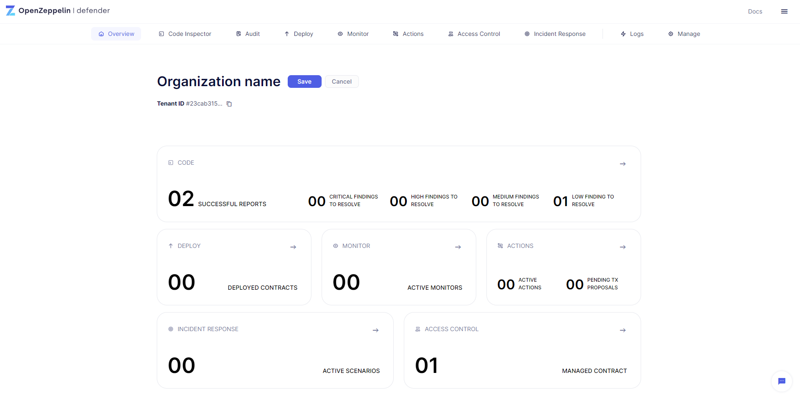

#### Smart Contract Automation

Below, we will consider the components that allow for the automation of smart contracts:

**Monitor** — tracks events, functions, and transactions of your smart contract and enables you to receive notifications via email and set up automatic response scenarios.

The capabilities of this component are important both for responding to events in the smart contract and for preventing potential failures or attacks.

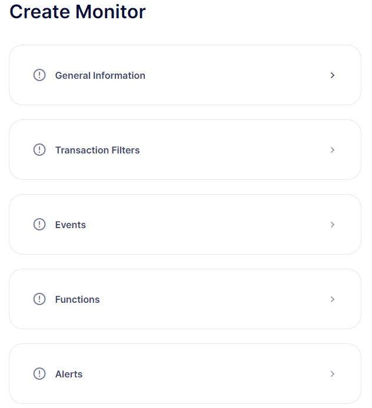

Capabilities:

- Monitor significant events and authorized functions, such as the transfer of ownership of a smart contract, pause, or mint.
- Notification of potentially dangerous transactions or operational issues.
- Integration of notifications into Slack, Telegram, Discord, email, PagerDuty, Opsgenie, or custom APIs.
- Use of pre-set templates, such as Upgrade Monitor, Ownership Changes, Multisig Monitor, and others.
- Use in conjunction with other Defender 2.0 components to automatically perform transactions when certain events occur on the smart contract.

Using this tool, you can set up smart contract monitoring in such a way that suspicious events on the smart contract automatically lock the smart contract and trigger an alert about a dangerous situation. More details on how to create and set up smart contract monitoring can be found [here](https://docs.openzeppelin.com/defender/v2/tutorial/monitor.html).

**Actions** — create automated actions for performing on/off-chain operations. Allows you to configure predefined response scenarios to incidents, triggered automatically by monitors or on demand.

This is the main component for building smart contract execution automation through a user-friendly interface.

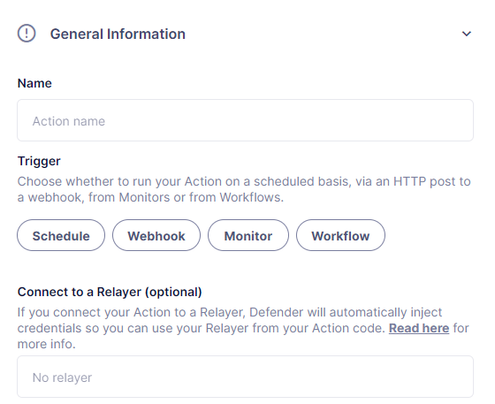
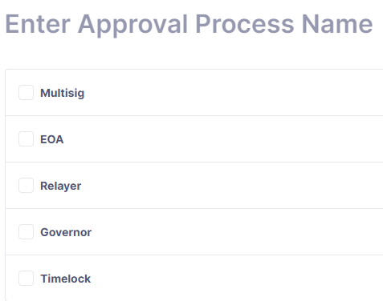

Actions can be used to:

- Create transition proposals specifying the type of approvals required for transaction execution. (The wrapper for transactions can be one of the available options: Multisig, EOA of a single wallet, Relayer - an internal wallet of defender necessary for transactions, Governor contract on which a proposal will be created, timelock controller address)
- Automate smart contracts with conditions: schedule, webhook, [monitor](#monitor), workflow (a group of several actions, for example, you can make a scenario - pause the contract and withdraw funds).

JavaScript code is used as instructions for sending transactions, as shown in the picture.

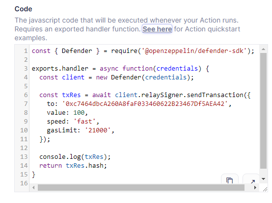

#### Payment

Currently, the tool is free, but conducting an audit is a paid procedure.

#### Conclusions

OpenZeppelin Defender allows teams to enhance smart contract security, check for vulnerabilities, conduct audits, manage, automate smart contracts, and timely automatically respond to hacking threats.

The project ensures the security of the smart contract both during its development and operation.

Integrations with popular frameworks [Hardhat](https://hardhat.org/) and [Foundry](https://book.getfoundry.sh/getting-started/installation) are possible. Other possible integrations can be viewed [here](https://docs.openzeppelin.com/defender/v2/integrations).

Networks in which it operates can be viewed [here](https://docs.openzeppelin.com/defender/v2/#networks).

### Keep3r Network

[Keep3r Network](https://keep3r.network/) is a decentralized platform developed by [Andre Cronje](https://en.wikipedia.org/wiki/Andre_Cronje), known in the DeFi space for his work on Yearn Finance.

The main goal of the Keep3r Network is to connect projects that require specialized services (Jobs) with so-called "Keepers" - individuals or teams that can perform these services.

Thus, the Keep3r Network allows projects to post their job needs, and Keepers can accept these jobs, perform tasks, and receive rewards.

Rewards are paid in ETH, tokens, or the native cryptocurrency KP3R (Keep3r Network token). This incentivizes Keepers to perform quality work, and projects to provide fair compensation.

Both jobs and keepers must be registered to be able to carry out their tasks.

#### Smart Contract Automation

In general, everything is very similar to previous projects. You [register](https://keep3r.network/) a `job` and implement a special [interface](https://docs.keep3r.network/core/jobs#simple-keeper) in the smart contract, which defines the conditions for calling and the logic to be executed.

Job registration:

1) Registration through the website UI interface

Through the protocol interface, you can register a smart contract job in the protocol.

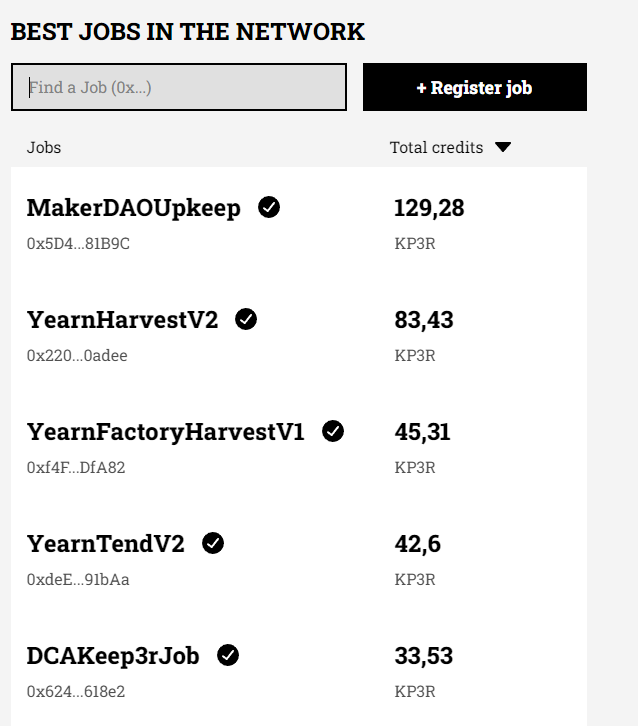

In the image above, you see the public list of jobs requiring automation and the number of KP3R credits attached for payment.

To have your registered job appear on the site in this list, you will need to send a pull request to [this](https://github.com/keep3r-network/web-v2/blob/main/utils/registry.tsx) repository.

2) Registration through a smart contract - you can use the smart contract method - [addJob](https://docs.keep3r.network/core/jobs#adding-jobs)

#### Payment

Ways to pay for Jobs (automation tasks):

1) Credit Mining
   This mechanism pays keepers with revenue accumulated in the pool (keep3r Liquidity Pool - kLP), where users provide liquidity.

   It works as follows:

   - Users provide liquidity in the KP3R and WETH pool, e.g., Keep3rLP - KP3R/WETH, and receive kLP tokens in return.
   - LP tokens are staked through [addLiquidityToJob](https://github.com/keep3r-network/keep3r-network-v2/blob/956dad62b359a43ca047a8895d6e6a21aa24fddc/solidity/contracts/peripherals/jobs/Keep3rJobFundableLiquidity.sol#L178) and KP3R credits begin accruing to the job contract address. This way, Keepers can receive compensation for completed work, and the Job creator does not have to worry about constantly replenishing the balance for automation. More details about how it works can be read [here](https://docs.keep3r.network/tokenomics/job-payment-mechanisms/credit-mining).

2) Token Payments

   Allows paying keepers in ERC-20 tokens.

   To do this, you need to:
   - Top up the Job balance via [addTokenCreditsToJob](https://github.com/keep3r-network/keep3r-network-v2/blob/956dad62b359a43ca047a8895d6e6a21aa24fddc/solidity/contracts/peripherals/jobs/Keep3rJobFundableCredits.sol#L25).

   _Important!_ The only way to add KP3R credits to a Job is through [Credit Mining](https://docs.keep3r.network/tokenomics/job-payment-mechanisms/credit-mining). Attempting to add KP3R tokens via `addTokenCreditsToJob` will result in the transaction being reverted.

   There is also an [auto-pay](https://docs.keep3r.network/core/jobs#auto-pay) feature, which allows for automatically calculating the required payment for automation.

#### Conclusions

A fully decentralized protocol that allows anyone to start automating their smart contracts or help in performing such tasks.

It should be noted that the information necessary to use the protocol is sufficiently documented. However, there are no guides and training that could help novice developers.

The most significant advantage of the protocol is the ability to pay for jobs through income earned from the liquidity pool, thus allowing you to provide liquidity once and not pay in the future.

Available on networks: Ethereum, Optimism, Polygon, and Optimism Goerli.

## Conclusion

The research results can be presented in a comparative table:
| Category | Criterion | Gelato Networks | Chainlink Automation | Openzeppelin Defender | Keep3r Network |
|:---------|:---------|:---------------:|:--------------------:|:---------------------:|:--------------:|
| **Learning** | Documentation | ✅ Clear documentation with examples | ✅ Clear documentation with examples | ✅ Clear documentation with examples | ❓ Documentation is available, but lacks guides and training |
|  | Support and Communication | ✅ Discord, Telegram, and others | ✅ Discord, Telegram, Reddit, and others | ✅ Discord, forum, and others | ✅ Discord, Twitter, and others |
| **Setup and Testing** | Launch Options | ✅ Via UI, smart contracts, SDK | ✅ Via UI, smart contracts | ✅ Via UI | ✅ Via UI, smart contract |
|  | Testing | ✅ Testnets available | ✅ Testnets available | ✅ Testnets available | ❌ Not available in testnets |
| **Features** | Decentralized Execution | ✅ To become an automated node operator, you must stake at least 150k GEL token| ✅ Those interested can become operators of automated nodes | ❌ Centralized operations | ✅ Fully decentralized protocol |
|  | Payment and Fees | ✅ Payments can be made by the transaction itself, through the general service wallet 1Balance or a paid subscription. Nodes charge a commission as a percentage of the total gas cost for each transaction. No additional fees to the protocol. | ✅ Transactions must be paid for with LINK tokens on your UpKeep contract. No additional protocol fees | ✅ No project commission. For payment transactions, a Relayer address is created which must be topped up with native currency | ✅ Documentation lacks information on commission calculation, including payment to keepers for job completion. There is an option to pay in KP3R token, ERC-20, ETH. Possible to pay once and forget - stake KP3R tokens into the liquidity pool |
|  | User Notification | ✅ Telegram, Discord, email notifications about low wallet balance | ✅ Telegram, Discord, notification about low wallet balance | ✅ Telegram, Discord, email, webhooks notification about low wallet balance | ❌ Implementation is not available |
|  | Protection Against Front Running | ✅ Private channel with proprietary flash bot miners | ❌ Information not available | ❌ Information not available | ❌ Information not available |
| **UI** | Dashboard | ✅ Monitoring, task management | ✅ Monitoring, task management | ✅ Convenient management of automation tasks through the dashboard | ❓ You can add a job via UI, but it only appears after a pull request on GitHub |

Smart contract automation plays a key role in the development and expansion of blockchain technology capabilities. It not only reduces the need for manual intervention, which lowers the risk of hacks and errors, but also opens new horizons for innovation in decentralized application development.

Automation improves the user experience, making interaction with the blockchain more intuitive and accessible. Moreover, it contributes to the creation of more complex and functional systems that can serve as the foundation for a new generation of decentralized services.

It is crucial that the development and implementation of automated smart contracts go hand in hand with ensuring their security and decentralization at all stages, including external infrastructure responsible for their activation. This will ensure the long-term success and sustainability of the blockchain ecosystem, fostering its expansion and integration into a wide range of industries.

Each protocol has its strengths and weaknesses. Choose the protocol based on the needs of your project.

## Links:

- [Docs: Gelato Network](https://docs.gelato.network/introduction/gelato-the-web3-cloud-platform)
- [Docs: Chainlink Automation](https://docs.chain.link/chainlink-automation)
- [Docs: Openzeppelin Defender](https://docs.openzeppelin.com/defender/v2/)
- [Docs: Keep3r Network](https://docs.keep3r.network/)
- [Article: Smart Contract Use Cases](https://chain.link/education-hub/smart-contract-automation)
- [KP3R Token Supply Info](https://dune.com/nesk/keep3r-network)
- [Keep3r Network GitHub](https://github.com/keep3r-network)

