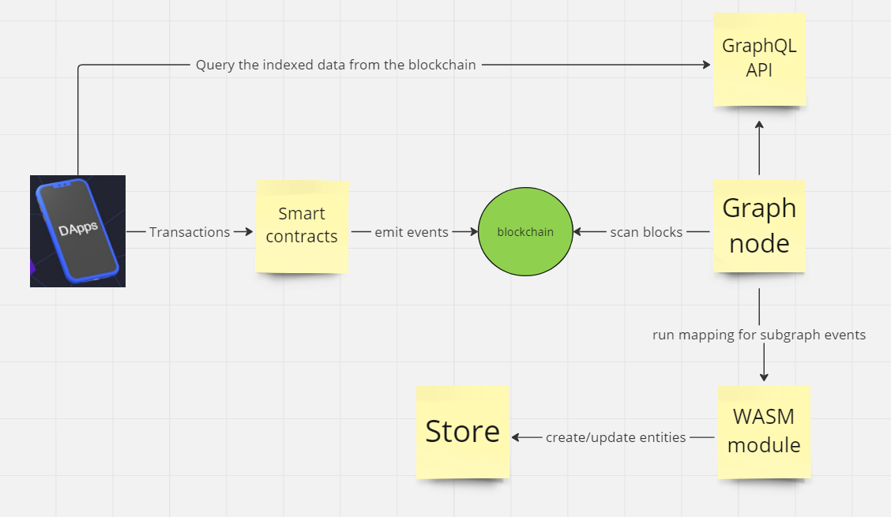
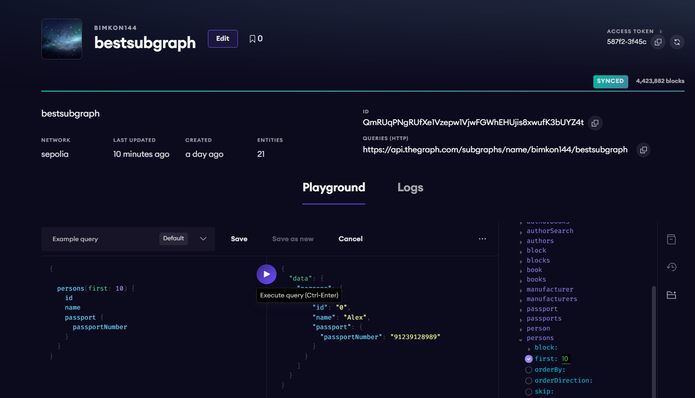

# The Graph

**Author:** [Aleksei Kutsenko](https://github.com/bimkon144) 👨‍💻

## What is The Graph?

**The Graph** is a decentralized protocol for indexing and querying blockchain data. The Graph allows for querying data that is difficult to directly request from the contract.

**Indexing** is the process of organizing and processing blockchain data in such a way that it can be quickly and efficiently queried. This is similar to how search engines index web pages to provide quick responses to user search queries.

For example, projects with complex smart contracts, such as Uniswap, and NFTs, such as Bored Ape Yacht Club, store data on the blockchain, which makes it very difficult to read anything other than basic data directly from the blockchain.

In the case of NFT Bored Ape Yacht Club, we can perform basic contract reading operations, such as getting the owner of a specific token id, getting content URI based on token id, or totalSupply, since these functions are written in the smart contract. More complex queries and real-world operations such as aggregation, search, relationships, and non-trivial filtering are impossible.

For example, if we wanted to query the ids of tokens belonging to a certain address and filter by one of its characteristics, we would not be able to get this information by interacting directly with the contract itself.

To get this data, you would have to process every `transfer` event ever created, read metadata from IPFS using token id and IPFS hash, and then aggregate them. Even for such relatively simple questions, a decentralized application (dapp) running in a browser would take hours or even days to get a response.

You can also create your own server, process transactions there, store them in a database, and create an API endpoint on top of all this to query data. However, this option is [resource-intensive](https://thegraph.com/docs/en/network/benefits/), requires maintenance, represents a single point of failure, and compromises important security properties necessary for decentralization.

Indexing blockchain data is very and very difficult.
Blockchain properties such as finality, chain reorganization, or orphaned blocks further complicate this process and make it not only labor-intensive but also conceptually difficult to get the correct query results from blockchain data.

The Graph solves this problem with a decentralized protocol that indexes and ensures an efficient process of obtaining data from the blockchain with subsequent structuring and providing an external API to work with these data"

Today there is a [hosted service](https://thegraph.com/docs/en/deploying/hosted-service/) that allows you to deploy subgraphs for free, without using the decentralized network, as well as a decentralized protocol with the same capabilities. Both are supported by the open-source implementation of [Graph Node](https://github.com/graphprotocol/graph-node).

>Important: Note that in 2023, the hosting service will begin to shut down, but it will remain available for networks not supported in the decentralized network. Developers are advised to upgrade their subgraphs to The Graph Network. Hosting services in each network will be phased out gradually, so developers have enough time to upgrade subgraphs to the decentralized network. More about the termination of the hosted service can be read [here](https://thegraph.com/blog/sunsetting-hosted-service/).

## How does it work?

The Graph indexes blockchain data based on descriptions of subgraphs known as a subgraph manifest.

After writing a subgraph manifest, you use the Graph CLI to save the description in IPFS and instruct the indexer to start indexing data for this subgraph.


**Let's break down the order of work with subgraphs:**

- A decentralized application adds data to the blockchain through transactions when interacting with a smart contract.
- The smart contract generates one or more events when processing the transaction.
- Graph Node constantly scans the blockchain for new blocks and data for your subgraph that they may contain.
- Graph Node finds blockchain events for your subgraph in these blocks and runs the mapping handlers you provided. The handler is a WASM module that creates or updates data objects that Graph Node stores in response to blockchain events.
- The decentralized application requests data from Graph Node, indexed from the blockchain, using [node's GraphQL endpoint](https://graphql.org/learn/). Graph Node, in turn, converts GraphQL queries into queries to its underlying data store to get this data, using the indexing capabilities of the store. The decentralized application displays these data in the user interface for end users, who use them to create new transactions in the blockchain. The cycle repeats.

## Creating a Subgraph

In this section, we'll delve into three key elements in creating a subgraph.

We'll look at creating the main components of a subgraph using a simple contract deployed on the [Sepolia](https://sepolia.etherscan.io/address/0x90d092977ad098E1E0382fbD5Cc2D07D458369f3#code) network.

First, I recommend registering and creating your subgraph [here](https://thegraph.com/hosted-service/dashboard). When initializing, select the Ethereum type, the Sepolia network, and the hosted-service type, then enter the contract address. An automatic project initialization will be performed.

A subgraph definition consists of several files:

 - **subgraph.yaml**: A YAML file that contains the subgraph manifest. It specifies information necessary for indexing and querying a particular subgraph.
 - **schema.graphql**: A GraphQL schema that defines what data is stored for your subgraph and how to query it through GraphQL.
 - **AssemblyScript Mappings**: [AssemblyScript](https://github.com/AssemblyScript/assemblyscript) code that transforms data from events into entities defined in the schema.graphql file.

> Glossary for the article:
**Entity** - a part of the subgraph schema by which we define how to write, store, and retrieve these data upon request.
Mapping - An `assemblyScript` file where all the functions are written that process whether it's an event trigger, function call, block, and update/create a new entity in the subgraph schema.

### **1. Defining subgraph.yaml**

Any data format that has a clearly defined mapping with the canonical [IPLD](https://github.com/ipld/ipld) format can be used to define a subgraph manifest. This includes YAML and JSON.
The subgraph manifest and all associated files are what is deployed to IPFS and hashed to create a subgraph identifier, which can be referenced and used to retrieve the subgraph in The Graph.

Examples in this document are provided in YAML format.

The very first step is to define the subgraph manifest using YAML syntax. The full subgraph manifest specification can be viewed [here](https://github.com/graphprotocol/graph-node/blob/master/docs/subgraph-manifest.md).

We can look at the generated file and understand it:

```javascript
specVersion: 0.0.5
// A human-readable description of what the subgraph represents.
// This description is displayed in Graph Explorer when deploying the subgraph to the hosted service.
description: Wiki
// The URL of the repository where the subgraph manifest can be found. This is also displayed
в Graph Explorer
repository: https://github.com/graphprotocol/graph-tooling
// Path to the subgraph schema
schema:
  file: ./schema.graphql
// New subgraph features that are already available are declared here. More details will be provided later.

features:
  - fullTextSearch
// Specify the source in the form of the network, name, address, and ABI of the contract
dataSources:
  - kind: ethereum
    name: Wiki
    network: sepolia
    source:
      address: "0x90d092977ad098E1E0382fbD5Cc2D07D458369f3"
      abi: Wiki
// This is an optional parameter that allows you to specify from which block the indexing will start.
// Setting the start block allows the data source to potentially skip millions of unnecessary blocks.
// Typically, the subgraph developer sets the startBlock to the block in which the smart contract was created.

      startBlock: 4423006 // Here, the contract deployment block should be automatically set, if not, specify the block of contract creation.
// The section that describes the schema entities, contract ABIs, and all types of handlers processed by the contract.
    mapping:
      kind: ethereum/events
      apiVersion: 0.0.6
      language: wasm/assemblyscript
// Entities that the data source writes to the store. These entities were generated automatically; we will need to change them ourselves according to the entities we create later.
      entities:
        - NewBook
        - NewPerson
        - NewProduct
        - NewWiki
// List of ABIs for all smart contracts that we will interact with when writing mappings

      abis:
        - name: Wiki
          file: ./abis/Wiki.json
// Lists the smart contract events that the subgraph responds to, and the handlers that transform these events into entities according to the subgraph schema. They should automatically be pulled from the contract, or you may need to write them yourself.
      eventHandlers:
        - event: NewBook(uint256,string,string)
          handler: handleNewBook
        - event: NewPerson(uint256,string,string)
          handler: handleNewPerson
        - event: NewProduct(string,uint256,string)
          handler: handleNewProduct
        - event: NewWiki(uint256,address,string,string)
          handler: handleNewWiki
// Lists the smart contract functions that the subgraph responds to, and the handlers,
// Which transform the input and output data when calling a function into entities in the schema. For example, let's take the function
createWiki
      callHandlers:
        - function: createWiki(string,string)
          handler: handleCreateWiki
// Lists the blocks that the subgraph responds to, and the handlers in the mappings that
// Are executed when a block is added to the chain. Without a filter, the block handler will run in every block.
// An additional call filter can be provided by adding a filter field with kind: call to the handler.
// The handler will only be triggered if the block contains at least one call to the data source contract.
      blockHandlers:
        - handler: handleBlock
        - handler: handleBlockWithCall
          filter:
            kind: call
//Путь где хранятся маппинги для обработки событий, блоков, вызовов функций
      file: ./src/yourName.ts
```
A single subgraph can index data from several smart contracts, for this you just need to specify another data source after the `DataSources:` field.

But what if in one block there is both an event trigger and a function call trigger, and if you add a block to all of this? In what order will all the handlers in the mappings process this?

For this, there are rules that determine the order in which handlers in our manifest for a smart contract will be triggered within a single block of transactions:

**1. Event and call triggers are sorted by transaction index in the block.**
This means that if there are several transactions in one block, first all triggers from the first transaction will be triggered, then from the second, and so on.

**2. Within a single transaction, sorting goes by type: first event triggers, then function call triggers.**
If a transaction has both events and function calls, then all events will be processed first, and then all calls.
In addition, the order set in the manifest is taken into account.

**3. Triggers related to the block are executed after all others.**
These triggers will be activated after all events and calls in all transactions of this block have been processed.

> In the future, the ordering algorithm may be revised.

### **2. Defining schema.graphql**

GraphQL schemas are defined using the GraphQL Interface Definition Language. If you have never written a GraphQL schema, it is recommended to familiarize yourself with [this](https://thegraph.com/docs/en/querying/graphql-api/#schema) tutorial on the GraphQL type system. In the tutorial, you can familiarize yourself with the concept of entities.

Before defining entities, it's important to think about how our data is structured and related. All queries will be made to the data model defined in the subgraph schema and the entities indexed by the subgraph. Therefore, it is important to define the subgraph schema well so that it meets the needs of the decentralized application. It is best to think of entities as "objects containing data", rather than events or functions.

We simply define entity types in `schema.graphql`, and Graph node generates top-level fields for querying individual instances and collections of this entity type. Each type that should be an entity must be annotated with the `@entity` directive. By default, entities are mutable. This means that mappings can load existing entities, change them, and save a new version of that entity. Mutability has its price, and for entity types that are known to never change, it is recommended to mark them as immutable with `@entity(immutable: true)`. Mappings can make changes to immutable entities if these changes occur in the same block in which the entity was created. Immutable entities are much faster to write and query, so they should be used wherever possible.

Let's define the first entity for our contract:
```javascript
type Wiki @entity {
  id: ID!
  owner: String!
  wikiId: String!
}
```
Each entity must have an identifier field (id), which should be of type `Bytes!` or `String!`. It's usually recommended to use `Bytes!` if the identifier does not contain readable text, as objects with a `Bytes!` id will be faster to write and query than those with a `String!` identifier. The `id` field serves as the primary key and must be unique among all entities of the same type. For historical reasons, the `ID!` type is also accepted and is a synonym for `String!`.

Entity fields can be defined as mandatory or optional. Mandatory fields are marked in the schema with an exclamation mark `!`. If a mandatory field is not set in the mapping, you will get this error when querying the field: ```Null value resolved for non-null field 'name'```. Therefore, if we make a mandatory field, we must assign it an initial value, or remove the mandatory field marker in the subgraph schema.

Sometimes, to create unique entities, you can use the concatenation of two other entity `ids`, for example ``let id = left.id.concat(right.id)``. Here we create a third entity `id` from the `left` and `right` entities.

We've learned how to create an entity in the subgraph schema, but what other types (scalars) of entity fields can there be?

| Type        | Description|
| ----------- | ----------- |
| Bytes       | An array of bytes, represented as a hexadecimal string. Typically used for blockchain hashes and addresses.|
| String      | Scalar for string values. Null characters are not supported and are automatically removed.|
| Boolean     | Scalar for boolean values.|
| Int         | The GraphQL specification defines the size of Int as 32 bits.|
| BigInt      | Large integers. Used for types uint32, int64, uint64, ..., uint256. Note: Everything below uint32, such as int32, uint24, or int8, is represented as i32.|
| BigDecimal  | High precision decimal numbers, represented as mantissa and exponent. The range of exponents is from -6143 to +6144.|

When defining a subgraph, you can also use `enum`, for example, let's define:

```javascript
enum WikiType {
  small,
  average,
  big
}

And we can specify an entity field as an enum

type Wiki @entity {
  id: ID!
  owner: String!
  wikiId: String!
  type: WikiType!
}
```
But the most interesting thing is that entities can have relationships with other entities.

#### **Entity Relationships**

Relationships are defined for entities just like any other field, except that the specified type refers to another entity, for example:

 - **One-To-One Relationships**

Imagine a situation where we have a person and their passport. In most countries, each person can have only one valid passport, and each passport can have only one owner. This is a good example of a "one-to-one" relationship.
Let's create two new entities:

```javascript
type Person @entity {
  id: ID!
  name: String!
  passport: Passport
}

type Passport @entity {
  id: ID!
  passportNumber: String!
  owner: Person
}
```

Each person `(Person)` has a unique identifier `(id)`, a name `(name)`, and can be associated with one passport `(Passport)` through the passport field.

Each passport `(Passport)` has a unique identifier `(id)`, a passport number `(passportNumber)`, and is associated with one specific person `(Person)` through the owner field.

Thus, we have a clear "one-to-one" relationship between a person and their passport.

 - **One-To-Many Relationships**

```javascript
 type Author @entity(immutable: true) {
  id: ID!
  name: String!
}

type Book @entity {
  id: ID!
  title: String!
  author: Author!
}
```

`Author` is an entity representing an author. Each author has a unique identifier `(id)` and a name `(name)`.

`Book` is an entity representing a book. Each book has a unique identifier `(id)`, a title `(title)`, and a reference to the author of this book `(author: Author!)`.

The `author: Author!` relationship in `Book` means that each book is necessarily associated with one author. This is a unidirectional "one-to-many" relationship: one Author can be the author of many books, but each `Book` is associated with only one `Author`.

Real-life example:

Imagine we have an author named "Leo Tolstoy" with an identifier `ID = "AUTHOR_1"`. This author has written many works, such as "War and Peace," "Anna Karenina," and so on. Each of these works would be represented by a separate `Book` entry, but they would all refer to the same `Author` entry with `ID = "AUTHOR_1"`.


 - **Reverse Lookups**

Task:
Imagine we have an online store selling various products. Each product has a manufacturer. We need to be able to quickly identify all the products manufactured by a particular manufacturer.

Entities:

 - `Product`

Each product has a unique `ID`, a name, a price, and a manufacturer.

 - `Manufacturer`

Each manufacturer has a unique ID and a name. We also want to be able to quickly find out all the products manufactured by this manufacturer.

```javascript
type Product @entity {
  id: ID!
  name: String!
  price: BigInt!
  manufacturer: Manufacturer!
}

type Manufacturer @entity {
  id: ID!
  name: String!
  products: [Product!]! @derivedFrom(field: "manufacturer")
}

```

How it works:
In the `Product` entity, we have a field `manufacturer`, which points to the `Manufacturer` entity.
In the `Manufacturer` entity, we have a field `products`, which is a list of all `Product` manufactured by this manufacturer. Using the `@derivedFrom` directive, we specify that this field is derived from the relationship of the `manufacturer` field in the `Product` entity.
Thus, when querying a particular Manufacturer entity, you can get a list of all `Product` manufactured by this manufacturer, without the need to explicitly store this relationship in the Manufacturer entity. This is the concept of **Reverse Lookups** in action.

- **Many-To-Many Relationships⁠**

"Many-to-many" relationships can be represented as arrays in each of the two involved entities.

A simple way:

```javascript
type Author @entity {
  id: ID!
  name: String!
  books: [Book!]!
}

type Book @entity {
  id: ID!
  title: String!
  authors: [Author!]! @derivedFrom(field: "books")
}
```

Here, each author has a list of books they've written, and each book has a list of authors who wrote it.

In the `Author` entity, there is an array `books`, which contains books (`Book`).
In the `Book` entity, there is a virtual field `authors`, which is derived through `@derivedFrom(field: "books")`. This means that during queries, the `authors` field in the `Book` entity will yield results by searching for all `Author` entities whose `books` field includes the identifier `(id)` of the `Book` entity. Thus, we can find out the list of authors of the book - `Author` entities in which our `Book` is included.

This approach is straightforward and direct, but it can be less efficient, especially if you have a lot of data.

A more performance-efficient way:

```javascript
type Author @entity {
  id: ID!
  name: String!
  writtenBooks: [AuthorBook!]! @derivedFrom(field: "author")
}

type Book @entity {
  id: ID!
  title: String!
  authorsOfThisBook: [AuthorBook!]! @derivedFrom(field: "book")
}

type AuthorBook @entity {
  id: ID! # Например, `author.id.concat(book.id)`
  author: Author!
  book: Book!
}
```

Instead of directly linking `Author` and `Book`, a separate entity `AuthorBook` is used as a "relationship table." It has fields `author` and `book`, each of which is linked to one of the main entities.

Both `Author` and `Book` have virtual fields that are derived from the corresponding fields in `AuthorBook`.

When performing queries, it's necessary to "descend" one additional level to retrieve information. For example, to find out the books of a specific author, you first get the AuthorBook for that author, and then from this query, you obtain the book.

For example:
```javascript
query authorsAndTheirBooks {
  authors {
    name
    writtenBooks {
      # this is an AuthorBook entity
      book {
        title
      }
    }
  }
}
```

This approach is more complex but is usually more performant. From a database perspective, it saves space and reduces the amount of data that needs to be indexed and queried, making the indexing and query execution process faster.

When you model your data, the choice of how to represent relationships depends on your needs. If performance is a key priority and you have a lot of data, it's recommended to use the approach with a separate "relationship table".

But how can we query the entity schema to find entities whose fields contain certain text values?
Here, [Fulltext Search Fields](https://thegraph.com/docs/en/developing/creating-a-subgraph/#experimental-features) can help.
>Important: This type of search is part of Experimental features, and thus, for these queries to work, starting from version specVersion 0.0.4 and above, in `subgraph.yaml`, it is necessary to specify `fullTextSearch` in the features section of the subgraph manifest, as we did when composing the manifest.

For example, let's create for our entity `Author`

```javascript
type _Schema_
  @fulltext(
    name: "authorSearch",
    language: en,
    algorithm: rank,
    include: [{ entity: "Author", fields: [{ name: "name" }] }]
  )
```
An example of the `authorSearch` field can be used in queries for filtering `Author` entities based on text in name fields. You can view the details of composing queries [here](https://thegraph.com/docs/en/querying/graphql-api/#fulltext-search-queries).

```javascript
query {
  authorSearch(text: "Tolstoy") {
    id
    name
  }
}
```
At this point, we should have entities as in this [schema](./examples/schema.graphql). You can correct the manifest and update the entities there. After writing, you can run the command to generate types - `graph codegen`, I'll explain in more detail later what this is for.

### **3. Writing AssemblyScript Mappings**

The last important part in writing a subgraph is the ability to process data received from events/functions and create/update an entity in the subgraph schema.

For this purpose, we use mappings. Mappings are written in a subset of TypeScript known as [AssemblyScript](https://www.assemblyscript.org/), which can be compiled into WASM ([WebAssembly](https://webassembly.org/)).
AssemblyScript is more strict than regular TypeScript but offers a familiar syntax. In our case, mappings will be stored in src/YourFileName.ts

#### Event Handlers

For each `event handler` defined in `subgraph.yaml` in the `mapping.eventHandlers` section, you need to create an exporting function with the same name, and each function should take one parameter `event`, the type of which should correspond to the name of the event.

Let's compose mappings for [our](#1-определение-subgraphyaml) subgraph:
```javascript
//src/wiki.ts
import {
  Wiki,
  NewBook,
  NewPerson,
  NewProduct,
  NewWiki
} from "../generated/Wiki/Wiki"
import { Author, AuthorBook, Book,  } from "../generated/schema"

export function handleNewWiki(event: NewWiki): void {
  let wiki = new WikiEntity(event.params.id.toString() + "-" + event.logIndex.toString());
  wiki.owner = event.params.owner.toString();
  wiki.wikiId = event.params.id.toString();
  wiki.type = "small";
  wiki.save();
}

export function handleNewBook(event: NewBook): void {}

export function handleNewPerson(event: NewPerson): void {}

export function handleNewProduct(event: NewProduct): void {}
```
As we can see from the example, in the `handleNewWiki` function, a new `WikiEntity` is created with ```event.params.id + "-" + event.logIndex.toString()```, and then we record the event parameters that occurred when the `createWiki` method was called in the corresponding [smart contract](https://sepolia.etherscan.io/address/0x90d092977ad098E1E0382fbD5Cc2D07D458369f3#code). If necessary, we can not only save new entities but also try to load old ones by their id.

Try writing the other 3 functions yourself. If you can't, [here](./examples/wiki.ts) is a filled-in example.

As we discussed earlier, each entity must have a unique id among entities of the same type. The id is assigned when creating the entity and must be of the string type.
It's recommended to create ids in this way:
event.params.id.toHex()
event.transaction.from.toHex()
event.transaction.hash.toHex() + "-" + event.logIndex.toString()

You might have noticed, where do we get the event types from and what is the `generated` folder?

Yes, to simplify and ensure type safety when working with smart contracts, events, and entities, the Graph CLI (command `graph codegen`) can generate AssemblyScript types from the GraphQL schema of the subgraph and the contract ABI included in the subgraph manifest data sources.

Thus, when we call `graph codegen`, three important types of generation occur:
 - An AssemblyScript class for each smart contract in the ABI files mentioned in subgraph.yaml, allowing these contract instances to be bound to specific addresses when writing mappings and invoking contract read-only methods.
 - A class for each contract event, to provide easy access to event parameters, as well as to the block and transaction from which the event arose.
 - In addition to this, one class is created for each entity type in the GraphQL schema of the subgraph. These classes provide type-safe loading of entities, read and write access to entity fields, and a `save()` method to record entities for storage. All entity classes are written to `<OUTPUT_DIR>/schema.ts`, allowing them to be imported in mappings.

>Important: Code generation must be performed again after any changes to the GraphQL schema or ABI included in the manifest. This also needs to be done at least once before creating or deploying the subgraph.

>Important: Code generation does not check your mapping code, if you need to verify before deploying the subgraph, you can call `npm build` to identify any syntactic errors that the TypeScript compiler can detect.

Thus, we can import from the newly generated `generated` folder, event types, the schema entity, or the contract which we can bind to the required address and invoke read methods.

#### Call Handlers

You've already seen how to set call handlers that will be processed when a function is called [here](#1-определение-subgraphyaml).

The difference from event handlers is that in the manifest, you specify `callHandlers`, in which you write down the function whose invocation will trigger handlers in the mapping.
And in the mapping itself, you specify the type of the incoming argument of the function - `createGravatarCall`, which is generated through the `graph codegen` command.

For example, let's complete our mappings:
```javascript
export function handleCreateWiki(call: CreateWikiCall): void {
  let wiki = new WikiEntity(call.transaction.hash.toString());
  wiki.owner = call.inputs._newWiki;
  wiki.wikiId = call.inputs._wikiType;
  wiki.type = "small";
  wiki.save();
}
```
Thus, in cases where it's necessary to retrieve data from the smart contract that can't be obtained through events, we can resort to this method.

#### Block Handlers

Do you need to invoke a handler on every block of the network or only when your smart contract is called? Block handlers can help with this, but it's important to note that not all networks support this type of handler, for example, BNB chain and Arbitrum.

To ensure that the handler works only when your smart contract is called within a block, don't forget to specify this setting in your manifest:

```javascript
filter:
 kind: call
```

Example of a mapping for processing information.
First, let's add to our schema and then rerun `graph codegen`.
```javascript
type Block @entity(immutable: true) {
  id: ID!
  number: BigInt!
  timeUnix: BigInt!
  updatedAtBlock: BigInt!
}
```
Next, in the mappings, we'll specify the creation of this entity:
```javascript
import { ethereum } from '@graphprotocol/graph-ts'

export function handleBlock(block: ethereum.Block): void {
  let id = block.hash.toString();
  //read smartcontract
  //create or update entities
  let entity = new Block(id)
  entity.save()
}
```
After all the significant work we've done, I suggest solidifying our knowledge - deploying our subgraph and testing how to make requests through the web service. To do this, go to the [website](https://thegraph.com/hosted-service/). In the dashboards section, find your subgraph and follow the commands in the "Deploy" section. This way, you'll have a playground on your subgraph's page where you can make trial requests and see if the data is truly indexed and stored by the subgraph.


Now, you need to wait for synchronization and entity creation before you can start making requests. If you want to check how it handles new data from the contract, you can access the contract on the Sepolia network, call a couple of methods, and observe how new data appears in your subgraph.

We've learned how to write a subgraph manifest, the subgraph schema, and the mappings that process them. Additionally, we now know how to deploy and make requests to the subgraph through the playground.

However, there are some important points to consider. If you are familiar with DeFi, you might wonder what if we don't always know in advance what address the contract will have? Often, smart contracts use types like registries or factories, where one contract creates, manages, or references an arbitrary number of other contracts, each with its own state and events. This means that the addresses of these subcontracts may not be known in advance, which requires a more dynamic approach.

That's where template data sources come to our rescue, and I'll explain them now.

#### Data Source Templates

This will be a theoretical part unrelated to our code. You can experiment and write such an example for a real Uniswap.

For example, let's take the Uniswap Factory, which deploys a new contract NewExchange every time.

To begin with, we create a data source for the main Factory contract, as outlined in the example:

```javascript
dataSources:
  - kind: ethereum/contract
    name: Factory
    network: mainnet
    source:
      address: '0xc0a47dFe034B400B47bDaD5FecDa2621de6c4d95'
      abi: Factory
    mapping:
      kind: ethereum/events
      apiVersion: 0.0.6
      language: wasm/assemblyscript
      file: ./src/mappings/factory.ts
      entities:
        - Directory
      abis:
        - name: Factory
          file: ./abis/factory.json
      eventHandlers:
        - event: NewExchange(address,address)
          handler: handleNewExchange
```
As we can see, we have the NewExchange event that is generated when a new contract is created through the factory.

Next, you add a data source called ```templates``` to the manifest. This data source is similar to ```dataSources``` but lacks the pre-specified address of the smart contract.

```javascript
dataSources:
  - kind: ethereum/contract
    name: Factory
    # ... other source fields for the main contract ...
templates:
  - name: Exchange
    kind: ethereum/contract
    network: mainnet
    source:
      abi: Exchange
    mapping:
      kind: ethereum/events
      apiVersion: 0.0.6
      language: wasm/assemblyscript
      file: ./src/mappings/exchange.ts
      entities:
        - Exchange
      abis:
        - name: Exchange
          file: ./abis/exchange.json
      eventHandlers:
        - event: TokenPurchase(address,uint256,uint256)
          handler: handleTokenPurchase
        - event: EthPurchase(address,uint256,uint256)
          handler: handleEthPurchase
        - event: AddLiquidity(address,uint256,uint256)
          handler: handleAddLiquidity
        - event: RemoveLiquidity(address,uint256,uint256)
          handler: handleRemoveLiquidity
```

As you can see, under this data source, you can specify your own mapping, the contract's ABI, and event handlers.
```./src/mappings/exhange.ts```.

Now, you need to generate code using the command ```graph codegen```. In the contract's factory mappings ```./src/mappings/factory.ts```, import the Exchange template from the generated folder and add the line ```Exchange.create(event.params.exchange)```, which allows you to start indexing a new smart contract.


```javascript

//./src/mappings/factory.ts
import { Exchange } from '../generated/templates'

export function handleNewExchange(event: NewExchange): void {
  // Start indexing the exchange; `event.params.exchange` is the
  // address of the new exchange contract
  Exchange.create(event.params.exchange)
}
```
During the initialization of a new contract, you can also pass additional information through [data source context](https://thegraph.com/docs/en/developing/creating-a-subgraph/#data-source-context).

This way, every time our factory deploys a new contract according to our template, a new contract will be created, processed, and indexed based on the specified parameters in the manifest.

#### File Data Sources⁠

One of the new subgraph features is the ability to read from IPFS during mapping execution.

**What does this provide us with?**
Now, for example, we can not only index ERC-721 token events but also read the IPFS data hash of token data during contract event processing. We can read data from IPFS about a just-minted token and immediately create new entities in the subgraph.
For more details, you can read [here](https://thegraph.com/docs/en/developing/creating-a-subgraph/#file-data-sources).

## Unit Test Framework

LimeChain has created the [Matchstick](https://thegraph.com/docs/en/developing/unit-testing-framework/) framework, which allows developers to test their mapping logic, thus enabling confident subgraph deployment.

## Links

- [The Graph Protocol Main Documentation](https://thegraph.com/docs/en/)
- [GraphQL Documentation](https://graphql.org/learn/)
- [Hosted Service](https://thegraph.com/hosted-service)
- [Graph Explorer](https://thegraph.com/explorer)
- [Modules for Indexing OpenZeppelin Contracts](https://docs.openzeppelin.com/subgraphs/0.1.x/)
- [Information about Decentralized Subgraphs](https://coinmarketcap.com/alexandria/article/a-deep-dive-into-the-graph)
