# Overview of the thirdweb Tool

**Author:** [Pavel Naydanov](https://github.com/PavelNaydanov) 🕵️‍♂️

> ThirdWeb mission: "Making the internet more open and valuable for builders and users".

_Watch out!_ **thirdweb** is a platform for web3 development. It allows you to integrate user wallet operations into your own application, deploy smart contracts, and accept fiat and cryptocurrency payments.

To register on the platform, you need a wallet and an email.

## Ecosystem

I would describe this product as a toolkit for web3 development. Although thirdweb itself calls the tools fully-fledged **products**.

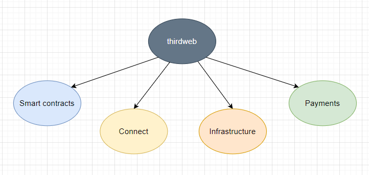

1. **Smart-contracts**. Enables safe deployment of your own smart contracts or the platform's audited smart contracts on any EVM-compatible network, interact with smart contracts.
2. **Connect**. Offers a UI component for user wallet connection. Additionally, it allows configuring an abstract wallet (AA) or web2 authentication (via login and password, social networks).
3. **Infrastructure**. Provides decentralized file storage based on IPFS, rpc endpoints, and an HTTP server with the ability to call smart contracts.
4. **Payments**. Selling NFTs using a credit card, gasless transactions (no gas transactions for users).

## Features

Let's specifically discuss the **functional** capabilities that each of the thirdweb products offers.

### Contracts

The product allows you to work safely with smart contracts on any EVM-compatible network. Below, let's break down the constituent tools for working with smart contracts.

#### Explore

Represents a pre-built set of smart contracts created by the thirdweb team. Covers the most common uses of smart contracts (NFTs, marketplaces, airdrops, staking), and a template is implemented for each case.

All contracts are available on the [explore](https://thirdweb.com/explore) page.

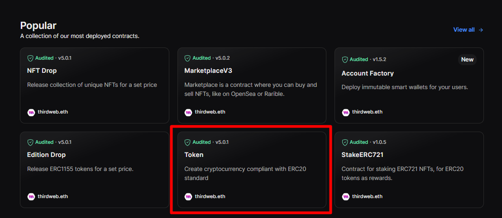

You can choose any of the available smart contract templates. Let's look at the simplest one, the token template.

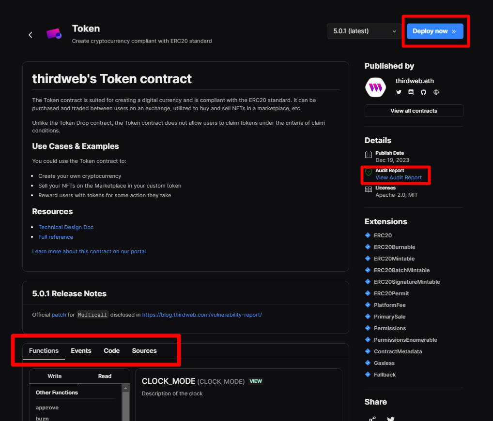

It's nice that the contracts have undergone an audit; there's an audit report from the company [macro](https://0xmacro.com/) available for review. It's good practice for the protocol to be transparent about its smart contract audits.

In the top right corner, there is a `Deploy` button, and the developer can deploy the ready-made token template. The panel in the middle of the page provides descriptions of the function, events of the smart contract, code (this is the code for interacting with the smart contract from the frontend), and smart contract source code. It's quite convenient, and I easily got a deployed and verified token contract on the [Sepolia](https://sepolia.etherscan.io/address/0x247876BBaF940BC0721678057277522926B85B04#code) network.

_Important!_ The token contract is simple, commonly used. However, in my opinion, to understand how to interact with any of the templates, the developer will have to sweat over the description and documentation for it. In my view, the most useful tab here is `source`, as the primary source of what the smart contract does.

All templates can be found in the [repository](https://github.com/thirdweb-dev/contracts/tree/90ca7b442ba9534134bf627888e16ae818d2ec28/contracts/prebuilts).

The documentation is quite detailed and allows one to manage without a smart contract developer.

#### Build

Build or **Solidity SDK** is a tool designed to help more effectively create your own smart contracts.

It is assumed that we should install a set of ready-made smart contracts as a dependency inside our project. For example, the command for Foundry:

```bash
forge install https://github.com/thirdweb-dev/contracts
```

Next, we use this as a set of base contracts (similar to the [OpenZeppelin](https://www.openzeppelin.com/) library), and our smart contracts inherit from the Solidity SDK smart contracts.

_Opinion!_ I would suggest using this as a source of inspiration, but nothing more. Peek at a case and replicate it in your smart contracts. It's not necessary to pull in a large collection of work that won’t be used in the project.

A list of such work can be found in the documentation, in the [build](https://portal.thirdweb.com/contracts/build/base-contracts) section. Sections for developments under each standard are highlighted in red.

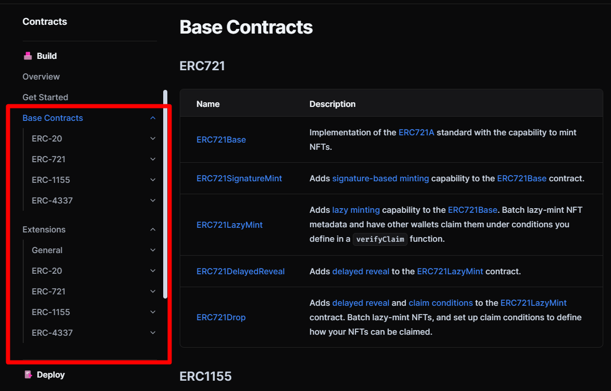

Why do I say it's better to treat this as developments? Let's take a look at the smart contract `ERC721Base.sol`. It claims that the contract uses the optimization of [ERC721A](https://www.erc721a.org/).

That's interesting! Then my question is: "Under the hood, are we also pulling the repository with ERC721A?"

Let's examine [ERC721Base.sol](https://github.com/thirdweb-dev/contracts/blob/main/contracts/base/ERC721Base.sol#L33). It inherits from `ERC721AQueryable.sol`, which in turn inherits from [ERC721A.sol](https://github.com/thirdweb-dev/contracts/blob/main/contracts/eip/ERC721A.sol).

Now, let's look at the most recent optimized version of the original [ERC721A.sol](https://github.com/chiru-labs/ERC721A/blob/main/contracts/ERC721A.sol). Notice the difference? Completely different code. That’s why I believe the SDK can be used as a good robust set of templates, but don't forget about the original or better solutions.

#### Deploy

This is a tool for deploying smart contracts. All simple, tells us the [documentation](https://portal.thirdweb.com/contracts/deploy/overview), we go to the project with smart contracts and run just one command:

```bash
npx thirdweb deploy
```

Next, thirdweb automatically finds and verifies smart contracts, opens an informational dashboard, and easily guides you through the deployment process.

I tried it out with one of my home projects, which has quite a few contracts, about 15, and I ran `npx thirdweb deploy`. After authenticating in the browser, I was prompted to choose a smart contract for deployment. The first inconvenience is that the tool, of course, suggests deploying all the found contracts.

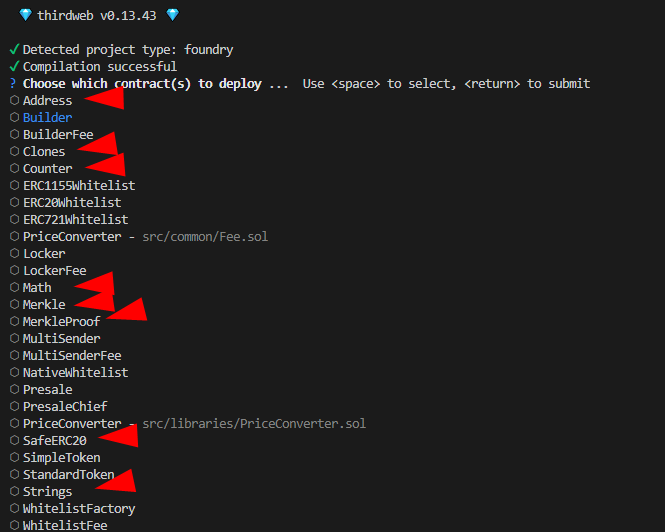

Remix, for example, also always offers to independently choose a contract for deployment among all possible ones.

After selecting the smart contract, I chose `Builder.sol`, and a link was generated that sends to a browser where the interface shows the deployment parameters of the smart contract.

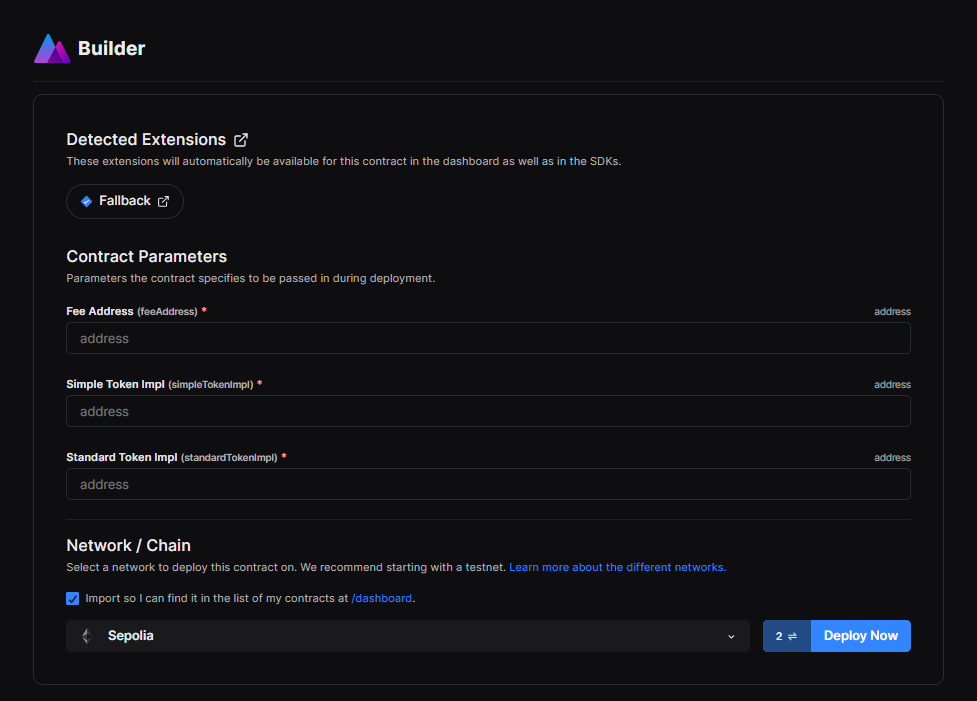

After filling in the fields for the smart contract constructor, I successfully deployed it. Verification must be done separately, but my skepticism towards this tool has evaporated anyway. The deployment was fast and convenient. I'm impressed!

_Opinion!_ However, I believe that the tool is suitable for deploying a single smart contract. When it is necessary to deploy a protocol with many interconnected contracts and various settings, I would still use deployment scripts from Foundry or Hardhat (preferably Foundry).

#### Publish

This tool is also about deploying smart contracts, with the difference that the deployment aim is for collaborative use. That is, you can share your smart contract with other developers for testing and study. A separate page will be specifically created for such a smart contract.

To start, you need to run the following command at the root of the project:

```bash
npx thirdweb publish
```

The further process is very similar to the deployment process. I published the smart contract `Builder.sol` from my home project. Now you can evaluate the quality of my [code](https://thirdweb.com/0x9b5DCAA3002d77fB9dEDfc1006838d08977a3432/Builder). 😅

#### Interact

A tool for interacting with deployed smart contracts. Supports several languages: SDK for Unity, TypeScript, React, Python, and GO.

From the [documentation](https://portal.thirdweb.com/typescript/v4) for TypeScript, I saw capabilities like:
- Direct calls to smart contracts (**call**)
- Invoking functions of smart contracts based on ABI
- Deploying smart contracts (**deployBuiltInContract**)
- Verifying smart contracts (**verifyContract**)

The complete TypeScript SDK is [here](https://portal.thirdweb.com/references/typescript/v4/types). As a Solidity developer, I can't judge whether it's more convenient to use than more traditional libraries (ethers.js, wagmi).

### Connect

A product that handles connecting user wallets inside an application. It consists of several parts, which I will describe below.

#### Connect component

Offers a ready-made **ConnectWallet** or **Wallet SDK** component for creating your own user wallet connection interface.

To understand what can be customized with this product, thirdweb has created a separate [playground](https://thirdweb.com/dashboard/connect/playground), where you can create your own modal window.

I assembled such a window.

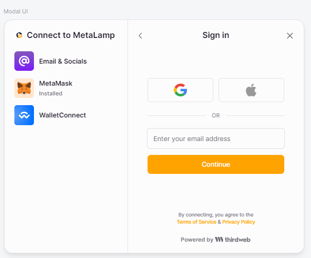

#### Embedded Wallet

This product allows users to log into the application using their email address and password or social networks. After authentication, a wallet is provided, which can be used to perform network actions such as creating NFTs and sending transactions.

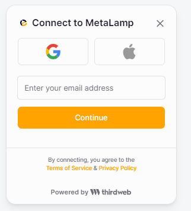

_Important!_ However, it's not that simple; there is a limit of 1000 active wallets per month in the free plan at the moment.

An experienced developer should ask, how is the wallet created, and where is the private key of this wallet stored if the user logs in via email and password?

The private key is created and split into three parts using the [Shamir's Secret Sharing](https://en.wikipedia.org/wiki/Shamir%27s_secret_sharing) algorithm:
- The first part is stored on the user's device
- The second part is encrypted and stored in Amazon KMS
- The third part is encrypted with the user's authentication data and stored in Amazon KMS

This means that although thirdweb **stores** parts of the keys on its servers, they **cannot decrypt** this key.

_Important!_ If the user loses access to their email, they will not be able to regain access.

Connecting a wallet in the code to get started is quite simple.


```js
import {
  ThirdwebProvider,
  ConnectWallet,
  embeddedWallet,
} from "@thirdweb-dev/react";

export default function App() {
  return (
    <ThirdwebProvider
      activeChain="goerli"
      clientId="YOUR_CLIENT_ID"
      supportedWallets={[embeddedWallet()]}
    >
      <ConnectWallet />
    </ThirdwebProvider>
  );
}
```

#### Account Abstraction (AA)

Enables account abstraction out-of-the-box according to the [ERC-4337](https://eips.ethereum.org/EIPS/eip-4337) standard. It includes the most crucial functionalities:
- Gasless transactions
- Multiple owners for a single wallet
- Execution of transactions (single and batch)

In my opinion, as someone who has worked a bit with AA, the valuable part is not just that this functionality exists. What's cool is that it can be used in conjunction with the **Embedded Wallet**.

Let me explain what I mean. AA consists of a group of smart contracts that allow a user's wallet to be a regular smart contract. But to use such an abstraction (understood as calls on the wallet smart contract), you unavoidably need an [EOA](https://ethereum.org/en/developers/docs/accounts/#types-of-account). This means you need a private key for this account, which the user needs to store. It's not always clear to the user what the abstraction is if they still have a private key and use the same Metamask for signing transactions.

Here, the combination of **AA** with **Embedded Wallet** truly allows abstracting the user's wallet and managing it using only their email and password.

For us, developers, it might be really convenient that the full implementation of the abstraction process can be easily done using just one thirdweb product, so we don't have to mix and match: a separate service for AA (like [Alchemy](https://accountkit.alchemy.com/packages/aa-alchemy/)) + a service for storing private keys ([Fireblocks MPC](https://www.fireblocks.com/what-is-mpc/)).

#### Auth

This tool is an SDK for developers that allows integrating everything described in the **Connect** product sections. With Auth, developers can create applications with secure and independent authentication.

Under the hood, authentication works based on [JWT](https://portal.thirdweb.com/connect/auth/how-it-works#how-does-authentication-work). User identification occurs through a web3 wallet and to prove that it's really them, users need to provide their signature. In this sense, it's standard for web3 applications.

An example of authentication on Next.js can be seen [here](https://github.com/thirdweb-dev/js/tree/main/packages/auth).

### Engine

This is an HTTP server for calling smart contracts using proprietary wallets.

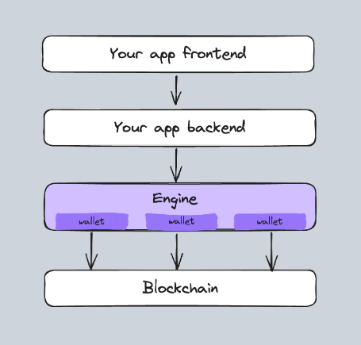

It is meant to be a layer between your application and the blockchain, providing API endpoints for more user-friendly interaction with the blockchain.

From the list of functionalities, I liked the following:
1. **Creation and management of service wallets**. It allows you to create and manage your wallets on the backend. This can help organize gasless transactions or manage the protocol on behalf of the administrator.
2. **Account abstraction**. Full organization of account abstraction with deploying smart contracts and conducting transactions on behalf of users.
3. **Gasless transactions**. Often missing in applications where users have minimal blockchain knowledge and it's hard to explain why they need Metamask, to pay for gas, to receive tokens (e.g., games).
4. **Transaction scanner**. In every second application I wrote, it's necessary to index events. Here, indexing will be handled by the engine.

_Important!_ You can deploy the engine in your own infrastructure or use thirdweb's capabilities and not worry about setup and maintenance.

The guides offer several examples. The first is [airdrops NFT](https://portal.thirdweb.com/engine/guides/airdrop-nfts), the second is [NFT payment](https://portal.thirdweb.com/engine/guides/nft-checkout).

Having reviewed all the documentation, honestly, I don't see the point in using **engine** in my projects when I have a qualified team that can implement all necessary functionalities for interacting with the blockchain internally. It might be relevant when the team lacks the qualifications, and you need to set up interaction with the blockchain quickly. But there's a downside, you have to deal with the engine, which acts as an intermediary, but you still need to understand how the blockchain works. It seems like saving time at the start by implementing your own interaction could backfire in the future.

### Payments

Offers a very simple way to handle payments when purchasing NFTs.

Thirdweb accepts **fiat payments** through credit and debit cards, Apple Pay, and Google Pay. It also supports **cryptocurrency payments** for some popular blockchains (Ethereum, Polygon, Avalanche). More details on support can be found [here](https://portal.thirdweb.com/payments#supported-chains-and-currencies-for-developers).

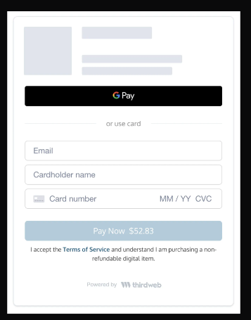

Checkout components do not support the Russian language, but they do support English, French, Japanese, Chinese, and a few others.

In my view, a significant feature here could be the link for a one-time payment. It's a pre-configured checkout interface for each buyer that allows making no more than one purchase.

## Applications

**Thirdweb** suggests using it in several subject areas:

- Solutions for the **game** industry. Integration of web3 mechanics into games.
- **Minting**. Creating and using NFTs.
- **Loyalty programs**. Implements special cards, in the form of NFTs, which open up new opportunities for the user experience.
- **Marketplace functionality**. The ability to add functionality for buying/selling assets.
- **Development tools**. Using the product as a toolkit (wallets, contracts, payments, etc.) for building your own application.
- **Onboarding to web3**. Offers a well-thought-out, ergonomic solution for user experience in connecting wallets and starting to work with a web3 application.

## Pricing

As of the writing of this article, thirdweb offers three **plans**:
1. **Starter**. Free plan. Up to 1000 active wallets per month. 1Gb for pinning files on IPFS. 100 requests per second.
2. **Growth**. $99 per month. 5Gb for pinning files on IPFS. 500 requests per second. Support hours.
3. **Pro**. Custom plan for teams. Includes support, additional customization, and other agreements.

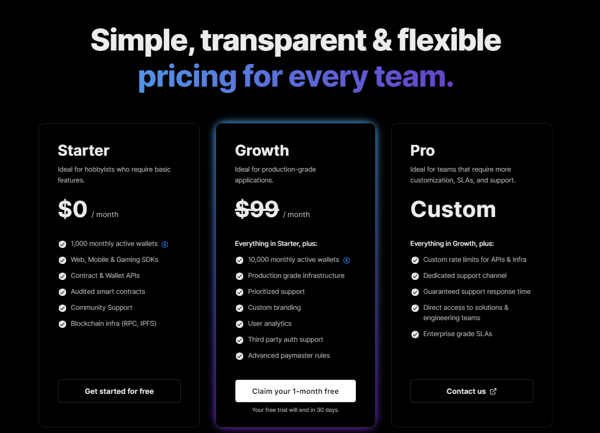

In my opinion, the free plan is good and allows you to build an MVP. It's perfect for testing a hypothesis, and then you can think about upgrading your plan.

Current pricing for thirdweb plans can be found in the [pricing](https://thirdweb.com/pricing) section.

## Conclusion

The product is undoubtedly large, containing many tools, various use cases, tons of documentation, and guides. Does it deserve the attention of developers? Definitely, at least to try to implement it within a real project. I think thirdweb can help in cases where the team's resources are limited and there are no in-house smart contract developers or experienced backend specialists for blockchain interactions.

If you have a self-sufficient team, in my opinion, this tool might be superfluous or used selectively, for example for fiat payments for NFTs or account abstraction + embedded wallet.

## Links

1. [Thirdweb](https://thirdweb.com/)
2. [Thirdweb github](https://github.com/thirdweb-dev)
